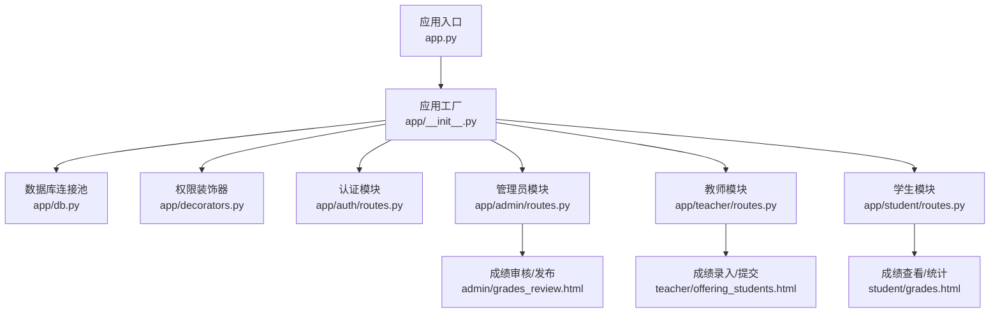
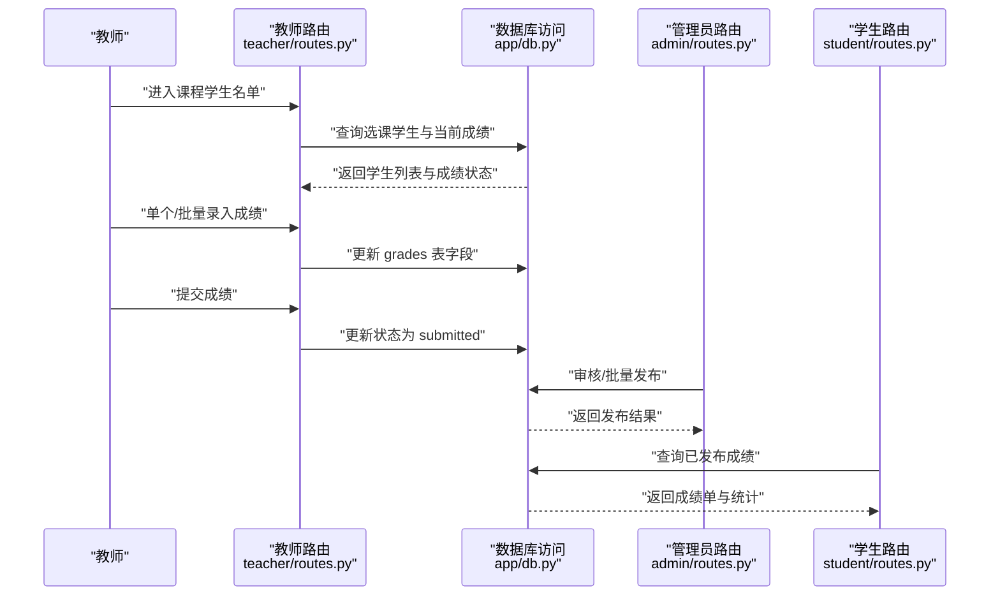
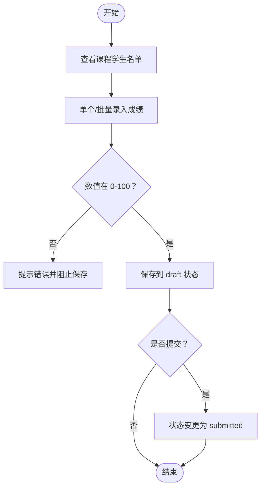
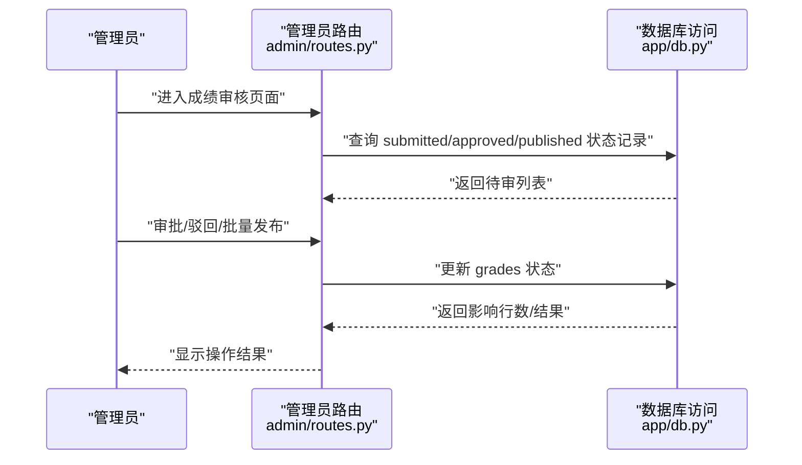
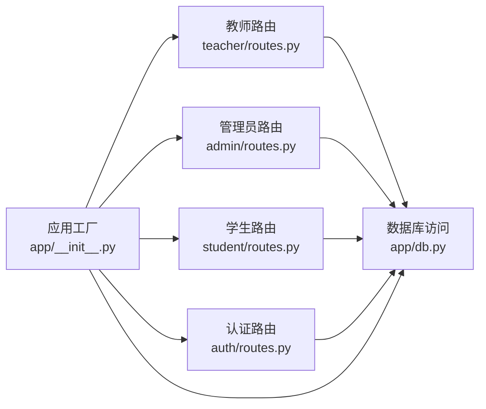

# 成绩管理

<cite>
**本文引用的文件**
- [app.py](file://app.py)
- [app/__init__.py](file://app/__init__.py)
- [app/db.py](file://app/db.py)
- [app/decorators.py](file://app/decorators.py)
- [app/admin/routes.py](file://app/admin/routes.py)
- [app/teacher/routes.py](file://app/teacher/routes.py)
- [app/student/routes.py](file://app/student/routes.py)
- [app/auth/routes.py](file://app/auth/routes.py)
- [README.md](file://README.md)
</cite>

## 目录
1. [简介](#简介)
2. [项目结构](#项目结构)
3. [核心组件](#核心组件)
4. [架构总览](#架构总览)
5. [详细组件分析](#详细组件分析)
6. [依赖分析](#依赖分析)
7. [性能考虑](#性能考虑)
8. [故障排查指南](#故障排查指南)
9. [结论](#结论)
10. [附录](#附录)

## 简介
本操作文档围绕“成绩管理”功能，系统性说明从教师录入到管理员审核发布的完整流程，涵盖单个与批量成绩录入、成绩模板与格式校验、成绩锁定与权限控制、操作日志、统计分析与异常检测、以及成绩申诉处理流程。文档同时给出面向非技术用户的易懂说明与面向开发者的源码路径定位，帮助快速上手与问题定位。

## 项目结构
系统采用 Flask 微服务化蓝图组织，按角色拆分为认证、管理员、教师、学生四个模块；数据库访问通过统一的连接池与查询封装；权限控制基于装饰器与登录状态；模板渲染使用 Jinja2，前端静态资源位于 static 目录。

图表来源
- [app.py:1-13](file://app.py#L1-L13)
- [app/__init__.py:29-93](file://app/__init__.py#L29-L93)
- [app/db.py:10-121](file://app/db.py#L10-L121)
- [app/decorators.py:1-26](file://app/decorators.py#L1-L26)
- [app/admin/routes.py:492-583](file://app/admin/routes.py#L492-L583)
- [app/teacher/routes.py:137-275](file://app/teacher/routes.py#L137-L275)
- [app/student/routes.py:172-199](file://app/student/routes.py#L172-L199)

章节来源
- [README.md:46-87](file://README.md#L46-L87)
- [app.py:1-13](file://app.py#L1-L13)
- [app/__init__.py:29-93](file://app/__init__.py#L29-L93)

## 核心组件
- 应用工厂与蓝图注册：负责初始化 CSRF、数据库连接池、Flask-Login 用户加载、各模块蓝图注册与全局错误处理。
- 数据库访问层：提供连接池、查询、写入、存储过程调用、分页等通用方法。
- 权限装饰器：统一登录与角色校验，确保不同角色只能访问对应功能。
- 模块化路由：
  - 教师模块：面向课程与学生名单，提供单个/批量成绩录入、提交、撤回、统计接口。
  - 管理员模块：面向成绩审核与发布，支持单条/批量发布，查看系统日志与统计分析。
  - 学生模块：面向个人成绩与成绩单，提供查看、统计与预警信息展示。
  - 认证模块：登录、注册、个人信息与密码修改。

章节来源
- [app/__init__.py:29-93](file://app/__init__.py#L29-L93)
- [app/db.py:43-121](file://app/db.py#L43-L121)
- [app/decorators.py:7-26](file://app/decorators.py#L7-L26)
- [app/teacher/routes.py:137-333](file://app/teacher/routes.py#L137-L333)
- [app/admin/routes.py:492-639](file://app/admin/routes.py#L492-L639)
- [app/student/routes.py:172-220](file://app/student/routes.py#L172-L220)
- [app/auth/routes.py:33-186](file://app/auth/routes.py#L33-L186)

## 架构总览
系统围绕“课程—选课—成绩—审核—发布—查看”的主业务链路构建，数据库层通过存储过程与触发器实现自动计算与状态流转，前端模板通过蓝图路由渲染。

图表来源
- [app/teacher/routes.py:162-220](file://app/teacher/routes.py#L162-L220)
- [app/teacher/routes.py:238-275](file://app/teacher/routes.py#L238-L275)
- [app/admin/routes.py:511-583](file://app/admin/routes.py#L511-L583)
- [app/student/routes.py:172-199](file://app/student/routes.py#L172-L199)

## 详细组件分析

### 成绩录入与修改流程
- 单个学生录入
  - 教师在“课程学生名单”页面对指定学生的平时/期末成绩进行录入，系统进行 0-100 的数值范围校验，防止异常值入库。
  - 录入后可直接保存，若已提交则禁止修改。
- 批量成绩导入
  - 教师可在同一页面通过批量编辑接口一次性更新多个学生的成绩，系统逐项校验并原子地更新 draft 状态下的记录。
- 提交与撤回
  - 教师提交后状态变为 submitted，等待管理员审核；若处于 submitted 状态可撤回至 draft。

图表来源
- [app/teacher/routes.py:162-220](file://app/teacher/routes.py#L162-L220)
- [app/teacher/routes.py:238-275](file://app/teacher/routes.py#L238-L275)

章节来源
- [app/teacher/routes.py:162-220](file://app/teacher/routes.py#L162-L220)
- [app/teacher/routes.py:238-275](file://app/teacher/routes.py#L238-L275)

### 成绩审核与发布流程
- 审核
  - 管理员在“成绩审核”页面查看 submitted 状态的成绩，可批准或驳回；批准后状态变为 approved。
- 发布
  - 管理员可单条发布或批量发布 approved 状态的成绩，状态变为 published，学生端可见。
- 批量发布
  - 一键将所有 approved 成绩统一发布，提升效率并减少遗漏。

图表来源
- [app/admin/routes.py:492-583](file://app/admin/routes.py#L492-L583)
- [app/db.py:43-121](file://app/db.py#L43-L121)

章节来源
- [app/admin/routes.py:492-583](file://app/admin/routes.py#L492-L583)

### 成绩录入界面功能说明
- 单个学生录入
  - 在“课程学生名单”页面，教师可直接编辑每个学生的平时/期末成绩，系统即时校验数值范围。
- 批量成绩导入
  - 支持在同一页批量编辑多个学生的成绩，系统逐项校验并原子更新 draft 状态记录。
- 成绩模板与格式验证
  - 系统通过表单校验与后端数值范围约束保证数据合法性；若超出 0-100 或格式不正确，将提示错误并阻止保存。
- 成绩锁定与修改权限控制
  - 已提交（submitted）状态的成绩不可修改；仅 draft 状态允许编辑；批量编辑时系统对每条记录加锁检查，避免并发冲突。

章节来源
- [app/teacher/routes.py:162-220](file://app/teacher/routes.py#L162-L220)
- [app/teacher/routes.py:238-275](file://app/teacher/routes.py#L238-L275)

### 成绩管理安全机制
- 登录与角色控制
  - 使用装饰器强制登录与角色校验，确保只有教师可录入/提交成绩，管理员可审核/发布，学生仅可查看。
- 操作日志
  - 系统记录登录、注册、成绩录入/修改/提交/审核/发布、批量发布、密码修改等关键动作，便于审计与追踪。
- 数据一致性
  - 批量编辑使用事务与行级锁，确保多用户并发场景下的数据一致性。
- 状态机约束
  - 成绩状态遵循 draft → submitted → approved → published 的线性流转，跨状态修改受控。

章节来源
- [app/decorators.py:7-26](file://app/decorators.py#L7-L26)
- [app/admin/routes.py:511-583](file://app/admin/routes.py#L511-L583)
- [app/teacher/routes.py:162-220](file://app/teacher/routes.py#L162-L220)
- [app/teacher/routes.py:238-275](file://app/teacher/routes.py#L238-L275)

### 成绩统计分析功能
- 班级平均分与最高/最低分
  - 教师可在“课程统计”接口获取班级总人数、平均分、最高/最低分与及格率等指标。
- 分数段分布
  - 按 90-100、80-89、70-79、60-69、<60 分段统计人数，用于直观展示整体表现。
- 异常成绩检测
  - 管理员可通过“学业预警”模块筛选高/中/低风险学生，结合历史成绩与选课情况识别潜在问题。
- 成绩发布统计
  - 管理员仪表盘显示已发布成绩数量，辅助评估发布进度。

章节来源
- [app/teacher/routes.py:277-333](file://app/teacher/routes.py#L277-L333)
- [app/admin/routes.py:612-639](file://app/admin/routes.py#L612-L639)
- [app/admin/routes.py:641-691](file://app/admin/routes.py#L641-L691)

### 成绩申诉处理流程
- 适用对象：学生在查看已发布成绩后如对分数有异议，可发起申诉。
- 处理步骤建议：
  1) 学生在“我的成绩”页面提交申诉（需在模板中新增对应入口与表单）。
  2) 教师在“课程学生名单”页面查看申诉标记，必要时重新核对与调整成绩。
  3) 管理员在“成绩审核”页面复核申诉后的成绩状态变更，确保合规发布。
  4) 系统记录申诉与处理日志，便于后续审计。
- 当前实现提示：当前代码未包含专门的“申诉”字段或路由，需在模板与路由中扩展相应功能。

章节来源
- [app/student/routes.py:172-199](file://app/student/routes.py#L172-L199)
- [app/teacher/routes.py:137-160](file://app/teacher/routes.py#L137-L160)
- [app/admin/routes.py:492-583](file://app/admin/routes.py#L492-L583)

## 依赖分析
- 模块耦合
  - 教师模块与管理员模块通过 grades 表状态字段耦合，形成清晰的职责边界。
  - 学生模块依赖视图与存储过程获取已发布成绩与统计信息。
- 外部依赖
  - 数据库：MySQL 8.x，使用 PyMySQL 与 DBUtils 连接池。
  - 前端：Bootstrap 5 + Chart.js，用于统计图表渲染。
- 可能的循环依赖
  - 路由模块间通过蓝图注册解耦，未见循环导入迹象。

图表来源
- [app/teacher/routes.py:1-333](file://app/teacher/routes.py#L1-L333)
- [app/admin/routes.py:1-692](file://app/admin/routes.py#L1-L692)
- [app/student/routes.py:1-220](file://app/student/routes.py#L1-L220)
- [app/auth/routes.py:1-186](file://app/auth/routes.py#L1-L186)
- [app/db.py:1-121](file://app/db.py#L1-L121)
- [app/__init__.py:29-93](file://app/__init__.py#L29-L93)

章节来源
- [app/teacher/routes.py:1-333](file://app/teacher/routes.py#L1-L333)
- [app/admin/routes.py:1-692](file://app/admin/routes.py#L1-L692)
- [app/student/routes.py:1-220](file://app/student/routes.py#L1-L220)
- [app/auth/routes.py:1-186](file://app/auth/routes.py#L1-L186)
- [app/db.py:1-121](file://app/db.py#L1-L121)
- [app/__init__.py:29-93](file://app/__init__.py#L29-L93)

## 性能考虑
- 数据库连接池：通过 DBUtils 池化连接，降低频繁连接开销，建议合理设置最大连接数与缓存阈值。
- 分页查询：管理员与教师列表均采用分页，避免一次性加载大量数据。
- 存储过程：涉及选课、退课、成绩计算、GPA 计算、审核、预警等逻辑，建议在数据库层面优化索引与视图。
- 前端渲染：统计图表使用 Chart.js，建议在大数据量时启用懒加载与虚拟滚动。

## 故障排查指南
- 登录与权限
  - 若出现 403，请确认当前用户角色与目标路由权限匹配；检查装饰器与登录状态。
- 成绩无法修改
  - 若状态为 submitted，系统会阻止修改；需先撤回至 draft 再编辑。
- 批量导入失败
  - 检查是否有非 0-100 数值或格式错误；确认并发编辑导致的锁冲突。
- 审核/发布异常
  - 确认状态流转是否符合预期（submitted → approved → published）；查看系统日志定位具体错误。
- 日志查看
  - 管理员可在“系统日志”页面按动作类型筛选，定位问题发生时间与操作人。

章节来源
- [app/decorators.py:7-26](file://app/decorators.py#L7-L26)
- [app/admin/routes.py:585-609](file://app/admin/routes.py#L585-L609)
- [app/teacher/routes.py:162-220](file://app/teacher/routes.py#L162-L220)
- [app/teacher/routes.py:238-275](file://app/teacher/routes.py#L238-L275)

## 结论
本系统围绕“课程—选课—成绩—审核—发布—查看”的完整闭环，提供了清晰的角色分工与严谨的状态机控制。教师负责录入与提交，管理员负责审核与发布，学生负责查看与统计。通过连接池、权限装饰器、操作日志与状态机约束，系统在安全性与一致性方面具备良好基础。建议在现有基础上补充“成绩申诉”功能，并持续优化数据库索引与前端交互体验。

## 附录
- 快速启动与数据库初始化参见项目说明。
- 模板文件位于 templates 目录，按角色划分为 admin、teacher、student、auth 四类页面。

章节来源
- [README.md:12-36](file://README.md#L12-L36)
- [README.md:46-87](file://README.md#L46-L87)