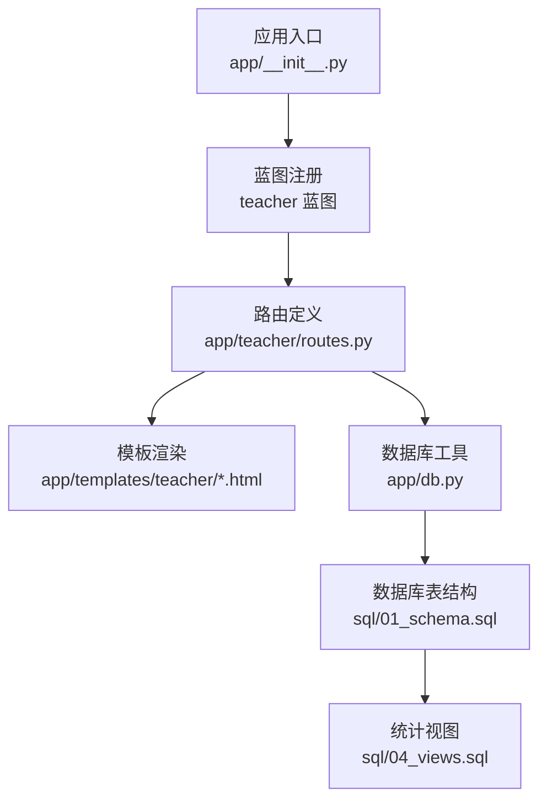
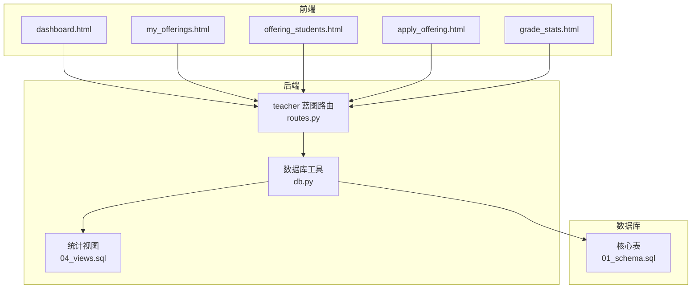
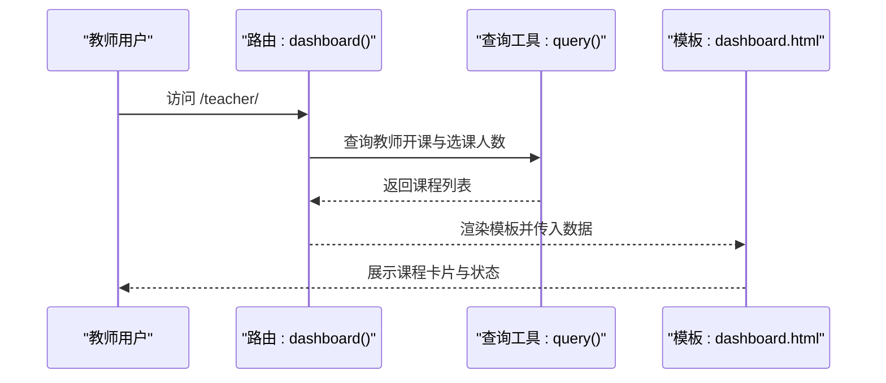
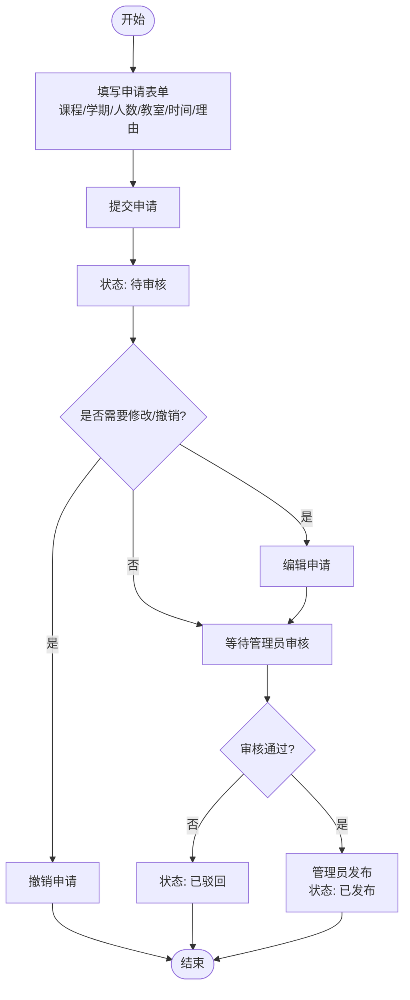
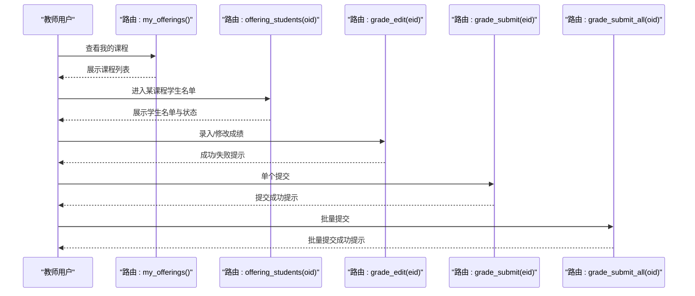
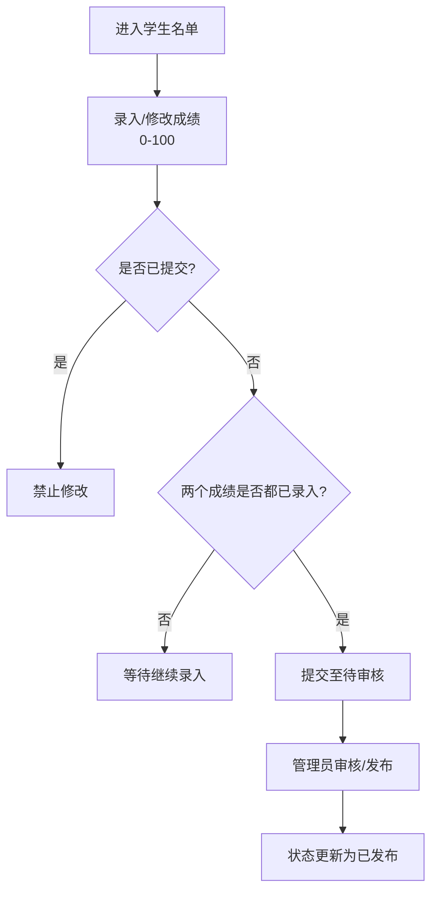
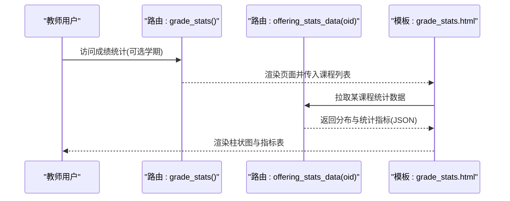
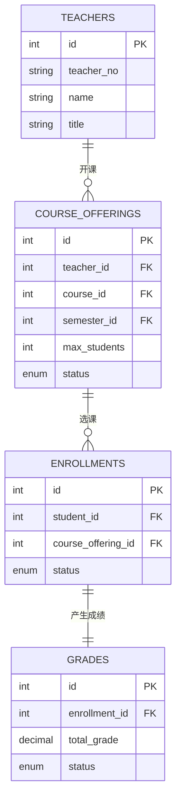
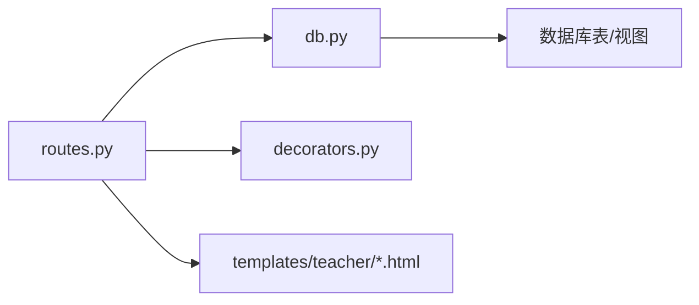

# 教师功能模块

<cite>
**本文引用的文件**
- [routes.py](file://app/teacher/routes.py)
- [dashboard.html](file://app/templates/teacher/dashboard.html)
- [my_offerings.html](file://app/templates/teacher/my_offerings.html)
- [offering_students.html](file://app/templates/teacher/offering_students.html)
- [apply_offering.html](file://app/templates/teacher/apply_offering.html)
- [grade_stats.html](file://app/templates/teacher/grade_stats.html)
- [db.py](file://app/db.py)
- [__init__.py](file://app/__init__.py)
- [decorators.py](file://app/decorators.py)
- [01_schema.sql](file://sql/01_schema.sql)
- [04_views.sql](file://sql/04_views.sql)
- [base.html](file://app/templates/base.html)
</cite>

## 目录
1. [简介](#简介)
2. [项目结构](#项目结构)
3. [核心组件](#核心组件)
4. [架构总览](#架构总览)
5. [详细组件分析](#详细组件分析)
6. [依赖分析](#依赖分析)
7. [性能考虑](#性能考虑)
8. [故障排查指南](#故障排查指南)
9. [结论](#结论)
10. [附录](#附录)

## 简介
本文件面向教师功能模块，围绕教师工作台、开课申请、课程管理、成绩管理与统计、工作量统计等核心能力进行系统化说明。文档以代码与模板为依据，结合数据库结构与视图，给出可操作的流程图、界面设计要点与最佳实践，帮助教师高效完成教学与管理工作。

## 项目结构
教师功能模块位于应用的“teacher”蓝图下，前端模板集中于“app/templates/teacher”。后端路由负责业务逻辑与权限校验，数据库层通过统一的查询与执行工具封装，配合 SQL 脚本中的表结构与视图实现统计分析。

图表来源
- [__init__.py:53-64](file://app/__init__.py#L53-L64)
- [routes.py:1-271](file://app/teacher/routes.py#L1-L271)
- [db.py:43-71](file://app/db.py#L43-L71)
- [01_schema.sql:128-198](file://sql/01_schema.sql#L128-L198)
- [04_views.sql:69-112](file://sql/04_views.sql#L69-L112)

章节来源
- [__init__.py:53-64](file://app/__init__.py#L53-L64)
- [routes.py:1-271](file://app/teacher/routes.py#L1-L271)

## 核心组件
- 教师工作台：展示当前教师所授课程的最新状态与选课人数，支持快速跳转到学生名单。
- 开课申请：提交课程、学期、教室、时间、人数上限与申请理由，支持撤销与编辑待审核申请。
- 课程管理：查看我的课程列表、课程状态、教室与时间安排；进入学生名单页面进行成绩录入与提交。
- 成绩管理：单个与批量成绩录入、修改、提交与审核状态跟踪；支持按学期筛选统计。
- 成绩统计：按课程展示成绩分布柱状图与关键指标（总人数、平均分、最高/最低分、及格率）。
- 工作量统计：基于视图聚合教师开课数、学生总数与学分，用于教学工作量评估。

章节来源
- [routes.py:50-102](file://app/teacher/routes.py#L50-L102)
- [routes.py:67-83](file://app/teacher/routes.py#L67-L83)
- [routes.py:86-102](file://app/teacher/routes.py#L86-L102)
- [routes.py:133-155](file://app/teacher/routes.py#L133-L155)
- [routes.py:158-213](file://app/teacher/routes.py#L158-L213)
- [routes.py:215-271](file://app/teacher/routes.py#L215-L271)
- [04_views.sql:97-112](file://sql/04_views.sql#L97-L112)

## 架构总览
教师功能采用“蓝图 + 模板 + 数据库工具”的分层架构。蓝图统一进行登录与角色校验，路由函数负责业务处理与数据查询，模板负责渲染页面与交互。数据库工具提供连接池、查询与事务封装，SQL 脚本定义核心表与统计视图。

图表来源
- [routes.py:1-271](file://app/teacher/routes.py#L1-L271)
- [db.py:43-71](file://app/db.py#L43-L71)
- [01_schema.sql:128-198](file://sql/01_schema.sql#L128-L198)
- [04_views.sql:69-112](file://sql/04_views.sql#L69-L112)

## 详细组件分析

### 教师工作台（Dashboard）
设计理念
- 以卡片形式直观展示当前教师的课程与状态，突出“选课人数/上限”与“状态徽章”，便于快速掌握教学资源与进度。
- 提供“查看学生”按钮，一键进入该课程的学生名单页面，减少跳转层级。

关键实现点
- 查询当前教师的所有开课记录，关联课程、学期，并统计已选人数。
- 使用状态枚举映射不同徽章颜色，提升可读性。
- 无开课记录时提示“暂无开课记录，请先申请开课”。

图表来源
- [routes.py:50-64](file://app/teacher/routes.py#L50-L64)
- [dashboard.html:1-27](file://app/templates/teacher/dashboard.html#L1-L27)

章节来源
- [routes.py:50-64](file://app/teacher/routes.py#L50-L64)
- [dashboard.html:1-27](file://app/templates/teacher/dashboard.html#L1-L27)

### 开课申请流程
流程概述
- 教师在“申请开课”页面填写课程、学期、人数上限、教室、时间与申请理由，提交后进入“待审核”状态。
- 在“我的课程”页面可对“待审核”的申请进行编辑或撤销。
- 管理员审核通过后课程进入“已通过”，随后发布后进入“已发布”。

图表来源
- [routes.py:67-83](file://app/teacher/routes.py#L67-L83)
- [routes.py:86-102](file://app/teacher/routes.py#L86-L102)
- [routes.py:105-114](file://app/teacher/routes.py#L105-L114)
- [routes.py:117-131](file://app/teacher/routes.py#L117-L131)

章节来源
- [routes.py:67-83](file://app/teacher/routes.py#L67-L83)
- [routes.py:86-102](file://app/teacher/routes.py#L86-L102)
- [routes.py:105-114](file://app/teacher/routes.py#L105-L114)
- [routes.py:117-131](file://app/teacher/routes.py#L117-L131)
- [apply_offering.html:1-33](file://app/templates/teacher/apply_offering.html#L1-L33)
- [my_offerings.html:1-62](file://app/templates/teacher/my_offerings.html#L1-L62)

### 课程管理（已开课程查看与学生名单）
功能说明
- “我的课程”页面展示课程ID、名称、学期、选课人数/上限、教室、时间与状态，并提供“学生名单”入口。
- 进入“选课学生名单”页面后，可对每个学生的平时成绩、期末成绩进行录入或修改；满足条件后可提交；支持批量提交整门课程的成绩。

图表来源
- [routes.py:86-102](file://app/teacher/routes.py#L86-L102)
- [routes.py:133-155](file://app/teacher/routes.py#L133-L155)
- [routes.py:158-197](file://app/teacher/routes.py#L158-L197)
- [routes.py:200-212](file://app/teacher/routes.py#L200-L212)

章节来源
- [routes.py:86-102](file://app/teacher/routes.py#L86-L102)
- [routes.py:133-155](file://app/teacher/routes.py#L133-L155)
- [routes.py:158-197](file://app/teacher/routes.py#L158-L197)
- [routes.py:200-212](file://app/teacher/routes.py#L200-L212)
- [offering_students.html:1-65](file://app/templates/teacher/offering_students.html#L1-L65)

### 成绩管理（录入、修改、审核与发布）
流程说明
- 录入/修改：教师在学生名单页面对单个学生进行平时与期末成绩录入，数值范围限制在0-100；若已提交则不可修改。
- 提交：当两个成绩均非空时，可提交至“待审核”状态。
- 批量提交：在学生名单页面可一键提交该课程所有已录入且满足条件的草稿成绩。
- 审核与发布：由管理员在后台进行审核与发布，教师侧仅能查看状态变化。

图表来源
- [routes.py:158-197](file://app/teacher/routes.py#L158-L197)
- [routes.py:200-212](file://app/teacher/routes.py#L200-L212)
- [offering_students.html:14-43](file://app/templates/teacher/offering_students.html#L14-L43)

章节来源
- [routes.py:158-197](file://app/teacher/routes.py#L158-L197)
- [routes.py:200-212](file://app/teacher/routes.py#L200-L212)
- [offering_students.html:14-43](file://app/templates/teacher/offering_students.html#L14-L43)

### 成绩统计（分布、指标与可视化）
功能说明
- 教师可在“成绩统计”页面按学期筛选，查看所授课程的成绩分布柱状图与关键指标（总人数、平均分、最高/最低分、及格率）。
- 统计数据通过 AJAX 异步拉取，前端使用 Canvas 渲染柱状图并展示表格指标。

图表来源
- [routes.py:215-234](file://app/teacher/routes.py#L215-L234)
- [routes.py:237-271](file://app/teacher/routes.py#L237-L271)
- [grade_stats.html:1-50](file://app/templates/teacher/grade_stats.html#L1-L50)

章节来源
- [routes.py:215-234](file://app/teacher/routes.py#L215-L234)
- [routes.py:237-271](file://app/teacher/routes.py#L237-L271)
- [grade_stats.html:1-50](file://app/templates/teacher/grade_stats.html#L1-L50)

### 教师工作量统计（指标计算）
指标说明
- 基于视图 v_teacher_workload 聚合教师的开课数、学生总数与总学分，用于教学工作量评估。
- 可按学期维度查看，便于统计与报表生成。

图表来源
- [01_schema.sql:82-95](file://sql/01_schema.sql#L82-L95)
- [01_schema.sql:128-155](file://sql/01_schema.sql#L128-L155)
- [01_schema.sql:158-174](file://sql/01_schema.sql#L158-L174)
- [01_schema.sql:177-198](file://sql/01_schema.sql#L177-L198)
- [04_views.sql:97-112](file://sql/04_views.sql#L97-L112)

章节来源
- [04_views.sql:97-112](file://sql/04_views.sql#L97-L112)

## 依赖分析
- 路由层依赖数据库工具进行查询与写入，确保事务一致性与连接复用。
- 权限控制通过装饰器实现，保证只有教师角色可访问对应路由。
- 模板依赖蓝图提供的上下文变量与 URL 生成函数，确保页面导航与交互正确。

图表来源
- [routes.py:1-271](file://app/teacher/routes.py#L1-L271)
- [db.py:43-71](file://app/db.py#L43-L71)
- [decorators.py:13-25](file://app/decorators.py#L13-L25)

章节来源
- [routes.py:1-271](file://app/teacher/routes.py#L1-L271)
- [db.py:43-71](file://app/db.py#L43-L71)
- [decorators.py:13-25](file://app/decorators.py#L13-L25)

## 性能考虑
- 连接池：数据库工具通过连接池减少连接开销，建议合理设置最小/最大缓存与最大连接数。
- 分页与统计：对于大列表与统计页面，优先使用视图与聚合查询，避免在应用层做大规模内存计算。
- 前端异步：成绩统计页面采用 AJAX 拉取数据，降低首屏压力，提升交互体验。
- 索引与约束：核心表具备必要索引与约束，有助于查询与数据完整性保障。

## 故障排查指南
常见问题与处理
- 无权限访问：确认当前用户角色为“教师”，并已登录；蓝图前置校验会拒绝非教师访问。
- 无法修改已提交成绩：成绩一旦提交即锁定，需等待管理员发布后方可再次修改。
- 申请状态限制：仅“待审核”状态可编辑或撤销，其他状态不可操作。
- 成绩范围校验：录入成绩必须在0-100范围内，超出范围将提示错误。
- 批量提交条件：仅对已录入且两个成绩均非空的草稿进行批量提交。

章节来源
- [decorators.py:13-25](file://app/decorators.py#L13-L25)
- [routes.py:105-114](file://app/teacher/routes.py#L105-L114)
- [routes.py:117-131](file://app/teacher/routes.py#L117-L131)
- [routes.py:158-197](file://app/teacher/routes.py#L158-L197)
- [routes.py:200-212](file://app/teacher/routes.py#L200-L212)

## 结论
教师功能模块围绕“工作台—开课—课程—成绩—统计—工作量”形成完整闭环，既满足日常教学管理需求，又提供可视化与统计分析支撑。通过严格的权限控制、状态机管理与前后端协作，有效提升了教学工作的规范性与效率。

## 附录
- 导航入口：教师侧导航包含“控制台、申请开课、我的课程、成绩统计”等入口，便于快速定位功能。
- 模板命名规范：模板文件按功能模块命名，便于维护与扩展。
- 数据模型：核心实体包括用户、教师、课程、开课、选课、成绩等，彼此通过外键关联，形成清晰的数据关系。

章节来源
- [base.html:35-39](file://app/templates/base.html#L35-L39)