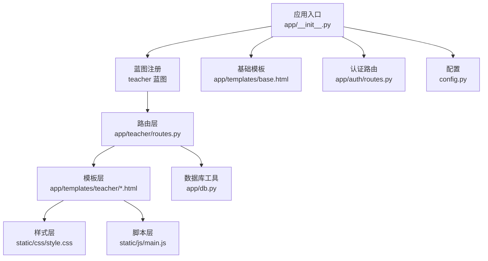
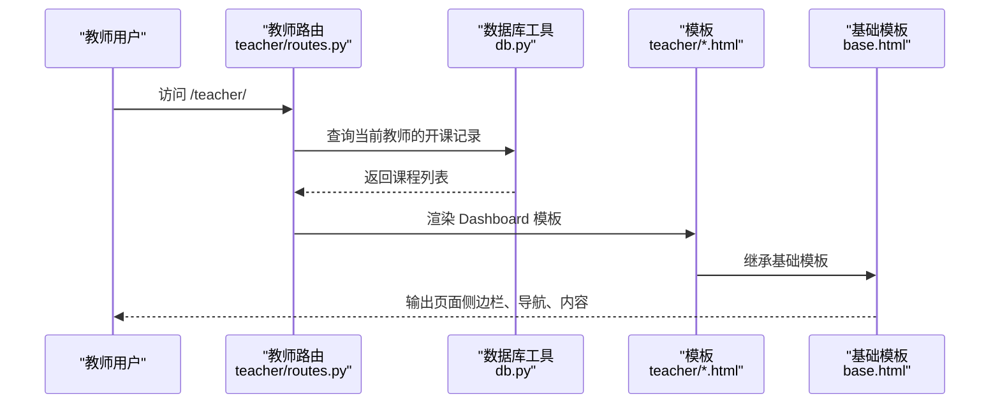
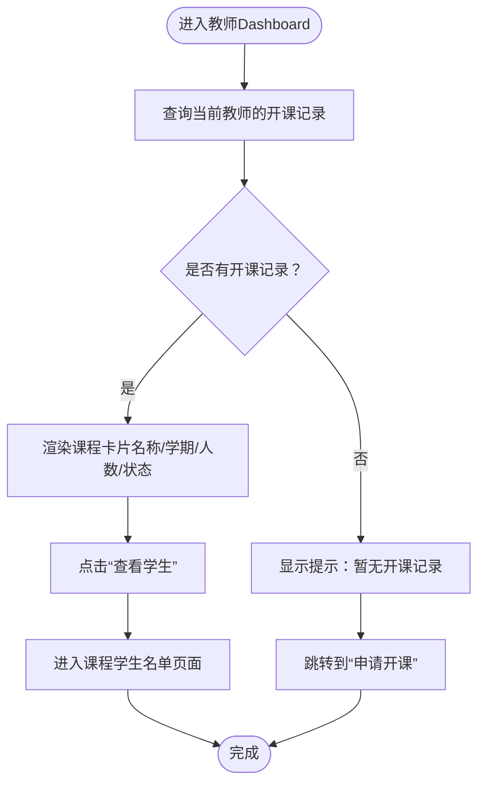
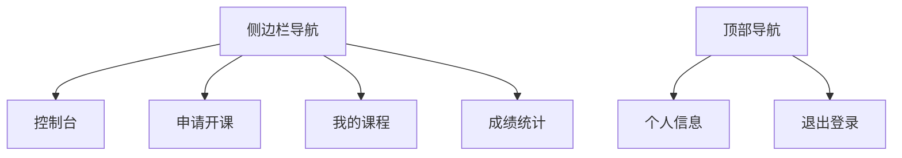
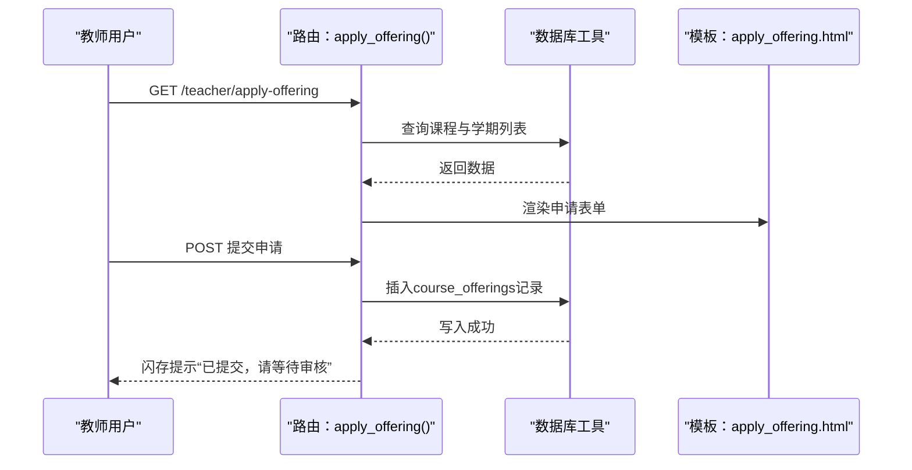
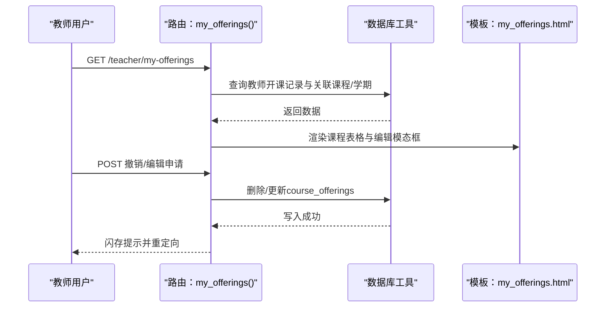
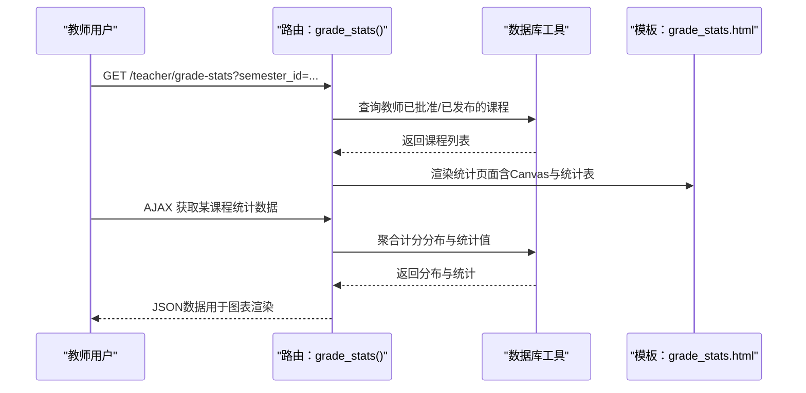
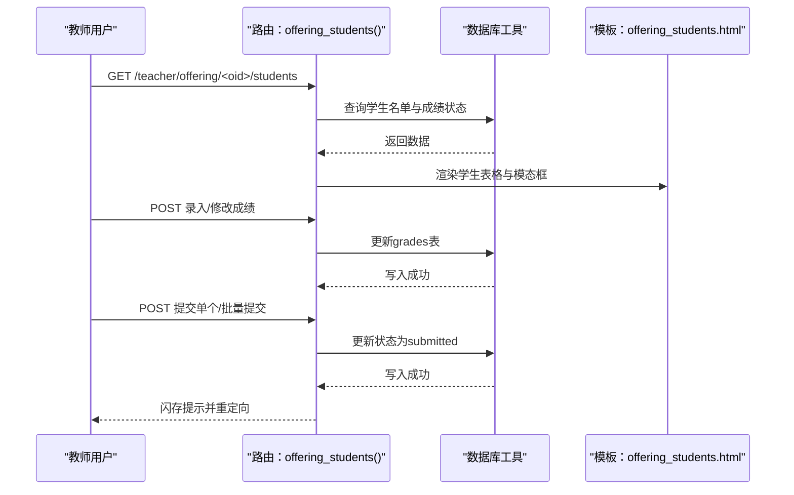
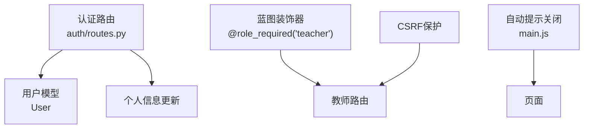
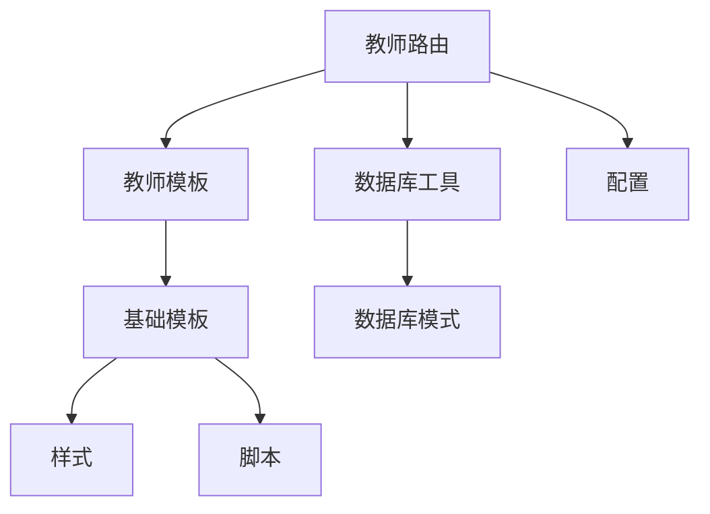

# 教师工作台

<cite>
**本文引用的文件**
- [app/teacher/routes.py](file://app/teacher/routes.py)
- [app/templates/teacher/dashboard.html](file://app/templates/teacher/dashboard.html)
- [app/templates/base.html](file://app/templates/base.html)
- [static/css/style.css](file://static/css/style.css)
- [app/__init__.py](file://app/__init__.py)
- [app/db.py](file://app/db.py)
- [config.py](file://config.py)
- [app/templates/teacher/my_offerings.html](file://app/templates/teacher/my_offerings.html)
- [app/templates/teacher/apply_offering.html](file://app/templates/teacher/apply_offering.html)
- [app/templates/teacher/grade_stats.html](file://app/templates/teacher/grade_stats.html)
- [app/templates/teacher/offering_students.html](file://app/templates/teacher/offering_students.html)
- [app/auth/routes.py](file://app/auth/routes.py)
- [sql/01_schema.sql](file://sql/01_schema.sql)
- [static/js/main.js](file://static/js/main.js)
</cite>

## 目录
1. [简介](#简介)
2. [项目结构](#项目结构)
3. [核心组件](#核心组件)
4. [架构总览](#架构总览)
5. [详细组件分析](#详细组件分析)
6. [依赖分析](#依赖分析)
7. [性能考虑](#性能考虑)
8. [故障排除指南](#故障排除指南)
9. [结论](#结论)
10. [附录](#附录)

## 简介
本文件为“教师工作台”的功能文档，面向教师用户，系统性阐述教师Dashboard的整体设计理念、布局结构与功能模块，包括个人信息展示、快捷操作入口、待处理任务列表、系统通知中心等。文档同时解释各功能区域的作用与交互方式（如快速导航菜单、课程状态概览、近期活动提醒、个人资料管理），并提供界面截图与操作流程说明，帮助教师快速熟悉工作台的各项功能。最后给出个性化设置选项与用户体验优化建议。

## 项目结构
教师工作台采用前后端分离的模板渲染架构：后端使用Flask蓝图组织业务模块，前端使用Bootstrap与Chart.js进行界面与可视化呈现；数据库通过连接池统一管理，支持高并发与事务一致性。

图表来源
- [app/__init__.py:29-64](file://app/__init__.py#L29-L64)
- [app/teacher/routes.py:1-271](file://app/teacher/routes.py#L1-L271)
- [app/templates/base.html:13-72](file://app/templates/base.html#L13-L72)
- [app/db.py:10-80](file://app/db.py#L10-L80)
- [config.py:6-36](file://config.py#L6-L36)

章节来源
- [app/__init__.py:29-64](file://app/__init__.py#L29-L64)
- [app/teacher/routes.py:1-271](file://app/teacher/routes.py#L1-L271)
- [app/templates/base.html:13-72](file://app/templates/base.html#L13-L72)
- [app/db.py:10-80](file://app/db.py#L10-L80)
- [config.py:6-36](file://config.py#L6-L36)

## 核心组件
- 路由与控制器
  - 教师蓝图负责教师工作台的全部业务路由，包括Dashboard、开课申请、我的课程、成绩统计与成绩录入等。
  - 路由层实现权限校验（仅教师可访问）、数据查询与模板渲染。
- 模板与界面
  - 使用基础模板统一侧边栏导航、顶部用户下拉菜单与消息提示。
  - 教师Dashboard以卡片形式展示课程状态概览，支持快速跳转到“查看学生”。
- 数据访问层
  - 数据库连接池封装查询与写入方法，提供分页、存储过程调用等能力。
- 配置与安全
  - 配置文件集中管理数据库连接参数、分页参数与成绩权重等。
  - CSRF保护与角色中间件确保请求安全与访问控制。

章节来源
- [app/teacher/routes.py:10-14](file://app/teacher/routes.py#L10-L14)
- [app/teacher/routes.py:50-64](file://app/teacher/routes.py#L50-L64)
- [app/templates/teacher/dashboard.html:1-27](file://app/templates/teacher/dashboard.html#L1-L27)
- [app/templates/base.html:13-72](file://app/templates/base.html#L13-L72)
- [app/db.py:43-59](file://app/db.py#L43-L59)
- [config.py:6-36](file://config.py#L6-L36)

## 架构总览
教师工作台遵循“蓝图+模板+数据库工具+配置”的分层设计，整体交互流程如下：

图表来源
- [app/teacher/routes.py:50-64](file://app/teacher/routes.py#L50-L64)
- [app/templates/teacher/dashboard.html:1-27](file://app/templates/teacher/dashboard.html#L1-L27)
- [app/templates/base.html:13-72](file://app/templates/base.html#L13-L72)
- [app/db.py:43-59](file://app/db.py#L43-L59)

## 详细组件分析

### 教师Dashboard（课程状态概览）
- 设计理念
  - 以卡片网格展示教师所授课程的最新状态，突出“学期、课程名称、选课人数、状态徽章”，便于快速掌握课程动态。
- 功能要点
  - 列表循环渲染课程卡片，点击“查看学生”进入该课程的学生名单与成绩管理页面。
  - 当无开课记录时显示提示语，引导教师前往“申请开课”。
- 交互流程
  - 登录后自动跳转至教师Dashboard。
  - 侧边栏提供“控制台、申请开课、我的课程、成绩统计”等入口。
- 视觉与响应式
  - 卡片悬停阴影增强交互反馈；移动端适配侧边栏折叠与内容区宽度变化。

图表来源
- [app/teacher/routes.py:50-64](file://app/teacher/routes.py#L50-L64)
- [app/templates/teacher/dashboard.html:6-24](file://app/templates/teacher/dashboard.html#L6-L24)

章节来源
- [app/teacher/routes.py:50-64](file://app/teacher/routes.py#L50-L64)
- [app/templates/teacher/dashboard.html:1-27](file://app/templates/teacher/dashboard.html#L1-L27)
- [static/css/style.css:40-47](file://static/css/style.css#L40-L47)

### 快速导航菜单（侧边栏）
- 设计理念
  - 顶部固定导航提供用户下拉菜单（个人信息、退出登录），左侧侧边栏按角色显示专属菜单项。
- 教师菜单
  - 控制台（Dashboard）、申请开课、我的课程、成绩统计。
- 交互特性
  - 支持侧边栏折叠/展开，移动端自动隐藏侧边栏并提供切换按钮。
  - 下拉菜单自动关闭与消息提示自动消失。

图表来源
- [app/templates/base.html:20-47](file://app/templates/base.html#L20-L47)
- [static/css/style.css:8-34](file://static/css/style.css#L8-L34)
- [static/js/main.js:2-9](file://static/js/main.js#L2-L9)

章节来源
- [app/templates/base.html:13-72](file://app/templates/base.html#L13-L72)
- [static/css/style.css:8-34](file://static/css/style.css#L8-L34)
- [static/js/main.js:2-9](file://static/js/main.js#L2-L9)

### 申请开课（Apply Offering）
- 功能目标
  - 教师提交开课申请，填写课程、学期、最大选课人数、教室与时间安排等信息。
- 表单字段
  - 课程（联动学期）、最大选课人数、教室、时间、申请理由。
- 流程说明
  - GET：加载课程与学期列表，渲染表单。
  - POST：校验参数后写入course_offerings表，提示“等待管理员审核”。

图表来源
- [app/teacher/routes.py:67-83](file://app/teacher/routes.py#L67-L83)
- [app/templates/teacher/apply_offering.html:1-33](file://app/templates/teacher/apply_offering.html#L1-L33)
- [app/db.py:83-89](file://app/db.py#L83-L89)

章节来源
- [app/teacher/routes.py:67-83](file://app/teacher/routes.py#L67-L83)
- [app/templates/teacher/apply_offering.html:1-33](file://app/templates/teacher/apply_offering.html#L1-L33)

### 我的课程（My Offerings）
- 功能目标
  - 展示教师已提交的开课申请列表，支持编辑待审核申请与撤销申请。
- 关键交互
  - 待审核状态下显示“编辑”“撤销”按钮；点击“学生名单”进入该课程的选课学生管理。
- 安全控制
  - 编辑/撤销仅允许针对当前教师本人的“待审核”申请，防止越权操作。

图表来源
- [app/teacher/routes.py:86-102](file://app/teacher/routes.py#L86-L102)
- [app/templates/teacher/my_offerings.html:1-62](file://app/templates/teacher/my_offerings.html#L1-L62)
- [app/teacher/routes.py:105-131](file://app/teacher/routes.py#L105-L131)

章节来源
- [app/teacher/routes.py:86-102](file://app/teacher/routes.py#L86-L102)
- [app/templates/teacher/my_offerings.html:1-62](file://app/templates/teacher/my_offerings.html#L1-L62)
- [app/teacher/routes.py:105-131](file://app/teacher/routes.py#L105-L131)

### 成绩统计（Grade Statistics）
- 功能目标
  - 按学期筛选教师所授课程，展示成绩分布柱状图与统计指标（总人数、平均分、最高/最低分、及格率）。
- 数据来源
  - 通过AJAX调用后端接口获取成绩分布与统计聚合数据。
- 可视化
  - 使用Chart.js绘制柱状图，右侧表格展示关键指标。

图表来源
- [app/teacher/routes.py:215-234](file://app/teacher/routes.py#L215-L234)
- [app/templates/teacher/grade_stats.html:1-50](file://app/templates/teacher/grade_stats.html#L1-L50)
- [app/teacher/routes.py:237-270](file://app/teacher/routes.py#L237-L270)

章节来源
- [app/teacher/routes.py:215-234](file://app/teacher/routes.py#L215-L234)
- [app/templates/teacher/grade_stats.html:1-50](file://app/templates/teacher/grade_stats.html#L1-L50)
- [app/teacher/routes.py:237-270](file://app/teacher/routes.py#L237-L270)

### 选课学生名单与成绩管理（Offering Students）
- 功能目标
  - 展示某门课程的选课学生名单，支持录入/修改平时与期末成绩，提交草稿为待审核状态，或批量提交。
- 关键流程
  - 录入/修改：弹出模态框输入0-100分，保存后刷新状态徽章。
  - 提交：草稿且两分均非空时显示“提交”按钮，提交后状态变为“待审核”。
  - 批量提交：一键提交该课程所有已录入分数的草稿。
- 权限控制
  - 仅课程负责人可编辑/提交；已提交状态不可再修改。

图表来源
- [app/teacher/routes.py:133-155](file://app/teacher/routes.py#L133-L155)
- [app/templates/teacher/offering_students.html:1-65](file://app/templates/teacher/offering_students.html#L1-L65)
- [app/teacher/routes.py:158-198](file://app/teacher/routes.py#L158-L198)
- [app/teacher/routes.py:200-213](file://app/teacher/routes.py#L200-L213)

章节来源
- [app/teacher/routes.py:133-155](file://app/teacher/routes.py#L133-L155)
- [app/templates/teacher/offering_students.html:1-65](file://app/templates/teacher/offering_students.html#L1-L65)
- [app/teacher/routes.py:158-198](file://app/teacher/routes.py#L158-L198)
- [app/teacher/routes.py:200-213](file://app/teacher/routes.py#L200-L213)

### 个人信息与安全（Profile、CSRF、角色校验）
- 个人信息
  - 支持修改手机号、邮箱与密码；密码需至少6位。
- 安全机制
  - CSRF保护全局启用；教师路由使用装饰器限制角色为“teacher”。
  - 登录后根据角色自动跳转至对应Dashboard。
- 样式与脚本
  - 自动关闭提示消息；侧边栏折叠切换。

图表来源
- [app/auth/routes.py:121-167](file://app/auth/routes.py#L121-L167)
- [app/__init__.py:10-27](file://app/__init__.py#L10-L27)
- [app/teacher/routes.py:10-14](file://app/teacher/routes.py#L10-L14)
- [static/js/main.js:2-9](file://static/js/main.js#L2-L9)

章节来源
- [app/auth/routes.py:121-167](file://app/auth/routes.py#L121-L167)
- [app/__init__.py:10-27](file://app/__init__.py#L10-L27)
- [app/teacher/routes.py:10-14](file://app/teacher/routes.py#L10-L14)
- [static/js/main.js:2-9](file://static/js/main.js#L2-L9)

## 依赖分析
- 组件耦合
  - 路由层依赖数据库工具与模板；模板依赖基础模板与静态资源；蓝图注册于应用初始化。
- 外部依赖
  - Bootstrap提供UI框架与响应式布局；Chart.js用于成绩统计可视化；Pymysql与DBUtils提供MySQL连接池。
- 数据模型
  - 教师与课程的关系通过course_offerings维护；成绩通过grades表管理，状态机贯穿草稿→提交→审核→发布。

图表来源
- [app/teacher/routes.py:1-271](file://app/teacher/routes.py#L1-L271)
- [app/db.py:10-80](file://app/db.py#L10-L80)
- [app/templates/base.html:13-72](file://app/templates/base.html#L13-L72)
- [config.py:6-36](file://config.py#L6-L36)
- [sql/01_schema.sql:128-198](file://sql/01_schema.sql#L128-L198)

章节来源
- [app/teacher/routes.py:1-271](file://app/teacher/routes.py#L1-L271)
- [app/db.py:10-80](file://app/db.py#L10-L80)
- [app/templates/base.html:13-72](file://app/templates/base.html#L13-L72)
- [config.py:6-36](file://config.py#L6-L36)
- [sql/01_schema.sql:128-198](file://sql/01_schema.sql#L128-L198)

## 性能考虑
- 数据库连接池
  - 通过PooledDB减少连接开销，合理设置最小缓存、最大缓存与最大连接数，避免高并发下的连接瓶颈。
- 分页与查询
  - 对长列表使用分页查询，避免一次性加载过多数据；对复杂统计使用聚合查询与索引优化。
- 前端渲染
  - 成绩统计采用AJAX异步加载，降低首屏压力；图表按需渲染，避免不必要的计算。
- 缓存与CDN
  - 静态资源可接入CDN与浏览器缓存策略，提升页面加载速度。

## 故障排除指南
- 登录与权限
  - 若出现“请先登录后再访问该页面”，检查登录状态与角色是否正确；确认CSRF令牌有效。
- 开课申请
  - 提交后未显示或状态异常：检查course_offerings表写入是否成功，确认学期与课程选择正确。
- 成绩录入
  - 录入分数无效或无法提交：确认分数范围在0-100之间；草稿状态且两分均非空才可提交；已提交状态不可修改。
- 页面显示问题
  - 侧边栏不显示或无法折叠：检查基础模板中的toggle逻辑与CSS类名；确认Bootstrap与Chart.js加载正常。
- 数据库连接
  - 连接池耗尽或超时：检查配置中的最大连接数与超时设置；监控慢查询与事务未提交。

章节来源
- [app/teacher/routes.py:158-198](file://app/teacher/routes.py#L158-L198)
- [app/teacher/routes.py:105-131](file://app/teacher/routes.py#L105-L131)
- [app/db.py:10-80](file://app/db.py#L10-L80)
- [config.py:19-25](file://config.py#L19-L25)

## 结论
教师工作台以清晰的导航与卡片化布局为核心，围绕“课程状态概览—开课管理—成绩统计—学生名单—个人信息”构建完整闭环。通过蓝图解耦、模板继承与连接池优化，系统具备良好的可维护性与扩展性。建议后续引入更丰富的通知中心、成绩预警与导出功能，进一步提升教师的日常工作效率。

## 附录
- 个性化设置建议
  - 主题色与品牌色：可在样式中新增变量，支持浅色/深色主题切换。
  - 通知中心：在基础模板顶部增加消息徽章与下拉通知面板。
  - 快捷入口：在Dashboard增加“最近课程”“待提交成绩”等快捷卡片。
- 用户体验优化
  - 表单校验与实时提示；批量操作增加二次确认；移动端适配更细致的交互细节。
- 数据模型参考
  - 教师与课程的关系、成绩状态机与统计维度可作为扩展分析的基础。

章节来源
- [sql/01_schema.sql:128-198](file://sql/01_schema.sql#L128-L198)
- [app/templates/base.html:13-72](file://app/templates/base.html#L13-L72)
- [static/css/style.css:62-79](file://static/css/style.css#L62-L79)