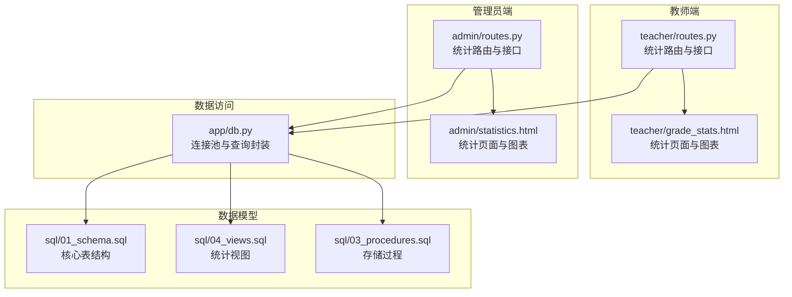
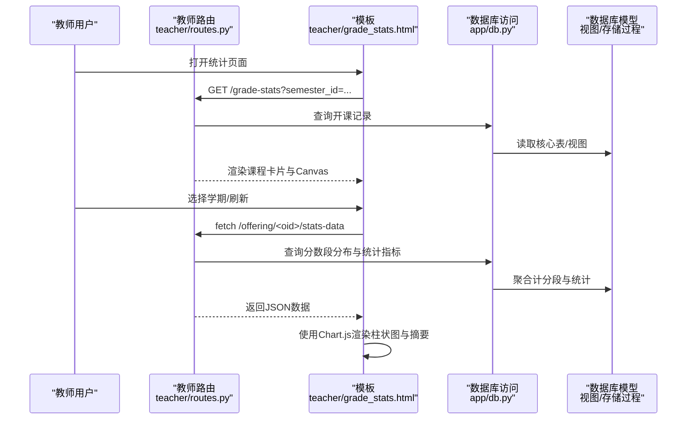
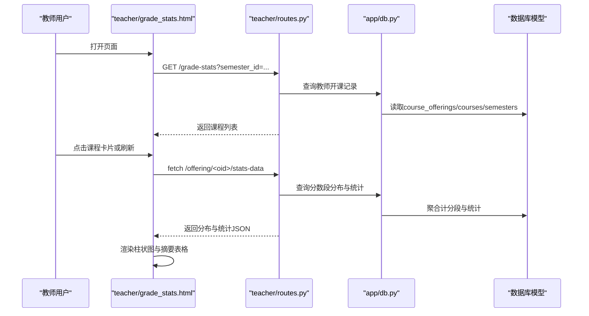
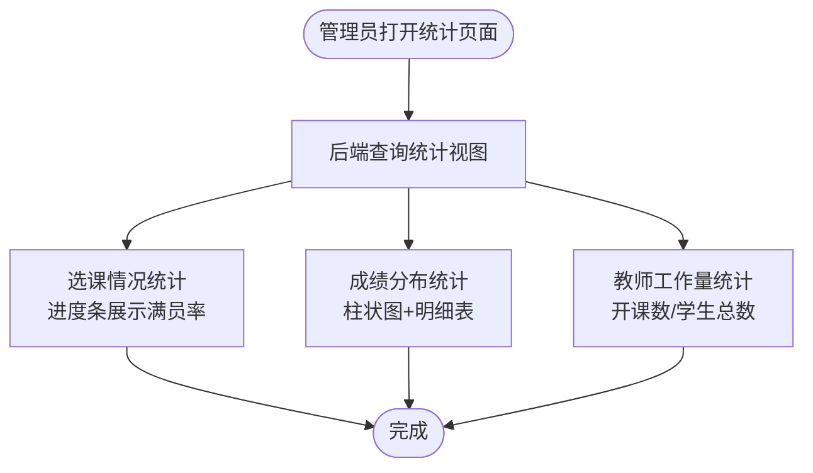
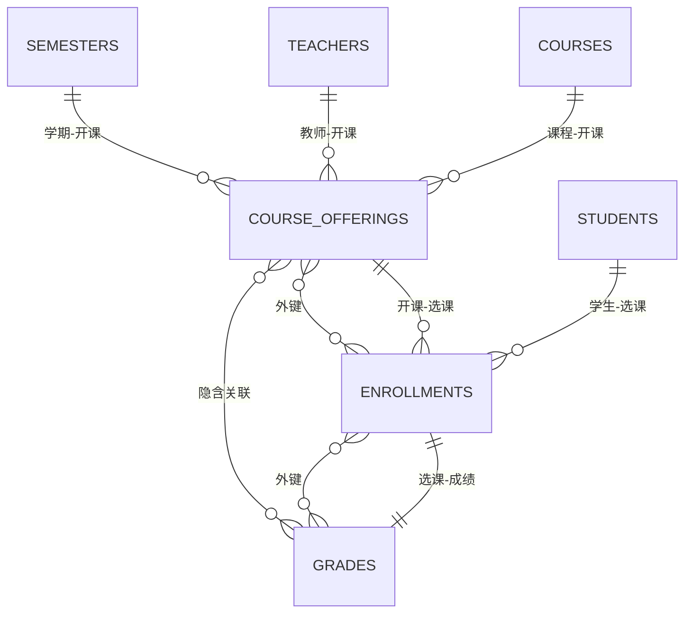
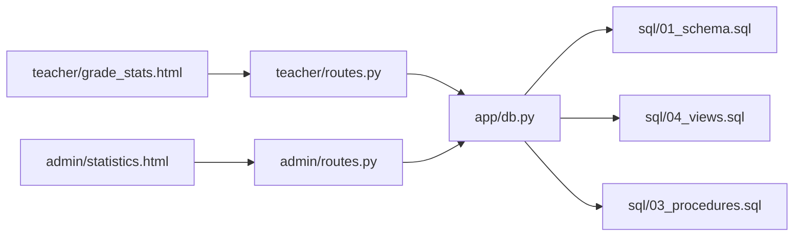

# 统计分析

<cite>
**本文引用的文件**
- [app/teacher/routes.py](file://app/teacher/routes.py)
- [app/templates/teacher/grade_stats.html](file://app/templates/teacher/grade_stats.html)
- [app/admin/routes.py](file://app/admin/routes.py)
- [app/templates/admin/statistics.html](file://app/templates/admin/statistics.html)
- [app/db.py](file://app/db.py)
- [sql/01_schema.sql](file://sql/01_schema.sql)
- [sql/03_procedures.sql](file://sql/03_procedures.sql)
- [sql/04_views.sql](file://sql/04_views.sql)
</cite>

## 目录
1. [简介](#简介)
2. [项目结构](#项目结构)
3. [核心组件](#核心组件)
4. [架构总览](#架构总览)
5. [详细组件分析](#详细组件分析)
6. [依赖分析](#依赖分析)
7. [性能考量](#性能考量)
8. [故障排查指南](#故障排查指南)
9. [结论](#结论)
10. [附录](#附录)

## 简介
本操作文档面向教师与管理员，系统性说明统计分析功能的使用方法与实现原理，涵盖：
- 教师端：查看所授课程的成绩分布图表、统计指标（平均分、最高/最低分、及格率），以及按学期筛选。
- 管理端：全校层面的选课情况统计、整体成绩分布、教师工作量统计等综合报表。
- 数据来源与计算逻辑：基于数据库视图与存储过程，确保统计口径一致、结果可靠。
- 可视化展示：柱状图直观呈现分数段分布；表格补充明细与汇总。
- 高级能力：个性化筛选（学期）、数据导出（建议通过浏览器开发者工具或后端接口扩展）。

## 项目结构
围绕统计分析的关键文件组织如下：
- 路由层：教师与管理员分别提供统计入口与数据接口
- 模板层：前端页面负责渲染图表与表格
- 数据访问层：统一数据库连接池与查询封装
- 数据模型层：核心表、视图、存储过程构成统计基础

**图表来源**
- [app/teacher/routes.py:277-333](file://app/teacher/routes.py#L277-L333)
- [app/templates/teacher/grade_stats.html:1-50](file://app/templates/teacher/grade_stats.html#L1-L50)
- [app/admin/routes.py:611-639](file://app/admin/routes.py#L611-L639)
- [app/templates/admin/statistics.html:1-65](file://app/templates/admin/statistics.html#L1-L65)
- [app/db.py:10-121](file://app/db.py#L10-L121)
- [sql/01_schema.sql:1-235](file://sql/01_schema.sql#L1-L235)
- [sql/04_views.sql:1-113](file://sql/04_views.sql#L1-L113)
- [sql/03_procedures.sql:1-381](file://sql/03_procedures.sql#L1-L381)

**章节来源**
- [app/teacher/routes.py:277-333](file://app/teacher/routes.py#L277-L333)
- [app/templates/teacher/grade_stats.html:1-50](file://app/templates/teacher/grade_stats.html#L1-L50)
- [app/admin/routes.py:611-639](file://app/admin/routes.py#L611-L639)
- [app/templates/admin/statistics.html:1-65](file://app/templates/admin/statistics.html#L1-L65)
- [app/db.py:10-121](file://app/db.py#L10-L121)
- [sql/01_schema.sql:1-235](file://sql/01_schema.sql#L1-L235)
- [sql/04_views.sql:1-113](file://sql/04_views.sql#L1-L113)
- [sql/03_procedures.sql:1-381](file://sql/03_procedures.sql#L1-L381)

## 核心组件
- 教师统计入口与数据接口
  - 页面：按学期筛选，逐门课程展示柱状图与统计摘要
  - 接口：按开课ID返回分数段分布与统计指标
- 管理统计入口与数据接口
  - 页面：选课情况统计（进度条）、整体成绩分布（柱状图+明细）、教师工作量统计
  - 接口：从视图聚合得到所需统计结果
- 数据访问与封装
  - 连接池、查询、分页、存储过程调用
- 数据模型支撑
  - 核心表：users、students、teachers、courses、course_offerings、enrollments、grades、semesters、course_selection_periods、system_logs
  - 视图：v_course_selection_stats、v_teacher_workload、v_student_transcript、v_student_schedule
  - 存储过程：sp_calculate_total_grade、sp_calculate_gpa、sp_enroll_course、sp_drop_course、sp_approve_course_offering 等

**章节来源**
- [app/teacher/routes.py:277-333](file://app/teacher/routes.py#L277-L333)
- [app/templates/teacher/grade_stats.html:1-50](file://app/templates/teacher/grade_stats.html#L1-L50)
- [app/admin/routes.py:611-639](file://app/admin/routes.py#L611-L639)
- [app/templates/admin/statistics.html:1-65](file://app/templates/admin/statistics.html#L1-L65)
- [app/db.py:10-121](file://app/db.py#L10-L121)
- [sql/01_schema.sql:1-235](file://sql/01_schema.sql#L1-L235)
- [sql/04_views.sql:1-113](file://sql/04_views.sql#L1-L113)
- [sql/03_procedures.sql:1-381](file://sql/03_procedures.sql#L1-L381)

## 架构总览
统计分析采用“模板渲染 + AJAX拉取 + 后端查询”的前后端协作模式：
- 教师端：页面加载后通过 fetch 请求接口，动态渲染柱状图与统计摘要
- 管理端：页面直接从后端查询结果渲染图表与表格
- 数据来源：统一经数据库访问层，查询核心表与视图，必要时调用存储过程

**图表来源**
- [app/teacher/routes.py:277-333](file://app/teacher/routes.py#L277-L333)
- [app/templates/teacher/grade_stats.html:25-49](file://app/templates/teacher/grade_stats.html#L25-L49)
- [app/db.py:43-70](file://app/db.py#L43-L70)
- [sql/04_views.sql:70-113](file://sql/04_views.sql#L70-L113)
- [sql/03_procedures.sql:197-275](file://sql/03_procedures.sql#L197-L275)

## 详细组件分析

### 教师端：课程成绩分布统计
- 功能概述
  - 支持按学期筛选，展示每门已批准/发布的课程的分数段分布柱状图与统计摘要（总人数、平均分、最高/最低分、及格率）
- 页面与交互
  - 页面模板提供学期下拉筛选与课程卡片布局
  - 每个课程卡片右侧为 Canvas 图表，左侧为统计摘要表格
- 数据接口
  - 列表接口：根据登录教师与学期过滤，返回课程清单
  - 详情接口：按开课ID返回分数段分布与统计指标
- 可视化与解读
  - 柱状图：横轴为分数段（90-100、80-89、70-79、60-69、<60），纵轴为人数字
  - 统计摘要：强调平均分与及格率，便于快速评估教学效果
- 使用步骤
  - 登录教师账号，进入“成绩分布统计”
  - 如需按学期查看，选择目标学期后页面自动刷新
  - 查看各课程的柱状图与摘要，结合平均分与及格率进行对比分析

**图表来源**
- [app/teacher/routes.py:277-333](file://app/teacher/routes.py#L277-L333)
- [app/templates/teacher/grade_stats.html:1-50](file://app/templates/teacher/grade_stats.html#L1-L50)
- [app/db.py:43-70](file://app/db.py#L43-L70)
- [sql/04_views.sql:70-113](file://sql/04_views.sql#L70-L113)

**章节来源**
- [app/teacher/routes.py:277-333](file://app/teacher/routes.py#L277-L333)
- [app/templates/teacher/grade_stats.html:1-50](file://app/templates/teacher/grade_stats.html#L1-L50)

### 管理端：全校统计分析
- 功能概述
  - 选课情况统计：显示课程上限、已选人数与满员率（进度条）
  - 成绩分布统计：全校分数段分布柱状图与明细表
  - 教师工作量统计：按教师统计开课数与学生总数
- 数据来源与计算
  - 选课统计：基于视图 v_course_selection_stats 聚合
  - 成绩分布：按总评成绩分段统计
  - 工作量：基于视图 v_teacher_workload 聚合
- 可视化与解读
  - 选课满员率：进度条颜色区分高/中/低风险
  - 成绩分布：直观反映整体学习质量与分布集中度
  - 工作量：辅助排课与绩效评估

**图表来源**
- [app/admin/routes.py:611-639](file://app/admin/routes.py#L611-L639)
- [app/templates/admin/statistics.html:1-65](file://app/templates/admin/statistics.html#L1-L65)
- [sql/04_views.sql:70-113](file://sql/04_views.sql#L70-L113)

**章节来源**
- [app/admin/routes.py:611-639](file://app/admin/routes.py#L611-L639)
- [app/templates/admin/statistics.html:1-65](file://app/templates/admin/statistics.html#L1-L65)

### 数据来源与计算逻辑
- 分数段分布与统计指标
  - 分数段划分：90-100、80-89、70-79、60-69、<60
  - 统计指标：总人数、平均分、最高/最低分、及格率（≥60）
  - 计算来源：按开课ID关联选课与成绩，过滤有效总评
- 总评与绩点计算
  - 总评：平时成绩×30% + 期末成绩×70%
  - 绩点：4.0制分级
  - 计算方式：触发器自动计算，或调用存储过程
- 选课统计
  - 已选人数：按开课ID统计 enrolled 状态
  - 满员率：已选/上限，进度条颜色区分风险等级
- 教师工作量
  - 开课数：按教师统计不同开课数量
  - 学生总数：按教师统计 enrolled 学生数量

**图表来源**
- [sql/01_schema.sql:112-198](file://sql/01_schema.sql#L112-L198)
- [sql/03_procedures.sql:197-275](file://sql/03_procedures.sql#L197-L275)
- [sql/04_views.sql:70-113](file://sql/04_views.sql#L70-L113)

**章节来源**
- [sql/01_schema.sql:112-198](file://sql/01_schema.sql#L112-L198)
- [sql/03_procedures.sql:197-275](file://sql/03_procedures.sql#L197-L275)
- [sql/04_views.sql:70-113](file://sql/04_views.sql#L70-L113)

### 可视化图表类型与解读
- 柱状图
  - 适用场景：分数段分布、满员率对比
  - 解读要点：柱高代表人数/比率，便于观察集中趋势与离散程度
- 表格
  - 适用场景：明细数据、排名、汇总
  - 解读要点：关注平均分、及格率、最高/最低分变化趋势

**章节来源**
- [app/templates/teacher/grade_stats.html:25-49](file://app/templates/teacher/grade_stats.html#L25-L49)
- [app/templates/admin/statistics.html:25-64](file://app/templates/admin/statistics.html#L25-L64)

### 个性化统计报表与高级功能
- 自定义时间范围
  - 教师端：支持按学期筛选，便于跨学期对比
  - 管理端：可在页面选择学期维度进行全局分析
- 筛选条件
  - 教师端：按学期筛选课程
  - 管理端：可按状态、课程名/编号/教师名等筛选开课
- 数据导出
  - 当前模板未内置导出按钮。建议通过以下方式扩展：
    - 在前端增加导出按钮，调用接口获取 JSON，再转为 CSV/Excel
    - 在后端新增导出接口，直接输出 CSV/Excel 文件流
  - 注意：导出功能需遵循权限控制与数据脱敏要求

**章节来源**
- [app/teacher/routes.py:277-296](file://app/teacher/routes.py#L277-L296)
- [app/admin/routes.py:386-411](file://app/admin/routes.py#L386-L411)
- [app/templates/teacher/grade_stats.html:4-11](file://app/templates/teacher/grade_stats.html#L4-L11)
- [app/templates/admin/statistics.html:1-23](file://app/templates/admin/statistics.html#L1-L23)

## 依赖分析
- 组件耦合
  - 教师统计依赖：课程开课状态、选课记录、成绩记录
  - 管理统计依赖：选课统计视图、教师工作量视图、全校成绩分布
- 外部依赖
  - 数据库连接池：PooledDB
  - 图表库：Chart.js（在模板中以全局变量方式使用）
- 潜在循环依赖
  - 路由与模板相互依赖，但不涉及循环导入；数据库访问层被路由与模板共同依赖，属于单向依赖

**图表来源**
- [app/teacher/routes.py:1-333](file://app/teacher/routes.py#L1-L333)
- [app/admin/routes.py:1-692](file://app/admin/routes.py#L1-L692)
- [app/db.py:10-121](file://app/db.py#L10-L121)
- [sql/01_schema.sql:1-235](file://sql/01_schema.sql#L1-L235)
- [sql/04_views.sql:1-113](file://sql/04_views.sql#L1-L113)
- [sql/03_procedures.sql:1-381](file://sql/03_procedures.sql#L1-L381)
- [app/templates/teacher/grade_stats.html:1-50](file://app/templates/teacher/grade_stats.html#L1-L50)
- [app/templates/admin/statistics.html:1-65](file://app/templates/admin/statistics.html#L1-L65)

**章节来源**
- [app/teacher/routes.py:1-333](file://app/teacher/routes.py#L1-L333)
- [app/admin/routes.py:1-692](file://app/admin/routes.py#L1-L692)
- [app/db.py:10-121](file://app/db.py#L10-L121)
- [sql/01_schema.sql:1-235](file://sql/01_schema.sql#L1-L235)
- [sql/04_views.sql:1-113](file://sql/04_views.sql#L1-L113)
- [sql/03_procedures.sql:1-381](file://sql/03_procedures.sql#L1-L381)

## 性能考量
- 查询优化
  - 使用视图进行预聚合，减少主查询复杂度
  - 对常用过滤字段建立索引（如 status、semester_id、course_id 等）
- 连接池与事务
  - 使用连接池降低连接开销
  - 对批量操作（如批量发布成绩）使用事务保证一致性
- 前端渲染
  - 按课程异步加载数据，避免一次性渲染大量图表
- 缓存策略
  - 对稳定不变的静态数据（如学期列表）可考虑短期缓存

[本节为通用性能建议，不直接分析具体文件]

## 故障排查指南
- 无法看到统计图表
  - 检查是否选择了学期或课程是否有成绩数据
  - 确认浏览器控制台无网络错误与脚本报错
- 统计数值异常
  - 确认成绩状态为已发布或已审核，且总评非空
  - 检查是否存在重复录入或未提交的状态
- 权限问题
  - 教师仅能查看本人已批准/发布的课程
  - 管理员需具备相应角色权限

**章节来源**
- [app/teacher/routes.py:277-333](file://app/teacher/routes.py#L277-L333)
- [app/admin/routes.py:611-639](file://app/admin/routes.py#L611-L639)

## 结论
本系统通过统一的数据模型与视图，为教师与管理员提供了清晰、可操作的统计分析能力。教师可快速掌握所授课程的教学成效，管理员可从全局视角洞察选课与教学状况。建议后续增强导出能力与多维钻取能力，进一步提升分析深度与效率。

[本节为总结性内容，不直接分析具体文件]

## 附录
- 教学改进建议
  - 关注及格率与平均分趋势，识别薄弱环节
  - 对低分段学生进行学业预警与个别辅导
  - 结合满员率与课程安排，优化排课与资源配置
- 数据分析最佳实践
  - 对比不同学期/班级的统计指标，识别教学改进效果
  - 将分数段分布与课程大纲、教学方法关联分析
  - 建立定期复盘机制，持续优化教学设计与评价体系

[本节为通用指导内容，不直接分析具体文件]