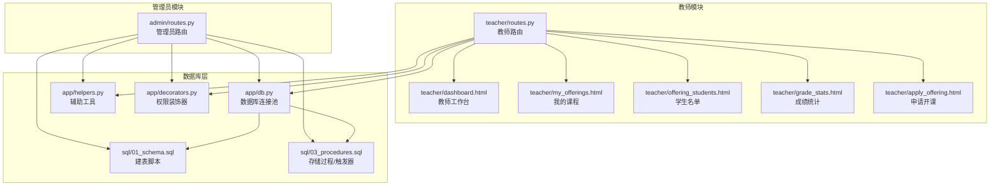
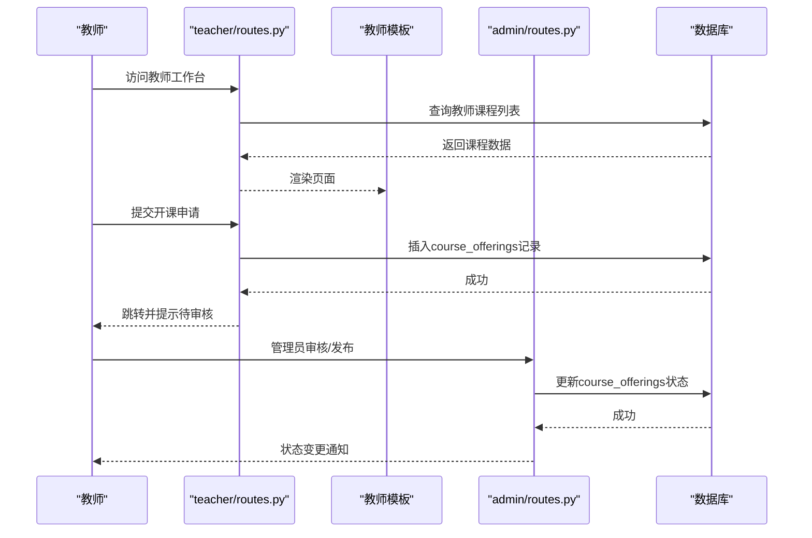
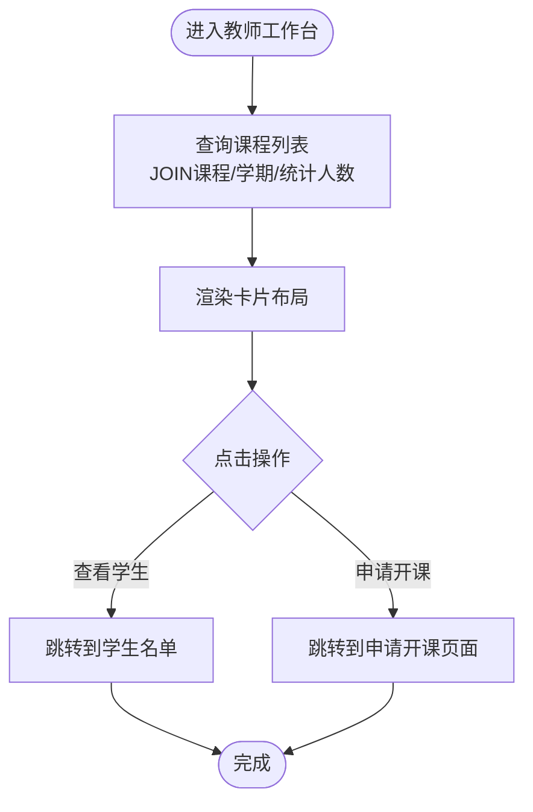
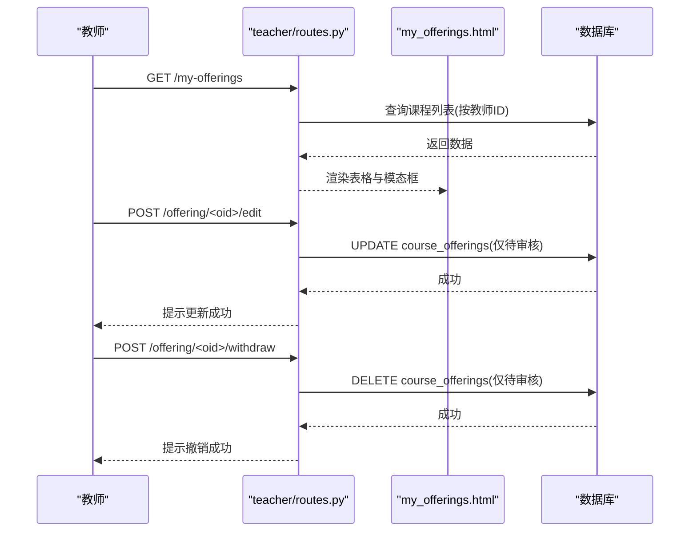
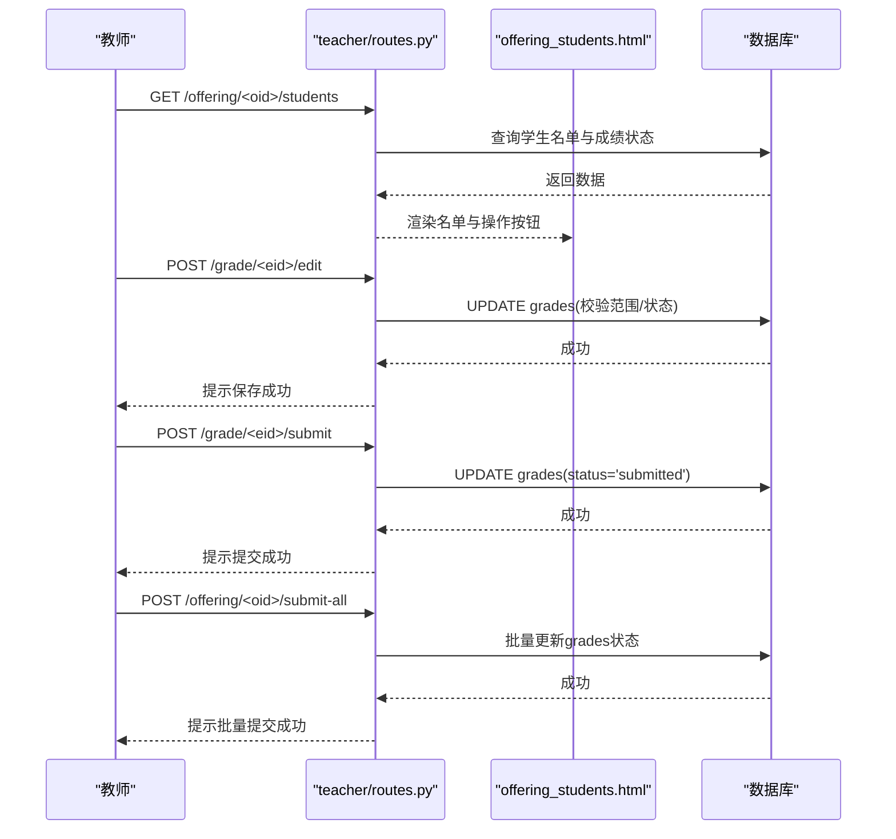
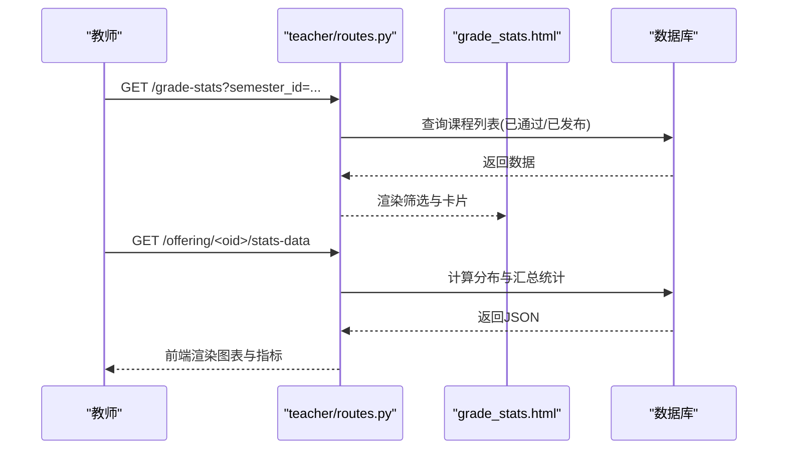
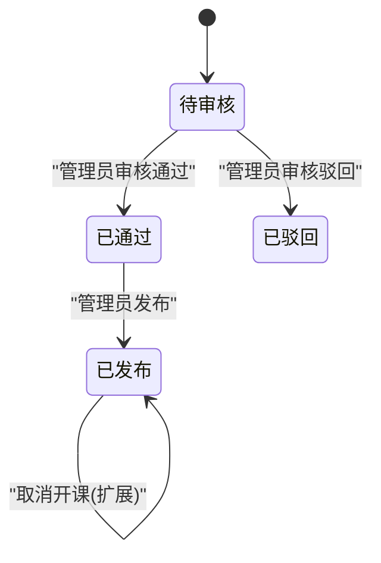
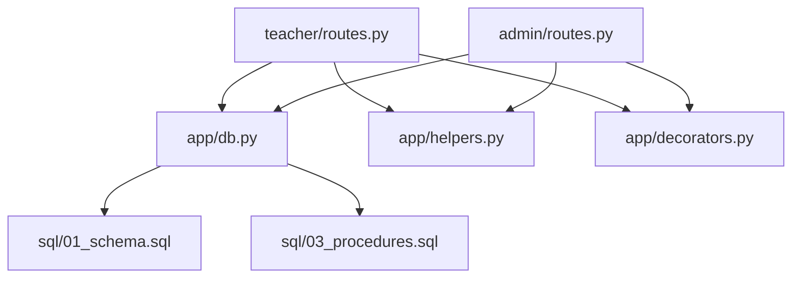

# 课程管理

<cite>
**本文引用的文件**
- [app/teacher/routes.py](file://app/teacher/routes.py)
- [app/admin/routes.py](file://app/admin/routes.py)
- [app/templates/teacher/my_offerings.html](file://app/templates/teacher/my_offerings.html)
- [app/templates/teacher/offering_students.html](file://app/templates/teacher/offering_students.html)
- [app/templates/teacher/grade_stats.html](file://app/templates/teacher/grade_stats.html)
- [app/templates/teacher/dashboard.html](file://app/templates/teacher/dashboard.html)
- [app/templates/teacher/apply_offering.html](file://app/templates/teacher/apply_offering.html)
- [sql/01_schema.sql](file://sql/01_schema.sql)
- [sql/03_procedures.sql](file://sql/03_procedures.sql)
- [app/db.py](file://app/db.py)
- [app/helpers.py](file://app/helpers.py)
- [app/decorators.py](file://app/decorators.py)
- [README.md](file://README.md)
</cite>

## 目录
1. [简介](#简介)
2. [项目结构](#项目结构)
3. [核心组件](#核心组件)
4. [架构概览](#架构概览)
5. [详细组件分析](#详细组件分析)
6. [依赖分析](#依赖分析)
7. [性能考虑](#性能考虑)
8. [故障排除指南](#故障排除指南)
9. [结论](#结论)
10. [附录](#附录)

## 简介
本操作文档面向教师用户，详细说明如何使用系统进行课程管理。内容涵盖：
- 查看与管理自身负责的课程（已开课程列表、课程详情）
- 课程信息维护（开课申请、编辑、撤销）
- 学生名单管理（查看、录入/修改成绩、批量提交）
- 课程状态管理（待审核、已通过、已发布、已驳回）
- 成绩统计与分析（分布图表、平均分、及格率等）
- 批量操作与数据导出使用指南

## 项目结构
系统采用Flask微服务架构，按角色划分蓝图模块，数据库采用MySQL，配合存储过程、触发器与视图实现核心业务逻辑。

**图表来源**
- [app/teacher/routes.py:1-294](file://app/teacher/routes.py#L1-L294)
- [app/admin/routes.py:1-667](file://app/admin/routes.py#L1-L667)
- [app/templates/teacher/my_offerings.html:1-62](file://app/templates/teacher/my_offerings.html#L1-L62)
- [app/templates/teacher/offering_students.html:1-71](file://app/templates/teacher/offering_students.html#L1-L71)
- [app/templates/teacher/grade_stats.html:1-50](file://app/templates/teacher/grade_stats.html#L1-L50)
- [app/templates/teacher/dashboard.html:1-27](file://app/templates/teacher/dashboard.html#L1-L27)
- [app/templates/teacher/apply_offering.html:1-33](file://app/templates/teacher/apply_offering.html#L1-L33)
- [sql/01_schema.sql:1-235](file://sql/01_schema.sql#L1-L235)
- [sql/03_procedures.sql:1-381](file://sql/03_procedures.sql#L1-L381)
- [app/db.py:1-121](file://app/db.py#L1-L121)
- [app/helpers.py:1-80](file://app/helpers.py#L1-L80)
- [app/decorators.py:1-26](file://app/decorators.py#L1-L26)

**章节来源**
- [README.md:46-87](file://README.md#L46-L87)

## 核心组件
- 教师路由模块：提供课程列表、开课申请、学生名单、成绩录入与统计等接口
- 管理员路由模块：负责课程审核、发布、成绩审核与发布、统计分析等
- 模板页面：教师侧用于展示课程状态、学生名单、成绩统计；管理员侧用于审核与统计
- 数据库层：包含12张核心表、存储过程、触发器与视图，支撑选课、退课、成绩计算、GPA计算等业务
- 工具与装饰器：统一的日志记录、权限校验、数据库连接池

**章节来源**
- [app/teacher/routes.py:1-294](file://app/teacher/routes.py#L1-L294)
- [app/admin/routes.py:1-667](file://app/admin/routes.py#L1-L667)
- [sql/01_schema.sql:112-198](file://sql/01_schema.sql#L112-L198)
- [sql/03_procedures.sql:14-381](file://sql/03_procedures.sql#L14-L381)
- [app/db.py:1-121](file://app/db.py#L1-L121)
- [app/helpers.py:1-80](file://app/helpers.py#L1-L80)
- [app/decorators.py:1-26](file://app/decorators.py#L1-L26)

## 架构概览
教师通过“教师工作台”查看自身课程，进入“我的课程”页面管理开课申请；在“学生名单”页面录入/修改成绩并提交；通过“成绩统计”页面查看课程成绩分布与关键指标。管理员负责课程审核与发布、成绩审核与发布、统计分析与学业预警。

**图表来源**
- [app/teacher/routes.py:51-104](file://app/teacher/routes.py#L51-L104)
- [app/admin/routes.py:387-427](file://app/admin/routes.py#L387-L427)
- [sql/01_schema.sql:128-155](file://sql/01_schema.sql#L128-L155)
- [sql/03_procedures.sql:277-320](file://sql/03_procedures.sql#L277-L320)

## 详细组件分析

### 教师工作台与课程列表
- 功能概述
  - 展示教师当前负责的所有课程，包含课程名称、代码、学期、选课人数/上限、状态等
  - 状态标识：待审核、已通过、已发布、已驳回
- 关键实现
  - 路由查询：按教师ID关联课程、学期，统计已选人数
  - 模板渲染：卡片式布局，支持快速跳转到“查看学生”
- 使用建议
  - 定期查看工作台，关注状态变化
  - 对于“已发布”的课程，及时维护学生名单与成绩

**图表来源**
- [app/teacher/routes.py:51-65](file://app/teacher/routes.py#L51-L65)
- [app/templates/teacher/dashboard.html:1-27](file://app/templates/teacher/dashboard.html#L1-L27)

**章节来源**
- [app/teacher/routes.py:51-65](file://app/teacher/routes.py#L51-L65)
- [app/templates/teacher/dashboard.html:1-27](file://app/templates/teacher/dashboard.html#L1-L27)

### 课程申请与管理（我的课程）
- 功能概述
  - 展示课程申请状态与基本信息
  - 待审核状态下支持编辑与撤销
  - 支持查看学生名单
- 关键实现
  - 列表查询：统计已选人数，过滤教师ID
  - 编辑/撤销：仅对状态为“待审核”的申请开放
  - 模态框：弹窗编辑课程、学期、人数上限、教室、时间、申请理由
- 使用建议
  - 在撤销前确认无学生选课
  - 编辑时确保教室与时间不与其他课程冲突

**图表来源**
- [app/teacher/routes.py:88-134](file://app/teacher/routes.py#L88-L134)
- [app/templates/teacher/my_offerings.html:1-62](file://app/templates/teacher/my_offerings.html#L1-L62)

**章节来源**
- [app/teacher/routes.py:88-134](file://app/teacher/routes.py#L88-L134)
- [app/templates/teacher/my_offerings.html:1-62](file://app/templates/teacher/my_offerings.html#L1-L62)

### 学生名单管理与成绩录入
- 功能概述
  - 查看某门课程的选课学生名单
  - 录入/修改平时成绩与期末成绩
  - 单个提交与批量提交成绩
  - 撤回已提交但未审核的成绩
- 关键实现
  - 学生查询：关联学生、专业、班级、成绩状态
  - 成绩校验：0-100范围限制，草稿/提交状态控制
  - 批量提交：仅对已录入且状态为草稿的记录进行批量提交
- 使用建议
  - 录入前确认成绩范围合法
  - 批量提交前先单个提交以避免遗漏
  - 撤回仅适用于“已提交”状态

**图表来源**
- [app/teacher/routes.py:137-235](file://app/teacher/routes.py#L137-L235)
- [app/templates/teacher/offering_students.html:1-71](file://app/templates/teacher/offering_students.html#L1-L71)

**章节来源**
- [app/teacher/routes.py:137-235](file://app/teacher/routes.py#L137-L235)
- [app/templates/teacher/offering_students.html:1-71](file://app/templates/teacher/offering_students.html#L1-L71)

### 成绩统计与分析
- 功能概述
  - 按学期筛选课程，查看成绩分布柱状图与关键指标
  - 指标：总人数、平均分、最高分、最低分、及格率
- 关键实现
  - 分布统计：按等级区间统计人数
  - 汇总统计：计算总数、均值、极值、及格率
  - 前端图表：使用Chart.js渲染柱状图
- 使用建议
  - 结合分布图与指标评估教学效果
  - 及格率低时可结合学生名单分析原因

**图表来源**
- [app/teacher/routes.py:238-293](file://app/teacher/routes.py#L238-L293)
- [app/templates/teacher/grade_stats.html:1-50](file://app/templates/teacher/grade_stats.html#L1-L50)

**章节来源**
- [app/teacher/routes.py:238-293](file://app/teacher/routes.py#L238-L293)
- [app/templates/teacher/grade_stats.html:1-50](file://app/templates/teacher/grade_stats.html#L1-L50)

### 课程状态管理流程
- 状态流转
  - 待审核：教师提交申请后处于此状态
  - 已通过：管理员审核通过
  - 已发布：管理员发布课程，学生可选课
  - 已驳回：管理员驳回申请
- 控制要点
  - 教师仅能编辑/撤销“待审核”状态的申请
  - 管理员负责审核与发布，发布后课程方可被学生选课
- 使用建议
  - 发布前确保教室、时间、人数上限等信息准确
  - 遇到冲突或问题及时与管理员沟通

**图表来源**
- [sql/01_schema.sql:128-155](file://sql/01_schema.sql#L128-L155)
- [app/teacher/routes.py:107-134](file://app/teacher/routes.py#L107-L134)
- [app/admin/routes.py:401-427](file://app/admin/routes.py#L401-L427)

**章节来源**
- [sql/01_schema.sql:128-155](file://sql/01_schema.sql#L128-L155)
- [app/teacher/routes.py:107-134](file://app/teacher/routes.py#L107-L134)
- [app/admin/routes.py:401-427](file://app/admin/routes.py#L401-L427)

### 课程信息维护与教学计划更新
- 课程信息维护
  - 课程基本信息：代码、名称、学分、学时、课程类型、描述
  - 教师可在“我的课程”页面对“待审核”状态的申请进行修改
- 教学计划更新
  - 教师可更新教室、时间安排、最大选课人数等
  - 管理员审核通过后方可发布
- 使用建议
  - 修改前确认与现有课程无时间冲突
  - 人数上限应结合教室容量与教学资源合理设置

**章节来源**
- [app/teacher/routes.py:120-134](file://app/teacher/routes.py#L120-L134)
- [app/admin/routes.py:171-206](file://app/admin/routes.py#L171-L206)

### 课程公告与教材信息
- 公告发布
  - 系统未提供专门的课程公告表与接口，建议通过其他渠道（如班级群）发布
- 教材信息
  - 系统未提供教材信息字段，可在课程描述中补充
- 建议
  - 通过课程描述或附加说明维护教学资源信息

**章节来源**
- [sql/01_schema.sql:112-125](file://sql/01_schema.sql#L112-L125)
- [app/teacher/routes.py:120-134](file://app/teacher/routes.py#L120-L134)

### 课程数据统计与分析
- 指标解读
  - 总人数：反映课程吸引力与容量匹配度
  - 平均分：反映整体学习水平
  - 最高/最低分：识别极端情况
  - 及格率：衡量教学效果与学生掌握程度
- 使用场景
  - 评估教学改进方向
  - 为后续课程安排提供参考
- 注意事项
  - 指标需结合课程性质与难度综合分析
  - 关注异常波动，及时调查原因

**章节来源**
- [app/teacher/routes.py:260-293](file://app/teacher/routes.py#L260-L293)
- [app/templates/teacher/grade_stats.html:25-48](file://app/templates/teacher/grade_stats.html#L25-L48)

### 批量操作与数据导出
- 批量操作
  - 批量提交：针对某门课程下所有已录入且状态为草稿的成绩进行批量提交
  - 批量发布：管理员可对已审核的成绩进行批量发布
- 数据导出
  - 系统未提供直接的数据导出功能，可通过浏览器开发者工具或第三方工具实现
  - 建议在需要导出时，先在页面上筛选所需数据，再进行复制粘贴
- 使用建议
  - 批量操作前务必确认数据准确性
  - 大批量导出时注意浏览器性能与网络稳定性

**章节来源**
- [app/teacher/routes.py:206-219](file://app/teacher/routes.py#L206-L219)
- [app/admin/routes.py:556-570](file://app/admin/routes.py#L556-L570)

## 依赖分析
- 组件耦合
  - 教师路由依赖数据库查询与日志记录
  - 管理员路由依赖存储过程与分页工具
  - 模板依赖前端框架与图表库
- 外部依赖
  - MySQL数据库与PyMySQL驱动
  - DBUtils连接池
  - Chart.js图表库
- 潜在风险
  - 存储过程与触发器的版本一致性
  - 并发场景下的锁竞争与死锁风险

**图表来源**
- [app/teacher/routes.py:1-294](file://app/teacher/routes.py#L1-L294)
- [app/admin/routes.py:1-667](file://app/admin/routes.py#L1-L667)
- [app/db.py:1-121](file://app/db.py#L1-L121)
- [sql/01_schema.sql:1-235](file://sql/01_schema.sql#L1-L235)
- [sql/03_procedures.sql:1-381](file://sql/03_procedures.sql#L1-L381)
- [app/helpers.py:1-80](file://app/helpers.py#L1-L80)
- [app/decorators.py:1-26](file://app/decorators.py#L1-L26)

**章节来源**
- [app/db.py:1-121](file://app/db.py#L1-L121)
- [app/helpers.py:1-80](file://app/helpers.py#L1-L80)
- [app/decorators.py:1-26](file://app/decorators.py#L1-L26)

## 性能考虑
- 数据库连接池
  - 使用DBUtils连接池减少连接开销，提高并发处理能力
- 查询优化
  - 合理使用索引与LIMIT/OFFSET进行分页
  - 避免N+1查询，尽量一次性获取所需数据
- 存储过程
  - 利用存储过程封装复杂逻辑，减少网络往返
- 前端渲染
  - 图表渲染在客户端进行，注意大数据量时的性能影响

[本节为通用指导，不直接分析具体文件]

## 故障排除指南
- 权限不足
  - 确认登录身份为教师或管理员
  - 检查角色装饰器是否正确应用
- 数据库连接问题
  - 检查连接池配置与数据库服务状态
  - 确认SQL脚本已完整执行
- 成绩录入异常
  - 校验成绩范围（0-100）
  - 确认状态为草稿或已提交但未审核
- 批量操作失败
  - 检查是否有未录入或状态不符合条件的记录
  - 确认网络稳定与浏览器兼容性

**章节来源**
- [app/decorators.py:1-26](file://app/decorators.py#L1-L26)
- [app/db.py:1-121](file://app/db.py#L1-L121)
- [app/teacher/routes.py:162-235](file://app/teacher/routes.py#L162-L235)

## 结论
本系统为教师提供了完整的课程管理能力，覆盖从开课申请、学生名单管理到成绩统计分析的全流程。通过清晰的状态管理与严格的权限控制，保障了教学工作的有序开展。建议教师在日常工作中充分利用统计分析功能，持续优化教学过程与质量。

[本节为总结性内容，不直接分析具体文件]

## 附录
- 快速开始
  - 安装依赖：pip install -r requirements.txt
  - 初始化数据库：按顺序执行01_schema.sql、03_procedures.sql、04_views.sql、05_academic_alerts.sql、02_seed.sql
  - 启动应用：python app.py
- 测试账户
  - 管理员：admin/admin123
  - 教师：自行注册

**章节来源**
- [README.md:12-36](file://README.md#L12-L36)