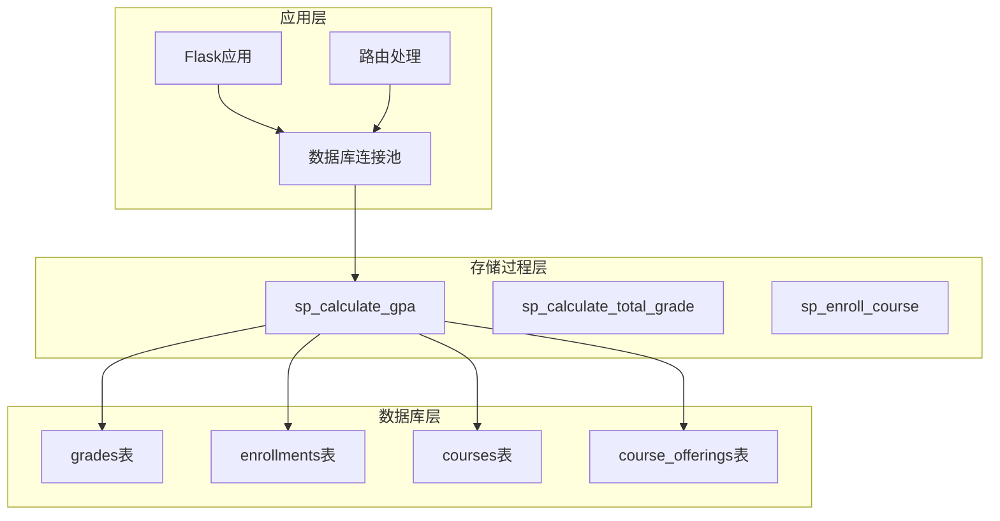
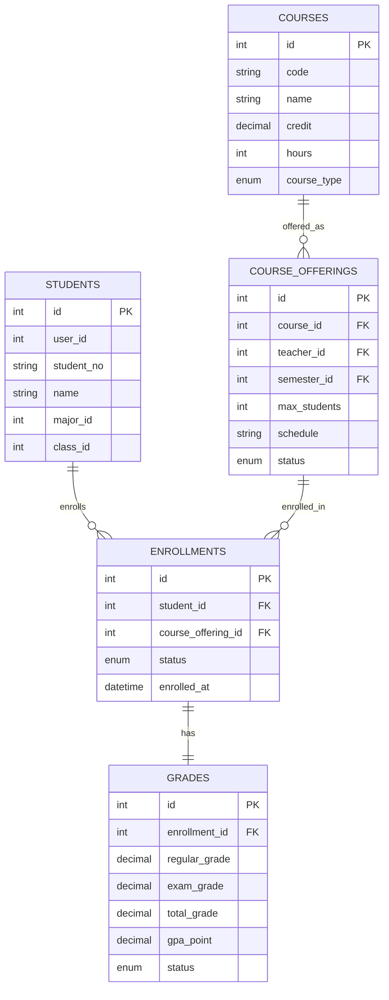
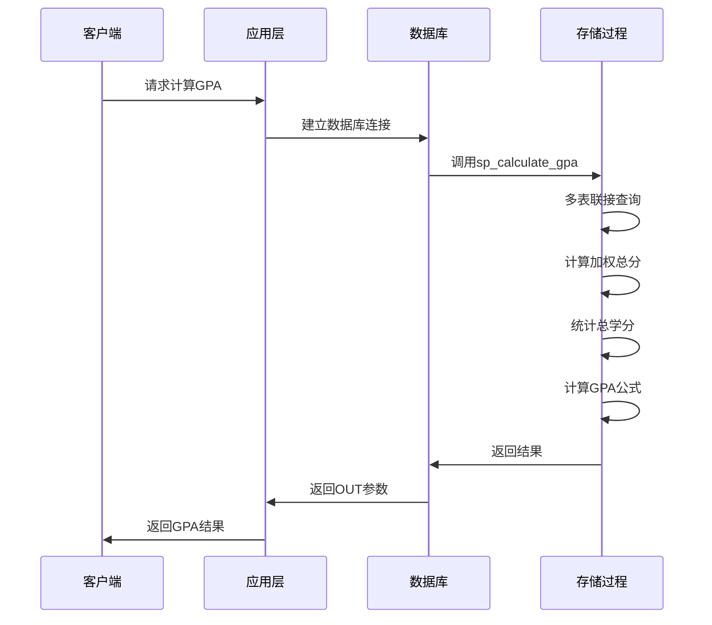
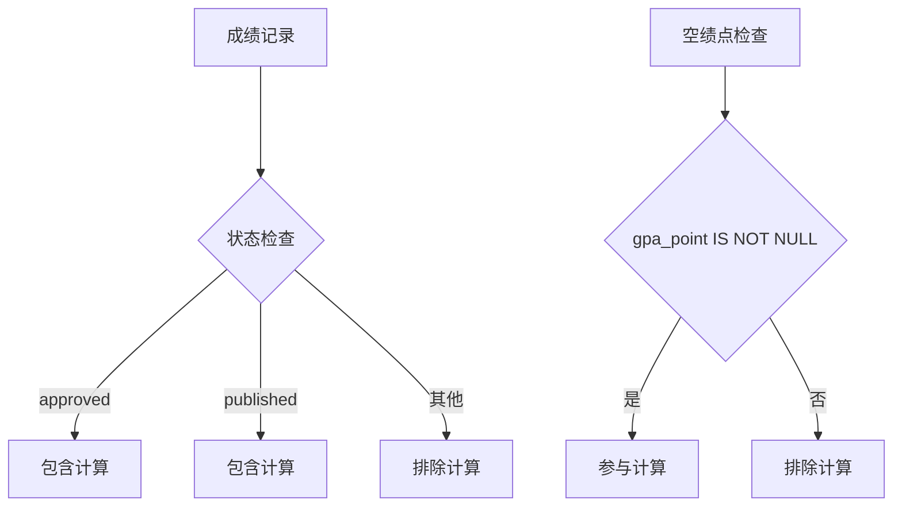
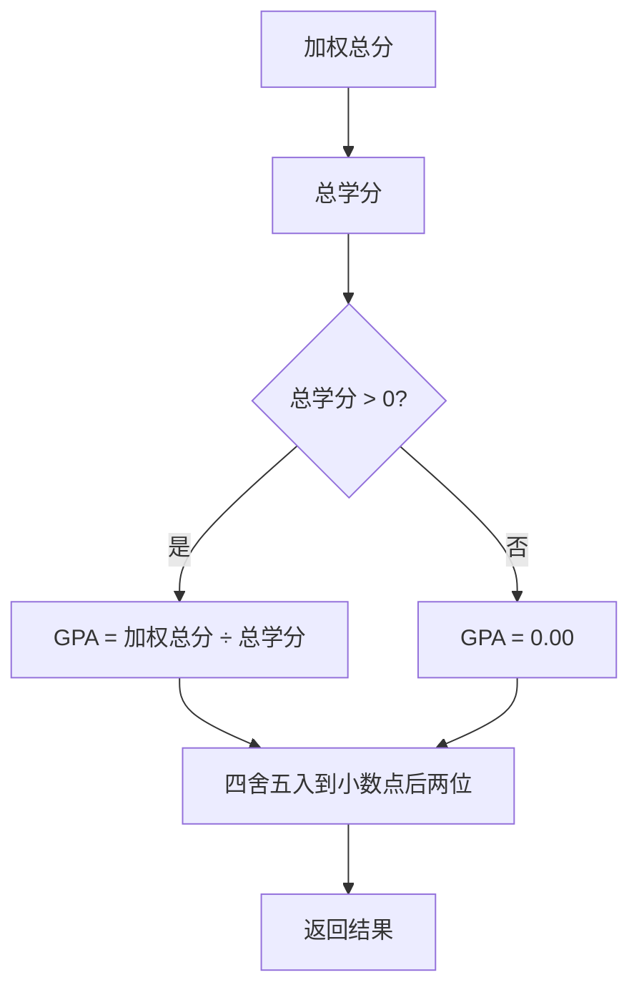
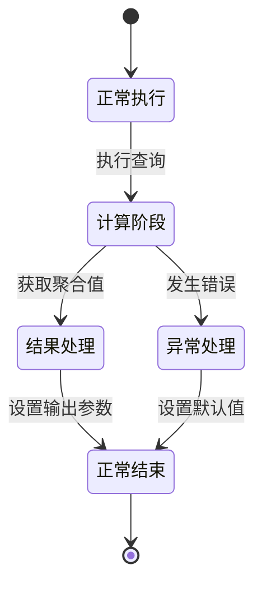
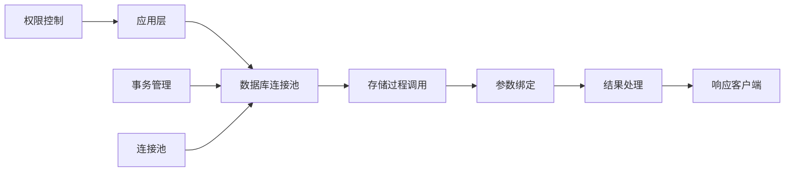

# GPA计算存储过程

<cite>
**本文档引用的文件**
- [03_procedures.sql](file://sql/03_procedures.sql)
- [01_schema.sql](file://sql/01_schema.sql)
- [04_views.sql](file://sql/04_views.sql)
- [db.py](file://app/db.py)
- [routes.py](file://app/student/routes.py)
- [config.py](file://config.py)
- [README.md](file://README.md)
</cite>

## 目录
1. [简介](#简介)
2. [项目结构](#项目结构)
3. [核心组件](#核心组件)
4. [架构概览](#架构概览)
5. [详细组件分析](#详细组件分析)
6. [依赖关系分析](#依赖关系分析)
7. [性能考虑](#性能考虑)
8. [故障排除指南](#故障排除指南)
9. [结论](#结论)

## 简介

GPA计算存储过程（sp_calculate_gpa）是校园教务选课与成绩管理系统中的核心组件之一，负责计算指定学生在特定学期的平均绩点（Grade Point Average）。该存储过程通过复杂的多表联接操作，从成绩管理体系中提取已批准的成绩记录，计算加权总分和总学分，最终得出精确的GPA值。

该存储过程在整个成绩管理体系中扮演着关键角色，不仅直接影响学生的学术表现评估，还为后续的学业预警、学位授予等业务流程提供重要数据支撑。

## 项目结构

MIS系统采用模块化设计，GPA计算存储过程位于专门的SQL脚本文件中，与数据库连接、路由处理等功能模块协同工作：



**图表来源**
- [03_procedures.sql:240-274](file://sql/03_procedures.sql#L240-L274)
- [01_schema.sql:177-198](file://sql/01_schema.sql#L177-L198)

**章节来源**
- [README.md:46-87](file://README.md#L46-L87)
- [config.py:6-36](file://config.py#L6-L36)

## 核心组件

### 存储过程概述

sp_calculate_gpa是一个精心设计的MySQL存储过程，具有以下特点：

- **输入参数**：p_student_id（学生ID）、p_semester_id（学期ID）
- **输出参数**：p_gpa（学期GPA）、p_total_credits（总学分）、p_message（执行消息）
- **事务处理**：原子性操作，确保数据一致性
- **错误处理**：完善的异常捕获和错误恢复机制

### 数据模型关系



**图表来源**
- [01_schema.sql:55-77](file://sql/01_schema.sql#L55-L77)
- [01_schema.sql:159-174](file://sql/01_schema.sql#L159-L174)
- [01_schema.sql:128-155](file://sql/01_schema.sql#L128-L155)
- [01_schema.sql:111-125](file://sql/01_schema.sql#L111-L125)
- [01_schema.sql:177-198](file://sql/01_schema.sql#L177-L198)

**章节来源**
- [01_schema.sql:11-235](file://sql/01_schema.sql#L11-L235)

## 架构概览

### 存储过程执行流程



**图表来源**
- [03_procedures.sql:242-274](file://sql/03_procedures.sql#L242-L274)
- [db.py:62-71](file://app/db.py#L62-L71)

### 数据流分析

存储过程的核心数据流包括以下几个关键步骤：

1. **多表联接**：从grades表开始，通过enrollments、course_offerings、courses表进行关联
2. **条件过滤**：应用多个WHERE条件确保只计算有效成绩
3. **聚合计算**：使用SUM函数计算加权总分和总学分
4. **结果处理**：应用COALESCE函数处理空值，计算最终GPA

## 详细组件分析

### 输入参数详解

| 参数名称 | 类型 | 描述 | 约束 |
|---------|------|------|------|
| p_student_id | INT | 学生唯一标识符 | 必须存在且有效 |
| p_semester_id | INT | 学期唯一标识符 | 必须存在且有效 |

### 输出参数详解

| 参数名称 | 类型 | 描述 | 默认值 |
|---------|------|------|--------|
| p_gpa | DECIMAL(4,2) | 学期平均绩点 | 0.00 |
| p_total_credits | DECIMAL(5,1) | 学期总学分 | 0.0 |
| p_message | VARCHAR(200) | 执行状态消息 | 'GPA计算完成' |

### WHERE条件分析

存储过程的WHERE条件包含多个关键过滤逻辑：

#### 主要过滤条件

1. **学生筛选**：`e.student_id = p_student_id`
   - 确保只计算指定学生的信息

2. **学期筛选**：`co.semester_id = p_semester_id`
   - 限定计算范围到特定学期

3. **选课状态**：`e.status = 'enrolled'`
   - 排除已退课的课程记录

#### 成绩状态过滤



**图表来源**
- [03_procedures.sql:260-264](file://sql/03_procedures.sql#L260-L264)

### SQL查询分析

#### 核心查询结构

存储过程执行的核心SQL查询包含以下关键组件：

1. **多表联接**：
   - `grades g` ← 主表，包含绩点信息
   - `JOIN enrollments e` ← 关联选课记录
   - `JOIN course_offerings co` ← 关联开课信息
   - `JOIN courses c` ← 关联课程基本信息

2. **聚合函数应用**：
   - `COALESCE(SUM(g.gpa_point * c.credit), 0)` ← 加权总分
   - `COALESCE(SUM(c.credit), 0)` ← 总学分

3. **空值处理**：
   - 使用COALESCE函数确保空值被替换为0

#### COALESCE函数详解

COALESCE函数在存储过程中的作用：

```sql
-- 加权总分计算
COALESCE(SUM(g.gpa_point * c.credit), 0)

-- 总学分计算  
COALESCE(SUM(c.credit), 0)
```

该函数确保当查询结果为空时，返回默认值0，避免NULL值影响计算结果。

#### SUM函数聚合逻辑

```mermaid
flowchart LR
A[原始数据] --> B[过滤条件]
B --> C[乘法运算<br/>gpa_point × credit]
C --> D[求和运算<br/>SUM()函数]
D --> E[COALESCE处理<br/>空值转0]
E --> F[最终结果]
```

**图表来源**
- [03_procedures.sql:253-255](file://sql/03_procedures.sql#L253-L255)

### GPA计算公式

存储过程实现了标准的加权平均绩点计算公式：



**图表来源**
- [03_procedures.sql:266-270](file://sql/03_procedures.sql#L266-L270)

### 错误处理机制

存储过程包含完善的错误处理机制：



**图表来源**
- [03_procedures.sql:249-274](file://sql/03_procedures.sql#L249-L274)

**章节来源**
- [03_procedures.sql:242-274](file://sql/03_procedures.sql#L242-L274)

## 依赖关系分析

### 数据库依赖

存储过程依赖于以下核心表：

| 表名 | 依赖关系 | 用途 |
|------|----------|------|
| grades | 主表 | 存储绩点信息 |
| enrollments | 关联表 | 存储选课记录 |
| course_offerings | 关联表 | 存储开课信息 |
| courses | 关联表 | 存储课程基本信息 |

### 应用层集成



**图表来源**
- [db.py:62-71](file://app/db.py#L62-L71)
- [routes.py:24-33](file://app/student/routes.py#L24-L33)

### 外部依赖

系统依赖的关键外部组件：

- **MySQL 8.x**：数据库引擎
- **PyMySQL**：Python MySQL驱动
- **DBUtils**：连接池管理
- **Flask 3.x**：Web框架

**章节来源**
- [README.md:5-11](file://README.md#L5-L11)
- [requirements.txt:1-8](file://requirements.txt#L1-L8)

## 性能考虑

### 查询优化策略

1. **索引利用**：
   - enrollments表的status字段索引
   - course_offerings表的semester_id索引
   - grades表的status字段索引

2. **连接优化**：
   - 使用INNER JOIN确保只返回有效记录
   - 合理的连接顺序减少中间结果集大小

3. **条件过滤**：
   - 在WHERE子句中尽早过滤数据
   - 利用复合索引提高查询效率

### 内存管理

存储过程使用局部变量存储中间计算结果：

- `v_weighted_sum`：加权总分（DECIMAL(10,2)）
- `v_total_credits`：总学分（DECIMAL(5,1)）

这些变量在内存中进行计算，避免多次数据库往返。

### 并发处理

存储过程通过以下机制保证并发安全性：

- **原子性**：整个计算过程在一个事务中执行
- **隔离性**：使用适当的锁机制防止数据竞争
- **一致性**：确保计算结果的准确性

## 故障排除指南

### 常见问题及解决方案

#### 1. GPA始终为0.00

**可能原因**：
- 学生在指定学期没有已批准的成绩记录
- gpa_point字段为空
- 学生ID或学期ID无效

**解决方法**：
- 验证输入参数的有效性
- 检查grades表中是否存在approved或published状态的记录
- 确认gpa_point字段是否正确计算

#### 2. 计算结果不准确

**可能原因**：
- 成绩状态过滤条件不正确
- 学分计算错误
- 空值处理不当

**解决方法**：
- 检查WHERE条件中的status过滤逻辑
- 验证学分字段的数据类型和精度
- 确认COALESCE函数的使用

#### 3. 性能问题

**可能原因**：
- 缺少必要的索引
- 查询条件不够优化
- 数据量过大

**解决方法**：
- 创建适当的索引（如status、semester_id等）
- 优化WHERE条件的顺序
- 考虑分页处理大量数据

### 调试技巧

1. **逐步验证**：分别检查每个表的数据完整性
2. **参数验证**：确保输入参数的类型和范围正确
3. **中间结果检查**：验证聚合计算的中间步骤
4. **边界条件测试**：测试空数据、零学分等特殊情况

**章节来源**
- [03_procedures.sql:249-274](file://sql/03_procedures.sql#L249-L274)

## 结论

GPA计算存储过程（sp_calculate_gpa）是MIS系统中设计精良的核心组件，体现了以下优秀特性：

### 设计优势

1. **数据完整性**：通过严格的WHERE条件过滤，确保只计算有效的成绩记录
2. **算法准确性**：实现了标准的加权平均绩点计算公式
3. **错误处理**：完善的异常捕获和错误恢复机制
4. **性能优化**：合理的索引利用和查询优化策略

### 业务价值

该存储过程在整个成绩管理体系中发挥着关键作用：

- **学术评估**：为学生提供准确的学期GPA
- **学业预警**：支持后续的学业预警和干预机制
- **数据一致性**：确保所有GPA计算的一致性和可靠性
- **系统集成**：与选课、成绩录入、审核发布等流程无缝集成

### 改进建议

1. **监控指标**：添加执行时间和资源使用情况的监控
2. **缓存策略**：考虑对频繁查询的结果进行缓存
3. **批量处理**：支持批量GPA计算以提高效率
4. **审计日志**：记录重要的GPA计算操作用于审计

通过持续的优化和完善，sp_calculate_gpa存储过程将继续为MIS系统的稳定运行和学术管理提供可靠的技术支撑。