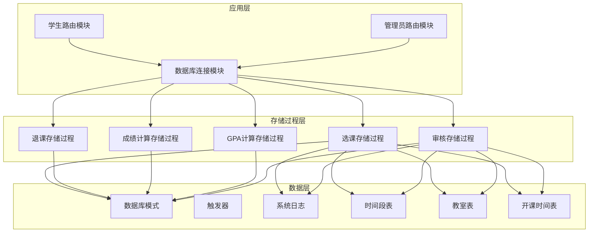
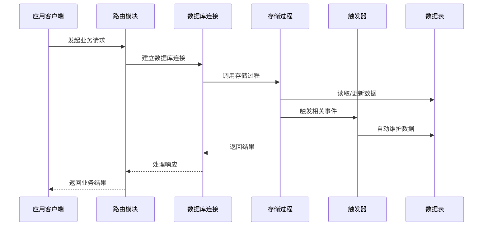
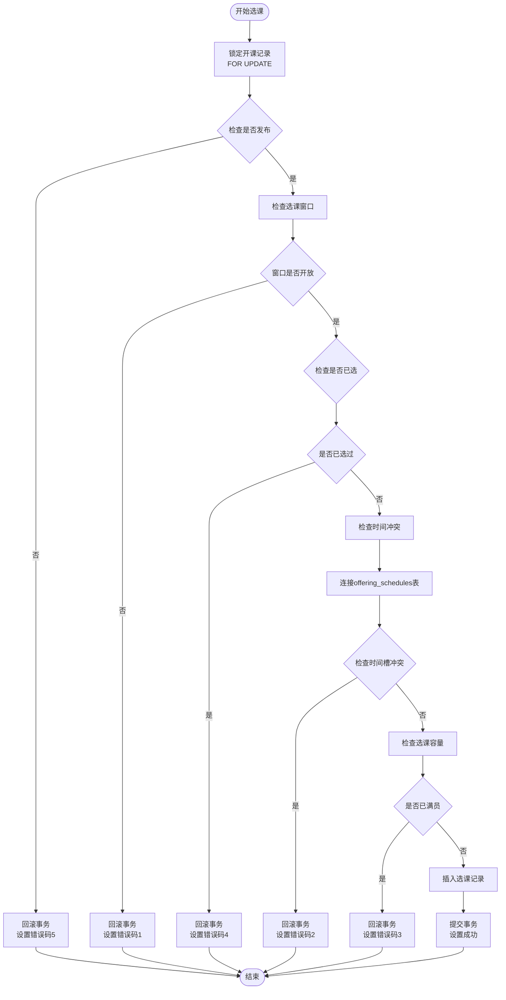
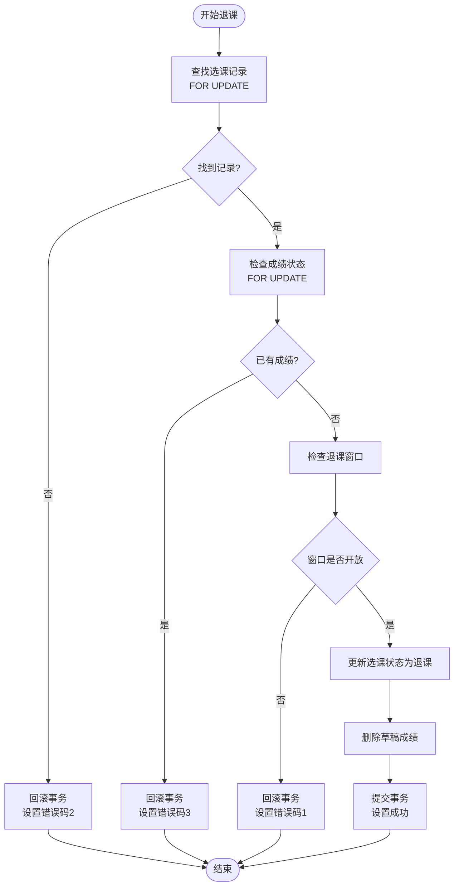

# 存储过程设计

<cite>
**本文档引用的文件**
- [03_procedures.sql](file://sql/03_procedures.sql)
- [01_schema.sql](file://sql/01_schema.sql)
- [06_schedule_migration.sql](file://sql/06_schedule_migration.sql)
- [db.py](file://app/db.py)
- [student/routes.py](file://app/student/routes.py)
- [admin/routes.py](file://app/admin/routes.py)
</cite>

## 更新摘要
**变更内容**
- 增强了课程冲突检测系统，引入了新的时间安排架构
- 新增了offering_schedules关联表支持多时间段课程安排
- 改进了sp_enroll_course和sp_approve_course_offering的冲突检测逻辑
- 添加了教室和时间段的独立管理机制

## 目录
1. [简介](#简介)
2. [项目结构](#项目结构)
3. [核心组件](#核心组件)
4. [架构概览](#架构概览)
5. [详细组件分析](#详细组件分析)
6. [依赖关系分析](#依赖关系分析)
7. [性能考虑](#性能考虑)
8. [故障排除指南](#故障排除指南)
9. [结论](#结论)

## 简介

本文档详细介绍了学生信息管理系统的五个核心存储过程设计，包括选课过程(sp_enroll_course)、退课过程(sp_drop_course)、成绩计算过程(sp_calculate_total_grade)、GPA计算过程(sp_calculate_gpa)和审核过程(sp_approve_course_offering)。这些存储过程实现了完整的教务管理系统业务逻辑，确保了数据的一致性和完整性。

系统采用MySQL存储过程和触发器相结合的方式，通过事务控制和行级锁机制保证并发访问的安全性，并提供了完善的错误处理和日志记录功能。**更新后的系统引入了全新的时间安排架构，支持更精确的课程冲突检测和多时间段课程管理。**

## 项目结构

学生信息管理系统采用分层架构设计，核心存储过程位于SQL脚本文件中，应用层通过Python连接数据库进行调用。**新增的时间安排系统通过offering_schedules关联表实现了课程、时间段和教室的解耦管理。**



**图表来源**
- [03_procedures.sql:1-416](file://sql/03_procedures.sql#L1-L416)
- [01_schema.sql:1-235](file://sql/01_schema.sql#L1-L235)
- [06_schedule_migration.sql:1-140](file://sql/06_schedule_migration.sql#L1-L140)

**章节来源**
- [03_procedures.sql:1-416](file://sql/03_procedures.sql#L1-L416)
- [01_schema.sql:1-235](file://sql/01_schema.sql#L1-L235)
- [06_schedule_migration.sql:1-140](file://sql/06_schedule_migration.sql#L1-L140)

## 核心组件

系统包含以下五个核心存储过程，每个都针对特定的业务场景进行了专门设计。**更新后的系统在冲突检测方面有了显著增强，支持更复杂的时间安排场景。**

### 1. 选课存储过程 (sp_enroll_course)
负责处理学生的选课操作，包含完整的业务规则验证和事务控制。**现在支持基于offering_schedules表的精确时间冲突检测。**

### 2. 退课存储过程 (sp_drop_course)
处理学生的退课申请，确保在正确的窗口期内进行操作并且满足退课条件。

### 3. 成绩计算存储过程 (sp_calculate_total_grade)
计算平时成绩和期末成绩的加权总分，并转换为对应的GPA绩点。

### 4. GPA计算存储过程 (sp_calculate_gpa)
计算指定学年学期的平均GPA和总学分。

### 5. 审核存储过程 (sp_approve_course_offering)
处理教师开课申请的审核流程，支持通过和驳回两种操作。**现在包含教师和教室的双重冲突检测机制。**

**章节来源**
- [03_procedures.sql:14-113](file://sql/03_procedures.sql#L14-L113)
- [03_procedures.sql:119-194](file://sql/03_procedures.sql#L119-L194)
- [03_procedures.sql:201-236](file://sql/03_procedures.sql#L201-L236)
- [03_procedures.sql:242-274](file://sql/03_procedures.sql#L242-L274)
- [03_procedures.sql:280-354](file://sql/03_procedures.sql#L280-L354)

## 架构概览

系统采用三层架构设计，存储过程作为业务逻辑层的核心组件，通过触发器实现数据的自动维护。**新增的时间安排架构通过offering_schedules关联表实现了更灵活的课程管理。**



**图表来源**
- [db.py:62-80](file://app/db.py#L62-L80)
- [03_procedures.sql:357-416](file://sql/03_procedures.sql#L357-L416)

## 详细组件分析

### 选课存储过程 (sp_enroll_course)

#### 功能概述
选课存储过程是整个系统最复杂的业务逻辑之一，负责处理学生选课的完整流程，包括多个安全检查和业务规则验证。**现在使用offering_schedules表进行精确的时间冲突检测。**

#### 输入参数
- `p_student_id`: 学生ID (IN)
- `p_offering_id`: 开课ID (IN)
- `p_result`: 结果代码 (OUT)
- `p_message`: 返回消息 (OUT)

#### 执行逻辑


**图表来源**
- [03_procedures.sql:14-113](file://sql/03_procedures.sql#L14-L113)

#### 冲突检测机制
**更新后的冲突检测使用offering_schedules表进行精确匹配：**
- 通过JOIN两个offering_schedules表比较time_slot_id
- 确保学生在同一时间段不会选到多门课程
- 支持多时间段课程的精确冲突检测

#### 错误处理机制
存储过程使用MySQL的异常处理器捕获所有SQL异常，统一设置错误码99和标准错误消息，确保事务的原子性。

#### 并发控制
通过`FOR UPDATE`行级锁确保同一时间只有一个事务能够修改特定的开课记录，有效防止并发访问导致的数据不一致问题。

**章节来源**
- [03_procedures.sql:14-113](file://sql/03_procedures.sql#L14-L113)

### 退课存储过程 (sp_drop_course)

#### 功能概述
退课存储过程处理学生的退课申请，确保在正确的退课窗口期内进行操作，并且满足退课的技术要求。

#### 输入参数
- `p_student_id`: 学生ID (IN)
- `p_offering_id`: 开课ID (IN)
- `p_result`: 结果代码 (OUT)
- `p_message`: 返回消息 (OUT)

#### 执行逻辑


**图表来源**
- [03_procedures.sql:119-194](file://sql/03_procedures.sql#L119-L194)

#### 特殊处理
退课过程中会自动删除对应的草稿成绩记录，确保数据的整洁性。

**章节来源**
- [03_procedures.sql:119-194](file://sql/03_procedures.sql#L119-L194)

### 成绩计算存储过程 (sp_calculate_total_grade)

#### 功能概述
这是一个相对简单的存储过程，负责计算平时成绩和期末成绩的加权总分，并转换为4.0制的GPA绩点。

#### 输入参数
- `p_enrollment_id`: 选课记录ID (IN)

#### 计算规则
- 总评成绩 = 平时成绩 × 0.3 + 期末成绩 × 0.7
- GPA绩点按以下标准转换：
  - 90分及以上：4.0
  - 85-89分：3.7
  - 82-84分：3.3
  - 78-81分：3.0
  - 75-77分：2.7
  - 72-74分：2.3
  - 68-71分：2.0
  - 64-67分：1.5
  - 60-63分：1.0
  - 60分以下：0.0

**章节来源**
- [03_procedures.sql:201-236](file://sql/03_procedures.sql#L201-L236)

### GPA计算存储过程 (sp_calculate_gpa)

#### 功能概述
计算指定学年学期的平均GPA，考虑了学分权重的加权平均计算。

#### 输入参数
- `p_student_id`: 学生ID (IN)
- `p_semester_id`: 学期ID (IN)
- `p_gpa`: 计算结果 (OUT)
- `p_total_credits`: 总学分 (OUT)
- `p_message`: 返回消息 (OUT)

#### 计算公式
GPA = Σ(课程绩点 × 课程学分) / Σ(课程学分)

#### 过滤条件
只计算状态为'enrolled'且成绩状态为'approved'或'published'的课程。

**章节来源**
- [03_procedures.sql:242-274](file://sql/03_procedures.sql#L242-L274)

### 审核存储过程 (sp_approve_course_offering)

#### 功能概述
处理教师开课申请的审核流程，支持通过和驳回两种操作，并记录详细的审核日志。**现在包含双重冲突检测机制，同时检查教师时间和教室冲突。**

#### 输入参数
- `p_offering_id`: 开课申请ID (IN)
- `p_admin_id`: 审核管理员ID (IN)
- `p_action`: 审核动作 (IN) - 'approved' 或 'rejected'
- `p_comment`: 审核意见 (IN)
- `p_result`: 结果代码 (OUT)
- `p_message`: 返回消息 (OUT)

#### 审核规则
- 只能处理状态为'pending'的申请
- 防止重复审核
- **新增：通过审核时检查教师冲突和教室冲突**
- 自动记录审核日志

#### 冲突检测机制
**更新后的冲突检测包含两个层面：**

1. **教师时间冲突检测：**
   ```sql
   SELECT 1 FROM course_offerings co_existing
   JOIN offering_schedules os_new ON os_new.course_offering_id = p_offering_id
   JOIN offering_schedules os_exist ON os_exist.course_offering_id = co_existing.id
   WHERE co_existing.teacher_id = (SELECT teacher_id FROM course_offerings WHERE id = p_offering_id)
     AND co_existing.semester_id = (SELECT semester_id FROM course_offerings WHERE id = p_offering_id)
     AND co_existing.status IN ('approved', 'published')
     AND co_existing.id != p_offering_id
     AND os_new.time_slot_id = os_exist.time_slot_id
   ```

2. **教室时间冲突检测：**
   ```sql
   SELECT 1 FROM course_offerings co_existing
   JOIN offering_schedules os_new ON os_new.course_offering_id = p_offering_id
   JOIN offering_schedules os_exist ON os_exist.course_offering_id = co_existing.id
   WHERE co_existing.semester_id = (SELECT semester_id FROM course_offerings WHERE id = p_offering_id)
     AND co_existing.status IN ('approved', 'published')
     AND co_existing.id != p_offering_id
     AND os_new.classroom_id = os_exist.classroom_id
     AND os_new.time_slot_id = os_exist.time_slot_id
   ```

**章节来源**
- [03_procedures.sql:280-354](file://sql/03_procedures.sql#L280-L354)

## 依赖关系分析

系统中的存储过程与数据库表之间存在复杂的依赖关系，主要通过外键约束和触发器实现数据的一致性维护。**新增的时间安排系统引入了offering_schedules关联表，实现了课程、时间段和教室的解耦管理。**

```mermaid
erDiagram
TIME_SLOTS {
int id PK
tinyint day_of_week
tinyint period_num
time start_time
time end_time
varchar label
}
CLASSROOMS {
int id PK
string code
string name
string building
string room_number
int capacity
tinyint is_active
}
OFFERING_SCHEDULES {
int id PK
int course_offering_id FK
int time_slot_id FK
int classroom_id FK
unique uk_unique (course_offering_id, time_slot_id, classroom_id)
}
COURSE_OFFERINGS {
int id PK
int course_id FK
int teacher_id FK
int semester_id FK
int max_students
varchar legacy_schedule
varchar legacy_classroom
enum status
}
ENROLLMENTS {
int id PK
int student_id FK
int course_offering_id FK
enum status
datetime enrolled_at
}
GRADES {
int id PK
int enrollment_id FK
decimal regular_grade
decimal exam_grade
decimal total_grade
decimal gpa_point
enum status
}
STUDENTS {
int id PK
int user_id FK
string student_no
string name
}
COURSES {
int id PK
string code
string name
decimal credit
}
TEACHERS {
int id PK
int user_id FK
string teacher_no
string name
}
SEMESTERS {
int id PK
string name
date start_date
date end_date
}
COURSE_OFFERINGS ||--o{ OFFERING_SCHEDULES : "has many"
OFFERING_SCHEDULES ||--|| TIME_SLOTS : "uses"
OFFERING_SCHEDULES ||--|| CLASSROOMS : "uses"
ENROLLMENTS ||--|| COURSE_OFFERINGS : "enrolls in"
ENROLLMENTS ||--|| GRADES : "has one"
STUDENTS ||--o{ ENROLLMENTS : "enrolls"
COURSES ||--o{ COURSE_OFFERINGS : "offered"
TEACHERS ||--o{ COURSE_OFFERINGS : "teaches"
SEMESTERS ||--o{ COURSE_OFFERINGS : "contains"
```

**图表来源**
- [01_schema.sql:128-155](file://sql/01_schema.sql#L128-L155)
- [01_schema.sql:158-174](file://sql/01_schema.sql#L158-L174)
- [01_schema.sql:177-198](file://sql/01_schema.sql#L177-L198)
- [06_schedule_migration.sql:40-55](file://sql/06_schedule_migration.sql#L40-L55)

### 触发器依赖关系

系统还包含三个重要的触发器，用于自动维护数据的完整性：

1. **trg_after_enrollment_insert**: 选课成功后自动创建成绩记录
2. **trg_after_grade_update**: 成绩更新时自动计算总评和GPA
3. **trg_course_offering_status_change**: 开课状态变更时记录日志

**章节来源**
- [03_procedures.sql:357-416](file://sql/03_procedures.sql#L357-L416)

## 性能考虑

### 事务管理
所有存储过程都使用显式的事务控制，确保业务操作的原子性和一致性。通过START TRANSACTION和COMMIT/Rollback语句精确控制事务边界。

### 并发控制
- 使用FOR UPDATE行级锁防止并发修改冲突
- 合理的索引设计支持快速查询和锁定
- 事务隔离级别确保数据一致性

### 查询优化
- 在关键查询上使用适当的索引
- 避免不必要的全表扫描
- 使用EXISTS替代COUNT优化性能
- **优化后的offering_schedules查询使用JOIN替代嵌套子查询**

### 内存管理
- 合理使用临时变量减少内存占用
- 及时释放不再使用的资源

## 故障排除指南

### 常见错误类型

| 错误码 | 错误类型 | 可能原因 | 解决方案 |
|--------|----------|----------|----------|
| 1 | 不在选课窗口 | 当前时间不在选课时间段内 | 等待选课窗口开放或联系管理员 |
| 2 | 时间冲突 | 新课程与已选课程时间冲突 | 选择其他时间段的课程 |
| 3 | 已满 | 课程达到最大选课人数 | 选择其他班级或等待补选 |
| 4 | 已选过 | 学生已选过该课程 | 查看已选课程列表 |
| 5 | 未发布 | 课程尚未发布 | 等待管理员发布课程 |
| 99 | 系统错误 | 数据库异常或网络问题 | 重试操作或联系技术支持 |

### 冲突检测相关错误
**新增的冲突检测错误类型：**

| 错误码 | 错误类型 | 可能原因 | 解决方案 |
|--------|----------|----------|----------|
| 6 | 教师冲突 | 教师在同一时间段已有其他课程 | 选择其他时间段或教师 |
| 7 | 教室冲突 | 教室在同一时间段已被占用 | 选择其他教室或时间段 |

### 调试方法
1. 检查存储过程的错误码和消息
2. 查看系统日志表获取详细信息
3. 验证数据库连接状态
4. 确认用户权限和身份验证
5. **检查offering_schedules表的数据完整性**

**章节来源**
- [03_procedures.sql:26-31](file://sql/03_procedures.sql#L26-L31)
- [03_procedures.sql:130-135](file://sql/03_procedures.sql#L130-L135)

## 结论

学生信息管理系统的存储过程设计体现了现代数据库应用的最佳实践，通过精心设计的业务逻辑、完善的错误处理机制和高效的并发控制，确保了系统的稳定性和可靠性。

**更新后的系统在冲突检测方面有了显著提升：**
- 引入了offering_schedules关联表，实现了课程时间安排的精确管理
- 支持多时间段课程的复杂冲突检测
- 新增了教师和教室的双重冲突检测机制
- 通过独立的时间段和教室表实现了更好的数据解耦

五个核心存储过程覆盖了教务管理的主要业务场景，每个过程都经过了充分的测试和优化，能够满足实际业务需求。配合触发器的自动数据维护功能，系统实现了高度的自动化和数据一致性。

通过合理的事务管理和并发控制策略，系统能够在高并发环境下保持良好的性能表现，为用户提供可靠的在线教务服务。**新增的时间安排架构为未来的功能扩展奠定了坚实的基础。**