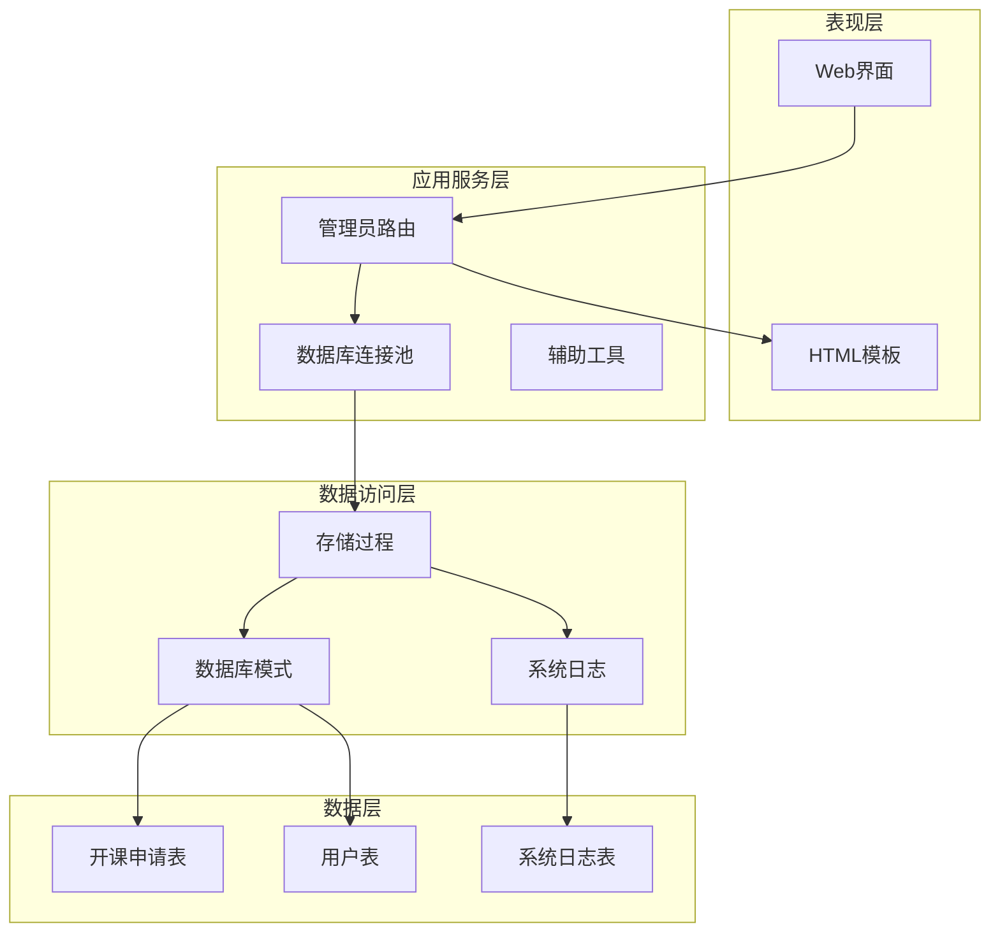
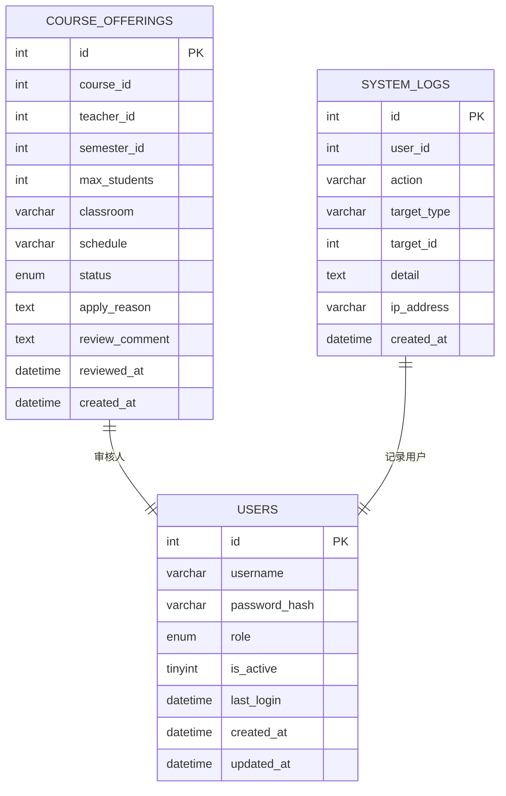
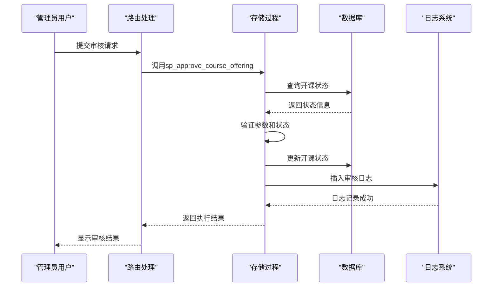
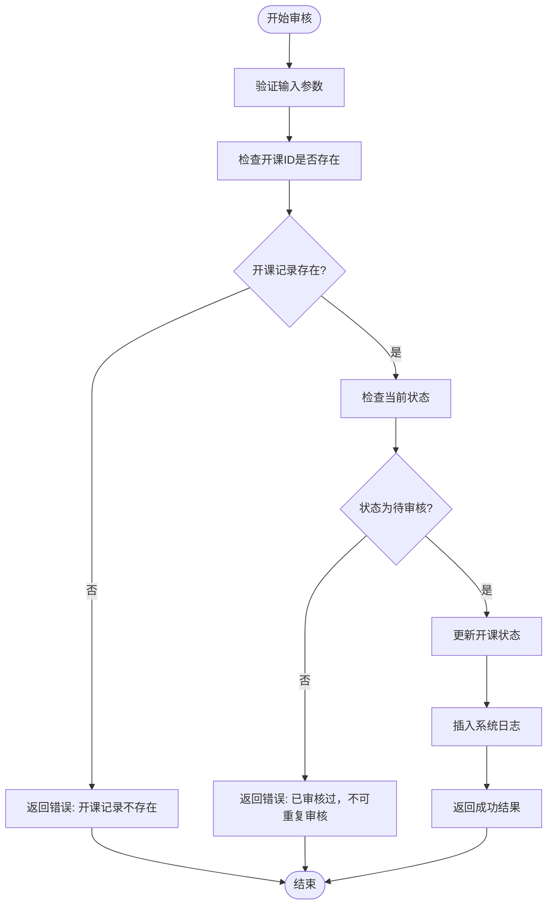
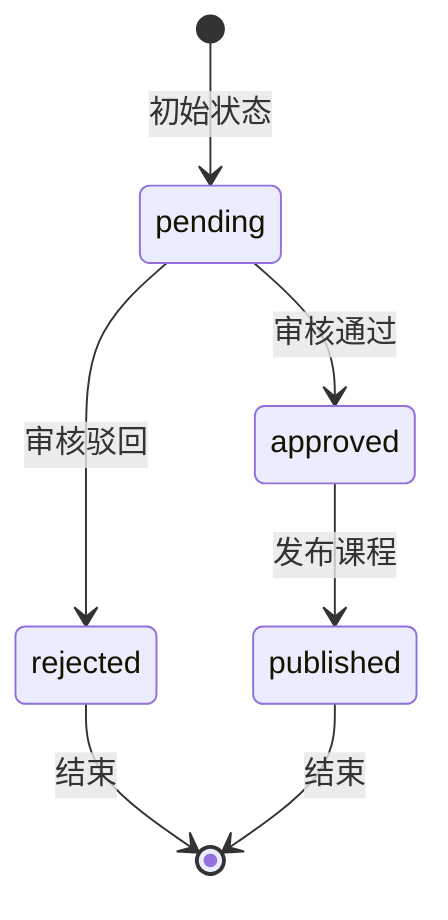
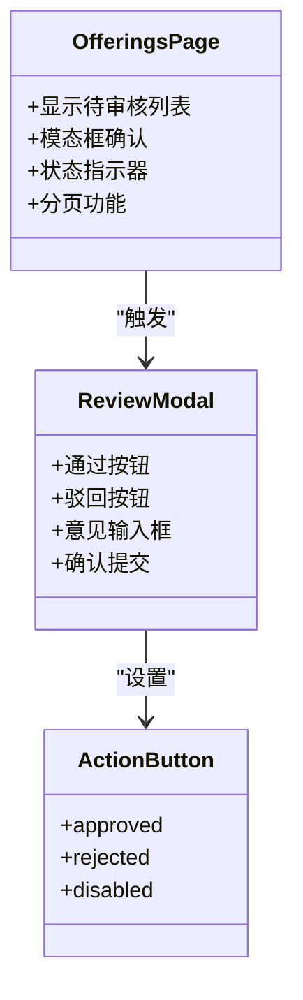
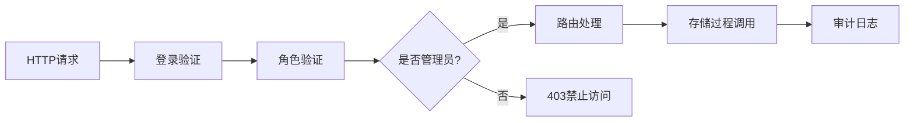
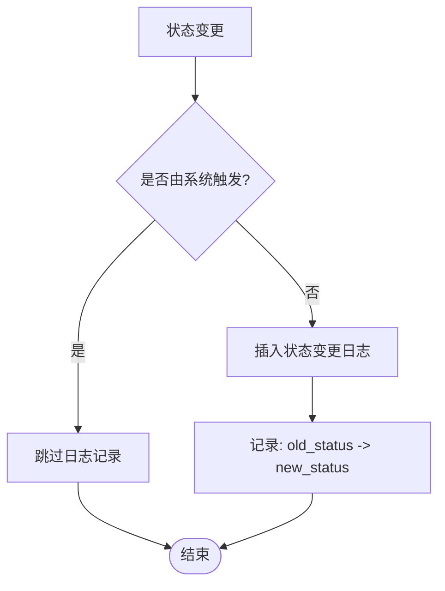
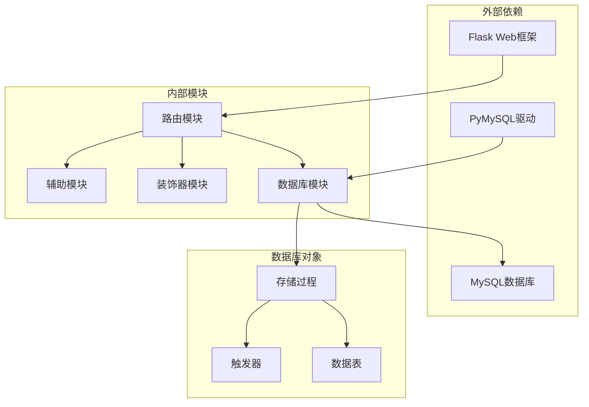
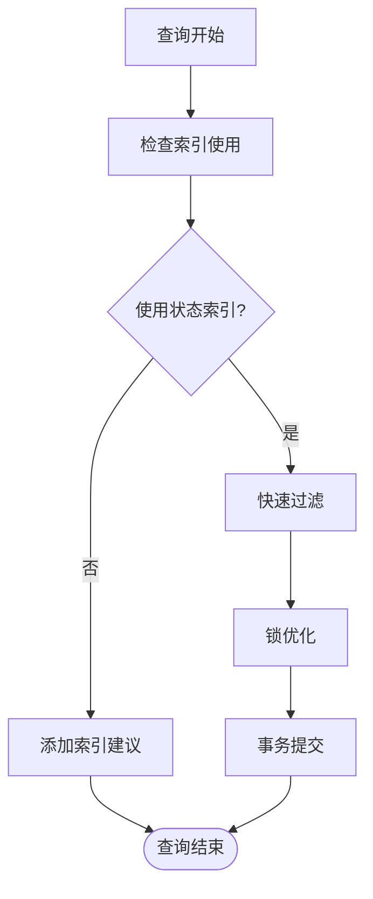

# 开课审核存储过程

<cite>
**本文档引用的文件**
- [03_procedures.sql](file://sql/03_procedures.sql)
- [01_schema.sql](file://sql/01_schema.sql)
- [02_seed.sql](file://sql/02_seed.sql)
- [routes.py](file://app/admin/routes.py)
- [db.py](file://app/db.py)
- [helpers.py](file://app/helpers.py)
- [offerings.html](file://app/templates/admin/offerings.html)
- [logs.html](file://app/templates/admin/logs.html)
</cite>

## 目录
1. [简介](#简介)
2. [项目结构](#项目结构)
3. [核心组件](#核心组件)
4. [架构概览](#架构概览)
5. [详细组件分析](#详细组件分析)
6. [依赖分析](#依赖分析)
7. [性能考虑](#性能考虑)
8. [故障排除指南](#故障排除指南)
9. [结论](#结论)

## 简介

开课审核存储过程(sp_approve_course_offering)是校园教务选课与成绩管理系统中的关键业务组件，负责管理员对教师提交的开课申请进行审核。该存储过程实现了完整的业务逻辑，包括参数验证、状态检查、审核操作和日志记录等功能，确保教务管理流程的规范性和可追溯性。

## 项目结构

该项目采用典型的三层架构设计，包含数据库层、应用服务层和表示层：

**图表来源**
- [routes.py:1-692](file://app/admin/routes.py#L1-L692)
- [db.py:1-121](file://app/db.py#L1-L121)
- [03_procedures.sql:1-381](file://sql/03_procedures.sql#L1-L381)

**章节来源**
- [routes.py:1-692](file://app/admin/routes.py#L1-L692)
- [db.py:1-121](file://app/db.py#L1-L121)
- [03_procedures.sql:1-381](file://sql/03_procedures.sql#L1-L381)

## 核心组件

### 存储过程定义

sp_approve_course_offering是一个专门设计的MySQL存储过程，具有以下核心特性：

- **参数验证**: 验证输入参数的有效性
- **状态检查**: 确保开课申请处于正确的状态
- **原子性操作**: 使用事务保证数据一致性
- **日志记录**: 自动记录审核操作的详细信息

### 数据模型支持

系统基于以下核心表结构支持开课审核功能：

**图表来源**
- [01_schema.sql:128-155](file://sql/01_schema.sql#L128-L155)
- [01_schema.sql:15-26](file://sql/01_schema.sql#L15-L26)
- [01_schema.sql:218-234](file://sql/01_schema.sql#L218-L234)

**章节来源**
- [01_schema.sql:128-155](file://sql/01_schema.sql#L128-L155)
- [01_schema.sql:218-234](file://sql/01_schema.sql#L218-L234)

## 架构概览

开课审核流程采用事件驱动的设计模式，通过存储过程实现业务逻辑的封装和复用：

**图表来源**
- [routes.py:414-432](file://app/admin/routes.py#L414-L432)
- [03_procedures.sql:277-319](file://sql/03_procedures.sql#L277-L319)

## 详细组件分析

### 存储过程实现详解

#### 参数验证机制

存储过程通过严格的参数验证确保数据完整性：

**图表来源**
- [03_procedures.sql:288-318](file://sql/03_procedures.sql#L288-L318)

#### ENUM参数处理

存储过程使用MySQL的ENUM类型处理action参数，确保数据的一致性和安全性：

| 参数 | 类型 | 描述 | 取值范围 |
|------|------|------|----------|
| p_offering_id | INT | 开课申请ID | > 0 |
| p_admin_id | INT | 审核管理员ID | > 0 |
| p_action | ENUM | 审核动作 | 'approved', 'rejected' |
| p_comment | TEXT | 审核意见 | 任意文本 |

#### 状态变更逻辑

ENUM类型的status字段支持四种状态转换：

**图表来源**
- [01_schema.sql:138](file://sql/01_schema.sql#L138)

#### 日志记录机制

系统采用统一的日志记录机制，确保所有重要操作都有据可查：

| 日志字段 | 描述 | 示例值 |
|----------|------|--------|
| action | 操作类型 | 'course_offering_approved' 或 'course_offering_rejected' |
| target_type | 目标类型 | 'course_offering' |
| target_id | 目标ID | 开课申请ID |
| detail | 操作详情 | '审核意见: [审核意见内容]' |
| user_id | 操作用户 | 当前管理员ID |

**章节来源**
- [03_procedures.sql:277-319](file://sql/03_procedures.sql#L277-L319)
- [01_schema.sql:138](file://sql/01_schema.sql#L138)

### 前端集成分析

#### 审核界面设计

管理员界面提供了直观的审核操作入口：

**图表来源**
- [offerings.html:49-74](file://app/templates/admin/offerings.html#L49-L74)

#### 权限控制集成

系统通过装饰器实现严格的权限控制：

**图表来源**
- [decorators.py:13-25](file://app/decorators.py#L13-L25)
- [routes.py:14-18](file://app/admin/routes.py#L14-L18)

**章节来源**
- [offerings.html:49-74](file://app/templates/admin/offerings.html#L49-L74)
- [decorators.py:13-25](file://app/decorators.py#L13-L25)
- [routes.py:14-18](file://app/admin/routes.py#L14-L18)

### 数据库触发器配合

系统还包含相关的数据库触发器，提供额外的审计功能：

**图表来源**
- [03_procedures.sql:363-378](file://sql/03_procedures.sql#L363-L378)

**章节来源**
- [03_procedures.sql:363-378](file://sql/03_procedures.sql#L363-L378)

## 依赖分析

### 外部依赖关系

系统的关键依赖关系如下：

**图表来源**
- [routes.py:1-692](file://app/admin/routes.py#L1-L692)
- [db.py:1-121](file://app/db.py#L1-L121)

### 内部耦合度分析

存储过程与应用层的耦合度适中，通过标准化的接口进行交互：

| 组件 | 耦合类型 | 影响程度 | 说明 |
|------|----------|----------|------|
| 存储过程 | 紧耦合 | 高 | 直接操作数据库表 |
| 路由处理 | 松耦合 | 低 | 仅通过接口调用 |
| 数据库连接 | 中等耦合 | 中等 | 通过连接池管理 |
| 日志系统 | 松耦合 | 低 | 独立的审计功能 |

**章节来源**
- [routes.py:414-432](file://app/admin/routes.py#L414-L432)
- [db.py:62-71](file://app/db.py#L62-L71)

## 性能考虑

### 并发控制机制

系统采用多种机制确保高并发环境下的数据一致性：

1. **行级锁机制**: 在状态检查时使用FOR UPDATE锁定相关记录
2. **事务隔离**: 使用START TRANSACTION确保操作的原子性
3. **唯一约束**: course_offerings表的唯一索引防止重复申请

### 查询优化策略

**图表来源**
- [03_procedures.sql:291-293](file://sql/03_procedures.sql#L291-L293)

### 缓存策略

系统通过以下方式优化性能：
- 连接池管理减少连接开销
- 分页查询避免大量数据传输
- 合理的索引设计提升查询效率

## 故障排除指南

### 常见问题诊断

| 问题类型 | 错误代码 | 可能原因 | 解决方案 |
|----------|----------|----------|----------|
| 参数错误 | 1 | 开课ID不存在 | 验证开课申请ID有效性 |
| 重复审核 | 2 | 状态非待审核 | 检查当前开课状态 |
| 数据库异常 | 99 | 系统错误 | 查看MySQL错误日志 |
| 权限不足 | 403 | 非管理员用户 | 确认用户角色认证 |

### 调试技巧

1. **启用详细日志**: 在开发环境中增加存储过程的调试输出
2. **监控慢查询**: 使用EXPLAIN分析复杂查询的执行计划
3. **压力测试**: 模拟高并发场景测试系统的稳定性

**章节来源**
- [03_procedures.sql:295-300](file://sql/03_procedures.sql#L295-L300)
- [routes.py:422-431](file://app/admin/routes.py#L422-L431)

## 结论

开课审核存储过程(sp_approve_course_offering)是教务管理系统中的关键组件，它通过以下方式确保系统的可靠性和可维护性：

1. **业务逻辑封装**: 将复杂的审核流程封装在存储过程中，便于维护和测试
2. **数据一致性保障**: 通过事务和锁机制确保数据的完整性和一致性
3. **审计追踪功能**: 完整的日志记录机制提供可追溯的操作历史
4. **权限控制集成**: 与Flask-Login系统无缝集成，确保只有授权用户才能执行审核操作

该存储过程不仅满足了当前的业务需求，还为未来的功能扩展提供了良好的基础架构。通过合理的错误处理、性能优化和安全措施，确保了系统在生产环境中的稳定运行。