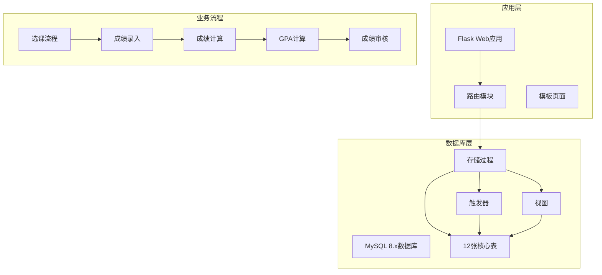
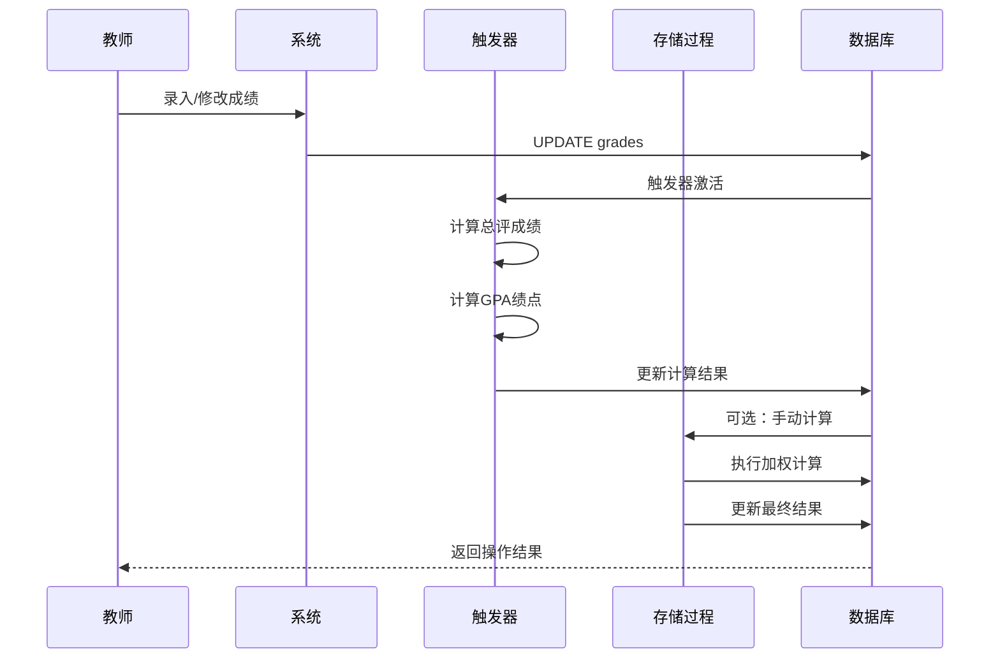
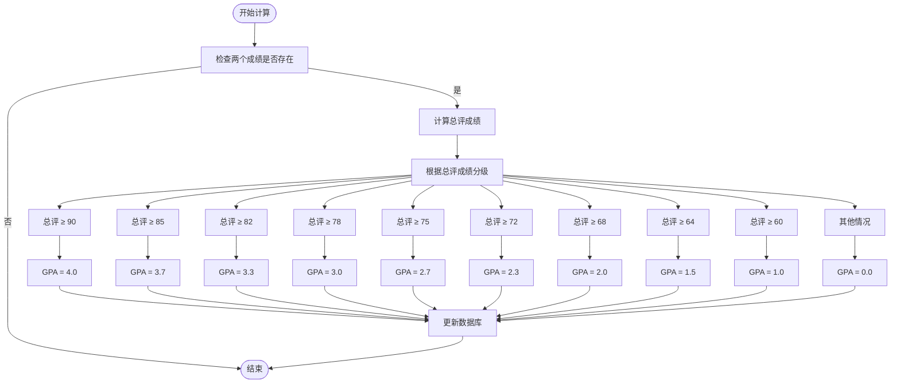
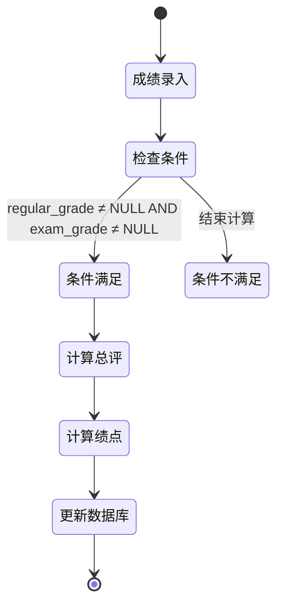
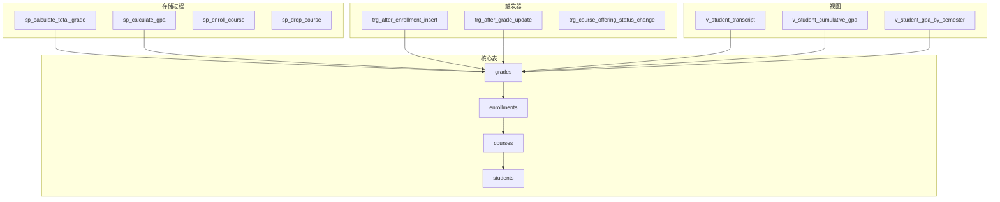

# 成绩计算存储过程

<cite>
**本文档引用的文件**
- [03_procedures.sql](file://sql/03_procedures.sql)
- [01_schema.sql](file://sql/01_schema.sql)
- [04_views.sql](file://sql/04_views.sql)
- [05_academic_alerts.sql](file://sql/05_academic_alerts.sql)
- [db.py](file://app/db.py)
- [routes.py](file://app/teacher/routes.py)
- [grades_review.html](file://app/templates/admin/grades_review.html)
</cite>

## 目录
1. [简介](#简介)
2. [项目结构](#项目结构)
3. [核心组件](#核心组件)
4. [架构概览](#架构概览)
5. [详细组件分析](#详细组件分析)
6. [依赖关系分析](#依赖关系分析)
7. [性能考虑](#性能考虑)
8. [故障排除指南](#故障排除指南)
9. [结论](#结论)

## 简介

本文档深入分析了MIS系统中的成绩计算存储过程(sp_calculate_total_grade)，详细解释了平时成绩30%和期末成绩70%的加权计算算法，以及GPA绩点的分级计算规则。该存储过程是整个成绩处理流程的核心组件，负责将原始成绩转换为最终的总评成绩和对应的绩点。

## 项目结构

MIS系统采用Flask框架构建，数据库使用MySQL 8.x，实现了完整的教务选课与成绩管理功能。系统包含12张核心表，5个存储过程，3个触发器和6个视图。



**图表来源**
- [03_procedures.sql:1-381](file://sql/03_procedures.sql#L1-L381)
- [01_schema.sql:1-235](file://sql/01_schema.sql#L1-L235)

**章节来源**
- [03_procedures.sql:1-381](file://sql/03_procedures.sql#L1-L381)
- [01_schema.sql:1-235](file://sql/01_schema.sql#L1-L235)

## 核心组件

### 成绩计算存储过程

sp_calculate_total_grade是系统的核心存储过程，负责执行以下关键功能：

1. **加权计算算法**：平时成绩占30%，期末成绩占70%
2. **精度控制**：使用ROUND函数确保计算精度
3. **GPA分级**：基于4.0制的绩点计算规则
4. **数据完整性**：仅在两个成绩字段都存在时才进行计算

### 触发器机制

系统通过触发器实现自动化的成绩计算，主要包括：

- **trg_after_enrollment_insert**：选课后自动创建成绩记录
- **trg_after_grade_update**：成绩更新时自动计算总评和绩点

### 数据模型

成绩表(grades)包含以下关键字段：
- regular_grade：平时成绩（DECIMAL(5,2)）
- exam_grade：期末成绩（DECIMAL(5,2)）
- total_grade：总评成绩（DECIMAL(5,2)）
- gpa_point：绩点（DECIMAL(3,1)）

**章节来源**
- [03_procedures.sql:197-236](file://sql/03_procedures.sql#L197-L236)
- [01_schema.sql:176-198](file://sql/01_schema.sql#L176-L198)

## 架构概览



**图表来源**
- [03_procedures.sql:338-360](file://sql/03_procedures.sql#L338-L360)
- [03_procedures.sql:197-236](file://sql/03_procedures.sql#L197-L236)

## 详细组件分析

### 存储过程算法详解

#### 加权计算算法

存储过程采用标准的加权平均算法：

```
total_grade = ROUND(regular_grade × 0.3 + exam_grade × 0.7, 2)
```

这个算法确保了期末成绩在总评中的主导地位，符合大多数教育机构的评分标准。

#### GPA绩点分级规则

系统实现了严格的4.0制绩点分级体系：



**图表来源**
- [03_procedures.sql:215-235](file://sql/03_procedures.sql#L215-L235)

#### 精度控制机制

存储过程使用ROUND函数确保计算精度：
- 总评成绩保留2位小数
- 绩点保留1位小数
- 避免浮点数运算误差

**章节来源**
- [03_procedures.sql:201-236](file://sql/03_procedures.sql#L201-L236)

### 触发器协作机制

#### 自动化计算流程



**图表来源**
- [03_procedures.sql:338-360](file://sql/03_procedures.sql#L338-L360)

#### 触发器执行时机

触发器在以下情况下自动执行：
- 成绩录入时（BEFORE UPDATE）
- 选课完成后（AFTER INSERT）
- 成绩状态变更时

**章节来源**
- [03_procedures.sql:326-360](file://sql/03_procedures.sql#L326-L360)

### 数据验证与约束

#### 成绩范围验证

系统通过数据库约束确保成绩的有效性：
- 平时成绩：0-100分
- 期末成绩：0-100分
- 总评成绩：0-100分

#### 状态管理

成绩表支持四种状态：
- draft：草稿状态
- submitted：已提交
- approved：已审核
- published：已发布

**章节来源**
- [01_schema.sql:176-198](file://sql/01_schema.sql#L176-L198)

## 依赖关系分析

### 存储过程依赖图



**图表来源**
- [03_procedures.sql:1-381](file://sql/03_procedures.sql#L1-L381)
- [04_views.sql:1-113](file://sql/04_views.sql#L1-L113)

### 外部依赖关系

系统依赖于以下外部组件：
- **PyMySQL**：Python MySQL驱动程序
- **DBUtils**：连接池管理
- **Flask**：Web应用框架
- **Bootstrap 5**：前端UI框架

**章节来源**
- [03_procedures.sql:1-381](file://sql/03_procedures.sql#L1-L381)
- [db.py:1-121](file://app/db.py#L1-L121)

## 性能考虑

### 计算优化策略

1. **索引优化**：在grades表上建立了状态索引，提高查询性能
2. **缓存机制**：使用连接池减少数据库连接开销
3. **批量处理**：支持批量成绩计算和发布
4. **事务控制**：确保数据一致性和完整性

### 内存使用优化

- 使用DECIMAL类型精确存储成绩数据
- 合理的数据类型选择避免内存浪费
- 触发器自动计算减少重复计算

## 故障排除指南

### 常见问题及解决方案

#### 成绩计算异常

**问题**：总评成绩显示为NULL
**原因**：平时成绩或期末成绩为空
**解决**：确保两个成绩字段都有有效值

#### 绩点计算错误

**问题**：绩点与预期不符
**原因**：总评成绩边界值处理
**解决**：检查90分、85分等边界值的处理逻辑

#### 触发器失效

**问题**：成绩更新后未自动计算
**原因**：触发器权限不足或语法错误
**解决**：检查触发器定义和数据库权限

**章节来源**
- [03_procedures.sql:338-360](file://sql/03_procedures.sql#L338-L360)

### 调试技巧

1. **启用MySQL日志**：监控存储过程执行
2. **使用EXPLAIN**：分析查询性能
3. **测试边界值**：验证90分、85分等临界值
4. **单元测试**：编写针对存储过程的测试用例

## 结论

sp_calculate_total_grade存储过程是MIS系统成绩管理的核心组件，通过标准化的加权计算算法和严格的GPA分级规则，确保了成绩计算的准确性和一致性。配合触发器的自动化机制，系统实现了高效、可靠的成绩处理流程。

该存储过程的设计充分考虑了教育行业的特殊需求，提供了灵活的扩展能力，能够适应不同学校的评分标准和管理要求。通过完善的错误处理和性能优化，确保了系统在高并发环境下的稳定运行。