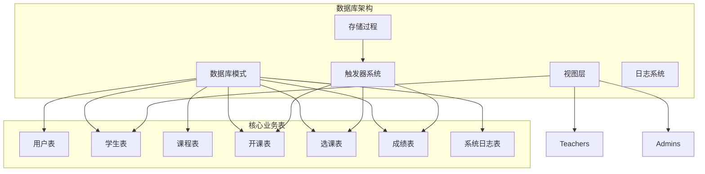
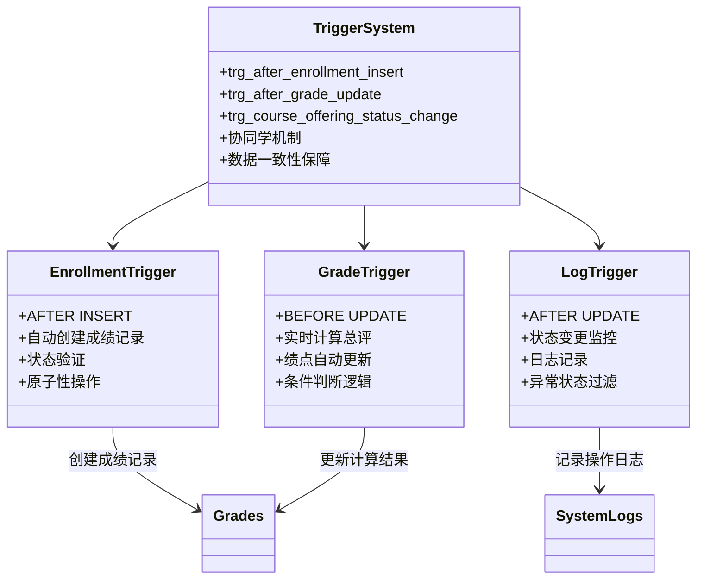
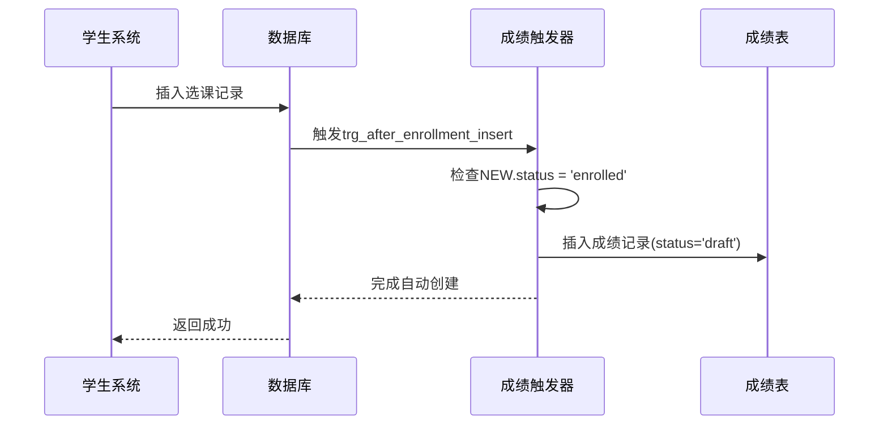
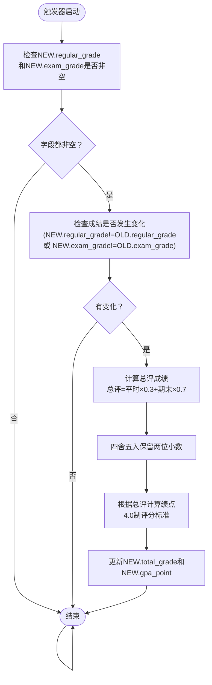
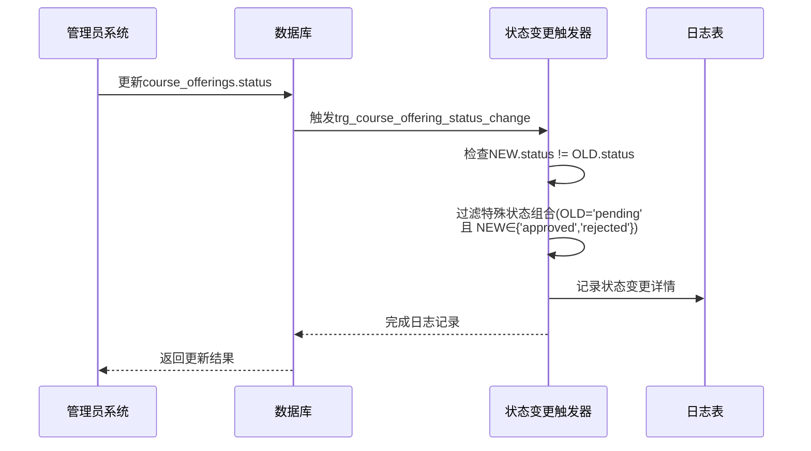
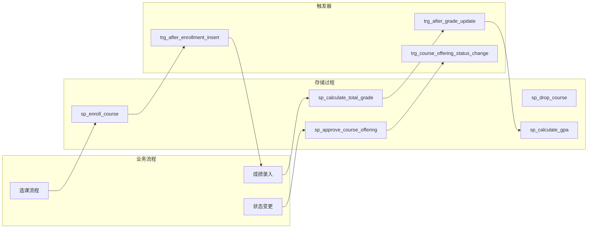
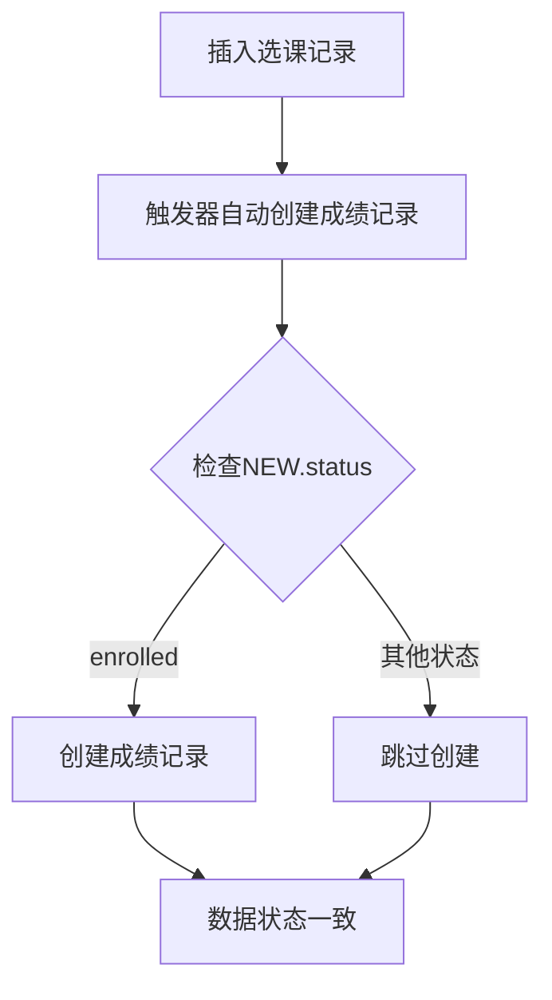

# 数据库触发器系统技术文档

<cite>
**本文档引用的文件**
- [03_procedures.sql](file://sql/03_procedures.sql)
- [01_schema.sql](file://sql/01_schema.sql)
- [04_views.sql](file://sql/04_views.sql)
- [02_seed.sql](file://sql/02_seed.sql)
</cite>

## 目录
1. [简介](#简介)
2. [项目结构概述](#项目结构概述)
3. [核心触发器架构](#核心触发器架构)
4. [触发器详细分析](#触发器详细分析)
5. [存储过程协同机制](#存储过程协同机制)
6. [数据一致性保障](#数据一致性保障)
7. [性能优化考虑](#性能优化考虑)
8. [故障排除指南](#故障排除指南)
9. [总结](#总结)

## 简介

本技术文档深入分析了校园教务选课与成绩管理系统的数据库触发器系统。该系统包含三个核心触发器，它们在数据库层面实现了业务逻辑的自动化执行，确保了数据的一致性和完整性。这些触发器与存储过程紧密协作，形成了一个高效、可靠的教务管理系统。

触发器系统主要解决以下关键问题：
- 自动化成绩记录创建
- 实时成绩计算和绩点更新
- 开课状态变更的日志记录
- 减少代码重复和提高系统可靠性

## 项目结构概述

该系统采用模块化的数据库设计，包含以下核心组件：

**图表来源**
- [01_schema.sql:15-235](file://sql/01_schema.sql#L15-L235)
- [03_procedures.sql:326-378](file://sql/03_procedures.sql#L326-L378)

**章节来源**
- [01_schema.sql:1-235](file://sql/01_schema.sql#L1-L235)
- [03_procedures.sql:1-381](file://sql/03_procedures.sql#L1-L381)

## 核心触发器架构

触发器系统由三个独立但相互关联的触发器组成，每个触发器都针对特定的业务场景进行了优化设计。

**图表来源**
- [03_procedures.sql:326-378](file://sql/03_procedures.sql#L326-L378)

### 触发器类型与执行时机

| 触发器名称 | 触发时机 | 触发条件 | 执行表 |
|-----------|----------|----------|--------|
| trg_after_enrollment_insert | AFTER INSERT | 新记录状态为'enrolled' | enrollments |
| trg_after_grade_update | BEFORE UPDATE | 成绩字段发生变化 | grades |
| trg_course_offering_status_change | AFTER UPDATE | 状态字段发生变化 | course_offerings |

## 触发器详细分析

### 触发器一：trg_after_enrollment_insert

#### 触发机制分析

该触发器在选课记录插入后自动创建对应的成绩记录，确保每个选课都有相应的成绩管理空间。

**图表来源**
- [03_procedures.sql:326-335](file://sql/03_procedures.sql#L326-L335)

#### 关键实现细节

1. **触发时机**: 使用 `AFTER INSERT` 确保选课记录已完全写入数据库
2. **状态验证**: 仅当 `NEW.status = 'enrolled'` 时才创建成绩记录
3. **初始状态设置**: 成绩记录初始状态设为 `'draft'`
4. **原子性保证**: 单次插入操作，避免并发问题

**章节来源**
- [03_procedures.sql:326-335](file://sql/03_procedures.sql#L326-L335)

### 触发器二：trg_after_grade_update

#### 触发机制分析

该触发器在成绩更新前自动计算总评成绩和对应的绩点，确保数据的实时一致性和准确性。

**图表来源**
- [03_procedures.sql:338-360](file://sql/03_procedures.sql#L338-L360)

#### 绩点计算规则

触发器实现了标准化的4.0制绩点计算体系：

| 总评分数 | 绩点等级 | 绩点数值 |
|----------|----------|----------|
| ≥90 | 优秀 | 4.0 |
| ≥85 | 良好 | 3.7 |
| ≥82 | 中等偏上 | 3.3 |
| ≥78 | 中等 | 3.0 |
| ≥75 | 中等偏下 | 2.7 |
| ≥72 | 及格偏上 | 2.3 |
| ≥68 | 及格 | 2.0 |
| ≥64 | 不及格偏上 | 1.5 |
| ≥60 | 不及格 | 1.0 |
| <60 | 严重不及格 | 0.0 |

**章节来源**
- [03_procedures.sql:338-360](file://sql/03_procedures.sql#L338-L360)

### 触发器三：trg_course_offering_status_change

#### 触发机制分析

该触发器监控开课状态的变更，自动记录系统日志，为管理决策提供数据支持。

**图表来源**
- [03_procedures.sql:363-378](file://sql/03_procedures.sql#L363-L378)

#### 日志记录策略

触发器采用了智能的日志过滤机制：

1. **状态变更检测**: 仅在 `NEW.status != OLD.status` 时记录
2. **异常状态过滤**: 避免记录从 `'pending'` 到 `'approved'` 或 `'rejected'` 的正常审批流程
3. **详细信息记录**: 记录具体的变更前后状态和时间戳
4. **用户标识**: 对于管理员操作，记录相关用户信息

**章节来源**
- [03_procedures.sql:363-378](file://sql/03_procedures.sql#L363-L378)

## 存储过程协同机制

触发器与存储过程形成了紧密的协作关系，共同实现复杂的业务逻辑。

**图表来源**
- [03_procedures.sql:14-113](file://sql/03_procedures.sql#L14-L113)
- [03_procedures.sql:197-274](file://sql/03_procedures.sql#L197-L274)
- [03_procedures.sql:326-378](file://sql/03_procedures.sql#L326-L378)

### 协同工作机制

1. **选课流程**: 存储过程负责业务逻辑验证，触发器负责数据一致性维护
2. **成绩流程**: 触发器自动计算，存储过程提供批量处理能力
3. **状态流程**: 存储过程处理复杂业务，触发器提供审计功能

**章节来源**
- [03_procedures.sql:14-113](file://sql/03_procedures.sql#L14-L113)
- [03_procedures.sql:197-274](file://sql/03_procedures.sql#L197-L274)

## 数据一致性保障

触发器系统通过多种机制确保数据的一致性和完整性：

### 1. 原子性保证

### 2. 实时计算保证

触发器在数据变更前进行计算，确保所有查询都能获取到最新的计算结果。

### 3. 审计追踪

状态变更触发器提供了完整的审计功能，便于问题追踪和合规要求。

**章节来源**
- [03_procedures.sql:326-378](file://sql/03_procedures.sql#L326-L378)

## 性能优化考虑

### 1. 触发器执行效率

- **最小化计算**: 触发器只在必要时进行计算
- **条件判断**: 使用精确的条件判断避免不必要的操作
- **索引利用**: 合理使用数据库索引提高查询性能

### 2. 内存和CPU优化

- **避免循环**: 触发器内部不使用循环结构
- **简单逻辑**: 保持触发器逻辑简洁明了
- **批量处理**: 通过存储过程处理批量数据

### 3. 并发安全

- **行级锁定**: 在存储过程中使用适当的锁定机制
- **事务隔离**: 确保触发器操作在正确事务边界内执行

## 故障排除指南

### 常见问题及解决方案

#### 1. 触发器未执行

**可能原因**:
- 触发器被禁用或删除
- 相关表结构发生变化
- 权限不足

**诊断步骤**:
1. 检查触发器状态: `SHOW TRIGGERS`
2. 验证表结构完整性
3. 确认用户权限

#### 2. 计算结果不准确

**可能原因**:
- 触发器逻辑错误
- 数据类型不匹配
- 精度丢失

**修复方案**:
1. 检查触发器定义
2. 验证数据类型和精度
3. 添加适当的错误处理

#### 3. 性能问题

**优化建议**:
1. 分析触发器执行计划
2. 检查相关索引使用情况
3. 考虑异步处理机制

**章节来源**
- [03_procedures.sql:326-378](file://sql/03_procedures.sql#L326-L378)

## 总结

数据库触发器系统为校园教务选课与成绩管理系统提供了强大的自动化能力。通过三个核心触发器的协同工作，系统实现了：

### 主要优势

1. **自动化程度高**: 减少了手动干预，提高了系统效率
2. **数据一致性强**: 确保所有相关表的数据始终保持同步
3. **业务逻辑集中**: 将复杂的业务规则封装在数据库层面
4. **可维护性强**: 触发器作为数据库对象，便于版本管理和部署

### 技术特点

- **实时响应**: 触发器在数据变更时立即执行
- **透明性**: 应用层无需关心触发器的存在
- **可扩展性**: 易于添加新的触发器来支持新业务需求
- **安全性**: 提供了额外的数据验证和审计功能

### 最佳实践建议

1. **定期审查**: 定期检查触发器的执行效果和性能
2. **文档维护**: 保持触发器文档与实际实现同步
3. **测试覆盖**: 为触发器编写充分的测试用例
4. **监控告警**: 建立触发器执行状态的监控机制

该触发器系统为整个教务管理系统的稳定运行提供了坚实的基础，是实现业务自动化和数据一致性的重要技术支撑。