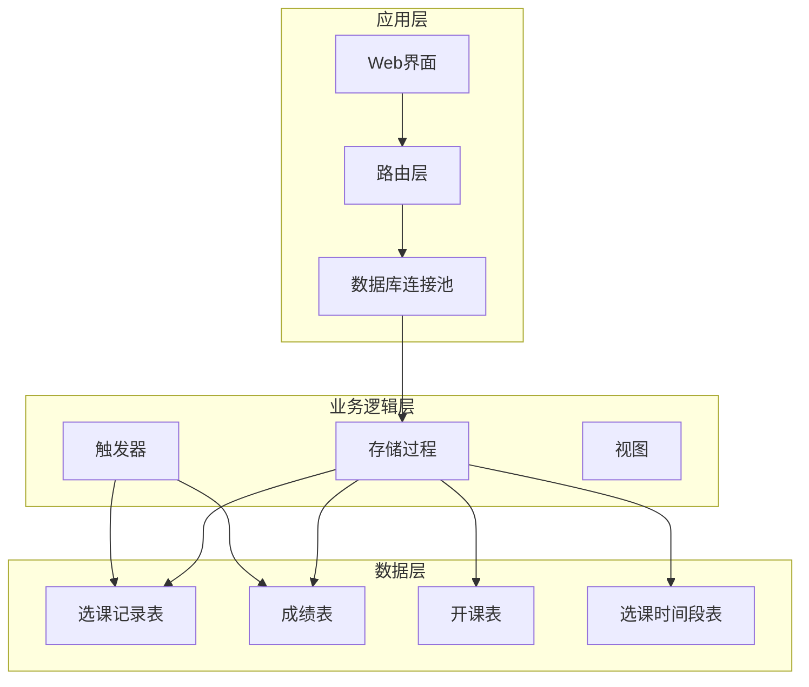
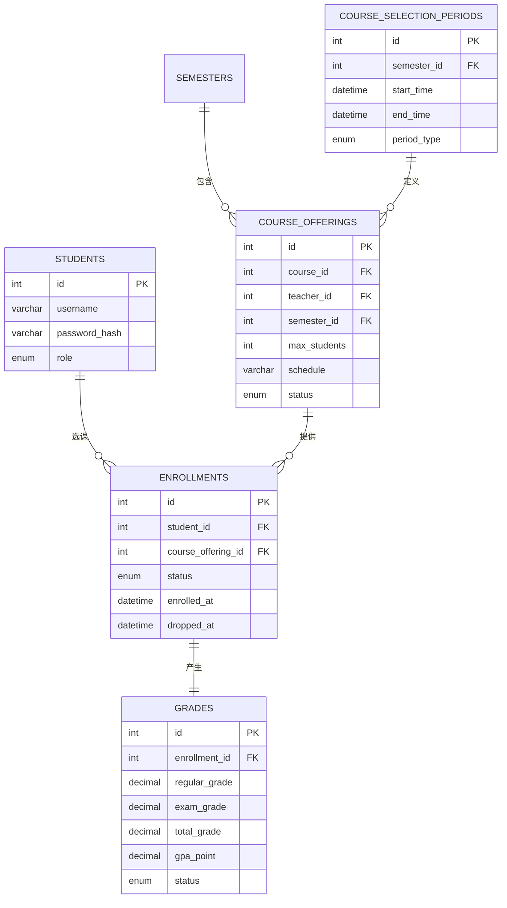
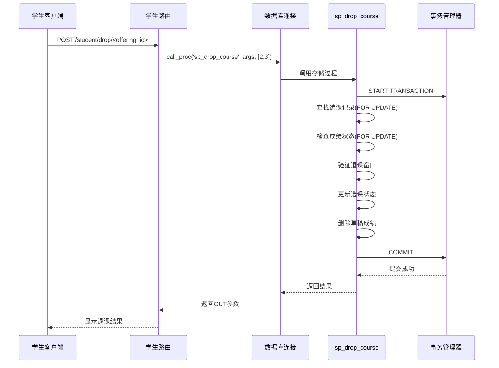
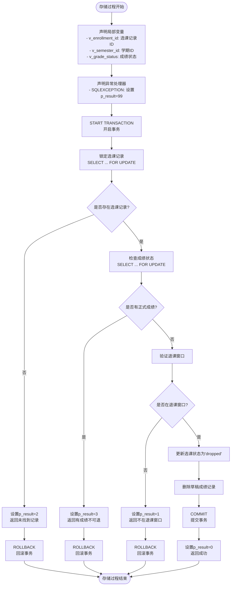
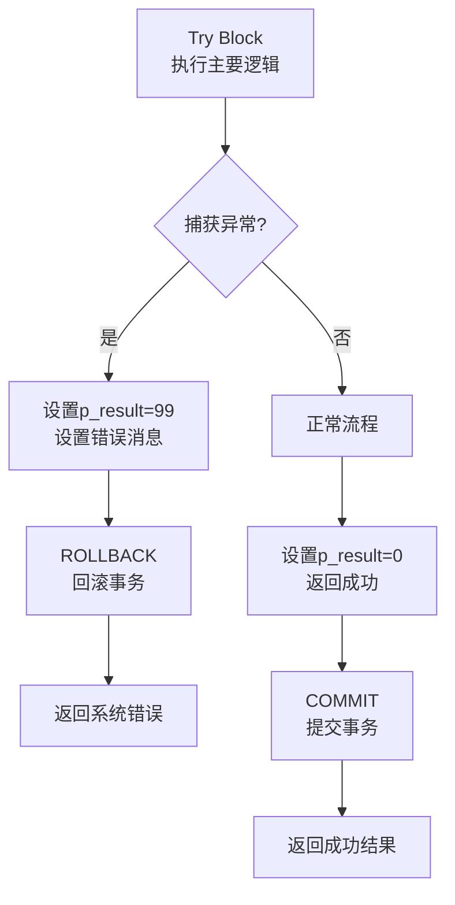
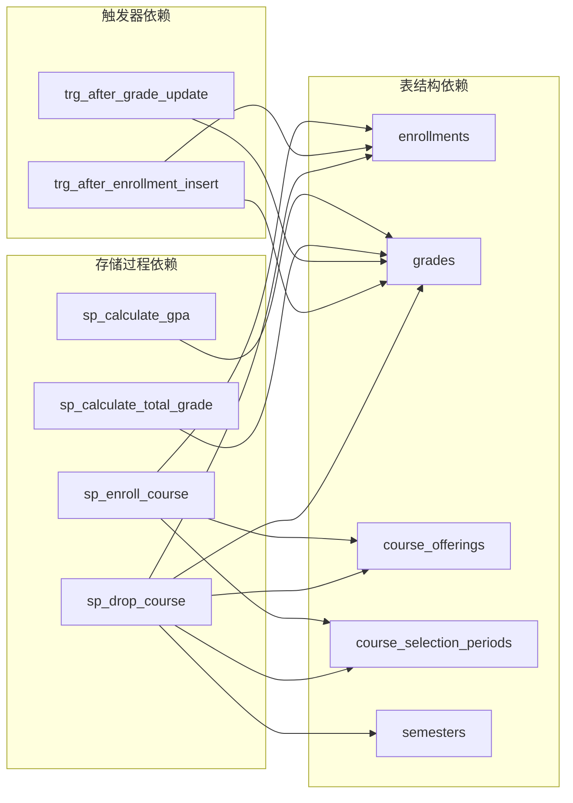
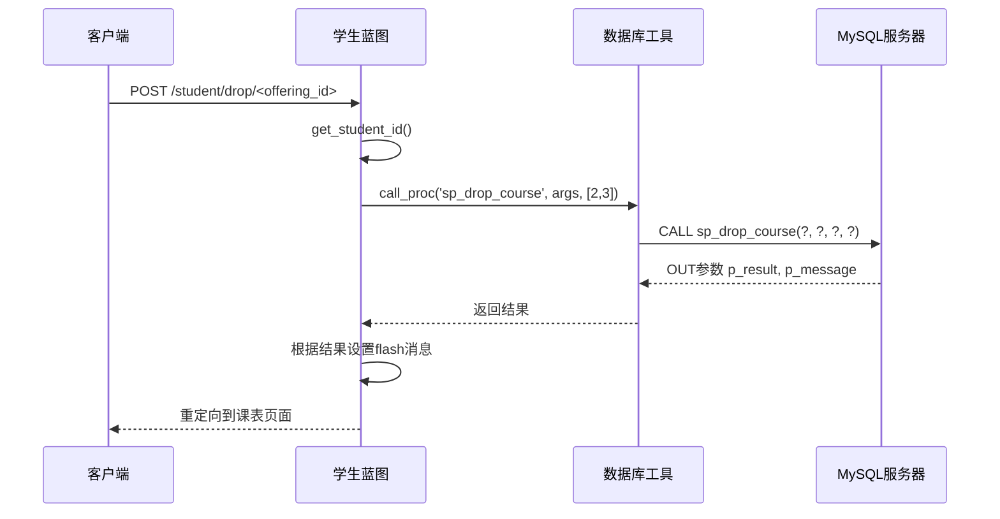

# 退课存储过程

<cite>
**本文档引用的文件**
- [sql/03_procedures.sql](file://sql/03_procedures.sql)
- [sql/01_schema.sql](file://sql/01_schema.sql)
- [app/student/routes.py](file://app/student/routes.py)
- [app/db.py](file://app/db.py)
- [README.md](file://README.md)
</cite>

## 目录
1. [简介](#简介)
2. [项目结构](#项目结构)
3. [核心组件](#核心组件)
4. [架构概览](#架构概览)
5. [详细组件分析](#详细组件分析)
6. [依赖关系分析](#依赖关系分析)
7. [性能考虑](#性能考虑)
8. [故障排除指南](#故障排除指南)
9. [结论](#结论)

## 简介

本文档详细分析了校园教务选课与成绩管理系统中的退课存储过程（sp_drop_course）。该存储过程是系统核心业务逻辑的重要组成部分，负责处理学生的退课请求，确保数据一致性和业务规则的正确执行。

系统采用MySQL 8.x数据库，使用原生SQL、存储过程、触发器和视图构建完整的教务管理系统。存储过程实现了严格的事务控制、并发安全和错误处理机制。

## 项目结构

MIS系统采用模块化架构，主要包含以下核心组件：



**图表来源**
- [README.md:46-69](file://README.md#L46-L69)
- [sql/01_schema.sql:158-215](file://sql/01_schema.sql#L158-L215)

**章节来源**
- [README.md:46-87](file://README.md#L46-L87)
- [sql/01_schema.sql:1-235](file://sql/01_schema.sql#L1-235)

## 核心组件

### 存储过程概述

退课存储过程（sp_drop_course）是系统的核心业务组件，负责处理学生退课请求的完整流程。该过程实现了以下关键功能：

- **参数验证**：验证输入参数的有效性
- **记录查找**：定位特定学生的选课记录
- **状态检查**：验证成绩状态和退课窗口
- **并发控制**：使用FOR UPDATE锁机制确保数据一致性
- **事务管理**：原子性地执行退课操作

### 错误状态码定义

存储过程使用标准化的错误状态码系统：

| 状态码 | 含义 | 触发条件 |
|--------|------|----------|
| 0 | 成功 | 退课操作顺利完成 |
| 1 | 不在退课窗口 | 当前时间不在退课时间段内 |
| 2 | 未找到记录 | 学生未选该课程或已退课 |
| 3 | 有成绩不可退 | 该课程已有正式成绩记录 |
| 99 | 系统错误 | 数据库异常或其他系统故障 |

**章节来源**
- [sql/03_procedures.sql:119-124](file://sql/03_procedures.sql#L119-L124)

## 架构概览

### 数据模型关系



**图表来源**
- [sql/01_schema.sql:158-215](file://sql/01_schema.sql#L158-L215)

### 业务流程架构



**图表来源**
- [app/student/routes.py:162-173](file://app/student/routes.py#L162-L173)
- [app/db.py:62-70](file://app/db.py#L62-L70)

## 详细组件分析

### 存储过程实现详解

#### 参数定义与声明

存储过程采用标准的IN/OUT参数模式：



**图表来源**
- [sql/03_procedures.sql:125-194](file://sql/03_procedures.sql#L125-L194)

#### 关键业务规则实现

##### 1. 选课记录查找与锁定

存储过程使用JOIN查询同时获取选课记录ID和学期ID，并通过FOR UPDATE实现行级锁：

```sql
SELECT e.id, co.semester_id
  INTO v_enrollment_id, v_semester_id
  FROM enrollments e
  JOIN course_offerings co ON e.course_offering_id = co.id
 WHERE e.student_id = p_student_id
   AND e.course_offering_id = p_offering_id
   AND e.status = 'enrolled'
   FOR UPDATE;
```

**章节来源**
- [sql/03_procedures.sql:140-147](file://sql/03_procedures.sql#L140-L147)

##### 2. 成绩状态检查机制

```sql
SELECT status INTO v_grade_status
  FROM grades
 WHERE enrollment_id = v_enrollment_id
   FOR UPDATE;
```

该查询确保：
- 使用FOR UPDATE锁定相关记录
- 检查非草稿状态的成绩记录
- 防止并发修改导致的数据不一致

**章节来源**
- [sql/03_procedures.sql:157-160](file://sql/03_procedures.sql#L157-L160)

##### 3. 退课窗口验证逻辑

```sql
IF NOT EXISTS (
    SELECT 1 FROM course_selection_periods
     WHERE semester_id = v_semester_id
       AND period_type = 'drop'
       AND is_active = 1
       AND NOW() BETWEEN start_time AND end_time
) THEN
    SET p_result = 1;
    SET p_message = '当前不在退课窗口期内';
    ROLLBACK;
    LEAVE main_block;
END IF;
```

**章节来源**
- [sql/03_procedures.sql:170-181](file://sql/03_procedures.sql#L170-L181)

##### 4. 数据一致性维护

```sql
UPDATE enrollments
   SET status = 'dropped', dropped_at = NOW()
 WHERE id = v_enrollment_id;

DELETE FROM grades
 WHERE enrollment_id = v_enrollment_id
   AND status = 'draft';
```

**章节来源**
- [sql/03_procedures.sql:183-189](file://sql/03_procedures.sql#L183-L189)

### 并发控制机制

#### FOR UPDATE锁机制

存储过程在多个关键点使用FOR UPDATE锁：

1. **选课记录锁定**：防止其他事务修改同一选课记录
2. **成绩记录锁定**：确保成绩状态检查的准确性
3. **数据完整性保证**：避免竞态条件导致的数据不一致

#### 事务隔离级别

存储过程使用默认的可重复读隔离级别，确保：
- 事务内的多次查询返回一致的结果
- 防止脏读、不可重复读和幻读问题
- 通过锁机制实现强一致性

**章节来源**
- [sql/03_procedures.sql:137-147](file://sql/03_procedures.sql#L137-L147)

### 错误处理与恢复机制

#### 异常处理器设计



**图表来源**
- [sql/03_procedures.sql:130-135](file://sql/03_procedures.sql#L130-L135)

#### 错误状态码详细说明

| 状态码 | 错误类型 | 业务含义 | 处理建议 |
|--------|----------|----------|----------|
| 0 | 成功 | 退课操作完成 | 通知用户操作成功 |
| 1 | 时间窗口错误 | 不在退课时间段 | 提示用户等待合适时机 |
| 2 | 记录不存在 | 学生未选该课程 | 检查课程选择状态 |
| 3 | 成绩状态错误 | 已有正式成绩记录 | 联系教务部门处理 |
| 99 | 系统错误 | 数据库异常 | 记录日志并重试 |

**章节来源**
- [sql/03_procedures.sql:119-124](file://sql/03_procedures.sql#L119-L124)

## 依赖关系分析

### 数据库依赖关系



**图表来源**
- [sql/03_procedures.sql:117-381](file://sql/03_procedures.sql#L117-L381)
- [sql/01_schema.sql:158-215](file://sql/01_schema.sql#L158-L215)

### 应用层集成

#### 路由层集成



**图表来源**
- [app/student/routes.py:162-173](file://app/student/routes.py#L162-L173)
- [app/db.py:62-70](file://app/db.py#L62-L70)

**章节来源**
- [app/student/routes.py:162-173](file://app/student/routes.py#L162-L173)
- [app/db.py:62-70](file://app/db.py#L62-L70)

## 性能考虑

### 查询优化策略

#### 索引利用

存储过程充分利用了数据库的索引设计：

1. **主键索引**：enrollments.id, grades.id
2. **唯一索引**：enrollments.uk_enrollment
3. **复合索引**：enrollments.idx_enroll_offering, enrollments.idx_enroll_status
4. **外键索引**：course_offerings.idx_offering_semester

#### 锁竞争优化

- 使用FOR UPDATE只锁定必要的行，减少锁竞争
- 事务持续时间尽可能短，降低锁持有时间
- 合理的查询顺序避免死锁

### 并发性能

#### 事务隔离

- 可重复读隔离级别确保查询一致性
- 行级锁机制支持高并发场景
- 适当的超时设置防止长时间阻塞

#### 缓存策略

虽然存储过程本身不使用应用层缓存，但数据库层面的查询优化可以显著提升性能。

## 故障排除指南

### 常见问题诊断

#### 1. 退课失败但无明确错误信息

**可能原因**：
- 数据库连接异常
- 存储过程权限不足
- 事务超时

**解决方法**：
- 检查数据库连接状态
- 验证用户权限设置
- 查看MySQL错误日志

#### 2. 并发退课冲突

**症状**：多个用户同时退课导致部分失败

**解决方案**：
- 检查FOR UPDATE锁的正确使用
- 优化事务处理时间
- 实施重试机制

#### 3. 成绩状态检查异常

**问题**：即使没有正式成绩也提示不可退课

**排查步骤**：
- 检查grades表中是否有草稿状态记录
- 验证触发器是否正确创建
- 确认FOR UPDATE锁的正确应用

**章节来源**
- [sql/03_procedures.sql:130-135](file://sql/03_procedures.sql#L130-L135)

### 调试技巧

#### 存储过程调试

1. **启用MySQL日志**：查看实际执行的SQL语句
2. **使用EXPLAIN**：分析查询执行计划
3. **监控锁等待**：使用SHOW ENGINE INNODB STATUS

#### 应用层调试

1. **检查参数传递**：确认IN参数的正确性
2. **验证OUT参数**：确保正确接收返回值
3. **查看事务状态**：确认事务提交/回滚行为

## 结论

退课存储过程（sp_drop_course）是MIS系统中实现业务规则和数据一致性的关键组件。通过精心设计的并发控制机制、严格的错误处理和完善的事务管理，该存储过程确保了退课操作的可靠性和数据完整性。

### 主要优势

1. **强一致性保证**：通过FOR UPDATE锁和事务控制确保数据一致性
2. **完善的错误处理**：标准化的状态码和详细的错误信息
3. **并发安全性**：有效的锁机制防止竞态条件
4. **业务规则实现**：准确执行退课窗口和成绩状态检查

### 最佳实践建议

1. **监控性能指标**：定期检查存储过程的执行时间和锁等待情况
2. **备份策略**：定期备份数据库，确保数据安全
3. **权限管理**：严格控制存储过程的访问权限
4. **日志记录**：完善操作日志，便于审计和故障排查

该存储过程的设计体现了现代数据库应用开发的最佳实践，为类似教务管理系统的开发提供了优秀的参考范例。