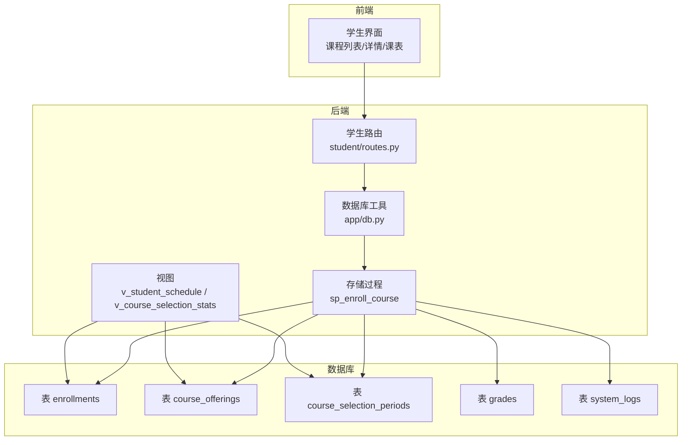
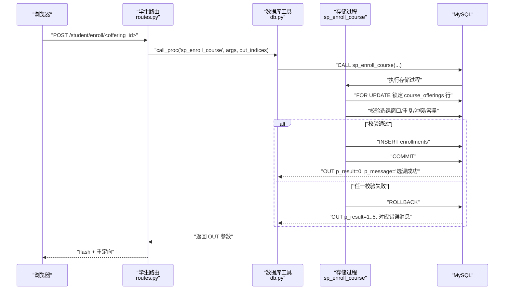
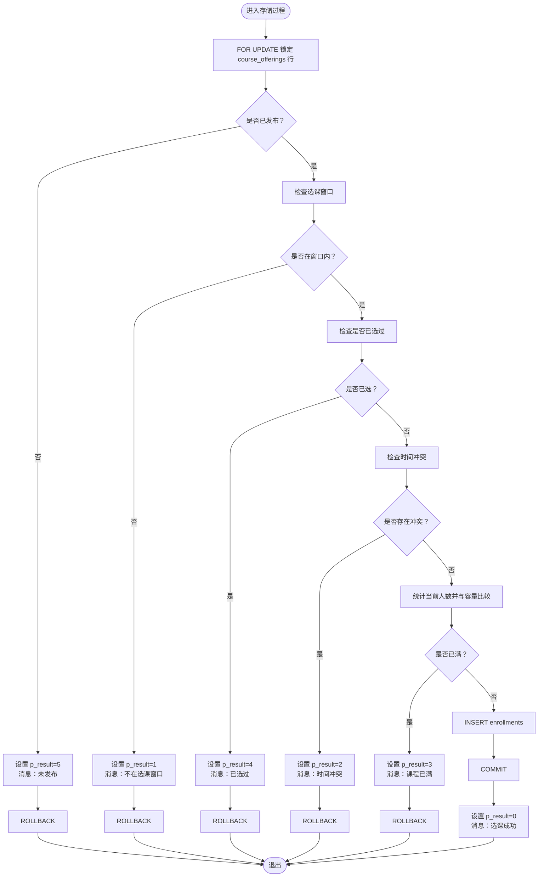
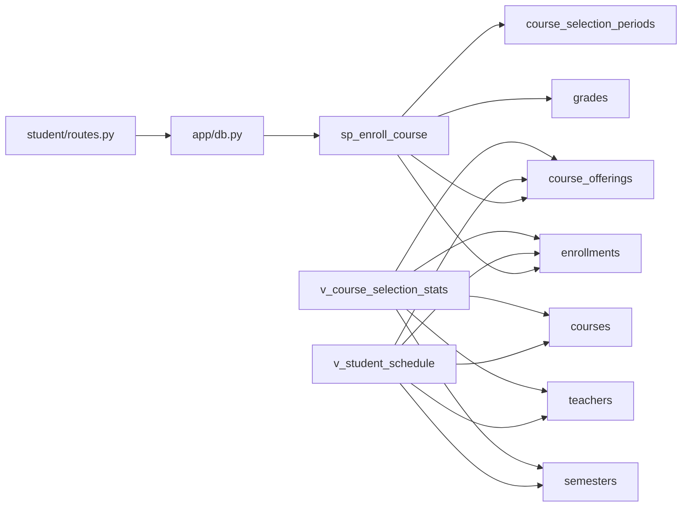

# 选课存储过程

<cite>
**本文引用的文件**
- [03_procedures.sql](file://sql/03_procedures.sql)
- [01_schema.sql](file://sql/01_schema.sql)
- [02_seed.sql](file://sql/02_seed.sql)
- [04_views.sql](file://sql/04_views.sql)
- [routes.py](file://app/student/routes.py)
- [db.py](file://app/db.py)
- [helpers.py](file://app/helpers.py)
</cite>

## 目录
1. [简介](#简介)
2. [项目结构](#项目结构)
3. [核心组件](#核心组件)
4. [架构总览](#架构总览)
5. [详细组件分析](#详细组件分析)
6. [依赖分析](#依赖分析)
7. [性能考虑](#性能考虑)
8. [故障排查指南](#故障排查指南)
9. [结论](#结论)

## 简介
本文档围绕选课存储过程 sp_enroll_course 的完整实现进行深入解析，覆盖参数校验、选课窗口检查、时间冲突检测、容量检查、重复选课检查等关键业务逻辑，并详细说明其如何通过行级锁与事务控制保障并发一致性，以及错误处理策略。同时给出13种返回状态码的业务含义说明，解释该过程在保证数据一致性和完整性方面的作用，以及与其它存储过程和视图的协作关系。

## 项目结构
本项目采用前后端分离的Flask应用与MySQL数据库结合的方式组织代码。与选课存储过程直接相关的核心文件如下：
- 存储过程与触发器定义：sql/03_procedures.sql
- 数据库表结构定义：sql/01_schema.sql
- 种子数据（包含选课时间段示例）：sql/02_seed.sql
- 视图定义（用于统计与展示）：sql/04_views.sql
- 路由与调用封装：app/student/routes.py、app/db.py
- 辅助工具（时间槽解析、选课窗口查询等）：app/helpers.py

图表来源
- [03_procedures.sql:14-113](file://sql/03_procedures.sql#L14-L113)
- [01_schema.sql:158-174](file://sql/01_schema.sql#L158-L174)
- [01_schema.sql:128-155](file://sql/01_schema.sql#L128-L155)
- [01_schema.sql:200-215](file://sql/01_schema.sql#L200-L215)
- [04_views.sql:10-32](file://sql/04_views.sql#L10-L32)
- [04_views.sql:72-91](file://sql/04_views.sql#L72-L91)

章节来源
- [03_procedures.sql:14-113](file://sql/03_procedures.sql#L14-L113)
- [01_schema.sql:158-174](file://sql/01_schema.sql#L158-L174)
- [01_schema.sql:128-155](file://sql/01_schema.sql#L128-L155)
- [01_schema.sql:200-215](file://sql/01_schema.sql#L200-L215)
- [04_views.sql:10-32](file://sql/04_views.sql#L10-L32)
- [04_views.sql:72-91](file://sql/04_views.sql#L72-L91)

## 核心组件
- 选课存储过程 sp_enroll_course：负责参数校验、选课窗口检查、时间冲突检测、容量检查、重复选课检查、行级锁与事务控制、错误处理与结果返回。
- 调用方封装：app/db.py 提供 call_proc 方法统一调用存储过程并读取 OUT 参数。
- 路由层：app/student/routes.py 在学生端课程页面提交选课请求，调用 sp_enroll_course 并根据返回状态提示用户。
- 表结构支撑：course_offerings（开课）、enrollments（选课记录）、course_selection_periods（选课时间段）、grades（成绩）、system_logs（日志）。
- 视图支撑：v_student_schedule、v_course_selection_stats 用于展示与统计。

章节来源
- [03_procedures.sql:14-113](file://sql/03_procedures.sql#L14-L113)
- [db.py:62-71](file://app/db.py#L62-L71)
- [routes.py:148-159](file://app/student/routes.py#L148-L159)
- [01_schema.sql:128-174](file://sql/01_schema.sql#L128-L174)
- [04_views.sql:10-32](file://sql/04_views.sql#L10-L32)

## 架构总览
选课流程从浏览器发起，经由Flask路由层，调用数据库工具封装的存储过程调用方法，最终在MySQL中执行 sp_enroll_course。该过程通过行级锁与事务确保并发安全，同时在异常情况下回滚并返回系统错误码。

图表来源
- [routes.py:148-159](file://app/student/routes.py#L148-L159)
- [db.py:62-71](file://app/db.py#L62-L71)
- [03_procedures.sql:14-113](file://sql/03_procedures.sql#L14-L113)

## 详细组件分析

### 存储过程：sp_enroll_course
- 输入参数
  - p_student_id：学生ID
  - p_offering_id：开课ID
  - 输出参数
    - p_result：整型状态码（0=成功，1=不在选课窗口，2=时间冲突，3=已满，4=已选过，5=未发布，99=系统错误）
    - p_message：字符串消息
- 主要处理步骤
  1) 异常处理器：捕获SQLEXCEPTION，回滚事务，设置p_result=99，p_message=“系统错误，选课失败”
  2) 开启事务
  3) 行级锁：对 course_offerings 进行 FOR UPDATE，读取 semester_id、schedule、max_students
     - 若未发布（status != 'published'），返回5并回滚
  4) 选课窗口检查：查询 course_selection_periods，要求 period_type='selection'、is_active=1、当前时间在 start_time..end_time 之间
     - 不在窗口内则返回1并回滚
  5) 重复选课检查：enrollments 中是否存在相同 student_id 与 course_offering_id 且 status='enrolled'
     - 已存在则返回4并回滚
  6) 时间冲突检查：若开课 schedule 非空，则查询该学生在同一学期已选课程中是否存在相同 schedule
     - 冲突则返回2并回滚
  7) 容量检查：统计当前已选人数与 max_students 比较
     - 已满则返回3并回滚
  8) 原子插入：INSERT enrollments 记录
  9) 提交事务，设置 p_result=0，p_message='选课成功'

图表来源
- [03_procedures.sql:14-113](file://sql/03_procedures.sql#L14-L113)

章节来源
- [03_procedures.sql:14-113](file://sql/03_procedures.sql#L14-L113)

### 参数与约束
- 参数类型与用途
  - p_student_id：学生标识，作为重复选课与时间冲突检查的维度
  - p_offering_id：开课标识，作为容量与发布状态检查的维度
- 外键与唯一性
  - course_offerings 与 courses、teachers、semesters 关联
  - enrollments 唯一键 (student_id, course_offering_id)，避免重复选课
  - course_offerings 唯一键 (course_id, teacher_id, semester_id)，避免同一教师同课程同学期重复开课
- 索引与约束
  - course_offerings.status、course_selection_periods.period_type、enrollments.status 等字段建立索引，提升查询效率

章节来源
- [01_schema.sql:128-155](file://sql/01_schema.sql#L128-L155)
- [01_schema.sql:158-174](file://sql/01_schema.sql#L158-L174)
- [01_schema.sql:200-215](file://sql/01_schema.sql#L200-L215)

### 事务与并发控制
- 事务边界：整个选课过程包裹在单个事务中，确保原子性
- 行级锁：通过 FOR UPDATE 对 course_offerings 的目标行加锁，阻塞其他并发请求对同一开课行的修改，从而避免“超卖”与不一致
- 并发场景下的行为
  - 多个学生同时选同一门课时，只有拿到锁的请求能继续后续检查与插入，其余请求被阻塞直至前一个请求提交或回滚
  - 由于唯一键约束，即使并发也只会有一个成功，其余会因违反唯一性而回滚并返回相应状态码

章节来源
- [03_procedures.sql:33-40](file://sql/03_procedures.sql#L33-L40)
- [03_procedures.sql:93-104](file://sql/03_procedures.sql#L93-L104)
- [01_schema.sql](file://sql/01_schema.sql#L167)

### 错误处理策略
- 异常捕获：使用 EXIT HANDLER 捕获 SQLEXCEPTION，统一回滚并设置 p_result=99
- 业务错误：在不同分支显式设置 p_result 与 p_message，并立即 ROLLBACK + LEAVE main_block
- 调用侧处理：前端路由层根据返回的状态码显示对应提示

章节来源
- [03_procedures.sql:26-31](file://sql/03_procedures.sql#L26-L31)
- [03_procedures.sql:42-47](file://sql/03_procedures.sql#L42-L47)
- [03_procedures.sql:56-61](file://sql/03_procedures.sql#L56-L61)
- [03_procedures.sql:73-74](file://sql/03_procedures.sql#L73-L74)
- [03_procedures.sql:88-91](file://sql/03_procedures.sql#L88-L91)
- [03_procedures.sql:102-104](file://sql/03_procedures.sql#L102-L104)
- [routes.py:152-156](file://app/student/routes.py#L152-L156)

### 返回状态码与业务含义
- 0：成功
- 1：不在选课窗口
- 2：时间冲突
- 3：课程已满
- 4：已选过该课程
- 5：该课程未发布
- 99：系统错误（数据库异常）

章节来源
- [03_procedures.sql:17-18](file://sql/03_procedures.sql#L17-L18)
- [03_procedures.sql:42-47](file://sql/03_procedures.sql#L42-L47)
- [03_procedures.sql:56-61](file://sql/03_procedures.sql#L56-L61)
- [03_procedures.sql:69-74](file://sql/03_procedures.sql#L69-L74)
- [03_procedures.sql:86-91](file://sql/03_procedures.sql#L86-L91)
- [03_procedures.sql:99-104](file://sql/03_procedures.sql#L99-L104)
- [03_procedures.sql:26-31](file://sql/03_procedures.sql#L26-L31)

### 与其它存储过程与视图的协作
- 与 sp_drop_course 协作：两者均使用 FOR UPDATE 与事务控制，分别处理“选课”和“退课”的并发一致性
- 与视图协作：v_student_schedule 展示学生课表，v_course_selection_stats 提供选课统计，二者依赖 enrollments、course_offerings、courses、teachers、semesters 等表
- 与触发器协作：trg_after_enrollment_insert 在选课成功后自动创建成绩记录；trg_after_grade_update 在成绩更新时自动计算总评与绩点

章节来源
- [03_procedures.sql:119-194](file://sql/03_procedures.sql#L119-L194)
- [03_procedures.sql:326-335](file://sql/03_procedures.sql#L326-L335)
- [03_procedures.sql:338-360](file://sql/03_procedures.sql#L338-L360)
- [04_views.sql:10-32](file://sql/04_views.sql#L10-L32)
- [04_views.sql:72-91](file://sql/04_views.sql#L72-L91)

## 依赖分析
- 表依赖
  - sp_enroll_course 依赖 course_offerings（发布状态、容量、时间安排）、enrollments（重复选课、容量统计）、course_selection_periods（选课窗口）、grades（触发器关联）
- 路由与工具依赖
  - routes.py 通过 db.py 的 call_proc 统一调用存储过程，并解析 OUT 参数
- 视图依赖
  - v_student_schedule、v_course_selection_stats 依赖 enrollments、course_offerings、courses、teachers、semesters

图表来源
- [03_procedures.sql:14-113](file://sql/03_procedures.sql#L14-L113)
- [01_schema.sql:128-174](file://sql/01_schema.sql#L128-L174)
- [04_views.sql:10-32](file://sql/04_views.sql#L10-L32)
- [04_views.sql:72-91](file://sql/04_views.sql#L72-L91)
- [routes.py:148-159](file://app/student/routes.py#L148-L159)
- [db.py:62-71](file://app/db.py#L62-L71)

章节来源
- [03_procedures.sql:14-113](file://sql/03_procedures.sql#L14-L113)
- [01_schema.sql:128-174](file://sql/01_schema.sql#L128-L174)
- [04_views.sql:10-32](file://sql/04_views.sql#L10-L32)
- [04_views.sql:72-91](file://sql/04_views.sql#L72-L91)
- [routes.py:148-159](file://app/student/routes.py#L148-L159)
- [db.py:62-71](file://app/db.py#L62-L71)

## 性能考虑
- 行级锁粒度：FOR UPDATE 只锁定目标行，减少锁竞争范围，提高并发吞吐
- 索引优化：course_offerings.status、enrollments.status、course_selection_periods.period_type 等字段建立索引，加速窗口与状态查询
- 唯一键约束：enrollments 的唯一键避免重复选课，减少冗余数据与后续冲突检测成本
- 统计查询：容量检查使用 COUNT(*) 聚合，FOR UPDATE 已确保一致性，避免脏读
- 前端冲突检测：helpers.py 的 parse_schedule_slots 与 schedules_conflict 提前在前端进行冲突检测，降低后端压力

章节来源
- [03_procedures.sql:36-40](file://sql/03_procedures.sql#L36-L40)
- [03_procedures.sql:94-97](file://sql/03_procedures.sql#L94-L97)
- [01_schema.sql:147-155](file://sql/01_schema.sql#L147-L155)
- [01_schema.sql](file://sql/01_schema.sql#L167)
- [helpers.py:23-58](file://app/helpers.py#L23-L58)

## 故障排查指南
- 常见问题与定位
  - 状态码1：确认 course_selection_periods 中是否存在有效的 selection 类型且当前时间处于窗口内
  - 状态码2：检查课程 schedule 字段是否为空，以及是否存在与已选课程相同的 schedule
  - 状态码3：确认 course_offerings.max_students 是否合理，当前 enrolled_count 是否等于上限
  - 状态码4：确认 enrollments 中是否已存在相同 (student_id, course_offering_id) 且 status='enrolled'
  - 状态码5：确认 course_offerings.status 是否为 'published'
  - 状态码99：查看系统日志 system_logs，定位具体异常；检查数据库连接与权限
- 日志与审计
  - system_logs 记录系统操作，便于追踪异常与审计
- 前端提示
  - routes.py 根据返回状态码映射 flash 类型，便于用户理解失败原因

章节来源
- [03_procedures.sql:49-61](file://sql/03_procedures.sql#L49-L61)
- [03_procedures.sql:76-91](file://sql/03_procedures.sql#L76-L91)
- [03_procedures.sql:93-104](file://sql/03_procedures.sql#L93-L104)
- [03_procedures.sql:42-47](file://sql/03_procedures.sql#L42-L47)
- [03_procedures.sql:26-31](file://sql/03_procedures.sql#L26-L31)
- [02_seed.sql:43-48](file://sql/02_seed.sql#L43-L48)
- [routes.py:152-156](file://app/student/routes.py#L152-L156)

## 结论
sp_enroll_course 通过严格的参数校验、选课窗口检查、时间冲突检测、容量检查与重复选课检查，配合行级锁与事务控制，有效保障了选课过程的一致性与完整性。其返回的状态码体系清晰地反映了各种业务与系统异常，便于前端与运维快速定位问题。配合视图与触发器，形成了从数据层到展示层的完整闭环。