# 数据完整性约束

<cite>
**本文档引用的文件**
- [01_schema.sql](file://sql/01_schema.sql)
- [02_seed.sql](file://sql/02_seed.sql)
- [03_procedures.sql](file://sql/03_procedures.sql)
- [04_views.sql](file://sql/04_views.sql)
- [db.py](file://app/db.py)
- [routes.py](file://app/student/routes.py)
- [routes.py](file://app/admin/routes.py)
- [config.py](file://config.py)
</cite>

## 目录
1. [简介](#简介)
2. [系统架构概述](#系统架构概述)
3. [数据库完整性约束体系](#数据库完整性约束体系)
4. [实体完整性约束](#实体完整性约束)
5. [参照完整性约束](#参照完整性约束)
6. [域完整性约束](#域完整性约束)
7. [用户自定义完整性](#用户自定义完整性)
8. [约束执行机制](#约束执行机制)
9. [业务规则与约束结合](#业务规则与约束结合)
10. [最佳实践指南](#最佳实践指南)
11. [性能考虑](#性能考虑)
12. [故障排除指南](#故障排除指南)
13. [总结](#总结)

## 简介

学生信息管理系统采用MySQL数据库作为数据存储核心，通过多层次的数据完整性约束确保数据的一致性、准确性、可靠性和业务规则的正确执行。本系统实现了完整的数据库约束体系，包括实体完整性、参照完整性、域完整性以及用户自定义完整性，为教务选课与成绩管理提供了坚实的数据基础。

## 系统架构概述

系统采用Flask Web框架，使用PyMySQL作为数据库驱动，DBUtils连接池管理数据库连接。整个架构分为三层：

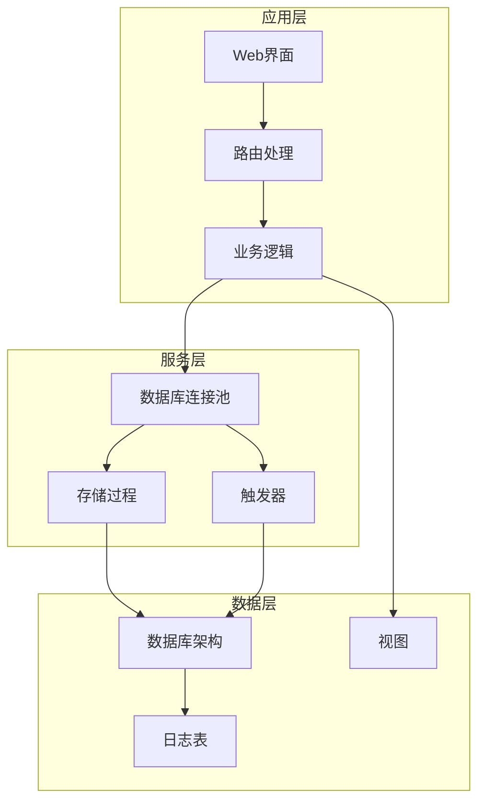

**图表来源**
- [db.py:1-121](file://app/db.py#L1-L121)
- [config.py:1-36](file://config.py#L1-L36)

## 数据库完整性约束体系

系统建立了完整的数据完整性约束体系，涵盖以下四个主要方面：

### 实体完整性约束
- 主键约束：所有核心表均设置自增主键
- 唯一性约束：关键字段如学号、教师号、用户名等设置唯一约束
- 非空约束：业务关键字段设置NOT NULL约束

### 参照完整性约束
- 外键约束：建立表间关联关系
- 级联操作：定义删除和更新时的级联行为
- 约束验证：确保引用数据的有效性

### 域完整性约束
- 检查约束：验证数据范围和格式
- 默认值约束：设置字段的默认值
- 枚举约束：限制字段取值范围

### 用户自定义完整性
- 存储过程：实现复杂的业务规则
- 触发器：自动执行数据验证和维护
- 视图：提供数据访问的安全边界

## 实体完整性约束

### 主键约束

系统中所有核心表都设置了自增主键，确保每条记录的唯一标识：

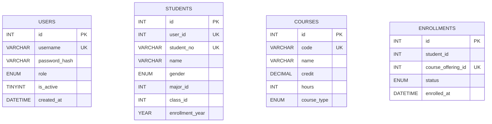

**图表来源**
- [01_schema.sql:15-77](file://sql/01_schema.sql#L15-L77)
- [01_schema.sql:113-174](file://sql/01_schema.sql#L113-L174)

### 唯一性约束

系统在关键业务字段上设置了唯一性约束，防止重复数据：

| 表名 | 唯一约束字段 | 约束目的 |
|------|-------------|----------|
| users | username | 确保用户登录名唯一 |
| students | student_no, user_id | 确保学号和用户关联唯一 |
| teachers | teacher_no, user_id | 确保教师编号和用户关联唯一 |
| courses | code | 确保课程代码唯一 |
| classes | name | 确保班级名称唯一 |
| enrollments | student_id, course_offering_id | 确保选课记录唯一 |

**章节来源**
- [01_schema.sql:24-26](file://sql/01_schema.sql#L24-L26)
- [01_schema.sql:67-76](file://sql/01_schema.sql#L67-L76)
- [01_schema.sql:91-94](file://sql/01_schema.sql#L91-L94)
- [01_schema.sql:121-124](file://sql/01_schema.sql#L121-L124)

### 非空约束

关键业务字段均设置NOT NULL约束，确保数据完整性：

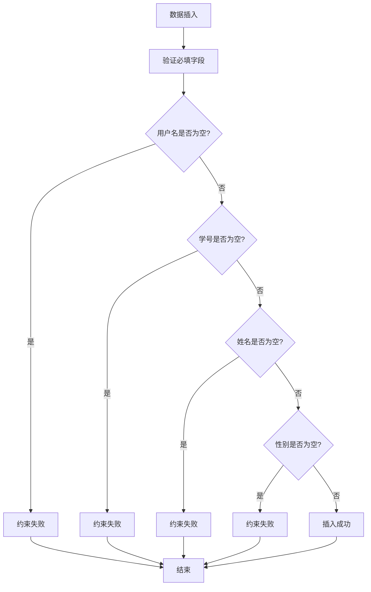

**图表来源**
- [01_schema.sql:17-20](file://sql/01_schema.sql#L17-L20)
- [01_schema.sql:58-62](file://sql/01_schema.sql#L58-L62)
- [01_schema.sql:85-88](file://sql/01_schema.sql#L85-L88)

## 参照完整性约束

### 外键约束设计

系统建立了完整的外键约束关系，确保表间数据的一致性：

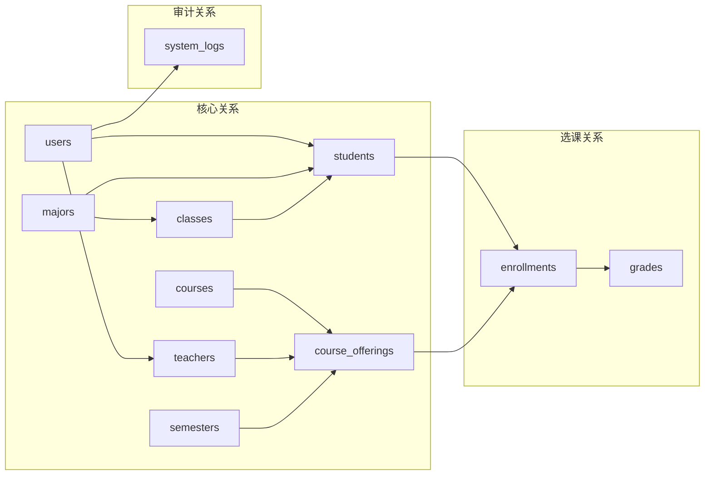

**图表来源**
- [01_schema.sql:48-49](file://sql/01_schema.sql#L48-L49)
- [01_schema.sql:71-76](file://sql/01_schema.sql#L71-L76)
- [01_schema.sql:148-153](file://sql/01_schema.sql#L148-L153)
- [01_schema.sql:170-173](file://sql/01_schema.sql#L170-L173)

### 级联操作策略

不同表间的级联操作策略体现了不同的业务需求：

| 关系类型 | 删除策略 | 更新策略 | 业务含义 |
|----------|----------|----------|----------|
| users → students | CASCADE | CASCADE | 删除用户同时删除学生信息 |
| users → teachers | CASCADE | CASCADE | 删除用户同时删除教师信息 |
| majors → classes | RESTRICT | CASCADE | 禁止删除仍有班级的专业 |
| majors → students | RESTRICT | CASCADE | 禁止删除仍有学生的专业 |
| classes → students | RESTRICT | CASCADE | 禁止删除仍有学生的班级 |
| course_offerings → enrollments | CASCADE | CASCADE | 删除开课记录时清理选课 |
| enrollments → grades | CASCADE | CASCADE | 删除选课记录时清理成绩 |

**章节来源**
- [01_schema.sql:48-49](file://sql/01_schema.sql#L48-L49)
- [01_schema.sql:71-76](file://sql/01_schema.sql#L71-L76)
- [01_schema.sql:148-153](file://sql/01_schema.sql#L148-L153)
- [01_schema.sql:170-173](file://sql/01_schema.sql#L170-L173)

## 域完整性约束

### 数值范围约束

系统对数值型字段设置了严格的范围约束：

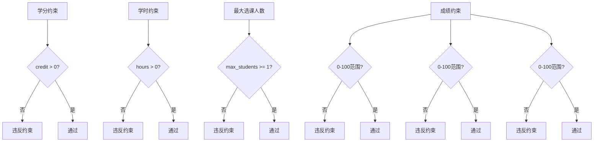

**图表来源**
- [01_schema.sql:123-124](file://sql/01_schema.sql#L123-L124)
- [01_schema.sql:154](file://sql/01_schema.sql#L154)
- [01_schema.sql:195-197](file://sql/01_schema.sql#L195-L197)

### 字符串格式约束

对字符串类型的字段设置了格式和长度约束：

| 字段类型 | 约束条件 | 示例 |
|----------|----------|------|
| 用户名 | 50字符以内，唯一 | admin, student01 |
| 学号 | 20字符以内，唯一 | 2023000001 |
| 教师编号 | 20字符以内，唯一 | T12345 |
| 课程代码 | 20字符以内，唯一 | CS101 |
| 电话号码 | 20字符以内 | 13800001111 |
| 邮箱地址 | 100字符以内 | student@example.com |

**章节来源**
- [01_schema.sql:17-18](file://sql/01_schema.sql#L17-L18)
- [01_schema.sql:58-65](file://sql/01_schema.sql#L58-L65)
- [01_schema.sql:85-90](file://sql/01_schema.sql#L85-L90)
- [01_schema.sql:115-116](file://sql/01_schema.sql#L115-L116)

### 枚举类型约束

系统大量使用枚举类型确保数据取值的规范性：

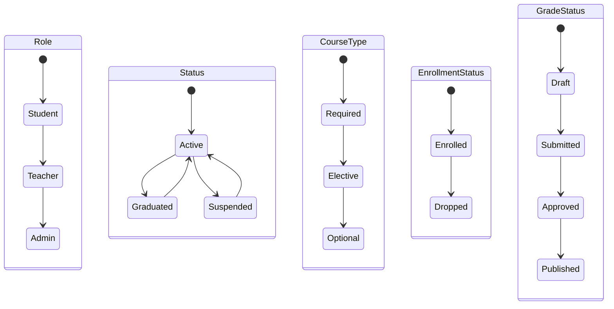

**图表来源**
- [01_schema.sql:19](file://sql/01_schema.sql#L19)
- [01_schema.sql:66](file://sql/01_schema.sql#L66)
- [01_schema.sql:119](file://sql/01_schema.sql#L119)
- [01_schema.sql:164](file://sql/01_schema.sql#L164)
- [01_schema.sql:186](file://sql/01_schema.sql#L186)

## 用户自定义完整性

### 存储过程实现复杂业务规则

系统通过存储过程实现复杂的业务逻辑和数据验证：

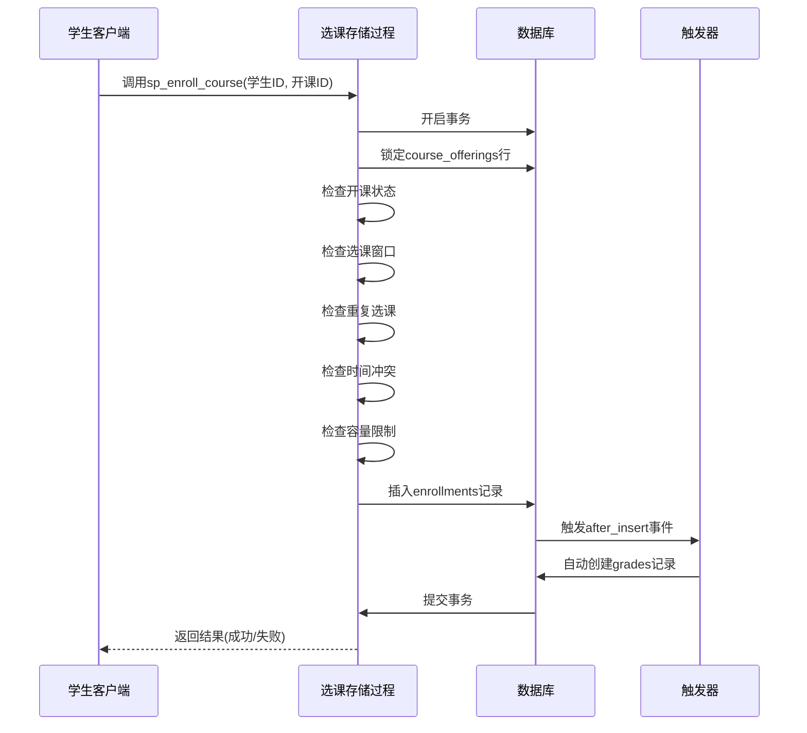

**图表来源**
- [03_procedures.sql:14-113](file://sql/03_procedures.sql#L14-L113)
- [03_procedures.sql:327-335](file://sql/03_procedures.sql#L327-L335)

### 触发器自动维护数据一致性

系统使用触发器确保数据的自动维护和一致性：

| 触发器类型 | 触发时机 | 功能描述 |
|-----------|----------|----------|
| after_enrollment_insert | 新增选课记录后 | 自动生成成绩记录 |
| before_grade_update | 更新成绩前 | 自动计算总评和绩点 |
| after_course_offering_update | 开课状态变更后 | 记录状态变更日志 |

**章节来源**
- [03_procedures.sql:327-335](file://sql/03_procedures.sql#L327-L335)
- [03_procedures.sql:338-360](file://sql/03_procedures.sql#L338-L360)
- [03_procedures.sql:363-378](file://sql/03_procedures.sql#L363-L378)

### 视图提供安全的数据访问

系统通过视图限制数据访问权限和提供简化查询接口：

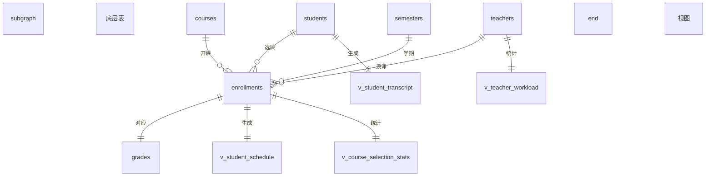

**图表来源**
- [04_views.sql:10-32](file://sql/04_views.sql#L10-L32)
- [04_views.sql:38-66](file://sql/04_views.sql#L38-L66)
- [04_views.sql:72-91](file://sql/04_views.sql#L72-L91)
- [04_views.sql:97-112](file://sql/04_views.sql#L97-L112)

## 约束执行机制

### 数据库层面的约束执行

系统中的约束在数据库层面执行，确保数据的一致性：

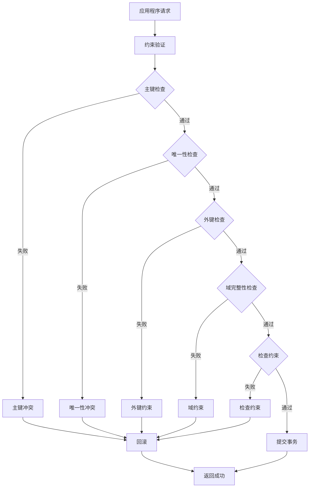

**图表来源**
- [01_schema.sql:15-77](file://sql/01_schema.sql#L15-L77)
- [01_schema.sql:113-198](file://sql/01_schema.sql#L113-L198)

### 事务控制和并发处理

系统通过事务和锁机制确保并发环境下的数据一致性：

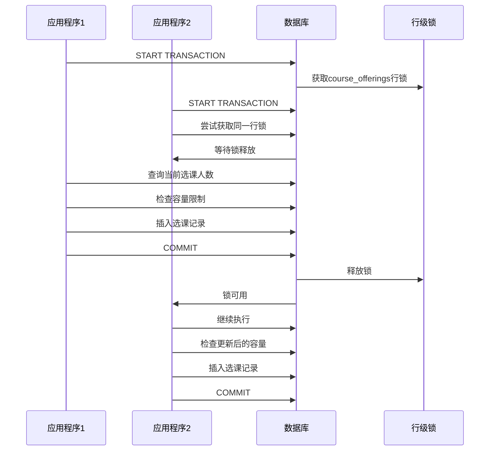

**图表来源**
- [03_procedures.sql:33-47](file://sql/03_procedures.sql#L33-L47)
- [03_procedures.sql:137-147](file://sql/03_procedures.sql#L137-L147)

**章节来源**
- [03_procedures.sql:14-113](file://sql/03_procedures.sql#L14-L113)
- [03_procedures.sql:116-194](file://sql/03_procedures.sql#L116-L194)

## 业务规则与约束结合

### 选课业务规则

系统通过约束确保选课业务的正确执行：

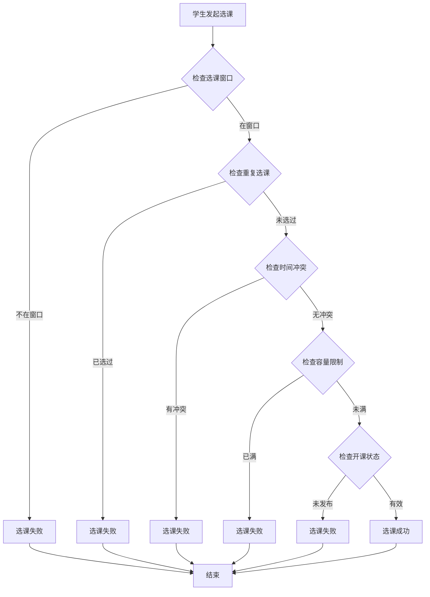

**图表来源**
- [03_procedures.sql:49-61](file://sql/03_procedures.sql#L49-L61)
- [03_procedures.sql:63-74](file://sql/03_procedures.sql#L63-L74)
- [03_procedures.sql:76-91](file://sql/03_procedures.sql#L76-L91)
- [03_procedures.sql:93-104](file://sql/03_procedures.sql#L93-L104)

### 成绩管理业务规则

系统通过多种约束确保成绩管理的准确性：

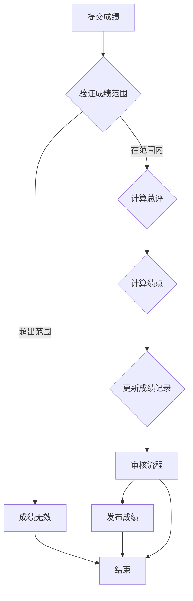

**图表来源**
- [03_procedures.sql:201-236](file://sql/03_procedures.sql#L201-L236)
- [03_procedures.sql:338-360](file://sql/03_procedures.sql#L338-L360)

**章节来源**
- [03_procedures.sql:197-274](file://sql/03_procedures.sql#L197-L274)
- [03_procedures.sql:322-378](file://sql/03_procedures.sql#L322-L378)

## 最佳实践指南

### 约束设计原则

1. **明确性原则**：约束应该清晰表达业务含义
2. **一致性原则**：约束之间不应该相互矛盾
3. **可维护性原则**：约束应该便于理解和修改
4. **性能平衡原则**：在数据完整性与性能之间找到平衡

### 约束定义最佳实践

| 约束类型 | 设计要点 | 性能考虑 |
|----------|----------|----------|
| 主键约束 | 使用自增整数类型 | 建议使用B-tree索引 |
| 唯一约束 | 选择合适的字段组合 | 考虑复合索引的使用 |
| 外键约束 | 明确级联策略 | 确保外键索引的存在 |
| 检查约束 | 避免复杂的计算逻辑 | 简化约束条件 |
| 默认值约束 | 设置合理的默认值 | 考虑NULL值的影响 |

### 常见陷阱避免

1. **过度约束**：避免不必要的复杂约束
2. **约束冲突**：确保不同约束之间不矛盾
3. **性能影响**：评估约束对查询性能的影响
4. **维护成本**：考虑约束变更的复杂性

## 性能考虑

### 索引优化

系统通过适当的索引设计提升查询性能：

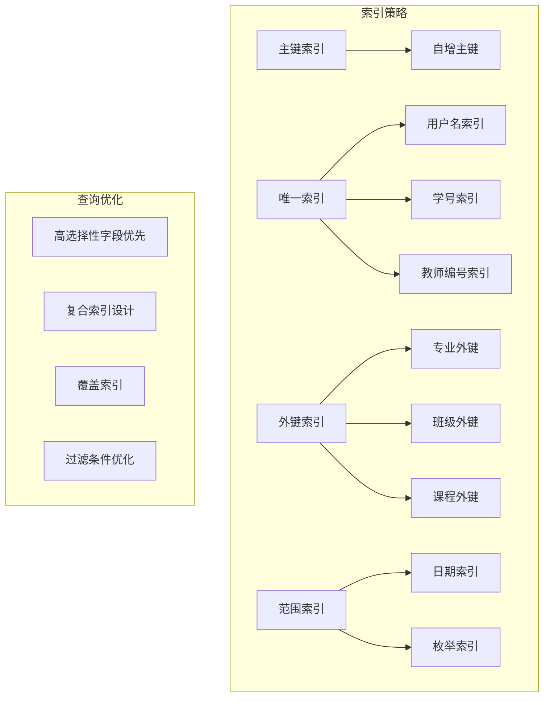

**图表来源**
- [01_schema.sql:24-26](file://sql/01_schema.sql#L24-L26)
- [01_schema.sql:47-49](file://sql/01_schema.sql#L47-L49)
- [01_schema.sql:68-70](file://sql/01_schema.sql#L68-L70)

### 连接池配置

系统使用DBUtils连接池提升数据库连接效率：

| 配置项 | 默认值 | 说明 |
|--------|--------|------|
| DB_POOL_MIN_CACHED | 2 | 最小缓存连接数 |
| DB_POOL_MAX_CACHED | 10 | 最大缓存连接数 |
| DB_POOL_MAX_CONNECTIONS | 20 | 最大连接数 |
| PER_PAGE | 15 | 分页大小 |

**章节来源**
- [config.py:20-22](file://config.py#L20-L22)
- [config.py:25](file://config.py#L25)

## 故障排除指南

### 常见约束错误

| 错误类型 | 错误代码 | 解决方案 |
|----------|----------|----------|
| 主键冲突 | 1062 | 检查自增字段是否正确 |
| 唯一性冲突 | 1062 | 验证唯一约束字段的值 |
| 外键约束 | 1452 | 确保引用数据存在 |
| 检查约束 | 3819 | 检查数据范围和格式 |
| 违反NOT NULL | 1048 | 确保必填字段有值 |

### 调试技巧

1. **启用详细日志**：监控数据库操作和约束执行
2. **使用EXPLAIN**：分析查询计划和索引使用
3. **测试边界条件**：验证约束在极端情况下的行为
4. **模拟并发场景**：测试锁机制和事务隔离

**章节来源**
- [db.py:43-59](file://app/db.py#L43-L59)
- [db.py:83-89](file://app/db.py#L83-L89)

## 总结

学生信息管理系统通过完善的数据库完整性约束体系，确保了数据的一致性、准确性、可靠性和业务规则的正确执行。系统采用了多层次的约束策略：

1. **基础约束**：主键、唯一性、非空约束确保基本数据完整性
2. **关系约束**：外键约束维护表间关系的正确性
3. **业务约束**：检查约束和用户自定义逻辑确保业务规则的执行
4. **自动化维护**：存储过程和触发器提供自动化的数据维护

这些约束机制共同构成了一个健壮的数据管理体系，为教务选课与成绩管理提供了坚实的技术基础。通过合理的约束设计和优化，系统在保证数据质量的同时，也兼顾了性能和可维护性的要求。