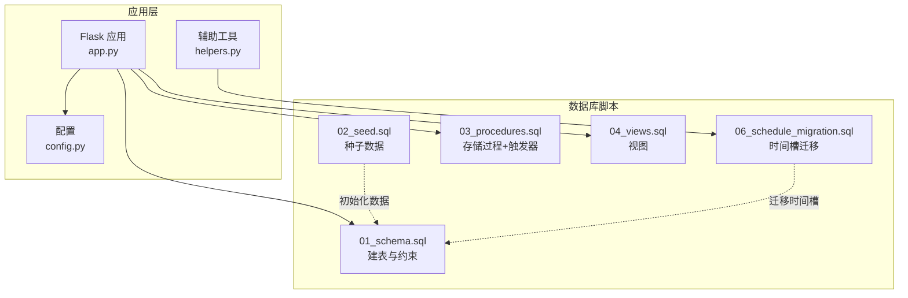
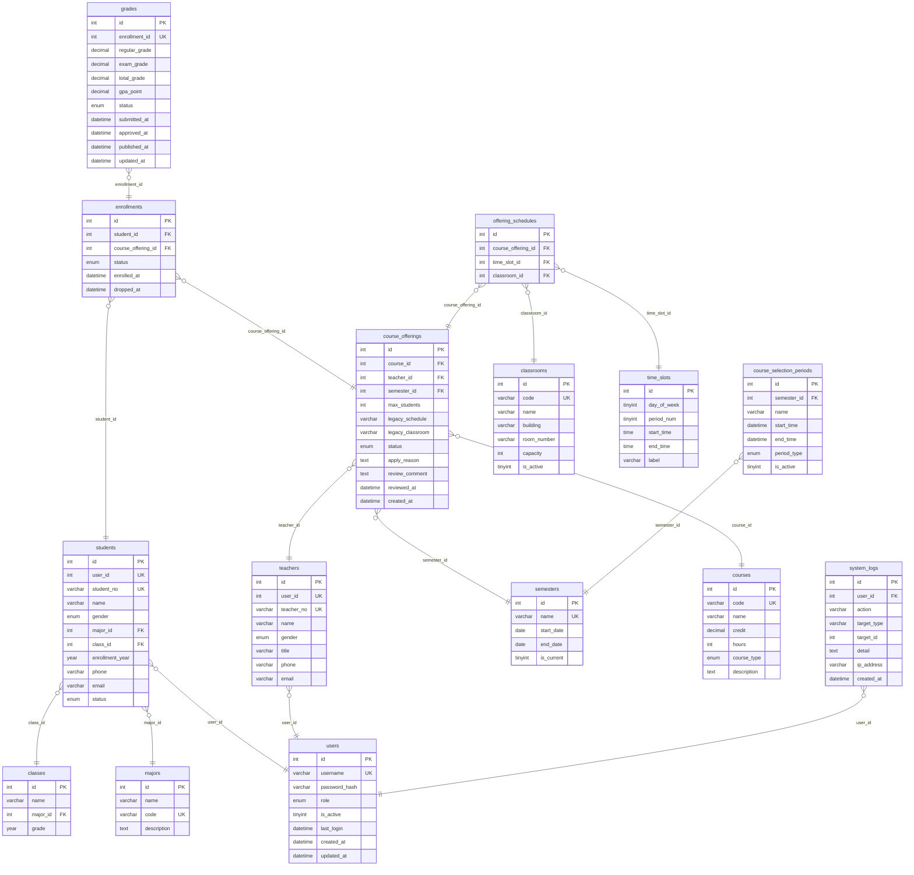
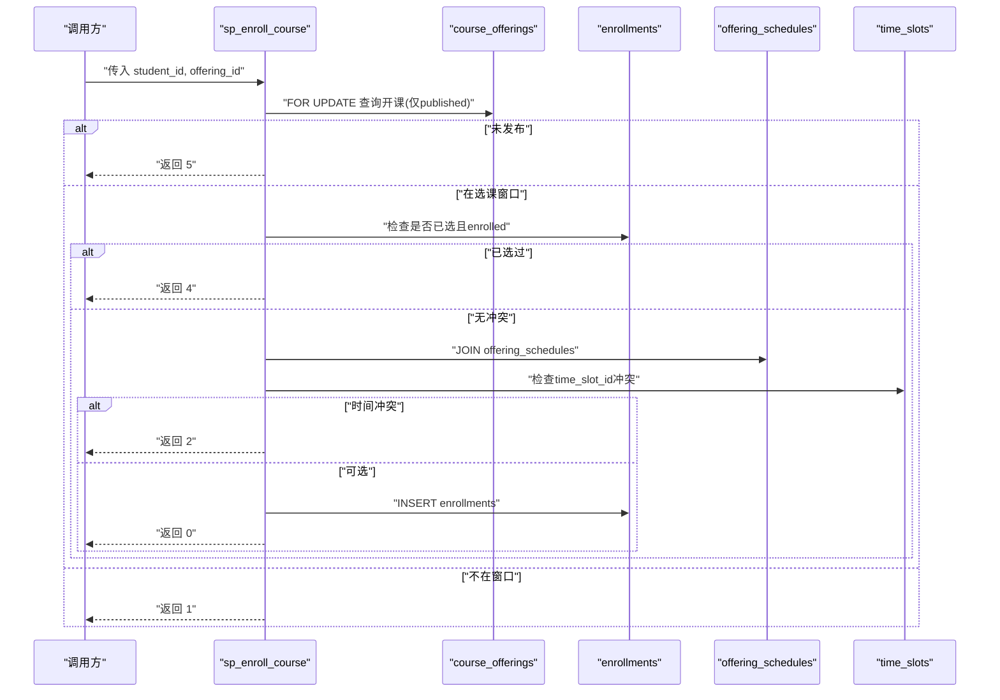
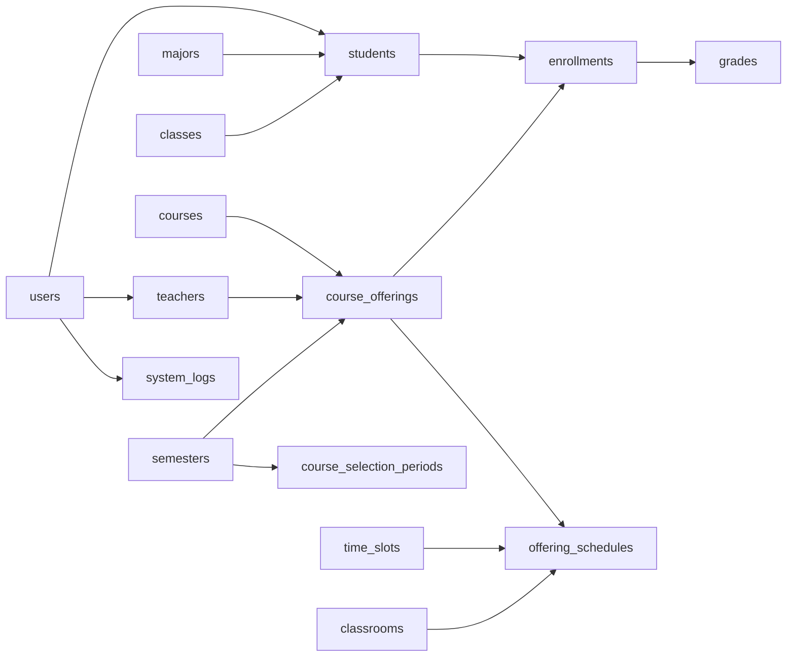

# 数据库设计

<cite>
**本文引用的文件**
- [01_schema.sql](file://sql/01_schema.sql)
- [02_seed.sql](file://sql/02_seed.sql)
- [03_procedures.sql](file://sql/03_procedures.sql)
- [04_views.sql](file://sql/04_views.sql)
- [06_schedule_migration.sql](file://sql/06_schedule_migration.sql)
- [README.md](file://README.md)
- [helpers.py](file://app/helpers.py)
</cite>

## 目录
1. [简介](#简介)
2. [项目结构](#项目结构)
3. [核心组件](#核心组件)
4. [架构总览](#架构总览)
5. [详细组件分析](#详细组件分析)
6. [依赖分析](#依赖分析)
7. [性能考虑](#性能考虑)
8. [故障排查指南](#故障排查指南)
9. [结论](#结论)
10. [附录](#附录)

## 简介
本文件面向"学生信息管理系统"的数据库设计，围绕15张核心表、5个存储过程、3个触发器、4个视图展开，系统化阐述表结构、主外键关系、约束与索引、规范化设计（3NF）与业务规则实现，并提供ER图与表关系图，帮助开发者与运维人员快速理解并维护该数据库架构。

**更新** 新增时间槽管理系统，包括教室、时间段、开课时间安排的完整架构，支持更精确的课程时间冲突检测和管理。

## 项目结构
- 数据库脚本按功能分层组织：
  - 建表与约束：sql/01_schema.sql
  - 种子数据：sql/02_seed.sql
  - 存储过程与触发器：sql/03_procedures.sql
  - 视图：sql/04_views.sql
  - 时间槽迁移：sql/06_schedule_migration.sql
- 应用层辅助工具：app/helpers.py
- README对项目技术栈、初始化步骤、核心业务流与数据库设计要点进行了概述。

**章节来源**
- [README.md:19-35](file://README.md#L19-L35)

## 核心组件
本系统采用"用户-角色-学生/教师-课程-开课-选课-成绩"的核心实体链路，配合学期、专业、班级、选课时间段、系统日志、教室、时间段、开课时间安排等支撑表，形成完整的教务闭环。

- 用户账户表 users：统一身份认证与权限入口
- 专业表 majors、班级表 classes：学生归属维度
- 学生表 students：学生基本信息与关联
- 教师表 teachers：教师基本信息与关联
- 学期表 semesters：学期维度与当前学期标识
- 课程表 courses：课程元数据与学分/学时校验
- 开课申请表 course_offerings：课程发布与教师安排
- 选课记录表 enrollments：学生与开课的选课关系
- 成绩表 grades：平时/期末/总评/绩点与状态流转
- 选课时间段 course_selection_periods：选课/退课窗口
- 系统日志 system_logs：审计与追踪
- 教室表 classrooms：教学场所管理
- 时间段表 time_slots：标准时间槽定义
- 开课时间安排表 offering_schedules：开课与时间地点的关联

**章节来源**
- [01_schema.sql:15-235](file://sql/01_schema.sql#L15-L235)
- [06_schedule_migration.sql:11-55](file://sql/06_schedule_migration.sql#L11-L55)

## 架构总览
下图展示15张核心表之间的实体关系与关键约束，体现3NF设计与业务规则落地，包括新增的时间槽管理系统。

**图表来源**
- [01_schema.sql:15-235](file://sql/01_schema.sql#L15-L235)
- [06_schedule_migration.sql:11-55](file://sql/06_schedule_migration.sql#L11-L55)

## 详细组件分析

### 表结构与设计要点

#### 用户表 users
- 主键：id
- 唯一索引：username
- 角色枚举：student、teacher、admin
- 索引：role
- 设计理念：集中管理登录凭据与角色，支持多角色扩展

**章节来源**
- [01_schema.sql:15-26](file://sql/01_schema.sql#L15-L26)

#### 专业表 majors
- 主键：id
- 唯一索引：code
- 设计理念：标准化专业编码，便于跨表引用

**章节来源**
- [01_schema.sql:31-37](file://sql/01_schema.sql#L31-L37)

#### 班级表 classes
- 主键：id
- 外键：major_id → majors(id)（RESTRICT删除，CASCADE更新）
- 索引：major_id
- 设计理念：班级隶属于专业，保证专业维度一致性

**章节来源**
- [01_schema.sql:42-50](file://sql/01_schema.sql#L42-L50)

#### 学生表 students
- 主键：id
- 唯一索引：student_no、user_id
- 外键：user_id → users(id)（CASCADE删除），major_id → majors(id)，class_id → classes(id)
- 索引：major_id、class_id
- 状态：active、graduated、suspended
- 设计理念：学生信息与用户体系解耦，支持学籍状态管理

**章节来源**
- [01_schema.sql:55-77](file://sql/01_schema.sql#L55-L77)

#### 教师表 teachers
- 主键：id
- 唯一索引：teacher_no、user_id
- 外键：user_id → users(id)（CASCADE删除）
- 设计理念：教师信息与用户体系解耦

**章节来源**
- [01_schema.sql:82-95](file://sql/01_schema.sql#L82-L95)

#### 学期表 semesters
- 主键：id
- 唯一索引：name
- 索引：is_current
- 设计理念：当前学期标记，支持学期维度查询

**章节来源**
- [01_schema.sql:100-108](file://sql/01_schema.sql#L100-L108)

#### 课程表 courses
- 主键：id
- 唯一索引：code
- 索引：course_type
- 检查约束：credit > 0、hours > 0
- 设计理念：课程元数据标准化，类型枚举支持必修/选修/任选

**章节来源**
- [01_schema.sql:113-125](file://sql/01_schema.sql#L113-L125)

#### 开课申请表 course_offerings
- 主键：id
- 唯一索引：uk_offering(course_id, teacher_id, semester_id)
- 外键：course_id → courses(id)、teacher_id → teachers(id)、semester_id → semesters(id)
- 索引：course_id、teacher_id、semester_id、status
- 检查约束：max_students ≥ 1
- 状态：pending、approved、rejected、published
- 设计理念：开课申请的生命周期管理，避免重复开课
- **更新** 新增遗留字段：legacy_schedule、legacy_classroom，用于兼容旧版数据

**章节来源**
- [01_schema.sql:130-155](file://sql/01_schema.sql#L130-L155)
- [06_schedule_migration.sql:122-132](file://sql/06_schedule_migration.sql#L122-L132)

#### 选课记录表 enrollments
- 主键：id
- 唯一索引：uk_enrollment(student_id, course_offering_id)
- 外键：student_id → students(id)、course_offering_id → course_offerings(id)
- 索引：course_offering_id、status
- 状态：enrolled、dropped
- 设计理念：选课原子关系，支持退课状态追踪

**章节来源**
- [01_schema.sql:160-174](file://sql/01_schema.sql#L160-L174)

#### 成绩表 grades
- 主键：id
- 唯一索引：uk_grade_enrollment(enrollment_id)
- 外键：enrollment_id → enrollments(id)
- 索引：status
- 检查约束：0≤regular≤100、0≤exam≤100、0≤total≤100
- 状态：draft、submitted、approved、published
- 设计理念：成绩四段式状态机，支持教师提交、管理员审核与发布

**章节来源**
- [01_schema.sql:179-198](file://sql/01_schema.sql#L179-L198)

#### 选课时间段 course_selection_periods
- 主键：id
- 外键：semester_id → semesters(id)
- 索引：semester_id、start_time、end_time
- 类型：selection、drop
- 设计理念：选课/退课窗口的统一管理

**章节来源**
- [01_schema.sql:203-215](file://sql/01_schema.sql#L203-L215)

#### 系统日志 system_logs
- 主键：id
- 外键：user_id → users(id)
- 索引：user_id、action、created_at
- 设计理念：操作审计与追踪

**章节来源**
- [01_schema.sql:220-234](file://sql/01_schema.sql#L220-L234)

#### 教室表 classrooms
- 主键：id
- 唯一索引：code
- 索引：building
- 设计理念：教学场所标准化管理，支持容量限制和激活状态

**章节来源**
- [06_schedule_migration.sql:11-21](file://sql/06_schedule_migration.sql#L11-L21)

#### 时间段表 time_slots
- 主键：id
- 唯一索引：uk_slot(day_of_week, period_num)
- 索引：day_of_week
- 设计理念：标准时间槽定义，支持周一至周日的5个时间段

**章节来源**
- [06_schedule_migration.sql:26-35](file://sql/06_schedule_migration.sql#L26-L35)

#### 开课时间安排表 offering_schedules
- 主键：id
- 唯一索引：uk_unique(course_offering_id, time_slot_id, classroom_id)
- 外键：course_offering_id → course_offerings(id)（CASCADE删除）、time_slot_id → time_slots(id)（RESTRICT删除）、classroom_id → classrooms(id)（RESTRICT删除）
- 索引：course_offering_id、time_slot_id、classroom_id
- 设计理念：将开课与时间地点的关系解耦，支持多时间段多教室的灵活安排

**章节来源**
- [06_schedule_migration.sql:40-55](file://sql/06_schedule_migration.sql#L40-L55)

### 存储过程详解

#### 1) sp_enroll_course - 选课
- 功能：在选课窗口内完成选课，防冲突、防超员、幂等检查
- 关键逻辑：
  - 锁定目标开课记录（FOR UPDATE）
  - 校验开课状态为"published"
  - 校验当前处于"selection"窗口
  - 检查是否已选且状态为"enrolled"
  - **更新** 使用offering_schedules表检查时间冲突，基于time_slot_id进行精确匹配
  - 检查容量上限
  - 原子插入选课记录
- 返回码：0=成功，1=不在选课窗口，2=时间冲突，3=已满，4=已选过，5=未发布，99=系统错误

**图表来源**
- [03_procedures.sql:14-113](file://sql/03_procedures.sql#L14-L113)

**章节来源**
- [03_procedures.sql:14-113](file://sql/03_procedures.sql#L14-L113)

#### 2) sp_drop_course - 退课
- 功能：在退课窗口内退课，禁止已有非草稿成绩退课
- 关键逻辑：
  - 锁定选课记录并获取semester_id
  - 检查是否存在非草稿成绩
  - 校验"drop"窗口
  - 更新状态为"dropped"，删除草稿成绩
- 返回码：0=成功，1=不在退课窗口，2=未找到记录，3=有成绩不可退，99=系统错误

**章节来源**
- [03_procedures.sql:119-194](file://sql/03_procedures.sql#L119-L194)

#### 3) sp_calculate_total_grade - 总评与绩点计算
- 功能：根据平时与期末成绩计算总评（平时30%+期末70%）与4.0制绩点
- 触发时机：由触发器在成绩更新时自动计算

**章节来源**
- [03_procedures.sql:201-236](file://sql/03_procedures.sql#L201-L236)

#### 4) sp_calculate_gpa - 学期GPA计算
- 功能：按学期聚合已审核/发布的课程，计算加权平均GPA与总学分
- 输入：student_id、semester_id
- 输出：gpa、total_credits、message

**章节来源**
- [03_procedures.sql:242-274](file://sql/03_procedures.sql#L242-L274)

#### 5) sp_approve_course_offering - 开课审核
- 功能：管理员审核开课申请，记录日志
- 输入：offering_id、admin_id、action(approved/rejected)、comment
- 返回码：0=成功，1=不存在，2=已审核过，3=教师时间冲突，4=教室时间冲突
- **更新** 新增教师和教室时间冲突检测，基于offering_schedules表的time_slot_id和classroom_id进行精确匹配

**章节来源**
- [03_procedures.sql:280-354](file://sql/03_procedures.sql#L280-L354)

### 触发器详解

#### 1) trg_after_enrollment_insert - 选课自动创建成绩
- 触发时机：enrollments插入且状态为"enrolled"
- 行为：为新选课记录自动创建状态为"draft"的成绩记录

**章节来源**
- [03_procedures.sql:361-370](file://sql/03_procedures.sql#L361-L370)

#### 2) trg_after_grade_update - 成绩更新自动计算
- 触发时机：grades更新且平时/期末均非空
- 行为：自动计算总评与绩点，保持数据一致性

**章节来源**
- [03_procedures.sql:373-395](file://sql/03_procedures.sql#L373-L395)

#### 3) trg_course_offering_status_change - 开课状态变更日志
- 触发时机：course_offerings状态变更
- 行为：除初始"pending→approved/rejected"外，记录状态变更日志

**章节来源**
- [03_procedures.sql:398-413](file://sql/03_procedures.sql#L398-L413)

### 视图详解

#### 1) v_student_schedule - 学生课表
- 目的：按学生展示已选课程的课表信息（时间、教室、教师、学期）
- 关联：enrollments → students → course_offerings → courses → teachers → semesters
- **更新** 由于时间槽系统的引入，课表显示逻辑已更新为使用新的时间槽格式

**章节来源**
- [04_views.sql:10-32](file://sql/04_views.sql#L10-L32)

#### 2) v_student_transcript - 学生成绩单
- 目的：展示学生各学期课程的成绩明细（平时、期末、总评、绩点、状态）
- 关联：enrollments → students → grades → course_offerings → courses → semesters → teachers

**章节来源**
- [04_views.sql:38-66](file://sql/04_views.sql#L38-L66)

#### 3) v_course_selection_stats - 选课统计
- 目的：统计每门课程的选课人数、容量与占满率
- 关联：course_offerings → courses → teachers → semesters → enrollments

**章节来源**
- [04_views.sql:72-91](file://sql/04_views.sql#L72-L91)

#### 4) v_teacher_workload - 教师工作量
- 目的：统计教师每学期的开课数、选课人数、总学分
- 关联：teachers → course_offerings → courses → semesters → enrollments
- **更新** 由于时间槽系统的引入，工作量统计可能需要调整以考虑新的时间安排

**章节来源**
- [04_views.sql:97-113](file://sql/04_views.sql#L97-L113)

## 依赖分析
- 外键依赖链：
  - students → users、majors、classes
  - teachers → users
  - course_offerings → courses、teachers、semesters
  - enrollments → students、course_offerings
  - grades → enrollments
  - course_selection_periods → semesters
  - system_logs → users
  - **新增** offering_schedules → course_offerings、time_slots、classrooms
- 约束与索引：
  - 唯一索引保障业务唯一性（用户名、学号、教师号、课程代码、开课组合、时间槽组合）
  - 外键约束确保参照完整性
  - 检查约束保障数值范围与业务规则
  - 索引覆盖常用查询路径（角色、学期当前标记、状态、时间窗口、时间槽）

**图表来源**
- [01_schema.sql:15-235](file://sql/01_schema.sql#L15-L235)
- [06_schedule_migration.sql:40-55](file://sql/06_schedule_migration.sql#L40-L55)

**章节来源**
- [01_schema.sql:15-235](file://sql/01_schema.sql#L15-L235)
- [06_schedule_migration.sql:40-55](file://sql/06_schedule_migration.sql#L40-L55)

## 性能考虑
- 索引策略：
  - 高频过滤字段建立索引：users(role)、classes(major_id)、students(major_id, class_id)、course_offerings(status)、enrollments(status)、grades(status)、course_selection_periods(start_time,end_time)、system_logs(created_at)
  - **新增** 时间槽相关索引：time_slots(uk_slot)、offering_schedules(uk_unique)
- 锁与并发：
  - 选课/退课过程使用FOR UPDATE锁定相关行，避免超卖与时间冲突误判
  - **更新** 时间槽冲突检测使用offering_schedules表的联合索引提高查询效率
- 存储过程事务：
  - 将原子性操作封装在事务中，异常回滚，减少脏读与不一致
- 视图优化：
  - 视图基于稳定索引字段连接，避免复杂子查询导致全表扫描
  - **更新** 新增时间槽视图查询优化，利用索引提升性能

## 故障排查指南
- 选课失败常见原因：
  - 不在选课窗口：检查course_selection_periods的活动窗口与时间范围
  - **更新** 时间槽冲突：检查offering_schedules表中time_slot_id是否与其他课程冲突
  - 已满：检查course_offerings.max_students与实际enrollments数量
  - 已选过：检查enrollments中是否存在相同组合且状态为"enrolled"
- 退课失败常见原因：
  - 不在退课窗口：同上
  - 已有非草稿成绩：检查grades状态
- 成绩计算异常：
  - 触发器自动计算依赖平时与期末均非空；若部分为空则不会更新总评与绩点
- 审核问题：
  - 仅"pending"状态可审核；重复审核会报错
  - **新增** 教师或教室时间冲突：检查sp_approve_course_offering返回的冲突类型

**章节来源**
- [03_procedures.sql:14-113](file://sql/03_procedures.sql#L14-L113)
- [03_procedures.sql:119-194](file://sql/03_procedures.sql#L119-L194)
- [03_procedures.sql:339-360](file://sql/03_procedures.sql#L339-L360)
- [03_procedures.sql:280-354](file://sql/03_procedures.sql#L280-L354)

## 结论
本数据库设计遵循3NF，通过清晰的主外键关系、完善的约束与索引、以及存储过程/触发器/视图的协同，实现了从"开课申请—选课—成绩—审核—报表"的完整业务闭环。**更新** 新增的时间槽管理系统显著提升了课程时间冲突检测的精确性和灵活性，支持更复杂的教学安排需求。建议在生产环境中结合监控与备份策略，持续优化热点查询与并发场景下的性能表现。

## 附录

### 初始化与示例数据
- 初始化顺序：先建表与约束，再创建存储过程与触发器，最后导入种子数据
- **更新** 时间槽迁移：执行06_schedule_migration.sql脚本，创建教室、时间段、开课时间安排表并迁移历史数据
- 示例数据包含管理员账户、学期、专业、班级、课程与选课时间段

**章节来源**
- [README.md:19-26](file://README.md#L19-L26)
- [02_seed.sql:8-48](file://sql/02_seed.sql#L8-L48)
- [06_schedule_migration.sql:137-140](file://sql/06_schedule_migration.sql#L137-L140)

### 时间槽系统迁移策略
- **遗留字段迁移**：course_offerings表新增legacy_schedule和legacy_classroom字段，将原有schedule和classroom数据迁移至此
- **兼容性保证**：保留原有字段但置空，确保现有应用逻辑不受影响
- **新架构启用**：offering_schedules表作为新的时间地点安排载体，提供更精确的冲突检测

**章节来源**
- [06_schedule_migration.sql:122-132](file://sql/06_schedule_migration.sql#L122-L132)
- [06_schedule_migration.sql:137-140](file://sql/06_schedule_migration.sql#L137-L140)