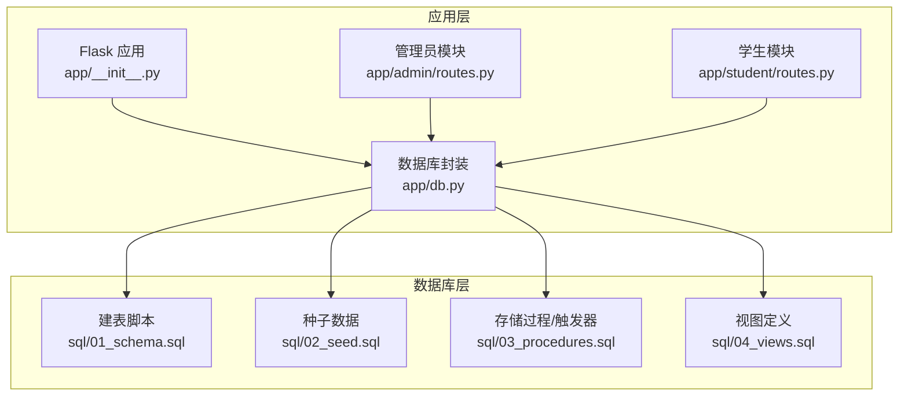
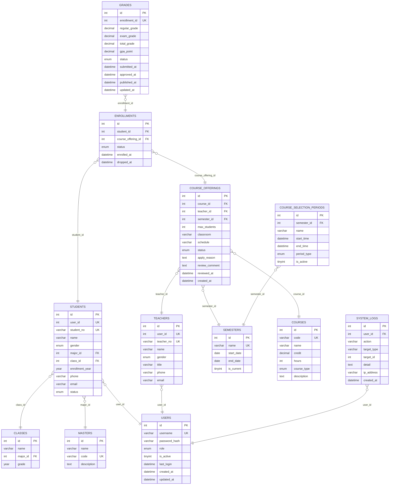
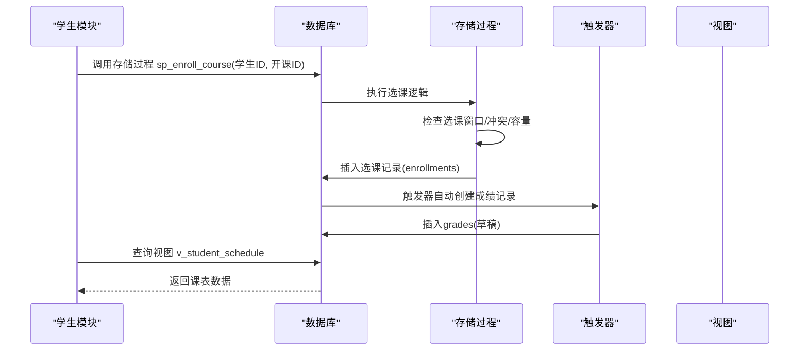

# 表结构设计

<cite>
**本文引用的文件**
- [01_schema.sql](file://sql/01_schema.sql)
- [02_seed.sql](file://sql/02_seed.sql)
- [03_procedures.sql](file://sql/03_procedures.sql)
- [04_views.sql](file://sql/04_views.sql)
- [db.py](file://app/db.py)
- [config.py](file://config.py)
- [admin/routes.py](file://app/admin/routes.py)
- [student/routes.py](file://app/student/routes.py)
- [README.md](file://README.md)
</cite>

## 目录
1. [简介](#简介)
2. [项目结构](#项目结构)
3. [核心组件](#核心组件)
4. [架构总览](#架构总览)
5. [详细组件分析](#详细组件分析)
6. [依赖分析](#依赖分析)
7. [性能考虑](#性能考虑)
8. [故障排查指南](#故障排查指南)
9. [结论](#结论)
10. [附录](#附录)

## 简介
本文件面向“校园教务选课与成绩管理系统”的数据库表结构设计，基于仓库中的建表脚本与业务实现，系统化梳理12张核心表的字段定义、数据类型、约束条件、主键外键关系、索引设计与规范化实现，并结合存储过程、触发器与视图，解释关键业务流程与参照完整性保障机制。文档同时提供表结构图表与DDL语句路径，帮助开发者与DBA快速理解与维护数据库架构。

## 项目结构
- 数据库脚本位于 sql/ 目录，包含建表、种子数据、存储过程、视图等。
- 应用层通过 app/db.py 提供数据库连接池与通用查询封装，配合 Flask 路由模块实现业务逻辑。
- 配置文件 config.py 定义数据库连接参数与应用常量（如成绩权重、预警阈值等）。

**图表来源**
- [app/__init__.py:29-93](file://app/__init__.py#L29-L93)
- [app/db.py:10-121](file://app/db.py#L10-L121)
- [config.py:6-36](file://config.py#L6-L36)
- [README.md:48-69](file://README.md#L48-L69)

**章节来源**
- [README.md:48-69](file://README.md#L48-L69)
- [config.py:6-36](file://config.py#L6-L36)

## 核心组件
本系统围绕12张核心表构建，涵盖用户认证、专业与班级、学生与教师、学期与课程、开课与选课、成绩与选课时间段、系统日志等业务域。每张表均采用InnoDB引擎，遵循3NF设计，通过外键约束保证参照完整性，并在高频查询字段上建立索引提升性能。

- users 用户账户表：统一身份认证与权限角色管理。
- majors 专业表：专业维度的基础数据。
- classes 班级表：班级归属专业，支持年级筛选。
- students 学生信息表：学生档案与学籍状态，关联用户、专业、班级。
- teachers 教师信息表：教师档案与职称信息，关联用户。
- semesters 学期表：学期周期与当前学期标记。
- courses 课程表：课程元数据与学分、学时、课程类型。
- course_offerings 开课申请与发布表：课程开课申请、审核、发布与教室、时间安排。
- enrollments 选课记录表：学生选课与退课状态管理。
- grades 成绩表：平时成绩、期末成绩、总评、绩点与状态流转。
- course_selection_periods 选课时间段表：选课与退课窗口管理。
- system_logs 系统日志表：审计与追踪。

**章节来源**
- [01_schema.sql:15-234](file://sql/01_schema.sql#L15-L234)

## 架构总览
下图展示12张核心表之间的实体关系与外键约束，体现业务模型与规范化设计。

**图表来源**
- [01_schema.sql:15-234](file://sql/01_schema.sql#L15-L234)

## 详细组件分析

### users 用户账户表
- 字段与类型：自增主键、用户名唯一、密码哈希、角色枚举、激活状态、登录时间、创建与更新时间戳。
- 约束与索引：唯一键约束用户名；角色字段建立普通索引；默认激活状态为1。
- 设计理念：集中管理用户凭证与角色，支撑多角色权限体系；时间戳便于审计与登录追踪。

**章节来源**
- [01_schema.sql:15-26](file://sql/01_schema.sql#L15-L26)

### majors 专业表
- 字段与类型：自增主键、专业名称、专业代码唯一、描述。
- 约束与索引：专业代码唯一约束，确保专业标识唯一性。
- 设计理念：标准化专业编码，便于跨表引用与报表统计。

**章节来源**
- [01_schema.sql:31-37](file://sql/01_schema.sql#L31-L37)

### classes 班级表
- 字段与类型：自增主键、班级名称、所属专业ID、年级。
- 约束与索引：外键指向专业表，限制删除；对专业ID建立索引。
- 设计理念：班级与专业的多对一关系，支持按年级筛选与统计。

**章节来源**
- [01_schema.sql:42-50](file://sql/01_schema.sql#L42-L50)

### students 学生表
- 字段与类型：自增主键、用户ID唯一、学号唯一、姓名、性别、专业ID、班级ID、入学年份、联系方式、状态。
- 约束与索引：用户ID与学号唯一；对专业ID、班级ID建立索引；外键约束分别指向users、majors、classes。
- 设计理念：学生档案与学籍状态分离，支持在读、毕业、休学；唯一性约束避免重复注册。

**章节来源**
- [01_schema.sql:55-77](file://sql/01_schema.sql#L55-L77)

### teachers 教师表
- 字段与类型：自增主键、用户ID唯一、教师编号唯一、姓名、性别、职称、联系方式。
- 约束与索引：用户ID与教师编号唯一；外键指向users。
- 设计理念：教师档案独立于用户，便于扩展职称、工号等属性。

**章节来源**
- [01_schema.sql:82-95](file://sql/01_schema.sql#L82-L95)

### semesters 学期表
- 字段与类型：自增主键、学期名称唯一、开始与结束日期、是否当前学期。
- 约束与索引：学期名称唯一；当前学期字段建立索引。
- 设计理念：学期作为教学周期的基准，当前学期用于选课窗口与统计。

**章节来源**
- [01_schema.sql:100-108](file://sql/01_schema.sql#L100-L108)

### courses 课程表
- 字段与类型：自增主键、课程代码唯一、课程名称、学分、学时、课程类型、描述。
- 约束与索引：课程代码唯一；课程类型建立索引；学分与学时设置正数检查约束。
- 设计理念：课程元数据标准化，支撑排课与学分统计。

**章节来源**
- [01_schema.sql:113-125](file://sql/01_schema.sql#L113-L125)

### course_offerings 开课表
- 字段与类型：自增主键、课程ID、教师ID、学期ID、最大人数、教室、时间安排、状态、申请原因、审核意见、审核时间、创建时间。
- 约束与索引：三者联合唯一（课程+教师+学期），防止重复开课；对课程、教师、学期、状态建立索引；最大人数正数检查约束。
- 设计理念：开课申请的生命周期管理，状态机驱动（待审→通过/驳回→发布）。

**章节来源**
- [01_schema.sql:130-155](file://sql/01_schema.sql#L130-L155)

### enrollments 选课表
- 字段与类型：自增主键、学生ID、开课ID、状态、选课时间、退课时间。
- 约束与索引：学生与开课联合唯一；对开课ID与状态建立索引；外键约束分别指向students、course_offerings。
- 设计理念：选课记录原子化，支持退课与状态追踪。

**章节来源**
- [01_schema.sql:160-174](file://sql/01_schema.sql#L160-L174)

### grades 成绩表
- 字段与类型：自增主键、选课记录ID唯一、平时成绩、期末成绩、总评、绩点、状态、提交/审核/发布时间、更新时间。
- 约束与索引：选课记录唯一；状态字段索引；对各分数字段设置范围检查约束。
- 设计理念：成绩状态机（草稿→提交→审核→发布），自动计算总评与绩点。

**章节来源**
- [01_schema.sql:179-198](file://sql/01_schema.sql#L179-L198)

### course_selection_periods 选课时间段表
- 字段与类型：自增主键、学期ID、名称、开始与结束时间、选课/退课类型、是否激活。
- 约束与索引：对学期ID与时间区间建立索引；外键指向semesters。
- 设计理念：选课窗口的统一管理，支持初选、补退选等阶段。

**章节来源**
- [01_schema.sql:203-215](file://sql/01_schema.sql#L203-L215)

### system_logs 系统日志表
- 字段与类型：自增主键、用户ID、动作、目标类型、目标ID、详情、IP地址、创建时间。
- 约束与索引：对用户ID、动作、创建时间建立索引；外键指向users。
- 设计理念：全量审计，支持按用户、动作、时间检索。

**章节来源**
- [01_schema.sql:220-234](file://sql/01_schema.sql#L220-L234)

## 依赖分析
- 外键依赖链：
  - students → users、majors、classes
  - teachers → users
  - course_offerings → courses、teachers、semesters
  - enrollments → students、course_offerings
  - grades → enrollments
  - course_selection_periods → semesters
  - system_logs → users
- 参照完整性：
  - 多数删除策略为RESTRICT或CASCADE，确保数据一致性；日志表对用户外键采用SET NULL，避免孤立日志。
- 索引与约束：
  - 唯一键覆盖学号、教师编号、用户名、课程代码、学期名称、联合唯一开课组合。
  - 普通索引覆盖常用过滤字段（角色、专业、班级、状态、学期当前标记、时间区间等）。
- 触发器与存储过程：
  - 选课自动创建成绩记录；成绩更新自动计算总评与绩点；开课状态变更记录日志。
  - 选课/退课/成绩计算/GPA计算/开课审核等业务封装在存储过程中，保证原子性与并发安全。

**图表来源**
- [03_procedures.sql:14-113](file://sql/03_procedures.sql#L14-L113)
- [03_procedures.sql:327-335](file://sql/03_procedures.sql#L327-L335)
- [04_views.sql:10-32](file://sql/04_views.sql#L10-L32)

**章节来源**
- [03_procedures.sql:14-113](file://sql/03_procedures.sql#L14-L113)
- [03_procedures.sql:327-378](file://sql/03_procedures.sql#L327-L378)
- [04_views.sql:10-32](file://sql/04_views.sql#L10-L32)

## 性能考虑
- 索引策略：
  - 高频过滤字段（角色、专业ID、班级ID、状态、学期当前标记、时间区间）建立索引，降低查询成本。
  - 唯一键用于去重与快速定位，减少重复数据风险。
- 锁与并发：
  - 选课与退课存储过程使用行级锁（FOR UPDATE）与事务，避免超选与并发冲突。
- 视图与统计：
  - 通过视图聚合统计（选课统计、教师工作量、课表、成绩单），简化复杂查询。
- 连接池与查询封装：
  - 应用层使用连接池与统一查询封装，减少连接开销与SQL注入风险。

**章节来源**
- [01_schema.sql:24-26](file://sql/01_schema.sql#L24-L26)
- [01_schema.sql:47-49](file://sql/01_schema.sql#L47-L49)
- [01_schema.sql:67-76](file://sql/01_schema.sql#L67-L76)
- [01_schema.sql:106-107](file://sql/01_schema.sql#L106-L107)
- [01_schema.sql:123-124](file://sql/01_schema.sql#L123-L124)
- [01_schema.sql:143-154](file://sql/01_schema.sql#L143-L154)
- [01_schema.sql:167-173](file://sql/01_schema.sql#L167-L173)
- [01_schema.sql:191-197](file://sql/01_schema.sql#L191-L197)
- [01_schema.sql:211-214](file://sql/01_schema.sql#L211-L214)
- [01_schema.sql:229-233](file://sql/01_schema.sql#L229-L233)
- [03_procedures.sql:36-40](file://sql/03_procedures.sql#L36-L40)
- [03_procedures.sql:140-147](file://sql/03_procedures.sql#L140-L147)
- [app/db.py:10-26](file://app/db.py#L10-L26)
- [app/db.py:92-121](file://app/db.py#L92-L121)

## 故障排查指南
- 选课失败常见原因：
  - 不在选课窗口：检查选课时间段表与当前学期状态。
  - 时间冲突：检查课程时间安排与已选课程。
  - 人数已满：检查开课最大人数与实际选课数量。
  - 已选过该课程：检查选课记录状态。
- 退课失败：
  - 不在退课窗口。
  - 已有非草稿成绩记录。
- 成绩异常：
  - 分数范围检查（0-100）。
  - 总评与绩点计算依赖触发器，确认是否满足自动计算条件。
- 日志审计：
  - 使用系统日志表按用户、动作、时间检索，定位问题轨迹。

**章节来源**
- [03_procedures.sql:14-113](file://sql/03_procedures.sql#L14-L113)
- [03_procedures.sql:119-194](file://sql/03_procedures.sql#L119-L194)
- [01_schema.sql:195-197](file://sql/01_schema.sql#L195-L197)
- [03_procedures.sql:339-360](file://sql/03_procedures.sql#L339-L360)
- [01_schema.sql:220-234](file://sql/01_schema.sql#L220-L234)

## 结论
本数据库设计以12张核心表为核心，遵循3NF与业务场景需求，通过外键约束、唯一键、索引与检查约束实现强一致与高可用。配合存储过程、触发器与视图，系统实现了从开课申请到选课退课、从成绩录入到审核发布的完整业务闭环，并提供完善的审计与统计能力。建议在生产环境中持续监控索引命中率与锁等待情况，定期归档历史日志，确保系统长期稳定运行。

## 附录
- 完整DDL语句路径：
  - [users:15-26](file://sql/01_schema.sql#L15-L26)
  - [majors:31-37](file://sql/01_schema.sql#L31-L37)
  - [classes:42-50](file://sql/01_schema.sql#L42-L50)
  - [students:55-77](file://sql/01_schema.sql#L55-L77)
  - [teachers:82-95](file://sql/01_schema.sql#L82-L95)
  - [semesters:100-108](file://sql/01_schema.sql#L100-L108)
  - [courses:113-125](file://sql/01_schema.sql#L113-L125)
  - [course_offerings:130-155](file://sql/01_schema.sql#L130-L155)
  - [enrollments:160-174](file://sql/01_schema.sql#L160-L174)
  - [grades:179-198](file://sql/01_schema.sql#L179-L198)
  - [course_selection_periods:203-215](file://sql/01_schema.sql#L203-L215)
  - [system_logs:220-234](file://sql/01_schema.sql#L220-L234)
- 种子数据路径：
  - [种子数据:7-48](file://sql/02_seed.sql#L7-L48)
- 存储过程与触发器路径：
  - [存储过程与触发器:14-380](file://sql/03_procedures.sql#L14-L380)
- 视图定义路径：
  - [视图:10-113](file://sql/04_views.sql#L10-L113)
- 应用层数据库封装与配置：
  - [数据库封装:10-121](file://app/db.py#L10-L121)
  - [配置:6-36](file://config.py#L6-L36)
- 业务路由示例：
  - [管理员路由:366-398](file://app/admin/routes.py#L366-L398)
  - [学生路由:133-158](file://app/student/routes.py#L133-L158)