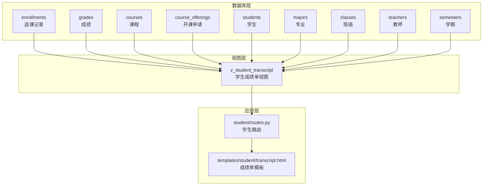
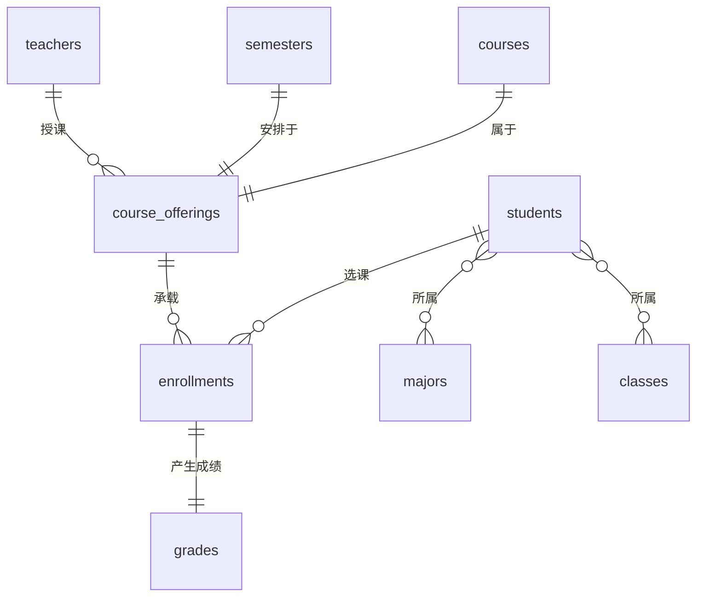
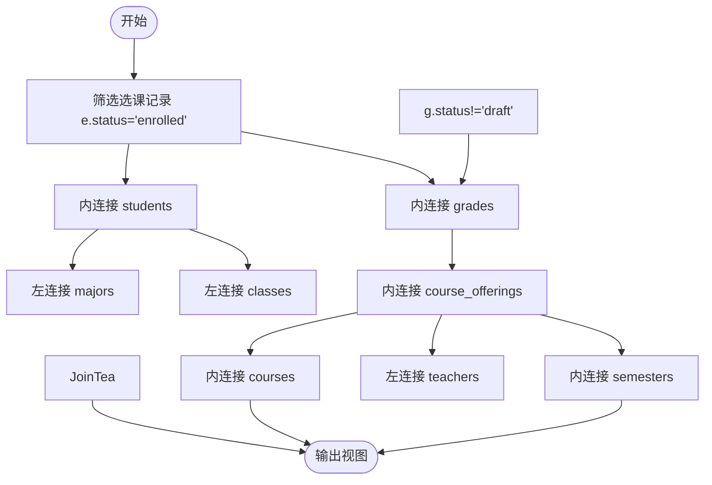
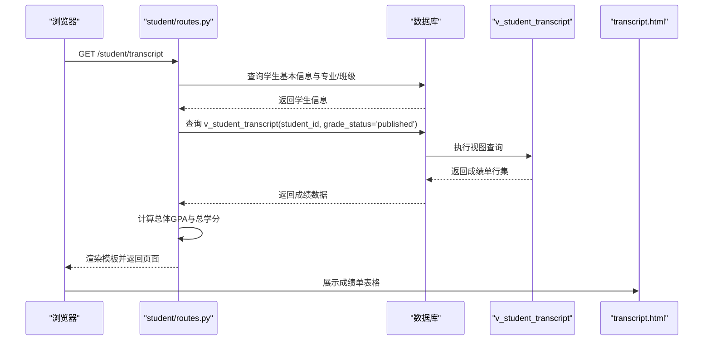
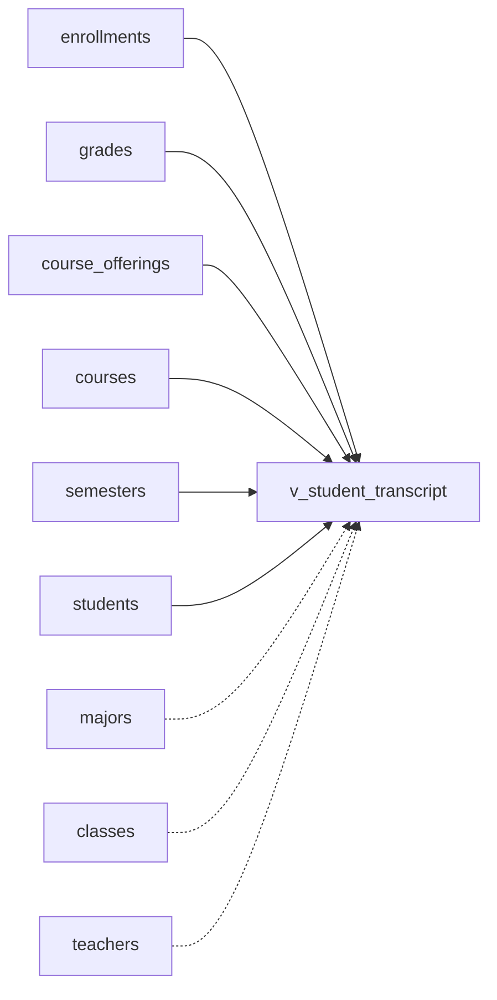

# 学生成绩单视图 (v_student_transcript)

<cite>
**本文引用的文件**
- [04_views.sql](file://sql/04_views.sql)
- [01_schema.sql](file://sql/01_schema.sql)
- [03_procedures.sql](file://sql/03_procedures.sql)
- [routes.py](file://app/student/routes.py)
- [transcript.html](file://app/templates/student/transcript.html)
</cite>

## 目录
1. [引言](#引言)
2. [项目结构](#项目结构)
3. [核心组件](#核心组件)
4. [架构概览](#架构概览)
5. [详细组件分析](#详细组件分析)
6. [依赖关系分析](#依赖关系分析)
7. [性能考虑](#性能考虑)
8. [故障排除指南](#故障排除指南)
9. [结论](#结论)
10. [附录](#附录)

## 引言
本文件围绕学生成绩单视图 v_student_transcript 提供系统化技术文档，聚焦其在学生成绩管理与学术记录中的核心作用。该视图通过整合选课、成绩、课程、学期、教师等多表数据，形成统一的“成绩单”信息源，支撑学生个人成绩单生成、GPA 统计与学术分析等关键业务场景。

## 项目结构
- 视图定义位于 SQL 脚本中，负责构建跨表查询结果集；
- 应用层路由通过调用该视图实现前端展示；
- 模板文件负责渲染最终成绩单页面；
- 数据模型（表结构）定义了各实体之间的外键约束与索引设计。

图表来源
- [04_views.sql:37-66](file://sql/04_views.sql#L37-L66)
- [01_schema.sql:127-198](file://sql/01_schema.sql#L127-L198)
- [routes.py:215-232](file://app/student/routes.py#L215-L232)

章节来源
- [04_views.sql:37-66](file://sql/04_views.sql#L37-L66)
- [01_schema.sql:127-198](file://sql/01_schema.sql#L127-L198)
- [routes.py:215-232](file://app/student/routes.py#L215-L232)

## 核心组件
- 视图 v_student_transcript：提供完整成绩单信息汇总，包含学生基本信息、专业/班级、课程详情、成绩数据（平时成绩、考试成绩、总评、绩点）、学期与教师信息。
- 关键字段来源：
  - 学生基本信息：来自 students 表（学号、姓名、性别、状态等）
  - 专业/班级信息：来自 majors 与 classes 表（名称、所属关系）
  - 课程详情：来自 courses 表（课程代码、名称、学分、类型等）
  - 成绩数据：来自 grades 表（平时成绩、考试成绩、总评、绩点、状态）
  - 学期信息：来自 semesters 表（名称）
  - 教师信息：来自 teachers 表（姓名、职称等）

章节来源
- [04_views.sql:37-66](file://sql/04_views.sql#L37-L66)
- [01_schema.sql:39-77](file://sql/01_schema.sql#L39-L77)
- [01_schema.sql:127-198](file://sql/01_schema.sql#L127-L198)

## 架构概览
视图通过 JOIN 与 LEFT JOIN 将多个事实表与维度表关联，形成稳定的“成绩单”宽表，便于上层应用直接查询与展示。

图表来源
- [01_schema.sql:39-77](file://sql/01_schema.sql#L39-L77)
- [01_schema.sql:127-198](file://sql/01_schema.sql#L127-L198)

## 详细组件分析

### 视图定义与查询逻辑
- 连接策略
  - 内连接（JOIN）：确保仅返回已正式选课且有对应成绩记录的数据；
  - 左连接（LEFT JOIN）：保留学生所在专业与班级信息，即使某些历史或特殊情况下缺失也能显示；
  - 可选教师连接：当开课申请未绑定教师时仍可显示课程信息。
- 过滤条件
  - e.status = 'enrolled'：仅包含有效选课记录；
  - g.status != 'draft'：排除草稿状态的成绩，保证展示数据的完整性与权威性。
- 字段映射
  - 学生维度：student_id、student_no、student_name、major_name、class_name
  - 课程维度：course_code、course_name、credit、course_type
  - 成绩维度：regular_grade、exam_grade、total_grade、gpa_point、grade_status
  - 时间维度：semester_name
  - 教师维度：teacher_name

图表来源
- [04_views.sql:37-66](file://sql/04_views.sql#L37-L66)

章节来源
- [04_views.sql:37-66](file://sql/04_views.sql#L37-L66)

### 数据模型与约束
- 学生表（students）：主键 id，外键 major_id、class_id 关联专业与班级；包含学号、姓名、性别、入学年份、状态等。
- 班级表（classes）：主键 id，外键 major_id 关联专业；包含班级名称、年级等。
- 专业表（majors）：主键 id；用于描述学生所属专业。
- 开课申请表（course_offerings）：主键 id，外键 course_id、teacher_id、semester_id；包含最大人数、教室、时间安排、状态等。
- 选课记录表（enrollments）：主键 id，外键 student_id、course_offering_id；状态枚举包括 enrolled/dropped。
- 成绩表（grades）：唯一键 enrollment_id，包含平时成绩、考试成绩、总评、绩点、状态等。
- 学期表（semesters）：主键 id；用于标识开课学期。

章节来源
- [01_schema.sql:39-77](file://sql/01_schema.sql#L39-L77)
- [01_schema.sql:127-198](file://sql/01_schema.sql#L127-L198)

### 应用集成与展示
- 路由层：学生端路由通过调用视图获取指定学生的已发布成绩，并计算总体 GPA 与总学分后传递给模板渲染。
- 模板层：渲染成绩单表格，包含学期、课程代码、名称、学分、平时/考试/总评、绩点等字段。

图表来源
- [routes.py:215-232](file://app/student/routes.py#L215-L232)
- [transcript.html:21-31](file://app/templates/student/transcript.html#L21-L31)
- [04_views.sql:37-66](file://sql/04_views.sql#L37-L66)

章节来源
- [routes.py:215-232](file://app/student/routes.py#L215-L232)
- [transcript.html:21-31](file://app/templates/student/transcript.html#L21-L31)

### 查询示例与使用场景
- 按学生查询：在视图中添加 student_id 条件，即可获取某位学生的完整成绩单（通常配合 grade_status='published' 使用）。
- 按课程查询：通过 course_code 或 course_name 进行过滤，可用于课程层面的统计与分析。
- 按学期查询：通过 semester_name 排序与过滤，支持按学期生成报表与统计。
- 综合查询：结合上述条件与排序（如按学期与课程代码），可满足多种成绩单与统计需求。

章节来源
- [04_views.sql:37-66](file://sql/04_views.sql#L37-L66)
- [routes.py:215-232](file://app/student/routes.py#L215-L232)

## 依赖关系分析
- 视图依赖关系
  - 必需依赖：enrollments、grades、course_offerings、courses、semesters
  - 可选依赖：majors、classes、teachers
- 外键与索引
  - 外键约束确保数据一致性（如选课记录删除时级联删除成绩）；
  - 索引覆盖常用查询路径（如选课状态、开课状态、成绩状态等）。

图表来源
- [04_views.sql:37-66](file://sql/04_views.sql#L37-L66)
- [01_schema.sql:127-198](file://sql/01_schema.sql#L127-L198)

章节来源
- [04_views.sql:37-66](file://sql/04_views.sql#L37-L66)
- [01_schema.sql:127-198](file://sql/01_schema.sql#L127-L198)

## 性能考虑
- 连接顺序与选择性：优先连接高选择性的表（如按状态过滤的表），减少中间结果集规模。
- 索引利用：确保在 e.status、g.status、co.status、co.semester_id 等常用过滤字段上有合适索引。
- 视图物化：若查询频繁且数据量大，可考虑将视图结果物化为汇总表以提升查询性能。
- 分页与排序：在应用层对视图查询进行分页与稳定排序（如按学期与课程代码），避免一次性返回大量数据。

## 故障排除指南
- 无数据或数据不完整
  - 检查选课状态是否为 enrolled；
  - 检查成绩状态是否为非 draft；
  - 确认是否存在开课申请与课程信息。
- 专业/班级为空
  - 由于使用 LEFT JOIN，若学生记录缺少专业/班级信息，将显示为空值，应检查 students 表数据完整性。
- 教师信息缺失
  - 由于使用 LEFT JOIN，若开课申请未绑定教师，将无法显示教师信息，应检查 course_offerings.teacher_id 是否为空。
- 成绩未显示
  - 若成绩尚未发布（status='published'），则不会出现在学生端成绩单中；应确认成绩流程与状态变更。

章节来源
- [04_views.sql:37-66](file://sql/04_views.sql#L37-L66)
- [01_schema.sql:127-198](file://sql/01_schema.sql#L127-L198)

## 结论
v_student_transcript 作为成绩单的核心数据视图，通过严谨的 JOIN 与过滤策略，实现了对学生成绩信息的完整聚合。其设计兼顾了业务可用性与数据完整性，既满足学生端成绩单展示，也为 GPA 统计与学术分析提供了可靠基础。建议在生产环境中配合索引优化与必要的物化策略，持续保障查询性能与稳定性。

## 附录
- 相关存储过程与触发器
  - 自动计算总评与绩点的触发器与存储过程，确保成绩数据的一致性与准确性。
- 前端模板字段映射
  - 模板中展示的字段与视图字段保持一致，便于前后端协作与维护。

章节来源
- [03_procedures.sql:203-355](file://sql/03_procedures.sql#L203-L355)
- [transcript.html:21-31](file://app/templates/student/transcript.html#L21-L31)