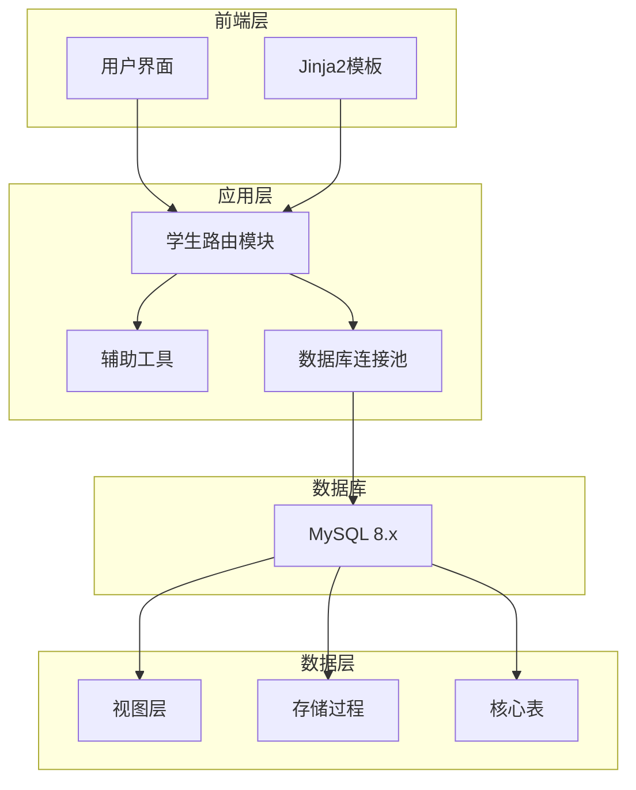
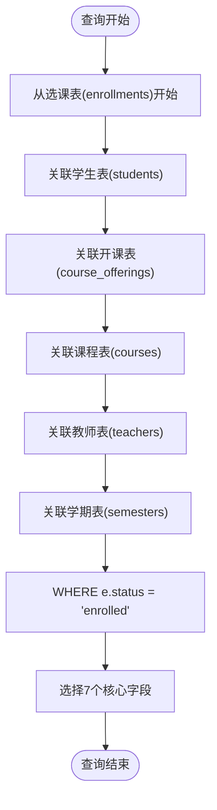
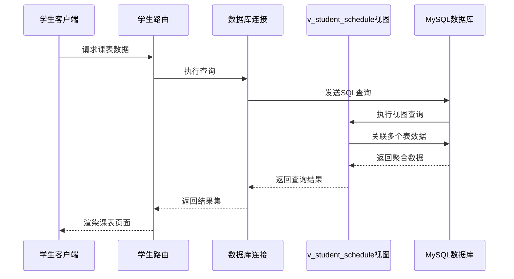
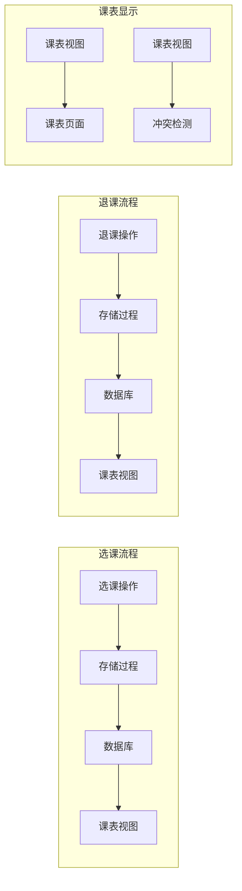
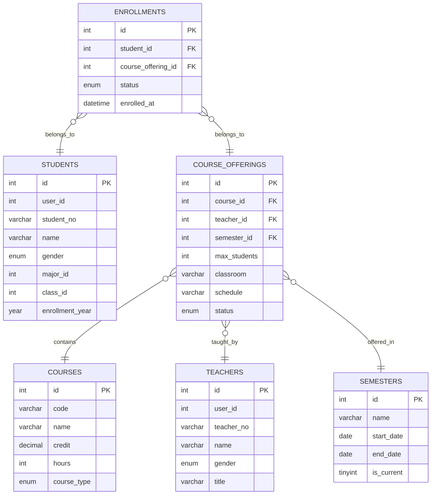
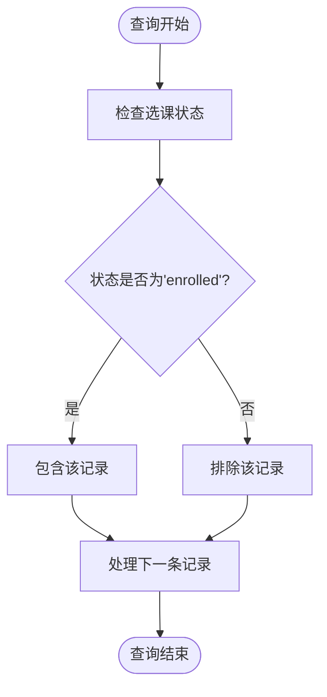
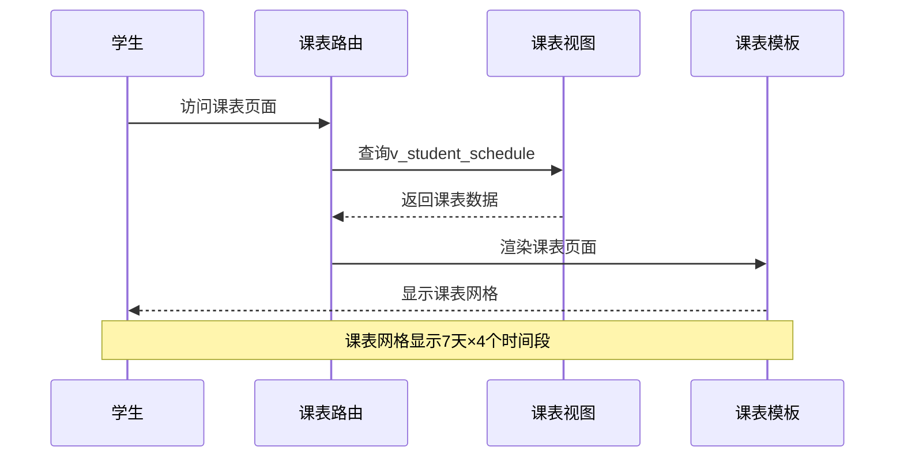
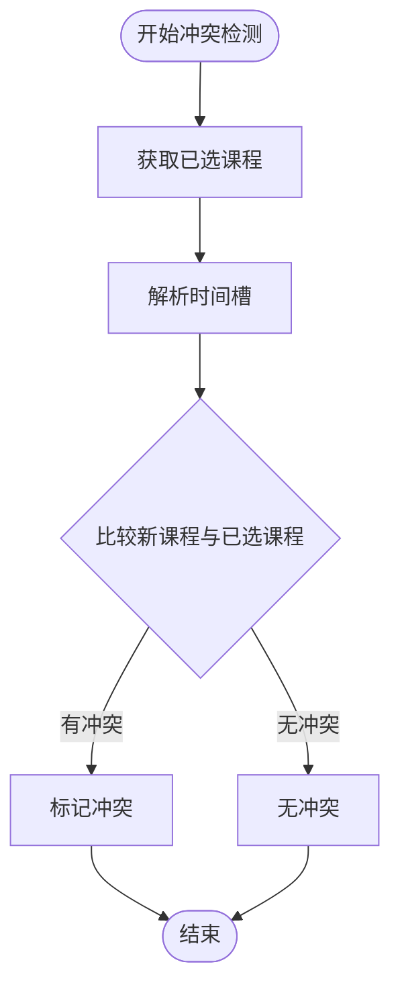
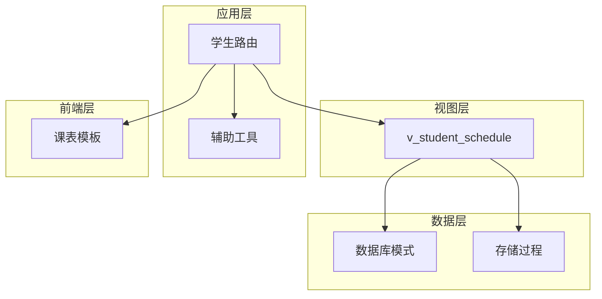
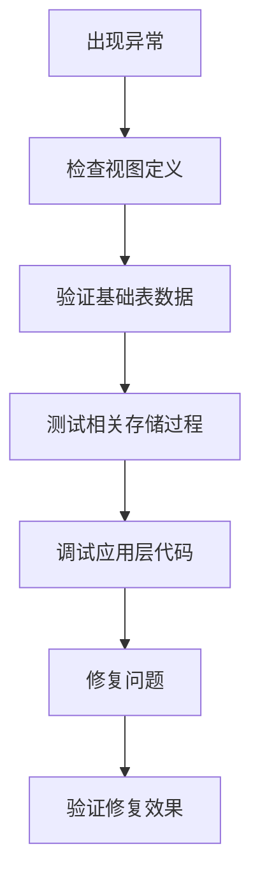

# 学生课表视图 (v_student_schedule)

<cite>
**本文档引用的文件**
- [sql/04_views.sql](file://sql/04_views.sql)
- [sql/01_schema.sql](file://sql/01_schema.sql)
- [sql/03_procedures.sql](file://sql/03_procedures.sql)
- [app/student/routes.py](file://app/student/routes.py)
- [app/templates/student/schedule.html](file://app/templates/student/schedule.html)
- [app/helpers.py](file://app/helpers.py)
- [app/db.py](file://app/db.py)
- [README.md](file://README.md)
</cite>

## 目录
1. [简介](#简介)
2. [项目结构](#项目结构)
3. [核心组件](#核心组件)
4. [架构概览](#架构概览)
5. [详细组件分析](#详细组件分析)
6. [依赖分析](#依赖分析)
7. [性能考虑](#性能考虑)
8. [故障排除指南](#故障排除指南)
9. [结论](#结论)

## 简介

学生课表视图(v_student_schedule)是校园教务选课与成绩管理系统中的核心数据视图，专门用于为学生提供完整的个人课表信息。该视图通过整合多个核心业务表的数据，将分散在不同表中的选课、课程、教师、学期等信息统一呈现，为学生提供了直观、易用的课表管理界面。

该视图的设计目的是简化复杂的联接查询，提高数据访问效率，同时确保学生能够清晰地看到自己的所有课程安排，包括课程基本信息、教师信息、时间地点安排以及选课状态等关键信息。

## 项目结构

该项目采用典型的三层架构设计，包含以下主要组件：



**图表来源**
- [app/__init__.py:29-64](file://app/__init__.py#L29-L64)
- [app/student/routes.py:1-233](file://app/student/routes.py#L1-L233)

**章节来源**
- [README.md:46-87](file://README.md#L46-L87)
- [app/__init__.py:29-64](file://app/__init__.py#L29-L64)

## 核心组件

### 视图定义与查询逻辑

学生课表视图通过一个精心设计的SQL查询语句，将多个表的数据进行关联整合：



**图表来源**
- [sql/04_views.sql:10-32](file://sql/04_views.sql#L10-L32)

### 7个核心字段详解

视图定义了7个关键字段，每个字段都有明确的业务含义：

| 字段名称 | 来源表 | 字段含义 | 数据类型 |
|---------|--------|----------|----------|
| student_id | students | 学生唯一标识符 | INT |
| student_no | students | 学生学号 | VARCHAR |
| student_name | students | 学生姓名 | VARCHAR |
| offering_id | course_offerings | 开课记录标识符 | INT |
| course_code | courses | 课程代码 | VARCHAR |
| course_name | courses | 课程名称 | VARCHAR |
| credit | courses | 课程学分 | DECIMAL |
| course_type | courses | 课程类型 | ENUM |
| teacher_name | teachers | 教师姓名 | VARCHAR |
| schedule | course_offerings | 上课时间安排 | VARCHAR |
| classroom | course_offerings | 上课教室 | VARCHAR |
| semester_name | semesters | 学期名称 | VARCHAR |
| enroll_status | enrollments | 选课状态 | ENUM |
| enrolled_at | enrollments | 选课时间 | DATETIME |

**章节来源**
- [sql/04_views.sql:10-32](file://sql/04_views.sql#L10-L32)
- [sql/01_schema.sql:158-174](file://sql/01_schema.sql#L158-L174)

## 架构概览

### 数据流架构



**图表来源**
- [app/student/routes.py:176-182](file://app/student/routes.py#L176-L182)
- [app/db.py:43-50](file://app/db.py#L43-L50)

### 业务流程集成

该视图在整个系统中扮演着关键角色，与多个业务流程紧密集成：



**图表来源**
- [sql/03_procedures.sql:14-113](file://sql/03_procedures.sql#L14-L113)
- [app/student/routes.py:176-182](file://app/student/routes.py#L176-L182)

## 详细组件分析

### 视图查询逻辑深度分析

#### 表关联关系

视图通过以下关联关系实现数据整合：



**图表来源**
- [sql/01_schema.sql:158-174](file://sql/01_schema.sql#L158-L174)
- [sql/01_schema.sql:128-155](file://sql/01_schema.sql#L128-L155)
- [sql/01_schema.sql:110-125](file://sql/01_schema.sql#L110-L125)

#### WHERE条件分析

WHERE条件 `e.status = 'enrolled'` 的作用和数据过滤逻辑：



**图表来源**
- [sql/04_views.sql:32](file://sql/04_views.sql#L32)

这个WHERE条件确保了视图只返回有效的选课记录，排除了已退课或其他非活跃状态的记录，保证了学生课表数据的准确性和时效性。

**章节来源**
- [sql/04_views.sql:10-32](file://sql/04_views.sql#L10-L32)

### 应用场景与功能实现

#### 学生课表显示功能

视图在学生课表显示中的具体应用：



**图表来源**
- [app/student/routes.py:176-182](file://app/student/routes.py#L176-L182)
- [app/templates/student/schedule.html:17-48](file://app/templates/student/schedule.html#L17-L48)

#### 课程冲突检测功能

视图支持的智能冲突检测机制：



**图表来源**
- [app/student/routes.py:112-125](file://app/student/routes.py#L112-L125)
- [app/helpers.py:23-58](file://app/helpers.py#L23-L58)

**章节来源**
- [app/student/routes.py:176-182](file://app/student/routes.py#L176-L182)
- [app/templates/student/schedule.html:17-48](file://app/templates/student/schedule.html#L17-L48)
- [app/helpers.py:23-58](file://app/helpers.py#L23-L58)

### 查询示例与使用场景

#### 基本查询示例

以下是一些常见的查询使用场景：

1. **获取特定学生的完整课表**
   ```sql
   SELECT * FROM v_student_schedule WHERE student_id = ? ORDER BY schedule
   ```

2. **按学期筛选课表**
   ```sql
   SELECT * FROM v_student_schedule 
   WHERE student_id = ? AND semester_name = ?
   ORDER BY schedule
   ```

3. **获取特定日期的课程**
   ```sql
   SELECT * FROM v_student_schedule 
   WHERE student_id = ? AND schedule LIKE '%周一%'
   ORDER BY schedule
   ```

#### 复杂查询场景

视图简化了原本复杂的联接查询：

**传统方式（多表联接）**：
```sql
SELECT e.student_id, s.student_no, s.name, 
       co.id, c.code, c.name, c.credit, c.course_type,
       t.name, co.schedule, co.classroom, sem.name,
       e.status, e.enrolled_at
FROM enrollments e
JOIN students s ON e.student_id = s.id
JOIN course_offerings co ON e.course_offering_id = co.id
JOIN courses c ON co.course_id = c.id
JOIN teachers t ON co.teacher_id = t.id
JOIN semesters sem ON co.semester_id = sem.id
WHERE e.status = 'enrolled'
```

**使用视图的方式**：
```sql
SELECT * FROM v_student_schedule 
WHERE student_id = ? AND semester_name = ?
ORDER BY schedule
```

**章节来源**
- [app/student/routes.py:176-182](file://app/student/routes.py#L176-L182)

## 依赖分析

### 组件耦合关系



**图表来源**
- [sql/04_views.sql:10-32](file://sql/04_views.sql#L10-L32)
- [app/student/routes.py:176-182](file://app/student/routes.py#L176-L182)

### 外部依赖关系

该视图依赖于以下外部组件：

1. **数据库连接池**：通过app/db.py提供的连接池管理
2. **权限验证**：基于Flask-Login的用户认证系统
3. **模板渲染**：使用Jinja2模板引擎渲染课表页面
4. **辅助函数**：parse_schedule_slots用于时间槽解析

**章节来源**
- [app/db.py:10-41](file://app/db.py#L10-L41)
- [app/student/routes.py:12-16](file://app/student/routes.py#L12-L16)
- [app/helpers.py:23-58](file://app/helpers.py#L23-L58)

## 性能考虑

### 查询优化策略

1. **索引利用**：视图查询充分利用了各表的索引，特别是status字段和外键索引
2. **连接顺序优化**：从选课表开始，逐步关联到其他表，减少中间结果集大小
3. **WHERE条件前置**：提前过滤掉无效记录，减少后续处理负担

### 缓存策略

虽然视图本身不提供缓存，但可以通过以下方式优化性能：

1. **数据库连接池**：使用PooledDB实现连接复用
2. **查询结果缓存**：在应用层对频繁访问的课表数据进行缓存
3. **分页查询**：对于大量数据的查询使用分页机制

## 故障排除指南

### 常见问题诊断

1. **课表为空**：检查WHERE条件是否正确过滤了非'enrolled'状态
2. **数据不一致**：验证存储过程(sp_enroll_course)是否正确执行
3. **性能问题**：检查相关表的索引是否完整

### 调试方法



**章节来源**
- [sql/03_procedures.sql:14-113](file://sql/03_procedures.sql#L14-L113)
- [app/student/routes.py:176-182](file://app/student/routes.py#L176-L182)

## 结论

学生课表视图(v_student_schedule)是整个教务管理系统中的关键组件，它通过精心设计的SQL查询实现了多表数据的有效整合。该视图不仅简化了复杂的数据查询，提高了系统的整体性能，更重要的是为学生提供了直观、易用的课表管理体验。

通过7个核心字段的合理设计和精确的数据来源定位，该视图能够满足学生在课表查看、课程冲突检测、时间安排规划等多方面的业务需求。配合存储过程的原子性操作和触发器的自动化处理，整个选课系统形成了一个高效、可靠、用户体验良好的完整解决方案。

该视图的成功实施体现了现代数据库设计的最佳实践，即通过视图抽象复杂查询逻辑，通过存储过程保证数据一致性，通过合理的索引设计确保查询性能，最终为用户提供优质的业务服务体验。