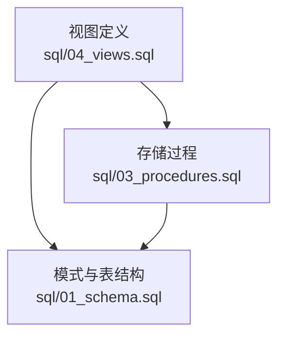
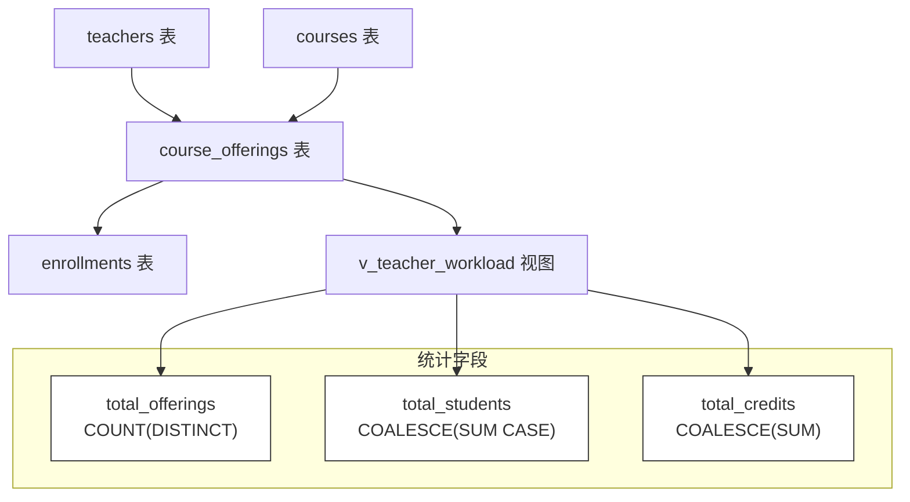
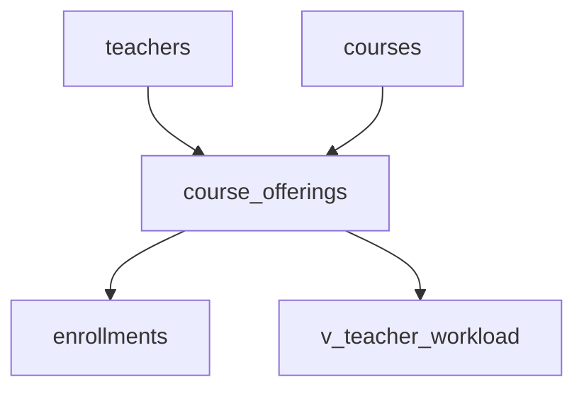

# 教师工作量视图 (v_teacher_workload)

<cite>
**本文引用的文件**
- [04_views.sql](file://sql/04_views.sql)
- [01_schema.sql](file://sql/01_schema.sql)
- [03_procedures.sql](file://sql/03_procedures.sql)
</cite>

## 目录
1. [引言](#引言)
2. [项目结构](#项目结构)
3. [核心组件](#核心组件)
4. [架构总览](#架构总览)
5. [详细组件分析](#详细组件分析)
6. [依赖关系分析](#依赖关系分析)
7. [性能考量](#性能考量)
8. [故障排查指南](#故障排查指南)
9. [结论](#结论)
10. [附录](#附录)

## 引言
本文件围绕教师工作量视图 v_teacher_workload 提供系统化的管理分析文档。该视图在教师绩效评估与人力资源管理中扮演关键角色，通过量化指标直观反映教师的工作负担与产出，支撑评优、工作量分配、薪酬计算与教学资源配置等决策。本文将深入解析其复合统计逻辑（开课数量、学生总数、学分总量），阐明 LEFT JOIN 的设计意图与空值处理策略，并给出多类实用查询示例。

## 项目结构
本项目的数据库层由 SQL 脚本组织，其中视图定义位于视图脚本中；模式定义与表结构在模式脚本中；存储过程用于复杂统计或业务逻辑封装。下图展示与本视图相关的文件与职责映射：

**图表来源**
- [04_views.sql:94-110](file://sql/04_views.sql#L94-L110)
- [01_schema.sql](file://sql/01_schema.sql)
- [03_procedures.sql:245-271](file://sql/03_procedures.sql#L245-L271)

**章节来源**
- [04_views.sql:94-110](file://sql/04_views.sql#L94-L110)
- [01_schema.sql](file://sql/01_schema.sql)
- [03_procedures.sql:245-271](file://sql/03_procedures.sql#L245-L271)

## 核心组件
v_teacher_workload 是一个聚合视图，按教师与学期维度汇总以下三个核心工作量指标：
- 开课数量：统计每名教师在每个学期独立开设的课程次数（去重）。
- 学生总数：统计每名教师在每个学期实际注册选课的学生人数（仅计入已注册状态）。
- 学分总量：统计每名教师在每个学期所授课程的学分合计。

该视图通过 LEFT JOIN 策略连接多个事实表与维度表，确保即使某些课程尚未有选课记录，也能被纳入统计，从而避免遗漏“零登记”的课程开课工作量。

**章节来源**
- [04_views.sql:94-110](file://sql/04_views.sql#L94-L110)

## 架构总览
下图展示了视图构建涉及的核心表与连接关系，以及统计字段的来源与计算方式。该图基于视图定义与模式脚本中的表结构抽象而来，帮助理解数据流向与聚合层次。

**图表来源**
- [04_views.sql:94-110](file://sql/04_views.sql#L94-L110)
- [01_schema.sql](file://sql/01_schema.sql)

## 详细组件分析

### 统计指标与计算逻辑
- 开课数量（total_offerings）
  - 使用对课程开设表的去重计数，确保同一课程在同学期不重复计入。
- 学生总数（total_students）
  - 对选课表中处于特定状态（例如“已注册”）的记录进行求和，并通过空值保护函数保证无记录时返回零。
- 学分总量（total_credits）
  - 对课程表中的学分字段进行求和，并同样采用空值保护以避免空结果。

上述指标共同构成教师工作量的综合度量，既覆盖“教”的覆盖面（开课数量），也覆盖“学”的参与度（学生人数）与“质”的衡量（学分总量）。

**章节来源**
- [04_views.sql:94-110](file://sql/04_views.sql#L94-L110)

### 连接策略与空值处理
- LEFT JOIN 设计动机
  - 为了完整统计教师的教学工作，即使某门课程尚未产生任何选课记录，也应将其计入该教师的开课数量与学分统计。使用左连接可保留主表（教师与课程开设）的所有行，避免因右表（选课）缺失而丢失数据。
- 空值处理（COALESCE）
  - 在 SUM/COUNT 可能返回空值的情况下，统一以零替代，确保后续聚合与排序不会出现异常。
- 计数与求和组合
  - COUNT(DISTINCT ...) 与 SUM(...) 结合，分别从“数量”和“总量”两个维度刻画工作量，兼顾离散事件与连续数值的统计需求。

**章节来源**
- [04_views.sql:94-110](file://sql/04_views.sql#L94-L110)

### 分组层次与聚合维度
- 分组字段
  - 视图按教师与学期进行分组，形成“教师-学期”二维聚合，便于跨学期对比与趋势分析。
- 聚合语义
  - 每个教师在一个学期内的所有课程被合并为一条记录，三条指标分别累加或计数得出该教师当期工作量。

**章节来源**
- [04_views.sql:94-110](file://sql/04_views.sql#L94-L110)

### 应用场景与价值
- 教师评优
  - 基于工作量指标设定权重，结合课程质量与学生评价，形成综合评分。
- 工作量分配
  - 依据历史工作量分布，合理规划新学期的课程安排与教师负荷。
- 薪酬计算
  - 将工作量与岗位系数、课程类别等因素结合，作为绩效薪酬的基础数据。
- 教学资源调配
  - 识别高负荷教师与课程饱和度，动态调整教室、助教与设备资源。

**章节来源**
- [04_views.sql:94-110](file://sql/04_views.sql#L94-L110)

### 查询示例与分析思路
以下示例描述了典型分析场景的查询思路与实现路径（不包含具体代码片段，仅提供路径与要点）：
- 教师工作量排名
  - 按总工作量（可由三指标合成）降序排列，筛选前 N 名教师。
  - 参考路径：[04_views.sql:94-110](file://sql/04_views.sql#L94-L110)
- 学期工作量对比
  - 选择两位教师，按学期分组比较其开课数量、学生总数与学分总量的变化趋势。
  - 参考路径：[04_views.sql:94-110](file://sql/04_views.sql#L94-L110)
- 年度工作量统计
  - 对多个学期的数据进行汇总，计算每位教师的年度总工作量与平均值，辅助预算与排课。
  - 参考路径：[04_views.sql:94-110](file://sql/04_views.sql#L94-L110)

**章节来源**
- [04_views.sql:94-110](file://sql/04_views.sql#L94-L110)

## 依赖关系分析
视图依赖于以下表与字段：
- course_offerings：提供课程开课信息与教师关联。
- enrollments：提供选课状态与学生注册情况，用于统计有效学生数。
- courses：提供课程学分信息，用于学分总量统计。
- teachers：提供教师基本信息，作为聚合主键之一。

**图表来源**
- [04_views.sql:94-110](file://sql/04_views.sql#L94-L110)
- [01_schema.sql](file://sql/01_schema.sql)

**章节来源**
- [04_views.sql:94-110](file://sql/04_views.sql#L94-L110)
- [01_schema.sql](file://sql/01_schema.sql)

## 性能考量
- 索引建议
  - 在 course_offerings 的教师标识与学期字段上建立索引，提升分组与连接效率。
  - 在 enrollments 的状态字段与课程标识字段上建立索引，优化条件求和与连接。
  - 在 courses 的课程标识与学分字段上建立索引，加速学分汇总。
- 视图物化
  - 若查询频繁且数据量大，可考虑将视图物化为物化视图或汇总表，定期刷新以降低运行时计算成本。
- 统计口径一致性
  - 明确选课状态的定义（如仅“已注册”），避免统计口径漂移导致的偏差。

[本节为通用性能建议，不直接分析具体文件]

## 故障排查指南
- 症状：某些课程未出现在统计中
  - 排查：确认是否使用了 LEFT JOIN 保留无选课记录的课程；检查课程状态与学期参数是否正确。
  - 参考路径：[04_views.sql:94-110](file://sql/04_views.sql#L94-L110)
- 症状：学生总数为 NULL
  - 排查：确认 CASE WHEN 条件与状态枚举一致；使用空值保护函数确保返回零。
  - 参考路径：[04_views.sql:94-110](file://sql/04_views.sql#L94-L110)
- 症状：学分总量异常
  - 排查：核对课程学分字段是否为空；确认 SUM 求和与空值保护的组合使用。
  - 参考路径：[04_views.sql:94-110](file://sql/04_views.sql#L94-L110)
- 症状：分组结果不完整
  - 排查：确认 GROUP BY 是否包含教师与学期两个维度；检查学期参数过滤是否过严。
  - 参考路径：[04_views.sql:94-110](file://sql/04_views.sql#L94-L110)

**章节来源**
- [04_views.sql:94-110](file://sql/04_views.sql#L94-L110)

## 结论
v_teacher_workload 通过严谨的连接策略与空值处理，实现了对教师工作量的全面量化。其“开课数量—学生总数—学分总量”的复合指标体系，既能满足日常管理的快速洞察，又能为长期规划与资源配置提供可靠依据。建议结合索引优化与定期物化策略，持续提升查询性能与稳定性。

## 附录
- 相关存储过程参考
  - 存储过程中存在与学分与加权相关的统计逻辑，可作为视图统计口径的补充参考。
  - 参考路径：[03_procedures.sql:245-271](file://sql/03_procedures.sql#L245-L271)

**章节来源**
- [03_procedures.sql:245-271](file://sql/03_procedures.sql#L245-L271)