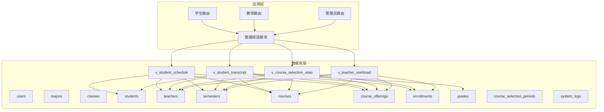
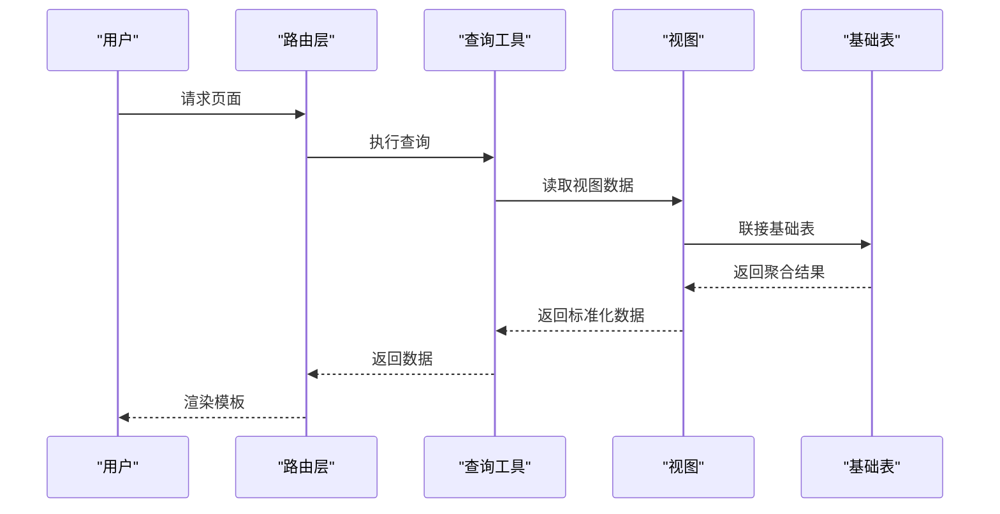
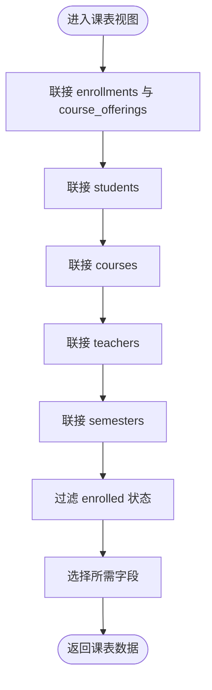
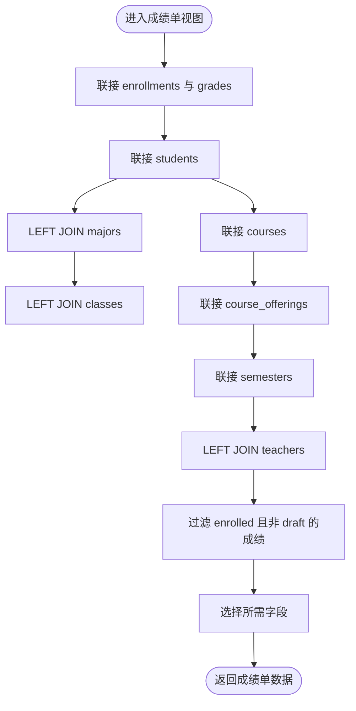
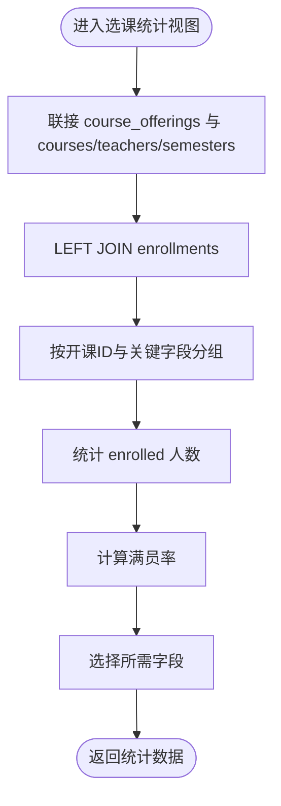
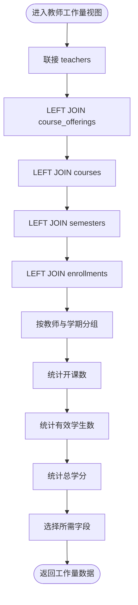
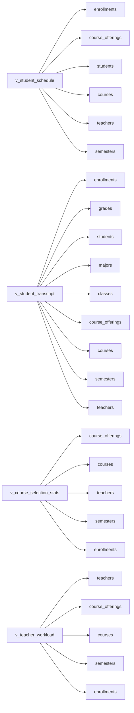

# 视图设计

<cite>
**本文档引用的文件**
- [04_views.sql](file://sql/04_views.sql)
- [01_schema.sql](file://sql/01_schema.sql)
- [03_procedures.sql](file://sql/03_procedures.sql)
- [db.py](file://app/db.py)
- [student/routes.py](file://app/student/routes.py)
- [teacher/routes.py](file://app/teacher/routes.py)
- [admin/routes.py](file://app/admin/routes.py)
- [schedule.html](file://app/templates/student/schedule.html)
- [transcript.html](file://app/templates/student/transcript.html)
- [statistics.html](file://app/templates/admin/statistics.html)
</cite>

## 目录
1. [简介](#简介)
2. [项目结构](#项目结构)
3. [核心组件](#核心组件)
4. [架构总览](#架构总览)
5. [详细组件分析](#详细组件分析)
6. [依赖分析](#依赖分析)
7. [性能考虑](#性能考虑)
8. [故障排除指南](#故障排除指南)
9. [结论](#结论)

## 简介
本文件面向学生信息管理系统，系统性梳理四个核心视图的设计目标、查询逻辑、数据来源与业务用途，并解释视图如何简化复杂联接查询、提升数据访问效率与安全性，以及在报表生成、数据分析与权限控制中的应用。同时提供视图定义与查询示例路径，展示视图与基础表的关系，强调视图在数据抽象与业务逻辑封装中的关键作用。

## 项目结构
- 数据库层：包含12张核心表与视图定义，支撑选课、成绩、开课、统计等业务。
- 应用层：Flask蓝图路由按角色（学生、教师、管理员）调用数据库查询与存储过程，渲染模板页面。
- 视图层：通过视图统一输出标准化的业务数据，便于前端展示与后端复用。

图表来源
- [01_schema.sql:15-235](file://sql/01_schema.sql#L15-L235)
- [04_views.sql:10-112](file://sql/04_views.sql#L10-L112)
- [db.py:10-121](file://app/db.py#L10-L121)

章节来源
- [01_schema.sql:15-235](file://sql/01_schema.sql#L15-L235)
- [04_views.sql:10-112](file://sql/04_views.sql#L10-L112)
- [db.py:10-121](file://app/db.py#L10-L121)

## 核心组件
本系统围绕四大业务视图构建：
- 课表视图：v_student_schedule
- 成绩单视图：v_student_transcript
- 选课统计视图：v_course_selection_stats
- 教师工作量视图：v_teacher_workload

每个视图均基于多表联接，过滤有效状态，聚合关键指标，形成面向业务的稳定数据输出，供前端模板与后台统计模块直接消费。

章节来源
- [04_views.sql:10-112](file://sql/04_views.sql#L10-L112)

## 架构总览
视图作为“虚拟表”，屏蔽底层联接细节，统一字段命名与业务口径，降低前端与后端对复杂SQL的依赖，提升可维护性与安全性。

图表来源
- [student/routes.py:163-169](file://app/student/routes.py#L163-L169)
- [admin/routes.py:612-638](file://app/admin/routes.py#L612-L638)
- [db.py:43-60](file://app/db.py#L43-L60)

## 详细组件分析

### 课表视图 v_student_schedule
- 设计目的
  - 为学生提供个人课表的完整视图，包含课程、教师、时间、教室、学期、选课状态等信息。
- 数据来源与联接
  - 来源于 enrollments 与 course_offerings 的联接，再与 students、courses、teachers、semesters 进行联接。
  - 过滤条件：仅显示状态为 enrolled 的选课记录。
- 查询逻辑要点
  - 字段选择：学生ID/学号/姓名、开课ID、课程代码/名称/学分/类型、教师名、开课时间/教室、学期名、选课状态、选课时间。
  - 通过 WHERE e.status = 'enrolled' 确保只展示有效选课。
- 业务用途
  - 学生课表展示、退课操作依据、时间冲突检测（与 course_offerings.schedule 配合）。
- 在应用中的使用
  - 学生课表路由直接从视图读取数据，模板渲染课表网格与课程列表。
- 视图与基础表关系
  - 依赖 enrollments、course_offerings、students、courses、teachers、semesters。
- 性能与安全
  - 通过视图限定有效状态，减少前端过滤成本；视图隐藏内部联接细节，避免直接暴露底层表结构。

图表来源
- [04_views.sql:10-32](file://sql/04_views.sql#L10-L32)
- [student/routes.py:163-169](file://app/student/routes.py#L163-L169)

章节来源
- [04_views.sql:10-32](file://sql/04_views.sql#L10-L32)
- [student/routes.py:163-169](file://app/student/routes.py#L163-L169)
- [schedule.html:16-97](file://app/templates/student/schedule.html#L16-L97)

### 成绩单视图 v_student_transcript
- 设计目的
  - 提供学生成绩的完整清单，包含课程、学分、平时/期末/总评/绩点、学期、教师等信息，支持打印与统计。
- 数据来源与联接
  - 来源于 enrollments 与 grades 的联接，再与 students、majors、classes、course_offerings、courses、semesters、teachers 进行联接。
  - 过滤条件：仅显示状态为 enrolled 的选课记录，且成绩状态非 draft。
- 查询逻辑要点
  - 字段选择：学生ID/学号/姓名、专业/班级、课程代码/名称/学分/类型、平时/期末/总评/绩点、成绩状态、学期名、教师名。
  - 使用 LEFT JOIN 处理可能缺失的专业/班级/教师信息。
  - 通过 WHERE e.status = 'enrolled' AND g.status != 'draft' 确保有效选课与有效成绩。
- 业务用途
  - 学生成绩单打印、GPA计算、学业预警分析。
- 在应用中的使用
  - 学生转学生成绩单路由从视图读取已发布成绩并渲染打印模板。
- 视图与基础表关系
  - 依赖 enrollments、grades、students、majors、classes、course_offerings、courses、semesters、teachers。
- 性能与安全
  - 通过视图过滤 draft 状态，确保只展示正式成绩；统一字段命名，便于前端展示。

图表来源
- [04_views.sql:38-66](file://sql/04_views.sql#L38-L66)
- [student/routes.py:202-219](file://app/student/routes.py#L202-L219)
- [transcript.html:19-31](file://app/templates/student/transcript.html#L19-L31)

章节来源
- [04_views.sql:38-66](file://sql/04_views.sql#L38-L66)
- [student/routes.py:202-219](file://app/student/routes.py#L202-L219)
- [transcript.html:1-32](file://app/templates/student/transcript.html#L1-L32)

### 选课统计视图 v_course_selection_stats
- 设计目的
  - 展示每门课程的选课人数、上限、满员率与状态，辅助教学资源规划与开课审核。
- 数据来源与联接
  - 来源于 course_offerings 与 courses、teachers、semesters 的联接，并 LEFT JOIN enrollments 统计选课人数。
- 查询逻辑要点
  - 字段选择：开课ID、课程代码/名称/类型、教师名、学期名、最大人数、已选人数、满员率、开课状态。
  - 使用 COUNT(CASE WHEN e.status = 'enrolled' THEN 1 END) 统计有效选课人数。
  - 使用 ROUND(... * 100.0 / co.max_students, 1) 计算满员率。
  - GROUP BY 关键字段，保证统计粒度。
- 业务用途
  - 管理员统计分析页面展示选课情况，指导开课计划与教室安排。
- 在应用中的使用
  - 管理员统计页面从视图读取已批准/发布的开课统计并渲染表格与图表。
- 视图与基础表关系
  - 依赖 course_offerings、courses、teachers、semesters、enrollments。
- 性能与安全
  - 通过视图预聚合，减少前端重复计算；仅展示 approved/published 的开课，避免未发布数据干扰。

图表来源
- [04_views.sql:72-91](file://sql/04_views.sql#L72-L91)
- [admin/routes.py:612-638](file://app/admin/routes.py#L612-L638)
- [statistics.html:6-46](file://app/templates/admin/statistics.html#L6-L46)

章节来源
- [04_views.sql:72-91](file://sql/04_views.sql#L72-L91)
- [admin/routes.py:612-638](file://app/admin/routes.py#L612-L638)
- [statistics.html:1-65](file://app/templates/admin/statistics.html#L1-L65)

### 教师工作量视图 v_teacher_workload
- 设计目的
  - 统计每位教师的开课数量、所带学生总数与总学分，用于绩效评估与排课规划。
- 数据来源与联接
  - 来源于 teachers 与 course_offerings、courses、semesters、enrollments 的 LEFT JOIN。
- 查询逻辑要点
  - 字段选择：教师ID/工号/姓名/职称、学期名、开课数、学生总数、总学分。
  - 使用 COUNT(DISTINCT co.id) 统计开课数，COALESCE(...) 处理空值。
  - 使用 SUM(CASE WHEN e.status = 'enrolled' THEN 1 ELSE 0 END) 统计有效学生数。
  - 使用 SUM(c.credit) 统计总学分。
  - GROUP BY 教师与学期维度。
- 业务用途
  - 管理员工作量统计、教师绩效参考、排课与资源分配。
- 在应用中的使用
  - 管理员统计页面从视图按教师汇总工作量并渲染表格。
- 视图与基础表关系
  - 依赖 teachers、course_offerings、courses、semesters、enrollments。
- 性能与安全
  - 通过视图预聚合，减少重复计算；LEFT JOIN 确保即使无开课也显示教师信息。

图表来源
- [04_views.sql:97-112](file://sql/04_views.sql#L97-L112)
- [admin/routes.py:612-638](file://app/admin/routes.py#L612-L638)
- [statistics.html:37-46](file://app/templates/admin/statistics.html#L37-L46)

章节来源
- [04_views.sql:97-112](file://sql/04_views.sql#L97-L112)
- [admin/routes.py:612-638](file://app/admin/routes.py#L612-L638)
- [statistics.html:1-65](file://app/templates/admin/statistics.html#L1-L65)

## 依赖分析
- 视图依赖关系
  - v_student_schedule 依赖 students、course_offerings、courses、teachers、semesters、enrollments。
  - v_student_transcript 依赖 enrollments、grades、students、majors、classes、course_offerings、courses、semesters、teachers。
  - v_course_selection_stats 依赖 course_offerings、courses、teachers、semesters、enrollments。
  - v_teacher_workload 依赖 teachers、course_offerings、courses、semesters、enrollments。
- 应用层依赖
  - 学生路由：课表视图用于课表展示；成绩单视图用于转学生成绩单。
  - 教师路由：主要使用基础表与存储过程，不直接依赖上述视图。
  - 管理员路由：选课统计与教师工作量统计直接依赖对应视图。
- 存储过程与触发器
  - 与视图配合：存储过程负责业务流程（如选课/退课、成绩计算），触发器负责自动计算与审计；视图提供稳定的查询接口。

图表来源
- [04_views.sql:10-112](file://sql/04_views.sql#L10-L112)
- [01_schema.sql:15-235](file://sql/01_schema.sql#L15-L235)

章节来源
- [04_views.sql:10-112](file://sql/04_views.sql#L10-L112)
- [01_schema.sql:15-235](file://sql/01_schema.sql#L15-L235)

## 性能考虑
- 视图预聚合
  - 选课统计与教师工作量视图预先计算人数与比率，减少前端重复计算与网络传输。
- 索引与约束
  - 基础表在常用联接字段上建立索引（如 course_offerings.course_id、enrollments.student_id 等），提升联接与过滤效率。
- 分页与缓存
  - 应用层使用分页查询工具，结合视图减少单次查询数据量；对于高频统计页面可考虑短期缓存。
- 安全与权限
  - 视图限制有效状态（如 enrolled、非 draft），避免敏感数据泄露；路由层通过装饰器与角色校验进一步保障访问安全。

## 故障排除指南
- 课表为空
  - 检查是否存在状态为 enrolled 的选课记录；确认学生ID正确；核对 course_offerings 是否处于 published 状态。
- 成绩单无数据
  - 确认成绩状态非 draft；检查是否为 enrolled 的选课；核对学期与课程状态。
- 选课统计异常
  - 确认开课状态为 approved 或 published；检查 max_students 与 enrolled_count 是否合理；核对分组字段。
- 教师工作量为零
  - 确认教师是否有开课记录；检查 enrollments 状态是否为 enrolled；核对课程学分设置。
- 路由查询失败
  - 检查数据库连接池配置与查询参数绑定；确认视图存在且字段名一致；核对 Flask 路由与模板渲染逻辑。

章节来源
- [db.py:43-121](file://app/db.py#L43-L121)
- [student/routes.py:163-219](file://app/student/routes.py#L163-L219)
- [admin/routes.py:612-638](file://app/admin/routes.py#L612-L638)

## 结论
四大视图通过标准化字段、预聚合统计与状态过滤，显著简化了复杂联接查询，提升了数据访问效率与安全性。它们在报表生成、数据分析与权限控制方面发挥关键作用，是系统数据抽象与业务逻辑封装的重要基石。建议在后续扩展中继续以视图为数据出口，保持前后端解耦与可维护性。