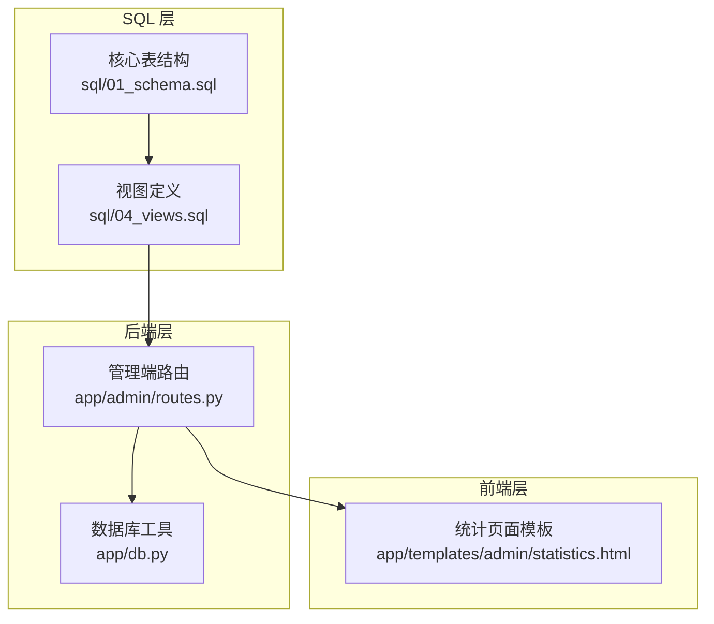
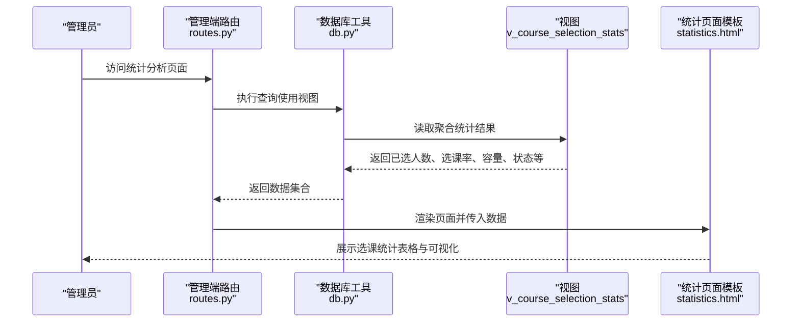
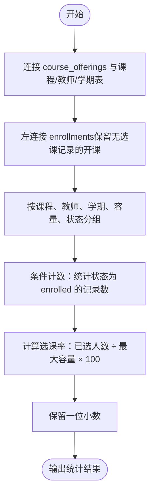
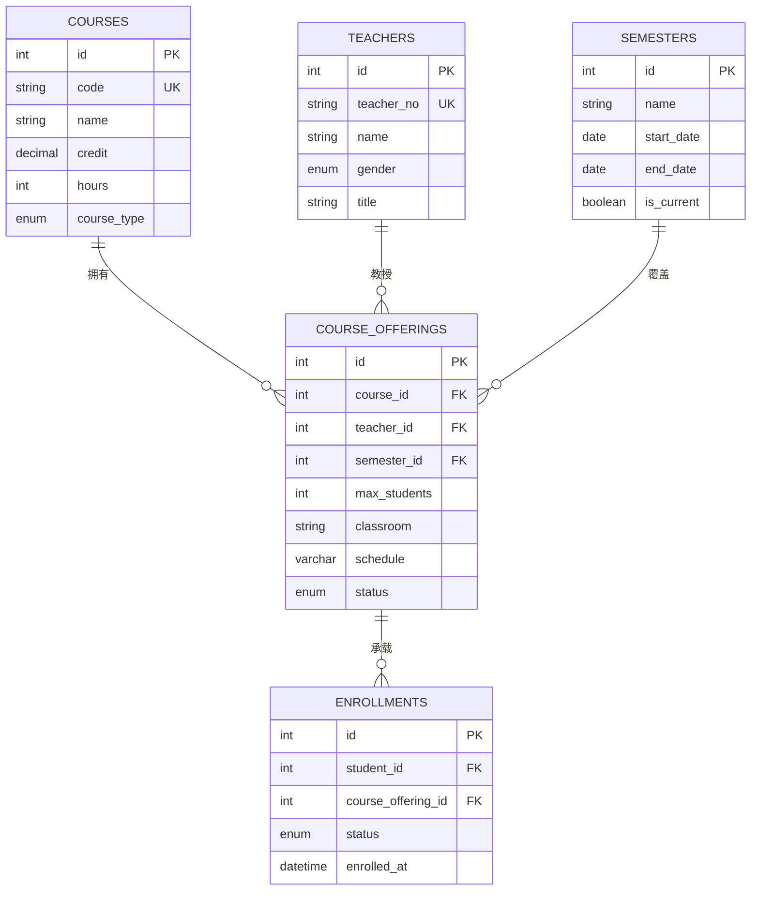
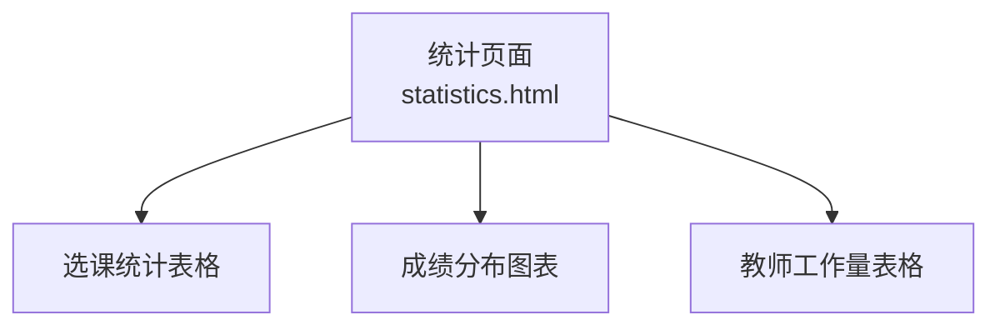
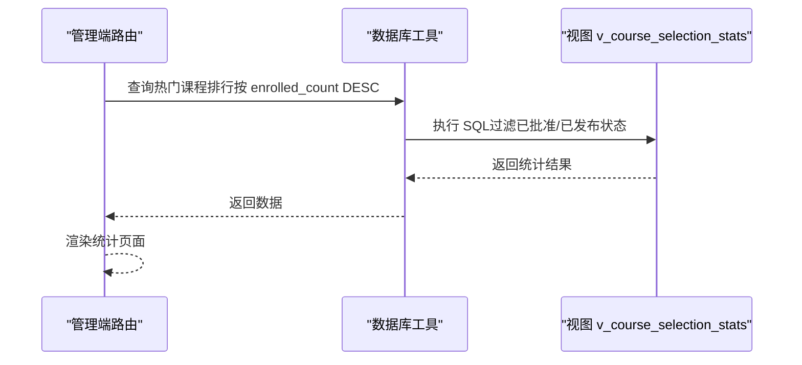
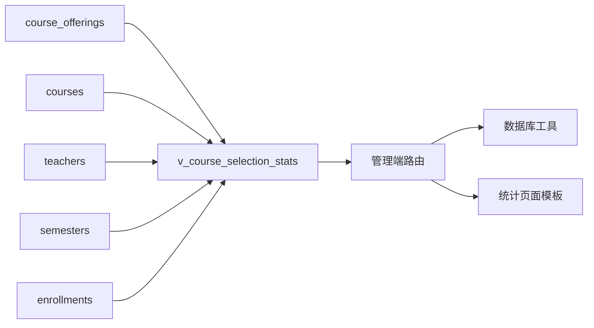

# 选课统计视图 (v_course_selection_stats)

<cite>
**本文引用的文件**
- [04_views.sql](file://sql/04_views.sql)
- [01_schema.sql](file://sql/01_schema.sql)
- [statistics.html](file://app/templates/admin/statistics.html)
- [routes.py](file://app/admin/routes.py)
- [db.py](file://app/db.py)
</cite>

## 目录
1. [简介](#简介)
2. [项目结构](#项目结构)
3. [核心组件](#核心组件)
4. [架构总览](#架构总览)
5. [详细组件分析](#详细组件分析)
6. [依赖关系分析](#依赖关系分析)
7. [性能考量](#性能考量)
8. [故障排查指南](#故障排查指南)
9. [结论](#结论)
10. [附录](#附录)

## 简介
选课统计视图（v_course_selection_stats）是校园教务选课与成绩管理系统中的关键分析组件，用于从课程开课与选课记录中提取综合统计数据。该视图通过聚合每个开课记录的选课人数、计算选课率、展示课程容量与状态，为选课管理、资源配置与课程评估等管理决策提供数据支撑。其核心统计指标包括：
- 已选人数（enrolled_count）
- 选课率（fill_rate）
- 最大容量（max_students）
- 课程状态（offering_status）

此外，视图还按课程、教师、学期等维度进行数据聚合，便于多维分析与报表展示。

## 项目结构
该视图位于 SQL 定义脚本中，并被 Flask 后端路由与模板共同消费，形成“视图 -> 路由 -> 模板”的完整数据链路。

图表来源
- [04_views.sql:72-91](file://sql/04_views.sql#L72-L91)
- [01_schema.sql:130-155](file://sql/01_schema.sql#L130-L155)
- [routes.py:613-638](file://app/admin/routes.py#L613-L638)
- [statistics.html:6-23](file://app/templates/admin/statistics.html#L6-L23)

章节来源
- [04_views.sql:72-91](file://sql/04_views.sql#L72-L91)
- [01_schema.sql:130-155](file://sql/01_schema.sql#L130-L155)
- [routes.py:613-638](file://app/admin/routes.py#L613-L638)
- [statistics.html:6-23](file://app/templates/admin/statistics.html#L6-L23)

## 核心组件
- 视图定义：在 SQL 脚本中定义了 v_course_selection_stats，负责从 course_offerings、courses、teachers、semesters 与 enrollments 表中聚合统计信息。
- 聚合字段与指标：
  - 已选人数（enrolled_count）：对 enrollments 表按状态进行条件计数，仅统计状态为 enrolled 的记录。
  - 选课率（fill_rate）：以 enrolled_count 除以 max_students 并乘以 100，保留一位小数。
  - 最大容量（max_students）：直接来自 course_offerings。
  - 课程状态（offering_status）：来自 course_offerings。
- 分组维度：按开课记录主键与课程、教师、学期、容量、状态等字段进行分组，确保每条开课记录对应一条统计行。

章节来源
- [04_views.sql:72-91](file://sql/04_views.sql#L72-L91)

## 架构总览
选课统计视图的数据流从底层表到视图，再到后端查询与前端展示，形成闭环的数据分析链路。

图表来源
- [routes.py:613-638](file://app/admin/routes.py#L613-L638)
- [statistics.html:6-23](file://app/templates/admin/statistics.html#L6-L23)
- [04_views.sql:72-91](file://sql/04_views.sql#L72-L91)

## 详细组件分析

### 视图定义与统计逻辑
- 数据源与连接
  - course_offerings 作为主表，关联 courses、teachers、semesters 获取课程、教师、学期信息。
  - 使用 LEFT JOIN enrollments 连接选课记录，保证即使没有选课记录也能显示开课信息。
- 条件计数（enrolled_count）
  - 使用 COUNT(CASE WHEN e.status = 'enrolled' THEN 1 END)，仅对状态为 enrolled 的记录计数，避免将退课等状态计入已选人数。
- 选课率（fill_rate）计算
  - 公式：已选人数 ÷ 最大容量 × 100
  - 使用 ROUND(..., 1) 将结果保留一位小数，便于前端展示与阅读。
- 分组维度（GROUP BY）
  - 包括：开课记录主键、课程代码、课程名称、课程类型、教师姓名、学期名称、最大容量、开课状态。
  - 该分组策略确保每条开课记录独立统计，支持按课程、教师、学期维度进行多维分析。

图表来源
- [04_views.sql:72-91](file://sql/04_views.sql#L72-L91)

章节来源
- [04_views.sql:72-91](file://sql/04_views.sql#L72-L91)

### 数据模型与表关系
- course_offerings：记录每门课程在某个学期的开课信息，包含最大容量、状态等。
- courses：课程基本信息（代码、名称、学分、课程类型等）。
- teachers：教师基本信息。
- semesters：学期信息。
- enrollments：选课记录，包含学生、开课记录与状态。

图表来源
- [01_schema.sql:113-155](file://sql/01_schema.sql#L113-L155)

章节来源
- [01_schema.sql:113-155](file://sql/01_schema.sql#L113-L155)

### 前端展示与交互
- 统计页面模板展示了三类统计内容：选课情况统计、成绩分布统计、教师工作量统计。
- 选课情况统计表格中，已选人数与最大容量用于计算选课率并在进度条中直观展示；根据是否满员或达到 80% 上限，进度条颜色区分提示。

图表来源
- [statistics.html:6-23](file://app/templates/admin/statistics.html#L6-L23)
- [statistics.html:25-35](file://app/templates/admin/statistics.html#L25-L35)
- [statistics.html:37-46](file://app/templates/admin/statistics.html#L37-L46)

章节来源
- [statistics.html:6-23](file://app/templates/admin/statistics.html#L6-L23)
- [statistics.html:25-35](file://app/templates/admin/statistics.html#L25-L35)
- [statistics.html:37-46](file://app/templates/admin/statistics.html#L37-L46)

### 后端集成与查询示例
- 管理端路由通过视图查询热门课程排行（按已选人数降序）、成绩分布统计与教师工作量统计。
- 示例查询思路（基于视图字段）：
  - 热门课程排行：筛选已选人数降序排列，可限定开课状态为已批准或已发布。
  - 满课预警：筛选已选人数等于最大容量的开课记录。
  - 课程利用率分析：结合选课率与课程类型、学期维度进行分组统计。

图表来源
- [routes.py:613-638](file://app/admin/routes.py#L613-L638)
- [04_views.sql:72-91](file://sql/04_views.sql#L72-L91)

章节来源
- [routes.py:613-638](file://app/admin/routes.py#L613-L638)

## 依赖关系分析
- 视图依赖于 course_offerings、courses、teachers、semesters、enrollments 表，其中 course_offerings 为核心事实表，其他表提供维度信息。
- 后端通过 db.py 提供的查询接口访问视图，路由层负责业务逻辑与参数过滤。
- 前端模板负责展示与交互，使用进度条与颜色标识辅助判断课程满员与高利用率状态。

图表来源
- [04_views.sql:72-91](file://sql/04_views.sql#L72-L91)
- [01_schema.sql:130-174](file://sql/01_schema.sql#L130-L174)
- [routes.py:613-638](file://app/admin/routes.py#L613-L638)
- [statistics.html:6-23](file://app/templates/admin/statistics.html#L6-L23)

章节来源
- [04_views.sql:72-91](file://sql/04_views.sql#L72-L91)
- [01_schema.sql:130-174](file://sql/01_schema.sql#L130-L174)
- [routes.py:613-638](file://app/admin/routes.py#L613-L638)
- [statistics.html:6-23](file://app/templates/admin/statistics.html#L6-L23)

## 性能考量
- 连接与分组：视图使用 LEFT JOIN 与 GROUP BY，建议在 course_offering_id、status 等字段上建立索引以提升连接与分组效率。
- 条件计数：COUNT(CASE WHEN ... THEN 1 END) 在 MySQL 中通常能利用索引优化，但需确保 e.status 字段有合适索引。
- 数值计算：ROUND 函数在聚合阶段执行，避免在客户端重复计算，减少网络与前端负担。
- 前端渲染：模板中对选课率进行一次四舍五入，与后端一致，避免重复计算。

[本节为通用性能建议，不直接分析具体文件]

## 故障排查指南
- 选课率异常为 0 或 NaN
  - 可能原因：max_students 为 0 或空值导致除零。
  - 排查步骤：检查 course_offerings 中 max_students 是否有效；确认视图分组是否正确。
- 已选人数与实际不符
  - 可能原因：enrollments 表中存在非 enrolled 状态记录未被排除。
  - 排查步骤：核对 e.status 字段取值；确认视图条件计数逻辑。
- 前端进度条显示异常
  - 可能原因：模板中对选课率进行二次四舍五入或除零。
  - 排查步骤：检查模板中的进度条宽度与百分比计算逻辑。

章节来源
- [04_views.sql:72-91](file://sql/04_views.sql#L72-L91)
- [statistics.html:13-18](file://app/templates/admin/statistics.html#L13-L18)

## 结论
v_course_selection_stats 通过简洁而高效的 SQL 聚合，提供了课程开课与选课情况的综合统计能力。其条件计数与选课率计算逻辑清晰，分组维度覆盖课程、教师、学期等关键维度，能够满足选课管理、资源配置与课程评估等多场景需求。配合后端路由与前端模板，形成了从数据到可视化的完整分析链路。

[本节为总结性内容，不直接分析具体文件]

## 附录

### 关键统计指标说明
- 已选人数（enrolled_count）：仅统计状态为 enrolled 的选课记录数量。
- 选课率（fill_rate）：已选人数 ÷ 最大容量 × 100，保留一位小数。
- 最大容量（max_students）：课程开课的最大容纳人数。
- 课程状态（offering_status）：开课记录的状态（如已批准、已发布等）。

章节来源
- [04_views.sql:72-91](file://sql/04_views.sql#L72-L91)

### 常见查询示例（基于视图字段）
- 热门课程排行（按已选人数降序）
  - 过滤条件：offering_status 在已批准/已发布范围内
  - 排序：enrolled_count DESC
- 满课预警（选课率达到 100%）
  - 过滤条件：enrolled_count = max_students
- 课程利用率分析（按课程类型与学期分组）
  - 分组字段：course_type、semester_name
  - 指标：avg(fill_rate)、sum(enrolled_count)、sum(max_students)

章节来源
- [routes.py:613-638](file://app/admin/routes.py#L613-L638)
- [04_views.sql:72-91](file://sql/04_views.sql#L72-L91)