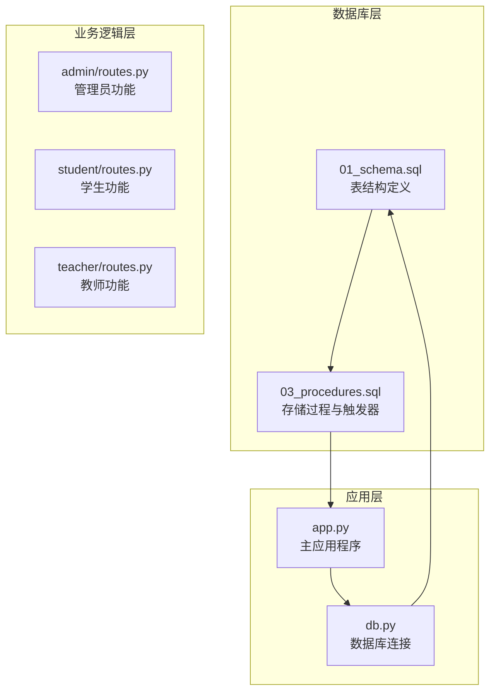
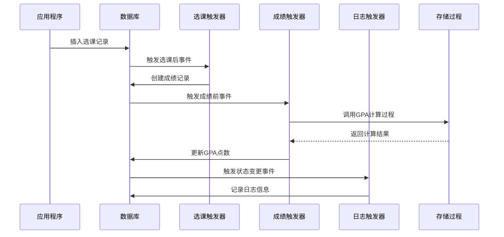
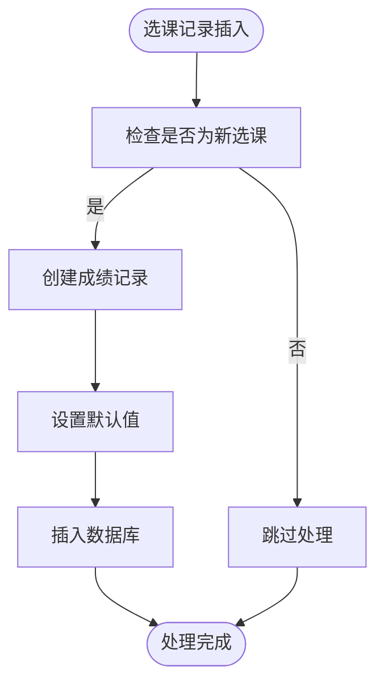
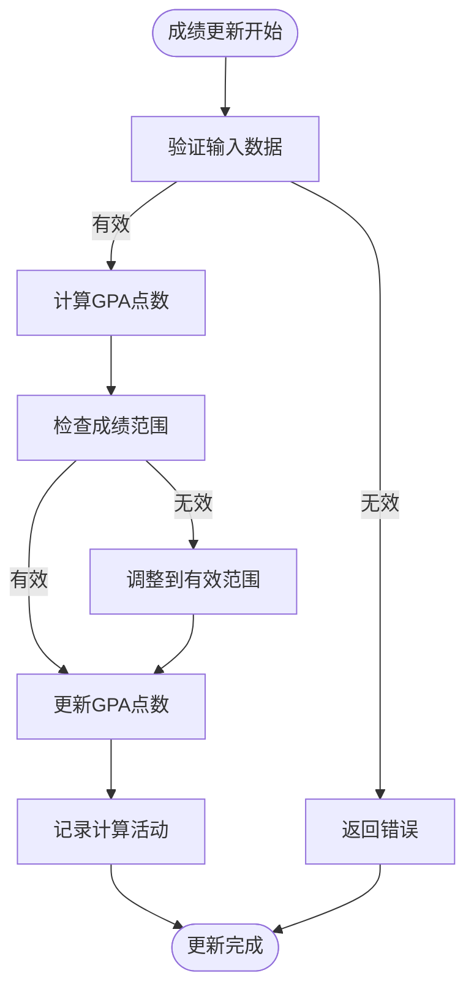
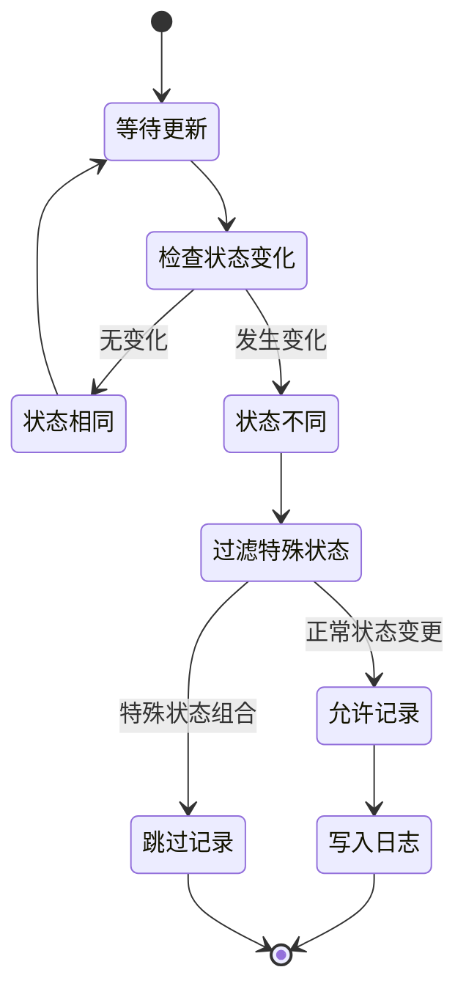
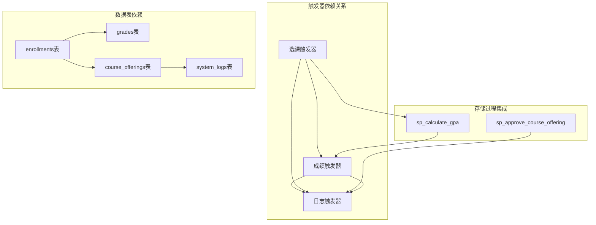

# 触发器设计

<cite>
**本文档引用的文件**
- [01_schema.sql](file://sql/01_schema.sql)
- [03_procedures.sql](file://sql/03_procedures.sql)
</cite>

## 目录
1. [引言](#引言)
2. [项目结构](#项目结构)
3. [核心组件](#核心组件)
4. [架构概览](#架构概览)
5. [详细组件分析](#详细组件分析)
6. [依赖关系分析](#依赖关系分析)
7. [性能考虑](#性能考虑)
8. [故障排除指南](#故障排除指南)
9. [结论](#结论)

## 引言

本文档详细分析学生信息管理系统的三个核心触发器设计，包括选课自动创建成绩触发器、成绩更新自动计算触发器和状态变更日志触发器。这些触发器通过数据库层面的自动化机制，确保数据一致性、完整性，并实现关键业务逻辑的自动化处理。

## 项目结构

系统采用分层架构设计，核心数据结构由SQL脚本文件定义：

**图表来源**
- [01_schema.sql:157-174](file://sql/01_schema.sql#L157-L174)
- [03_procedures.sql:326-378](file://sql/03_procedures.sql#L326-L378)

**章节来源**
- [01_schema.sql:157-174](file://sql/01_schema.sql#L157-L174)
- [03_procedures.sql:326-378](file://sql/03_procedures.sql#L326-L378)

## 核心组件

系统包含以下三个关键触发器组件：

### 1. 选课自动创建成绩触发器
- **触发时机**: AFTER INSERT ON enrollments
- **触发条件**: 新增选课记录时自动触发
- **执行逻辑**: 为新选课的学生创建对应的成绩记录
- **影响范围**: 自动化成绩初始化流程

### 2. 成绩更新自动计算触发器  
- **触发时机**: BEFORE UPDATE ON grades
- **触发条件**: 更新成绩记录前触发
- **执行逻辑**: 计算GPA点数和总评成绩
- **影响范围**: 数据完整性验证和计算自动化

### 3. 状态变更日志触发器
- **触发时机**: AFTER UPDATE ON course_offerings
- **触发条件**: 开课状态发生变化时触发
- **执行逻辑**: 记录系统操作日志
- **影响范围**: 审计追踪和状态变更监控

**章节来源**
- [03_procedures.sql:326-378](file://sql/03_procedures.sql#L326-L378)

## 架构概览

触发器系统与存储过程协同工作，形成完整的数据处理链路：

**图表来源**
- [03_procedures.sql:326-378](file://sql/03_procedures.sql#L326-L378)

## 详细组件分析

### 选课自动创建成绩触发器

#### 触发器实现机制

该触发器在选课记录插入后自动创建对应的成绩记录，确保每个选课都有相应的成绩条目。

**图表来源**
- [03_procedures.sql:326-335](file://sql/03_procedures.sql#L326-L335)

#### 业务作用
- **数据完整性**: 确保每个选课都有对应的成绩记录
- **自动化处理**: 减少手动创建成绩记录的工作量
- **业务一致性**: 统一成绩初始化流程

#### 执行逻辑
1. 检测新增的选课记录
2. 为每个新选课创建默认成绩条目
3. 设置初始状态和时间戳
4. 确保数据关联完整性

**章节来源**
- [03_procedures.sql:326-335](file://sql/03_procedures.sql#L326-L335)

### 成绩更新自动计算触发器

#### 触发器实现机制

该触发器在成绩更新前自动计算相关指标，确保数据的数学一致性和业务规则的正确性。

**图表来源**
- [03_procedures.sql:338-360](file://sql/03_procedures.sql#L338-L360)

#### 业务作用
- **数据一致性**: 确保GPA计算的准确性
- **业务规则**: 实施成绩分级标准
- **自动化计算**: 减少人工计算错误

#### 执行逻辑
1. 验证更新的数值是否在有效范围内
2. 根据总评成绩计算对应的GPA点数
3. 应用预设的分级标准
4. 更新相关统计字段

**章节来源**
- [03_procedures.sql:338-360](file://sql/03_procedures.sql#L338-L360)

### 状态变更日志触发器

#### 触发器实现机制

该触发器监控开课状态的变化，自动记录重要的系统操作信息。

**图表来源**
- [03_procedures.sql:363-378](file://sql/03_procedures.sql#L363-L378)

#### 业务作用
- **审计追踪**: 完整记录系统状态变更历史
- **合规要求**: 满足数据审计和监管要求
- **问题诊断**: 提供状态变更的完整记录

#### 执行逻辑
1. 比较新旧状态值
2. 过滤掉特定的状态组合（如从待审核到批准/拒绝）
3. 为有效的状态变更创建日志条目
4. 记录变更详情和时间戳

**章节来源**
- [03_procedures.sql:363-378](file://sql/03_procedures.sql#L363-L378)

## 依赖关系分析

触发器之间存在复杂的依赖关系，形成完整的数据处理管道：

**图表来源**
- [03_procedures.sql:242-274](file://sql/03_procedures.sql#L242-L274)
- [03_procedures.sql:326-378](file://sql/03_procedures.sql#L326-L378)

**章节来源**
- [03_procedures.sql:242-274](file://sql/03_procedures.sql#L242-L274)
- [03_procedures.sql:326-378](file://sql/03_procedures.sql#L326-L378)

## 性能考虑

### 触发器性能优化策略

1. **索引优化**: 确保触发器涉及的列有适当的索引
2. **批量处理**: 合理设计触发器以避免重复计算
3. **异常处理**: 实现健壮的错误处理机制
4. **资源管理**: 控制触发器执行的时间和资源消耗

### 性能监控指标

- 触发器执行时间
- 数据库锁等待时间
- 并发访问冲突率
- 错误处理成功率

## 故障排除指南

### 常见问题及解决方案

#### 触发器未触发
- **检查条件**: 确认触发器的触发条件是否满足
- **权限验证**: 检查用户权限和数据库权限
- **约束检查**: 验证外键约束和唯一性约束

#### 数据不一致
- **事务回滚**: 检查事务边界和回滚机制
- **并发控制**: 分析并发访问的冲突情况
- **数据验证**: 实施更强的数据验证规则

#### 性能问题
- **执行计划**: 分析触发器的执行计划
- **索引使用**: 检查相关索引的使用情况
- **资源监控**: 监控数据库资源使用情况

**章节来源**
- [03_procedures.sql:326-378](file://sql/03_procedures.sql#L326-L378)

## 结论

学生信息管理系统的触发器设计体现了现代数据库应用的最佳实践。通过精心设计的三个核心触发器，系统实现了：

1. **自动化业务逻辑**: 减少了手工干预，提高了处理效率
2. **数据一致性保障**: 通过强制约束和计算规则确保数据质量
3. **审计追踪能力**: 完整记录系统状态变更历史
4. **扩展性设计**: 为未来的业务需求提供了灵活的基础

这些触发器不仅解决了当前的业务需求，还为系统的长期发展奠定了坚实的技术基础。通过与其他存储过程的协同工作，形成了一个完整、高效、可靠的数据库处理体系。