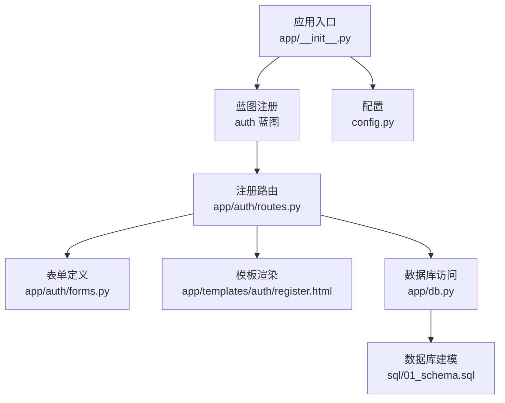
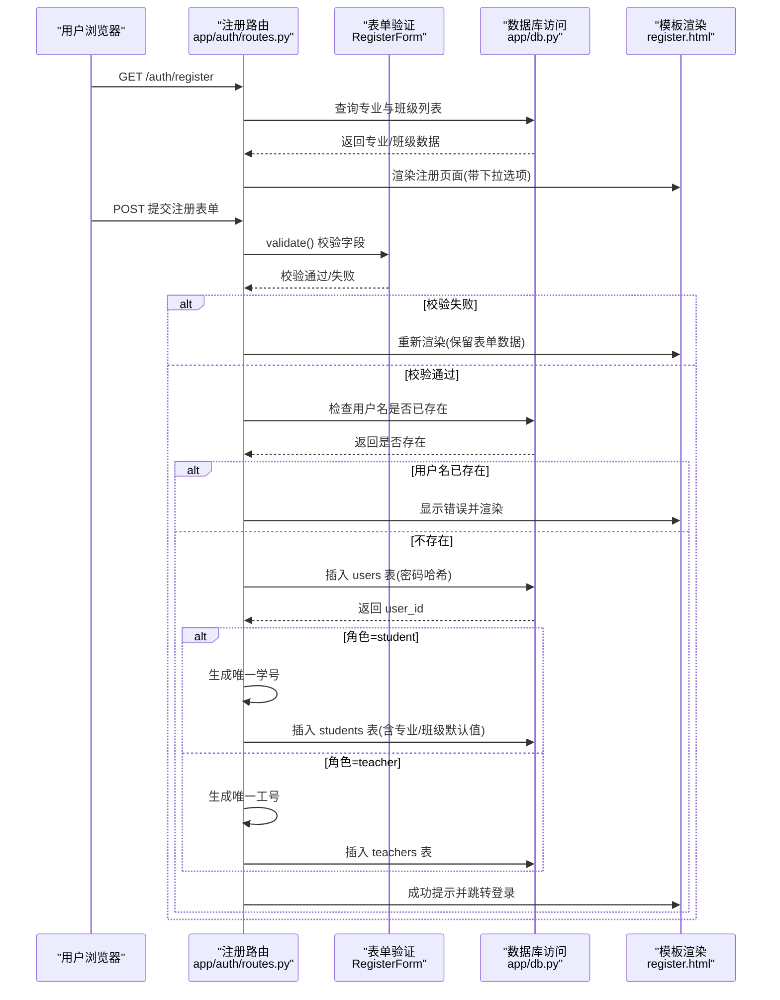
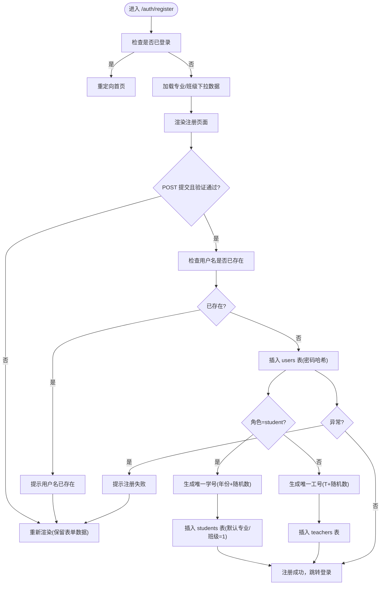
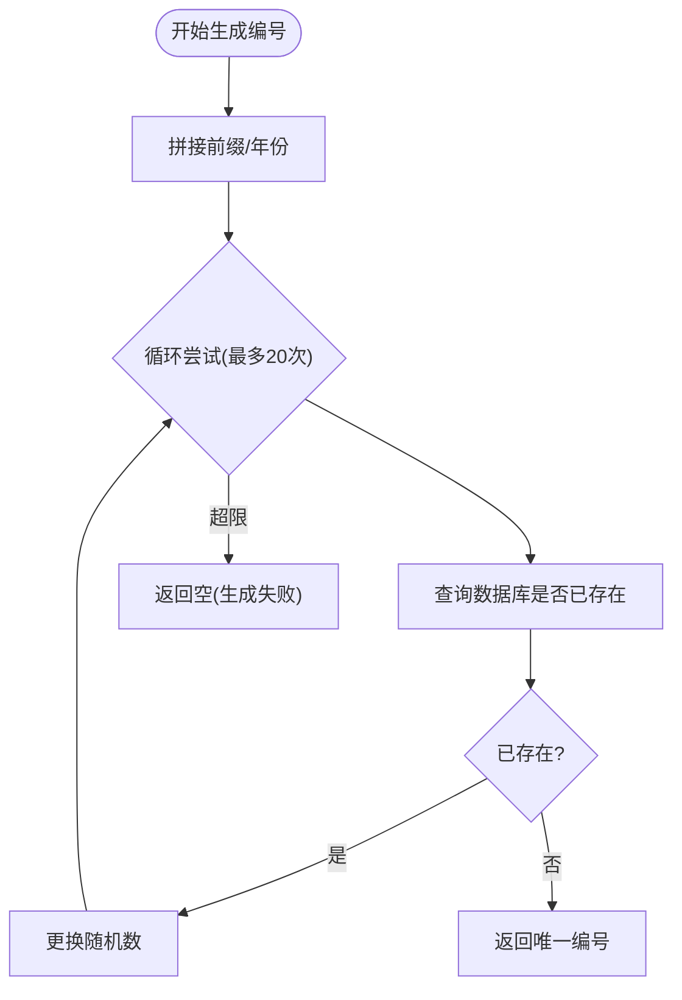
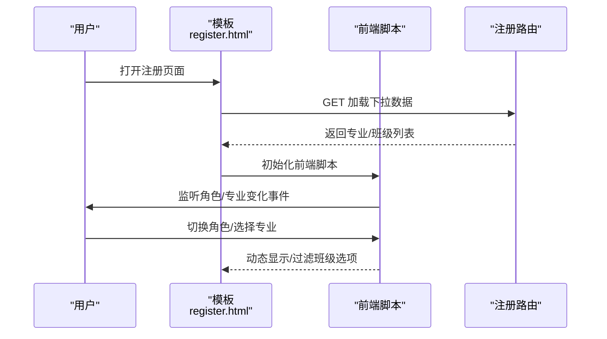
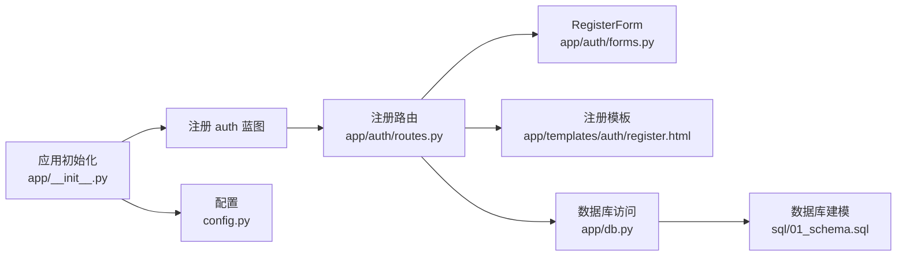
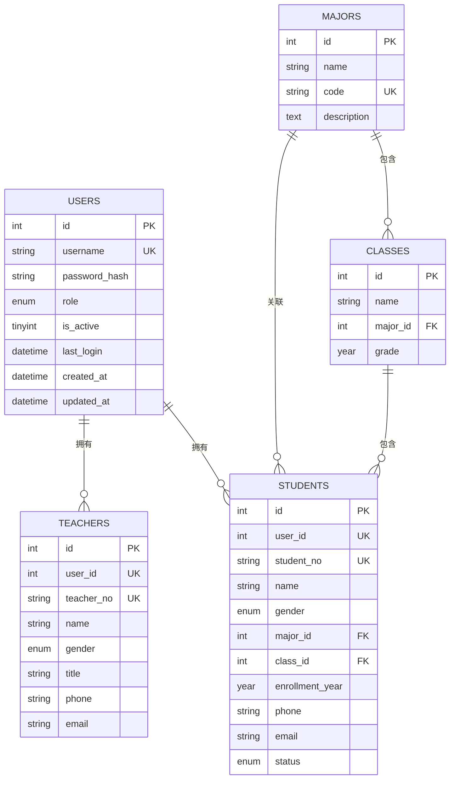

# 用户注册

<cite>
**本文引用的文件**
- [app/auth/routes.py](file://app/auth/routes.py)
- [app/auth/forms.py](file://app/auth/forms.py)
- [app/db.py](file://app/db.py)
- [app/templates/auth/register.html](file://app/templates/auth/register.html)
- [app/__init__.py](file://app/__init__.py)
- [config.py](file://config.py)
- [sql/01_schema.sql](file://sql/01_schema.sql)
</cite>

## 目录
1. [简介](#简介)
2. [项目结构](#项目结构)
3. [核心组件](#核心组件)
4. [架构总览](#架构总览)
5. [详细组件分析](#详细组件分析)
6. [依赖分析](#依赖分析)
7. [性能考量](#性能考量)
8. [故障排查指南](#故障排查指南)
9. [结论](#结论)
10. [附录](#附录)

## 简介
本技术文档围绕“用户注册”功能进行深入解析，涵盖注册路由的实现机制、RegisterForm 表单处理与数据验证、用户唯一性检查（用户名重复检测与异常处理）、不同角色（学生与教师）的注册流程差异、学号与工号的自动生成与冲突处理、用户信息的批量插入（users 表与对应角色表的数据同步）、专业与班级下拉框的数据加载与选择逻辑、完整的注册流程图与数据流向图、以及安全考虑（密码加密存储、输入验证与异常处理）。文档同时提供表单处理的代码示例路径与错误处理策略，帮助开发者快速理解与维护该功能。

## 项目结构
本项目采用 Flask 微服务风格的蓝图组织方式，注册功能位于认证模块（auth），核心文件如下：
- 路由层：app/auth/routes.py 提供注册、登录、登出、个人资料等路由
- 表单层：app/auth/forms.py 定义 RegisterForm 及 LoginForm 的字段与校验规则
- 数据访问层：app/db.py 封装数据库连接池、查询、插入、存储过程调用等
- 模板层：app/templates/auth/register.html 提供注册页面与前端交互逻辑
- 应用初始化：app/__init__.py 注册蓝图、初始化数据库连接池与登录管理
- 配置：config.py 提供数据库连接池参数与全局配置
- 数据库建模：sql/01_schema.sql 定义 users、majors、classes、students、teachers 等核心表结构与约束

图表来源
- [app/__init__.py:54-64](file://app/__init__.py#L54-L64)
- [app/auth/routes.py:58-110](file://app/auth/routes.py#L58-L110)
- [app/auth/forms.py:11-37](file://app/auth/forms.py#L11-L37)
- [app/templates/auth/register.html:1-102](file://app/templates/auth/register.html#L1-L102)
- [app/db.py:43-89](file://app/db.py#L43-L89)
- [config.py:6-36](file://config.py#L6-L36)
- [sql/01_schema.sql:15-95](file://sql/01_schema.sql#L15-L95)

章节来源
- [app/__init__.py:29-93](file://app/__init__.py#L29-L93)
- [app/auth/routes.py:58-110](file://app/auth/routes.py#L58-L110)
- [app/auth/forms.py:11-37](file://app/auth/forms.py#L11-L37)
- [app/templates/auth/register.html:1-102](file://app/templates/auth/register.html#L1-L102)
- [app/db.py:43-89](file://app/db.py#L43-L89)
- [config.py:6-36](file://config.py#L6-L36)
- [sql/01_schema.sql:15-95](file://sql/01_schema.sql#L15-L95)

## 核心组件
- 注册路由与业务逻辑：负责表单加载、验证、唯一性检查、密码加密、角色分支处理、学号/工号生成与插入、异常处理与提示反馈
- RegisterForm 表单：定义用户名、密码、确认密码、角色、姓名、性别、专业、班级、电话、邮箱等字段及其验证规则
- 数据库访问层：封装连接池、查询、插入、事务提交等通用能力
- 模板与前端交互：动态控制学生专属字段显示、专业与班级联动选择
- 应用初始化与蓝图：注册 auth 蓝图、CSRF 保护、数据库连接池与登录管理

章节来源
- [app/auth/routes.py:58-110](file://app/auth/routes.py#L58-L110)
- [app/auth/forms.py:11-37](file://app/auth/forms.py#L11-L37)
- [app/db.py:43-89](file://app/db.py#L43-L89)
- [app/templates/auth/register.html:85-101](file://app/templates/auth/register.html#L85-L101)
- [app/__init__.py:54-64](file://app/__init__.py#L54-L64)

## 架构总览
注册流程从浏览器请求进入 auth 蓝图的 /auth/register 路由，经过表单验证、唯一性检查、密码加密、角色分支处理与学号/工号生成，最终完成 users 表与对应角色表的插入。数据库访问通过统一的 db.py 工具函数完成，模板负责渲染与前端交互。

图表来源
- [app/auth/routes.py:58-110](file://app/auth/routes.py#L58-L110)
- [app/auth/forms.py:11-37](file://app/auth/forms.py#L11-L37)
- [app/db.py:43-89](file://app/db.py#L43-L89)
- [app/templates/auth/register.html:1-102](file://app/templates/auth/register.html#L1-L102)

## 详细组件分析

### 注册路由与流程控制
- 登录态拦截：若已登录则重定向首页
- 下拉框数据：加载 majors 与 classes 并注入到表单 choices
- 表单验证：POST 请求且 validate() 通过才进入业务处理
- 唯一性检查：按用户名查询 users 表，若存在则提示并回显
- 密码加密：使用 Werkzeug Security 的 generate_password_hash
- 角色分支：
  - 学生：生成唯一学号（年份前缀+随机数），自动填充入学年份；插入 students 表（专业/班级为空时使用默认值）
  - 教师：生成唯一工号（T 前缀+随机数），插入 teachers 表
- 异常处理：try-except 包裹整个注册流程，捕获异常并提示失败原因
- 成功与失败反馈：flash 信息并在失败时回显表单

图表来源
- [app/auth/routes.py:58-110](file://app/auth/routes.py#L58-L110)

章节来源
- [app/auth/routes.py:58-110](file://app/auth/routes.py#L58-L110)

### RegisterForm 表单处理与数据验证
- 字段定义：
  - 用户名：必填、长度 3-50、仅允许字母数字下划线
  - 密码：必填、长度 6-30
  - 确认密码：必填，需与密码一致
  - 角色：必选项，可选 student 或 teacher
  - 姓名：必填
  - 性别：可选 M/F
  - 专业/班级：可选，用于学生
  - 电话/邮箱：可选，长度限制
- 验证策略：基于 WTForms 的 DataRequired、Length、EqualTo、Regexp、Optional 等验证器，确保输入合法性与一致性

章节来源
- [app/auth/forms.py:11-37](file://app/auth/forms.py#L11-L37)

### 用户唯一性检查与异常处理
- 唯一性检查：以用户名为条件查询 users 表，若存在则提示“用户名已存在”
- 异常处理：注册流程包裹在 try-except 中，捕获数据库异常并提示“注册失败：...”
- 前端反馈：通过 flash 传递消息，模板渲染时展示

章节来源
- [app/auth/routes.py:70-75](file://app/auth/routes.py#L70-L75)
- [app/auth/routes.py:107-109](file://app/auth/routes.py#L107-L109)

### 不同角色用户的注册流程差异
- 学生分支：
  - 自动填充入学年份（当前年份）
  - 专业/班级为空时使用默认值（1）
  - 插入 students 表
- 教师分支：
  - 插入 teachers 表
- 共同点：均先插入 users 表，再根据角色插入对应角色表

章节来源
- [app/auth/routes.py:82-103](file://app/auth/routes.py#L82-L103)

### 学号与工号的自动生成机制
- 学号生成：
  - 规则：当前年份 + 6 位随机数（100000-999999）
  - 冲突处理：最多尝试 20 次，若仍冲突则提示“学号生成失败，请稍后重试”
- 工号生成：
  - 规则：T 前缀 + 5 位随机数（10000-99999）
  - 冲突处理：最多尝试 20 次，若仍冲突则提示“工号生成失败，请稍后重试”

图表来源
- [app/auth/routes.py:13-19](file://app/auth/routes.py#L13-L19)
- [app/auth/routes.py:22-27](file://app/auth/routes.py#L22-L27)

章节来源
- [app/auth/routes.py:13-27](file://app/auth/routes.py#L13-L27)

### 用户信息的批量插入与数据同步
- users 表：插入 username、password_hash、role
- 角色表同步：
  - 学生：插入 students 表，关联 user_id，自动填充 enrollment_year，专业/班级为空时使用默认值
  - 教师：插入 teachers 表，关联 user_id
- 数据一致性：通过同一事务内的插入顺序保证外键关系完整

章节来源
- [app/auth/routes.py:77-103](file://app/auth/routes.py#L77-L103)
- [sql/01_schema.sql:55-95](file://sql/01_schema.sql#L55-L95)

### 专业与班级下拉框的数据加载与选择逻辑
- 后端加载：注册路由加载 majors 与 classes 列表，并设置到表单 choices
- 前端联动：
  - 角色切换：当选择“学生”时显示专业/班级字段；否则隐藏
  - 专业变更：仅显示与所选专业匹配的班级选项，并清空班级选择
- 默认值：若表单回显失败或未选择，students 表插入时使用默认值（1）

图表来源
- [app/auth/routes.py:64-68](file://app/auth/routes.py#L64-L68)
- [app/templates/auth/register.html:85-101](file://app/templates/auth/register.html#L85-L101)

章节来源
- [app/auth/routes.py:64-68](file://app/auth/routes.py#L64-L68)
- [app/templates/auth/register.html:85-101](file://app/templates/auth/register.html#L85-L101)

### 安全考虑
- 密码加密存储：使用 Werkzeug Security 的 generate_password_hash 对明文密码进行哈希存储
- 输入验证：RegisterForm 使用多种验证器确保字段格式与长度合规
- CSRF 保护：应用启用 CSRFProtect，注册表单包含 CSRF 字段
- 登录态与权限：注册路由对已登录用户进行拦截，避免重复注册
- 异常处理：注册流程包裹在 try-except 中，防止异常泄露细节

章节来源
- [app/auth/routes.py:77-79](file://app/auth/routes.py#L77-L79)
- [app/auth/forms.py:11-37](file://app/auth/forms.py#L11-L37)
- [app/__init__.py:7](file://app/__init__.py#L7)
- [app/templates/auth/register.html:10](file://app/templates/auth/register.html#L10)
- [app/auth/routes.py:107-109](file://app/auth/routes.py#L107-L109)

### 表单处理的代码示例与错误处理策略
- 表单处理示例路径：
  - 注册路由与业务逻辑：[app/auth/routes.py:58-110](file://app/auth/routes.py#L58-L110)
  - RegisterForm 定义与验证：[app/auth/forms.py:11-37](file://app/auth/forms.py#L11-L37)
  - 模板渲染与前端联动：[app/templates/auth/register.html:1-102](file://app/templates/auth/register.html#L1-L102)
- 错误处理策略：
  - 唯一性冲突：提示“用户名已存在”，保留表单数据
  - 编号生成失败：提示“学号/工号生成失败，请稍后重试”
  - 注册异常：捕获异常并提示“注册失败：...”，保留表单数据以便修正

章节来源
- [app/auth/routes.py:70-75](file://app/auth/routes.py#L70-L75)
- [app/auth/routes.py:82-103](file://app/auth/routes.py#L82-L103)
- [app/auth/routes.py:107-109](file://app/auth/routes.py#L107-L109)

## 依赖分析
- 蓝图与路由：auth 蓝图在应用初始化时注册，注册路由位于 auth 蓝图下
- 表单与模板：RegisterForm 在注册路由中实例化并渲染模板
- 数据库访问：统一通过 db.py 的 query/execute/insert 封装
- 配置：数据库连接池参数来自 config.py

图表来源
- [app/__init__.py:54-64](file://app/__init__.py#L54-L64)
- [app/auth/routes.py:58-110](file://app/auth/routes.py#L58-L110)
- [app/auth/forms.py:11-37](file://app/auth/forms.py#L11-L37)
- [app/templates/auth/register.html:1-102](file://app/templates/auth/register.html#L1-L102)
- [app/db.py:43-89](file://app/db.py#L43-L89)
- [config.py:6-36](file://config.py#L6-L36)
- [sql/01_schema.sql:15-95](file://sql/01_schema.sql#L15-L95)

章节来源
- [app/__init__.py:54-64](file://app/__init__.py#L54-L64)
- [app/auth/routes.py:58-110](file://app/auth/routes.py#L58-L110)
- [app/db.py:43-89](file://app/db.py#L43-L89)
- [config.py:6-36](file://config.py#L6-L36)
- [sql/01_schema.sql:15-95](file://sql/01_schema.sql#L15-L95)

## 性能考量
- 连接池：通过 PooledDB 提供连接池，减少频繁建立/断开连接的开销
- 查询优化：下拉框数据一次性加载，避免重复查询
- 唯一性检查：基于唯一索引的快速查找
- 事务与提交：插入操作在单次请求内完成，减少跨请求的复杂度

章节来源
- [app/db.py:10-26](file://app/db.py#L10-L26)
- [app/db.py:43-89](file://app/db.py#L43-L89)
- [sql/01_schema.sql:24](file://sql/01_schema.sql#L24)

## 故障排查指南
- 用户名已存在：检查 users 表唯一约束与注册逻辑
- 编号生成失败：检查学号/工号生成函数与数据库唯一约束
- 注册异常：查看异常捕获与 flash 提示，结合数据库日志定位问题
- 下拉框无数据：确认注册路由是否正确加载并注入 choices
- CSRF 校验失败：确认模板中包含 CSRF 字段且应用启用了 CSRFProtect

章节来源
- [app/auth/routes.py:70-75](file://app/auth/routes.py#L70-L75)
- [app/auth/routes.py:82-103](file://app/auth/routes.py#L82-L103)
- [app/auth/routes.py:107-109](file://app/auth/routes.py#L107-L109)
- [app/templates/auth/register.html:10](file://app/templates/auth/register.html#L10)
- [app/__init__.py:7](file://app/__init__.py#L7)

## 结论
用户注册功能通过清晰的路由与表单验证、严格的唯一性检查与密码加密、针对不同角色的差异化处理以及完善的异常处理机制，实现了稳定可靠的用户创建流程。配合前端联动与统一的数据库访问层，整体具备良好的可维护性与扩展性。建议在生产环境中进一步强化日志审计与并发冲突处理，确保高并发场景下的数据一致性与用户体验。

## 附录
- 数据模型概览（users、majors、classes、students、teachers）
  

图表来源
- [sql/01_schema.sql:15-95](file://sql/01_schema.sql#L15-L95)