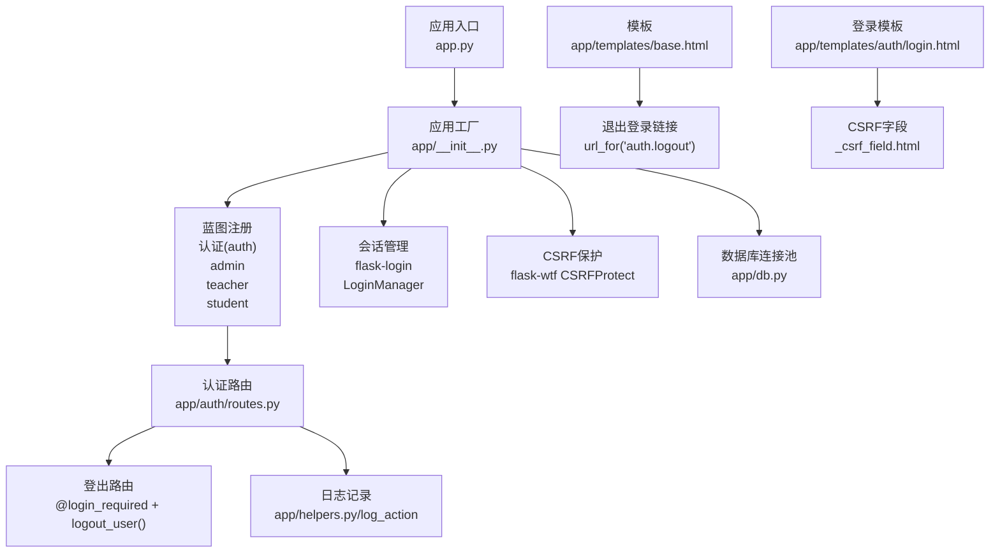
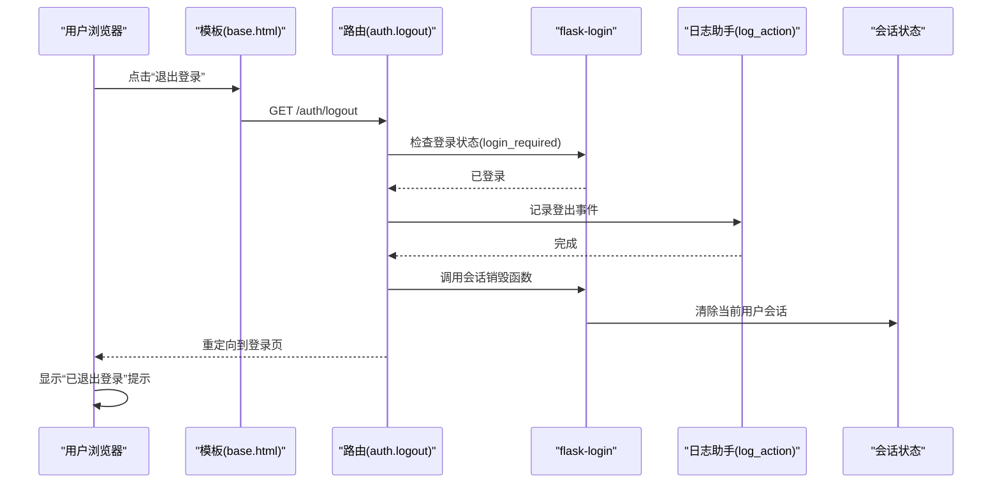
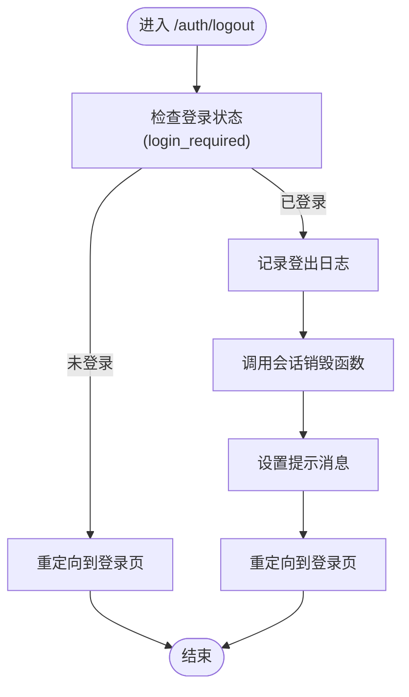
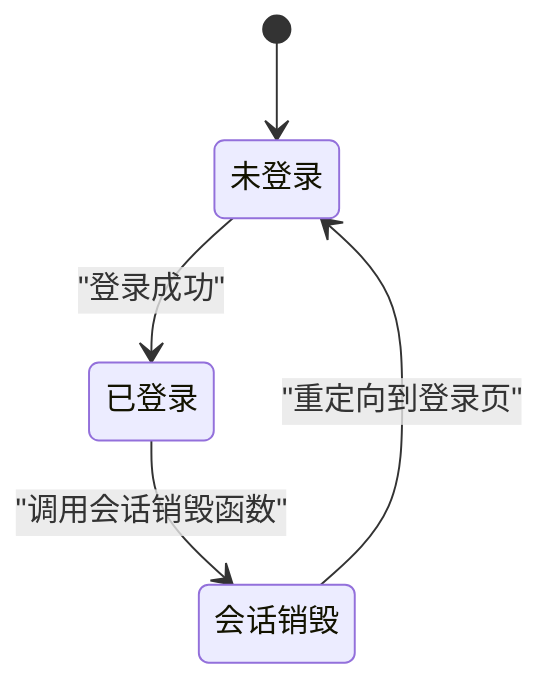
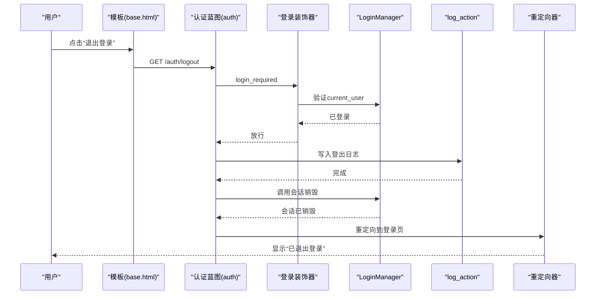
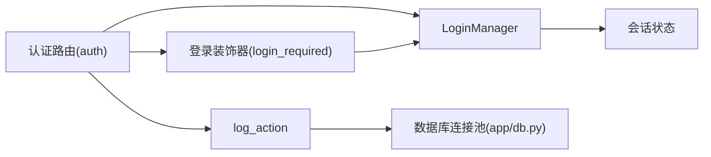

# 用户登出

<cite>
**本文引用的文件**
- [app/__init__.py](file://app/__init__.py)
- [app/decorators.py](file://app/decorators.py)
- [app/auth/routes.py](file://app/auth/routes.py)
- [app/db.py](file://app/db.py)
- [app/helpers.py](file://app/helpers.py)
- [app/templates/base.html](file://app/templates/base.html)
- [app/templates/auth/login.html](file://app/templates/auth/login.html)
- [config.py](file://config.py)
- [app.py](file://app.py)
</cite>

## 目录
1. [简介](#简介)
2. [项目结构](#项目结构)
3. [核心组件](#核心组件)
4. [架构总览](#架构总览)
5. [详细组件分析](#详细组件分析)
6. [依赖分析](#依赖分析)
7. [性能考量](#性能考量)
8. [故障排查指南](#故障排查指南)
9. [结论](#结论)
10. [附录](#附录)

## 简介
本文件围绕“用户登出”功能进行深入技术文档化，涵盖：
- 登出路由的实现机制与控制流
- 登录装饰器与会话销毁流程
- 会话状态变化与重定向逻辑
- 安全考虑与最佳实践
- 流程图与状态图
- 代码示例路径与集成指南

## 项目结构
本项目采用Flask蓝图组织，认证与登出集中在认证蓝图中，全局会话管理由flask-login负责，CSRF保护由flask-wtf提供。

图表来源
- [app.py:1-13](file://app.py#L1-L13)
- [app/__init__.py:29-92](file://app/__init__.py#L29-L92)
- [app/auth/routes.py:120-126](file://app/auth/routes.py#L120-L126)
- [app/helpers.py:9-21](file://app/helpers.py#L9-L21)
- [app/templates/base.html:59](file://app/templates/base.html#L59)
- [app/templates/auth/login.html:12](file://app/templates/auth/login.html#L12)

章节来源
- [app.py:1-13](file://app.py#L1-L13)
- [app/__init__.py:29-92](file://app/__init__.py#L29-L92)
- [app/auth/routes.py:120-126](file://app/auth/routes.py#L120-L126)

## 核心组件
- 登出路由与装饰器
  - 登出路由位于认证蓝图，使用登录装饰器保护，确保只有已登录用户可访问。
  - 登出时调用会话销毁函数，记录日志，设置提示消息，并重定向到登录页。
- 会话管理
  - 应用初始化时配置flask-login的LoginManager，设置登录视图与消息。
  - 会话状态由flask-login维护，登出即清除当前用户会话。
- CSRF保护
  - 应用启用CSRF保护，登出请求需携带CSRF令牌。
- 日志与审计
  - 登出前后记录系统日志，便于审计追踪。

章节来源
- [app/auth/routes.py:120-126](file://app/auth/routes.py#L120-L126)
- [app/__init__.py:40-51](file://app/__init__.py#L40-L51)
- [app/helpers.py:9-21](file://app/helpers.py#L9-L21)
- [config.py:7-8](file://config.py#L7-L8)

## 架构总览
下图展示从用户点击“退出登录”到会话销毁与页面跳转的整体流程。

图表来源
- [app/templates/base.html:59](file://app/templates/base.html#L59)
- [app/auth/routes.py:120-126](file://app/auth/routes.py#L120-L126)
- [app/helpers.py:9-21](file://app/helpers.py#L9-L21)

## 详细组件分析

### 登出路由与装饰器
- 路由定义
  - 路由位于认证蓝图，URL为/auth/logout，方法为GET。
  - 使用登录装饰器保护，未登录用户会被重定向到登录页。
- 处理流程
  - 记录登出日志。
  - 调用会话销毁函数，清除当前用户会话。
  - 设置提示消息“已退出登录”。
  - 重定向到登录页。

图表来源
- [app/auth/routes.py:120-126](file://app/auth/routes.py#L120-L126)
- [app/helpers.py:9-21](file://app/helpers.py#L9-L21)

章节来源
- [app/auth/routes.py:120-126](file://app/auth/routes.py#L120-L126)
- [app/decorators.py:7-10](file://app/decorators.py#L7-L10)

### 会话销毁与状态变化
- 登录状态
  - 当用户成功登录后，会话中保存当前用户标识，current_user可用。
- 登出流程
  - 登出时调用会话销毁函数，当前用户会话被清除。
  - 之后current_user不再代表任何用户，后续访问受保护路由将被重定向到登录页。
- 会话状态变化图

图表来源
- [app/auth/routes.py:120-126](file://app/auth/routes.py#L120-L126)
- [app/__init__.py:40-51](file://app/__init__.py#L40-L51)

章节来源
- [app/auth/routes.py:120-126](file://app/auth/routes.py#L120-L126)
- [app/__init__.py:40-51](file://app/__init__.py#L40-L51)

### 登出后的页面重定向与提示
- 重定向逻辑
  - 登出成功后，应用重定向到认证蓝图的登录页。
- 提示信息
  - 登出时设置提示消息类别为信息类，用于向用户反馈“已退出登录”。

章节来源
- [app/auth/routes.py:120-126](file://app/auth/routes.py#L120-L126)

### 登出安全考虑
- CSRF保护
  - 应用启用CSRF保护，登出请求需要携带CSRF令牌，防止跨站请求伪造。
- 会话固定攻击防护
  - 登出时会话被销毁，避免会话固定攻击风险。
- 敏感数据清理
  - 登出后，当前用户上下文中的敏感数据不再可用，后续访问受保护资源需重新认证。

章节来源
- [config.py:7-8](file://config.py#L7-L8)
- [app/auth/routes.py:120-126](file://app/auth/routes.py#L120-L126)

### 登出流程图（代码级）

图表来源
- [app/templates/base.html:59](file://app/templates/base.html#L59)
- [app/auth/routes.py:120-126](file://app/auth/routes.py#L120-L126)
- [app/helpers.py:9-21](file://app/helpers.py#L9-L21)
- [app/__init__.py:40-51](file://app/__init__.py#L40-L51)

### 最佳实践
- 登出确认
  - 在模板中提供明确的登出链接，建议在用户界面显眼位置展示。
- 自动登出机制
  - 可结合会话超时策略与前端定时器，在长时间无操作时触发登出。
- 安全会话管理
  - 启用CSRF保护，确保所有表单提交包含CSRF令牌。
  - 登出后清理浏览器缓存与Cookie，避免会话残留。

章节来源
- [app/templates/base.html:59](file://app/templates/base.html#L59)
- [config.py:7-8](file://config.py#L7-L8)

## 依赖分析
- 组件耦合
  - 登出路由依赖登录装饰器与flask-login会话管理。
  - 登出流程依赖日志助手进行审计记录。
- 外部依赖
  - flask-login：会话管理与用户加载。
  - flask-wtf：CSRF保护。
  - 数据库连接池：提供统一的数据库访问能力。

图表来源
- [app/auth/routes.py:120-126](file://app/auth/routes.py#L120-L126)
- [app/decorators.py:7-10](file://app/decorators.py#L7-L10)
- [app/helpers.py:9-21](file://app/helpers.py#L9-L21)
- [app/db.py:10-41](file://app/db.py#L10-L41)

章节来源
- [app/auth/routes.py:120-126](file://app/auth/routes.py#L120-L126)
- [app/decorators.py:7-10](file://app/decorators.py#L7-L10)
- [app/helpers.py:9-21](file://app/helpers.py#L9-L21)
- [app/db.py:10-41](file://app/db.py#L10-L41)

## 性能考量
- 登出操作为轻量级处理，主要涉及会话销毁与重定向，性能开销极低。
- 若系统中存在大量并发登出请求，建议关注会话存储与数据库连接池的容量配置。

## 故障排查指南
- 无法登出
  - 检查是否启用了CSRF保护，确保请求包含CSRF令牌。
  - 确认登录装饰器是否正确应用到登出路由。
- 登出后仍可访问受保护页面
  - 检查会话销毁是否正常执行，确认LoginManager配置正确。
- 登出日志缺失
  - 检查日志助手是否正确调用，确认数据库连接池可用。

章节来源
- [config.py:7-8](file://config.py#L7-L8)
- [app/auth/routes.py:120-126](file://app/auth/routes.py#L120-L126)
- [app/helpers.py:9-21](file://app/helpers.py#L9-L21)
- [app/db.py:10-41](file://app/db.py#L10-L41)

## 结论
用户登出功能通过登录装饰器与flask-login会话管理实现，结合CSRF保护与日志记录，确保了安全性与可追溯性。登出流程简洁高效，重定向到登录页并提示用户，符合用户体验与安全最佳实践。

## 附录
- 代码示例路径
  - 登出路由定义：[app/auth/routes.py:120-126](file://app/auth/routes.py#L120-L126)
  - 登录装饰器实现：[app/decorators.py:7-10](file://app/decorators.py#L7-L10)
  - 登出日志记录：[app/helpers.py:9-21](file://app/helpers.py#L9-L21)
  - CSRF保护配置：[config.py:7-8](file://config.py#L7-L8)
  - 会话管理初始化：[app/__init__.py:40-51](file://app/__init__.py#L40-L51)
  - 登录页模板（含CSRF字段）：[app/templates/auth/login.html:12](file://app/templates/auth/login.html#L12)
  - 退出登录链接模板：[app/templates/base.html:59](file://app/templates/base.html#L59)