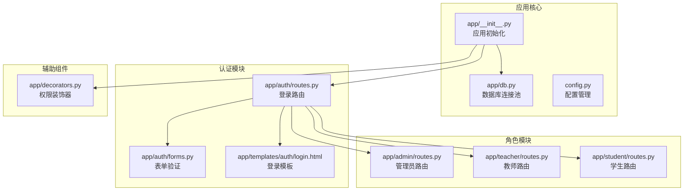
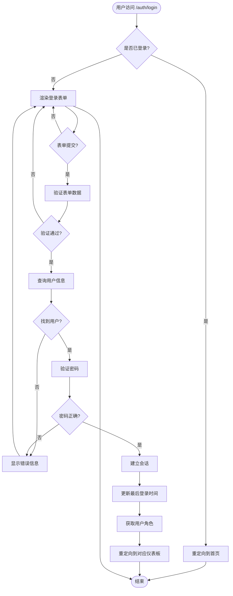
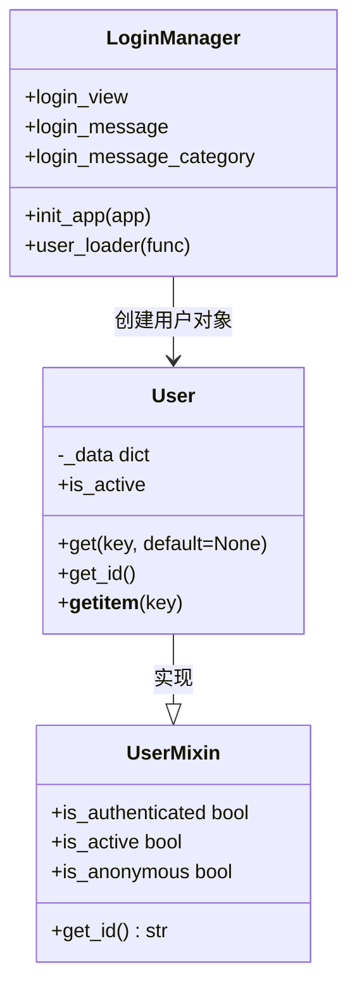
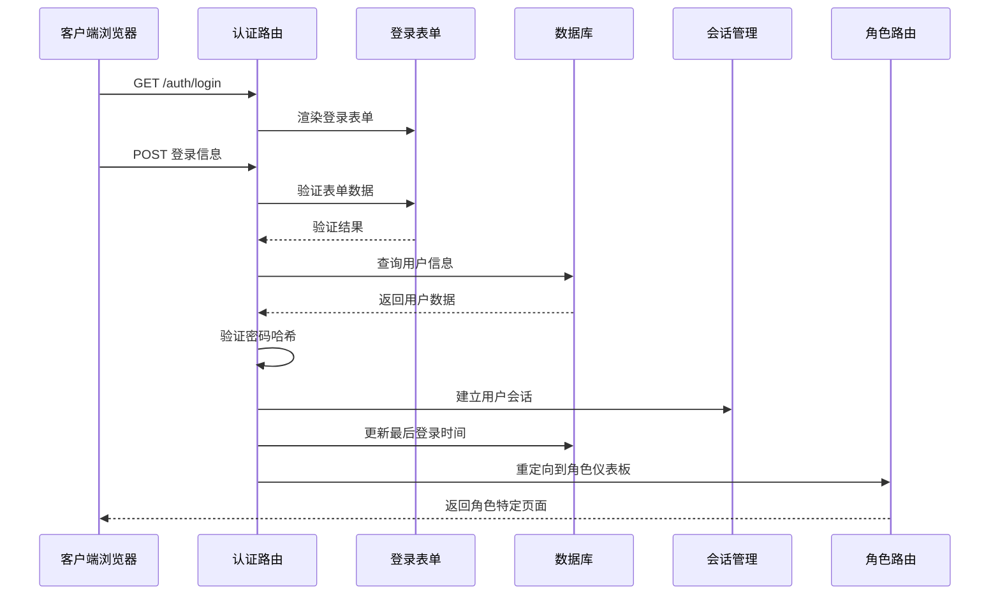
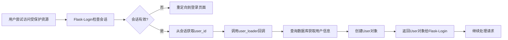
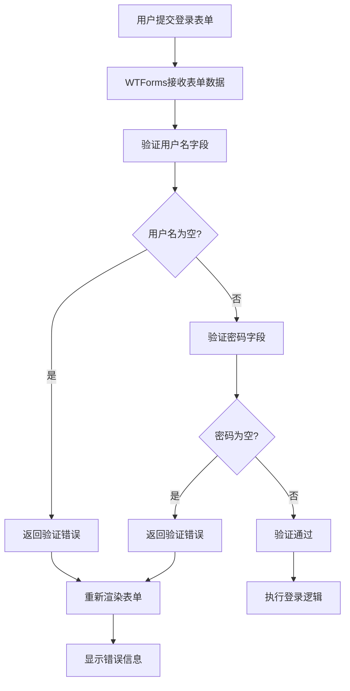
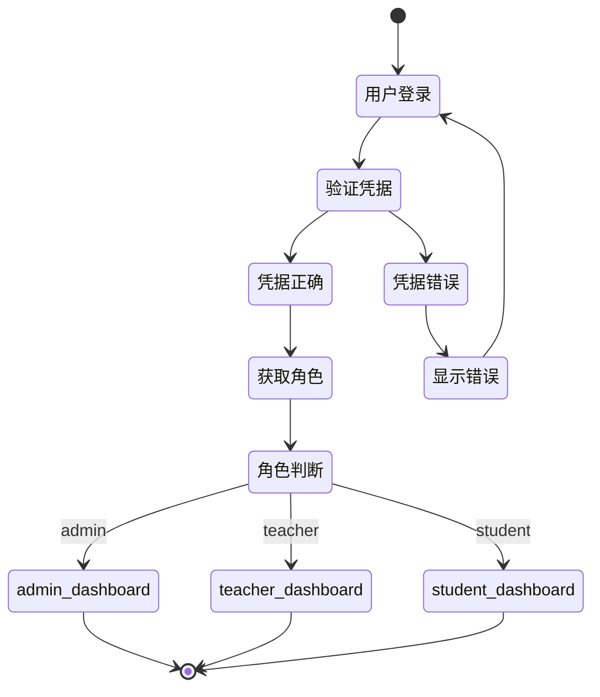
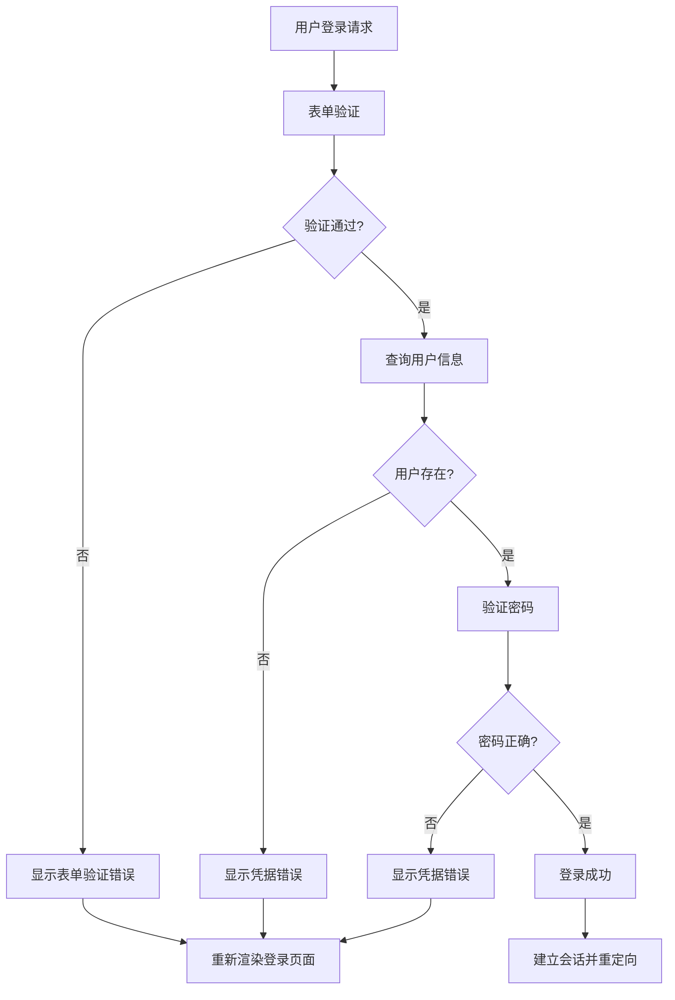
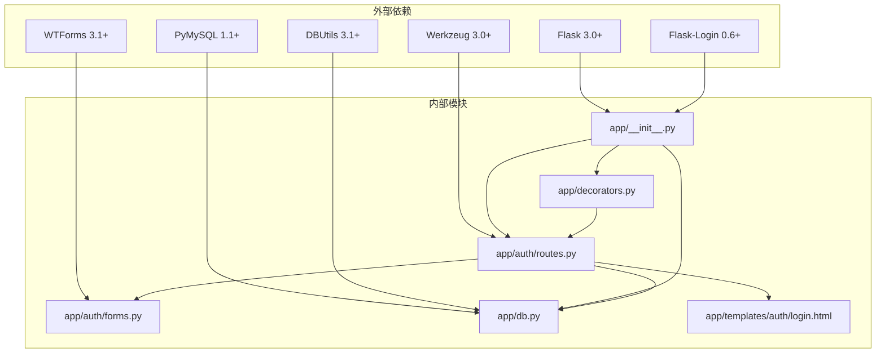

# 用户登录

<cite>
**本文档引用的文件**
- [app/auth/routes.py](file://app/auth/routes.py)
- [app/auth/forms.py](file://app/auth/forms.py)
- [app/__init__.py](file://app/__init__.py)
- [app/db.py](file://app/db.py)
- [app/templates/auth/login.html](file://app/templates/auth/login.html)
- [app/student/routes.py](file://app/student/routes.py)
- [app/teacher/routes.py](file://app/teacher/routes.py)
- [app/admin/routes.py](file://app/admin/routes.py)
- [app/decorators.py](file://app/decorators.py)
- [config.py](file://config.py)
</cite>

## 目录
1. [简介](#简介)
2. [项目结构](#项目结构)
3. [核心组件](#核心组件)
4. [架构概览](#架构概览)
5. [详细组件分析](#详细组件分析)
6. [依赖关系分析](#依赖关系分析)
7. [性能考虑](#性能考虑)
8. [故障排除指南](#故障排除指南)
9. [结论](#结论)

## 简介

本文件详细阐述了MIS教务管理系统的用户登录功能实现。系统采用Flask框架构建，集成了Flask-Login进行用户会话管理，使用Werkzeug的安全库进行密码哈希处理，并通过MySQL数据库存储用户凭证。登录功能支持三种角色：管理员(admin)、教师(teacher)和学生(student)，每个角色都有独立的仪表板页面。

## 项目结构

系统采用模块化设计，登录相关的组件分布在多个文件中：

**图表来源**
- [app/__init__.py:29-92](file://app/__init__.py#L29-L92)
- [app/auth/routes.py:29-56](file://app/auth/routes.py#L29-L56)
- [app/db.py:10-121](file://app/db.py#L10-L121)

**章节来源**
- [app/__init__.py:1-93](file://app/__init__.py#L1-L93)
- [app/auth/routes.py:1-167](file://app/auth/routes.py#L1-L167)
- [app/db.py:1-121](file://app/db.py#L1-L121)

## 核心组件

### 登录路由处理器

登录路由位于`app/auth/routes.py`文件中，处理用户登录请求的核心逻辑：

**图表来源**
- [app/auth/routes.py:32-55](file://app/auth/routes.py#L32-L55)

### 表单验证系统

登录表单使用WTForms库进行客户端和服务端双重验证：

| 字段 | 验证器 | 验证规则 | 错误消息 |
|------|--------|----------|----------|
| 用户名 | DataRequired | 必填字段 | 请输入用户名 |
| 密码 | DataRequired | 必填字段 | 请输入密码 |

**章节来源**
- [app/auth/forms.py:6-8](file://app/auth/forms.py#L6-L8)

### Flask-Login集成

系统通过自定义User类实现Flask-Login接口：

**图表来源**
- [app/__init__.py:10-27](file://app/__init__.py#L10-L27)
- [app/__init__.py:47-51](file://app/__init__.py#L47-L51)

**章节来源**
- [app/__init__.py:10-51](file://app/__init__.py#L10-L51)

## 架构概览

系统采用分层架构设计，登录流程涉及多个组件的协作：

**图表来源**
- [app/auth/routes.py:32-55](file://app/auth/routes.py#L32-L55)
- [app/__init__.py:47-51](file://app/__init__.py#L47-L51)

## 详细组件分析

### 登录流程实现

登录功能的核心实现位于`app/auth/routes.py`文件的login函数中：

#### 用户加载过程

Flask-Login通过user_loader回调函数实现用户加载：

**图表来源**
- [app/__init__.py:47-51](file://app/__init__.py#L47-L51)

#### 凭据验证流程

密码验证采用Werkzeug的安全哈希算法：

| 步骤 | 操作 | 安全性考虑 |
|------|------|------------|
| 1 | 查询用户信息 | 使用参数化查询防止SQL注入 |
| 2 | 检查用户激活状态 | 确保只有活跃用户可以登录 |
| 3 | 验证密码哈希 | 使用check_password_hash进行安全比较 |
| 4 | 建立会话 | 使用login_user建立持久会话 |
| 5 | 更新登录时间 | 记录用户最后登录时间 |

**章节来源**
- [app/auth/routes.py:38-51](file://app/auth/routes.py#L38-L51)

### 表单验证逻辑

登录表单使用WTForms进行严格的客户端和服务端验证：

#### 登录表单验证规则

**图表来源**
- [app/auth/forms.py:6-8](file://app/auth/forms.py#L6-L8)

#### 注册表单验证规则

注册表单具有更严格的验证规则：

| 字段 | 验证规则 | 最小长度 | 最大长度 | 特殊要求 |
|------|----------|----------|----------|----------|
| 用户名 | 字母数字下划线 | 3 | 50 | 只能包含字母、数字和下划线 |
| 密码 | 任意字符 | 6 | 30 | 至少6位 |
| 确认密码 | 匹配验证 | - | - | 必须与密码一致 |
| 角色 | 选择验证 | - | - | 必须选择学生或教师 |

**章节来源**
- [app/auth/forms.py:11-36](file://app/auth/forms.py#L11-L36)

### 角色判断和重定向逻辑

系统支持三种用户角色，每种角色都有独立的仪表板：

**图表来源**
- [app/auth/routes.py:50-51](file://app/auth/routes.py#L50-L51)

#### 角色路由映射

| 角色 | 路由前缀 | 仪表板URL | 权限装饰器 |
|------|----------|-----------|------------|
| admin | /admin | /admin/ | @role_required('admin') |
| teacher | /teacher | /teacher/ | @role_required('teacher') |
| student | /student | /student/ | @role_required('student') |

**章节来源**
- [app/admin/routes.py:13-17](file://app/admin/routes.py#L13-L17)
- [app/teacher/routes.py:10-14](file://app/teacher/routes.py#L10-L14)
- [app/student/routes.py:10-14](file://app/student/routes.py#L10-L14)

### 登录失败错误处理

系统提供了完善的错误处理机制：

**图表来源**
- [app/auth/routes.py:52-53](file://app/auth/routes.py#L52-L53)

**章节来源**
- [app/auth/routes.py:52-55](file://app/auth/routes.py#L52-L55)

## 依赖关系分析

系统各组件之间的依赖关系如下：

**图表来源**
- [requirements.txt:1-7](file://requirements.txt#L1-L7)
- [app/__init__.py:29-92](file://app/__init__.py#L29-L92)

### 组件耦合度分析

| 组件 | 主要依赖 | 内聚性 | 耦合度 | 复杂度 |
|------|----------|--------|--------|--------|
| app/auth/routes.py | Flask-Login, Werkzeug, DB工具 | 高 | 低 | 中等 |
| app/auth/forms.py | WTForms | 高 | 低 | 低 |
| app/__init__.py | Flask-Login, DB连接池 | 中等 | 中等 | 中等 |
| app/db.py | PyMySQL, DBUtils | 高 | 低 | 中等 |
| app/decorators.py | Flask-Login | 高 | 低 | 低 |

**章节来源**
- [requirements.txt:1-7](file://requirements.txt#L1-L7)
- [app/auth/routes.py:1-10](file://app/auth/routes.py#L1-L10)

## 性能考虑

### 数据库查询优化

系统采用了多种数据库查询优化策略：

1. **参数化查询**：所有数据库操作都使用参数化查询，防止SQL注入并提高查询缓存效率
2. **索引利用**：用户表的username字段应该建立索引以加速登录查询
3. **连接池管理**：使用DBUtils连接池减少数据库连接开销

### 会话管理优化

1. **会话持久化**：使用remember参数实现长期会话管理
2. **会话超时**：Flask-Login默认会话管理机制
3. **内存使用**：User对象只存储必要的用户信息

### 缓存策略

建议实施以下缓存策略：
- 用户信息缓存（短期）
- 角色权限缓存
- 频繁访问的配置信息缓存

## 故障排除指南

### 常见登录问题

| 问题类型 | 可能原因 | 解决方案 |
|----------|----------|----------|
| 登录失败 | 用户名或密码错误 | 检查凭据，确认用户状态为激活 |
| 会话问题 | 会话过期或被清除 | 检查浏览器Cookie设置 |
| 权限错误 | 角色不匹配 | 确认用户角色配置正确 |
| 数据库连接 | 连接池耗尽 | 检查数据库连接配置 |

### 调试技巧

1. **启用调试模式**：设置FLASK_DEBUG环境变量为1
2. **查看日志**：检查应用日志中的错误信息
3. **数据库查询**：验证用户表结构和数据完整性
4. **会话状态**：检查Flask-Login会话状态

**章节来源**
- [app/__init__.py:77-90](file://app/__init__.py#L77-L90)

## 结论

MIS系统的用户登录功能实现了完整的身份验证和授权机制。系统采用现代Web开发最佳实践，包括：

1. **安全性**：使用Werkzeug密码哈希、CSRF保护和参数化查询
2. **可扩展性**：模块化设计支持多角色扩展
3. **用户体验**：清晰的错误提示和友好的界面
4. **维护性**：清晰的代码结构和完善的注释

该登录系统为整个教务管理系统的安全运行奠定了坚实基础，支持管理员、教师和学生的差异化需求。