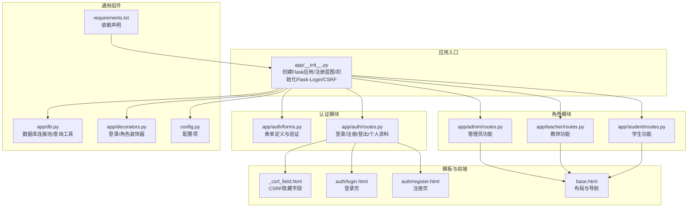
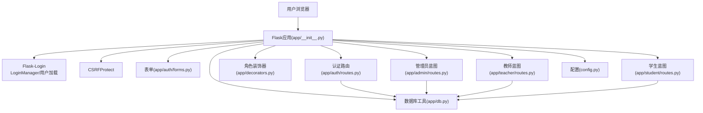
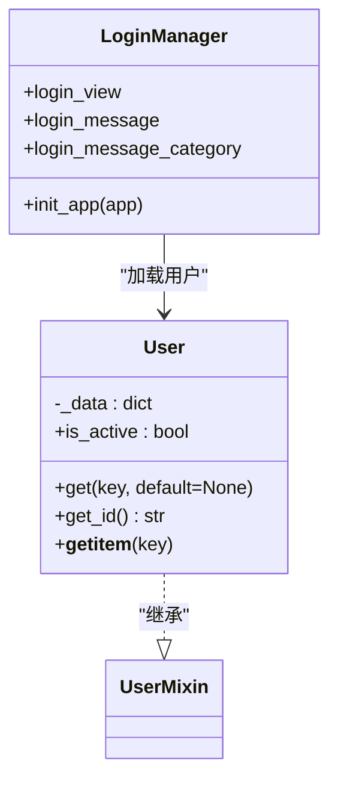
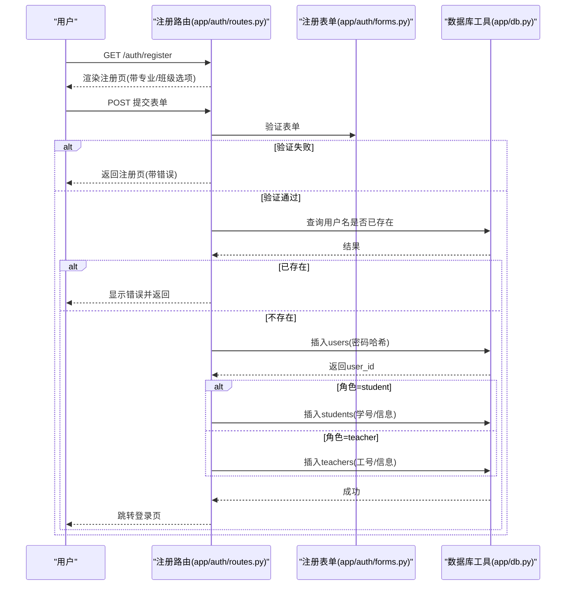
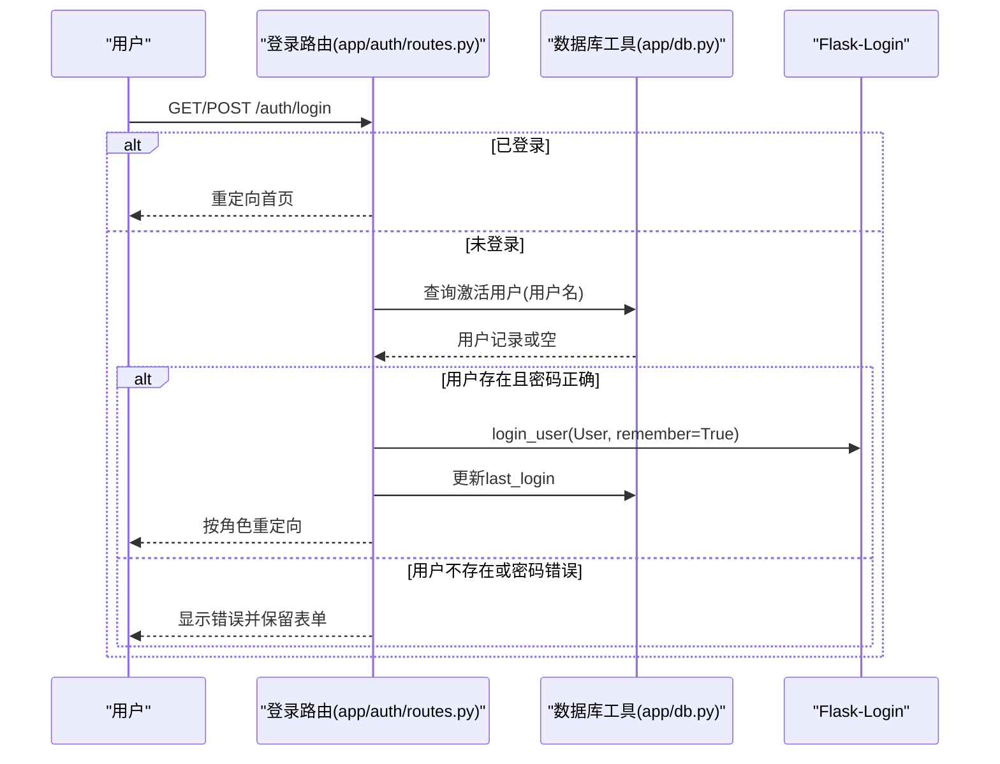
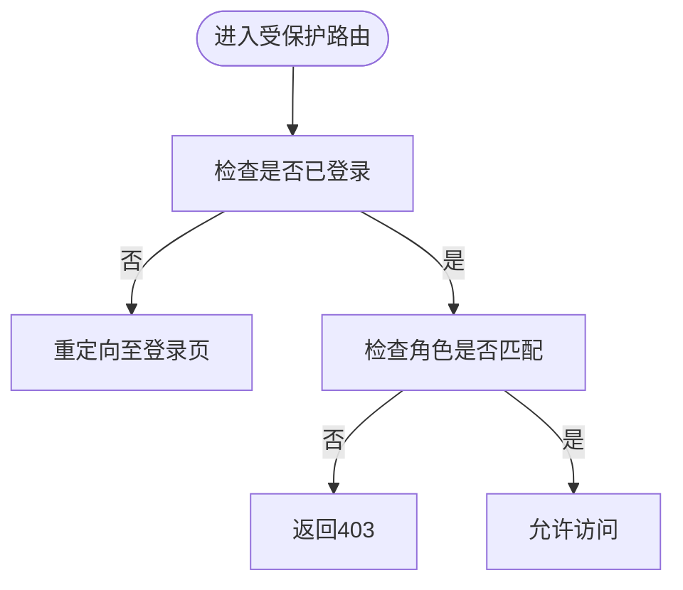
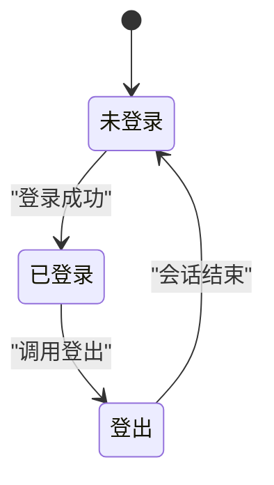
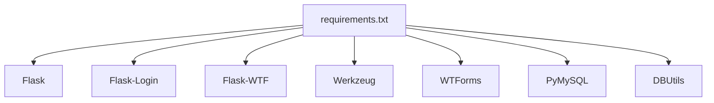

# 用户认证系统

<cite>
**本文引用的文件**
- [app/__init__.py](file://app/__init__.py)
- [app/auth/routes.py](file://app/auth/routes.py)
- [app/auth/forms.py](file://app/auth/forms.py)
- [app/db.py](file://app/db.py)
- [config.py](file://config.py)
- [app/decorators.py](file://app/decorators.py)
- [app/admin/routes.py](file://app/admin/routes.py)
- [app/student/routes.py](file://app/student/routes.py)
- [app/teacher/routes.py](file://app/teacher/routes.py)
- [app/templates/_csrf_field.html](file://app/templates/_csrf_field.html)
- [app/templates/auth/login.html](file://app/templates/auth/login.html)
- [app/templates/auth/register.html](file://app/templates/auth/register.html)
- [app/templates/base.html](file://app/templates/base.html)
- [requirements.txt](file://requirements.txt)
- [sql/01_schema.sql](file://sql/01_schema.sql)
- [sql/02_seed.sql](file://sql/02_seed.sql)
</cite>

## 目录
1. [简介](#简介)
2. [项目结构](#项目结构)
3. [核心组件](#核心组件)
4. [架构总览](#架构总览)
5. [详细组件分析](#详细组件分析)
6. [依赖分析](#依赖分析)
7. [性能考虑](#性能考虑)
8. [故障排查指南](#故障排查指南)
9. [结论](#结论)
10. [附录](#附录)

## 简介
本文件面向“用户认证系统”的技术文档，围绕 Flask-Login 的集成与配置、用户加载机制、会话管理与登出处理、用户注册流程（表单验证、密码加密存储、角色分配）、登录机制（凭据验证、密码哈希比较、会话建立）、CSRF 保护机制（令牌生成与验证）、用户角色管理（管理员、教师、学生权限差异与访问控制）、完整认证流程图与状态转换图、安全最佳实践（密码强度、会话超时、防暴力破解）、表单处理与错误处理策略等方面进行深入解析。

## 项目结构
系统采用蓝图（Blueprint）按功能域划分模块，认证相关的核心文件集中在 app/auth 下，配合全局配置、数据库工具与角色装饰器共同完成认证与授权。

图表来源
- [app/__init__.py:29-93](file://app/__init__.py#L29-L93)
- [app/auth/routes.py:29-167](file://app/auth/routes.py#L29-L167)
- [app/auth/forms.py:6-37](file://app/auth/forms.py#L6-L37)
- [app/db.py:10-121](file://app/db.py#L10-L121)
- [app/decorators.py:7-26](file://app/decorators.py#L7-L26)
- [config.py:6-36](file://config.py#L6-L36)
- [requirements.txt:1-8](file://requirements.txt#L1-L8)
- [app/templates/_csrf_field.html:1-2](file://app/templates/_csrf_field.html#L1-L2)
- [app/templates/auth/login.html:1-45](file://app/templates/auth/login.html#L1-L45)
- [app/templates/auth/register.html:1-102](file://app/templates/auth/register.html#L1-L102)
- [app/templates/base.html:1-85](file://app/templates/base.html#L1-L85)

章节来源
- [app/__init__.py:29-93](file://app/__init__.py#L29-L93)
- [app/auth/routes.py:29-167](file://app/auth/routes.py#L29-L167)
- [app/auth/forms.py:6-37](file://app/auth/forms.py#L6-L37)
- [app/db.py:10-121](file://app/db.py#L10-L121)
- [config.py:6-36](file://config.py#L6-L36)
- [app/decorators.py:7-26](file://app/decorators.py#L7-L26)
- [requirements.txt:1-8](file://requirements.txt#L1-L8)
- [app/templates/_csrf_field.html:1-2](file://app/templates/_csrf_field.html#L1-L2)
- [app/templates/auth/login.html:1-45](file://app/templates/auth/login.html#L1-L45)
- [app/templates/auth/register.html:1-102](file://app/templates/auth/register.html#L1-L102)
- [app/templates/base.html:1-85](file://app/templates/base.html#L1-L85)

## 核心组件
- Flask-Login 集成与用户加载
  - 在应用初始化中配置 LoginManager，设置登录视图、消息类别与国际化提示；定义用户加载回调，从数据库查询用户并包装为兼容对象。
  - 用户类实现 Flask-Login 所需接口，提供 ID 获取、活跃状态判断与属性访问。
- 表单与验证
  - 登录表单与注册表单分别定义字段与验证器，注册表单包含用户名、密码、确认密码、角色、姓名、性别、专业/班级（学生）、电话、邮箱等。
- 数据访问层
  - 提供连接池初始化、查询、写入、插入、分页与存储过程调用工具，统一事务提交与游标使用。
- 角色装饰器
  - 提供登录必需与角色必需的装饰器，用于蓝图前置检查与细粒度权限控制。
- CSRF 保护
  - 全局启用 CSRFProtect，模板中渲染隐藏的 CSRF 令牌字段，确保表单提交安全。
- 配置
  - 定义密钥、数据库连接参数、连接池大小、分页参数等。

章节来源
- [app/__init__.py:10-52](file://app/__init__.py#L10-L52)
- [app/auth/forms.py:6-37](file://app/auth/forms.py#L6-L37)
- [app/db.py:10-90](file://app/db.py#L10-L90)
- [app/decorators.py:7-26](file://app/decorators.py#L7-L26)
- [config.py:6-36](file://config.py#L6-L36)
- [app/templates/_csrf_field.html:1-2](file://app/templates/_csrf_field.html#L1-L2)

## 架构总览
认证系统围绕“用户身份—角色—权限”展开，通过蓝图隔离不同角色的功能域，利用装饰器实现统一的登录与角色校验，数据库层提供统一的数据访问与事务控制。

图表来源
- [app/__init__.py:29-93](file://app/__init__.py#L29-L93)
- [app/auth/routes.py:29-167](file://app/auth/routes.py#L29-L167)
- [app/auth/forms.py:6-37](file://app/auth/forms.py#L6-L37)
- [app/decorators.py:7-26](file://app/decorators.py#L7-L26)
- [app/admin/routes.py:10-17](file://app/admin/routes.py#L10-L17)
- [app/teacher/routes.py:7-14](file://app/teacher/routes.py#L7-L14)
- [app/student/routes.py:7-14](file://app/student/routes.py#L7-L14)
- [app/db.py:10-121](file://app/db.py#L10-L121)
- [config.py:6-36](file://config.py#L6-L36)

## 详细组件分析

### Flask-Login 集成与配置
- 登录视图与消息
  - 设置登录视图为认证蓝图中的登录页，未登录访问受保护资源时显示警告消息类别。
- 用户加载回调
  - 使用数据库查询用户记录，返回封装后的用户对象；未找到则返回空，交由 Flask-Login 处理匿名用户。
- 用户类
  - 实现 get_id、is_active 属性与字典式访问，便于在模板与视图中直接读取用户信息。

图表来源
- [app/__init__.py:10-52](file://app/__init__.py#L10-L52)

章节来源
- [app/__init__.py:40-52](file://app/__init__.py#L40-L52)
- [app/__init__.py:10-27](file://app/__init__.py#L10-L27)

### 用户注册流程
- 表单验证
  - 注册表单包含用户名、密码、确认密码、角色、姓名、性别、专业/班级（学生）、电话、邮箱等字段，使用 WTForms 验证器保证格式与长度。
- 密码加密存储
  - 使用 Werkzeug 的密码哈希函数生成哈希值后存入 users 表。
- 角色分配与扩展信息
  - 根据角色向 students 或 teachers 表插入对应记录，同时生成唯一学号/工号。
- 错误处理
  - 用户名重复、学号/工号生成失败、数据库异常均通过闪存消息反馈给用户。

图表来源
- [app/auth/routes.py:58-110](file://app/auth/routes.py#L58-L110)
- [app/auth/forms.py:11-37](file://app/auth/forms.py#L11-L37)
- [app/db.py:83-89](file://app/db.py#L83-L89)

章节来源
- [app/auth/routes.py:58-110](file://app/auth/routes.py#L58-L110)
- [app/auth/forms.py:11-37](file://app/auth/forms.py#L11-L37)
- [app/db.py:83-89](file://app/db.py#L83-L89)

### 用户登录机制
- 凭据验证
  - 查询激活状态的用户，使用密码哈希比较函数验证密码。
- 会话建立
  - 验证通过后调用登录函数建立会话，并更新最近登录时间。
- 登录后跳转
  - 根据用户角色重定向到对应角色的仪表盘。

图表来源
- [app/auth/routes.py:32-55](file://app/auth/routes.py#L32-L55)
- [app/db.py:43-50](file://app/db.py#L43-L50)

章节来源
- [app/auth/routes.py:32-55](file://app/auth/routes.py#L32-L55)

### 登出处理
- 登出路由使用登录必需装饰器，确保只有已登录用户可访问。
- 调用登出函数清除会话，返回登录页并提示已退出。

章节来源
- [app/auth/routes.py:113-118](file://app/auth/routes.py#L113-L118)

### CSRF 保护机制
- 后端
  - 在应用初始化时启用 CSRFProtect。
- 前端
  - 模板中包含隐藏的 CSRF 令牌字段，确保表单提交时携带令牌。
- 表单处理
  - 认证路由接收 POST 请求时，表单验证会自动校验 CSRF 令牌。

章节来源
- [app/__init__.py:33](file://app/__init__.py#L33)
- [app/templates/_csrf_field.html:1-2](file://app/templates/_csrf_field.html#L1-L2)
- [app/auth/routes.py:37-55](file://app/auth/routes.py#L37-L55)

### 用户角色管理与访问控制
- 角色装饰器
  - 登录必需装饰器与角色必需装饰器组合使用，确保访问受保护路由前已完成登录且具备相应角色。
- 角色专属蓝图
  - 管理员、教师、学生各自拥有独立蓝图，内部通过装饰器统一校验。
- 数据库角色字段
  - users 表的 role 字段决定用户角色，模板侧据此渲染导航与内容。

图表来源
- [app/decorators.py:7-26](file://app/decorators.py#L7-L26)
- [app/admin/routes.py:13-17](file://app/admin/routes.py#L13-L17)
- [app/teacher/routes.py:10-14](file://app/teacher/routes.py#L10-L14)
- [app/student/routes.py:10-14](file://app/student/routes.py#L10-L14)
- [app/templates/base.html:13-46](file://app/templates/base.html#L13-L46)

章节来源
- [app/decorators.py:7-26](file://app/decorators.py#L7-L26)
- [app/admin/routes.py:13-17](file://app/admin/routes.py#L13-L17)
- [app/teacher/routes.py:10-14](file://app/teacher/routes.py#L10-L14)
- [app/student/routes.py:10-14](file://app/student/routes.py#L10-L14)
- [app/templates/base.html:13-46](file://app/templates/base.html#L13-L46)

### 认证流程图与状态转换图
- 认证流程图
  - 参见“用户登录机制”与“用户注册流程”的序列图。

- 状态转换图
  - 用户登录状态在会话生命周期内的变化：未登录 → 已登录（持久化/非持久化）→ 登出 → 未登录。

图表来源
- [app/auth/routes.py:32-55](file://app/auth/routes.py#L32-L55)
- [app/auth/routes.py:113-118](file://app/auth/routes.py#L113-L118)

## 依赖分析
- 框架与扩展
  - Flask、Flask-Login、Flask-WTF、Werkzeug、WTForms、PyMySQL、DBUtils。
- 数据库与连接
  - 使用 PyMySQL 与 DBUtils 连接池，提供统一的查询、写入、插入与分页接口。
- 配置
  - 通过环境变量或默认值配置密钥、数据库连接与连接池参数。

图表来源
- [requirements.txt:1-8](file://requirements.txt#L1-L8)

章节来源
- [requirements.txt:1-8](file://requirements.txt#L1-L8)
- [app/db.py:10-26](file://app/db.py#L10-L26)
- [config.py:6-36](file://config.py#L6-L36)

## 性能考虑
- 数据库连接池
  - 初始化连接池时设置最小缓存、最大缓存与最大连接数，减少频繁连接/断开带来的开销。
- 查询与事务
  - 统一在上下文内获取连接，显式提交事务，避免长事务占用资源。
- 分页与索引
  - 分页查询支持自定义 SQL 与计数 SQL，结合数据库索引提升大表查询效率。
- 密码哈希成本
  - 使用强哈希算法（如 scrypt）生成密码哈希，建议在生产环境中根据硬件能力调整成本参数以平衡安全性与性能。

章节来源
- [app/db.py:10-26](file://app/db.py#L10-L26)
- [app/db.py:92-121](file://app/db.py#L92-L121)
- [sql/01_schema.sql:15-26](file://sql/01_schema.sql#L15-L26)

## 故障排查指南
- 登录失败
  - 检查用户名是否存在且账户处于激活状态；确认密码哈希比对逻辑是否正确；查看闪存消息提示。
- 注册失败
  - 核对用户名是否重复；学号/工号生成是否成功；数据库异常是否被捕获并提示。
- 权限不足
  - 确认用户角色与目标路由的角色装饰器是否匹配；检查蓝图前置装饰器链路。
- CSRF 校验失败
  - 确认表单中包含 CSRF 令牌字段；检查模板渲染与请求提交是否一致。
- 会话问题
  - 检查 Flask-Login 的用户加载回调是否能正确查询到用户；确认数据库连接池配置与事务提交。

章节来源
- [app/auth/routes.py:32-55](file://app/auth/routes.py#L32-L55)
- [app/auth/routes.py:58-110](file://app/auth/routes.py#L58-L110)
- [app/decorators.py:7-26](file://app/decorators.py#L7-L26)
- [app/templates/_csrf_field.html:1-2](file://app/templates/_csrf_field.html#L1-L2)

## 结论
本认证系统基于 Flask-Login 实现了标准的用户加载、会话管理与登出流程，结合 WTForms 表单验证、Werkzeug 密码哈希与 CSRF 保护，构建了安全可控的多角色访问体系。通过蓝图与装饰器实现了清晰的权限边界，数据库层提供了稳健的连接池与事务控制。建议在生产环境中进一步强化安全配置（如会话超时、防暴力破解、HTTPS 强制等）以提升整体安全性。

## 附录
- 数据库结构要点
  - users 表包含用户名、密码哈希、角色、激活状态与时间戳；students/teachers 表通过 user_id 关联用户。
- 种子数据
  - 包含管理员账户与初始学期、专业、班级、课程与选课时间段数据，便于快速演示。

章节来源
- [sql/01_schema.sql:15-95](file://sql/01_schema.sql#L15-L95)
- [sql/02_seed.sql:7-49](file://sql/02_seed.sql#L7-L49)