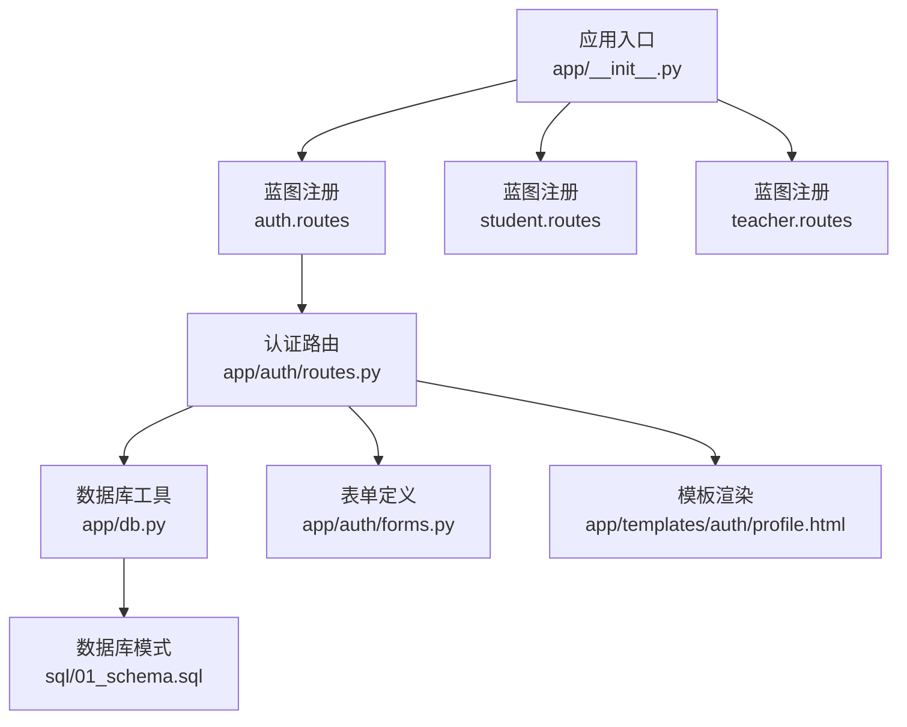
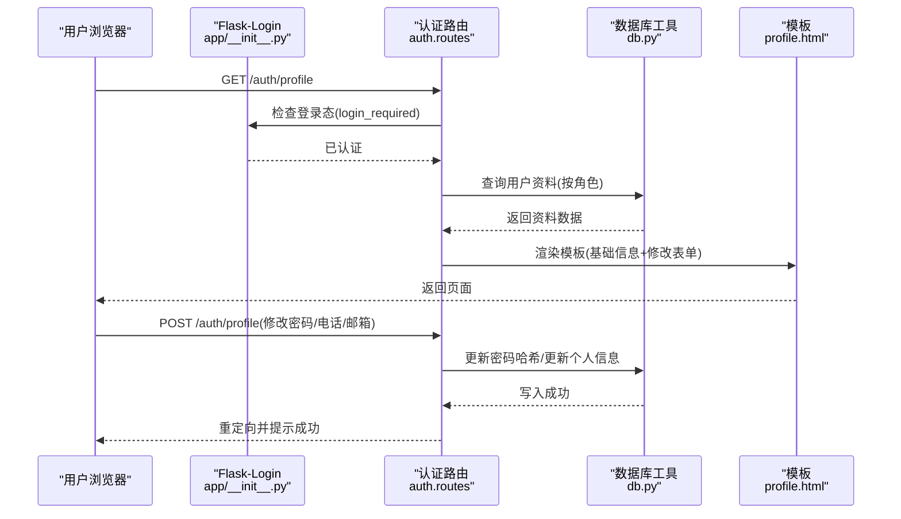
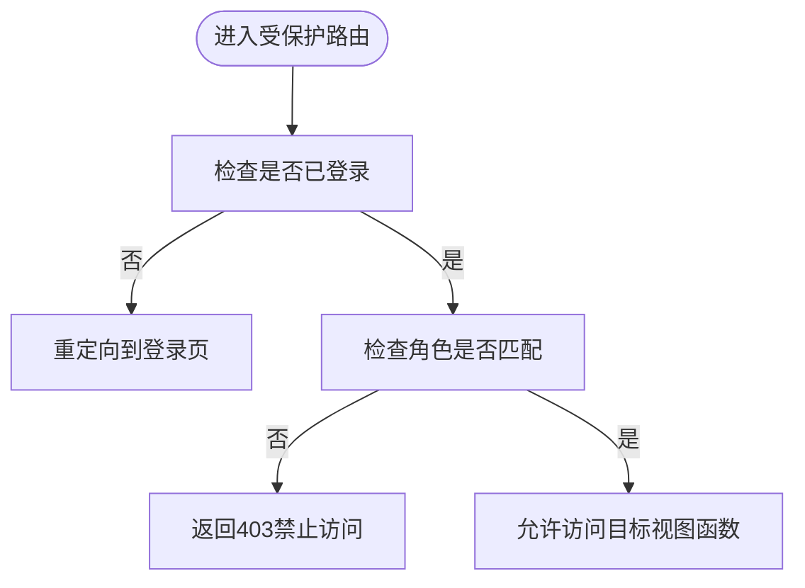
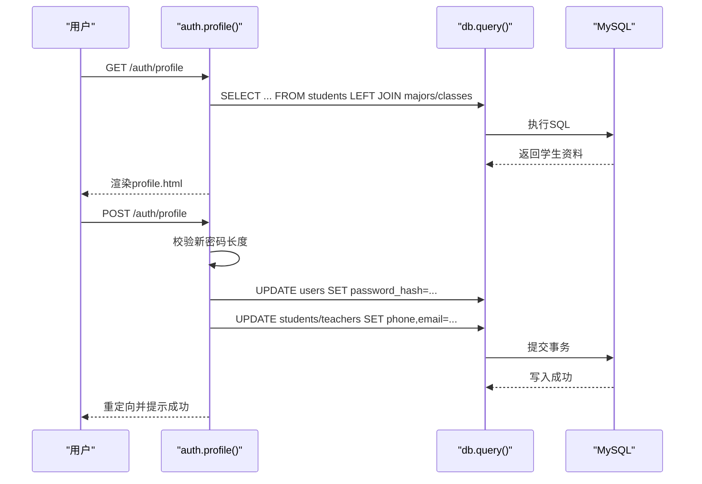
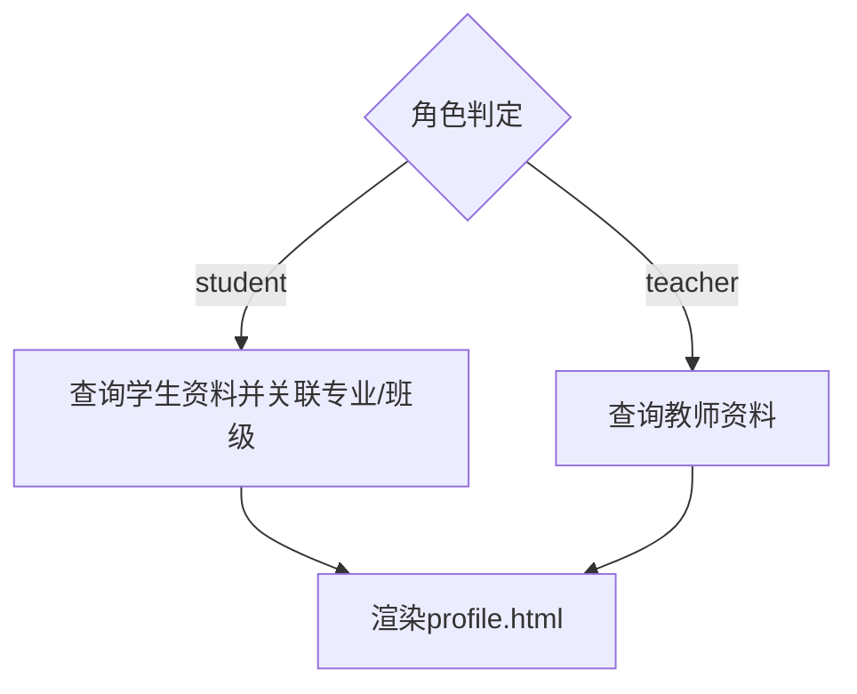
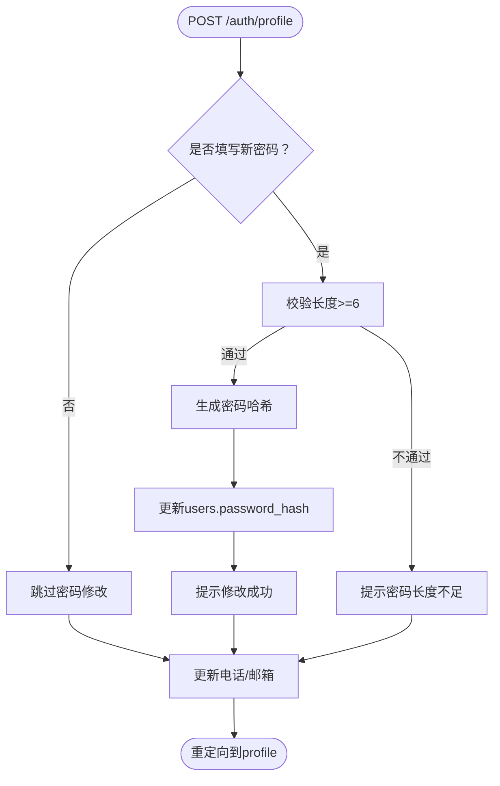
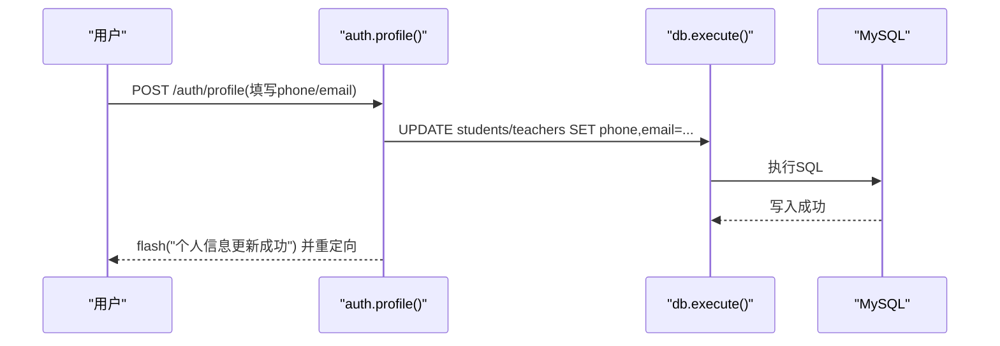
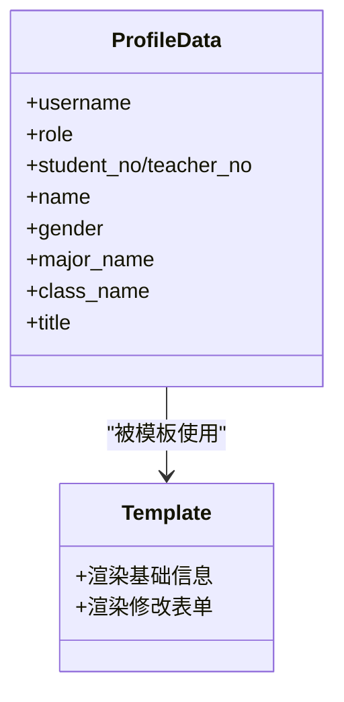
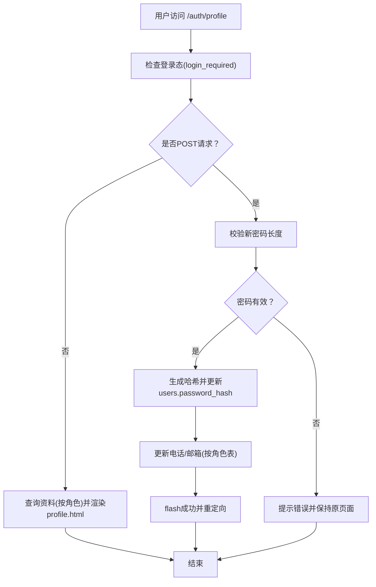
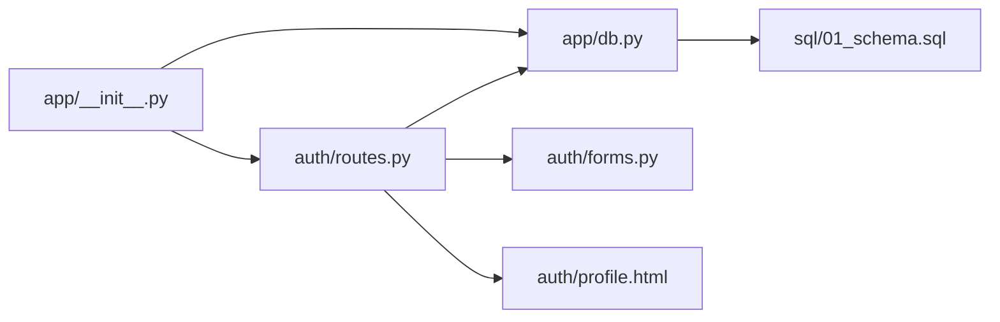

# 用户资料管理

<cite>
**本文档引用的文件**
- [app/__init__.py](file://app/__init__.py)
- [app/decorators.py](file://app/decorators.py)
- [app/auth/routes.py](file://app/auth/routes.py)
- [app/auth/forms.py](file://app/auth/forms.py)
- [app/db.py](file://app/db.py)
- [app/templates/auth/profile.html](file://app/templates/auth/profile.html)
- [sql/01_schema.sql](file://sql/01_schema.sql)
- [config.py](file://config.py)
- [app/helpers.py](file://app/helpers.py)
</cite>

## 目录
1. [简介](#简介)
2. [项目结构](#项目结构)
3. [核心组件](#核心组件)
4. [架构总览](#架构总览)
5. [详细组件分析](#详细组件分析)
6. [依赖关系分析](#依赖关系分析)
7. [性能考量](#性能考量)
8. [故障排查指南](#故障排查指南)
9. [结论](#结论)
10. [附录](#附录)

## 简介
本文件聚焦于用户资料管理功能，涵盖以下方面：
- 用户资料路由的实现机制，包括 login_required 装饰器的使用与用户数据获取
- 不同角色（学生、教师）资料的差异化查询逻辑
- 密码修改功能的实现，包括新密码验证、密码哈希更新与安全考虑
- 个人信息更新机制，包括电话号码与邮箱地址的修改流程
- 资料页面的动态数据展示，包括专业名称与班级名称的关联查询
- 完整的资料管理流程图与数据更新流程
- 安全最佳实践，如密码强度验证、输入清理与权限控制
- 表单处理的代码示例路径与用户体验优化建议

## 项目结构
本项目采用 Flask 微服务化蓝图组织，用户资料管理主要位于认证模块与数据库层之间，通过装饰器与数据库工具完成权限控制与数据访问。

图表来源
- [app/__init__.py:54-64](file://app/__init__.py#L54-L64)
- [app/auth/routes.py:29](file://app/auth/routes.py#L29)
- [app/db.py:43-89](file://app/db.py#L43-L89)
- [app/auth/forms.py:6-37](file://app/auth/forms.py#L6-L37)
- [app/templates/auth/profile.html:1-60](file://app/templates/auth/profile.html#L1-L60)
- [sql/01_schema.sql:15-95](file://sql/01_schema.sql#L15-L95)

章节来源
- [app/__init__.py:29-64](file://app/__init__.py#L29-L64)
- [app/auth/routes.py:29](file://app/auth/routes.py#L29)

## 核心组件
- 登录与角色装饰器：提供统一的登录态与角色校验能力，确保只有认证用户与正确角色可访问特定资源。
- 认证路由：负责登录、注册、登出以及个人资料页面的展示与更新。
- 数据库工具：封装连接池、查询、写入、存储过程调用等通用能力。
- 表单定义：定义用户名、密码、角色、姓名、性别、专业、班级、电话、邮箱等字段及验证规则。
- 模板：渲染用户资料页面，支持基础信息展示与修改表单。

章节来源
- [app/decorators.py:7-25](file://app/decorators.py#L7-L25)
- [app/auth/routes.py:32-166](file://app/auth/routes.py#L32-L166)
- [app/db.py:43-89](file://app/db.py#L43-L89)
- [app/auth/forms.py:6-37](file://app/auth/forms.py#L6-L37)
- [app/templates/auth/profile.html:1-60](file://app/templates/auth/profile.html#L1-L60)

## 架构总览
用户资料管理遵循“装饰器 + 路由 + 数据库工具 + 模板”的分层设计，通过 Flask-Login 维护会话，通过装饰器进行权限控制，通过数据库工具执行 SQL 与存储过程，最终在模板中渲染动态数据。

图表来源
- [app/__init__.py:47-51](file://app/__init__.py#L47-L51)
- [app/auth/routes.py:121-166](file://app/auth/routes.py#L121-L166)
- [app/db.py:53-89](file://app/db.py#L53-L89)
- [app/templates/auth/profile.html:38-54](file://app/templates/auth/profile.html#L38-L54)

## 详细组件分析

### 登录与角色装饰器
- login_required：基于 Flask-Login 的登录检查，未登录则跳转到登录页。
- role_required：在登录基础上进一步校验角色，不匹配则返回 403。

图表来源
- [app/decorators.py:7-25](file://app/decorators.py#L7-L25)

章节来源
- [app/decorators.py:7-25](file://app/decorators.py#L7-L25)

### 用户资料路由与数据获取
- 路由：/auth/profile，支持 GET（展示）与 POST（更新）。
- 登录态：使用 @login_required 保证只有已登录用户可访问。
- 角色区分：根据 current_user.get('role') 判断角色，分别查询 students 或 teachers 表。
- 关联查询：学生资料包含专业名与班级名的左连接查询。

图表来源
- [app/auth/routes.py:121-166](file://app/auth/routes.py#L121-L166)
- [app/db.py:43-89](file://app/db.py#L43-L89)

章节来源
- [app/auth/routes.py:121-166](file://app/auth/routes.py#L121-L166)

### 不同角色资料的差异化处理
- 学生资料：从 students 表查询，同时左连接 majors 与 classes 获取专业名与班级名。
- 教师资料：从 teachers 表查询，不涉及专业与班级关联。
- 模板渲染：根据是否存在 student_no/teacher_no 决定显示学号/工号字段。

图表来源
- [app/auth/routes.py:128-141](file://app/auth/routes.py#L128-L141)
- [app/templates/auth/profile.html:16-29](file://app/templates/auth/profile.html#L16-L29)

章节来源
- [app/auth/routes.py:128-141](file://app/auth/routes.py#L128-L141)
- [app/templates/auth/profile.html:16-29](file://app/templates/auth/profile.html#L16-L29)

### 密码修改功能实现
- 新密码验证：若提交了新密码，则校验长度至少 6 位。
- 密码哈希更新：使用 generate_password_hash 生成哈希并更新 users 表。
- 安全考虑：使用 Werkzeug 的安全哈希算法；表单包含 CSRF 令牌；路由受登录保护。

图表来源
- [app/auth/routes.py:143-164](file://app/auth/routes.py#L143-L164)
- [app/auth/forms.py:17-24](file://app/auth/forms.py#L17-L24)

章节来源
- [app/auth/routes.py:143-164](file://app/auth/routes.py#L143-L164)
- [app/auth/forms.py:17-24](file://app/auth/forms.py#L17-L24)

### 个人信息更新机制（电话与邮箱）
- 电话与邮箱来自表单字段 phone 与 email。
- 根据角色选择更新 students 或 teachers 表的对应字段。
- 更新后统一提示“个人信息更新成功”。

图表来源
- [app/auth/routes.py:155-164](file://app/auth/routes.py#L155-L164)

章节来源
- [app/auth/routes.py:155-164](file://app/auth/routes.py#L155-L164)

### 资料页面的动态数据展示
- 基础信息：用户名、角色、学号/工号、姓名、性别、专业、班级、职称（教师）。
- 动态数据来源：profile_data 来自数据库查询结果，模板通过 Jinja2 进行渲染。
- 专业与班级名称：学生资料通过 LEFT JOIN majors/classes 获取。

图表来源
- [app/auth/routes.py:128-141](file://app/auth/routes.py#L128-L141)
- [app/templates/auth/profile.html:10-30](file://app/templates/auth/profile.html#L10-L30)

章节来源
- [app/auth/routes.py:128-141](file://app/auth/routes.py#L128-L141)
- [app/templates/auth/profile.html:10-30](file://app/templates/auth/profile.html#L10-L30)

### 完整资料管理流程图

图表来源
- [app/auth/routes.py:121-166](file://app/auth/routes.py#L121-L166)

## 依赖关系分析
- 应用初始化：注册蓝图、初始化 CSRF 保护、Flask-Login、数据库连接池。
- 路由依赖：auth.routes 依赖 db.py 提供的查询与写入能力；依赖 forms.py 的表单验证；依赖模板渲染。
- 数据模型：users、students、teachers、majors、classes 等表构成资料管理的数据基础。

图表来源
- [app/__init__.py:54-64](file://app/__init__.py#L54-L64)
- [app/auth/routes.py:29](file://app/auth/routes.py#L29)
- [app/db.py:43-89](file://app/db.py#L43-L89)
- [app/auth/forms.py:6-37](file://app/auth/forms.py#L6-L37)
- [app/templates/auth/profile.html:1-60](file://app/templates/auth/profile.html#L1-L60)
- [sql/01_schema.sql:15-95](file://sql/01_schema.sql#L15-L95)

章节来源
- [app/__init__.py:54-64](file://app/__init__.py#L54-L64)
- [app/auth/routes.py:29](file://app/auth/routes.py#L29)
- [app/db.py:43-89](file://app/db.py#L43-L89)
- [sql/01_schema.sql:15-95](file://sql/01_schema.sql#L15-L95)

## 性能考量
- 数据库连接池：通过 dbutils.PooledDB 提供连接池，减少连接开销，提高并发性能。
- 查询优化：profile 页面的资料查询使用 LEFT JOIN，避免 N+1 查询问题。
- 分页与缓存：全局配置 PER_PAGE 控制分页大小，可根据业务量调整。
- CSRF 保护：启用 CSRFProtect，降低跨站请求伪造风险。

章节来源
- [app/db.py:10-26](file://app/db.py#L10-L26)
- [app/db.py:43-89](file://app/db.py#L43-L89)
- [config.py:25](file://config.py#L25)
- [app/__init__.py:7](file://app/__init__.py#L7)

## 故障排查指南
- 登录失败：检查用户名是否存在且 is_active=1，确认密码哈希匹配。
- 密码修改无效：确认新密码长度满足最小长度要求；检查 CSRF 令牌是否正确提交。
- 个人信息未更新：确认表单字段 phone/email 是否传入；检查角色对应的表是否正确更新。
- 403 访问被拒绝：确认当前用户角色与目标路由所需角色一致。
- 数据库连接异常：检查连接池参数与数据库服务状态。

章节来源
- [app/auth/routes.py:39-53](file://app/auth/routes.py#L39-L53)
- [app/auth/routes.py:146-153](file://app/auth/routes.py#L146-L153)
- [app/auth/routes.py:158-162](file://app/auth/routes.py#L158-L162)
- [app/decorators.py:17-22](file://app/decorators.py#L17-L22)
- [app/db.py:10-26](file://app/db.py#L10-L26)

## 结论
用户资料管理功能以装饰器保障安全、以路由聚合业务、以数据库工具抽象数据访问、以模板实现动态展示。通过角色区分与关联查询，实现了学生与教师资料的差异化展示；通过密码哈希与 CSRF 保护，提升了安全性；通过清晰的流程与错误提示，改善了用户体验。

## 附录

### 安全最佳实践
- 密码强度验证：新密码长度至少 6 位；生产环境建议引入更严格的复杂度策略（如包含大小写字母、数字、特殊字符）。
- 输入清理：使用 WTForms 验证器进行输入校验；对用户输入进行必要的转义与长度限制。
- 权限控制：使用 login_required 与 role_required 双重保护；避免直接暴露内部 ID。
- CSRF 保护：启用 CSRFProtect 并在表单中包含 CSRF 字段。
- 日志审计：可扩展日志记录，记录敏感操作（如密码修改、信息变更）。

章节来源
- [app/auth/forms.py:17-24](file://app/auth/forms.py#L17-L24)
- [app/auth/routes.py:146-153](file://app/auth/routes.py#L146-L153)
- [app/__init__.py:7](file://app/__init__.py#L7)
- [app/helpers.py:9-20](file://app/helpers.py#L9-L20)

### 表单处理代码示例（路径）
- 登录表单定义：[LoginForm:6-8](file://app/auth/forms.py#L6-L8)
- 注册表单定义：[RegisterForm:11-36](file://app/auth/forms.py#L11-L36)
- 密码修改与信息更新：[auth.profile():121-166](file://app/auth/routes.py#L121-L166)
- CSRF 令牌模板片段：[_csrf_field.html](file://app/templates/_csrf_field.html)

章节来源
- [app/auth/forms.py:6-36](file://app/auth/forms.py#L6-L36)
- [app/auth/routes.py:121-166](file://app/auth/routes.py#L121-L166)
- [app/templates/_csrf_field.html](file://app/templates/_csrf_field.html)

### 用户体验优化建议
- 实时反馈：在前端对密码长度与格式进行即时校验，减少无效提交。
- 成功/错误提示：使用 flash 消息分类（success/danger/warning），提升可读性。
- 表单默认值：在 profile 页面为 phone/email 提供默认值，减少重复输入。
- 错误定位：当密码长度不足时，明确提示并高亮对应输入框。

章节来源
- [app/auth/routes.py:146-153](file://app/auth/routes.py#L146-L153)
- [app/templates/auth/profile.html:38-54](file://app/templates/auth/profile.html#L38-L54)