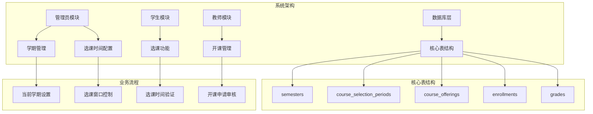
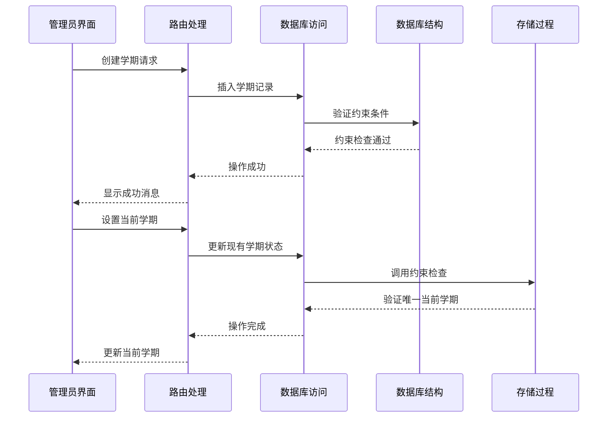
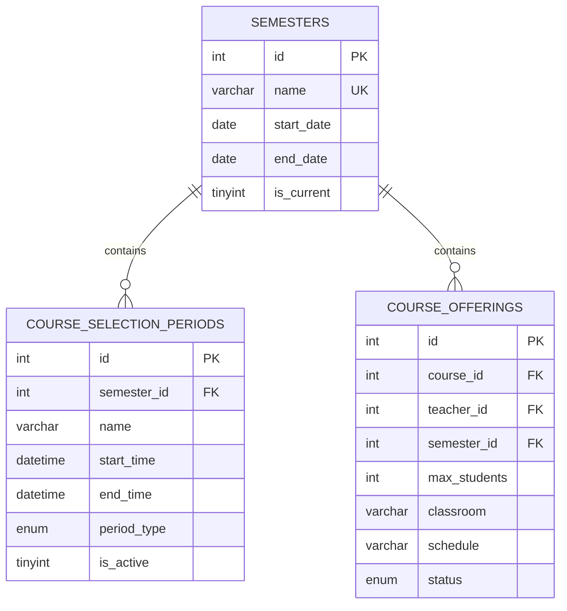
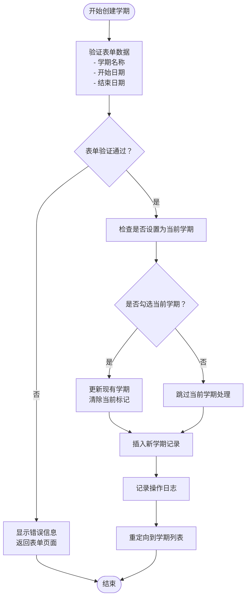
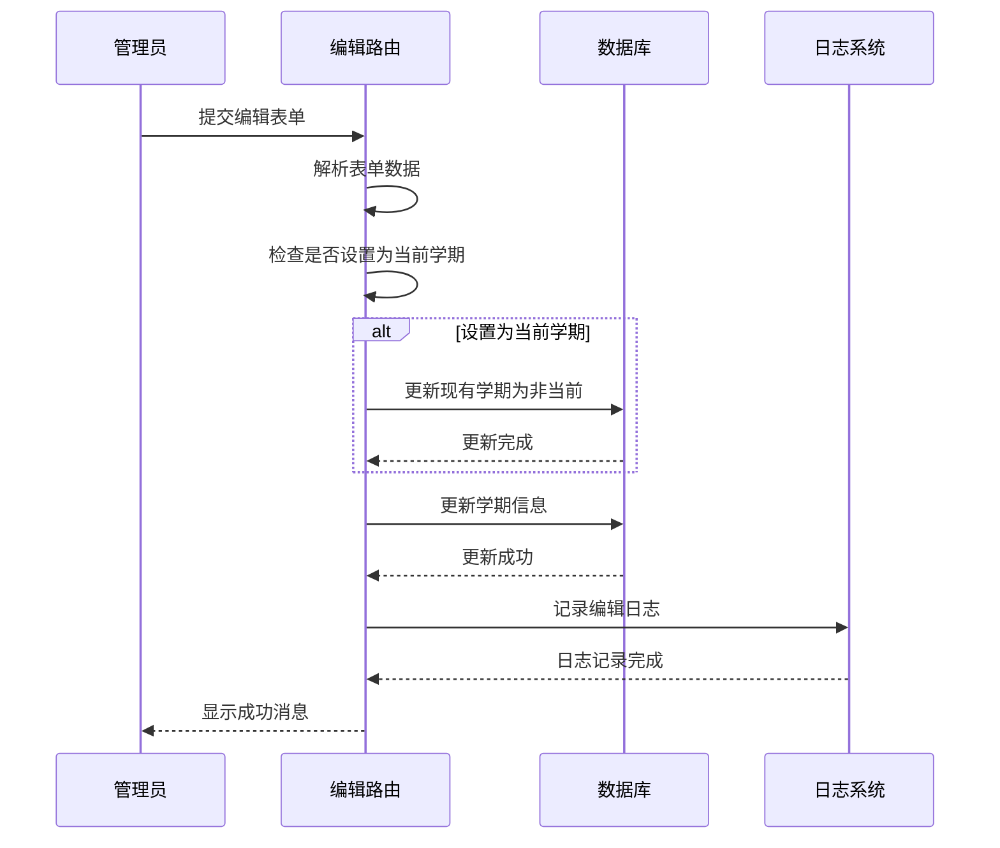
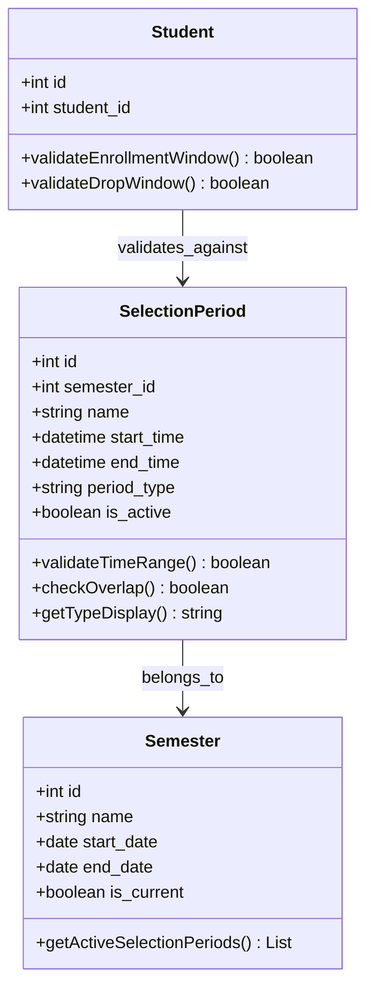
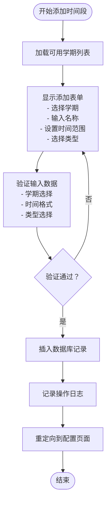
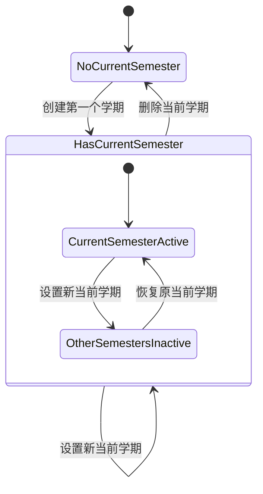
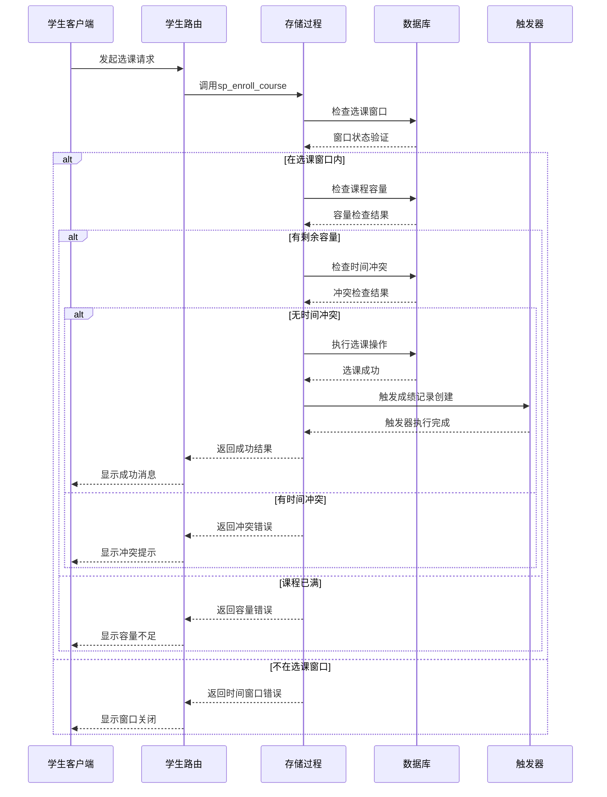
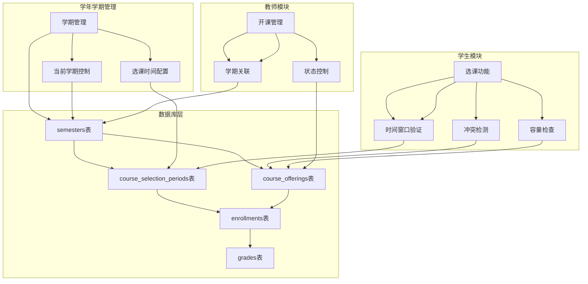

# 学年学期管理

<cite>
**本文档引用的文件**
- [app/admin/routes.py](file://app/admin/routes.py)
- [app/templates/admin/semesters.html](file://app/templates/admin/semesters.html)
- [app/templates/admin/selection_periods.html](file://app/templates/admin/selection_periods.html)
- [sql/01_schema.sql](file://sql/01_schema.sql)
- [sql/02_seed.sql](file://sql/02_seed.sql)
- [sql/03_procedures.sql](file://sql/03_procedures.sql)
- [app/db.py](file://app/db.py)
- [app/helpers.py](file://app/helpers.py)
- [app/student/routes.py](file://app/student/routes.py)
- [app/teacher/routes.py](file://app/teacher/routes.py)
- [config.py](file://config.py)
</cite>

## 目录
1. [简介](#简介)
2. [项目结构](#项目结构)
3. [核心组件](#核心组件)
4. [架构概览](#架构概览)
5. [详细组件分析](#详细组件分析)
6. [依赖分析](#依赖分析)
7. [性能考虑](#性能考虑)
8. [故障排除指南](#故障排除指南)
9. [结论](#结论)

## 简介

学年学期管理是校园教务选课与成绩管理系统的核心功能模块之一。该模块负责管理学年的学期信息、学期状态控制以及选课时间配置，确保整个系统的教学活动有序进行。本文档将详细介绍学期管理功能的完整实现，包括学期的创建、编辑、删除操作和当前学期的设置逻辑，以及选课时间配置功能的详细说明。

## 项目结构

该系统采用Flask框架构建，采用模块化的设计模式，将不同角色的功能分离到独立的蓝图中。学年学期管理功能主要集中在管理员模块中，同时与学生、教师模块存在密切的交互关系。

**图表来源**
- [app/admin/routes.py:61-101](file://app/admin/routes.py#L61-L101)
- [sql/01_schema.sql:98-215](file://sql/01_schema.sql#L98-L215)

**章节来源**
- [app/admin/routes.py:1-692](file://app/admin/routes.py#L1-L692)
- [sql/01_schema.sql:1-235](file://sql/01_schema.sql#L1-L235)

## 核心组件

学年学期管理功能由以下几个核心组件构成：

### 1. 学期管理组件
- **学期数据模型**：管理学年学期的基本信息，包括名称、开始日期、结束日期和当前学期标记
- **学期状态控制**：确保系统中只有一个当前学期处于激活状态
- **学期生命周期管理**：支持学期的创建、更新、删除和状态切换

### 2. 选课时间配置组件
- **时间段类型管理**：区分选课和退课两种不同的时间段类型
- **学期关联管理**：每个选课时间段都必须关联到特定的学期
- **状态控制机制**：支持时间段的启用和禁用操作

### 3. 时间窗口验证组件
- **实时时间检查**：在用户进行选课或退课操作时实时验证时间窗口
- **并发安全控制**：通过数据库事务和行级锁确保操作的原子性和一致性
- **冲突检测机制**：防止时间冲突和超容量选课

**章节来源**
- [app/admin/routes.py:61-101](file://app/admin/routes.py#L61-L101)
- [app/admin/routes.py:442-490](file://app/admin/routes.py#L442-L490)
- [sql/01_schema.sql:98-215](file://sql/01_schema.sql#L98-L215)

## 架构概览

系统采用分层架构设计，将业务逻辑、数据访问和表现层清晰分离。学年学期管理功能位于业务逻辑层，通过数据库访问层与底层数据存储交互。

**图表来源**
- [app/admin/routes.py:68-100](file://app/admin/routes.py#L68-L100)
- [sql/03_procedures.sql:277-320](file://sql/03_procedures.sql#L277-L320)

**章节来源**
- [app/admin/routes.py:1-692](file://app/admin/routes.py#L1-L692)
- [app/db.py:1-121](file://app/db.py#L1-L121)

## 详细组件分析

### 学期管理功能

#### 数据模型设计
学期表采用简洁而完整的设计，包含必要的字段来支持学年学期管理的所有需求。

**图表来源**
- [sql/01_schema.sql:98-215](file://sql/01_schema.sql#L98-L215)

#### 学期创建流程
学期创建功能提供了完整的用户界面和后台处理逻辑，确保新学期能够正确添加到系统中。

**图表来源**
- [app/admin/routes.py:68-80](file://app/admin/routes.py#L68-L80)

#### 学期编辑逻辑
学期编辑功能支持对现有学期信息的修改，特别是当前学期标记的动态调整。

**图表来源**
- [app/admin/routes.py:83-92](file://app/admin/routes.py#L83-L92)

**章节来源**
- [app/admin/routes.py:68-100](file://app/admin/routes.py#L68-L100)
- [app/templates/admin/semesters.html:1-67](file://app/templates/admin/semesters.html#L1-L67)

### 选课时间配置功能

#### 时间段类型管理
系统支持两种类型的时间段：选课和退课，每种类型都有其特定的业务含义和验证规则。

**图表来源**
- [sql/01_schema.sql:201-215](file://sql/01_schema.sql#L201-L215)
- [app/helpers.py:66-79](file://app/helpers.py#L66-L79)

#### 时间段添加流程
选课时间段的添加功能提供了完整的用户界面和数据验证机制。

**图表来源**
- [app/admin/routes.py:451-459](file://app/admin/routes.py#L451-L459)
- [app/templates/admin/selection_periods.html:31-52](file://app/templates/admin/selection_periods.html#L31-L52)

**章节来源**
- [app/admin/routes.py:442-490](file://app/admin/routes.py#L442-L490)
- [app/templates/admin/selection_periods.html:1-86](file://app/templates/admin/selection_periods.html#L1-L86)

### 学期状态管理机制

#### 当前学期设置逻辑
系统通过数据库约束确保任何时候都只有一个学期被标记为当前学期。

**图表来源**
- [app/admin/routes.py:74-76](file://app/admin/routes.py#L74-L76)
- [sql/01_schema.sql:105-107](file://sql/01_schema.sql#L105-L107)

#### 学期时间窗口约束
学期的时间窗口定义了整个教学周期的开始和结束时间，影响着系统中所有相关的业务操作。

**章节来源**
- [app/admin/routes.py:74-76](file://app/admin/routes.py#L74-L76)
- [sql/01_schema.sql:100-108](file://sql/01_schema.sql#L100-L108)

### 选课周期控制机制

#### 实时时间窗口验证
系统通过存储过程实现了严格的选课和退课时间窗口控制，确保只有在允许的时间范围内才能进行相应的操作。

**图表来源**
- [sql/03_procedures.sql:14-113](file://sql/03_procedures.sql#L14-L113)
- [app/student/routes.py:135-146](file://app/student/routes.py#L135-L146)

#### 并发安全控制
系统通过数据库事务和行级锁确保在高并发场景下的数据一致性和操作原子性。

**章节来源**
- [sql/03_procedures.sql:14-113](file://sql/03_procedures.sql#L14-L113)
- [app/student/routes.py:135-146](file://app/student/routes.py#L135-L146)

## 依赖分析

学年学期管理功能与其他系统组件存在密切的依赖关系，形成了一个完整的业务生态系统。

**图表来源**
- [sql/01_schema.sql:98-215](file://sql/01_schema.sql#L98-L215)
- [app/student/routes.py:135-146](file://app/student/routes.py#L135-L146)

**章节来源**
- [sql/01_schema.sql:98-215](file://sql/01_schema.sql#L98-L215)
- [app/student/routes.py:135-146](file://app/student/routes.py#L135-L146)

## 性能考虑

### 数据库优化策略
系统采用了多种数据库优化策略来确保学年学期管理功能的高性能运行：

1. **索引优化**：为常用的查询字段建立了适当的索引，包括学期状态、时间范围等关键字段
2. **连接池管理**：使用连接池减少数据库连接的创建和销毁开销
3. **事务控制**：通过事务确保数据的一致性和完整性
4. **存储过程优化**：将复杂的业务逻辑封装在存储过程中，减少网络往返次数

### 缓存机制
系统实现了多层次的缓存机制来提升性能：

- **连接池缓存**：避免频繁创建数据库连接
- **查询结果缓存**：对常用查询结果进行缓存
- **会话状态缓存**：缓存用户认证状态和权限信息

## 故障排除指南

### 常见问题及解决方案

#### 学期设置问题
**问题**：无法设置当前学期
**可能原因**：
- 数据库约束冲突
- 学期时间重叠
- 权限不足

**解决步骤**：
1. 检查是否存在其他学期的时间重叠
2. 确认当前用户具有管理员权限
3. 验证学期名称的唯一性

#### 选课时间窗口问题
**问题**：学生无法在规定时间内选课
**可能原因**：
- 选课时间段未正确配置
- 系统时间设置不正确
- 学期状态未正确设置

**解决步骤**：
1. 检查选课时间段的开始和结束时间
2. 验证系统服务器时间设置
3. 确认当前学期的状态

#### 数据一致性问题
**问题**：出现数据不一致的情况
**可能原因**：
- 并发操作导致的数据竞争
- 事务未正确提交
- 外键约束冲突

**解决步骤**：
1. 检查数据库事务的完整性
2. 验证外键约束的正确性
3. 分析并发操作的日志

**章节来源**
- [app/admin/routes.py:74-76](file://app/admin/routes.py#L74-L76)
- [sql/03_procedures.sql:26-31](file://sql/03_procedures.sql#L26-L31)

## 结论

学年学期管理功能作为校园教务选课与成绩管理系统的核心组成部分，通过精心设计的数据模型、严格的业务逻辑和完善的错误处理机制，为整个系统的稳定运行提供了坚实的基础。该功能不仅满足了基本的学期管理需求，还通过选课时间配置和状态控制机制，确保了教学活动的有序进行。

系统的主要优势包括：
- **数据完整性**：通过数据库约束和存储过程确保数据的准确性和一致性
- **业务逻辑清晰**：模块化的代码结构便于维护和扩展
- **用户体验友好**：直观的界面设计和及时的反馈机制
- **性能优化**：合理的数据库设计和缓存策略保证了系统的高效运行

未来可以考虑的改进方向包括：
- 增加更多的审计日志功能
- 实现更灵活的时间段配置选项
- 优化移动端的用户体验
- 增强系统的监控和告警能力