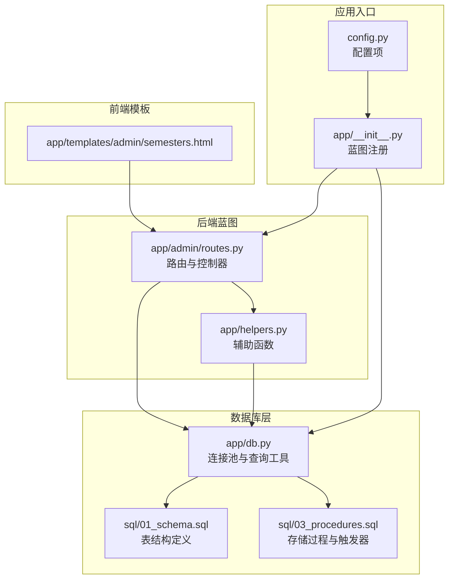
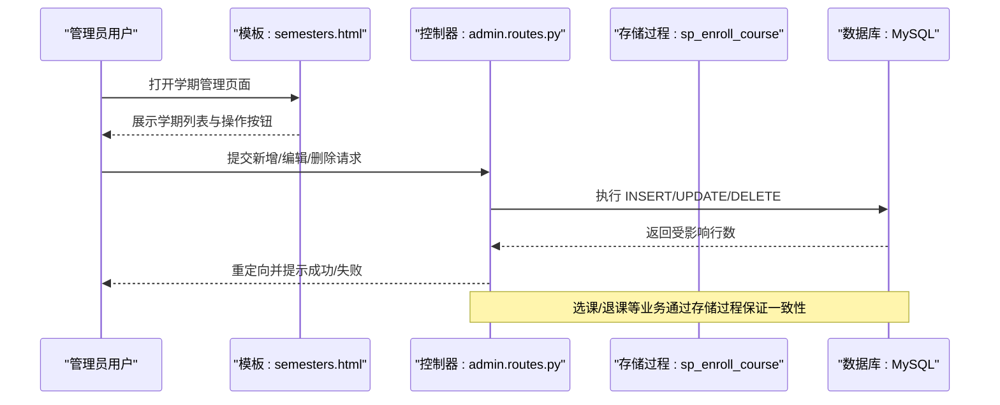
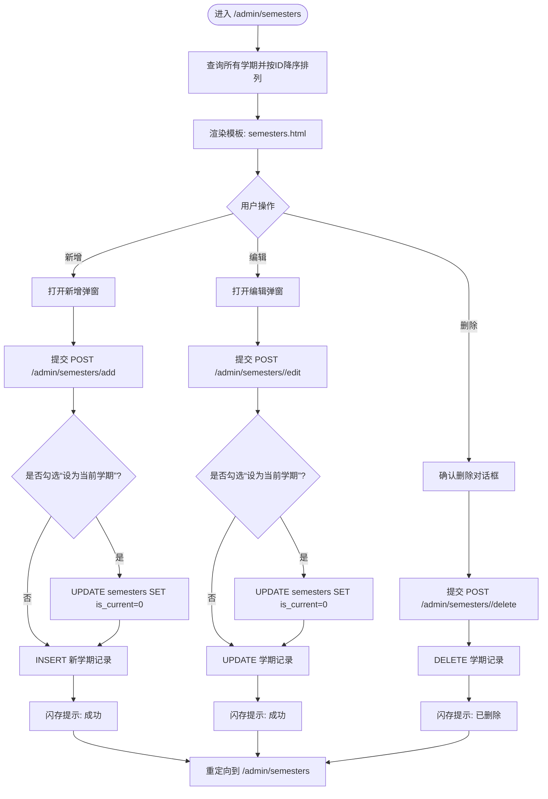
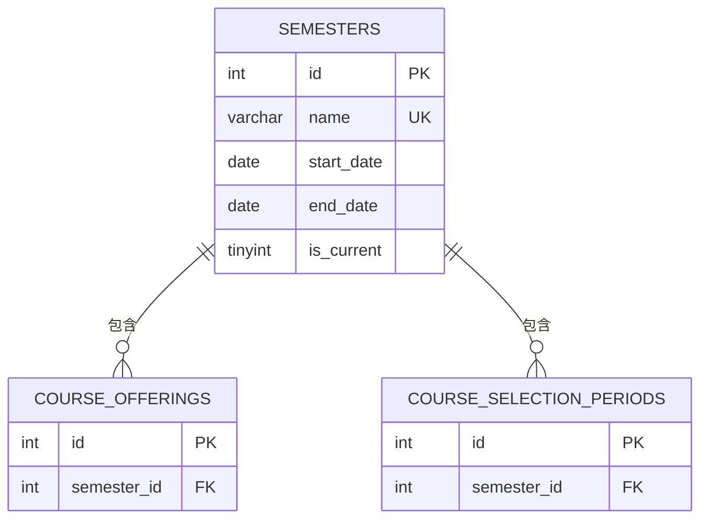
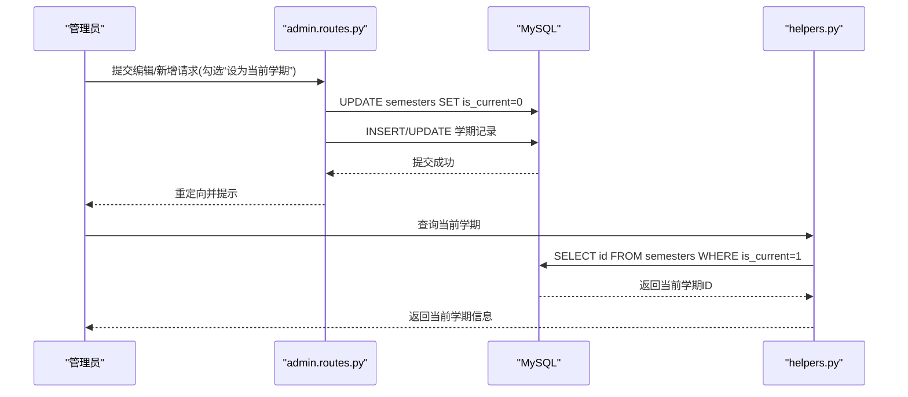
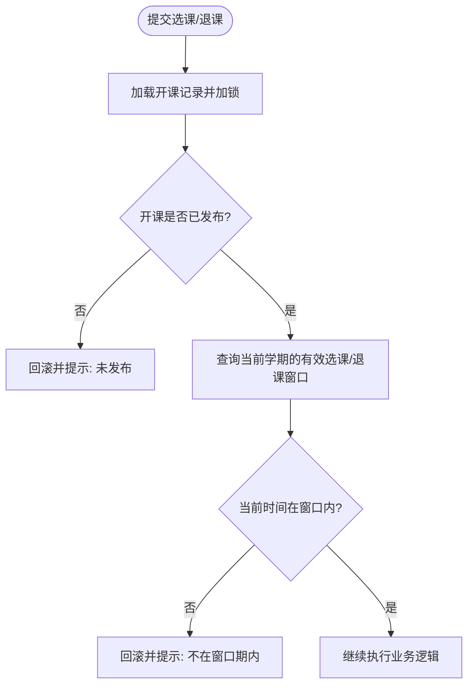
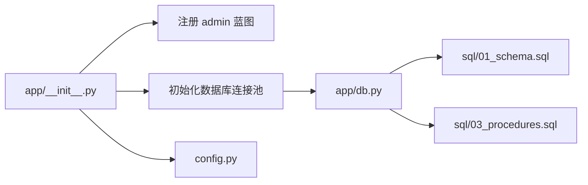

# 学期管理

<cite>
**本文引用的文件**
- [app/admin/routes.py](file://app/admin/routes.py)
- [app/templates/admin/semesters.html](file://app/templates/admin/semesters.html)
- [sql/01_schema.sql](file://sql/01_schema.sql)
- [sql/03_procedures.sql](file://sql/03_procedures.sql)
- [app/helpers.py](file://app/helpers.py)
- [app/db.py](file://app/db.py)
- [app/__init__.py](file://app/__init__.py)
- [config.py](file://config.py)
</cite>

## 目录
1. [简介](#简介)
2. [项目结构](#项目结构)
3. [核心组件](#核心组件)
4. [架构总览](#架构总览)
5. [详细组件分析](#详细组件分析)
6. [依赖分析](#依赖分析)
7. [性能考虑](#性能考虑)
8. [故障排查指南](#故障排查指南)
9. [结论](#结论)
10. [附录](#附录)

## 简介
本文件围绕“学期管理”功能进行系统化说明，覆盖以下方面：
- 学期的 CRUD 操作实现：创建、编辑、删除的路由处理逻辑与数据库操作。
- 当前学期设置机制：is_current 字段的管理策略与数据一致性保障。
- 时间范围验证规则：开始日期与结束日期的业务约束与冲突检测。
- 学期管理界面操作指南：状态显示、排序规则与用户交互流程。
- 与其他功能模块的关联：选课周期、开课申请等依赖关系。

## 项目结构
学期管理功能位于管理员后台模块，前端模板负责展示与交互，后端蓝图负责路由与业务处理，数据库层提供查询与事务支持。

图表来源
- [app/admin/routes.py:61-101](file://app/admin/routes.py#L61-L101)
- [app/templates/admin/semesters.html:1-67](file://app/templates/admin/semesters.html#L1-L67)
- [app/db.py:1-121](file://app/db.py#L1-L121)
- [sql/01_schema.sql:98-108](file://sql/01_schema.sql#L98-L108)
- [sql/03_procedures.sql:14-113](file://sql/03_procedures.sql#L14-L113)
- [app/helpers.py:66-79](file://app/helpers.py#L66-L79)
- [app/__init__.py:53-64](file://app/__init__.py#L53-L64)
- [config.py:6-36](file://config.py#L6-L36)

章节来源
- [app/admin/routes.py:61-101](file://app/admin/routes.py#L61-L101)
- [app/templates/admin/semesters.html:1-67](file://app/templates/admin/semesters.html#L1-L67)
- [app/db.py:1-121](file://app/db.py#L1-L121)
- [sql/01_schema.sql:98-108](file://sql/01_schema.sql#L98-L108)
- [sql/03_procedures.sql:14-113](file://sql/03_procedures.sql#L14-L113)
- [app/helpers.py:66-79](file://app/helpers.py#L66-L79)
- [app/__init__.py:53-64](file://app/__init__.py#L53-L64)
- [config.py:6-36](file://config.py#L6-L36)

## 核心组件
- 路由与控制器：提供学期列表、新增、编辑、删除的 HTTP 接口与权限校验。
- 数据库层：封装连接池、查询、分页与存储过程调用。
- 辅助函数：提供当前学期查询、选课时间段查询等通用能力。
- 前端模板：渲染学期表格、弹窗表单与状态徽章。
- 表结构：semesters 表包含名称、起止日期与 is_current 字段。

章节来源
- [app/admin/routes.py:61-101](file://app/admin/routes.py#L61-L101)
- [app/db.py:43-80](file://app/db.py#L43-L80)
- [app/helpers.py:66-79](file://app/helpers.py#L66-L79)
- [app/templates/admin/semesters.html:8-30](file://app/templates/admin/semesters.html#L8-L30)
- [sql/01_schema.sql:98-108](file://sql/01_schema.sql#L98-L108)

## 架构总览
学期管理采用典型的 MVC 分层：
- 视图层：Jinja2 模板渲染学期列表与表单。
- 控制器层：Flask 蓝图处理请求、参数校验与事务提交。
- 模型/服务层：数据库工具与存储过程封装业务逻辑。
- 数据层：MySQL 表结构与约束确保数据完整性。

图表来源
- [app/templates/admin/semesters.html:32-47](file://app/templates/admin/semesters.html#L32-L47)
- [app/admin/routes.py:68-100](file://app/admin/routes.py#L68-L100)
- [sql/03_procedures.sql:14-113](file://sql/03_procedures.sql#L14-L113)

## 详细组件分析

### 路由与控制器（学期 CRUD）
- 列表页：按 ID 降序展示所有学期。
- 新增：接收名称、起止日期与“设为当前学期”选项；若勾选则先清空历史 is_current，再插入新记录。
- 编辑：同新增的 is_current 处理逻辑；更新其余字段。
- 删除：直接删除对应学期记录。
- 日志：每次操作均记录系统日志，便于审计。

图表来源
- [app/admin/routes.py:61-101](file://app/admin/routes.py#L61-L101)
- [app/templates/admin/semesters.html:6-30](file://app/templates/admin/semesters.html#L6-L30)

章节来源
- [app/admin/routes.py:61-101](file://app/admin/routes.py#L61-L101)
- [app/templates/admin/semesters.html:6-30](file://app/templates/admin/semesters.html#L6-L30)

### 数据模型与约束
- semesters 表字段：id、name、start_date、end_date、is_current。
- 约束与索引：名称唯一、is_current 索引，便于快速定位当前学期。
- 外键关系：course_offerings、course_selection_periods 等表通过 semester_id 关联。

图表来源
- [sql/01_schema.sql:98-108](file://sql/01_schema.sql#L98-L108)
- [sql/01_schema.sql:129-155](file://sql/01_schema.sql#L129-L155)
- [sql/01_schema.sql:202-215](file://sql/01_schema.sql#L202-L215)

章节来源
- [sql/01_schema.sql:98-108](file://sql/01_schema.sql#L98-L108)
- [sql/01_schema.sql:129-155](file://sql/01_schema.sql#L129-L155)
- [sql/01_schema.sql:202-215](file://sql/01_schema.sql#L202-L215)

### 当前学期设置机制与一致性
- is_current 管理策略：当某学期被标记为“当前学期”时，系统会先将其他记录的 is_current 清零，确保同一时刻仅有一个当前学期。
- 辅助查询：helpers 提供按 is_current=1 查询当前学期的能力，用于默认筛选与业务逻辑。
- 选课/退课窗口：选课/退课时间段表通过 semester_id 与当前学期关联，确保选课窗口与学期一致。

图表来源
- [app/admin/routes.py:74-87](file://app/admin/routes.py#L74-L87)
- [app/helpers.py:66-79](file://app/helpers.py#L66-L79)

章节来源
- [app/admin/routes.py:74-87](file://app/admin/routes.py#L74-L87)
- [app/helpers.py:66-79](file://app/helpers.py#L66-L79)

### 时间范围验证规则与冲突检测
- 学期时间范围：前端模板要求开始日期与结束日期必填；数据库层面未见显式日期范围检查约束，需在业务层保证 start_date <= end_date。
- 选课窗口与学期绑定：选课/退课时间段表通过 semester_id 与学期关联，且查询时需满足 is_active=1 且当前时间处于 [start_time, end_time]。
- 选课/退课流程中的时间约束：存储过程在执行选课/退课时，会检查当前学期是否存在有效选课窗口，从而间接保证学期时间与选课周期的一致性。

图表来源
- [sql/03_procedures.sql:14-113](file://sql/03_procedures.sql#L14-L113)
- [app/helpers.py:66-79](file://app/helpers.py#L66-L79)

章节来源
- [sql/03_procedures.sql:14-113](file://sql/03_procedures.sql#L14-L113)
- [app/helpers.py:66-79](file://app/helpers.py#L66-L79)

### 学期管理界面操作指南
- 页面布局：顶部“添加学期”按钮，下方学期表格，包含 ID、名称、起止日期、当前学期状态与操作列。
- 状态显示：当前学期以“成功”徽章显示；非当前学期显示“-”。
- 排序规则：按 ID 降序排列，便于查看最新学期。
- 用户交互：
  - 新增：打开新增弹窗，填写名称、起止日期，勾选“设为当前学期”后提交。
  - 编辑：打开编辑弹窗，可修改名称、起止日期与当前学期状态。
  - 删除：点击删除按钮，弹出确认对话框，确认后执行删除。

章节来源
- [app/templates/admin/semesters.html:8-30](file://app/templates/admin/semesters.html#L8-L30)
- [app/templates/admin/semesters.html:32-65](file://app/templates/admin/semesters.html#L32-L65)

### 与其他功能模块的关联关系
- 选课周期：course_selection_periods 通过 semester_id 与 semesters 关联，选课/退课窗口必须落在某个学期范围内。
- 开课申请：course_offerings 通过 semester_id 与 semesters 关联，开课申请的状态流转与学期密切相关。
- 成绩与GPA：GPA计算与学期绑定，学期切换会影响统计口径。
- 学业预警：学业预警视图通常基于当前学期或指定学期进行统计。

章节来源
- [sql/01_schema.sql:129-155](file://sql/01_schema.sql#L129-L155)
- [sql/01_schema.sql:202-215](file://sql/01_schema.sql#L202-L215)
- [app/helpers.py:66-79](file://app/helpers.py#L66-L79)

## 依赖分析
- 蓝图注册：应用启动时注册 admin 蓝图，使学期管理路由生效。
- 数据库连接：db.py 提供连接池与查询工具，统一事务提交。
- 配置项：config.py 提供分页、权重等全局配置，影响学期相关统计与展示。

图表来源
- [app/__init__.py:53-64](file://app/__init__.py#L53-L64)
- [app/db.py:10-26](file://app/db.py#L10-L26)
- [config.py:6-36](file://config.py#L6-L36)

章节来源
- [app/__init__.py:53-64](file://app/__init__.py#L53-L64)
- [app/db.py:10-26](file://app/db.py#L10-L26)
- [config.py:6-36](file://config.py#L6-L36)

## 性能考虑
- 连接池：使用连接池减少频繁创建/销毁连接的开销，提升高并发场景下的响应速度。
- 索引优化：semesters 的 is_current 字段建立索引，便于快速定位当前学期。
- 分页查询：列表页使用分页工具，避免一次性加载大量数据。
- 事务边界：新增/编辑当前学期时，先清空旧记录再插入新记录，确保原子性与一致性。

章节来源
- [app/db.py:10-26](file://app/db.py#L10-L26)
- [sql/01_schema.sql:107](file://sql/01_schema.sql#L107)
- [app/db.py:92-120](file://app/db.py#L92-L120)
- [app/admin/routes.py:74-87](file://app/admin/routes.py#L74-L87)

## 故障排查指南
- 新增/编辑失败：检查表单必填字段与 is_current 逻辑；确认数据库连接池配置与权限。
- 删除异常：确认是否存在外键约束（如开课申请、选课时间段）导致删除失败。
- 当前学期不生效：检查 helpers 查询是否正确返回当前学期；确认 is_current 字段是否被正确更新。
- 选课/退课报错：确认当前学期是否存在有效选课窗口；检查存储过程返回码与消息。

章节来源
- [app/admin/routes.py:68-100](file://app/admin/routes.py#L68-L100)
- [app/helpers.py:66-79](file://app/helpers.py#L66-L79)
- [sql/03_procedures.sql:14-113](file://sql/03_procedures.sql#L14-L113)

## 结论
学期管理功能通过清晰的路由与模板、严谨的 is_current 管理策略以及与选课周期的紧密耦合，实现了稳定的学期生命周期管理。建议在业务层补充学期起止日期的显式校验，并持续监控连接池与索引性能，以保障高并发场景下的稳定性与一致性。

## 附录
- 常用路径参考
  - 学期管理页面：/admin/semesters
  - 新增接口：/admin/semesters/add
  - 编辑接口：/admin/semesters/<sid>/edit
  - 删除接口：/admin/semesters/<sid>/delete
- 相关配置
  - 分页大小：config.py 中 PER_PAGE
  - 选课窗口查询：helpers.get_active_selection_periods