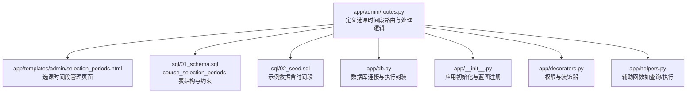
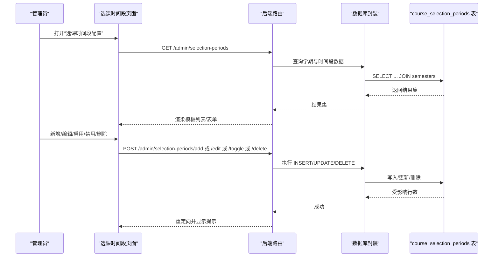
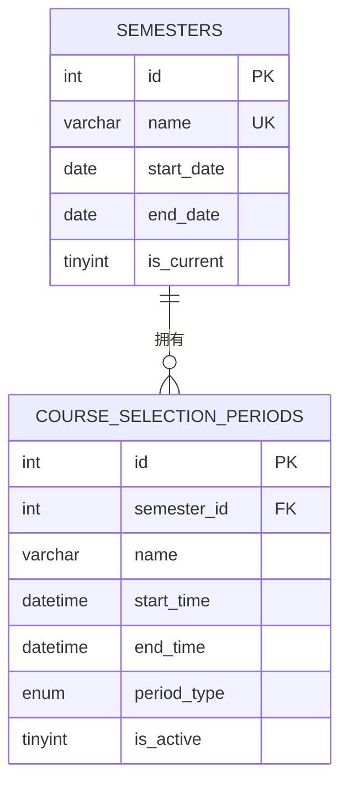
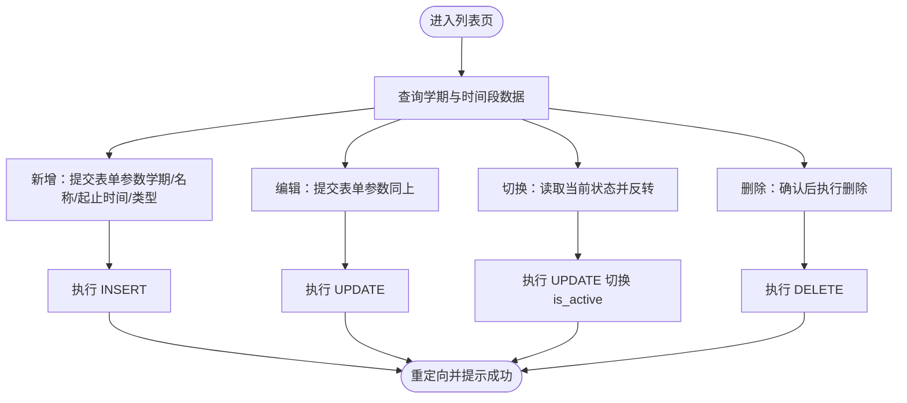
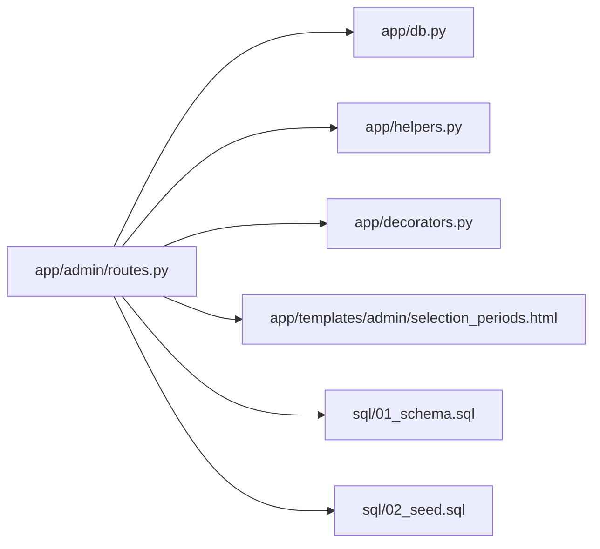

# 选课时间配置

<cite>
**本文引用的文件**
- [app/admin/routes.py](file://app/admin/routes.py)
- [app/templates/admin/selection_periods.html](file://app/templates/admin/selection_periods.html)
- [sql/01_schema.sql](file://sql/01_schema.sql)
- [sql/02_seed.sql](file://sql/02_seed.sql)
- [app/db.py](file://app/db.py)
- [app/__init__.py](file://app/__init__.py)
- [app/decorators.py](file://app/decorators.py)
- [app/helpers.py](file://app/helpers.py)
</cite>

## 目录
1. [简介](#简介)
2. [项目结构](#项目结构)
3. [核心组件](#核心组件)
4. [架构总览](#架构总览)
5. [详细组件分析](#详细组件分析)
6. [依赖分析](#依赖分析)
7. [性能考虑](#性能考虑)
8. [故障排除指南](#故障排除指南)
9. [结论](#结论)
10. [附录](#附录)

## 简介
本文件面向“选课时间配置”功能，系统化阐述选课时间段的创建、编辑、启用/禁用与删除的实现逻辑；解释时间段类型（选课/退课）的业务含义与配置方式；说明学期关联关系与外键约束；给出时间段有效性校验规则（时间重叠检测、学期范围匹配、状态控制）；并描述选课周期控制流程（时间段激活对系统选课功能的影响与数据同步）。最后提供完整的界面操作指南与业务流程说明。

## 项目结构
该功能由后端路由与模板共同构成：后端通过 Flask 蓝图提供 CRUD 接口与状态切换接口，并查询学期与时间段数据；前端模板负责展示列表、弹窗表单以及提交操作。

图表来源
- [app/admin/routes.py:442-488](file://app/admin/routes.py#L442-L488)
- [app/templates/admin/selection_periods.html:1-60](file://app/templates/admin/selection_periods.html#L1-L60)
- [sql/01_schema.sql:200-215](file://sql/01_schema.sql#L200-L215)
- [sql/02_seed.sql:43-48](file://sql/02_seed.sql#L43-L48)
- [app/db.py](file://app/db.py)
- [app/__init__.py](file://app/__init__.py)
- [app/decorators.py](file://app/decorators.py)
- [app/helpers.py](file://app/helpers.py)

章节来源
- [app/admin/routes.py:442-488](file://app/admin/routes.py#L442-L488)
- [app/templates/admin/selection_periods.html:1-60](file://app/templates/admin/selection_periods.html#L1-L60)
- [sql/01_schema.sql:200-215](file://sql/01_schema.sql#L200-L215)
- [sql/02_seed.sql:43-48](file://sql/02_seed.sql#L43-L48)

## 核心组件
- 数据模型：course_selection_periods（选课时间段表）
  - 字段：id、semester_id、name、start_time、end_time、period_type、is_active
  - 约束：外键 semester_id 引用 semesters；索引覆盖学期与时间范围；默认启用
- 后端路由：提供列表、新增、编辑、启用/禁用、删除接口
- 前端模板：表格展示、弹窗表单、状态徽章、操作按钮
- 数据库封装：统一的查询/执行接口，便于事务与日志记录

章节来源
- [sql/01_schema.sql:200-215](file://sql/01_schema.sql#L200-L215)
- [app/admin/routes.py:442-488](file://app/admin/routes.py#L442-L488)
- [app/templates/admin/selection_periods.html:1-60](file://app/templates/admin/selection_periods.html#L1-L60)

## 架构总览
下图展示了“选课时间配置”的端到端交互：管理员在后台页面发起操作，后端路由接收请求并调用数据库封装执行 SQL，最终刷新页面返回最新数据。

图表来源
- [app/admin/routes.py:442-488](file://app/admin/routes.py#L442-L488)
- [app/templates/admin/selection_periods.html:1-60](file://app/templates/admin/selection_periods.html#L1-L60)
- [sql/01_schema.sql:200-215](file://sql/01_schema.sql#L200-L215)

## 详细组件分析

### 数据模型与约束
- course_selection_periods
  - 主键：id
  - 外键：semester_id → semesters(id)，级联更新/删除
  - 索引：按学期与时间范围建立索引，支持高效查询
  - 默认值：is_active 默认为 1（启用）
  - 类型枚举：period_type ∈ {'selection','drop'}

图表来源
- [sql/01_schema.sql:98-108](file://sql/01_schema.sql#L98-L108)
- [sql/01_schema.sql:200-215](file://sql/01_schema.sql#L200-L215)

章节来源
- [sql/01_schema.sql:98-108](file://sql/01_schema.sql#L98-L108)
- [sql/01_schema.sql:200-215](file://sql/01_schema.sql#L200-L215)

### 后端路由与业务逻辑
- 列表页
  - 路由：GET /admin/selection-periods
  - 功能：联表查询学期与时间段，按 id 倒序展示
- 新增
  - 路由：POST /admin/selection-periods/add
  - 功能：插入一条新的时间段记录
- 编辑
  - 路由：POST /admin/selection-periods/<pid>/edit
  - 功能：根据 pid 更新学期、名称、起止时间、类型
- 启用/禁用
  - 路由：POST /admin/selection-periods/<pid>/toggle
  - 功能：切换 is_active 状态
- 删除
  - 路由：POST /admin/selection-periods/<pid>/delete
  - 功能：删除指定时间段记录

图表来源
- [app/admin/routes.py:442-488](file://app/admin/routes.py#L442-L488)

章节来源
- [app/admin/routes.py:442-488](file://app/admin/routes.py#L442-L488)

### 前端界面与交互
- 页面标题与布局：基于 base.html，块内容为“选课时间段配置”
- 列表字段：ID、学期、名称、开始时间、结束时间、类型、状态、操作
- 操作按钮：
  - 编辑：弹出编辑模态框
  - 启用/禁用：POST 提交至 toggle 路由，自动切换状态
  - 删除：POST 提交至 delete 路由，带确认对话框
- 新增模态框：包含学期选择、名称、起止时间、类型（选课/退课）字段

章节来源
- [app/templates/admin/selection_periods.html:1-60](file://app/templates/admin/selection_periods.html#L1-L60)

### 时间段类型与业务含义
- 选课（selection）：允许学生进行选课或补退选的开放窗口
- 退课（drop）：允许学生进行退课的开放窗口
- 类型字段为枚举值，用于区分不同阶段的业务行为

章节来源
- [sql/01_schema.sql](file://sql/01_schema.sql#L209)
- [app/templates/admin/selection_periods.html:13-13](file://app/templates/admin/selection_periods.html#L13-L13)

### 学期关联与外键约束
- course_selection_periods.semester_id 引用 semesters.id
- 级联更新：修改学期主键时，时间段自动跟随更新
- 级联删除：删除学期时，其下所有时间段被一并删除
- 示例数据中包含多个时间段与学期的绑定关系

章节来源
- [sql/01_schema.sql:213-214](file://sql/01_schema.sql#L213-L214)
- [sql/02_seed.sql:44-47](file://sql/02_seed.sql#L44-L47)

### 有效性验证规则
- 时间重叠检测：当前实现未在数据库层显式约束时间重叠，建议在业务层进行校验，避免同一学期内存在时间冲突的时间段
- 学期范围匹配：时间段的起止时间应落在对应学期的 start_date 至 end_date 范围内
- 状态控制：仅启用（is_active=1）的时间段参与系统选课周期判断
- 类型约束：period_type 仅允许 'selection' 或 'drop'

章节来源
- [sql/01_schema.sql](file://sql/01_schema.sql#L209)
- [sql/01_schema.sql:213-214](file://sql/01_schema.sql#L213-L214)

### 选课周期控制流程
- 激活影响：仅启用的时间段会作为系统选课周期的依据
- 数据同步：时间段状态变更后，前端即时反映（启用/禁用徽章），后续业务逻辑可据此过滤可用窗口
- 建议扩展：可在业务层增加“当前有效时间段”计算逻辑，结合学期当前状态与时间段启用状态，动态确定系统处于哪个阶段

章节来源
- [app/admin/routes.py:475-481](file://app/admin/routes.py#L475-L481)
- [app/templates/admin/selection_periods.html:13-14](file://app/templates/admin/selection_periods.html#L13-L14)

## 依赖分析
- 组件耦合
  - 路由层依赖数据库封装（查询/执行）
  - 模板依赖路由提供的数据结构（学期列表、时间段列表）
  - 数据层依赖表结构与约束
- 外部依赖
  - Flask 蓝图与模板渲染
  - MySQL（通过封装执行 SQL）

图表来源
- [app/admin/routes.py:442-488](file://app/admin/routes.py#L442-L488)
- [app/db.py](file://app/db.py)
- [app/helpers.py](file://app/helpers.py)
- [app/decorators.py](file://app/decorators.py)
- [app/templates/admin/selection_periods.html:1-60](file://app/templates/admin/selection_periods.html#L1-L60)
- [sql/01_schema.sql:200-215](file://sql/01_schema.sql#L200-L215)
- [sql/02_seed.sql:43-48](file://sql/02_seed.sql#L43-L48)

章节来源
- [app/admin/routes.py:442-488](file://app/admin/routes.py#L442-L488)
- [app/db.py](file://app/db.py)
- [app/helpers.py](file://app/helpers.py)
- [app/decorators.py](file://app/decorators.py)
- [app/templates/admin/selection_periods.html:1-60](file://app/templates/admin/selection_periods.html#L1-L60)
- [sql/01_schema.sql:200-215](file://sql/01_schema.sql#L200-L215)
- [sql/02_seed.sql:43-48](file://sql/02_seed.sql#L43-L48)

## 性能考虑
- 查询优化：course_selection_periods 对 semester_id 与 (start_time,end_time) 建有索引，有利于按学期筛选与时间范围查询
- 写入优化：新增/编辑/删除均为单表写操作，复杂度 O(1)，建议在高并发场景下配合事务与唯一约束
- 前端渲染：列表按 id 倒序，便于新记录优先展示；若数据量大，建议分页或虚拟滚动

章节来源
- [sql/01_schema.sql:211-212](file://sql/01_schema.sql#L211-L212)

## 故障排除指南
- 新增失败
  - 检查必填字段是否完整（学期、名称、起止时间、类型）
  - 检查时间格式与合法性
- 编辑失败
  - 确认传入的 pid 是否存在
  - 检查类型枚举值是否正确
- 启用/禁用无效
  - 确认请求是否为 POST
  - 检查 CSRF 令牌是否正确
- 删除失败
  - 确认是否存在外键依赖（如已有选课记录）
- 日志追踪
  - 后端记录了相关操作日志，可用于审计与问题定位

章节来源
- [app/admin/routes.py:451-488](file://app/admin/routes.py#L451-L488)

## 结论
“选课时间配置”功能以 course_selection_periods 为核心，通过简洁的 CRUD 与状态切换接口实现了对选课周期的精细化管理。结合学期外键约束与前端直观界面，管理员可以高效地维护不同阶段（选课/退课）的时间窗口。建议在业务层补充时间重叠检测与学期范围校验，以进一步提升系统的健壮性与一致性。

## 附录

### 界面操作指南
- 进入“选课时间段配置”页面
- 新增：点击“+ 添加时间段”，填写学期、名称、起止时间、类型，提交保存
- 编辑：点击“编辑”，修改相应字段后提交
- 启用/禁用：点击“启用/禁用”，状态即时切换
- 删除：点击“删除”，弹窗确认后执行删除

章节来源
- [app/templates/admin/selection_periods.html:5-25](file://app/templates/admin/selection_periods.html#L5-L25)

### 业务流程说明
- 配置阶段：管理员在后台设置各学期的“选课/退课”时间段
- 生效阶段：仅启用的时间段参与系统选课周期判断
- 使用阶段：学生在对应时间段内进行选课/退课操作
- 维护阶段：根据学期进度调整时间段状态与类型

章节来源
- [app/admin/routes.py:442-488](file://app/admin/routes.py#L442-L488)
- [app/templates/admin/selection_periods.html:1-60](file://app/templates/admin/selection_periods.html#L1-L60)