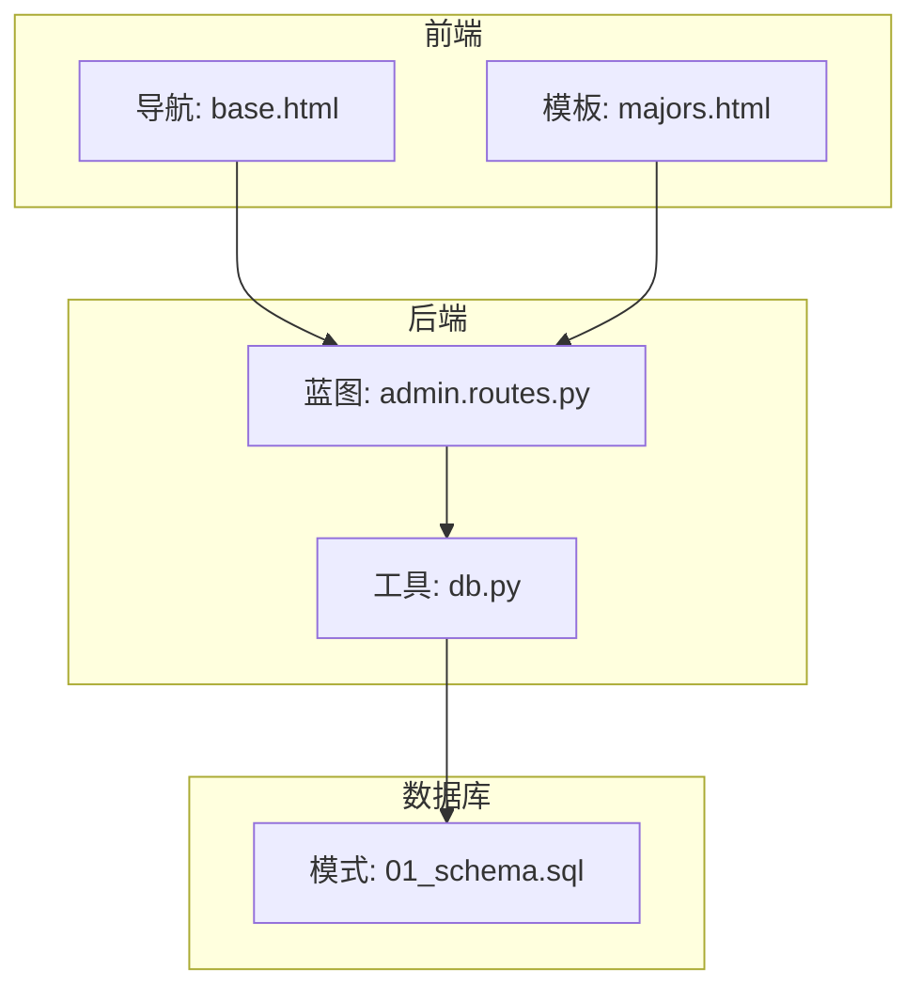
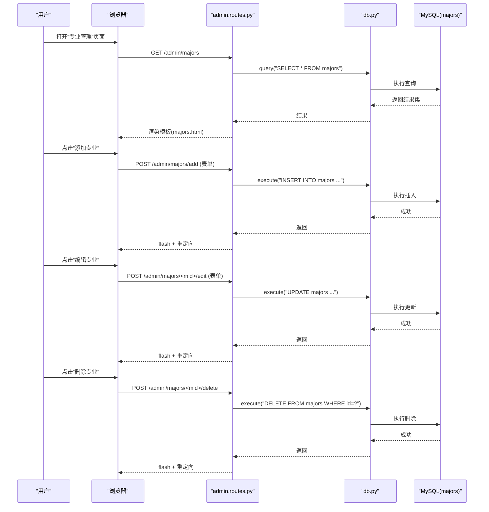
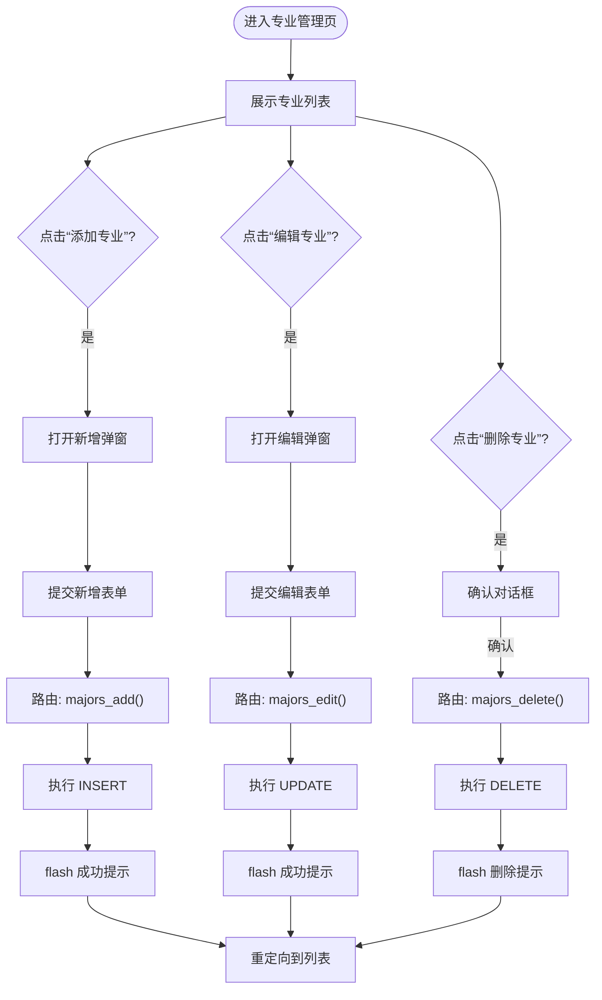
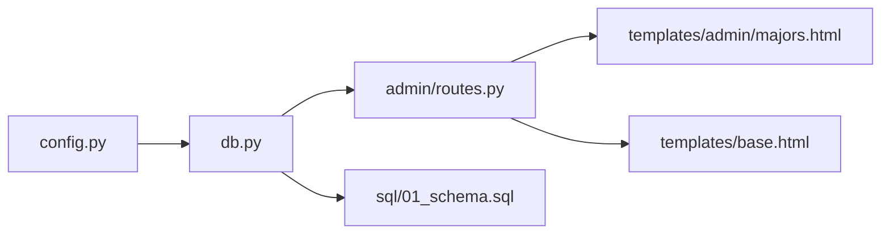

# 专业管理

<cite>
**本文引用的文件**
- [app/admin/routes.py](file://app/admin/routes.py)
- [app/templates/admin/majors.html](file://app/templates/admin/majors.html)
- [sql/01_schema.sql](file://sql/01_schema.sql)
- [app/db.py](file://app/db.py)
- [app/templates/base.html](file://app/templates/base.html)
- [config.py](file://config.py)
- [README.md](file://README.md)
</cite>

## 目录
1. [简介](#简介)
2. [项目结构](#项目结构)
3. [核心组件](#核心组件)
4. [架构总览](#架构总览)
5. [详细组件分析](#详细组件分析)
6. [依赖分析](#依赖分析)
7. [性能考虑](#性能考虑)
8. [故障排查指南](#故障排查指南)
9. [结论](#结论)
10. [附录](#附录)

## 简介
本文件面向“专业管理”功能，系统性说明专业信息的增删改查实现、字段定义与校验规则、界面交互流程、与其他模块（班级、学生）的关联关系，以及操作最佳实践与注意事项。该系统基于 Flask + MySQL，采用模板渲染与原生 SQL 的组合方式实现。

## 项目结构
围绕专业管理的关键文件与职责如下：
- 数据库层：通过建表脚本定义专业表结构及唯一约束
- 应用层：管理员蓝图提供专业管理路由与页面跳转
- 模板层：专业管理页面负责展示与表单提交
- 工具层：数据库连接池与查询封装
- 配置层：数据库连接参数与分页设置

图表来源
- [app/templates/admin/majors.html:1-53](file://app/templates/admin/majors.html#L1-L53)
- [app/templates/base.html:24-32](file://app/templates/base.html#L24-L32)
- [app/admin/routes.py:120-135](file://app/admin/routes.py#L120-L135)
- [app/db.py:43-51](file://app/db.py#L43-L51)
- [sql/01_schema.sql:28-37](file://sql/01_schema.sql#L28-L37)

章节来源
- [app/templates/admin/majors.html:1-53](file://app/templates/admin/majors.html#L1-L53)
- [app/templates/base.html:24-32](file://app/templates/base.html#L24-L32)
- [app/admin/routes.py:120-135](file://app/admin/routes.py#L120-L135)
- [app/db.py:1-120](file://app/db.py#L1-L120)
- [sql/01_schema.sql:28-37](file://sql/01_schema.sql#L28-L37)

## 核心组件
- 专业表（majors）
  - 字段：id（主键）、name（名称，非空）、code（代码，非空且唯一）、description（描述，可空）
  - 约束：code 唯一索引
- 管理端路由
  - 列表页：渲染专业列表与操作按钮
  - 新增：接收表单并插入记录
  - 编辑：接收表单并更新记录
  - 删除：删除指定记录并记录日志
- 模板页面
  - 提供“添加专业”和“编辑专业”的弹窗表单
  - 表单字段与专业表字段一一对应
- 数据库工具
  - 封装连接池、查询与执行方法，支持分页查询

章节来源
- [sql/01_schema.sql:28-37](file://sql/01_schema.sql#L28-L37)
- [app/admin/routes.py:120-135](file://app/admin/routes.py#L120-L135)
- [app/templates/admin/majors.html:23-52](file://app/templates/admin/majors.html#L23-L52)
- [app/db.py:43-51](file://app/db.py#L43-L51)

## 架构总览
专业管理在系统中的交互链路如下：

图表来源
- [app/admin/routes.py:120-135](file://app/admin/routes.py#L120-L135)
- [app/db.py:43-51](file://app/db.py#L43-L51)
- [sql/01_schema.sql:28-37](file://sql/01_schema.sql#L28-L37)

## 详细组件分析

### 专业表结构与字段定义
- 字段说明
  - id：自增主键
  - name：专业名称，非空
  - code：专业代码，非空且全局唯一
  - description：专业描述，可空
- 约束与索引
  - code 上建立唯一索引，确保代码不重复
- 复杂度与性能
  - 唯一键查询的时间复杂度为 O(log N)
  - 建议在高频搜索场景下保持 code 的高选择性

章节来源
- [sql/01_schema.sql:28-37](file://sql/01_schema.sql#L28-L37)

### 界面与表单交互流程
- 页面入口
  - 管理员导航菜单中提供“专业管理”入口
- 列表页
  - 展示专业列表，包含“编辑”“删除”操作
  - 删除前弹出确认提示，提示删除对“关联班级”的影响
- 新增弹窗
  - 表单字段：名称、代码、描述
  - 表单必填项：名称、代码
- 编辑弹窗
  - 表单字段：名称、代码、描述
  - 默认值来自当前记录
- 表单提交与路由
  - 新增：POST /admin/majors/add
  - 编辑：POST /admin/majors/<mid>/edit
  - 删除：POST /admin/majors/<mid>/delete

图表来源
- [app/templates/admin/majors.html:5-21](file://app/templates/admin/majors.html#L5-L21)
- [app/templates/admin/majors.html:23-52](file://app/templates/admin/majors.html#L23-L52)
- [app/admin/routes.py:120-135](file://app/admin/routes.py#L120-L135)

章节来源
- [app/templates/admin/majors.html:1-53](file://app/templates/admin/majors.html#L1-L53)
- [app/templates/base.html:24-32](file://app/templates/base.html#L24-L32)
- [app/admin/routes.py:120-135](file://app/admin/routes.py#L120-L135)

### 数据验证与业务约束
- 前端约束
  - 新增与编辑表单均标记“名称”“代码”为必填
  - 删除操作具备用户二次确认
- 后端约束
  - 数据库层面通过唯一索引保证 code 不重复
  - 插入/更新时由应用层接收表单并执行 SQL
- 外键约束与删除风险
  - 当前专业表未被其他表显式声明为外键引用
  - 删除专业不会触发数据库级外键约束回滚
  - 删除前需关注是否存在关联班级，避免数据不一致

章节来源
- [app/templates/admin/majors.html:29-31](file://app/templates/admin/majors.html#L29-L31)
- [app/templates/admin/majors.html:44-46](file://app/templates/admin/majors.html#L44-L46)
- [sql/01_schema.sql:28-37](file://sql/01_schema.sql#L28-L37)
- [app/admin/routes.py:128-133](file://app/admin/routes.py#L128-L133)

### 与其他模块的关联关系
- 班级管理
  - 班级表包含 major_id 字段，用于关联专业
  - 专业删除可能影响班级归属，应先迁移或删除相关班级
- 学生信息
  - 学生信息通常包含所属专业的标识字段
  - 专业删除前应处理学生归属，避免悬挂引用

章节来源
- [app/admin/routes.py:136-142](file://app/admin/routes.py#L136-L142)
- [sql/01_schema.sql:28-37](file://sql/01_schema.sql#L28-L37)

### 操作最佳实践
- 新增专业
  - 确保 code 具备唯一性与可识别性
  - 名称与代码建议遵循统一命名规范
- 编辑专业
  - 更新 code 时需再次确认唯一性
  - 对历史班级与学生的影响进行评估
- 删除专业
  - 删除前必须清理或迁移所有关联班级
  - 记录删除动作以便审计追踪

章节来源
- [app/admin/routes.py:128-133](file://app/admin/routes.py#L128-L133)
- [app/templates/admin/majors.html:13-16](file://app/templates/admin/majors.html#L13-L16)

## 依赖分析
- 组件耦合
  - 模板依赖路由提供的数据上下文
  - 路由依赖数据库工具层的查询/执行能力
  - 数据库层依赖 MySQL 引擎与表结构
- 外部依赖
  - Flask、PyMySQL、DBUtils、Werkzeug、WTForms
- 配置依赖
  - 数据库连接参数与连接池配置
  - 分页参数 PER_PAGE

图表来源
- [config.py:11-25](file://config.py#L11-L25)
- [app/db.py:10-26](file://app/db.py#L10-L26)
- [app/admin/routes.py:120-135](file://app/admin/routes.py#L120-L135)
- [app/templates/admin/majors.html:1-53](file://app/templates/admin/majors.html#L1-L53)
- [app/templates/base.html:24-32](file://app/templates/base.html#L24-L32)
- [sql/01_schema.sql:28-37](file://sql/01_schema.sql#L28-L37)

章节来源
- [config.py:11-25](file://config.py#L11-L25)
- [app/db.py:10-26](file://app/db.py#L10-L26)
- [app/admin/routes.py:120-135](file://app/admin/routes.py#L120-L135)
- [app/templates/admin/majors.html:1-53](file://app/templates/admin/majors.html#L1-L53)
- [app/templates/base.html:24-32](file://app/templates/base.html#L24-L32)
- [sql/01_schema.sql:28-37](file://sql/01_schema.sql#L28-L37)

## 性能考虑
- 查询性能
  - 专业列表使用简单查询，无复杂联表，性能开销低
  - code 唯一索引有利于去重与查找
- 写入性能
  - 插入/更新均为单表写入，SQL 执行成本低
- 连接池
  - 使用 DBUtils 连接池减少连接开销，提升并发能力
- 分页
  - 可通过分页工具函数控制每页数量，降低一次性传输量

章节来源
- [app/db.py:94-120](file://app/db.py#L94-L120)
- [config.py:20-25](file://config.py#L20-L25)

## 故障排查指南
- 新增失败（唯一约束冲突）
  - 现象：提交后无变化或出现异常提示
  - 排查：确认 code 是否已存在；检查唯一索引是否生效
- 编辑失败（唯一约束冲突）
  - 现象：更新 code 时失败
  - 排查：确保新 code 在全局唯一；必要时回滚或更换
- 删除失败（外键约束/业务依赖）
  - 现象：删除后班级归属异常或业务逻辑不一致
  - 排查：确认是否存在关联班级；优先迁移或删除班级后再删除专业
- CSRF 或权限问题
  - 现象：表单提交被拒绝
  - 排查：确认模板中包含 CSRF 字段；登录状态与角色权限正确
- 数据库连接异常
  - 现象：查询/执行报错
  - 排查：检查数据库连接参数与连接池配置；确认数据库服务运行正常

章节来源
- [app/templates/admin/majors.html:13-16](file://app/templates/admin/majors.html#L13-L16)
- [app/admin/routes.py:128-133](file://app/admin/routes.py#L128-L133)
- [app/db.py:10-26](file://app/db.py#L10-L26)
- [config.py:11-17](file://config.py#L11-L17)

## 结论
专业管理功能以简洁的单表操作为核心，结合模板表单与路由处理实现了完整的增删改查流程。其关键在于：
- 明确的字段与唯一约束保障数据一致性
- 前后端协同的表单校验与用户确认
- 与其他模块（班级、学生）的关联关系需要在删除等变更前进行治理

## 附录
- 快速启动与环境准备参见项目说明
- 数据库初始化顺序与测试账户信息参见项目说明

章节来源
- [README.md:12-36](file://README.md#L12-L36)