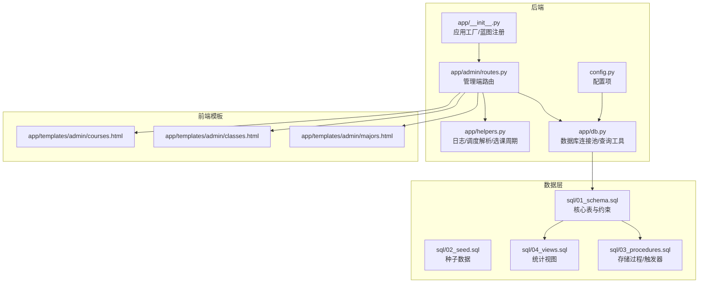
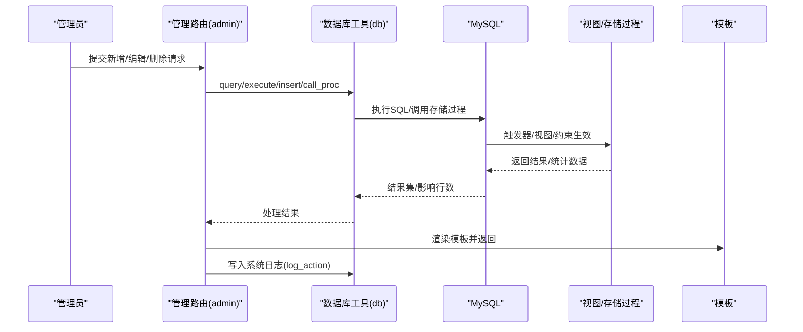
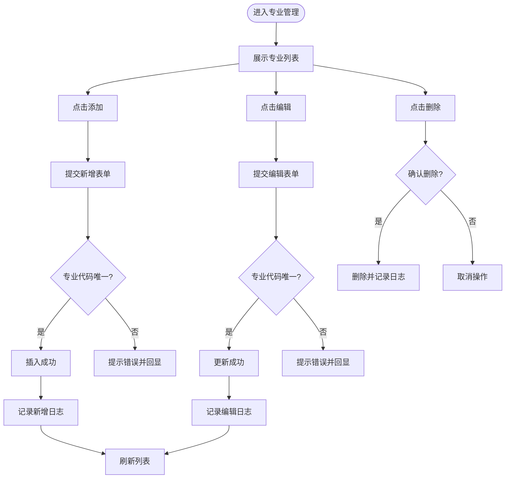
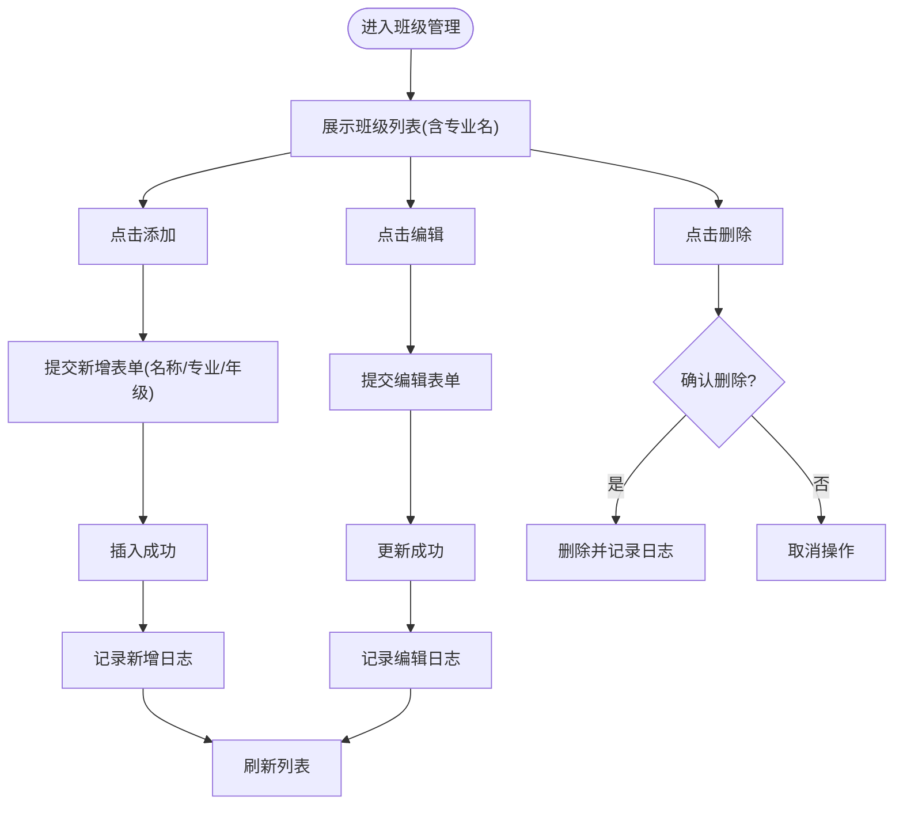
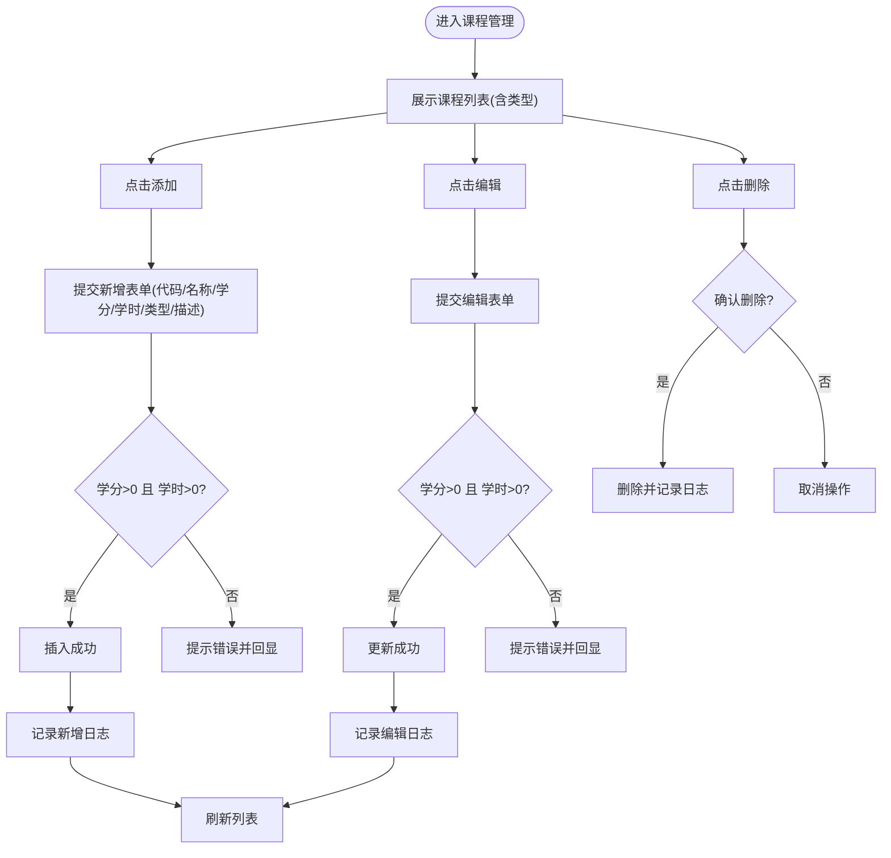
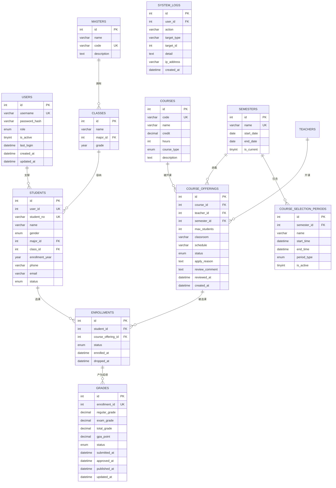
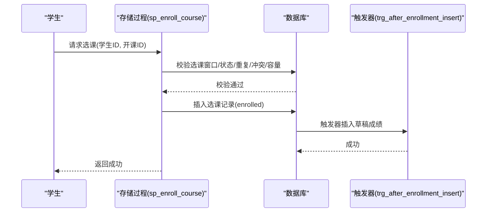
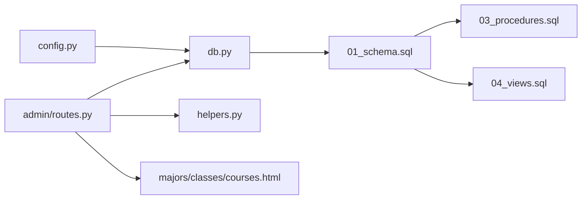

# 学术管理

<cite>
**本文引用的文件**
- [app/__init__.py](file://app/__init__.py)
- [app/admin/routes.py](file://app/admin/routes.py)
- [app/db.py](file://app/db.py)
- [app/helpers.py](file://app/helpers.py)
- [config.py](file://config.py)
- [sql/01_schema.sql](file://sql/01_schema.sql)
- [sql/02_seed.sql](file://sql/02_seed.sql)
- [sql/03_procedures.sql](file://sql/03_procedures.sql)
- [sql/04_views.sql](file://sql/04_views.sql)
- [app/templates/admin/majors.html](file://app/templates/admin/majors.html)
- [app/templates/admin/classes.html](file://app/templates/admin/classes.html)
- [app/templates/admin/courses.html](file://app/templates/admin/courses.html)
</cite>

## 目录
1. [简介](#简介)
2. [项目结构](#项目结构)
3. [核心组件](#核心组件)
4. [架构总览](#架构总览)
5. [详细组件分析](#详细组件分析)
6. [依赖分析](#依赖分析)
7. [性能考虑](#性能考虑)
8. [故障排查指南](#故障排查指南)
9. [结论](#结论)
10. [附录](#附录)

## 简介
本文件面向“学术管理”功能，围绕专业管理、班级管理、课程管理三大模块，系统化梳理数据模型、业务流程、界面交互与约束规则，帮助管理员高效维护教学基础数据，确保数据一致性与业务合规性。

## 项目结构
- 后端采用 Flask + MySQL，使用连接池与蓝图组织管理端路由。
- 数据层由建表脚本、种子数据、存储过程与视图构成，形成稳定的业务规则与统计口径。
- 管理端模板负责专业、班级、课程的增删改查与分页展示。

图表来源
- [app/__init__.py:29-64](file://app/__init__.py#L29-L64)
- [app/admin/routes.py:11-120](file://app/admin/routes.py#L11-L120)
- [app/db.py:10-41](file://app/db.py#L10-L41)
- [app/helpers.py:9-21](file://app/helpers.py#L9-L21)
- [config.py:6-36](file://config.py#L6-L36)
- [sql/01_schema.sql:12-235](file://sql/01_schema.sql#L12-L235)
- [sql/03_procedures.sql:7-381](file://sql/03_procedures.sql#L7-L381)
- [sql/04_views.sql:7-113](file://sql/04_views.sql#L7-L113)
- [app/templates/admin/majors.html:1-54](file://app/templates/admin/majors.html#L1-L54)
- [app/templates/admin/classes.html:1-62](file://app/templates/admin/classes.html#L1-L62)
- [app/templates/admin/courses.html:1-76](file://app/templates/admin/courses.html#L1-L76)

章节来源
- [app/__init__.py:29-64](file://app/__init__.py#L29-L64)
- [app/admin/routes.py:11-120](file://app/admin/routes.py#L11-L120)
- [app/db.py:10-41](file://app/db.py#L10-L41)
- [config.py:6-36](file://config.py#L6-L36)

## 核心组件
- 应用工厂与蓝图：初始化 CSRF、数据库连接池、登录管理与蓝图注册。
- 管理端路由：集中实现专业、班级、课程的增删改查与分页检索。
- 数据库工具：封装连接池、查询、分页、存储过程调用。
- 辅助工具：系统日志记录、课表解析与选课周期查询。
- 数据模型：基于 12 张核心表，定义专业/班级/课程等实体及其约束。
- 存储过程与触发器：封装选课/退课、成绩计算、开课审核、日志记录等业务规则。
- 统计视图：提供选课统计、成绩单、教师工作量等报表口径。

章节来源
- [app/__init__.py:29-64](file://app/__init__.py#L29-L64)
- [app/admin/routes.py:11-120](file://app/admin/routes.py#L11-L120)
- [app/db.py:43-121](file://app/db.py#L43-L121)
- [app/helpers.py:9-80](file://app/helpers.py#L9-L80)
- [sql/01_schema.sql:12-235](file://sql/01_schema.sql#L12-L235)
- [sql/03_procedures.sql:7-381](file://sql/03_procedures.sql#L7-L381)
- [sql/04_views.sql:7-113](file://sql/04_views.sql#L7-L113)

## 架构总览
管理端通过蓝图路由接收请求，经数据库工具执行 SQL 或调用存储过程，结合视图提供统计信息，最终渲染模板返回页面。所有写操作均记录系统日志，便于审计与追踪。

图表来源
- [app/admin/routes.py:11-120](file://app/admin/routes.py#L11-L120)
- [app/db.py:43-121](file://app/db.py#L43-L121)
- [app/helpers.py:9-21](file://app/helpers.py#L9-L21)
- [sql/03_procedures.sql:7-381](file://sql/03_procedures.sql#L7-L381)
- [sql/04_views.sql:7-113](file://sql/04_views.sql#L7-L113)

## 详细组件分析

### 专业管理
- 功能范围：专业列表展示、添加、编辑、删除。
- 数据模型：majors 表，包含唯一编码约束与描述字段。
- 界面交互：模板提供弹窗表单，提交至对应路由。
- 业务规则：
  - 新增/编辑时，专业代码唯一。
  - 删除时受外键约束保护（RESTRICT），避免破坏关联数据。
- 日志记录：所有变更均写入系统日志，便于审计。

图表来源
- [app/admin/routes.py:104-134](file://app/admin/routes.py#L104-L134)
- [sql/01_schema.sql:31-37](file://sql/01_schema.sql#L31-L37)
- [app/templates/admin/majors.html:1-54](file://app/templates/admin/majors.html#L1-L54)

章节来源
- [app/admin/routes.py:104-134](file://app/admin/routes.py#L104-L134)
- [sql/01_schema.sql:31-37](file://sql/01_schema.sql#L31-L37)
- [app/templates/admin/majors.html:1-54](file://app/templates/admin/majors.html#L1-L54)

### 班级管理
- 功能范围：班级列表展示、添加、编辑、删除；支持按专业筛选。
- 数据模型：classes 表，与 majors 通过外键关联，受 RESTRICT 删除策略保护。
- 界面交互：模板提供弹窗表单，选择所属专业与年级。
- 业务规则：
  - 班级名称与专业、年级组合需满足业务合理性。
  - 删除时受外键约束保护。
- 关联关系：班级与学生、课程安排存在间接关联（通过学生与开课）。

图表来源
- [app/admin/routes.py:137-169](file://app/admin/routes.py#L137-L169)
- [sql/01_schema.sql:42-50](file://sql/01_schema.sql#L42-L50)
- [app/templates/admin/classes.html:1-62](file://app/templates/admin/classes.html#L1-L62)

章节来源
- [app/admin/routes.py:137-169](file://app/admin/routes.py#L137-L169)
- [sql/01_schema.sql:42-50](file://sql/01_schema.sql#L42-L50)
- [app/templates/admin/classes.html:1-62](file://app/templates/admin/classes.html#L1-L62)

### 课程管理
- 功能范围：课程列表展示、添加、编辑、删除；支持学分、学时、类型与描述维护。
- 数据模型：courses 表，包含学分与学时正数校验、课程类型枚举、唯一编码约束。
- 界面交互：模板提供弹窗表单，包含课程代码、名称、学分、学时、类型、描述。
- 业务规则：
  - 学分与学时必须大于 0。
  - 课程类型为必修/选修/任选之一。
  - 课程代码唯一。
- 维护要点：课程信息直接影响开课申请、选课统计与成绩计算。

图表来源
- [app/admin/routes.py:171-206](file://app/admin/routes.py#L171-L206)
- [sql/01_schema.sql:113-125](file://sql/01_schema.sql#L113-L125)
- [app/templates/admin/courses.html:1-76](file://app/templates/admin/courses.html#L1-L76)

章节来源
- [app/admin/routes.py:171-206](file://app/admin/routes.py#L171-L206)
- [sql/01_schema.sql:113-125](file://sql/01_schema.sql#L113-L125)
- [app/templates/admin/courses.html:1-76](file://app/templates/admin/courses.html#L1-L76)

### 数据模型与约束
- 核心实体与关系：
  - users：统一身份账户，角色区分。
  - majors：专业信息。
  - classes：班级，关联专业。
  - students：学生，关联 users、majors、classes。
  - courses：课程，包含学分、学时、类型。
  - course_offerings：开课申请，关联课程、教师、学期。
  - enrollments：选课记录，关联学生与开课。
  - grades：成绩，关联选课记录。
  - course_selection_periods：选课/退课时间段。
  - system_logs：系统日志。
- 约束与索引：
  - 唯一约束保证关键字段唯一性（如专业代码、课程代码、学号、教师编号）。
  - 外键约束与级联策略保障数据完整性（如删除专业/班级/课程时的限制与更新策略）。
  - 检查约束确保数值范围合理（如学分、学时、成绩范围）。

图表来源
- [sql/01_schema.sql:12-235](file://sql/01_schema.sql#L12-L235)

章节来源
- [sql/01_schema.sql:12-235](file://sql/01_schema.sql#L12-L235)

### 业务规则与流程（选课/退课/成绩）
- 选课流程：
  - 必须处于选课窗口期内。
  - 课程状态必须为“已发布”。
  - 不得重复选课。
  - 时间冲突检测（基于 schedule 字段）。
  - 人数上限检查。
  - 原子性写入 enrollments，并自动创建 grades 记录。
- 退课流程：
  - 必须处于退课窗口期内。
  - 不能退课已有非草稿成绩的记录。
  - 原子性更新状态并清理草稿成绩。
- 成绩计算：
  - 触发器在更新平时/期末成绩时自动计算总评与绩点。
  - 存储过程提供学期 GPA 计算与总评计算入口。
- 开课审核：
  - 管理员对开课申请进行审批，状态变更触发日志记录。

图表来源
- [sql/03_procedures.sql:14-113](file://sql/03_procedures.sql#L14-L113)
- [sql/03_procedures.sql:327-335](file://sql/03_procedures.sql#L327-L335)

章节来源
- [sql/03_procedures.sql:14-113](file://sql/03_procedures.sql#L14-L113)
- [sql/03_procedures.sql:327-335](file://sql/03_procedures.sql#L327-L335)

## 依赖分析
- 路由依赖数据库工具与配置，间接依赖存储过程与视图。
- 数据库工具依赖连接池配置与 MySQL 驱动。
- 辅助工具依赖请求上下文与数据库查询。
- 模板依赖路由提供的数据与 CSRF 保护。

图表来源
- [app/admin/routes.py:11-120](file://app/admin/routes.py#L11-L120)
- [app/db.py:10-41](file://app/db.py#L10-L41)
- [app/helpers.py:9-21](file://app/helpers.py#L9-L21)
- [config.py:6-36](file://config.py#L6-L36)
- [sql/01_schema.sql:12-235](file://sql/01_schema.sql#L12-L235)
- [sql/03_procedures.sql:7-381](file://sql/03_procedures.sql#L7-L381)
- [sql/04_views.sql:7-113](file://sql/04_views.sql#L7-L113)

章节来源
- [app/admin/routes.py:11-120](file://app/admin/routes.py#L11-L120)
- [app/db.py:10-41](file://app/db.py#L10-L41)
- [app/helpers.py:9-21](file://app/helpers.py#L9-L21)
- [config.py:6-36](file://config.py#L6-L36)
- [sql/01_schema.sql:12-235](file://sql/01_schema.sql#L12-L235)
- [sql/03_procedures.sql:7-381](file://sql/03_procedures.sql#L7-L381)
- [sql/04_views.sql:7-113](file://sql/04_views.sql#L7-L113)

## 性能考虑
- 连接池：通过配置最小缓存、最大缓存与最大连接数平衡并发与资源占用。
- 分页：路由层提供通用分页工具，避免一次性加载大量数据。
- 索引：核心表在常用过滤字段上建立索引，提升查询效率。
- 存储过程：将复杂业务逻辑下沉至数据库，减少往返与网络开销。
- 视图：用于统计分析，避免重复聚合逻辑。

章节来源
- [config.py:19-25](file://config.py#L19-L25)
- [app/db.py:92-121](file://app/db.py#L92-L121)
- [sql/01_schema.sql:12-235](file://sql/01_schema.sql#L12-L235)

## 故障排查指南
- 专业/课程代码重复：检查唯一约束，确保输入唯一性。
- 删除失败：检查是否存在关联记录（如学生、开课），遵循外键约束策略。
- 选课失败：确认当前学期是否为“当前学期”，选课窗口是否开启，课程是否已发布，是否时间冲突或已达上限。
- 成绩异常：检查成绩范围约束与触发器逻辑，确认平时/期末成绩均已录入以触发总评计算。
- 日志审计：通过系统日志定位操作人、目标与时间，快速定位问题。

章节来源
- [sql/01_schema.sql:31-37](file://sql/01_schema.sql#L31-L37)
- [sql/01_schema.sql:113-125](file://sql/01_schema.sql#L113-L125)
- [sql/03_procedures.sql:14-113](file://sql/03_procedures.sql#L14-L113)
- [app/helpers.py:9-21](file://app/helpers.py#L9-L21)

## 结论
本系统以清晰的数据模型与严格的约束为基础，配合存储过程与触发器固化业务规则，辅以视图提供统计口径，形成从专业/班级/课程基础数据到选课/成绩全流程的完整闭环。管理端路由与模板提供了直观易用的维护界面，系统日志确保可追溯性。建议在生产环境中进一步完善权限控制与数据备份策略。

## 附录
- 种子数据：包含管理员账户、学期、专业、班级、课程与选课时间段示例，便于快速验证。
- 配置项：数据库连接参数、连接池大小、分页数量与成绩权重等。

章节来源
- [sql/02_seed.sql:1-49](file://sql/02_seed.sql#L1-L49)
- [config.py:6-36](file://config.py#L6-L36)