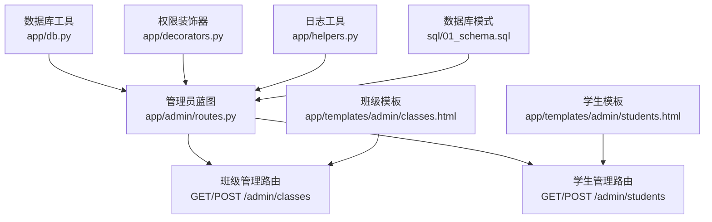
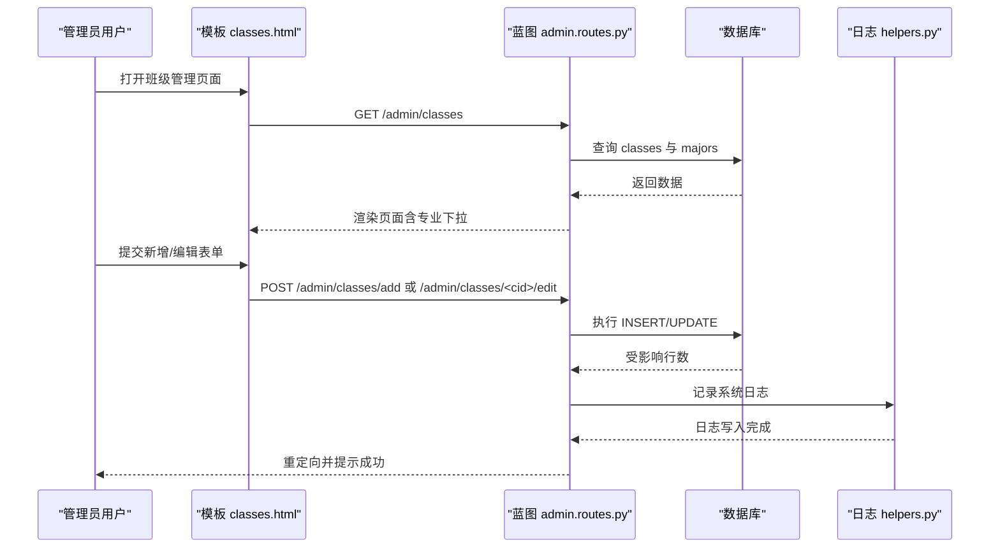
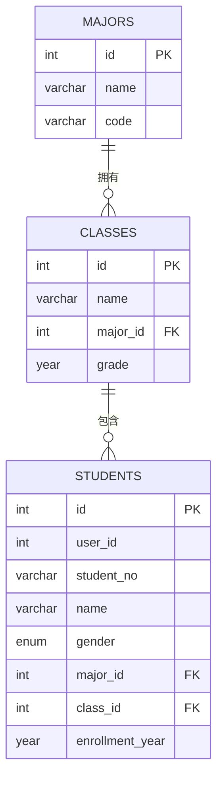
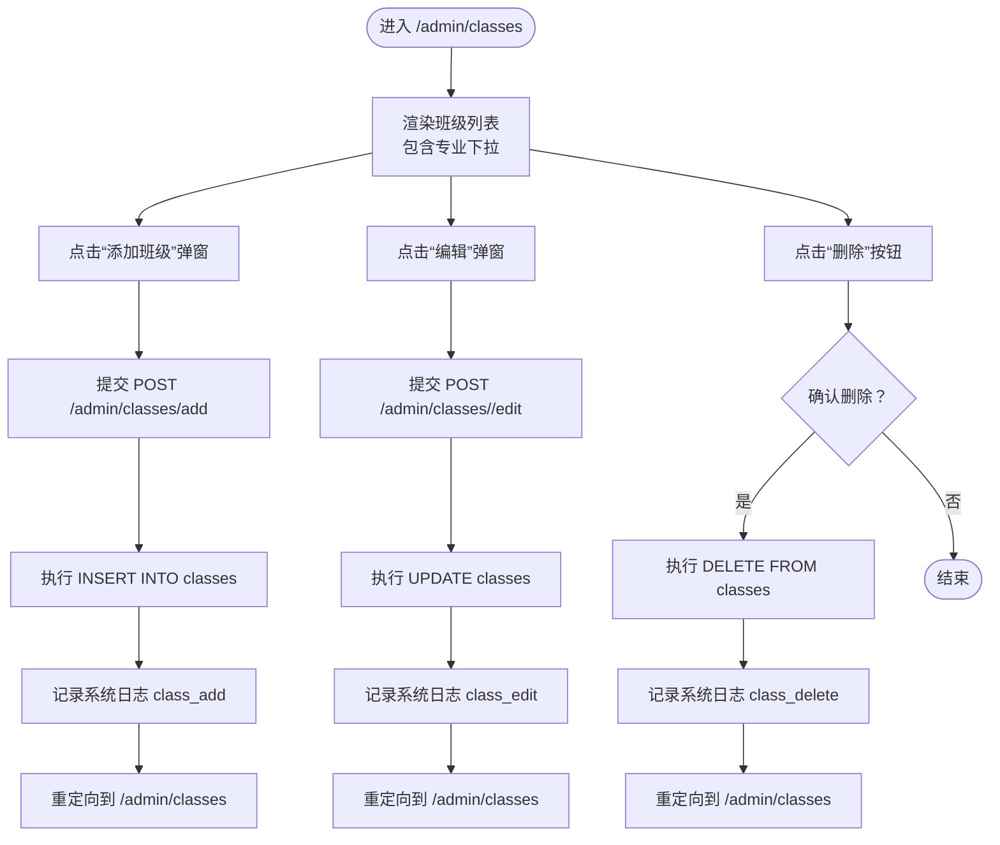
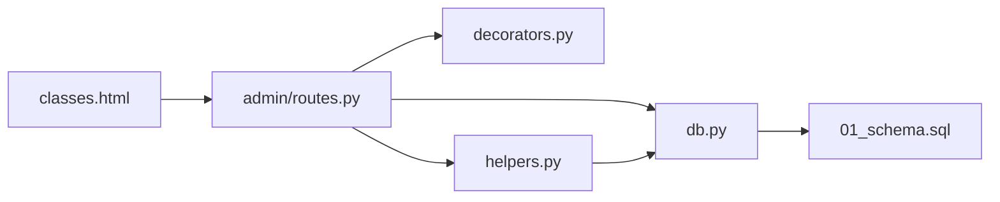

# 班级管理

<cite>
**本文引用的文件**
- [app/admin/routes.py](file://app/admin/routes.py)
- [app/templates/admin/classes.html](file://app/templates/admin/classes.html)
- [app/db.py](file://app/db.py)
- [app/decorators.py](file://app/decorators.py)
- [app/helpers.py](file://app/helpers.py)
- [sql/01_schema.sql](file://sql/01_schema.sql)
- [app/templates/admin/students.html](file://app/templates/admin/students.html)
</cite>

## 目录
1. [简介](#简介)
2. [项目结构](#项目结构)
3. [核心组件](#核心组件)
4. [架构概览](#架构概览)
5. [详细组件分析](#详细组件分析)
6. [依赖分析](#依赖分析)
7. [性能考虑](#性能考虑)
8. [故障排除指南](#故障排除指南)
9. [结论](#结论)

## 简介
本文件面向“班级管理”功能，系统性说明班级信息的维护机制，覆盖添加、编辑、删除的完整流程；详解班级核心字段（名称、所属专业、年级）及其约束与关联关系；给出界面操作指南（表单验证、专业下拉联动、年级格式要求、数据完整性检查）；并阐述班级在学生管理中的作用与数据同步策略。

## 项目结构
班级管理功能位于管理员后台模块，前端模板负责展示与交互，后端蓝图处理业务逻辑，数据库层提供持久化与约束保障。

图表来源
- [app/admin/routes.py:136-169](file://app/admin/routes.py#L136-L169)
- [app/templates/admin/classes.html:1-62](file://app/templates/admin/classes.html#L1-L62)
- [app/templates/admin/students.html:54-90](file://app/templates/admin/students.html#L54-L90)
- [app/db.py:1-121](file://app/db.py#L1-L121)
- [app/decorators.py:1-26](file://app/decorators.py#L1-L26)
- [app/helpers.py:1-80](file://app/helpers.py#L1-L80)
- [sql/01_schema.sql:40-50](file://sql/01_schema.sql#L40-L50)

章节来源
- [app/admin/routes.py:136-169](file://app/admin/routes.py#L136-L169)
- [app/templates/admin/classes.html:1-62](file://app/templates/admin/classes.html#L1-L62)
- [app/templates/admin/students.html:54-90](file://app/templates/admin/students.html#L54-L90)
- [app/db.py:1-121](file://app/db.py#L1-L121)
- [app/decorators.py:1-26](file://app/decorators.py#L1-L26)
- [app/helpers.py:1-80](file://app/helpers.py#L1-L80)
- [sql/01_schema.sql:40-50](file://sql/01_schema.sql#L40-L50)

## 核心组件
- 班级数据模型
  - 表名：classes
  - 字段：id、name、major_id、grade
  - 关系：major_id 外键关联 majors(id)，级联更新；删除限制
- 班级管理路由
  - GET /admin/classes：渲染班级列表与专业下拉
  - POST /admin/classes/add：新增班级
  - POST /admin/classes/<int:cid>/edit：编辑班级
  - POST /admin/classes/<int:cid>/delete：删除班级
- 学生管理中的班级字段
  - students.class_id 外键关联 classes(id)，删除限制
  - 学生编辑/新增时可选择班级，确保与专业联动一致

章节来源
- [sql/01_schema.sql:40-50](file://sql/01_schema.sql#L40-L50)
- [app/admin/routes.py:136-169](file://app/admin/routes.py#L136-L169)
- [app/templates/admin/students.html:54-90](file://app/templates/admin/students.html#L54-L90)

## 架构概览
班级管理采用典型的 MVC 分层：
- 控制器：管理员蓝图处理请求与响应
- 视图：Jinja2 模板渲染页面与表单
- 模型：SQL 约束与外键保证数据一致性
- 工具：数据库连接池、日志记录、权限控制

图表来源
- [app/templates/admin/classes.html:23-61](file://app/templates/admin/classes.html#L23-L61)
- [app/admin/routes.py:136-169](file://app/admin/routes.py#L136-L169)
- [app/helpers.py:9-21](file://app/helpers.py#L9-L21)

## 详细组件分析

### 数据模型与约束
- classes 表
  - 主键：id
  - 名称：name（非空）
  - 专业：major_id（非空，外键指向 majors.id，更新级联，删除限制）
  - 年级：grade（YEAR 类型，非空）
  - 索引：major_id
- students 表
  - 班级字段：class_id（非空，外键指向 classes.id，删除限制，更新级联）
  - 专业字段：major_id（与班级保持一致，外键指向 majors.id，删除限制，更新级联）

图表来源
- [sql/01_schema.sql:31-37](file://sql/01_schema.sql#L31-L37)
- [sql/01_schema.sql:42-50](file://sql/01_schema.sql#L42-L50)
- [sql/01_schema.sql:55-77](file://sql/01_schema.sql#L55-L77)

章节来源
- [sql/01_schema.sql:40-50](file://sql/01_schema.sql#L40-L50)
- [sql/01_schema.sql:55-77](file://sql/01_schema.sql#L55-L77)

### 班级管理路由与流程
- 列表页
  - 路由：GET /admin/classes
  - 功能：查询班级与专业名称，渲染模板
- 新增班级
  - 路由：POST /admin/classes/add
  - 参数：name、major_id、grade
  - 行为：插入一条记录，写入系统日志，提示成功
- 编辑班级
  - 路由：POST /admin/classes/<int:cid>/edit
  - 参数：name、major_id、grade
  - 行为：按 id 更新，写入系统日志，提示成功
- 删除班级
  - 路由：POST /admin/classes/<int:cid>/delete
  - 行为：按 id 删除，写入系统日志，提示成功

图表来源
- [app/admin/routes.py:136-169](file://app/admin/routes.py#L136-L169)
- [app/templates/admin/classes.html:23-61](file://app/templates/admin/classes.html#L23-L61)
- [app/helpers.py:9-21](file://app/helpers.py#L9-L21)

章节来源
- [app/admin/routes.py:136-169](file://app/admin/routes.py#L136-L169)
- [app/templates/admin/classes.html:1-62](file://app/templates/admin/classes.html#L1-L62)

### 界面操作指南
- 表单字段与验证
  - 班级名称：必填，文本输入
  - 所属专业：必填，下拉选择（来自 majors）
  - 年级：必填，数字输入（建议为四位年份）
- 专业下拉动态加载
  - 列表页同时加载所有 majors，用于新增/编辑时的下拉选项
- 年级输入格式要求
  - 推荐使用 YEAR 类型支持的合法年份（如 2023）
- 数据完整性检查
  - major_id 必须对应存在的专业 ID
  - 删除班级前需确保无学生绑定该班级（数据库外键限制）
- 学生管理中的班级字段
  - 在学生新增/编辑时，class_id 需与 major_id 保持一致的专业归属
  - 班级下拉列表应包含所有 classes，显示名称与年级，便于核对

章节来源
- [app/templates/admin/classes.html:28-35](file://app/templates/admin/classes.html#L28-L35)
- [app/templates/admin/classes.html:48-54](file://app/templates/admin/classes.html#L48-L54)
- [app/templates/admin/students.html:54-90](file://app/templates/admin/students.html#L54-L90)
- [sql/01_schema.sql:42-50](file://sql/01_schema.sql#L42-L50)
- [sql/01_schema.sql:55-77](file://sql/01_schema.sql#L55-L77)

### 班级与专业的多对一关系
- classes.major_id → majors.id
- 约束说明
  - 更新：CASCADE（专业信息变更会级联更新班级）
  - 删除：RESTRICT（若仍有班级关联，禁止删除专业）
- 实际应用
  - 新增/编辑班级时，必须选择存在的专业 ID
  - 若需调整专业名称/编码，请先在专业管理中更新

章节来源
- [sql/01_schema.sql:42-50](file://sql/01_schema.sql#L42-L50)

### 班级在学生管理中的作用与数据同步
- 学生信息中的班级字段
  - students.class_id 外键关联 classes.id
  - 学生新增/编辑时，class_id 与 major_id 应保持一致的专业归属
- 数据同步策略
  - 当专业被删除受限时，需先迁移或删除相关班级，再删除专业
  - 当班级被删除受限时，需先迁移或删除相关学生，再删除班级
- 前端联动
  - 学生新增/编辑表单中，班级下拉应显示与所选专业匹配的班级列表

章节来源
- [sql/01_schema.sql:55-77](file://sql/01_schema.sql#L55-L77)
- [app/templates/admin/students.html:54-90](file://app/templates/admin/students.html#L54-L90)

## 依赖分析
- 组件耦合
  - admin 蓝图依赖数据库工具与日志工具
  - 模板依赖蓝图提供的数据（classes、majors）
  - 数据库层通过外键约束保证数据一致性
- 外部依赖
  - Flask、Flask-Login、PyMySQL、DBUtils

图表来源
- [app/admin/routes.py:1-11](file://app/admin/routes.py#L1-L11)
- [app/db.py:1-121](file://app/db.py#L1-L121)
- [app/decorators.py:1-26](file://app/decorators.py#L1-L26)
- [app/helpers.py:1-80](file://app/helpers.py#L1-L80)
- [sql/01_schema.sql:40-50](file://sql/01_schema.sql#L40-L50)

章节来源
- [app/admin/routes.py:1-11](file://app/admin/routes.py#L1-L11)
- [app/db.py:1-121](file://app/db.py#L1-L121)
- [app/decorators.py:1-26](file://app/decorators.py#L1-L26)
- [app/helpers.py:1-80](file://app/helpers.py#L1-L80)
- [sql/01_schema.sql:40-50](file://sql/01_schema.sql#L40-L50)

## 性能考虑
- 数据库连接池
  - 使用连接池减少频繁连接开销，提高并发性能
- 查询优化
  - classes 与 majors 的关联查询使用 LEFT JOIN，避免遗漏
  - 班级列表页仅查询必要字段，降低网络传输
- 分页与缓存
  - 列表页采用分页，避免一次性加载大量数据
  - 建议对专业列表进行缓存，减少重复查询

## 故障排除指南
- 删除失败（专业/班级受限）
  - 现象：删除专业或班级时报错
  - 原因：仍有班级或学生关联
  - 处理：迁移或删除相关实体后再试
- 专业/班级缺失导致新增/编辑失败
  - 现象：提交表单时报错或无效果
  - 原因：major_id 或 class_id 不存在
  - 处理：先在专业/班级管理中创建对应项
- 权限不足
  - 现象：访问 /admin/* 返回 403
  - 原因：未登录或角色非 admin
  - 处理：以管理员身份登录

章节来源
- [app/decorators.py:13-25](file://app/decorators.py#L13-L25)
- [app/admin/routes.py:136-169](file://app/admin/routes.py#L136-L169)
- [sql/01_schema.sql:42-50](file://sql/01_schema.sql#L42-L50)
- [sql/01_schema.sql:55-77](file://sql/01_schema.sql#L55-L77)

## 结论
班级管理通过清晰的路由与模板、严格的数据库约束与外键关系，实现了稳定的增删改查流程。配合专业与学生的多对一/一对多关系，确保了数据的一致性与完整性。在实际使用中，应重点关注专业与班级的联动、删除前的数据清理，以及权限与日志的合规性。