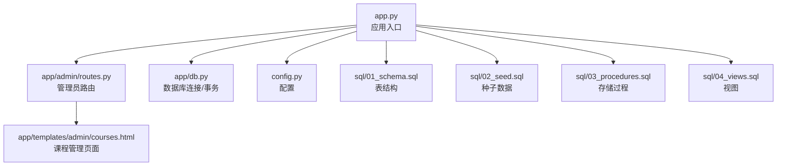
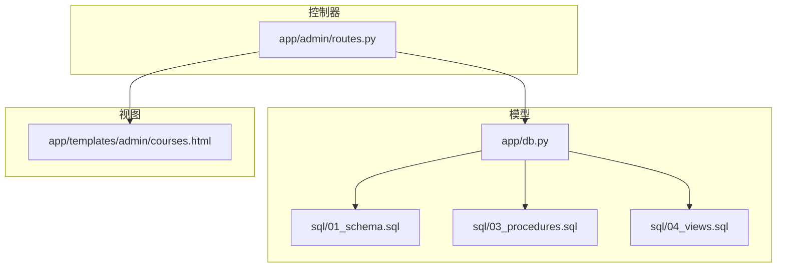
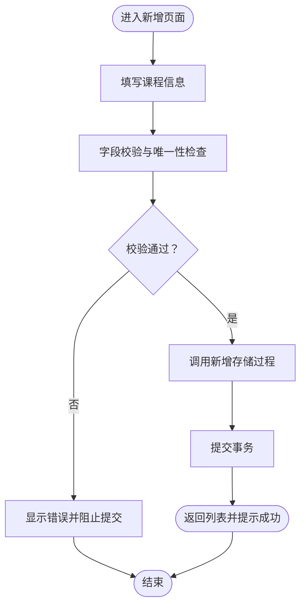
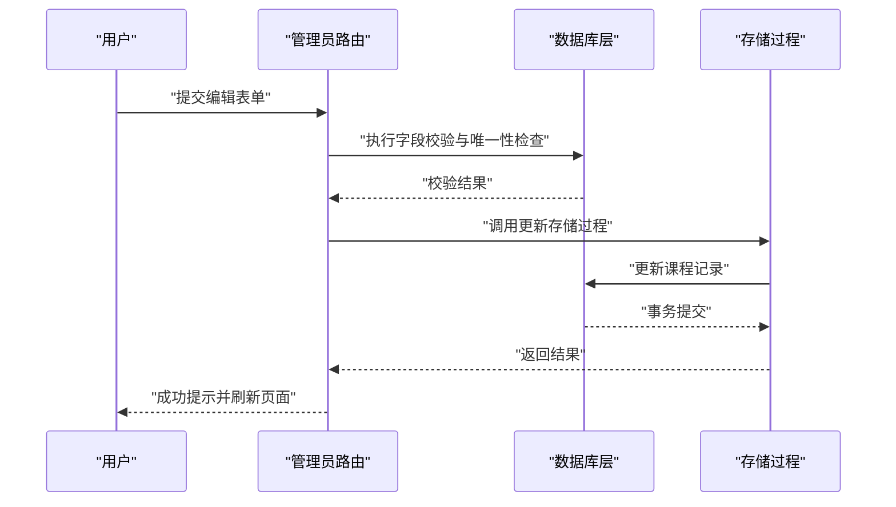
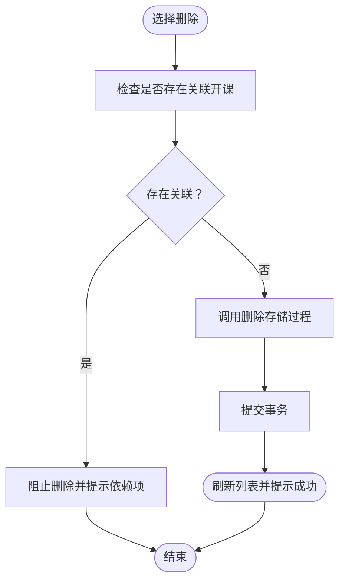
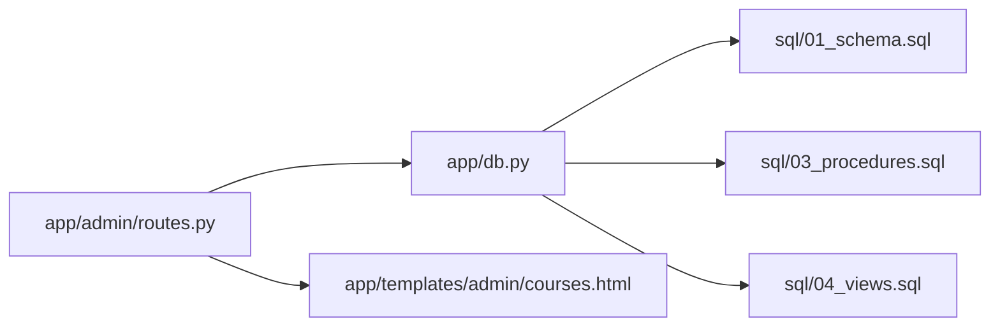

# 课程管理

<cite>
**本文引用的文件**
- [app.py](file://app.py)
- [config.py](file://config.py)
- [app/db.py](file://app/db.py)
- [app/admin/routes.py](file://app/admin/routes.py)
- [app/templates/admin/courses.html](file://app/templates/admin/courses.html)
- [sql/01_schema.sql](file://sql/01_schema.sql)
- [sql/02_seed.sql](file://sql/02_seed.sql)
- [sql/03_procedures.sql](file://sql/03_procedures.sql)
- [sql/04_views.sql](file://sql/04_views.sql)
</cite>

## 目录
1. [引言](#引言)
2. [项目结构](#项目结构)
3. [核心组件](#核心组件)
4. [架构概览](#架构概览)
5. [详细组件分析](#详细组件分析)
6. [依赖分析](#依赖分析)
7. [性能考虑](#性能考虑)
8. [故障排除指南](#故障排除指南)
9. [结论](#结论)
10. [附录](#附录)

## 引言
本文件系统化梳理课程管理功能，覆盖课程信息的全生命周期维护（新增、编辑、删除），明确课程核心字段的定义、取值范围与业务规则，阐述课程类型分类体系与学分学时计算逻辑，提供标准化操作指南与依赖关系处理策略。同时说明课程与开课管理的关系及数据一致性保障机制。

## 项目结构
后端采用Flask应用，数据库通过SQL脚本初始化；管理员端提供课程管理界面与路由；模板负责前端展示；数据库层封装连接与事务。

**图表来源**
- [app.py](file://app.py)
- [app/admin/routes.py](file://app/admin/routes.py)
- [app/db.py](file://app/db.py)
- [app/templates/admin/courses.html](file://app/templates/admin/courses.html)
- [config.py](file://config.py)
- [sql/01_schema.sql](file://sql/01_schema.sql)
- [sql/02_seed.sql](file://sql/02_seed.sql)
- [sql/03_procedures.sql](file://sql/03_procedures.sql)
- [sql/04_views.sql](file://sql/04_views.sql)

**章节来源**
- [app.py](file://app.py)
- [config.py](file://config.py)
- [app/db.py](file://app/db.py)
- [app/admin/routes.py](file://app/admin/routes.py)
- [app/templates/admin/courses.html](file://app/templates/admin/courses.html)
- [sql/01_schema.sql](file://sql/01_schema.sql)
- [sql/02_seed.sql](file://sql/02_seed.sql)
- [sql/03_procedures.sql](file://sql/03_procedures.sql)
- [sql/04_views.sql](file://sql/04_views.sql)

## 核心组件
- 应用入口与配置：应用启动、蓝图注册、数据库连接初始化。
- 数据库层：连接池、会话管理、事务控制。
- 管理员路由：课程列表查询、新增、编辑、删除等HTTP接口。
- 模板页面：课程管理界面，支持分页、搜索、批量操作。
- SQL脚本：表结构定义、种子数据、存储过程、视图。

**章节来源**
- [app.py](file://app.py)
- [config.py](file://config.py)
- [app/db.py](file://app/db.py)
- [app/admin/routes.py](file://app/admin/routes.py)
- [app/templates/admin/courses.html](file://app/templates/admin/courses.html)
- [sql/01_schema.sql](file://sql/01_schema.sql)
- [sql/02_seed.sql](file://sql/02_seed.sql)
- [sql/03_procedures.sql](file://sql/03_procedures.sql)
- [sql/04_views.sql](file://sql/04_views.sql)

## 架构概览
课程管理遵循典型的MVC模式：控制器（管理员路由）接收请求，模型（数据库层）访问SQL脚本中的表结构与存储过程，视图（模板）渲染页面。

**图表来源**
- [app/admin/routes.py](file://app/admin/routes.py)
- [app/db.py](file://app/db.py)
- [sql/01_schema.sql](file://sql/01_schema.sql)
- [sql/03_procedures.sql](file://sql/03_procedures.sql)
- [sql/04_views.sql](file://sql/04_views.sql)
- [app/templates/admin/courses.html](file://app/templates/admin/courses.html)

## 详细组件分析

### 课程核心字段定义与业务规则
- 字段清单与约束
  - 课程代码(code)：唯一标识符，通常为字符串编码，用于区分不同课程。
  - 课程名称(name)：显示名称，长度有限制。
  - 学分(credit)：数值型，表示课程学分，需为非负数且符合学校规定范围。
  - 总学时(hours)：数值型，表示课程总学时，需为非负整数。
  - 课程类型(course_type)：枚举或字典映射，决定课程分类（如必修、选修、通识等）。
  - 课程描述(description)：文本描述，长度有限制。
- 取值范围与校验
  - 学分与总学时应为非负数，避免负值导致统计异常。
  - 课程代码需全局唯一，防止重复录入。
  - 课程类型需在预定义集合内，确保分类一致性。
- 业务规则
  - 新增课程前进行重复性检查（基于课程代码）。
  - 编辑课程时需评估对已开课程安排的影响（如时间冲突、容量限制）。
  - 删除课程前需检查是否存在关联的开课记录，避免破坏数据完整性。

**章节来源**
- [sql/01_schema.sql](file://sql/01_schema.sql)
- [sql/02_seed.sql](file://sql/02_seed.sql)
- [sql/03_procedures.sql](file://sql/03_procedures.sql)

### 课程类型分类体系
- 分类维度
  - 必修课：学生培养方案中必须完成的课程。
  - 选修课：学生可自由选择的课程，进一步细分为专业选修、公共选修等。
  - 通识教育课：跨学科的通识课程，强调综合素质培养。
  - 实践环节：实验、实习、课程设计等实践类课程。
- 映射方式
  - 使用枚举或字典表维护类型映射，确保前后端一致。
  - 在课程管理界面提供下拉选择，减少输入错误。

**章节来源**
- [sql/01_schema.sql](file://sql/01_schema.sql)
- [sql/02_seed.sql](file://sql/02_seed.sql)

### 学分与学时的计算逻辑
- 计算原则
  - 学分通常与总学时成正比，具体换算比例由学校统一规定。
  - 不同课程类型可能有不同的学分计算权重或附加要求。
- 统计口径
  - 按学期统计学生获得的总学分与总学时，用于毕业审核与成绩单生成。
  - 课程调整（如学分或学时变更）需同步更新相关统计视图与报表。

**章节来源**
- [sql/04_views.sql](file://sql/04_views.sql)
- [sql/03_procedures.sql](file://sql/03_procedures.sql)

### 课程管理操作流程

#### 新增课程
- 流程步骤
  1) 进入课程管理页面，点击“新增”按钮。
  2) 填写课程基本信息（代码、名称、学分、学时、类型、描述）。
  3) 提交表单，系统执行重复性检查（课程代码唯一性）。
  4) 若通过检查，调用新增存储过程插入课程记录。
  5) 返回成功提示并刷新列表。
- 关键校验点
  - 课程代码唯一性。
  - 学分与学时为非负数。
  - 课程类型在允许范围内。

**图表来源**
- [app/admin/routes.py](file://app/admin/routes.py)
- [sql/03_procedures.sql](file://sql/03_procedures.sql)

**章节来源**
- [app/admin/routes.py](file://app/admin/routes.py)
- [app/templates/admin/courses.html](file://app/templates/admin/courses.html)
- [sql/03_procedures.sql](file://sql/03_procedures.sql)

#### 编辑课程
- 流程步骤
  1) 在课程列表选择目标课程，进入编辑页面。
  2) 修改任一字段，提交表单。
  3) 系统执行字段校验与唯一性检查。
  4) 调用更新存储过程更新课程记录。
  5) 返回成功提示并刷新列表。
- 影响评估
  - 若课程已用于开课安排，修改学分或学时可能影响统计与排课。
  - 修改课程代码需谨慎，避免破坏与其他模块的关联。

**图表来源**
- [app/admin/routes.py](file://app/admin/routes.py)
- [app/db.py](file://app/db.py)
- [sql/03_procedures.sql](file://sql/03_procedures.sql)

**章节来源**
- [app/admin/routes.py](file://app/admin/routes.py)
- [app/db.py](file://app/db.py)
- [sql/03_procedures.sql](file://sql/03_procedures.sql)

#### 删除课程
- 流程步骤
  1) 在课程列表选择目标课程，确认删除。
  2) 系统检查是否存在关联的开课记录。
  3) 若存在关联记录，提示禁止删除并列出依赖项。
  4) 若无关联记录，调用删除存储过程移除课程。
  5) 返回成功提示并刷新列表。
- 依赖关系处理
  - 开课记录（offering）与课程存在外键关联，删除前需解除或迁移相关开课。

**图表来源**
- [app/admin/routes.py](file://app/admin/routes.py)
- [sql/03_procedures.sql](file://sql/03_procedures.sql)
- [sql/01_schema.sql](file://sql/01_schema.sql)

**章节来源**
- [app/admin/routes.py](file://app/admin/routes.py)
- [sql/01_schema.sql](file://sql/01_schema.sql)
- [sql/03_procedures.sql](file://sql/03_procedures.sql)

### 课程与开课管理的关系
- 角色定位
  - 课程是开课的基础信息，开课（offering）以课程为模板，绑定具体的时间、地点、教师等资源。
- 数据一致性
  - 开课记录外键关联课程，确保课程删除时的完整性约束。
  - 课程信息变更（如学分、学时）会影响开课统计与成绩计算，需通过存储过程与视图保持一致。
- 协作流程
  - 先维护课程信息，再基于课程创建开课计划。
  - 任何课程调整都应评估对现有开课的影响。

**章节来源**
- [sql/01_schema.sql](file://sql/01_schema.sql)
- [sql/04_views.sql](file://sql/04_views.sql)
- [sql/03_procedures.sql](file://sql/03_procedures.sql)

## 依赖分析
- 组件耦合
  - 管理员路由依赖数据库层与存储过程，负责业务编排。
  - 数据库层依赖SQL脚本定义的表结构、视图与存储过程。
  - 模板页面依赖路由提供的数据与URL。
- 外部依赖
  - Flask框架、数据库驱动、HTML/CSS/JS模板引擎。
- 潜在循环依赖
  - 当前结构为单向依赖（路由→数据库→SQL），未见循环依赖迹象。

**图表来源**
- [app/admin/routes.py](file://app/admin/routes.py)
- [app/db.py](file://app/db.py)
- [sql/01_schema.sql](file://sql/01_schema.sql)
- [sql/03_procedures.sql](file://sql/03_procedures.sql)
- [sql/04_views.sql](file://sql/04_views.sql)
- [app/templates/admin/courses.html](file://app/templates/admin/courses.html)

**章节来源**
- [app/admin/routes.py](file://app/admin/routes.py)
- [app/db.py](file://app/db.py)
- [sql/01_schema.sql](file://sql/01_schema.sql)
- [sql/03_procedures.sql](file://sql/03_procedures.sql)
- [sql/04_views.sql](file://sql/04_views.sql)
- [app/templates/admin/courses.html](file://app/templates/admin/courses.html)

## 性能考虑
- 查询优化
  - 对课程列表查询建议添加索引（如课程代码、名称模糊检索）。
  - 分页查询避免一次性加载大量数据。
- 写入优化
  - 批量操作（导入、批量更新）通过事务合并提交，减少往返开销。
- 存储过程
  - 将常用校验与更新封装到存储过程，减少网络往返与SQL拼接风险。

## 故障排除指南
- 常见问题
  - 重复课程代码：提交时触发唯一性约束，需修改课程代码。
  - 删除失败：存在关联开课记录，需先处理相关开课。
  - 字段校验失败：学分或学时为负数，或课程类型不在允许集合。
- 定位方法
  - 查看路由层的错误返回与日志。
  - 检查存储过程的异常抛出与回滚逻辑。
  - 核对SQL脚本中的约束与视图定义。

**章节来源**
- [app/admin/routes.py](file://app/admin/routes.py)
- [sql/03_procedures.sql](file://sql/03_procedures.sql)
- [sql/01_schema.sql](file://sql/01_schema.sql)

## 结论
课程管理功能以清晰的字段定义、严格的校验规则与完善的依赖处理为核心，结合存储过程与视图保障数据一致性。通过标准化的操作流程与影响评估机制，能够有效支撑开课管理与教学运行的稳定性。

## 附录
- 操作清单
  - 新增：填写必填字段→提交→唯一性检查→存储过程插入→刷新列表。
  - 编辑：选择课程→修改字段→校验→存储过程更新→刷新列表。
  - 删除：选择课程→检查关联→禁止或删除→存储过程删除→刷新列表。
- 最佳实践
  - 严格遵守课程类型与学分学时的业务规则。
  - 删除前评估对开课的影响，必要时迁移或暂停相关开课。
  - 使用模板页面的分页与搜索功能提升管理效率。