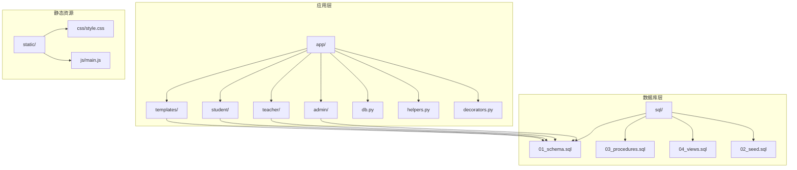
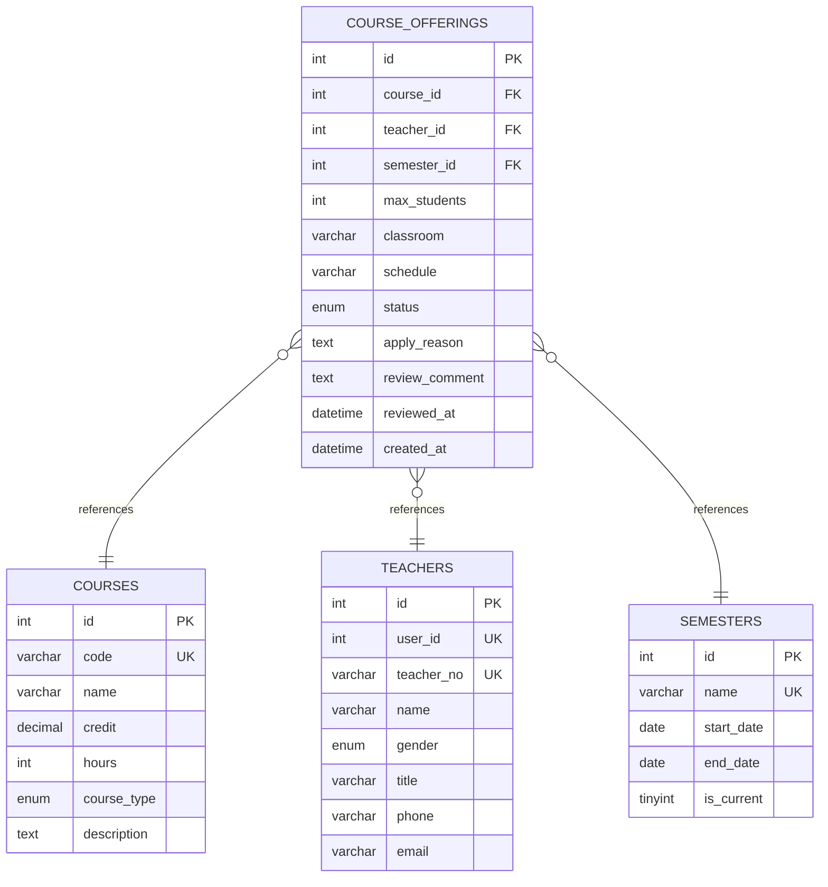
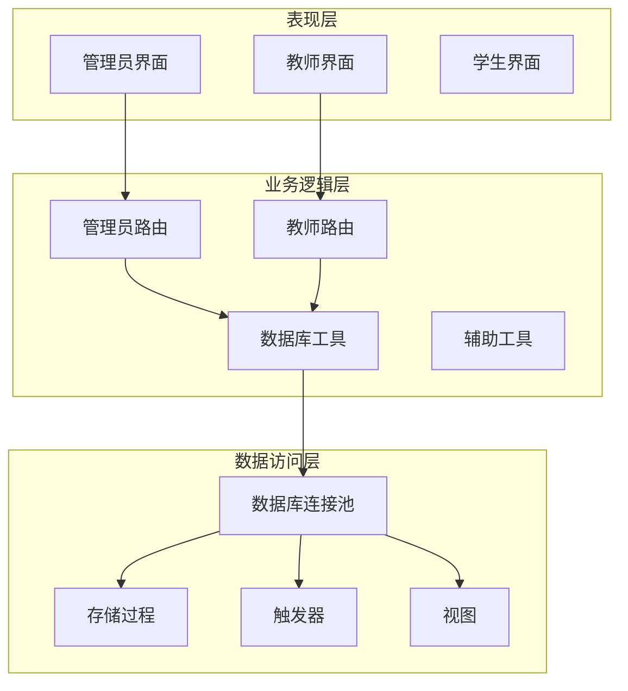
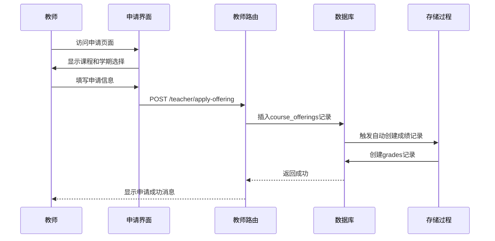
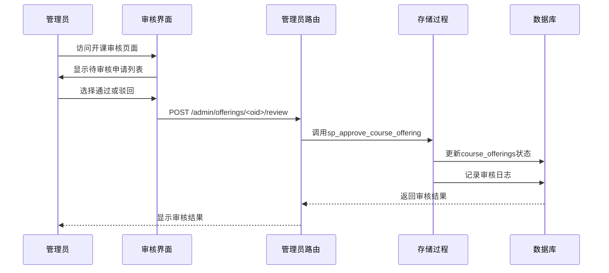
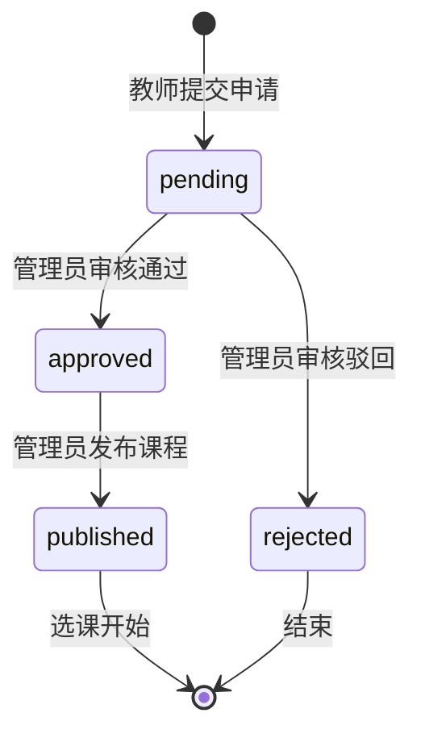
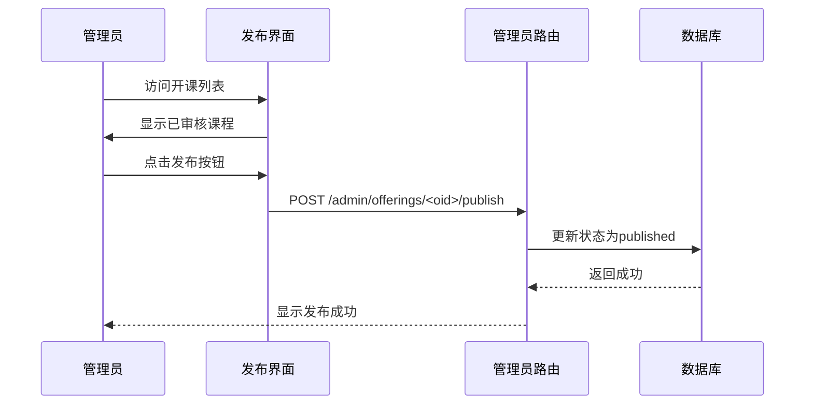
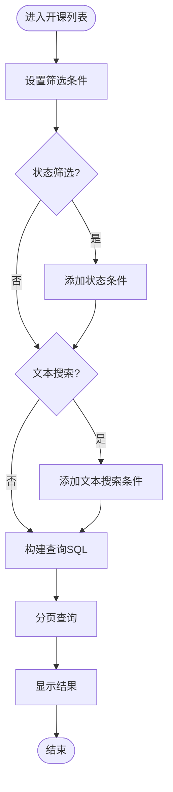
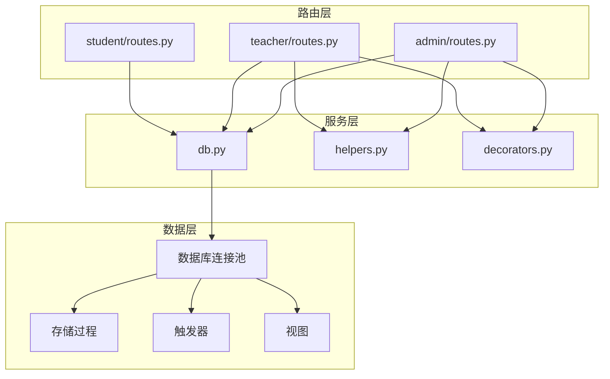

# 开课管理

<cite>
**本文档引用的文件**
- [app/admin/routes.py](file://app/admin/routes.py)
- [app/teacher/routes.py](file://app/teacher/routes.py)
- [sql/03_procedures.sql](file://sql/03_procedures.sql)
- [app/db.py](file://app/db.py)
- [app/helpers.py](file://app/helpers.py)
- [app/templates/admin/offerings.html](file://app/templates/admin/offerings.html)
- [app/templates/teacher/apply_offering.html](file://app/templates/teacher/apply_offering.html)
- [sql/01_schema.sql](file://sql/01_schema.sql)
- [app/decorators.py](file://app/decorators.py)
- [README.md](file://README.md)
</cite>

## 目录
1. [简介](#简介)
2. [项目结构](#项目结构)
3. [核心组件](#核心组件)
4. [架构概览](#架构概览)
5. [详细组件分析](#详细组件分析)
6. [依赖关系分析](#依赖关系分析)
7. [性能考虑](#性能考虑)
8. [故障排除指南](#故障排除指南)
9. [结论](#结论)

## 简介

开课管理是校园教务选课与成绩管理系统中的核心功能模块，负责管理课程开设申请的完整生命周期。该系统实现了从教师提交开课申请、管理员审核、课程发布到最终选课的完整业务流程。

系统采用Flask框架构建，使用MySQL数据库存储数据，通过存储过程实现复杂的业务逻辑，确保数据一致性和事务完整性。整个系统支持多角色权限管理，包括管理员、教师和学生三个角色，每个角色都有相应的操作权限和功能限制。

## 项目结构

系统采用模块化架构设计，主要分为以下几个核心模块：

**图表来源**
- [app/admin/routes.py:1-692](file://app/admin/routes.py#L1-L692)
- [app/teacher/routes.py:1-333](file://app/teacher/routes.py#L1-L333)
- [sql/01_schema.sql:1-200](file://sql/01_schema.sql#L1-L200)

**章节来源**
- [README.md:46-69](file://README.md#L46-L69)

## 核心组件

### 数据模型设计

系统的核心数据模型围绕课程开设申请展开，主要涉及以下关键表：

**图表来源**
- [sql/01_schema.sql:127-155](file://sql/01_schema.sql#L127-L155)

### 存储过程架构

系统通过存储过程实现核心业务逻辑，主要包括五个关键存储过程：

1. **sp_approve_course_offering** - 开课申请审核
2. **sp_enroll_course** - 学生选课
3. **sp_drop_course** - 学生退课
4. **sp_calculate_total_grade** - 成绩计算
5. **sp_calculate_gpa** - GPA计算

**章节来源**
- [sql/03_procedures.sql:277-320](file://sql/03_procedures.sql#L277-L320)

## 架构概览

系统采用三层架构设计，实现了清晰的职责分离：

**图表来源**
- [app/admin/routes.py:1-692](file://app/admin/routes.py#L1-L692)
- [app/teacher/routes.py:1-333](file://app/teacher/routes.py#L1-L333)
- [app/db.py:1-121](file://app/db.py#L1-L121)

## 详细组件分析

### 教师开课申请模块

教师可以通过申请界面提交开课申请，系统提供了完整的申请流程：

#### 申请流程序列图

**图表来源**
- [app/teacher/routes.py:68-85](file://app/teacher/routes.py#L68-L85)
- [sql/03_procedures.sql:326-335](file://sql/03_procedures.sql#L326-L335)

#### 申请状态管理

教师可以查看自己的开课申请状态，并进行相应的操作：

**章节来源**
- [app/teacher/routes.py:88-104](file://app/teacher/routes.py#L88-L104)
- [app/teacher/routes.py:107-117](file://app/teacher/routes.py#L107-L117)

### 管理员审核模块

管理员负责审核教师的开课申请，提供完整的审核流程：

#### 审核流程序列图

**图表来源**
- [app/admin/routes.py:414-431](file://app/admin/routes.py#L414-L431)
- [sql/03_procedures.sql:277-320](file://sql/03_procedures.sql#L277-L320)

#### 审核状态流转

**图表来源**
- [sql/01_schema.sql:138](file://sql/01_schema.sql#L138)

**章节来源**
- [app/admin/routes.py:386-440](file://app/admin/routes.py#L386-L440)

### 课程发布机制

课程发布是开课管理的重要环节，只有审核通过的课程才能被学生选修：

#### 发布流程序列图

**图表来源**
- [app/admin/routes.py:434-439](file://app/admin/routes.py#L434-L439)

**章节来源**
- [app/admin/routes.py:434-439](file://app/admin/routes.py#L434-L439)

### 查询和筛选功能

系统提供了强大的查询和筛选功能，支持按多种条件过滤开课申请：

#### 查询流程图

**图表来源**
- [app/admin/routes.py:387-411](file://app/admin/routes.py#L387-L411)

**章节来源**
- [app/admin/routes.py:387-411](file://app/admin/routes.py#L387-L411)

### 界面操作指南

#### 教师申请界面

教师申请界面提供了直观的操作体验：

1. **课程选择**：从下拉菜单中选择要申请的课程
2. **学期选择**：选择开课的学期
3. **基本信息填写**：填写最大选课人数、教室、上课时间等
4. **申请理由**：说明申请开课的原因
5. **提交申请**：点击提交按钮完成申请

#### 管理员审核界面

管理员审核界面提供了完整的审核操作：

1. **状态筛选**：按申请状态筛选显示
2. **文本搜索**：按课程名称、代码或教师姓名搜索
3. **审核操作**：
   - 通过：点击通过按钮，填写审核意见
   - 驳回：点击驳回按钮，填写驳回原因
4. **课程发布**：对审核通过的课程进行发布操作

**章节来源**
- [app/templates/teacher/apply_offering.html:1-58](file://app/templates/teacher/apply_offering.html#L1-L58)
- [app/templates/admin/offerings.html:1-76](file://app/templates/admin/offerings.html#L1-L76)

## 依赖关系分析

系统各组件之间的依赖关系如下：

**图表来源**
- [app/admin/routes.py:1-10](file://app/admin/routes.py#L1-L10)
- [app/teacher/routes.py:1-7](file://app/teacher/routes.py#L1-L7)
- [app/db.py:1-121](file://app/db.py#L1-L121)

**章节来源**
- [app/admin/routes.py:1-10](file://app/admin/routes.py#L1-L10)
- [app/teacher/routes.py:1-7](file://app/teacher/routes.py#L1-L7)

## 性能考虑

### 数据库优化策略

1. **索引优化**：为course_offerings表建立了多个索引，包括课程ID、教师ID、学期ID和状态字段
2. **连接池管理**：使用DBUtils连接池减少数据库连接开销
3. **分页查询**：对大量数据采用分页查询避免内存溢出
4. **事务控制**：使用存储过程确保业务逻辑的原子性

### 缓存策略

系统通过以下方式优化性能：
- 使用连接池复用数据库连接
- 对频繁查询的数据建立适当的索引
- 分页处理大数据量的查询结果

## 故障排除指南

### 常见问题及解决方案

#### 开课申请审核失败

**问题现象**：管理员审核时提示"该申请已审核过，不可重复审核"

**可能原因**：
1. 申请已被其他管理员处理
2. 申请状态已发生变化

**解决方法**：
1. 刷新页面查看最新状态
2. 检查系统日志确认审核状态
3. 确认操作权限

#### 课程发布失败

**问题现象**：点击发布按钮后无响应或提示错误

**可能原因**：
1. 课程状态不是"approved"
2. 数据库连接异常

**解决方法**：
1. 确认课程状态为"approved"
2. 检查数据库连接状态
3. 查看服务器日志

#### 申请撤销失败

**问题现象**：教师尝试撤销申请时提示"只能撤销待审核的申请"

**可能原因**：
1. 申请状态已改变
2. 已超过撤销时限

**解决方法**：
1. 确认申请仍处于"pending"状态
2. 及时处理申请撤销
3. 联系管理员协助处理

**章节来源**
- [app/admin/routes.py:414-431](file://app/admin/routes.py#L414-L431)
- [app/teacher/routes.py:107-117](file://app/teacher/routes.py#L107-L117)

## 结论

开课管理系统通过合理的架构设计和完善的业务流程，实现了从教师申请到管理员审核再到课程发布的完整生命周期管理。系统的主要优势包括：

1. **完整的业务流程**：覆盖开课申请的全生命周期
2. **严格的权限控制**：基于角色的权限管理确保系统安全
3. **数据一致性保障**：通过存储过程和触发器保证数据完整性
4. **良好的用户体验**：直观的界面设计和清晰的操作流程
5. **可扩展性**：模块化的架构便于功能扩展和维护

该系统为高校教务管理提供了可靠的数字化解决方案，能够有效提高教务工作效率和管理水平。