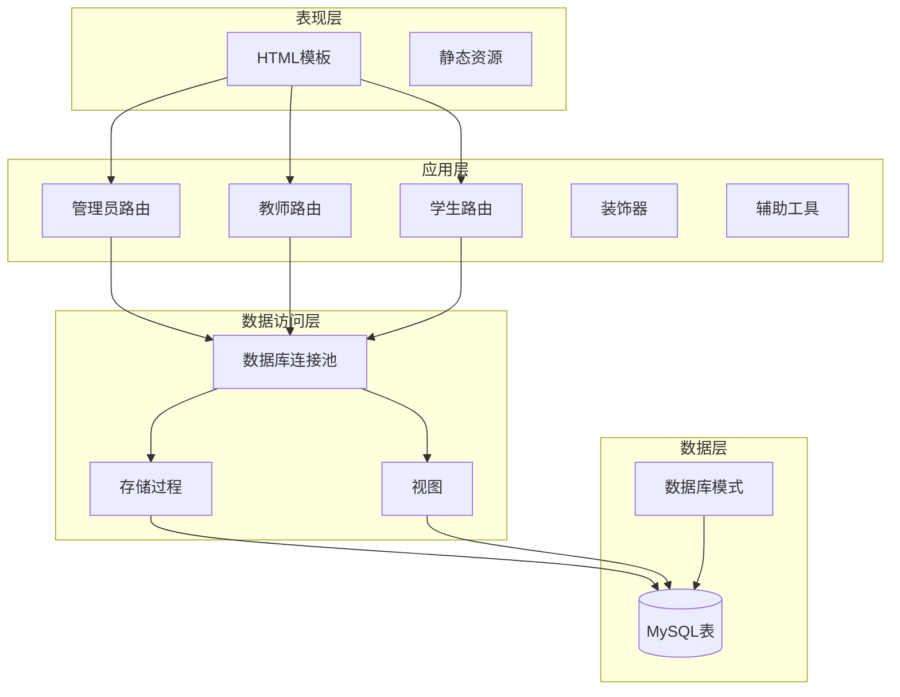
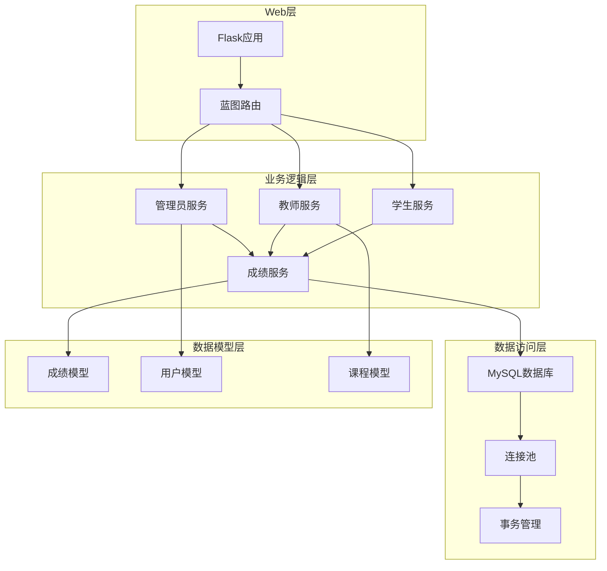
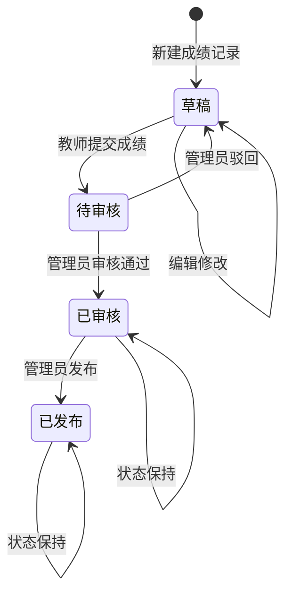
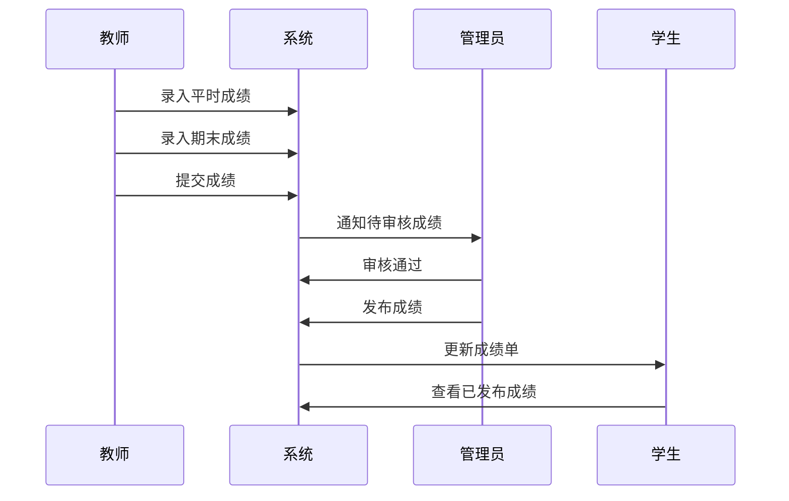
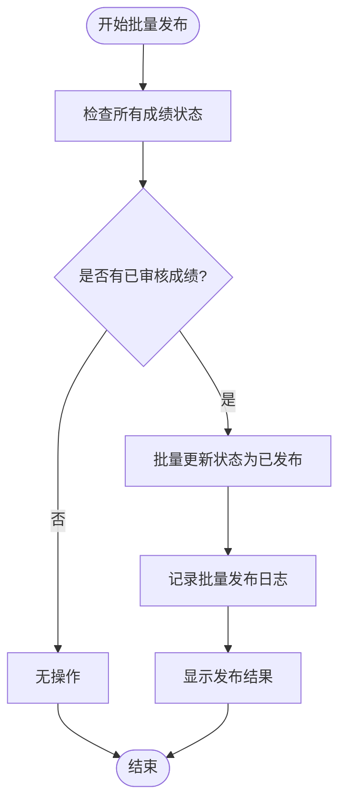
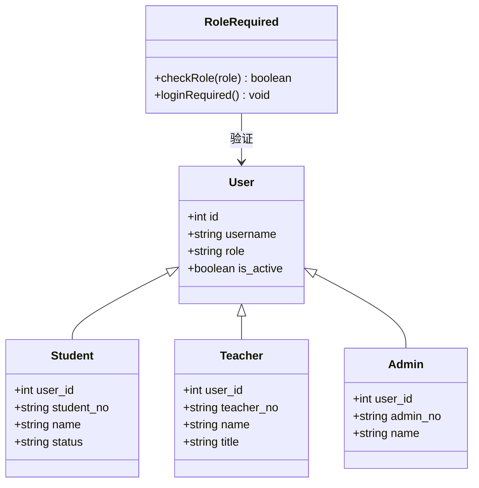
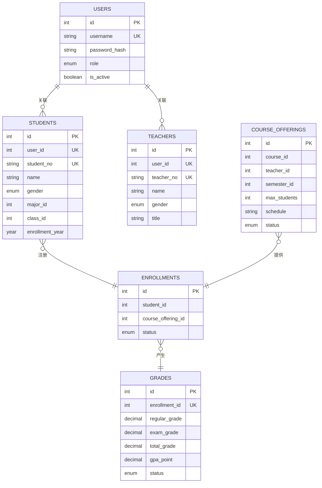

# 成绩管理

<cite>
**本文档引用的文件**
- [app.py](file://app.py)
- [config.py](file://config.py)
- [app/admin/routes.py](file://app/admin/routes.py)
- [app/teacher/routes.py](file://app/teacher/routes.py)
- [app/student/routes.py](file://app/student/routes.py)
- [app/db.py](file://app/db.py)
- [app/helpers.py](file://app/helpers.py)
- [app/decorators.py](file://app/decorators.py)
- [sql/01_schema.sql](file://sql/01_schema.sql)
- [sql/03_procedures.sql](file://sql/03_procedures.sql)
- [sql/04_views.sql](file://sql/04_views.sql)
- [app/templates/admin/grades_review.html](file://app/templates/admin/grades_review.html)
- [app/templates/teacher/offering_students.html](file://app/templates/teacher/offering_students.html)
- [app/templates/student/grades.html](file://app/templates/student/grades.html)
</cite>

## 目录
1. [简介](#简介)
2. [项目结构](#项目结构)
3. [核心组件](#核心组件)
4. [架构概览](#架构概览)
5. [详细组件分析](#详细组件分析)
6. [依赖关系分析](#依赖关系分析)
7. [性能考虑](#性能考虑)
8. [故障排除指南](#故障排除指南)
9. [结论](#结论)
10. [附录](#附录)

## 简介
本系统是一个基于Flask的校园教务选课与成绩管理系统，专注于成绩管理功能。系统实现了完整的成绩审核流程，包括提交成绩的审核、批准和发布的三级状态管理，以及批量成绩发布功能。系统支持单个成绩处理和批量操作，确保成绩状态的正确流转和数据完整性。

## 项目结构
系统采用典型的Flask三层架构设计，主要分为以下几个层次：

**图表来源**
- [app.py:1-13](file://app.py#L1-L13)
- [config.py:6-36](file://config.py#L6-L36)

**章节来源**
- [app.py:1-13](file://app.py#L1-L13)
- [config.py:6-36](file://config.py#L6-L36)

## 核心组件
系统的核心组件围绕成绩管理展开，主要包括：

### 数据模型
- **grades表**：存储学生成绩信息，包含平时成绩、期末成绩、总评成绩和绩点
- **状态管理**：支持draft、submitted、approved、published四种状态
- **约束条件**：成绩范围0-100，自动计算总评和绩点

### 路由模块
- **管理员模块**：负责成绩审核、批准和批量发布
- **教师模块**：负责成绩录入、提交和批量操作
- **学生模块**：负责成绩查询和统计

### 业务逻辑
- **状态流转**：draft → submitted → approved → published
- **权限控制**：基于角色的访问控制
- **数据完整性**：通过数据库约束和业务规则保证

**章节来源**
- [sql/01_schema.sql:177-198](file://sql/01_schema.sql#L177-L198)
- [app/admin/routes.py:492-583](file://app/admin/routes.py#L492-L583)
- [app/teacher/routes.py:162-236](file://app/teacher/routes.py#L162-L236)

## 架构概览
系统采用分层架构设计，确保职责分离和代码可维护性：

**图表来源**
- [app/admin/routes.py:14-18](file://app/admin/routes.py#L14-L18)
- [app/teacher/routes.py:11-15](file://app/teacher/routes.py#L11-L15)
- [app/student/routes.py:12-16](file://app/student/routes.py#L12-L16)

## 详细组件分析

### 成绩状态管理
系统实现了严格的三级状态管理体系，确保成绩处理的规范性和安全性：

**图表来源**
- [sql/01_schema.sql:186](file://sql/01_schema.sql#L186)
- [app/admin/routes.py:511-542](file://app/admin/routes.py#L511-L542)

#### 状态转换规则
1. **草稿状态**：教师可以录入和修改成绩，但不能提交
2. **待审核状态**：教师提交后进入审核流程
3. **已审核状态**：管理员审核通过，准备发布
4. **已发布状态**：管理员发布，学生成绩正式生效

#### 数据完整性保证
- **触发器机制**：自动计算总评成绩和绩点
- **约束检查**：成绩范围0-100，状态转换验证
- **事务控制**：批量操作的原子性保证

**章节来源**
- [sql/03_procedures.sql:326-360](file://sql/03_procedures.sql#L326-L360)
- [sql/01_schema.sql:195-197](file://sql/01_schema.sql#L195-L197)

### 单个成绩处理流程
系统为每个角色提供了完整的成绩处理能力：

**图表来源**
- [app/teacher/routes.py:162-203](file://app/teacher/routes.py#L162-L203)
- [app/admin/routes.py:511-542](file://app/admin/routes.py#L511-L542)

#### 教师端操作
- **成绩录入**：支持单个学生成绩录入
- **批量录入**：支持整班成绩批量录入
- **成绩修改**：在草稿状态下可随时修改
- **提交操作**：将成绩从草稿转为待审核状态

#### 管理员端操作
- **审核功能**：审核通过或驳回待审核成绩
- **发布功能**：将已审核成绩发布给学生
- **批量发布**：一键发布所有已审核成绩
- **驳回功能**：将待审核成绩退回给教师

**章节来源**
- [app/teacher/routes.py:162-274](file://app/teacher/routes.py#L162-L274)
- [app/admin/routes.py:511-582](file://app/admin/routes.py#L511-L582)

### 批量成绩发布机制
系统提供了高效的批量操作功能，支持大规模成绩处理：

**图表来源**
- [app/admin/routes.py:569-582](file://app/admin/routes.py#L569-L582)

#### 批量发布特点
- **原子性操作**：使用单条SQL语句更新所有符合条件的成绩
- **性能优化**：避免逐条处理的性能损耗
- **日志记录**：完整记录批量操作的详细信息
- **状态一致性**：确保所有相关数据的一致性

#### 教师批量操作
- **批量提交**：将整班已录入成绩一次性提交
- **批量录入**：支持通过表单批量录入多个学生的成绩
- **状态检查**：确保只有草稿状态的成绩才能被批量处理

**章节来源**
- [app/teacher/routes.py:206-219](file://app/teacher/routes.py#L206-L219)
- [app/teacher/routes.py:238-274](file://app/teacher/routes.py#L238-L274)

### 权限控制与安全机制
系统实现了严格的角色权限控制：

**图表来源**
- [app/decorators.py:13-25](file://app/decorators.py#L13-L25)
- [app/admin/routes.py:14-18](file://app/admin/routes.py#L14-L18)

#### 角色权限
- **学生权限**：只能查看自己的成绩和相关信息
- **教师权限**：只能管理自己教授课程的成绩
- **管理员权限**：拥有系统的完全管理权限

#### 安全措施
- **CSRF保护**：所有表单都包含CSRF令牌
- **输入验证**：严格的参数验证和数据校验
- **会话管理**：基于Flask-Login的用户会话管理
- **日志审计**：完整的操作日志记录

**章节来源**
- [app/decorators.py:7-25](file://app/decorators.py#L7-L25)
- [app/helpers.py:9-21](file://app/helpers.py#L9-L21)

## 依赖关系分析

### 数据库依赖关系
系统通过存储过程和触发器实现复杂的业务逻辑：

**图表来源**
- [sql/01_schema.sql:15-235](file://sql/01_schema.sql#L15-L235)

### 外部依赖
- **Flask框架**：Web应用框架
- **PyMySQL**：MySQL数据库驱动
- **Flask-Login**：用户会话管理
- **Werkzeug**：WSGI工具包
- **Bootstrap**：前端UI框架

**章节来源**
- [requirements.txt](file://requirements.txt)

## 性能考虑
系统在设计时充分考虑了性能优化：

### 连接池管理
- **最小缓存连接**：2个
- **最大缓存连接**：10个  
- **最大连接数**：20个
- **自动提交**：禁用自动提交，手动控制事务

### 查询优化
- **分页查询**：默认每页15条记录
- **索引优化**：关键字段建立适当索引
- **批量操作**：大量数据操作使用批量处理

### 缓存策略
- **连接复用**：通过连接池减少连接开销
- **查询缓存**：合理使用数据库查询缓存
- **页面缓存**：静态内容缓存

## 故障排除指南

### 常见问题及解决方案

#### 成绩状态异常
**问题**：成绩状态无法正常流转
**原因**：
- 数据库约束冲突
- 事务未正确提交
- 触发器执行失败

**解决方法**：
1. 检查数据库连接状态
2. 验证状态转换条件
3. 查看系统日志

#### 权限访问问题
**问题**：用户无法访问特定功能
**原因**：
- 角色权限不足
- 会话过期
- CSRF令牌验证失败

**解决方法**：
1. 检查用户角色设置
2. 重新登录系统
3. 刷新页面获取新令牌

#### 数据一致性问题
**问题**：成绩数据不一致
**原因**：
- 并发操作冲突
- 触发器执行异常
- 存储过程调用失败

**解决方法**：
1. 使用事务包装操作
2. 检查触发器状态
3. 验证存储过程执行

**章节来源**
- [app/db.py:43-80](file://app/db.py#L43-L80)
- [app/helpers.py:9-21](file://app/helpers.py#L9-L21)

## 结论
本成绩管理系统通过合理的架构设计和严格的业务规则，实现了完整的成绩管理功能。系统支持灵活的状态管理、高效的数据处理和完善的权限控制，能够满足高校教务管理的实际需求。通过触发器和存储过程的使用，系统确保了数据的一致性和完整性，同时提供了良好的用户体验和扩展性。

## 附录

### 系统配置
- **数据库连接池**：最小2个，最大20个连接
- **分页大小**：每页15条记录
- **成绩权重**：平时30%，期末70%
- **GPA计算**：4.0制绩点系统

### 数据库表结构
- **users**：用户账户信息
- **students**：学生基本信息
- **teachers**：教师基本信息
- **grades**：成绩记录表
- **course_offerings**：开课申请表

### API接口概览
- **GET /grades-review**：查看待审核成绩
- **POST /grades/{id}/approve**：审核通过
- **POST /grades/{id}/publish**：发布成绩
- **POST /grades/batch-publish**：批量发布
- **POST /grade/{id}/submit**：提交成绩
- **POST /offering/{id}/submit-all**：批量提交