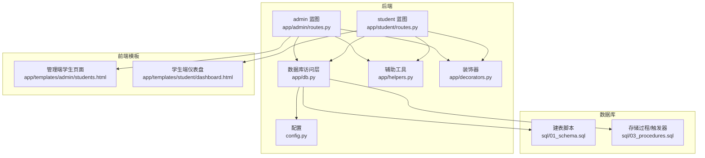
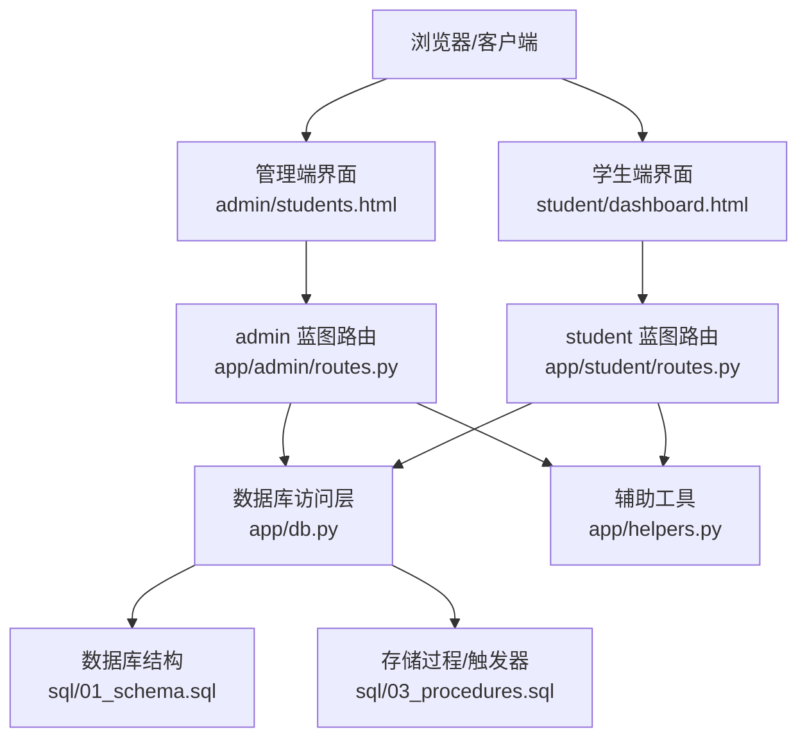
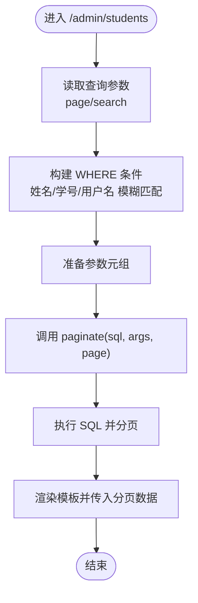
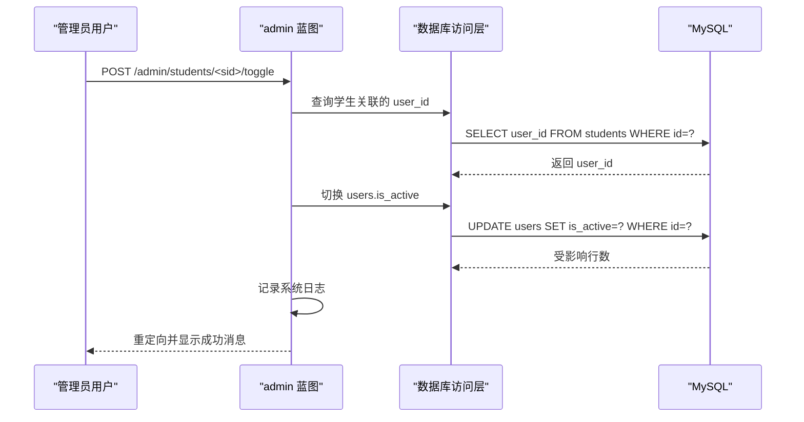
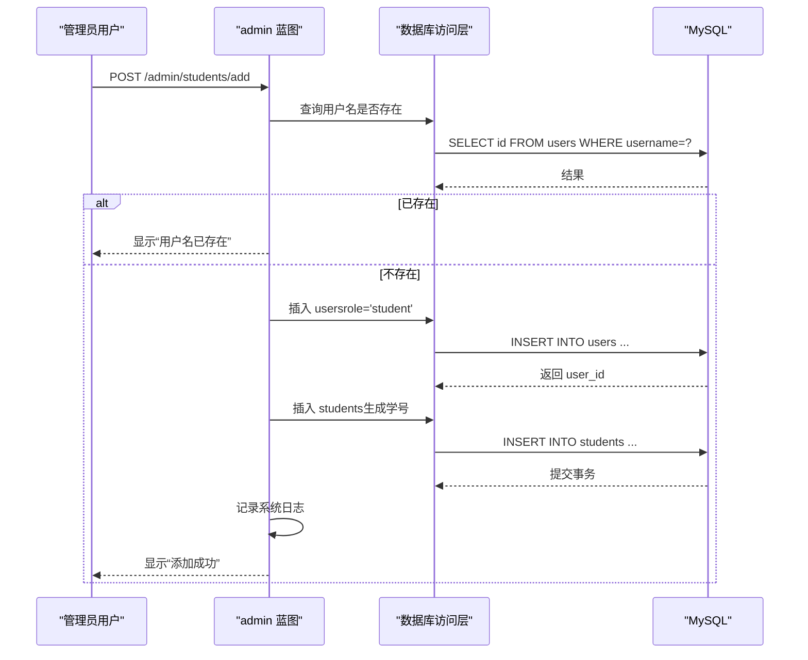
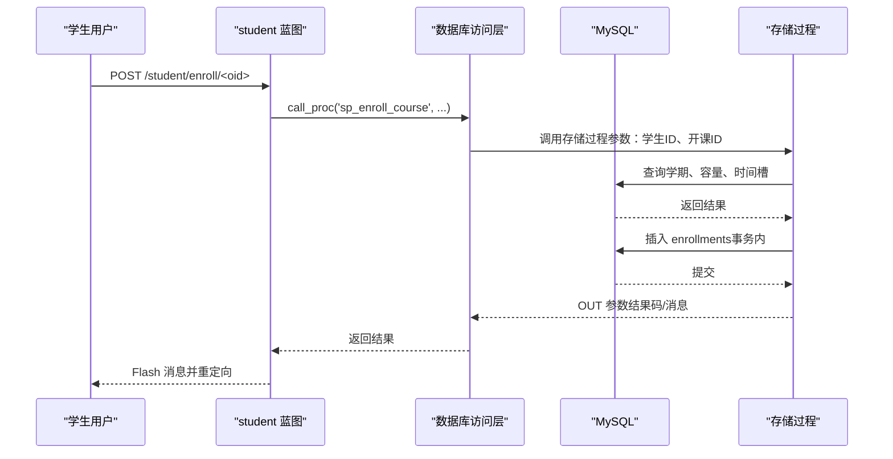
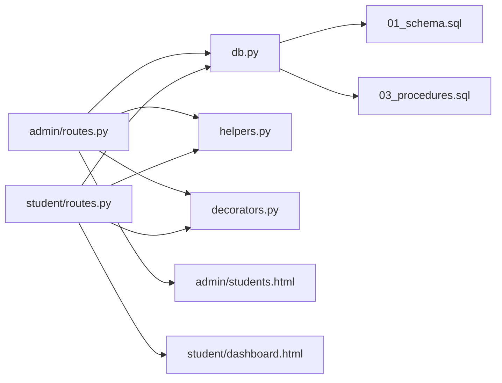

# 学生管理

<cite>
**本文引用的文件**
- [app/admin/routes.py](file://app/admin/routes.py)
- [app/student/routes.py](file://app/student/routes.py)
- [app/db.py](file://app/db.py)
- [app/decorators.py](file://app/decorators.py)
- [app/helpers.py](file://app/helpers.py)
- [config.py](file://config.py)
- [sql/01_schema.sql](file://sql/01_schema.sql)
- [sql/03_procedures.sql](file://sql/03_procedures.sql)
- [app/templates/admin/students.html](file://app/templates/admin/students.html)
- [app/templates/student/dashboard.html](file://app/templates/student/dashboard.html)
</cite>

## 目录
1. [简介](#简介)
2. [项目结构](#项目结构)
3. [核心组件](#核心组件)
4. [架构总览](#架构总览)
5. [详细组件分析](#详细组件分析)
6. [依赖分析](#依赖分析)
7. [性能考虑](#性能考虑)
8. [故障排查指南](#故障排查指南)
9. [结论](#结论)
10. [附录](#附录)

## 简介
本文件面向“学生管理”功能，系统化梳理从数据模型设计、分页查询与搜索、状态切换、编辑与权限控制，到 CRUD 操作与与专业/班级/选课系统的数据交互。文档以仓库现有实现为依据，结合数据库建模与存储过程，提供可操作的流程图与时序图，帮助开发者快速理解与扩展。

## 项目结构
- 后端采用 Flask 蓝图划分模块：admin、student、teacher，分别负责管理后台、学生端与教师端功能。
- 数据访问层封装于 app/db.py，提供连接池、查询、写入、分页与存储过程调用。
- 辅助工具位于 app/helpers.py，包含日志、课表解析、选课时间段查询等。
- 配置集中于 config.py，包含数据库连接池参数与分页默认值。
- 数据库结构由 sql/01_schema.sql 定义，包含 users、students、majors、classes、enrollments、grades 等核心表。
- 存储过程与触发器由 sql/03_procedures.sql 提供，覆盖选课、退课、成绩计算与日志记录。



图表来源
- [app/admin/routes.py:1-692](file://app/admin/routes.py#L1-L692)
- [app/student/routes.py:1-233](file://app/student/routes.py#L1-L233)
- [app/db.py:1-121](file://app/db.py#L1-L121)
- [app/helpers.py:1-80](file://app/helpers.py#L1-L80)
- [app/decorators.py:1-26](file://app/decorators.py#L1-L26)
- [config.py:1-36](file://config.py#L1-L36)
- [sql/01_schema.sql:1-235](file://sql/01_schema.sql#L1-L235)
- [sql/03_procedures.sql:1-381](file://sql/03_procedures.sql#L1-L381)
- [app/templates/admin/students.html:1-117](file://app/templates/admin/students.html#L1-L117)
- [app/templates/student/dashboard.html:1-81](file://app/templates/student/dashboard.html#L1-L81)

章节来源
- [app/admin/routes.py:208-300](file://app/admin/routes.py#L208-L300)
- [app/student/routes.py:36-68](file://app/student/routes.py#L36-L68)
- [app/db.py:92-121](file://app/db.py#L92-L121)
- [config.py:24-25](file://config.py#L24-L25)

## 核心组件
- 数据模型与约束
  - users：账户基础信息与角色标识，支持 is_active 控制账号启用/禁用。
  - students：学生主表，包含 user_id 外键、学号唯一、性别枚举、专业/班级外键、状态枚举（在读/毕业/休学）。
  - majors/classes：专业与班级，班级外键关联专业。
  - enrollments/grades：选课与成绩，成绩表按 enrollment_id 唯一，状态枚举支持草稿/提交/审核/发布。
- 分页与搜索
  - app/db.py 的 paginate 实现通用分页，支持自定义 count_sql 与 count_args，避免重复统计。
  - 管理端学生列表使用多字段模糊匹配（姓名、学号、用户名）。
- 状态切换与编辑
  - 管理端提供“启用/禁用”切换与“编辑”接口，直接更新 users 表 is_active 字段与 students 表信息。
- 权限控制
  - 使用 @role_required 装饰器限制访问范围，admin 蓝图限定 admin 角色，student 蓝图限定 student 角色。
- 与选课系统的交互
  - 学生端通过存储过程 sp_enroll_course/sp_drop_course 完成选课/退课，内置窗口期、冲突检测、容量检查与事务保障。

章节来源
- [sql/01_schema.sql:14-26](file://sql/01_schema.sql#L14-L26)
- [sql/01_schema.sql:54-77](file://sql/01_schema.sql#L54-L77)
- [sql/01_schema.sql:29-50](file://sql/01_schema.sql#L29-L50)
- [app/db.py:92-121](file://app/db.py#L92-L121)
- [app/admin/routes.py:215-251](file://app/admin/routes.py#L215-L251)
- [app/decorators.py:13-25](file://app/decorators.py#L13-L25)
- [sql/03_procedures.sql:14-114](file://sql/03_procedures.sql#L14-L114)

## 架构总览
学生管理涉及三层：前端模板渲染、后端蓝图路由处理、数据库访问与存储过程执行。管理端负责学生信息的增删改查与状态切换，学生端负责个人课表、成绩与选课操作。



图表来源
- [app/templates/admin/students.html:1-117](file://app/templates/admin/students.html#L1-L117)
- [app/templates/student/dashboard.html:1-81](file://app/templates/student/dashboard.html#L1-L81)
- [app/admin/routes.py:208-300](file://app/admin/routes.py#L208-L300)
- [app/student/routes.py:36-68](file://app/student/routes.py#L36-L68)
- [app/db.py:1-121](file://app/db.py#L1-L121)
- [app/helpers.py:1-80](file://app/helpers.py#L1-L80)
- [sql/01_schema.sql:1-235](file://sql/01_schema.sql#L1-L235)
- [sql/03_procedures.sql:1-381](file://sql/03_procedures.sql#L1-L381)

## 详细组件分析

### 数据模型与关联关系
- 关键实体与字段
  - users：id、username、password_hash、role、is_active、last_login、created_at、updated_at
  - students：id、user_id、student_no、name、gender、major_id、class_id、enrollment_year、phone、email、status
  - majors：id、name、code、description
  - classes：id、name、major_id、grade
- 外键与约束
  - students.user_id 引用 users.id（级联更新，删除时级联）
  - students.major_id 引用 majors.id（限制删除，更新级联）
  - students.class_id 引用 classes.id（限制删除，更新级联）
  - classes.major_id 引用 majors.id（限制删除，更新级联）

```mermaid
erDiagram
USERS {
int id PK
varchar username UK
varchar password_hash
enum role
tinyint is_active
datetime last_login
datetime created_at
datetime updated_at
}
MAJORS {
int id PK
varchar name
varchar code UK
text description
}
CLASSES {
int id PK
varchar name
int major_id FK
year grade
}
STUDENTS {
int id PK
int user_id UK FK
varchar student_no UK
varchar name
enum gender
int major_id FK
int class_id FK
year enrollment_year
varchar phone
varchar email
enum status
}
USERS ||--o{ STUDENTS : "拥有"
MAJORS ||--o{ CLASSES : "包含"
MAJORS ||--o{ STUDENTS : "被选择"
CLASSES ||--o{ STUDENTS : "被选择"
```

图表来源
- [sql/01_schema.sql:14-26](file://sql/01_schema.sql#L14-L26)
- [sql/01_schema.sql:54-77](file://sql/01_schema.sql#L54-L77)
- [sql/01_schema.sql:29-50](file://sql/01_schema.sql#L29-L50)

章节来源
- [sql/01_schema.sql:14-26](file://sql/01_schema.sql#L14-L26)
- [sql/01_schema.sql:54-77](file://sql/01_schema.sql#L54-L77)
- [sql/01_schema.sql:29-50](file://sql/01_schema.sql#L29-L50)

### 分页查询与搜索（管理端学生列表）
- SQL 构造与参数绑定
  - 基础查询包含 students 与 users、majors、classes 的联结，按 id 倒序。
  - 搜索条件对姓名、学号、用户名进行模糊匹配，使用三个占位符拼接。
- 分页实现
  - paginate 自动计算总数（支持传入 count_sql 以复用复杂查询），生成页码与分页信息。
  - 默认每页条目数来自配置 PER_PAGE。



图表来源
- [app/admin/routes.py:215-229](file://app/admin/routes.py#L215-L229)
- [app/db.py:92-121](file://app/db.py#L92-L121)
- [config.py:24-25](file://config.py#L24-L25)

章节来源
- [app/admin/routes.py:215-229](file://app/admin/routes.py#L215-L229)
- [app/db.py:92-121](file://app/db.py#L92-L121)
- [config.py:24-25](file://config.py#L24-L25)

### 搜索功能的多字段模糊匹配
- 匹配字段
  - 学生姓名、学号、用户账户名（users.username）。
- 匹配策略
  - 任一字段命中即纳入结果集，使用 LIKE '%keyword%'。
- 前端入口
  - 管理端学生列表页提供搜索框，GET 请求携带 search 参数。

章节来源
- [app/admin/routes.py:217-224](file://app/admin/routes.py#L217-L224)
- [app/templates/admin/students.html:6-8](file://app/templates/admin/students.html#L6-L8)

### 状态切换（启用/禁用）
- 切换流程
  - 通过 POST /admin/students/<sid>/toggle 切换对应学生的用户状态（users.is_active）。
  - 更新后记录系统日志，便于审计。
- 权限控制
  - 仅 admin 可访问，使用 @role_required('admin') 装饰器。



图表来源
- [app/admin/routes.py:232-240](file://app/admin/routes.py#L232-L240)
- [app/db.py:53-59](file://app/db.py#L53-L59)

章节来源
- [app/admin/routes.py:232-240](file://app/admin/routes.py#L232-L240)
- [app/db.py:53-59](file://app/db.py#L53-L59)

### 学生信息编辑（管理端）
- 可编辑字段
  - 专业、班级、电话、邮箱、学籍状态（在读/毕业/休学）。
- 更新流程
  - POST /admin/students/<sid>/edit 直接更新 students 表。
  - 更新后记录系统日志。
- 权限控制
  - 仅 admin 可访问。

章节来源
- [app/admin/routes.py:243-251](file://app/admin/routes.py#L243-L251)
- [app/templates/admin/students.html:70-99](file://app/templates/admin/students.html#L70-L99)

### 学生信息新增（管理端）
- 新增流程
  - POST /admin/students/add
  - 先校验用户名唯一性，再插入 users（role='student'），获取 user_id。
  - 生成学号（规则：入学年份+随机六位数），插入 students。
  - 提交事务，记录系统日志。
- 密码安全
  - 使用哈希算法生成密码摘要存储。



图表来源
- [app/admin/routes.py:254-282](file://app/admin/routes.py#L254-L282)
- [app/db.py:83-89](file://app/db.py#L83-L89)

章节来源
- [app/admin/routes.py:254-282](file://app/admin/routes.py#L254-L282)
- [app/db.py:83-89](file://app/db.py#L83-L89)

### 学生信息删除（管理端）
- 删除策略
  - students 表 user_id 外键设置为“级联删除”，删除 students 会级联删除用户。
  - 管理端通常不直接暴露删除接口，常见做法是“禁用账号 + 置学籍状态为休学/毕业”以保留历史数据。
- 建议
  - 若确需物理删除，应确保无外键引用且记录审计日志。

章节来源
- [sql/01_schema.sql:71-76](file://sql/01_schema.sql#L71-L76)

### 与专业/班级管理的数据交互
- 专业/班级列表
  - 管理端学生列表页加载所有专业与班级，用于编辑时选择。
- 关联查询
  - 学生列表联结 majors/classes，展示专业名称与班级名称。

章节来源
- [app/admin/routes.py:228-229](file://app/admin/routes.py#L228-L229)
- [app/templates/admin/students.html:51-58](file://app/templates/admin/students.html#L51-L58)

### 与选课系统的数据交互
- 学生端选课
  - POST /student/enroll/<oid> 调用存储过程 sp_enroll_course，包含：
    - 选课窗口检查（基于当前学期与选课时间段）
    - 时间冲突检测（基于课程 schedule 解析）
    - 容量检查
    - 事务原子插入 enrollments
- 学生端退课
  - POST /student/drop/<oid> 调用存储过程 sp_drop_course，包含：
    - 查找 enrolled 记录并加锁
    - 成绩状态检查（不可退有非草稿成绩的课程）
    - 退课窗口检查
    - 原子更新状态并清理草稿成绩



图表来源
- [app/student/routes.py:148-159](file://app/student/routes.py#L148-L159)
- [sql/03_procedures.sql:14-114](file://sql/03_procedures.sql#L14-L114)
- [app/db.py:62-70](file://app/db.py#L62-L70)

章节来源
- [app/student/routes.py:148-159](file://app/student/routes.py#L148-L159)
- [sql/03_procedures.sql:14-114](file://sql/03_procedures.sql#L14-L114)
- [app/db.py:62-70](file://app/db.py#L62-L70)

### 学生端仪表盘与 GPA 计算
- 仪表盘聚合
  - 已选课程数、GPA、总学分、最近成绩条数。
- GPA 计算
  - 存储过程 sp_calculate_gpa 或视图/查询聚合计算（已发布且有绩点的成绩）。
- 学业预警
  - 调用存储过程 sp_list_academic_alerts 获取预警信息（若存在）。

章节来源
- [app/student/routes.py:36-68](file://app/student/routes.py#L36-L68)
- [sql/03_procedures.sql:242-274](file://sql/03_procedures.sql#L242-L274)

## 依赖分析
- 模块耦合
  - admin 与 student 蓝图均依赖 app/db.py 与 app/helpers.py。
  - admin 蓝图依赖 app/decorators.py 进行角色校验。
  - 数据库层依赖 sql/01_schema.sql 与 sql/03_procedures.sql。
- 外部依赖
  - Flask、Flask-Login、PyMySQL、DBUtils（连接池）。



图表来源
- [app/admin/routes.py:1-692](file://app/admin/routes.py#L1-L692)
- [app/student/routes.py:1-233](file://app/student/routes.py#L1-L233)
- [app/db.py:1-121](file://app/db.py#L1-L121)
- [app/helpers.py:1-80](file://app/helpers.py#L1-L80)
- [app/decorators.py:1-26](file://app/decorators.py#L1-L26)
- [sql/01_schema.sql:1-235](file://sql/01_schema.sql#L1-L235)
- [sql/03_procedures.sql:1-381](file://sql/03_procedures.sql#L1-L381)
- [app/templates/admin/students.html:1-117](file://app/templates/admin/students.html#L1-L117)
- [app/templates/student/dashboard.html:1-81](file://app/templates/student/dashboard.html#L1-L81)

章节来源
- [app/admin/routes.py:1-692](file://app/admin/routes.py#L1-L692)
- [app/student/routes.py:1-233](file://app/student/routes.py#L1-L233)
- [app/db.py:1-121](file://app/db.py#L1-L121)
- [app/helpers.py:1-80](file://app/helpers.py#L1-L80)
- [app/decorators.py:1-26](file://app/decorators.py#L1-L26)
- [sql/01_schema.sql:1-235](file://sql/01_schema.sql#L1-L235)
- [sql/03_procedures.sql:1-381](file://sql/03_procedures.sql#L1-L381)
- [app/templates/admin/students.html:1-117](file://app/templates/admin/students.html#L1-L117)
- [app/templates/student/dashboard.html:1-81](file://app/templates/student/dashboard.html#L1-L81)

## 性能考虑
- 分页与统计
  - paginate 支持传入 count_sql 以避免重复包裹统计，建议在复杂查询场景传入自定义 count_sql。
- 索引与查询
  - users.role、students.major_id、students.class_id、classes.major_id、course_offerings.status 等字段具备索引，有助于搜索与筛选。
- 存储过程事务
  - 选课/退课使用 FOR UPDATE 行级锁与事务，保证并发一致性，但需注意锁等待与超时。
- 前端渲染
  - 管理端学生列表一次性加载所有专业/班级，建议在数据量较大时按需懒加载或分页加载。

章节来源
- [app/db.py:92-121](file://app/db.py#L92-L121)
- [sql/01_schema.sql:24-26](file://sql/01_schema.sql#L24-L26)
- [sql/01_schema.sql:68-76](file://sql/01_schema.sql#L68-L76)
- [sql/01_schema.sql:47-49](file://sql/01_schema.sql#L47-L49)
- [sql/01_schema.sql:146-154](file://sql/01_schema.sql#L146-L154)

## 故障排查指南
- 选课失败
  - 可能原因：不在选课窗口、课程未发布、时间冲突、容量已满、重复选课。
  - 排查路径：查看存储过程返回的结果码与消息，确认当前学期与选课时间段、课程状态与容量、课表解析结果。
- 退课失败
  - 可能原因：不在退课窗口、已有非草稿成绩、未找到 enrolled 记录。
  - 排查路径：确认成绩状态、退课时间段、enrollment 记录状态。
- 状态切换无效
  - 检查是否为 admin 角色、CSRF 是否正确、用户是否存在。
- 分页异常
  - 检查 count_sql 是否与主查询一致、参数绑定是否正确。

章节来源
- [sql/03_procedures.sql:14-114](file://sql/03_procedures.sql#L14-L114)
- [app/student/routes.py:148-173](file://app/student/routes.py#L148-L173)
- [app/admin/routes.py:232-240](file://app/admin/routes.py#L232-L240)
- [app/db.py:92-121](file://app/db.py#L92-L121)

## 结论
学生管理模块以清晰的数据模型与完善的存储过程为基础，实现了从信息维护到选课退课的全链路功能。通过分页与搜索、状态切换与编辑、权限控制与日志审计，满足了管理端与学生端的不同需求。建议在后续迭代中进一步优化复杂查询的统计性能，并增强前端的异步交互体验。

## 附录
- 关键路由与职责
  - 管理端学生列表：GET /admin/students（分页+搜索）
  - 状态切换：POST /admin/students/<sid>/toggle
  - 编辑信息：POST /admin/students/<sid>/edit
  - 新增学生：POST /admin/students/add
  - 学生端选课：POST /student/enroll/<oid>
  - 学生端退课：POST /student/drop/<oid>
- 配置项参考
  - PER_PAGE：每页条目数
  - DB_*：数据库连接与连接池参数

章节来源
- [app/admin/routes.py:215-282](file://app/admin/routes.py#L215-L282)
- [app/student/routes.py:148-173](file://app/student/routes.py#L148-L173)
- [config.py:24-25](file://config.py#L24-L25)