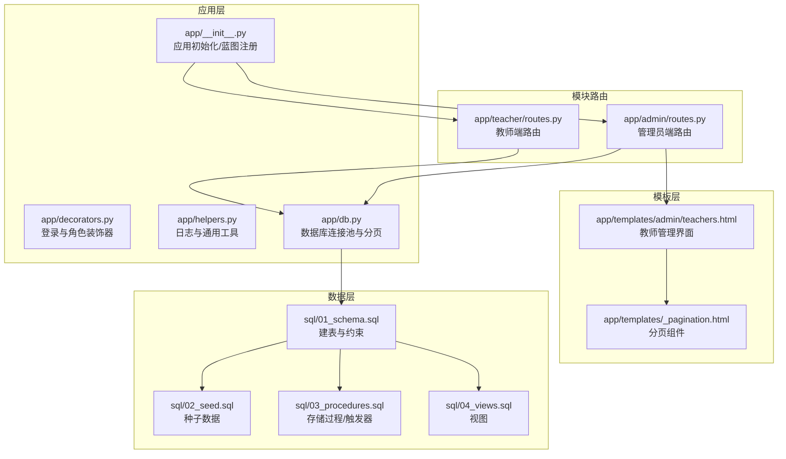
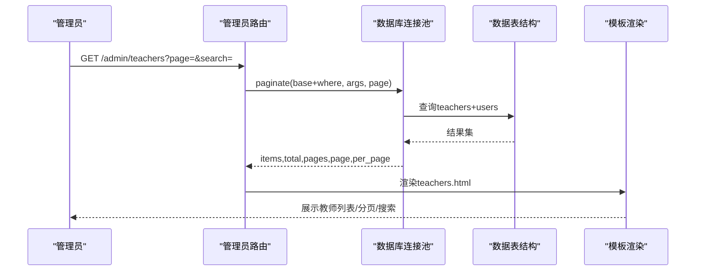
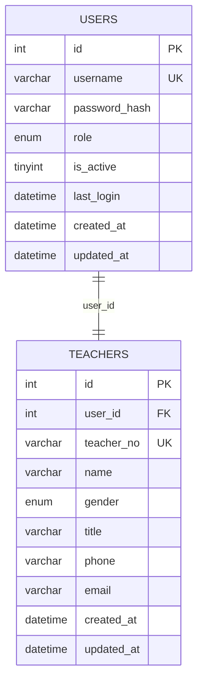
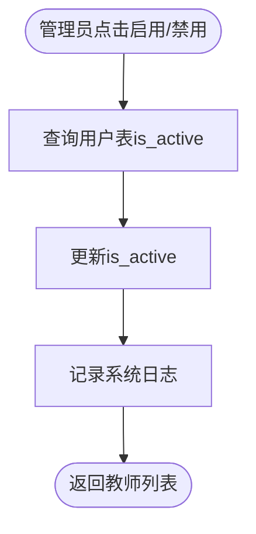
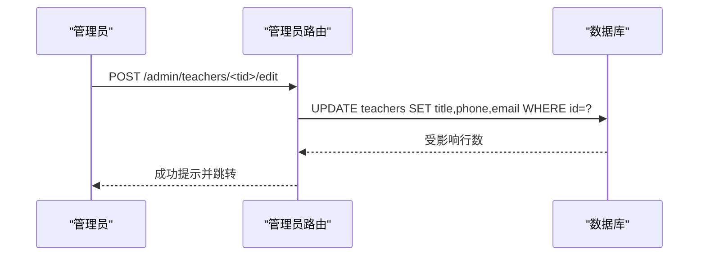
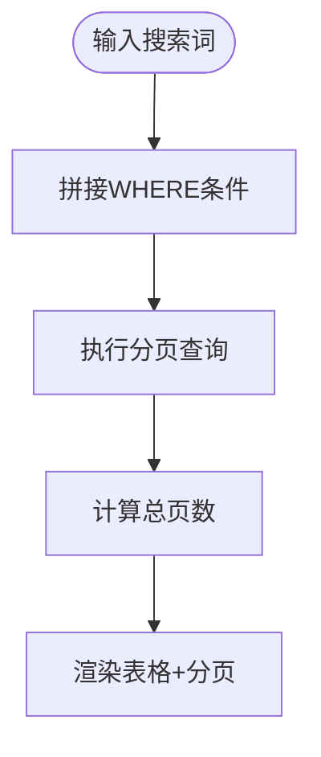
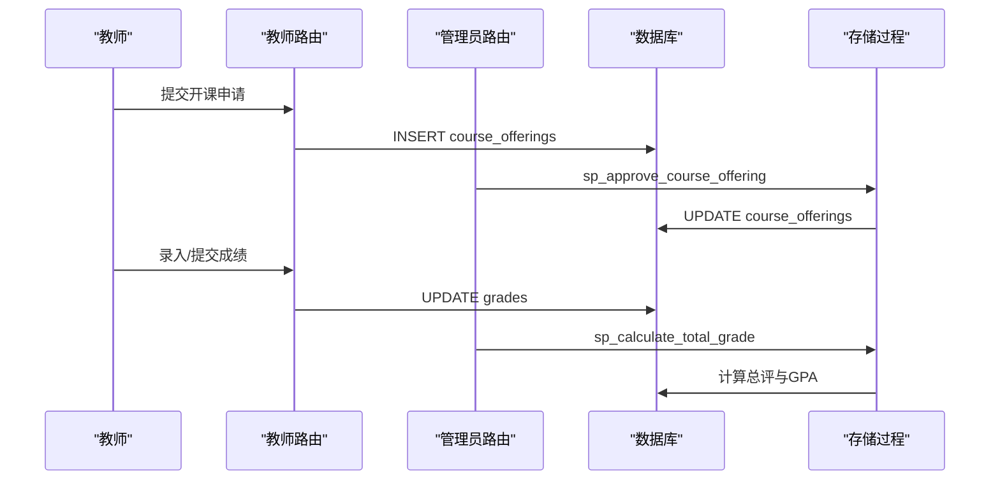
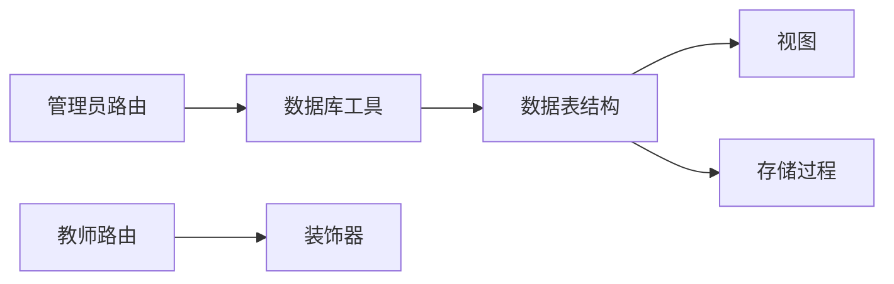

# 教师管理

<cite>
**本文引用的文件**
- [app/teacher/routes.py](file://app/teacher/routes.py)
- [app/admin/routes.py](file://app/admin/routes.py)
- [app/db.py](file://app/db.py)
- [app/decorators.py](file://app/decorators.py)
- [app/helpers.py](file://app/helpers.py)
- [app/__init__.py](file://app/__init__.py)
- [config.py](file://config.py)
- [app/templates/admin/teachers.html](file://app/templates/admin/teachers.html)
- [app/templates/_pagination.html](file://app/templates/_pagination.html)
- [sql/01_schema.sql](file://sql/01_schema.sql)
- [sql/02_seed.sql](file://sql/02_seed.sql)
- [sql/03_procedures.sql](file://sql/03_procedures.sql)
- [sql/04_views.sql](file://sql/04_views.sql)
</cite>

## 目录
1. [简介](#简介)
2. [项目结构](#项目结构)
3. [核心组件](#核心组件)
4. [架构总览](#架构总览)
5. [详细组件分析](#详细组件分析)
6. [依赖分析](#依赖分析)
7. [性能考虑](#性能考虑)
8. [故障排查指南](#故障排查指南)
9. [结论](#结论)
10. [附录](#附录)

## 简介
本文件面向“教师管理”功能，系统化梳理教师信息管理的实现细节，包括：
- 教师数据模型（工号、姓名、性别、职称、联系方式、账户状态）
- 教师状态管理机制（账户激活/禁用、对教学权限的影响）
- 教师信息编辑（职称更新、联系方式修改、账户状态控制）
- 搜索过滤（多字段匹配）与分页显示机制
- 操作示例（添加新教师、编辑信息、切换状态、批量管理）
- 与开课申请、成绩管理等模块的关联关系

## 项目结构
系统采用Flask蓝图划分职责，教师管理主要由管理员端实现，教师端提供教学相关入口。数据库层统一通过连接池封装，模板层提供分页与搜索UI。

图表来源
- [app/__init__.py:29-65](file://app/__init__.py#L29-L65)
- [app/admin/routes.py:14-18](file://app/admin/routes.py#L14-L18)
- [app/teacher/routes.py:11-15](file://app/teacher/routes.py#L11-L15)
- [app/db.py:92-121](file://app/db.py#L92-L121)
- [sql/01_schema.sql:15-95](file://sql/01_schema.sql#L15-L95)

章节来源
- [app/__init__.py:29-65](file://app/__init__.py#L29-L65)
- [app/admin/routes.py:302-384](file://app/admin/routes.py#L302-L384)
- [app/teacher/routes.py:11-15](file://app/teacher/routes.py#L11-L15)
- [app/db.py:92-121](file://app/db.py#L92-L121)
- [sql/01_schema.sql:15-95](file://sql/01_schema.sql#L15-L95)

## 核心组件
- 数据模型与约束
  - 用户表users：角色、激活状态、唯一用户名
  - 教师表teachers：唯一工号、唯一用户绑定、可空联系方式与职称
- 管理端路由
  - 教师列表、搜索、分页
  - 添加教师（生成随机工号、创建用户并绑定）
  - 编辑教师（职称、电话、邮箱）
  - 切换教师账户状态（基于用户表is_active）
  - 重置教师密码
- 教师端路由
  - 教师仪表盘、开课申请、我的开课、学生名单、成绩录入与提交
- 工具与封装
  - 分页工具paginate
  - 日志记录log_action
  - 登录/角色装饰器role_required

章节来源
- [sql/01_schema.sql:15-95](file://sql/01_schema.sql#L15-L95)
- [app/admin/routes.py:302-384](file://app/admin/routes.py#L302-L384)
- [app/teacher/routes.py:51-160](file://app/teacher/routes.py#L51-L160)
- [app/db.py:92-121](file://app/db.py#L92-L121)
- [app/helpers.py:9-21](file://app/helpers.py#L9-L21)
- [app/decorators.py:13-25](file://app/decorators.py#L13-L25)

## 架构总览
教师管理功能在“管理员端”实现，通过统一的数据库连接池与分页工具，结合模板渲染与CSRF保护，提供安全可控的教师信息维护能力。

图表来源
- [app/admin/routes.py:302-317](file://app/admin/routes.py#L302-L317)
- [app/db.py:92-121](file://app/db.py#L92-L121)
- [sql/01_schema.sql:80-95](file://sql/01_schema.sql#L80-L95)

## 详细组件分析

### 教师数据模型与约束
- 用户表users：包含用户名、密码哈希、角色、激活状态等，唯一用户名索引，角色索引
- 教师表teachers：包含工号、姓名、性别、职称、电话、邮箱，唯一工号与唯一用户绑定，外键级联删除与更新

图表来源
- [sql/01_schema.sql:15-26](file://sql/01_schema.sql#L15-L26)
- [sql/01_schema.sql:80-95](file://sql/01_schema.sql#L80-L95)

章节来源
- [sql/01_schema.sql:15-26](file://sql/01_schema.sql#L15-L26)
- [sql/01_schema.sql:80-95](file://sql/01_schema.sql#L80-L95)

### 教师状态管理机制
- 账户激活/禁用
  - 通过管理员端路由切换用户表is_active字段
  - 教师端路由使用@role_required('teacher')与@login_required确保仅激活用户可访问
- 对教学权限的影响
  - 教师端路由在进入前强制校验角色与登录状态
  - 教师仅能操作自己名下的开课与成绩，防止越权

图表来源
- [app/admin/routes.py:319-327](file://app/admin/routes.py#L319-L327)
- [app/teacher/routes.py:11-15](file://app/teacher/routes.py#L11-L15)
- [app/helpers.py:9-21](file://app/helpers.py#L9-L21)

章节来源
- [app/admin/routes.py:319-327](file://app/admin/routes.py#L319-L327)
- [app/teacher/routes.py:11-15](file://app/teacher/routes.py#L11-L15)
- [app/helpers.py:9-21](file://app/helpers.py#L9-L21)

### 教师信息编辑功能
- 职称更新、联系方式修改
  - 管理员端提供编辑表单，提交后更新teachers表对应字段
- 账户状态控制
  - 管理员端提供启用/禁用按钮，直接切换users表is_active
- 密码重置
  - 管理员端提供重置密码功能，校验长度后更新users表密码哈希

图表来源
- [app/admin/routes.py:330-337](file://app/admin/routes.py#L330-L337)

章节来源
- [app/admin/routes.py:330-337](file://app/admin/routes.py#L330-L337)

### 搜索过滤与分页显示
- 多字段匹配
  - 搜索框支持姓名、工号、用户名三字段模糊匹配
  - SQL使用LIKE通配符，参数化避免注入
- 分页机制
  - 使用paginate工具，自动计算总数、页数，限制每页数量
  - 模板侧渲染分页导航与当前页信息

图表来源
- [app/admin/routes.py:302-317](file://app/admin/routes.py#L302-L317)
- [app/db.py:92-121](file://app/db.py#L92-L121)
- [app/templates/_pagination.html:1-11](file://app/templates/_pagination.html#L1-11)

章节来源
- [app/admin/routes.py:302-317](file://app/admin/routes.py#L302-L317)
- [app/db.py:92-121](file://app/db.py#L92-L121)
- [app/templates/_pagination.html:1-11](file://app/templates/_pagination.html#L1-L11)

### 操作示例
- 添加新教师
  - 管理员在“添加教师”弹窗填写用户名、密码、姓名、性别、职称、电话、邮箱
  - 后端生成随机工号，创建用户并绑定为教师
- 编辑现有教师信息
  - 在教师列表点击“编辑”，修改职称、电话、邮箱后保存
- 切换账户状态
  - 在教师列表点击“启用/禁用”按钮，即时切换用户激活状态
- 批量管理
  - 教师端在“我的开课-学生名单”页面可批量录入成绩并提交

章节来源
- [app/admin/routes.py:340-366](file://app/admin/routes.py#L340-L366)
- [app/admin/routes.py:330-337](file://app/admin/routes.py#L330-L337)
- [app/admin/routes.py:319-327](file://app/admin/routes.py#L319-L327)
- [app/teacher/routes.py:137-159](file://app/teacher/routes.py#L137-L159)
- [app/teacher/routes.py:238-274](file://app/teacher/routes.py#L238-L274)

### 与开课申请、成绩管理的关联
- 开课申请
  - 教师端可提交开课申请，管理员端进行审核与发布
  - 教师仅能操作自己名下的开课记录
- 成绩管理
  - 教师可录入平时与期末成绩，提交后等待管理员审核与发布
  - 支持批量录入与批量提交，成绩状态机为草稿→提交→审核→发布
- 视图与存储过程
  - 提供教师工作量统计视图，支撑统计分析
  - 存储过程用于开课审核、成绩计算与GPA计算

图表来源
- [app/teacher/routes.py:68-85](file://app/teacher/routes.py#L68-L85)
- [app/admin/routes.py:414-431](file://app/admin/routes.py#L414-L431)
- [app/teacher/routes.py:162-203](file://app/teacher/routes.py#L162-L203)
- [sql/03_procedures.sql:277-320](file://sql/03_procedures.sql#L277-L320)
- [sql/03_procedures.sql:197-236](file://sql/03_procedures.sql#L197-L236)

章节来源
- [app/teacher/routes.py:68-85](file://app/teacher/routes.py#L68-L85)
- [app/admin/routes.py:414-431](file://app/admin/routes.py#L414-L431)
- [app/teacher/routes.py:162-203](file://app/teacher/routes.py#L162-L203)
- [sql/03_procedures.sql:277-320](file://sql/03_procedures.sql#L277-L320)
- [sql/03_procedures.sql:197-236](file://sql/03_procedures.sql#L197-L236)

## 依赖分析
- 路由层依赖
  - 管理员端路由依赖数据库工具与分页函数
  - 教师端路由依赖登录与角色装饰器
- 数据层依赖
  - 教师管理依赖users与teachers表结构
  - 成绩管理依赖grades与enrollments表结构
- 视图与存储过程
  - 视图提供统计与报表数据
  - 存储过程封装复杂业务逻辑（审核、计算）

图表来源
- [app/admin/routes.py:302-384](file://app/admin/routes.py#L302-L384)
- [app/teacher/routes.py:11-15](file://app/teacher/routes.py#L11-L15)
- [app/db.py:92-121](file://app/db.py#L92-L121)
- [sql/01_schema.sql:15-95](file://sql/01_schema.sql#L15-L95)
- [sql/04_views.sql:72-113](file://sql/04_views.sql#L72-L113)
- [sql/03_procedures.sql:277-320](file://sql/03_procedures.sql#L277-L320)

章节来源
- [app/admin/routes.py:302-384](file://app/admin/routes.py#L302-L384)
- [app/teacher/routes.py:11-15](file://app/teacher/routes.py#L11-L15)
- [app/db.py:92-121](file://app/db.py#L92-L121)
- [sql/01_schema.sql:15-95](file://sql/01_schema.sql#L15-L95)
- [sql/04_views.sql:72-113](file://sql/04_views.sql#L72-L113)
- [sql/03_procedures.sql:277-320](file://sql/03_procedures.sql#L277-L320)

## 性能考虑
- 连接池
  - 使用PooledDB减少连接开销，合理设置最小/最大缓存与连接数
- 分页
  - paginate自动计算总数与分页，避免一次性加载大量数据
- 索引
  - users表role与username索引，teachers表user_id与工号索引，提升查询效率
- 存储过程
  - 将复杂逻辑下沉至数据库，减少往返与网络开销

章节来源
- [config.py:19-25](file://config.py#L19-L25)
- [app/db.py:92-121](file://app/db.py#L92-L121)
- [sql/01_schema.sql:15-26](file://sql/01_schema.sql#L15-L26)
- [sql/01_schema.sql:80-95](file://sql/01_schema.sql#L80-L95)

## 故障排查指南
- 403权限不足
  - 确认当前用户角色为admin或teacher，且账户处于激活状态
- 404资源不存在
  - 检查教师ID或开课ID是否正确
- 数据库异常
  - 查看系统日志，确认存储过程返回码与消息
- 成绩状态异常
  - 成绩提交后无法修改，需先撤回至草稿再编辑

章节来源
- [app/__init__.py:77-90](file://app/__init__.py#L77-L90)
- [app/helpers.py:9-21](file://app/helpers.py#L9-L21)
- [app/teacher/routes.py:177-183](file://app/teacher/routes.py#L177-L183)

## 结论
教师管理功能以管理员端为核心，结合统一的数据库连接池、分页与搜索机制，实现了对教师信息的全生命周期管理。通过严格的权限控制与状态机设计，保障了教学活动的有序开展。与开课申请、成绩管理的紧密耦合，形成了完整的教务闭环。

## 附录
- 配置项
  - 分页每页条数：15
  - 数据库连接池：最小缓存2，最大缓存10，最大连接20
- 关键视图
  - 教师工作量统计视图：按教师维度汇总开课数、学生数与学分
- 关键存储过程
  - 开课审核：sp_approve_course_offering
  - 成绩计算：sp_calculate_total_grade、sp_calculate_gpa

章节来源
- [config.py:24-35](file://config.py#L24-L35)
- [sql/04_views.sql:94-113](file://sql/04_views.sql#L94-L113)
- [sql/03_procedures.sql:277-320](file://sql/03_procedures.sql#L277-L320)
- [sql/03_procedures.sql:197-274](file://sql/03_procedures.sql#L197-L274)