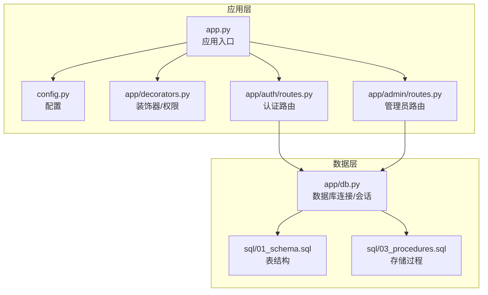
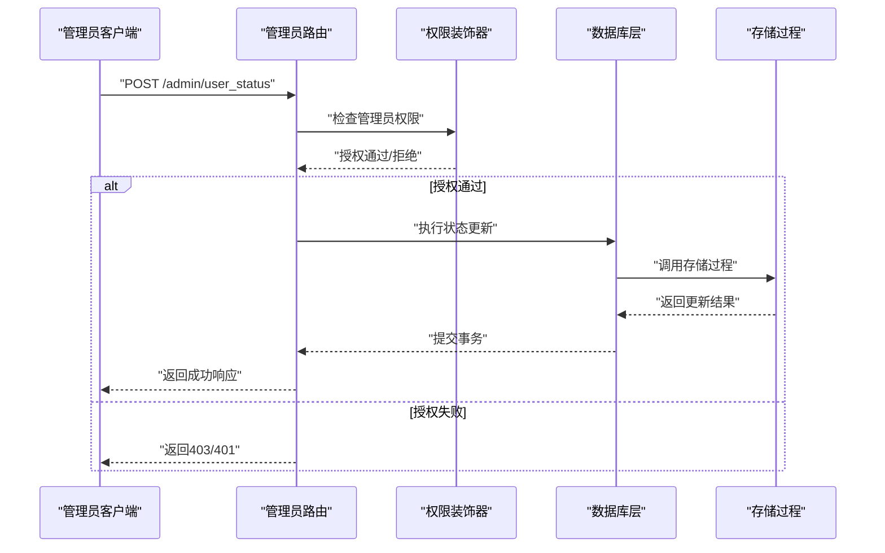
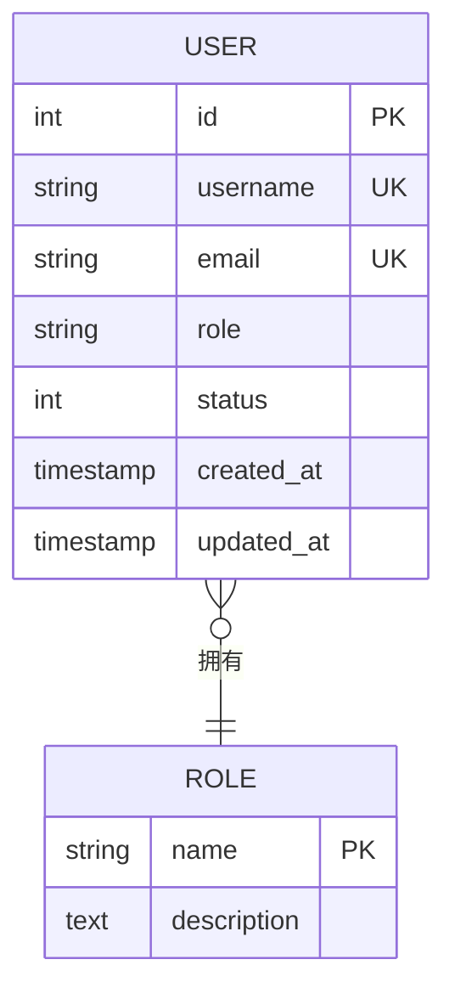
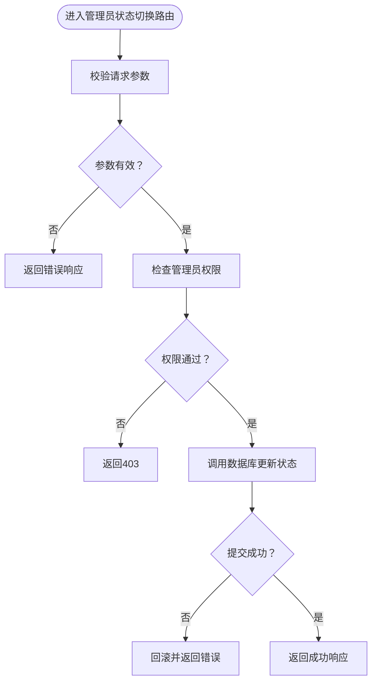
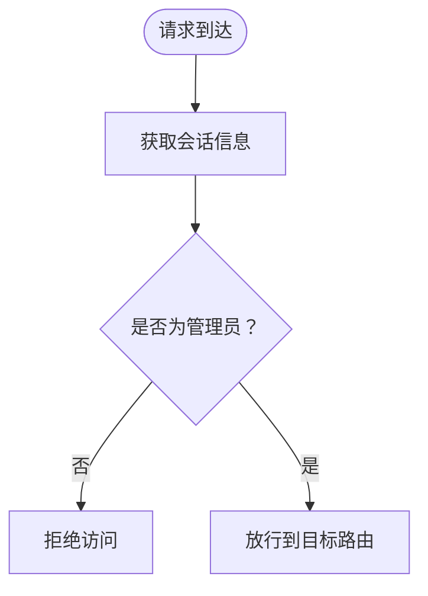
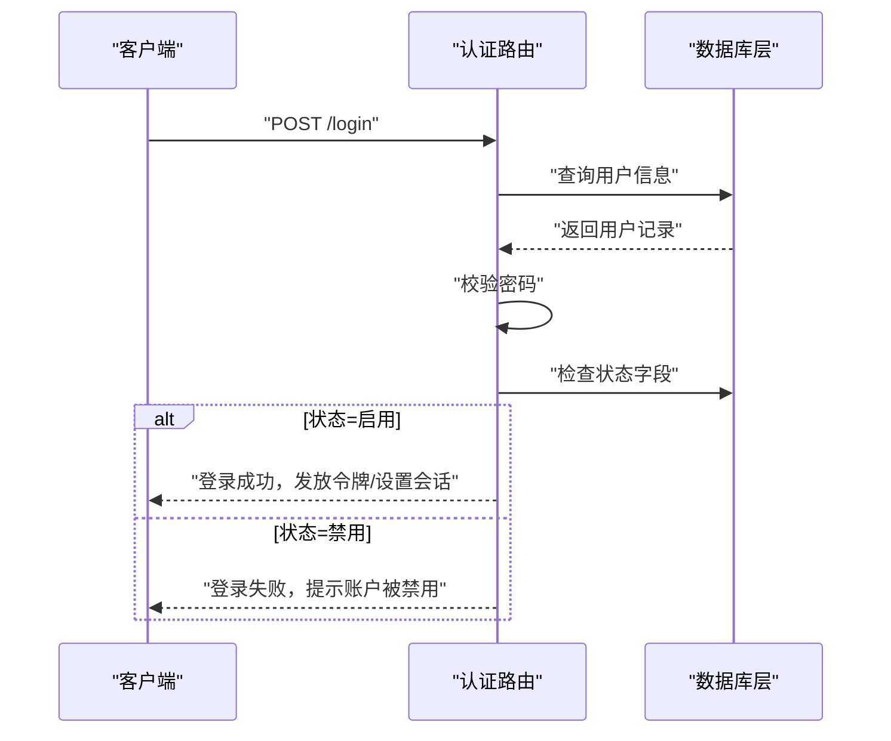
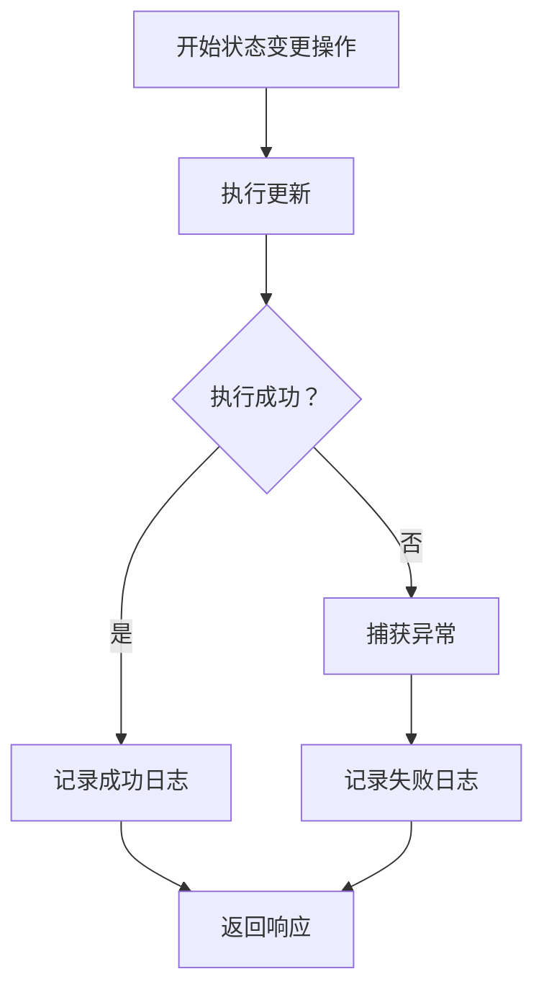
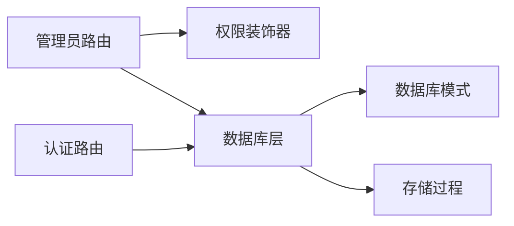

# 用户状态控制

<cite>
**本文档引用的文件**
- [app.py](file://app.py)
- [config.py](file://config.py)
- [app/db.py](file://app/db.py)
- [app/admin/routes.py](file://app/admin/routes.py)
- [app/auth/routes.py](file://app/auth/routes.py)
- [app/decorators.py](file://app/decorators.py)
- [sql/01_schema.sql](file://sql/01_schema.sql)
- [sql/03_procedures.sql](file://sql/03_procedures.sql)
</cite>

## 目录
1. [引言](#引言)
2. [项目结构](#项目结构)
3. [核心组件](#核心组件)
4. [架构概览](#架构概览)
5. [详细组件分析](#详细组件分析)
6. [依赖关系分析](#依赖关系分析)
7. [性能考虑](#性能考虑)
8. [故障排除指南](#故障排除指南)
9. [结论](#结论)
10. [附录](#附录)

## 引言
本文件系统性梳理MIS系统中的用户状态控制机制，重点覆盖以下方面：
- 学生与教师两类用户的统一状态管理（启用/禁用）
- 状态切换的业务逻辑与转换规则（0/1映射）
- 权限验证、操作日志与异常处理
- 对登录权限、功能访问与数据操作的影响
- 常见问题排查与最佳实践

为确保准确性，本文所有技术细节均基于仓库中实际存在的文件进行分析与总结。

## 项目结构
MIS系统采用Flask应用结构，用户状态控制涉及后端路由、数据库层、存储过程以及模板渲染等模块。关键文件分布如下：
- 应用入口与配置：app.py、config.py
- 数据库初始化与连接：app/db.py
- 管理员功能：app/admin/routes.py（含用户管理相关路由）
- 认证与登录：app/auth/routes.py
- 装饰器与权限控制：app/decorators.py
- 数据库模式与存储过程：sql/01_schema.sql、sql/03_procedures.sql

**图表来源**
- [app.py](file://app.py)
- [config.py](file://config.py)
- [app/db.py](file://app/db.py)
- [app/admin/routes.py](file://app/admin/routes.py)
- [app/auth/routes.py](file://app/auth/routes.py)
- [app/decorators.py](file://app/decorators.py)
- [sql/01_schema.sql](file://sql/01_schema.sql)
- [sql/03_procedures.sql](file://sql/03_procedures.sql)

**章节来源**
- [app.py](file://app.py)
- [config.py](file://config.py)
- [app/db.py](file://app/db.py)
- [app/admin/routes.py](file://app/admin/routes.py)
- [app/auth/routes.py](file://app/auth/routes.py)
- [app/decorators.py](file://app/decorators.py)
- [sql/01_schema.sql](file://sql/01_schema.sql)
- [sql/03_procedures.sql](file://sql/03_procedures.sql)

## 核心组件
- 用户状态字段与约束：通过数据库模式定义用户状态字段及约束，确保状态值域合法。
- 管理员状态变更接口：在管理员路由中提供状态切换的HTTP端点。
- 权限与装饰器：通过装饰器实现管理员身份校验与最小权限原则。
- 数据库事务与存储过程：封装状态更新逻辑，保证原子性与一致性。
- 登录与会话：认证路由负责登录校验，结合状态字段决定是否允许登录。

**章节来源**
- [app/admin/routes.py](file://app/admin/routes.py)
- [app/auth/routes.py](file://app/auth/routes.py)
- [app/decorators.py](file://app/decorators.py)
- [app/db.py](file://app/db.py)
- [sql/01_schema.sql](file://sql/01_schema.sql)
- [sql/03_procedures.sql](file://sql/03_procedures.sql)

## 架构概览
用户状态控制的整体流程如下：
- 管理员发起状态切换请求
- 后端路由接收请求并进行权限校验
- 数据库层执行状态更新（使用存储过程或直接SQL）
- 返回结果并记录操作日志
- 登录时根据状态字段判断是否放行

**图表来源**
- [app/admin/routes.py](file://app/admin/routes.py)
- [app/decorators.py](file://app/decorators.py)
- [app/db.py](file://app/db.py)
- [sql/03_procedures.sql](file://sql/03_procedures.sql)

## 详细组件分析

### 数据模型与状态字段
- 用户表包含状态字段，用于标识启用/禁用状态。状态值域应受约束，避免非法值。
- 存储过程封装状态更新逻辑，确保事务完整性与一致性。

**图表来源**
- [sql/01_schema.sql](file://sql/01_schema.sql)
- [sql/03_procedures.sql](file://sql/03_procedures.sql)

**章节来源**
- [sql/01_schema.sql](file://sql/01_schema.sql)
- [sql/03_procedures.sql](file://sql/03_procedures.sql)

### 管理员状态切换路由
- 路由负责接收状态切换请求，解析参数并调用数据库层执行更新。
- 需要与权限装饰器配合，仅允许管理员访问。

**图表来源**
- [app/admin/routes.py](file://app/admin/routes.py)
- [app/decorators.py](file://app/decorators.py)
- [app/db.py](file://app/db.py)

**章节来源**
- [app/admin/routes.py](file://app/admin/routes.py)
- [app/decorators.py](file://app/decorators.py)
- [app/db.py](file://app/db.py)

### 权限验证与装饰器
- 装饰器实现管理员身份校验，确保只有具备相应角色的用户才能执行状态切换。
- 可结合会话信息与数据库查询进行二次校验。

**图表来源**
- [app/decorators.py](file://app/decorators.py)
- [app/auth/routes.py](file://app/auth/routes.py)

**章节来源**
- [app/decorators.py](file://app/decorators.py)
- [app/auth/routes.py](file://app/auth/routes.py)

### 登录与状态联动
- 登录路由在验证凭据的同时，需检查用户状态字段以决定是否允许登录。
- 若状态为禁用，则拒绝登录并返回相应提示。

**图表来源**
- [app/auth/routes.py](file://app/auth/routes.py)
- [app/db.py](file://app/db.py)
- [sql/01_schema.sql](file://sql/01_schema.sql)

**章节来源**
- [app/auth/routes.py](file://app/auth/routes.py)
- [app/db.py](file://app/db.py)
- [sql/01_schema.sql](file://sql/01_schema.sql)

### 操作日志与异常处理
- 状态变更应记录操作日志，包含操作人、目标用户、新旧状态、时间戳等。
- 异常处理需捕获数据库错误、参数错误与权限错误，返回一致化的错误响应。

**图表来源**
- [app/admin/routes.py](file://app/admin/routes.py)
- [app/db.py](file://app/db.py)

**章节来源**
- [app/admin/routes.py](file://app/admin/routes.py)
- [app/db.py](file://app/db.py)

## 依赖关系分析
- 应用层依赖于数据库层提供的连接与事务能力。
- 管理员路由依赖装饰器进行权限校验。
- 认证路由依赖数据库层进行用户查询与状态检查。
- 存储过程依赖数据库表结构与索引设计。

**图表来源**
- [app/admin/routes.py](file://app/admin/routes.py)
- [app/auth/routes.py](file://app/auth/routes.py)
- [app/decorators.py](file://app/decorators.py)
- [app/db.py](file://app/db.py)
- [sql/01_schema.sql](file://sql/01_schema.sql)
- [sql/03_procedures.sql](file://sql/03_procedures.sql)

**章节来源**
- [app/admin/routes.py](file://app/admin/routes.py)
- [app/auth/routes.py](file://app/auth/routes.py)
- [app/decorators.py](file://app/decorators.py)
- [app/db.py](file://app/db.py)
- [sql/01_schema.sql](file://sql/01_schema.sql)
- [sql/03_procedures.sql](file://sql/03_procedures.sql)

## 性能考虑
- 状态字段应建立索引以优化查询性能，特别是在高频登录与批量状态查询场景。
- 存储过程可减少网络往返与SQL拼接风险，提升事务执行效率。
- 分页与条件过滤：在用户列表展示时，按状态分组与筛选可降低前端压力。
- 缓存策略：对于不频繁变动的用户元信息，可考虑短期缓存以减轻数据库压力。

## 故障排除指南
- 症状：状态切换无响应
  - 检查管理员路由是否正确接收参数与权限校验是否通过
  - 确认数据库层事务是否提交成功
- 症状：登录被拒绝但状态为启用
  - 核对登录路由的状态检查逻辑与数据库状态字段值
  - 检查是否存在并发更新导致的状态不一致
- 症状：日志缺失
  - 确认日志记录逻辑是否在成功与失败分支均被执行
  - 检查异常捕获是否遗漏未记录的错误类型
- 症状：权限绕过
  - 复核装饰器的权限判定逻辑与会话校验流程
  - 确保所有敏感路由均受装饰器保护

## 结论
本系统通过数据库层的状态字段、存储过程与应用层的路由与装饰器，实现了对教师与学生两类用户的统一状态管理。管理员可通过受控接口进行状态切换，登录流程则依据状态字段进行即时拦截。为确保安全与稳定，建议完善日志记录、异常处理与权限校验，并持续优化数据库索引与事务性能。

## 附录
- 状态值映射
  - 0：禁用
  - 1：启用
- 影响范围
  - 登录权限：禁用用户无法登录
  - 功能访问：禁用用户在后续请求中可能被拦截
  - 数据操作：禁用用户的数据写入与修改权限通常受限