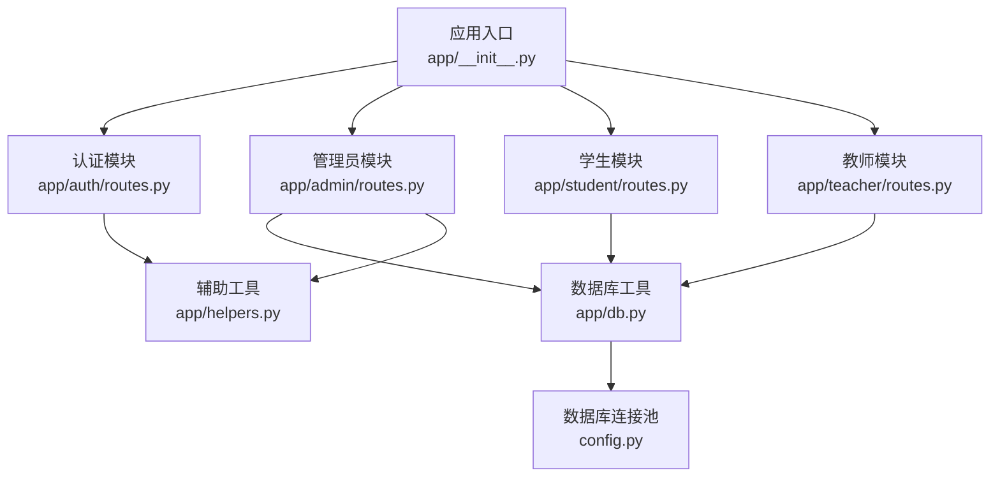
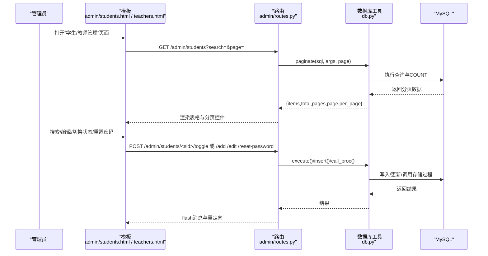
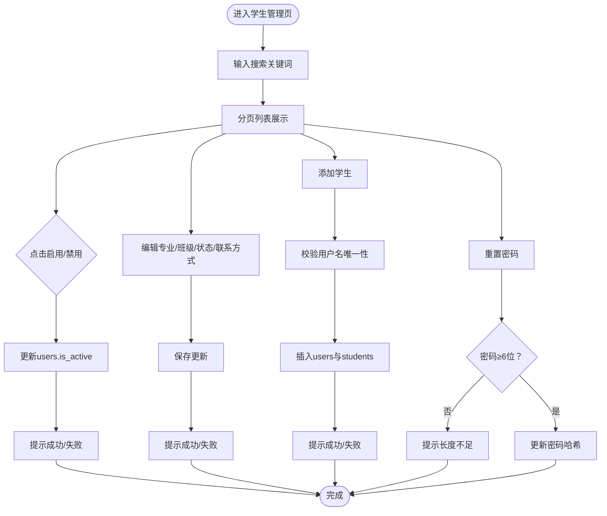
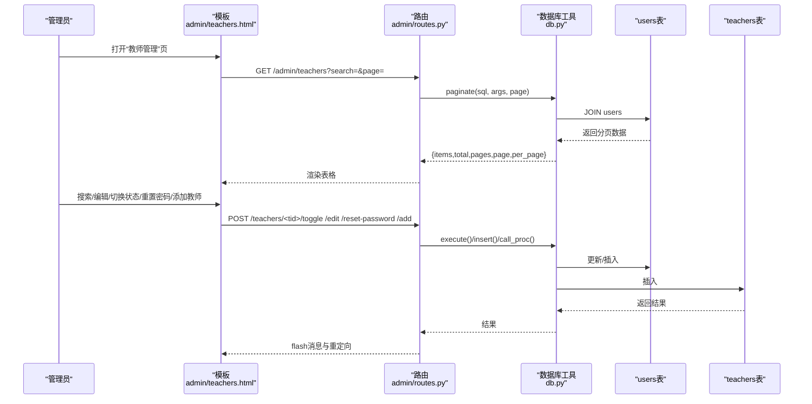
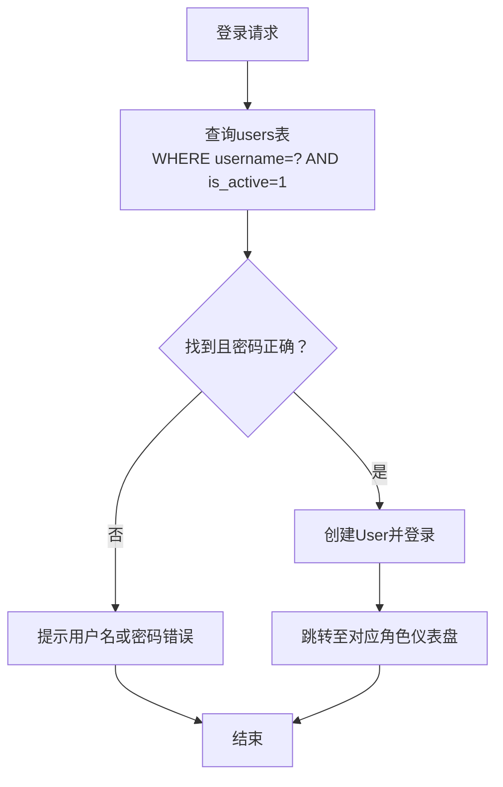
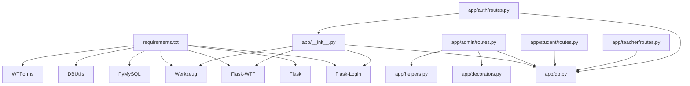

# 用户管理

<cite>
**本文引用的文件**
- [app/__init__.py](file://app/__init__.py)
- [app/admin/routes.py](file://app/admin/routes.py)
- [app/student/routes.py](file://app/student/routes.py)
- [app/teacher/routes.py](file://app/teacher/routes.py)
- [app/db.py](file://app/db.py)
- [app/decorators.py](file://app/decorators.py)
- [app/helpers.py](file://app/helpers.py)
- [app/auth/routes.py](file://app/auth/routes.py)
- [config.py](file://config.py)
- [sql/01_schema.sql](file://sql/01_schema.sql)
- [app/templates/admin/students.html](file://app/templates/admin/students.html)
- [app/templates/admin/teachers.html](file://app/templates/admin/teachers.html)
- [requirements.txt](file://requirements.txt)
- [README.md](file://README.md)
</cite>

## 目录
1. [简介](#简介)
2. [项目结构](#项目结构)
3. [核心组件](#核心组件)
4. [架构总览](#架构总览)
5. [详细组件分析](#详细组件分析)
6. [依赖分析](#依赖分析)
7. [性能考虑](#性能考虑)
8. [故障排查指南](#故障排查指南)
9. [结论](#结论)
10. [附录](#附录)

## 简介
本文件面向“用户管理”功能，围绕学生管理与教师管理两大模块，系统性阐述：
- 学生信息的增删改查、分页查询、搜索过滤与状态切换
- 教师信息维护、职称管理、联系方式更新与账户状态控制
- 用户状态管理机制（激活/禁用）与权限控制影响
- 用户管理界面与操作流程说明，包含批量操作与数据验证规则

本系统采用 Flask + MySQL 架构，通过蓝图划分模块，统一的数据库连接池与分页工具支持高并发场景下的稳定运行。

## 项目结构
- 应用入口与初始化：app/__init__.py 注册蓝图、CSRF 保护、Flask-Login 用户加载器
- 模块路由：
  - 管理员模块：app/admin/routes.py 提供学生/教师管理、分页搜索、状态切换、批量操作等
  - 学生模块：app/student/routes.py 提供学生侧功能（课程、课表、成绩、成绩单）
  - 教师模块：app/teacher/routes.py 提供教师侧功能（开课申请、教学班学生、成绩录入与审核）
  - 认证模块：app/auth/routes.py 提供登录/注册/个人资料
- 数据层：app/db.py 提供连接池、查询、分页、存储过程调用等
- 辅助工具：app/helpers.py 提供日志、课表解析、冲突检测、选课时间段等
- 配置：config.py 定义数据库连接、分页数量、权重与预警阈值
- 数据库：sql/01_schema.sql 定义12张核心表，含用户、学生、教师、课程、成绩、日志等

图表来源
- [app/__init__.py:29-92](file://app/__init__.py#L29-L92)
- [app/admin/routes.py:1-640](file://app/admin/routes.py#L1-L640)
- [app/student/routes.py:1-218](file://app/student/routes.py#L1-L218)
- [app/teacher/routes.py:1-271](file://app/teacher/routes.py#L1-L271)
- [app/db.py:1-121](file://app/db.py#L1-L121)
- [config.py:1-36](file://config.py#L1-L36)
- [app/helpers.py:1-80](file://app/helpers.py#L1-L80)

章节来源
- [app/__init__.py:29-92](file://app/__init__.py#L29-L92)
- [README.md:46-87](file://README.md#L46-L87)

## 核心组件
- 用户模型与登录集成：app/__init__.py 中的 User 类实现 Flask-Login 的 UserMixin 接口，从数据库 users 表加载用户数据，并暴露 is_active 属性用于权限控制
- 权限装饰器：app/decorators.py 提供 @login_required 与 @role_required，确保路由仅对已登录且具备指定角色的用户开放
- 数据库连接池与分页：app/db.py 提供连接池、查询、写入、存储过程调用与通用分页工具，支持按页返回 items、total、pages、page、per_page
- 管理员用户管理：app/admin/routes.py 提供学生/教师的增删改查、分页搜索、状态切换、密码重置、批量发布等
- 学生/教师功能：app/student/routes.py 与 app/teacher/routes.py 分别提供学生侧与教师侧的功能入口与数据展示

章节来源
- [app/__init__.py:10-27](file://app/__init__.py#L10-L27)
- [app/decorators.py:7-26](file://app/decorators.py#L7-L26)
- [app/db.py:92-121](file://app/db.py#L92-L121)
- [app/admin/routes.py:196-364](file://app/admin/routes.py#L196-L364)
- [app/student/routes.py:1-218](file://app/student/routes.py#L1-L218)
- [app/teacher/routes.py:1-271](file://app/teacher/routes.py#L1-L271)

## 架构总览
用户管理涉及三层交互：前端模板、后端路由、数据库层。管理员通过模板渲染表格与表单，路由处理请求并调用数据库工具，数据库层由 MySQL 与存储过程支撑。

图表来源
- [app/templates/admin/students.html:1-117](file://app/templates/admin/students.html#L1-L117)
- [app/templates/admin/teachers.html:1-92](file://app/templates/admin/teachers.html#L1-L92)
- [app/admin/routes.py:196-364](file://app/admin/routes.py#L196-L364)
- [app/db.py:92-121](file://app/db.py#L92-L121)

## 详细组件分析

### 学生管理功能
- 列表与分页查询
  - 路由：/admin/students
  - 功能：支持按姓名/学号/用户名模糊搜索；分页显示，每页数量由配置决定
  - 实现要点：动态拼接 WHERE 条件与参数，使用 paginate 工具返回 items、total、pages、page、per_page
- 搜索过滤
  - 支持多字段模糊匹配，提升检索效率
- 状态切换
  - 路由：/admin/students/<int:sid>/toggle
  - 逻辑：根据当前 is_active 取反更新 users 表，实现“启用/禁用”
- 信息编辑
  - 路由：/admin/students/<int:sid>/edit
  - 字段：专业、班级、学籍状态、电话、邮箱
- 新增学生
  - 路由：/admin/students/add
  - 步骤：校验用户名唯一性；生成随机学号；插入 users 与 students 表
- 密码重置
  - 路由：/admin/students/<int:sid>/reset-password
  - 规则：新密码至少6位
- 界面与操作流程
  - 模板：app/templates/admin/students.html
  - 操作：搜索 -> 编辑 -> 切换状态 -> 重置密码 -> 添加学生
  - 批量操作：当前路由未提供批量切换/删除，但可通过扩展实现

图表来源
- [app/admin/routes.py:203-284](file://app/admin/routes.py#L203-L284)
- [app/templates/admin/students.html:1-117](file://app/templates/admin/students.html#L1-L117)

章节来源
- [app/admin/routes.py:196-284](file://app/admin/routes.py#L196-L284)
- [app/templates/admin/students.html:1-117](file://app/templates/admin/students.html#L1-L117)

### 教师管理功能
- 列表与分页查询
  - 路由：/admin/teachers
  - 功能：按姓名/工号/用户名模糊搜索；分页显示
- 状态切换
  - 路由：/admin/teachers/<int:tid>/toggle
  - 逻辑：根据当前 is_active 取反更新 users 表
- 信息编辑
  - 路由：/admin/teachers/<int:tid>/edit
  - 字段：职称、电话、邮箱
- 新增教师
  - 路由：/admin/teachers/add
  - 步骤：校验用户名唯一性；生成随机工号；插入 users 与 teachers 表
- 密码重置
  - 路由：/admin/teachers/<int:tid>/reset-password
  - 规则：新密码至少6位
- 界面与操作流程
  - 模板：app/templates/admin/teachers.html
  - 操作：搜索 -> 编辑 -> 切换状态 -> 重置密码 -> 添加教师

图表来源
- [app/templates/admin/teachers.html:1-92](file://app/templates/admin/teachers.html#L1-L92)
- [app/admin/routes.py:286-364](file://app/admin/routes.py#L286-L364)
- [app/db.py:92-121](file://app/db.py#L92-L121)

章节来源
- [app/admin/routes.py:286-364](file://app/admin/routes.py#L286-L364)
- [app/templates/admin/teachers.html:1-92](file://app/templates/admin/teachers.html#L1-L92)

### 用户状态管理机制与权限控制
- 用户状态
  - users 表中的 is_active 字段控制用户是否可用
  - 管理员可对任意学生/教师执行启用/禁用操作
- 登录与权限
  - app/__init__.py 中的 load_user 从 users 表加载用户，并将 is_active 传递给 Flask-Login
  - app/decorators.py 提供 @role_required('admin') 限制管理员模块访问
  - app/auth/routes.py 在登录时要求 is_active=1，防止被禁用用户登录
- 影响范围
  - 禁用用户将无法登录，其角色相关的模块访问也会被拦截
  - 启用后恢复全部功能

图表来源
- [app/auth/routes.py:32-56](file://app/auth/routes.py#L32-L56)
- [app/__init__.py:47-51](file://app/__init__.py#L47-L51)
- [app/decorators.py:13-25](file://app/decorators.py#L13-L25)

章节来源
- [app/auth/routes.py:32-56](file://app/auth/routes.py#L32-L56)
- [app/__init__.py:47-51](file://app/__init__.py#L47-L51)
- [app/decorators.py:13-25](file://app/decorators.py#L13-L25)

### 数据验证规则与安全控制
- 学生新增
  - 用户名唯一性校验
  - 随机学号生成，避免冲突
- 教师新增
  - 用户名唯一性校验
  - 随机工号生成，避免冲突
- 密码重置
  - 新密码长度至少6位
- 登录
  - 仅允许 is_active=1 的用户登录
- CSRF 保护
  - app/__init__.py 初始化 CSRFProtect，模板中包含隐藏字段
- 权限装饰器
  - @role_required('admin') 保证管理员专属路由的安全访问

章节来源
- [app/admin/routes.py:240-284](file://app/admin/routes.py#L240-L284)
- [app/admin/routes.py:322-364](file://app/admin/routes.py#L322-L364)
- [app/auth/routes.py:58-110](file://app/auth/routes.py#L58-L110)
- [app/__init__.py:7-33](file://app/__init__.py#L7-L33)
- [app/decorators.py:13-25](file://app/decorators.py#L13-L25)

### 批量操作与扩展建议
- 当前实现
  - 学生/教师列表支持分页与搜索，状态切换为单条操作
  - 管理员模块提供“批量发布成绩”示例（非用户管理）
- 扩展建议
  - 批量启用/禁用：在模板中增加全选复选框与批量按钮，后端接收 ids 列表循环执行 toggle
  - 批量删除：在确认后批量删除 users 与其关联记录（注意外键约束与事务）
  - 批量重置密码：批量生成安全随机密码并发送通知
- 注意事项
  - 批量操作需配合 CSRF 令牌与权限校验
  - 使用数据库事务保证一致性

章节来源
- [app/admin/routes.py:535-551](file://app/admin/routes.py#L535-L551)
- [app/templates/admin/students.html:26-29](file://app/templates/admin/students.html#L26-L29)
- [app/templates/admin/teachers.html:23-26](file://app/templates/admin/teachers.html#L23-L26)

## 依赖分析
- 外部依赖
  - Flask、Flask-Login、Flask-WTF、PyMySQL、DBUtils、Werkzeug、WTForms
- 内部依赖
  - app/__init__.py 依赖 app/db.py 初始化连接池与用户加载器
  - app/admin/routes.py 依赖 app/db.py、app/decorators.py、app/helpers.py
  - app/student/routes.py 与 app/teacher/routes.py 依赖 app/db.py
  - app/auth/routes.py 依赖 app/db.py 与 app/__init__.py 的 User 类

图表来源
- [requirements.txt:1-8](file://requirements.txt#L1-L8)
- [app/__init__.py:29-92](file://app/__init__.py#L29-L92)
- [app/admin/routes.py:1-10](file://app/admin/routes.py#L1-L10)
- [app/decorators.py:1-26](file://app/decorators.py#L1-L26)
- [app/helpers.py:1-80](file://app/helpers.py#L1-L80)
- [app/auth/routes.py:1-11](file://app/auth/routes.py#L1-L11)

章节来源
- [requirements.txt:1-8](file://requirements.txt#L1-L8)
- [app/__init__.py:29-92](file://app/__init__.py#L29-L92)
- [app/admin/routes.py:1-10](file://app/admin/routes.py#L1-L10)

## 性能考虑
- 连接池
  - app/db.py 使用 DBUtils PooledDB，减少连接开销，提高并发吞吐
- 分页
  - app/db.py.paginate 自动计算总数与页数，LIMIT/OFFSET 控制数据量
- 索引
  - users 表 role、is_active 索引；students/teachers 外键索引；semesters 的 is_current 索引等
- 查询优化
  - 模糊搜索使用 LIKE '%keyword%'，建议在高频字段上建立合适索引或考虑全文索引
- 缓存
  - 对于不频繁变动的数据（如专业、班级），可在应用层缓存以降低数据库压力

章节来源
- [app/db.py:10-41](file://app/db.py#L10-L41)
- [app/db.py:92-121](file://app/db.py#L92-L121)
- [sql/01_schema.sql:15-26](file://sql/01_schema.sql#L15-L26)
- [sql/01_schema.sql:47-49](file://sql/01_schema.sql#L47-L49)
- [sql/01_schema.sql:107](file://sql/01_schema.sql#L107)

## 故障排查指南
- 登录失败
  - 检查用户名是否存在且 is_active=1
  - 确认密码哈希匹配
- 用户被禁用
  - 管理员应先启用再尝试登录
- 新增用户失败
  - 校验用户名唯一性；检查随机学号/工号生成是否冲突
- 密码重置失败
  - 确认新密码长度≥6位
- 分页异常
  - 检查 per_page 配置与传入 page 是否为正整数
- CSRF 验证失败
  - 确保模板包含隐藏 CSRF 字段

章节来源
- [app/auth/routes.py:32-56](file://app/auth/routes.py#L32-L56)
- [app/admin/routes.py:240-284](file://app/admin/routes.py#L240-L284)
- [app/admin/routes.py:322-364](file://app/admin/routes.py#L322-L364)
- [app/db.py:92-121](file://app/db.py#L92-L121)
- [app/templates/admin/students.html:26-29](file://app/templates/admin/students.html#L26-L29)
- [app/templates/admin/teachers.html:23-26](file://app/templates/admin/teachers.html#L23-L26)

## 结论
本系统通过清晰的模块划分与统一的数据库工具，实现了管理员对“学生/教师”的高效管理。核心特性包括：
- 完整的增删改查与分页搜索
- 状态切换与密码重置
- 强化的权限控制与安全校验
- 可扩展的批量操作能力

建议后续增强批量操作与审计日志，进一步提升管理效率与合规性。

## 附录
- 数据库表结构概览（用户相关）
  - users：id、username、password_hash、role、is_active、last_login、created_at、updated_at
  - students：user_id、student_no、name、gender、major_id、class_id、enrollment_year、phone、email、status
  - teachers：user_id、teacher_no、name、gender、title、phone、email

章节来源
- [sql/01_schema.sql:15-26](file://sql/01_schema.sql#L15-L26)
- [sql/01_schema.sql:55-77](file://sql/01_schema.sql#L55-L77)
- [sql/01_schema.sql:82-95](file://sql/01_schema.sql#L82-L95)