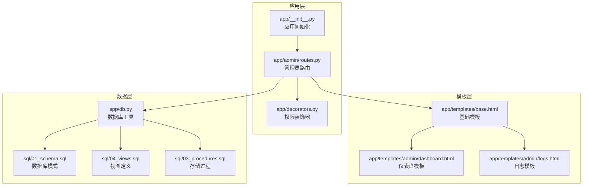
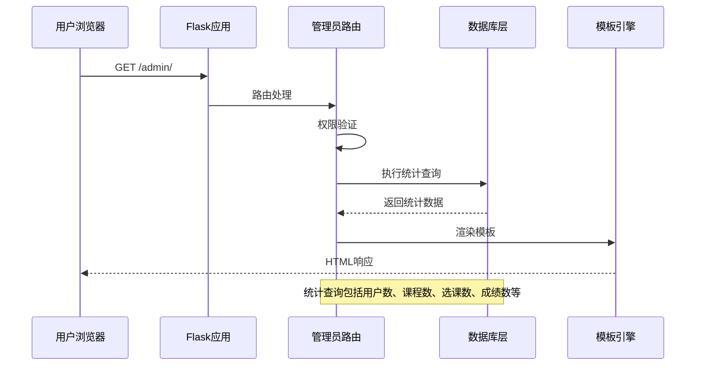
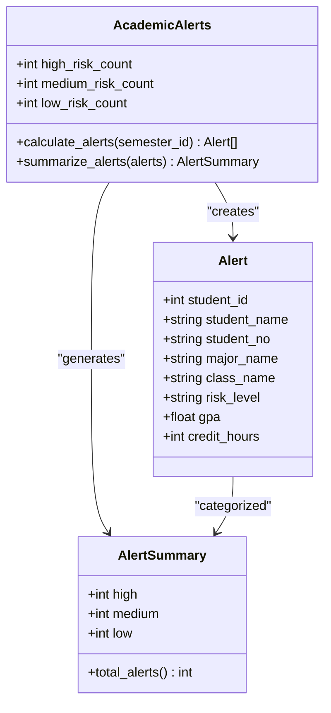
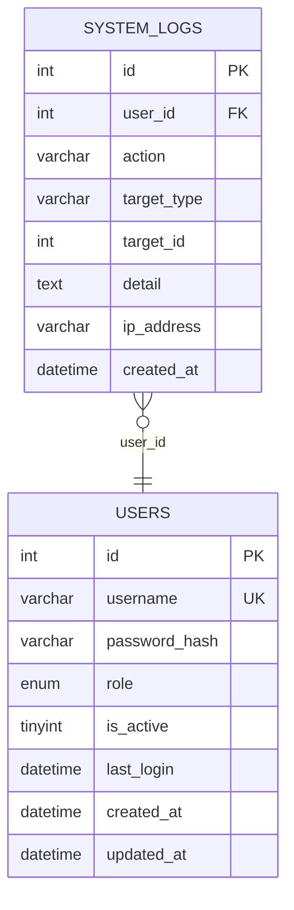
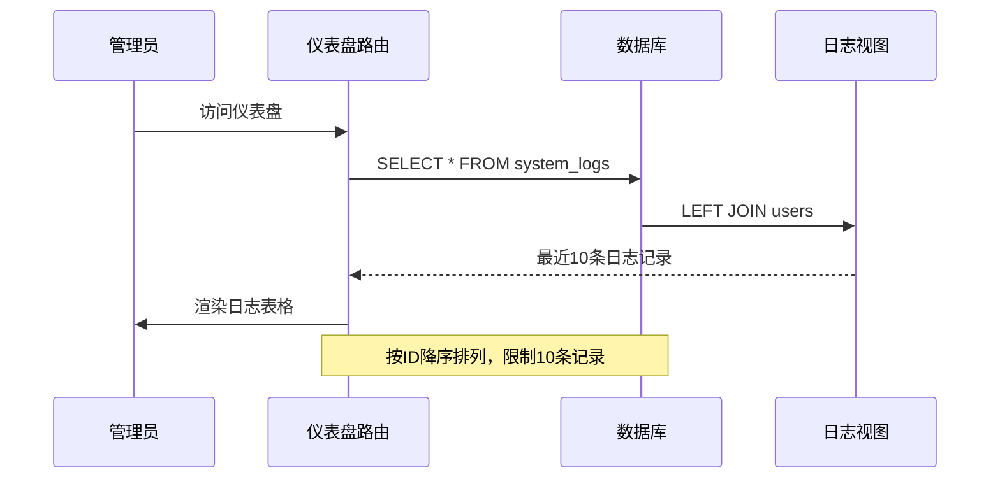
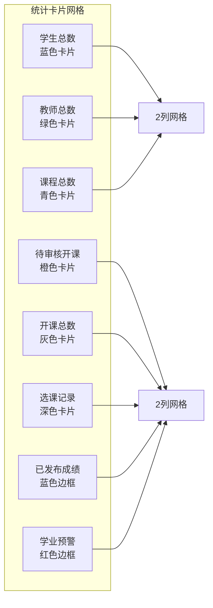
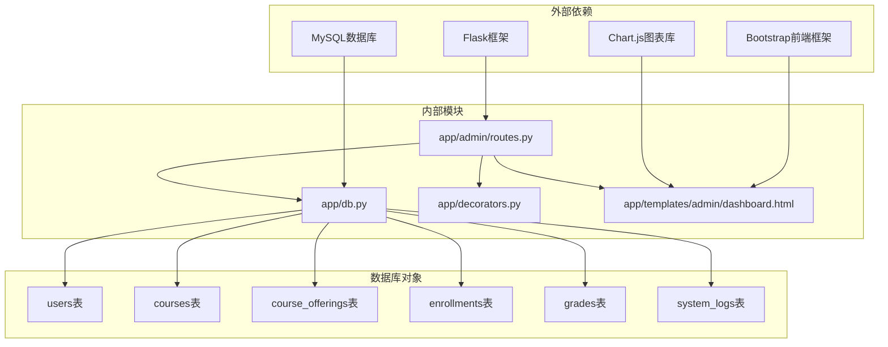
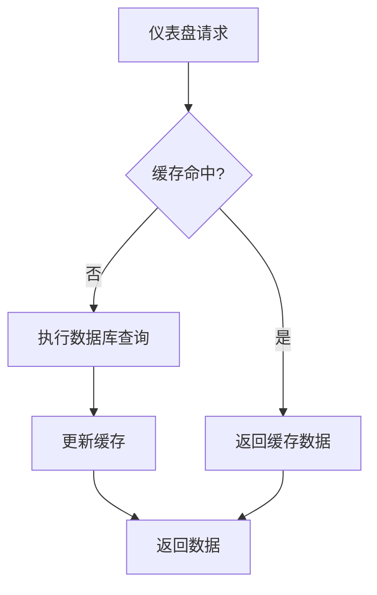

# 管理员仪表盘

<cite>
**本文档引用的文件**
- [app/admin/routes.py](file://app/admin/routes.py)
- [app/templates/admin/dashboard.html](file://app/templates/admin/dashboard.html)
- [app/db.py](file://app/db.py)
- [sql/01_schema.sql](file://sql/01_schema.sql)
- [sql/04_views.sql](file://sql/04_views.sql)
- [app/decorators.py](file://app/decorators.py)
- [app/__init__.py](file://app/__init__.py)
- [config.py](file://config.py)
- [sql/03_procedures.sql](file://sql/03_procedures.sql)
- [app/templates/base.html](file://app/templates/base.html)
- [app/templates/admin/logs.html](file://app/templates/admin/logs.html)
</cite>

## 目录
1. [简介](#简介)
2. [项目结构](#项目结构)
3. [核心组件](#核心组件)
4. [架构概览](#架构概览)
5. [详细组件分析](#详细组件分析)
6. [依赖关系分析](#依赖关系分析)
7. [性能考虑](#性能考虑)
8. [故障排除指南](#故障排除指南)
9. [结论](#结论)

## 简介

管理员仪表盘是校园教务选课与成绩管理系统的核心控制中心，为管理员提供系统的实时概览和关键业务指标。该功能实现了全面的系统监控、统计分析和操作日志追踪，帮助管理员快速了解整个教务系统的运行状况和业务进展。

## 项目结构

系统采用Flask微框架的模块化架构设计，管理员仪表盘功能位于独立的admin蓝图中，与其他用户角色（教师、学生）的功能模块分离，确保了清晰的职责划分和权限控制。



**图表来源**
- [app/__init__.py:29-65](file://app/__init__.py#L29-L65)
- [app/admin/routes.py:10](file://app/admin/routes.py#L10)
- [app/db.py:10-26](file://app/db.py#L10-L26)

**章节来源**
- [app/__init__.py:29-65](file://app/__init__.py#L29-L65)
- [app/admin/routes.py:10](file://app/admin/routes.py#L10)

## 核心组件

管理员仪表盘功能由多个核心组件协同工作，每个组件都有明确的职责和接口：

### 数据统计组件
负责收集和计算系统的关键业务指标，包括用户统计、课程统计、选课统计和成绩统计等。

### 日志追踪组件  
维护系统操作历史，提供详细的审计跟踪和问题诊断能力。

### 权限控制组件
基于角色的访问控制，确保只有授权用户才能访问仪表盘功能。

### 模板渲染组件
使用Jinja2模板引擎生成动态HTML内容，支持响应式设计和Bootstrap样式。

**章节来源**
- [app/admin/routes.py:42-57](file://app/admin/routes.py#L42-L57)
- [app/decorators.py:13-25](file://app/decorators.py#L13-L25)

## 架构概览

管理员仪表盘采用经典的三层架构模式，实现了清晰的关注点分离：



**图表来源**
- [app/admin/routes.py:42-57](file://app/admin/routes.py#L42-L57)
- [app/db.py:43-50](file://app/db.py#L43-L50)

系统架构特点：
- **模块化设计**：每个功能模块独立封装，便于维护和扩展
- **数据驱动**：所有展示内容都来源于数据库查询结果
- **响应式布局**：使用Bootstrap实现跨设备兼容
- **安全防护**：集成CSRF保护和权限验证

## 详细组件分析

### 统计数据获取与展示

仪表盘的核心功能是实时展示系统关键指标，这些指标通过精心设计的SQL查询和视图来实现。

#### 核心统计指标

```mermaid
flowchart TD
A[仪表盘请求] --> B[执行统计查询]
B --> C[用户统计查询]
B --> D[课程统计查询]
B --> E[选课统计查询]
B --> F[成绩统计查询]
B --> G[预警统计查询]
C --> H[学生总数: COUNT(students)]
C --> I[教师总数: COUNT(teachers)]
D --> J[课程总数: COUNT(courses)]
D --> K[开课总数: COUNT(course_offerings)]
D --> L[待审核开课: COUNT(pending)]
E --> M[选课记录: COUNT(enrollments)]
F --> N[已发布成绩: COUNT(published)]
G --> O[学业预警: COUNT(alerts)]
H --> P[汇总到stats字典]
I --> P
J --> P
K --> P
L --> P
M --> P
N --> P
O --> P
```

**图表来源**
- [app/admin/routes.py:44-53](file://app/admin/routes.py#L44-L53)

#### 统计指标详细说明

| 指标名称 | SQL查询 | 含义 | 计算方法 |
|---------|--------|------|----------|
| 学生总数 | `SELECT COUNT(*) FROM students` | 系统注册学生总人数 | 直接统计学生表记录数 |
| 教师总数 | `SELECT COUNT(*) FROM teachers` | 系统注册教师总人数 | 直接统计教师表记录数 |
| 课程总数 | `SELECT COUNT(*) FROM courses` | 系统开设课程总数量 | 直接统计课程表记录数 |
| 开课总数 | `SELECT COUNT(*) FROM course_offerings WHERE status!='rejected'` | 已批准或发布的课程数量 | 过滤掉被拒绝的开课申请 |
| 待审核开课 | `SELECT COUNT(*) FROM course_offerings WHERE status='pending'` | 等待管理员审核的开课申请数量 | 统计状态为pending的记录 |
| 选课记录 | `SELECT COUNT(*) FROM enrollments WHERE status='enrolled'` | 当前有效的选课记录总数 | 统计状态为enrolled的选课记录 |
| 已发布成绩 | `SELECT COUNT(*) FROM grades WHERE status='published'` | 已正式发布的成绩数量 | 统计状态为published的成绩记录 |

#### 学业预警统计



**图表来源**
- [app/admin/routes.py:20-39](file://app/admin/routes.py#L20-L39)

### 最近操作日志获取与显示

系统通过专门的日志表记录所有重要操作，管理员可以查看最近的操作历史。

#### 日志数据模型



**图表来源**
- [sql/01_schema.sql:218-234](file://sql/01_schema.sql#L218-L234)

#### 日志查询机制



**图表来源**
- [app/admin/routes.py:54-56](file://app/admin/routes.py#L54-L56)

### 界面布局与交互设计

仪表盘采用Bootstrap网格系统实现响应式布局，提供直观的数据可视化展示。

#### 统计卡片布局



**图表来源**
- [app/templates/admin/dashboard.html:4-16](file://app/templates/admin/dashboard.html#L4-L16)

#### 快捷操作入口

仪表盘提供了直接跳转到相关管理页面的快捷入口，提高管理效率：

- **学业预警**：点击预警卡片可直接跳转到预警管理页面
- **开课审核**：待审核开课数量提醒管理员及时处理
- **成绩管理**：已发布成绩数量显示当前学期的成绩状态

**章节来源**
- [app/templates/admin/dashboard.html:12-15](file://app/templates/admin/dashboard.html#L12-L15)

## 依赖关系分析

管理员仪表盘功能涉及多个层次的依赖关系，形成了清晰的依赖链。



**图表来源**
- [app/admin/routes.py:4-8](file://app/admin/routes.py#L4-L8)
- [app/db.py:10-26](file://app/db.py#L10-L26)

### 关键依赖关系

1. **路由到数据库**：仪表盘路由函数直接依赖数据库查询工具
2. **模板到数据**：HTML模板依赖后端传递的统计数据
3. **权限到装饰器**：路由保护依赖权限验证装饰器
4. **前端到后端**：JavaScript图表库依赖后端提供的数据接口

**章节来源**
- [app/admin/routes.py:13-17](file://app/admin/routes.py#L13-L17)
- [app/db.py:92-120](file://app/db.py#L92-L120)

## 性能考虑

系统在设计时充分考虑了性能优化，采用了多种策略来确保仪表盘的响应速度和用户体验。

### 查询优化策略

1. **索引优化**：关键字段建立了适当的索引以加速查询
2. **视图复用**：复杂的统计查询通过视图预先计算，减少重复计算
3. **分页机制**：日志和其他列表页面采用分页技术，避免大量数据传输
4. **连接池管理**：使用数据库连接池减少连接开销

### 缓存策略

虽然当前版本没有实现应用层缓存，但系统设计允许后续添加缓存层：



### 性能监控建议

1. **慢查询监控**：定期检查执行时间较长的SQL语句
2. **连接池监控**：监控数据库连接使用情况
3. **内存使用监控**：监控应用内存占用情况
4. **响应时间监控**：监控页面加载时间

## 故障排除指南

### 常见问题及解决方案

#### 数据库连接问题
**症状**：仪表盘页面加载缓慢或报错
**原因**：数据库连接池配置不当或连接超时
**解决方案**：
1. 检查数据库连接参数配置
2. 调整连接池大小设置
3. 验证数据库服务状态

#### 权限访问问题
**症状**：非管理员用户也能访问仪表盘
**原因**：权限验证装饰器未正确配置
**解决方案**：
1. 确认`@role_required('admin')`装饰器使用正确
2. 检查用户角色数据完整性
3. 验证会话状态有效性

#### 模板渲染问题
**症状**：页面显示空白或部分数据缺失
**原因**：模板变量传递错误或数据格式不匹配
**解决方案**：
1. 检查统计数据字典结构
2. 验证模板中的变量引用
3. 确认数据类型转换正确

### 调试技巧

1. **启用调试模式**：在开发环境中启用Flask调试模式
2. **日志记录**：添加详细的错误日志和调试信息
3. **数据库查询日志**：监控SQL执行时间和结果
4. **前端开发者工具**：使用浏览器开发者工具检查网络请求

**章节来源**
- [app/admin/routes.py:20-25](file://app/admin/routes.py#L20-L25)
- [app/db.py:36-41](file://app/db.py#L36-L41)

## 结论

管理员仪表盘功能作为教务管理系统的核心控制中心，成功实现了以下目标：

### 功能完整性
- 提供了全面的系统概览和关键业务指标
- 实现了实时的数据统计和可视化展示
- 建立了完善的操作日志追踪机制
- 提供了便捷的快捷操作入口

### 技术先进性
- 采用现代化的Flask微框架架构
- 实现了清晰的模块化设计和职责分离
- 集成了响应式前端设计和图表可视化
- 具备良好的扩展性和维护性

### 用户体验
- 简洁直观的界面设计
- 快速的响应速度和良好的交互体验
- 完善的权限控制和安全保障
- 丰富的统计信息和实用的快捷功能

该仪表盘功能为管理员提供了强大的系统监控和管理能力，是整个教务管理系统的重要组成部分。通过持续的优化和改进，它将继续为用户提供优质的管理体验。