# 管理员功能模块

<cite>
**本文档引用的文件**
- [app/admin/routes.py](file://app/admin/routes.py)
- [app/__init__.py](file://app/__init__.py)
- [app/db.py](file://app/db.py)
- [config.py](file://config.py)
- [app/decorators.py](file://app/decorators.py)
- [app/templates/admin/dashboard.html](file://app/templates/admin/dashboard.html)
- [app/templates/admin/students.html](file://app/templates/admin/students.html)
- [app/templates/admin/teachers.html](file://app/templates/admin/teachers.html)
- [app/templates/admin/semesters.html](file://app/templates/admin/semesters.html)
- [app/templates/admin/statistics.html](file://app/templates/admin/statistics.html)
- [app/templates/admin/offerings.html](file://app/templates/admin/offerings.html)
- [app/templates/admin/logs.html](file://app/templates/admin/logs.html)
- [app/templates/admin/time_slots.html](file://app/templates/admin/time_slots.html)
- [app/templates/base.html](file://app/templates/base.html)
- [sql/01_schema.sql](file://sql/01_schema.sql)
- [sql/04_views.sql](file://sql/04_views.sql)
- [requirements.txt](file://requirements.txt)
</cite>

## 目录
1. [简介](#简介)
2. [项目结构](#项目结构)
3. [核心组件](#核心组件)
4. [架构总览](#架构总览)
5. [详细组件分析](#详细组件分析)
6. [依赖关系分析](#依赖关系分析)
7. [性能考虑](#性能考虑)
8. [故障排除指南](#故障排除指南)
9. [结论](#结论)
10. [附录](#附录)

## 简介
本文件面向管理员功能模块，系统性梳理教务管理系统的后台管理能力，覆盖管理员Dashboard设计与功能实现、用户管理（学生与教师）、课程与班级管理、学期与选课周期配置、系统统计分析、成绩审核与发布、学业预警以及操作日志审计等模块。文档以代码为依据，结合模板与数据库视图，提供可操作的流程说明与最佳实践建议。

**更新** 新增管理员时间槽管理功能，提供专用的时间段管理界面用于维护每日上课时段配置。

## 项目结构
系统采用Flask蓝图组织模块，管理员相关功能集中在admin蓝图中，配合通用数据库工具、装饰器与模板渲染，形成清晰的MVC结构：
- 路由层：app/admin/routes.py 定义所有管理端接口
- 视图层：app/templates/admin/*.html 提供管理界面
- 数据层：app/db.py 封装数据库连接池与查询工具
- 配置层：config.py 提供数据库与系统参数
- 权限层：app/decorators.py 提供登录与角色校验
- 应用初始化：app/__init__.py 注册蓝图与错误处理

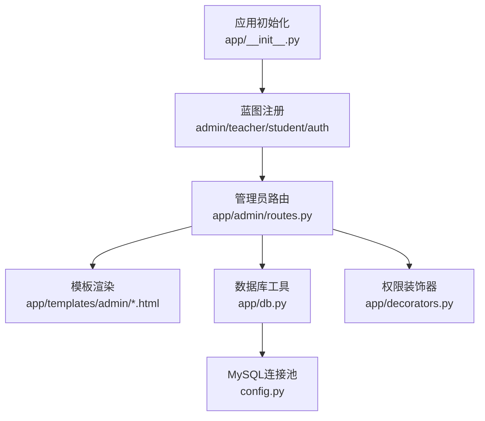

图表来源
- [app/__init__.py:57-64](file://app/__init__.py#L57-L64)
- [app/admin/routes.py:10](file://app/admin/routes.py#L10)
- [app/db.py:10-26](file://app/db.py#L10-L26)
- [config.py:11-25](file://config.py#L11-L25)
- [app/decorators.py:13-25](file://app/decorators.py#L13-L25)

章节来源
- [app/__init__.py:29-93](file://app/__init__.py#L29-L93)
- [app/admin/routes.py:1-763](file://app/admin/routes.py#L1-L763)
- [app/db.py:1-121](file://app/db.py#L1-L121)
- [config.py:1-36](file://config.py#L1-L36)
- [app/decorators.py:1-26](file://app/decorators.py#L1-L26)

## 核心组件
- 管理员蓝图与权限控制
  - 使用装饰器确保仅管理员可访问，统一在蓝图前置钩子中校验登录与角色
  - 参考路径：[app/admin/routes.py:13-17](file://app/admin/routes.py#L13-L17)，[app/decorators.py:13-25](file://app/decorators.py#L13-L25)
- 数据库连接池与查询工具
  - 初始化连接池，提供query/execute/call_proc/paginate等封装，支持分页与存储过程调用
  - 参考路径：[app/db.py:10-26](file://app/db.py#L10-L26)，[app/db.py:43-121](file://app/db.py#L43-L121)
- 配置中心
  - 数据库连接参数、分页数量、成绩权重与预警阈值等集中配置
  - 参考路径：[config.py:11-36](file://config.py#L11-L36)

章节来源
- [app/admin/routes.py:13-17](file://app/admin/routes.py#L13-L17)
- [app/db.py:10-26](file://app/db.py#L10-L26)
- [app/db.py:43-121](file://app/db.py#L43-L121)
- [config.py:11-36](file://config.py#L11-L36)

## 架构总览
管理员模块围绕"仪表盘—业务管理—统计分析—审计日志"的主线展开，前后端交互通过Flask模板渲染与CSRF保护完成，数据库层面通过视图与存储过程支撑统计与业务逻辑。

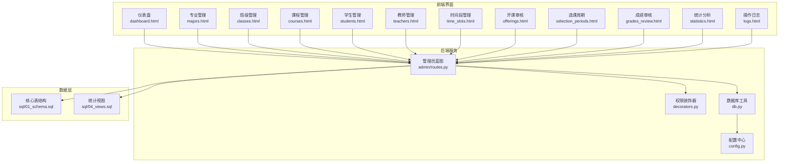

图表来源
- [app/admin/routes.py:1-763](file://app/admin/routes.py#L1-L763)
- [app/templates/admin/dashboard.html:1-30](file://app/templates/admin/dashboard.html#L1-L30)
- [app/templates/admin/students.html:1-117](file://app/templates/admin/students.html#L1-L117)
- [app/templates/admin/teachers.html:1-92](file://app/templates/admin/teachers.html#L1-L92)
- [app/templates/admin/semesters.html:1-67](file://app/templates/admin/semesters.html#L1-L67)
- [app/templates/admin/statistics.html:1-65](file://app/templates/admin/statistics.html#L1-L65)
- [app/templates/admin/offerings.html:1-63](file://app/templates/admin/offerings.html#L1-L63)
- [app/templates/admin/logs.html:1-24](file://app/templates/admin/logs.html#L1-L24)
- [app/templates/admin/time_slots.html:1-96](file://app/templates/admin/time_slots.html#L1-L96)
- [app/decorators.py:13-25](file://app/decorators.py#L13-L25)
- [app/db.py:10-26](file://app/db.py#L10-L26)
- [config.py:11-36](file://config.py#L11-L36)
- [sql/01_schema.sql:12-235](file://sql/01_schema.sql#L12-L235)
- [sql/04_views.sql:7-113](file://sql/04_views.sql#L7-L113)

## 详细组件分析

### 管理员Dashboard设计与功能实现
- 设计要点
  - 卡片式统计概览：学生/教师/课程总数、待审核开课、开课总数、选课记录、已发布成绩、学业预警数量
  - 最近操作日志：按ID倒序展示，便于快速掌握系统动态
- 关键实现
  - 统计聚合：通过原生SQL与COUNT聚合计算各项指标
  - 日志查询：关联users表获取用户名，限制最近10条
- 模板与路由
  - 路由：[app/admin/routes.py:42-57](file://app/admin/routes.py#L42-L57)
  - 模板：[app/templates/admin/dashboard.html:1-30](file://app/templates/admin/dashboard.html#L1-L30)

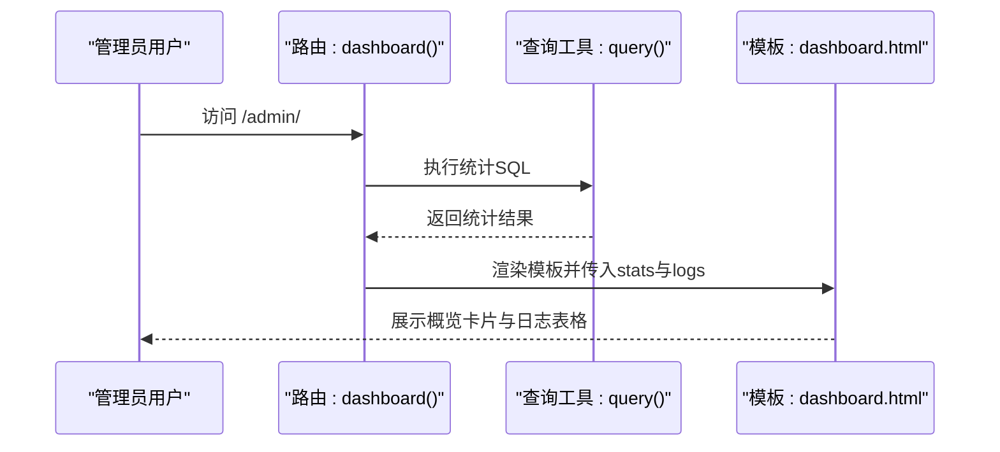

图表来源
- [app/admin/routes.py:42-57](file://app/admin/routes.py#L42-L57)
- [app/templates/admin/dashboard.html:1-30](file://app/templates/admin/dashboard.html#L1-L30)

章节来源
- [app/admin/routes.py:42-57](file://app/admin/routes.py#L42-L57)
- [app/templates/admin/dashboard.html:1-30](file://app/templates/admin/dashboard.html#L1-L30)

### 用户管理（学生与教师）
- 功能范围
  - 学生管理：分页、搜索（姓名/学号/用户名）、编辑（专业/班级/学籍/联系方式）、启用/禁用、重置密码、批量添加
  - 教师管理：分页、搜索（姓名/工号/用户名）、编辑（职称/联系方式）、启用/禁用、重置密码、批量添加
- 关键实现
  - 分页与搜索：基于paginate工具与动态WHERE条件拼接
  - 安全性：新增用户时检查用户名唯一性，密码使用哈希存储
  - 状态切换：通过users表is_active字段控制账号启用/禁用
- 模板与路由
  - 学生：[app/admin/routes.py:202-283](file://app/admin/routes.py#L202-L283)，[app/templates/admin/students.html:1-117](file://app/templates/admin/students.html#L1-L117)
  - 教师：[app/admin/routes.py:286-363](file://app/admin/routes.py#L286-L363)，[app/templates/admin/teachers.html:1-92](file://app/templates/admin/teachers.html#L1-L92)

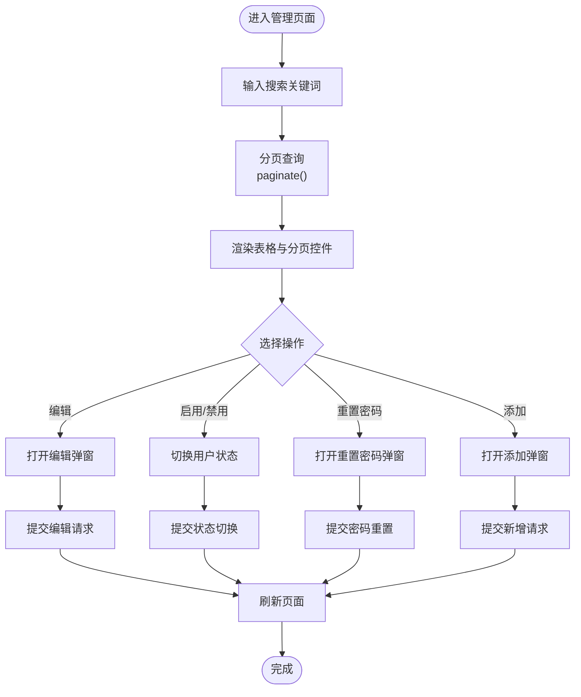

图表来源
- [app/admin/routes.py:202-283](file://app/admin/routes.py#L202-L283)
- [app/admin/routes.py:286-363](file://app/admin/routes.py#L286-L363)
- [app/templates/admin/students.html:1-117](file://app/templates/admin/students.html#L1-L117)
- [app/templates/admin/teachers.html:1-92](file://app/templates/admin/teachers.html#L1-L92)

章节来源
- [app/admin/routes.py:202-283](file://app/admin/routes.py#L202-L283)
- [app/admin/routes.py:286-363](file://app/admin/routes.py#L286-L363)
- [app/templates/admin/students.html:1-117](file://app/templates/admin/students.html#L1-L117)
- [app/templates/admin/teachers.html:1-92](file://app/templates/admin/teachers.html#L1-L92)

### 课程与班级管理
- 专业管理
  - 列表展示、新增、编辑、删除；主键约束保证唯一性
  - 路由：[app/admin/routes.py:100-127](file://app/admin/routes.py#L100-L127)
  - 模板：[app/templates/admin/majors.html](file://app/templates/admin/majors.html)
- 班级管理
  - 关联专业，支持按年级筛选；删除受外键约束保护
  - 路由：[app/admin/routes.py:129-159](file://app/admin/routes.py#L129-L159)
  - 模板：[app/templates/admin/classes.html](file://app/templates/admin/classes.html)
- 课程管理
  - 课程基础信息维护，含学分、学时、课程类型等
  - 路由：[app/admin/routes.py:161-193](file://app/admin/routes.py#L161-L193)
  - 模板：[app/templates/admin/courses.html](file://app/templates/admin/courses.html)

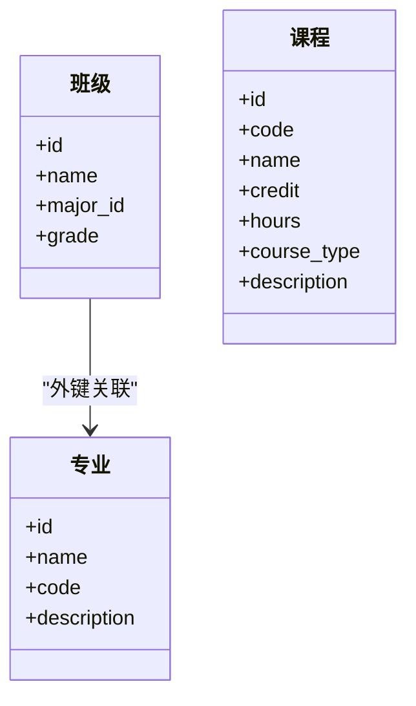

图表来源
- [sql/01_schema.sql:30-50](file://sql/01_schema.sql#L30-L50)
- [sql/01_schema.sql:42-50](file://sql/01_schema.sql#L42-L50)
- [sql/01_schema.sql:113-126](file://sql/01_schema.sql#L113-L126)

章节来源
- [app/admin/routes.py:100-127](file://app/admin/routes.py#L100-L127)
- [app/admin/routes.py:129-159](file://app/admin/routes.py#L129-L159)
- [app/admin/routes.py:161-193](file://app/admin/routes.py#L161-L193)
- [sql/01_schema.sql:30-50](file://sql/01_schema.sql#L30-L50)
- [sql/01_schema.sql:42-50](file://sql/01_schema.sql#L42-L50)
- [sql/01_schema.sql:113-126](file://sql/01_schema.sql#L113-L126)

### 时间槽管理功能
- 功能概述
  - 时间槽管理用于维护每日上课时段配置，系统默认预设周一至周五每天5个时段（第1-5节）
  - 支持编辑每个时段的开始时间、结束时间和显示标签
- 关键实现
  - 数据查询：按星期和节次排序获取所有时间槽配置
  - 编辑功能：通过模态框提供时间槽信息编辑界面
  - 日志记录：更新时间槽时记录系统日志便于审计
- 模板与路由
  - 路由：[app/admin/routes.py:747-763](file://app/admin/routes.py#L747-L763)
  - 模板：[app/templates/admin/time_slots.html:1-96](file://app/templates/admin/time_slots.html#L1-L96)

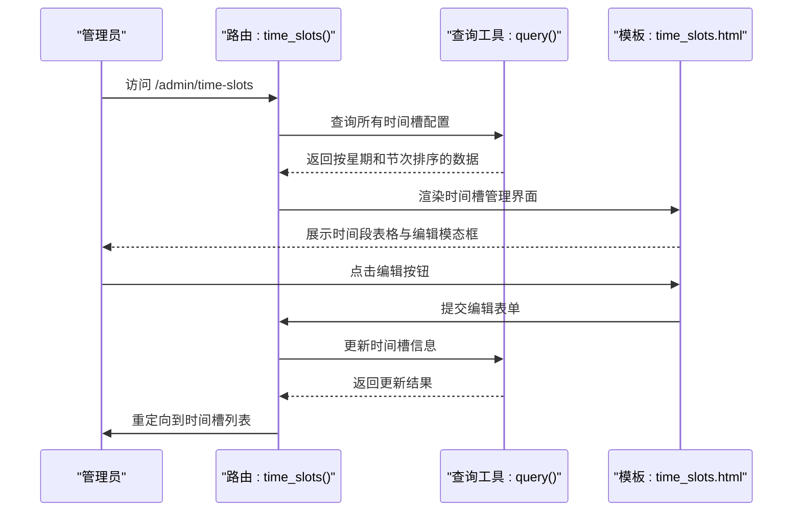

图表来源
- [app/admin/routes.py:747-763](file://app/admin/routes.py#L747-L763)
- [app/templates/admin/time_slots.html:1-96](file://app/templates/admin/time_slots.html#L1-L96)

章节来源
- [app/admin/routes.py:747-763](file://app/admin/routes.py#L747-L763)
- [app/templates/admin/time_slots.html:1-96](file://app/templates/admin/time_slots.html#L1-L96)

### 学期管理与选课周期配置
- 学期管理
  - 设置学期起止时间，支持将某学期标记为"当前学期"，自动取消其他学期的当前标记
  - 路由：[app/admin/routes.py:61-96](file://app/admin/routes.py#L61-L96)
  - 模板：[app/templates/admin/semesters.html:1-67](file://app/templates/admin/semesters.html#L1-L67)
- 选课周期配置
  - 支持为不同学期配置"选课"和"退课"周期，可启用/停用、编辑、删除
  - 路由：[app/admin/routes.py:408-451](file://app/admin/routes.py#L408-L451)
  - 模板：[app/templates/admin/selection_periods.html](file://app/templates/admin/selection_periods.html)

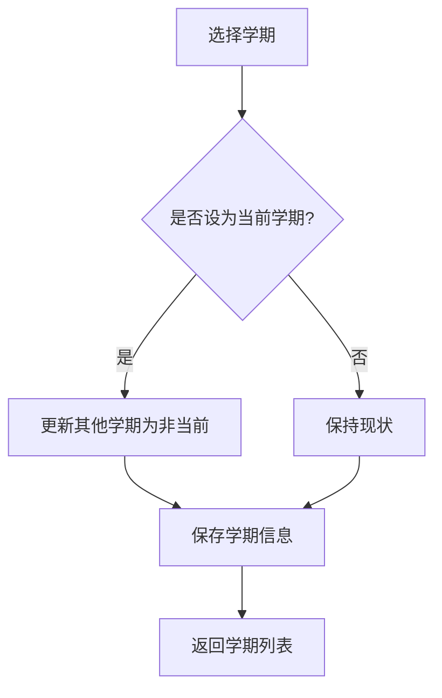

图表来源
- [app/admin/routes.py:73-86](file://app/admin/routes.py#L73-L86)
- [app/templates/admin/semesters.html:1-67](file://app/templates/admin/semesters.html#L1-L67)

章节来源
- [app/admin/routes.py:61-96](file://app/admin/routes.py#L61-L96)
- [app/admin/routes.py:408-451](file://app/admin/routes.py#L408-L451)
- [app/templates/admin/semesters.html:1-67](file://app/templates/admin/semesters.html#L1-L67)

### 开课审核与发布
- 流程
  - 待审核：教师提交开课申请，管理员进行"通过/驳回"操作，并可填写审核意见
  - 已通过：管理员将课程状态从"approved"发布为"published"
- 关键实现
  - 使用存储过程sp_approve_course_offering处理审批逻辑，支持OUT参数返回结果
  - 发布时严格限定状态为"approved"，避免误操作
- 模板与路由
  - 路由：[app/admin/routes.py:365-405](file://app/admin/routes.py#L365-L405)
  - 模板：[app/templates/admin/offerings.html:1-63](file://app/templates/admin/offerings.html#L1-L63)

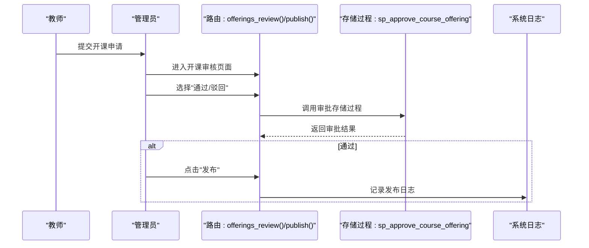

图表来源
- [app/admin/routes.py:380-398](file://app/admin/routes.py#L380-L398)
- [app/admin/routes.py:400-405](file://app/admin/routes.py#L400-L405)
- [app/templates/admin/offerings.html:1-63](file://app/templates/admin/offerings.html#L1-L63)

章节来源
- [app/admin/routes.py:365-405](file://app/admin/routes.py#L365-L405)
- [app/templates/admin/offerings.html:1-63](file://app/templates/admin/offerings.html#L1-L63)

### 成绩审核与发布
- 功能点
  - 成绩状态流转：submitted → approved → published
  - 支持单条审核通过与批量发布
  - 审核与发布均写入系统日志，便于审计
- 关键实现
  - 单条审核：先更新状态为approved，再写入日志
  - 批量发布：更新所有approved状态为published，并记录批量日志
- 模板与路由
  - 路由：[app/admin/routes.py:453-526](file://app/admin/routes.py#L453-L526)
  - 模板：[app/templates/admin/grades_review.html](file://app/templates/admin/grades_review.html)

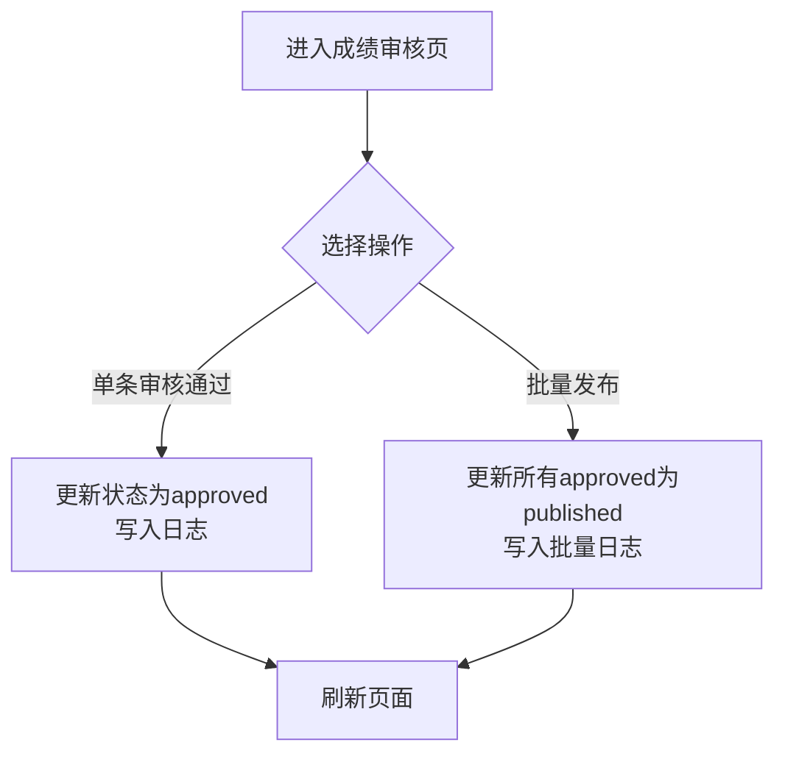

图表来源
- [app/admin/routes.py:472-526](file://app/admin/routes.py#L472-L526)

章节来源
- [app/admin/routes.py:453-526](file://app/admin/routes.py#L453-L526)
- [app/templates/admin/grades_review.html](file://app/templates/admin/grades_review.html)

### 学业预警
- 功能概述
  - 基于存储过程sp_list_academic_alerts获取预警学生列表，支持按学期、风险等级与关键词过滤
  - 提供风险等级汇总（高/中/低），便于快速掌握整体态势
- 关键实现
  - 预警阈值与权重在配置中定义，用于触发预警规则
  - 支持当前学期默认值与手动筛选
- 模板与路由
  - 路由：[app/admin/routes.py:576-615](file://app/admin/routes.py#L576-L615)

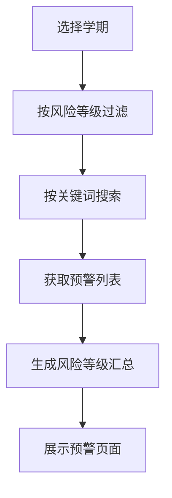

图表来源
- [app/admin/routes.py:576-615](file://app/admin/routes.py#L576-L615)

章节来源
- [app/admin/routes.py:576-615](file://app/admin/routes.py#L576-L615)

### 系统统计分析
- 统计维度
  - 选课统计：按课程维度展示上限与已选人数、满员率
  - 成绩分布：按分数段统计人数，支持柱状图可视化
  - 教师工作量：统计每位教师的开课数与选课学生总数
- 关键实现
  - 通过视图v_course_selection_stats与v_teacher_workload提供聚合数据
  - 成绩分布使用Chart.js渲染柱状图
- 模板与路由
  - 路由：[app/admin/routes.py:546-574](file://app/admin/routes.py#L546-L574)
  - 模板：[app/templates/admin/statistics.html:1-65](file://app/templates/admin/statistics.html#L1-L65)
  - 视图：[sql/04_views.sql:72-92](file://sql/04_views.sql#L72-L92)，[sql/04_views.sql:97-113](file://sql/04_views.sql#L97-L113)

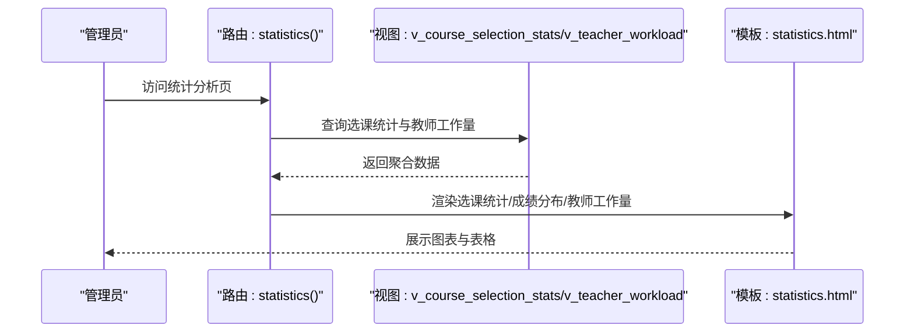

图表来源
- [app/admin/routes.py:546-574](file://app/admin/routes.py#L546-L574)
- [app/templates/admin/statistics.html:1-65](file://app/templates/admin/statistics.html#L1-L65)
- [sql/04_views.sql:72-92](file://sql/04_views.sql#L72-L92)
- [sql/04_views.sql:97-113](file://sql/04_views.sql#L97-L113)

章节来源
- [app/admin/routes.py:546-574](file://app/admin/routes.py#L546-L574)
- [app/templates/admin/statistics.html:1-65](file://app/templates/admin/statistics.html#L1-L65)
- [sql/04_views.sql:72-92](file://sql/04_views.sql#L72-L92)
- [sql/04_views.sql:97-113](file://sql/04_views.sql#L97-L113)

### 操作日志功能
- 功能概述
  - 支持按操作类型筛选，展示用户、目标类型/ID、详情与时间
  - 与各业务操作联动，记录关键动作（如成绩审核/发布）
- 关键实现
  - 日志表system_logs包含用户ID、动作类型、目标信息与IP等
  - 模糊匹配搜索操作类型，分页展示
- 模板与路由
  - 路由：[app/admin/routes.py:528-544](file://app/admin/routes.py#L528-L544)
  - 模板：[app/templates/admin/logs.html:1-24](file://app/templates/admin/logs.html#L1-L24)

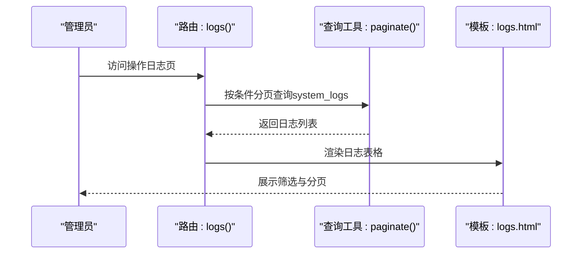

图表来源
- [app/admin/routes.py:528-544](file://app/admin/routes.py#L528-L544)
- [app/templates/admin/logs.html:1-24](file://app/templates/admin/logs.html#L1-L24)

章节来源
- [app/admin/routes.py:528-544](file://app/admin/routes.py#L528-L544)
- [app/templates/admin/logs.html:1-24](file://app/templates/admin/logs.html#L1-L24)

## 依赖关系分析
- 组件耦合
  - admin蓝图高度依赖db.py提供的查询与分页工具，以及config.py中的系统参数
  - 权限装饰器统一拦截未登录或非管理员访问
- 外部依赖
  - Flask生态：flask-login、flask-wtf、Werkzeug
  - 数据库：pymysql + dbutils连接池
- 潜在循环依赖
  - 当前结构无循环导入，蓝图注册顺序合理

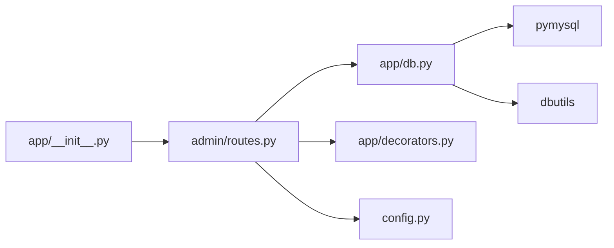

图表来源
- [app/admin/routes.py:1-10](file://app/admin/routes.py#L1-L10)
- [app/db.py:1-121](file://app/db.py#L1-L121)
- [config.py:1-36](file://config.py#L1-L36)
- [requirements.txt:1-8](file://requirements.txt#L1-L8)

章节来源
- [app/admin/routes.py:1-10](file://app/admin/routes.py#L1-L10)
- [app/db.py:1-121](file://app/db.py#L1-L121)
- [config.py:1-36](file://config.py#L1-L36)
- [requirements.txt:1-8](file://requirements.txt#L1-L8)

## 性能考虑
- 分页与索引
  - 分页工具自动统计总数并限制每页数量，默认15条，减少一次性加载压力
  - 核心表在常用查询列上建立索引（如semesters的is_current、course_offerings的状态索引），提升查询效率
- 连接池
  - 合理配置最小缓存与最大连接数，避免高并发下的连接争用
- 视图优化
  - 统计类视图预先聚合，减少复杂查询的重复计算

## 故障排除指南
- 登录与权限
  - 未登录或角色不符将被重定向至登录页或返回403，检查装饰器与会话状态
  - 参考：[app/decorators.py:13-25](file://app/decorators.py#L13-L25)
- 数据库连接
  - 若出现连接失败，检查config.py中的数据库参数与网络连通性
  - 参考：[config.py:11-25](file://config.py#L11-L25)
- 新增用户失败
  - 用户名重复导致插入失败，需更换用户名或清理冲突
  - 参考：[app/admin/routes.py:244-247](file://app/admin/routes.py#L244-L247)，[app/admin/routes.py:326-329](file://app/admin/routes.py#L326-L329)
- 审批/发布异常
  - 存储过程返回错误码与提示信息，根据p4/p5输出进行定位
  - 参考：[app/admin/routes.py:389-396](file://app/admin/routes.py#L389-L396)
- 日志为空或筛选无效
  - 确认筛选条件与分页参数传递正确，检查system_logs表是否存在数据
  - 参考：[app/admin/routes.py:532-543](file://app/admin/routes.py#L532-L543)
- 时间槽编辑失败
  - 检查时间格式是否正确（HH:MM），确认时间段不重叠，验证标签长度限制

章节来源
- [app/decorators.py:13-25](file://app/decorators.py#L13-L25)
- [config.py:11-25](file://config.py#L11-L25)
- [app/admin/routes.py:244-247](file://app/admin/routes.py#L244-L247)
- [app/admin/routes.py:326-329](file://app/admin/routes.py#L326-L329)
- [app/admin/routes.py:389-396](file://app/admin/routes.py#L389-L396)
- [app/admin/routes.py:532-543](file://app/admin/routes.py#L532-L543)

## 结论
管理员功能模块以清晰的蓝图划分与模板化界面实现了教务系统的后台管理闭环，涵盖用户、课程、学期、开课、成绩、统计与审计等核心领域。通过连接池、分页与视图优化，系统在功能完整性与性能稳定性之间取得平衡。新增的时间槽管理功能进一步完善了系统的排课基础设施，为后续的课程安排和教室调度提供了更精细的时间资源配置能力。建议后续在数据导入导出、批量操作与更细粒度的权限控制方面持续演进。

## 附录
- 界面导航与操作流程
  - 仪表盘概览：快速查看关键指标与近期日志
  - 用户管理：支持搜索、分页、状态切换与密码重置
  - 课程与班级：维护基础信息与关联关系
  - 时间槽管理：维护每日上课时段配置，支持编辑开始时间、结束时间和标签
  - 学期与选课周期：配置学期与选课窗口
  - 开课审核：审批流程与发布
  - 成绩审核：单条与批量处理
  - 学业预警：按学期与风险等级筛选
  - 统计分析：选课、成绩分布、教师工作量
  - 操作日志：审计与异常追踪
- 数据导入导出使用指南
  - 当前代码未包含专门的数据导入导出路由与模板，若需扩展可在admin蓝图中新增对应路由与模板，并复用现有数据库工具与CSRF保护机制