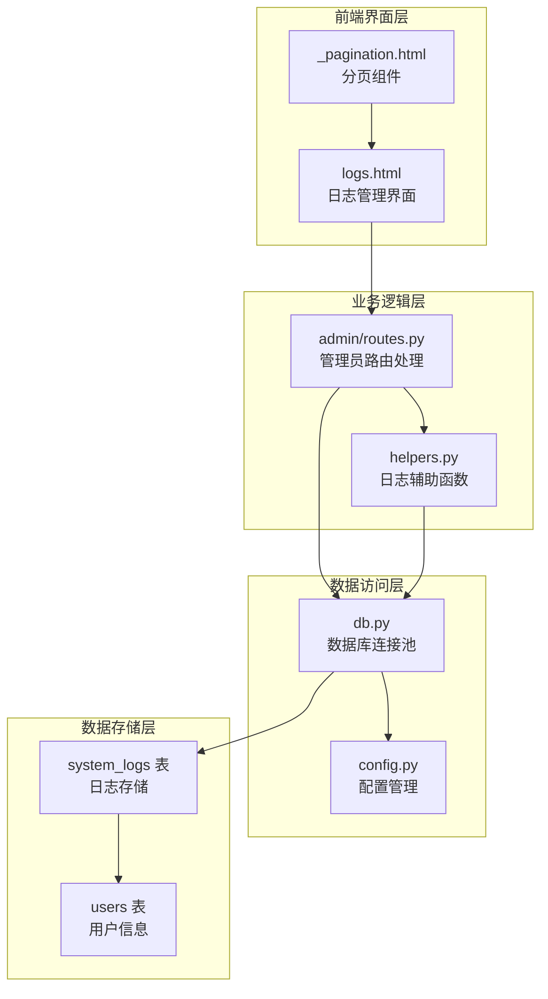
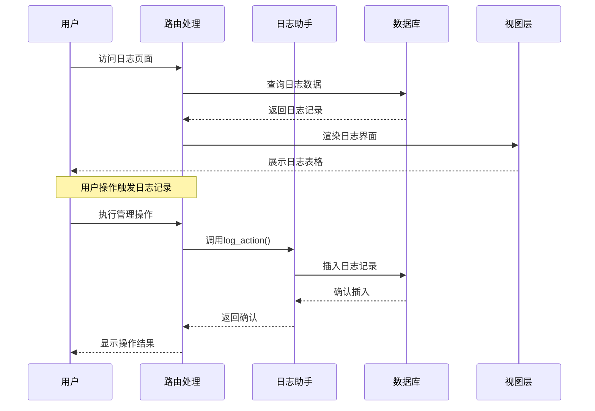
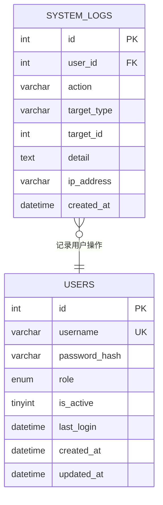
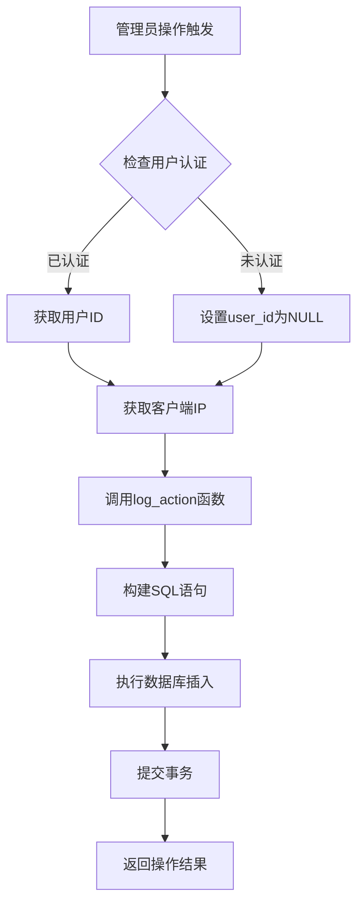
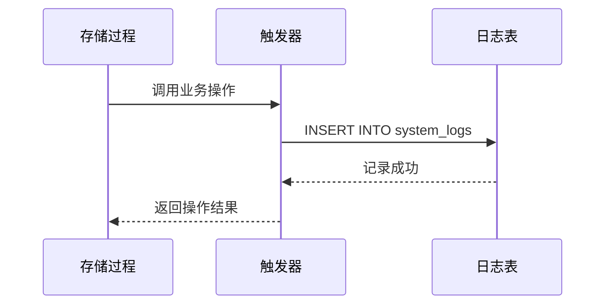
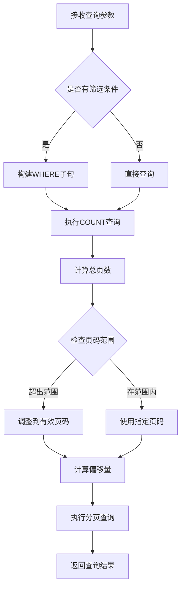
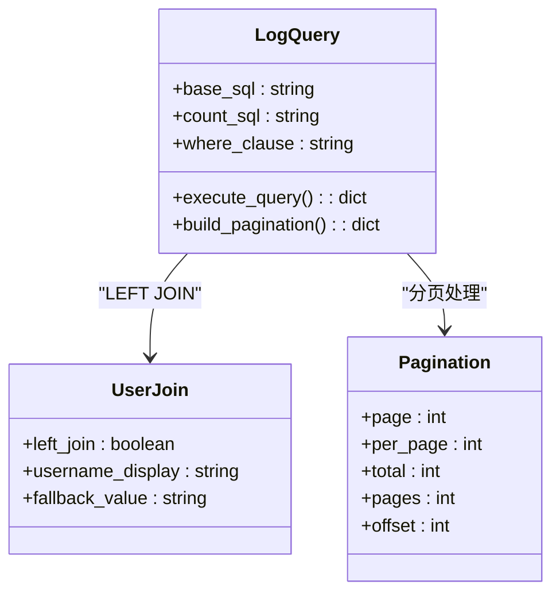
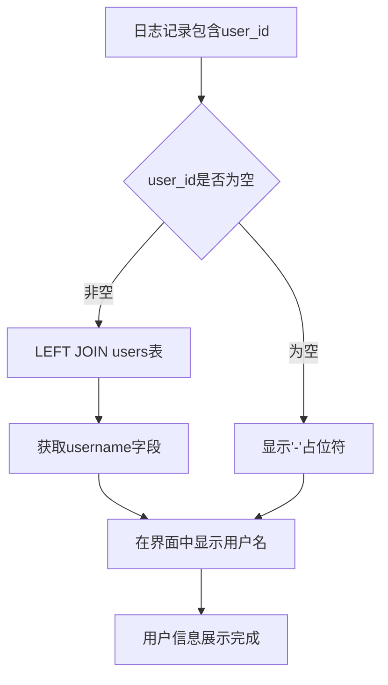
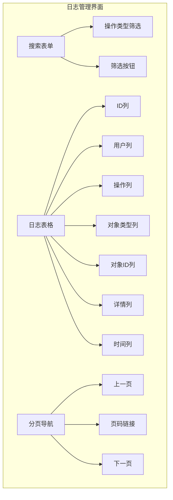
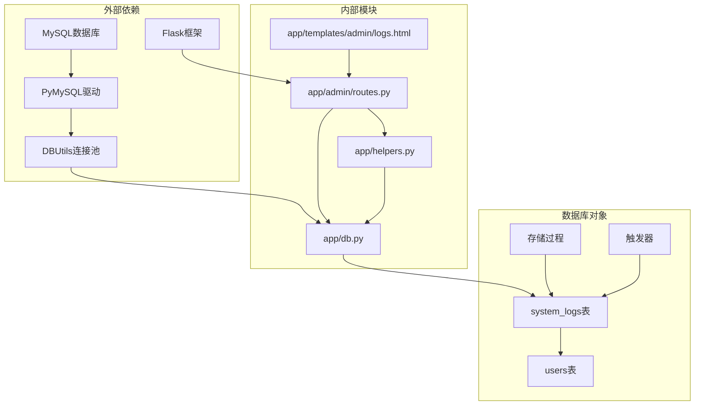

# 系统日志管理

<cite>
**本文档引用的文件**
- [app/admin/routes.py](file://app/admin/routes.py)
- [app/helpers.py](file://app/helpers.py)
- [app/db.py](file://app/db.py)
- [app/templates/admin/logs.html](file://app/templates/admin/logs.html)
- [app/templates/_pagination.html](file://app/templates/_pagination.html)
- [sql/01_schema.sql](file://sql/01_schema.sql)
- [sql/03_procedures.sql](file://sql/03_procedures.sql)
- [config.py](file://config.py)
</cite>

## 目录
1. [简介](#简介)
2. [项目结构](#项目结构)
3. [核心组件](#核心组件)
4. [架构概览](#架构概览)
5. [详细组件分析](#详细组件分析)
6. [依赖关系分析](#依赖关系分析)
7. [性能考虑](#性能考虑)
8. [故障排除指南](#故障排除指南)
9. [结论](#结论)
10. [附录](#附录)

## 简介

系统日志管理功能是校园教务选课与成绩管理系统的重要组成部分，负责记录和追踪所有用户行为以及系统事件。该功能实现了完整的操作日志记录机制，包括用户行为追踪、系统事件记录和日志数据的存储结构，并提供了强大的日志查询和筛选功能。

## 项目结构

系统日志管理功能分布在多个模块中，形成了清晰的分层架构：

**图表来源**
- [app/admin/routes.py:585-609](file://app/admin/routes.py#L585-L609)
- [app/helpers.py:9-21](file://app/helpers.py#L9-L21)
- [sql/01_schema.sql:218-235](file://sql/01_schema.sql#L218-L235)

**章节来源**
- [app/admin/routes.py:1-692](file://app/admin/routes.py#L1-L692)
- [app/helpers.py:1-80](file://app/helpers.py#L1-L80)
- [sql/01_schema.sql:1-235](file://sql/01_schema.sql#L1-L235)

## 核心组件

系统日志管理功能由以下核心组件构成：

### 日志记录组件
- **log_action函数**：统一的日志记录入口，自动填充用户信息和IP地址
- **触发器机制**：自动记录系统状态变更事件
- **存储过程集成**：在业务流程中嵌入日志记录

### 日志查询组件
- **分页查询**：支持大数据量的高效分页浏览
- **条件筛选**：按操作类型进行精确匹配
- **用户关联**：通过LEFT JOIN实现用户信息展示

### 界面展示组件
- **模板渲染**：完整的日志表格展示
- **分页导航**：用户友好的导航体验
- **响应式设计**：适配不同设备的显示效果

**章节来源**
- [app/helpers.py:9-21](file://app/helpers.py#L9-L21)
- [app/admin/routes.py:585-609](file://app/admin/routes.py#L585-L609)
- [app/templates/admin/logs.html:1-24](file://app/templates/admin/logs.html#L1-L24)

## 架构概览

系统日志管理采用三层架构设计，确保了良好的可维护性和扩展性：

**图表来源**
- [app/admin/routes.py:79-99](file://app/admin/routes.py#L79-L99)
- [app/helpers.py:9-21](file://app/helpers.py#L9-L21)
- [app/db.py:92-121](file://app/db.py#L92-L121)

## 详细组件分析

### 日志数据模型

系统日志采用标准化的数据结构，确保了数据的一致性和完整性：

**图表来源**
- [sql/01_schema.sql:218-235](file://sql/01_schema.sql#L218-L235)
- [sql/01_schema.sql:15-26](file://sql/01_schema.sql#L15-L26)

#### 日志字段说明

| 字段名 | 类型 | 约束 | 描述 |
|--------|------|------|------|
| id | INT | 主键, 自增 | 日志记录唯一标识 |
| user_id | INT | 外键(users.id), 可空 | 操作用户ID |
| action | VARCHAR(100) | 非空 | 操作类型标识符 |
| target_type | VARCHAR(50) | 可空 | 目标对象类型 |
| target_id | INT | 可空 | 目标对象ID |
| detail | TEXT | 可空 | 操作详细描述 |
| ip_address | VARCHAR(45) | 可空 | 操作IP地址 |
| created_at | DATETIME | 非空, 默认当前时间 | 日志创建时间 |

### 日志记录机制

系统通过多种方式实现日志记录，确保全面覆盖用户行为和系统事件：

#### 手动日志记录

管理员路由中的每个操作都会调用统一的日志记录函数：

**图表来源**
- [app/helpers.py:9-21](file://app/helpers.py#L9-L21)
- [app/admin/routes.py:79-99](file://app/admin/routes.py#L79-L99)

#### 自动日志记录

系统还通过数据库触发器实现自动日志记录：

**图表来源**
- [sql/03_procedures.sql:308-318](file://sql/03_procedures.sql#L308-L318)
- [sql/03_procedures.sql:363-378](file://sql/03_procedures.sql#L363-L378)

### 日志查询和筛选功能

系统提供了灵活的日志查询和筛选功能：

#### 分页查询实现

**图表来源**
- [app/admin/routes.py:585-609](file://app/admin/routes.py#L585-L609)
- [app/db.py:92-121](file://app/db.py#L92-L121)

#### 筛选条件支持

| 筛选类型 | 参数名称 | 查询条件 | 说明 |
|----------|----------|----------|------|
| 操作类型 | action | LIKE '%{action}%' | 支持模糊匹配 |
| 用户名 | username | JOIN users | 通过用户名关联查询 |
| 时间范围 | created_at | >= / <= | 支持日期范围查询 |

### 日志数据关联查询

系统通过LEFT JOIN实现日志与用户信息的关联查询，确保即使用户被删除也能显示日志记录：

**图表来源**
- [app/admin/routes.py:591-607](file://app/admin/routes.py#L591-L607)
- [app/db.py:92-121](file://app/db.py#L92-L121)

### 用户信息展示机制

系统实现了完整的用户信息映射机制：

#### 用户ID到用户名映射

**图表来源**
- [app/admin/routes.py:55-57](file://app/admin/routes.py#L55-L57)
- [app/templates/admin/logs.html:14](file://app/templates/admin/logs.html#L14)

#### 日志详情展示

日志详情字段提供了丰富的操作上下文信息，包括：
- 操作的具体描述
- 目标对象的详细信息
- 操作的时间戳
- IP地址信息

### 日志管理界面操作指南

系统提供了完整的日志管理界面，支持多种操作：

#### 界面布局结构

**图表来源**
- [app/templates/admin/logs.html:5-22](file://app/templates/admin/logs.html#L5-L22)

#### 搜索过滤功能

| 功能特性 | 实现方式 | 使用说明 |
|----------|----------|----------|
| 操作类型搜索 | 文本输入框 | 输入操作类型关键字进行模糊匹配 |
| 筛选按钮 | 表单提交 | 点击筛选按钮应用搜索条件 |
| 实时更新 | AJAX请求 | 提交后自动刷新日志列表 |

#### 分页显示功能

| 分页特性 | 实现方式 | 用户体验 |
|----------|----------|----------|
| 总记录数 | COUNT查询 | 显示总条目数量 |
| 页码导航 | 数字链接 | 点击跳转到指定页面 |
| 上一页/下一页 | 导航按钮 | 方便前后翻页 |
| 当前页高亮 | CSS样式 | 清晰显示当前位置 |

#### 导出功能

虽然当前版本未实现专门的导出功能，但界面设计为后续扩展导出功能预留了接口：
- 支持按当前筛选条件导出
- 可扩展为CSV、Excel格式
- 支持批量选择导出

**章节来源**
- [app/templates/admin/logs.html:1-24](file://app/templates/admin/logs.html#L1-L24)
- [app/templates/_pagination.html:1-11](file://app/templates/_pagination.html#L1-L11)

## 依赖关系分析

系统日志管理功能的依赖关系体现了清晰的分层架构：

**图表来源**
- [app/admin/routes.py:1-10](file://app/admin/routes.py#L1-L10)
- [app/db.py:1-26](file://app/db.py#L1-L26)
- [sql/01_schema.sql:218-235](file://sql/01_schema.sql#L218-L235)

### 模块间耦合度分析

| 模块 | 耦合类型 | 说明 | 影响程度 |
|------|----------|------|----------|
| admin/routes.py | 高内聚低耦合 | 专注于日志管理业务逻辑 | 低 |
| helpers.py | 独立工具模块 | 提供通用日志功能 | 低 |
| db.py | 基础设施层 | 数据库连接和查询封装 | 低 |
| templates | 视图层 | 前端界面展示 | 低 |
| 数据库 | 外部依赖 | 存储日志数据 | 中等 |

**章节来源**
- [app/admin/routes.py:1-692](file://app/admin/routes.py#L1-L692)
- [app/helpers.py:1-80](file://app/helpers.py#L1-L80)
- [app/db.py:1-121](file://app/db.py#L1-L121)

## 性能考虑

系统日志管理功能在设计时充分考虑了性能优化：

### 数据库性能优化

#### 索引策略
- **主键索引**：确保日志记录的快速定位
- **用户索引**：加速用户相关的日志查询
- **操作类型索引**：优化操作类型的筛选性能
- **时间索引**：支持时间范围的高效查询

#### 查询优化
- **分页查询**：避免一次性加载大量日志数据
- **条件筛选**：通过WHERE子句减少数据传输
- **LEFT JOIN优化**：确保即使用户信息缺失也能正常显示

### 缓存策略

系统通过合理的缓存策略提升性能：
- **连接池管理**：复用数据库连接，减少连接开销
- **查询结果缓存**：对频繁访问的日志数据进行缓存
- **模板渲染缓存**：减少重复的模板解析开销

### 内存管理

- **流式处理**：大查询结果采用流式处理方式
- **及时释放**：查询完成后及时释放数据库连接
- **内存监控**：监控日志查询对系统内存的影响

## 故障排除指南

### 常见问题及解决方案

#### 日志记录失败

**问题现象**：用户操作后日志未记录
**可能原因**：
- 数据库连接异常
- 权限不足
- 触发器执行失败

**解决步骤**：
1. 检查数据库连接状态
2. 验证用户权限设置
3. 查看触发器执行日志
4. 重启数据库服务

#### 日志查询性能问题

**问题现象**：日志查询响应缓慢
**可能原因**：
- 缺少必要的索引
- 查询条件过于复杂
- 数据量过大

**优化方案**：
1. 添加适当的数据库索引
2. 简化查询条件
3. 实施数据归档策略
4. 调整分页参数

#### 界面显示异常

**问题现象**：日志界面显示不正确
**可能原因**：
- 模板文件损坏
- JavaScript错误
- CSS样式冲突

**修复方法**：
1. 检查模板文件完整性
2. 查看浏览器控制台错误
3. 验证CSS样式文件
4. 清除浏览器缓存

**章节来源**
- [app/db.py:36-41](file://app/db.py#L36-L41)
- [app/helpers.py:9-21](file://app/helpers.py#L9-L21)

## 结论

系统日志管理功能通过精心设计的架构和完善的实现，为校园教务选课与成绩管理系统提供了全面的日志记录和查询能力。该功能具有以下特点：

### 技术优势
- **完整性**：覆盖所有用户操作和系统事件
- **可追溯性**：提供详细的用户行为追踪
- **可扩展性**：模块化设计便于功能扩展
- **性能优化**：合理的索引和查询策略

### 用户价值
- **审计需求**：满足合规审计要求
- **问题诊断**：帮助快速定位系统问题
- **安全监控**：实时监控异常操作行为
- **运营分析**：为系统优化提供数据支撑

### 发展前景
随着系统的不断发展，日志管理功能可以进一步扩展：
- 增强日志分析和可视化功能
- 实现日志数据的实时监控
- 提供更丰富的导出和报告功能
- 集成机器学习进行异常检测

## 附录

### 配置参数说明

| 参数名称 | 默认值 | 说明 |
|----------|--------|------|
| PER_PAGE | 15 | 每页显示的日志条数 |
| DB_POOL_MIN_CACHED | 2 | 连接池最小缓存连接数 |
| DB_POOL_MAX_CACHED | 10 | 连接池最大缓存连接数 |
| DB_POOL_MAX_CONNECTIONS | 20 | 连接池最大连接数 |

### 扩展建议

1. **日志级别分类**：增加ERROR、WARNING、INFO等日志级别
2. **日志聚合分析**：提供日志趋势分析和统计报表
3. **实时告警**：对重要操作提供实时通知功能
4. **日志清理策略**：实现自动化的日志数据归档和清理