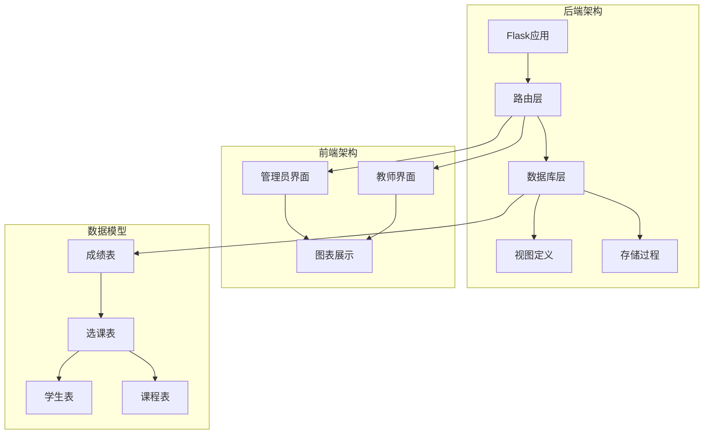
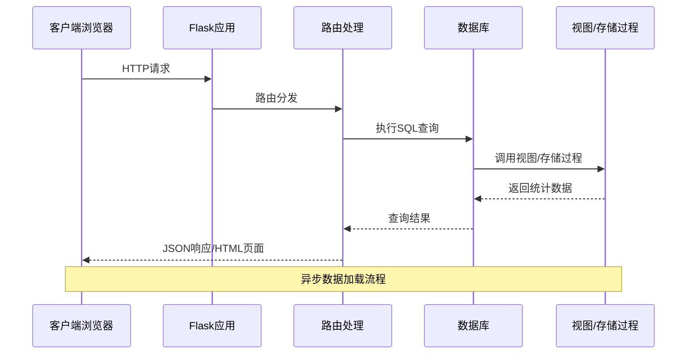
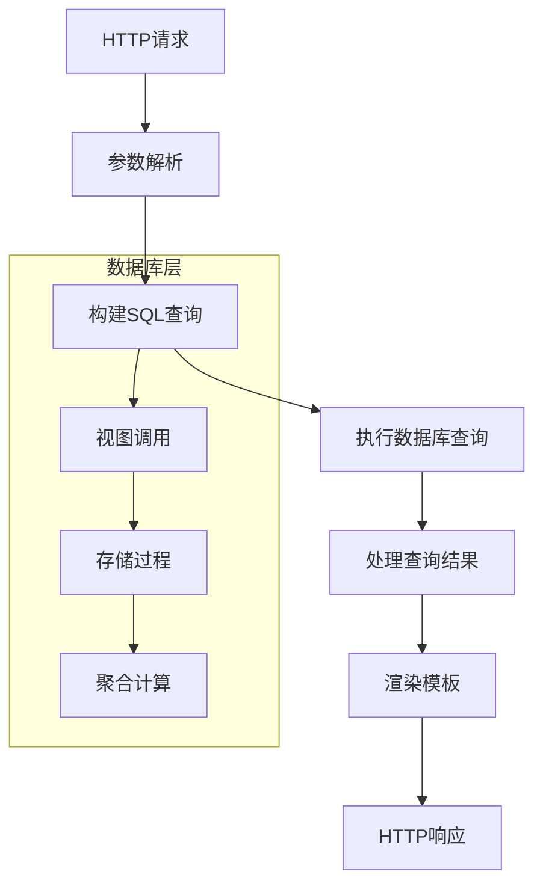
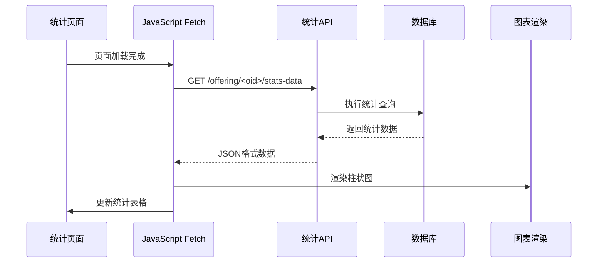
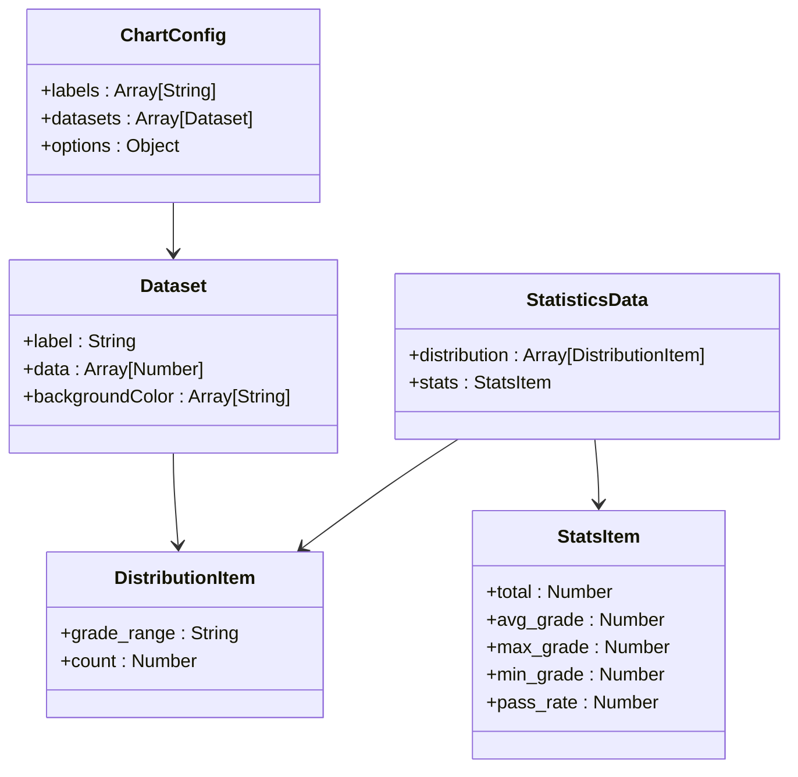
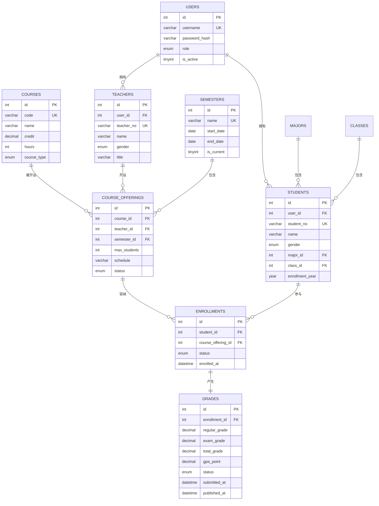
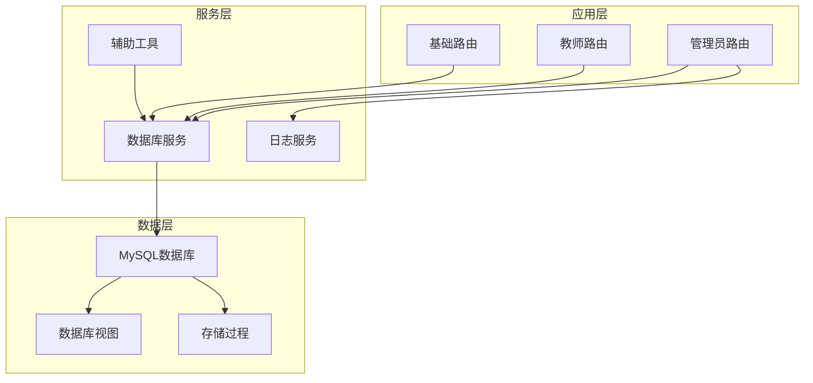
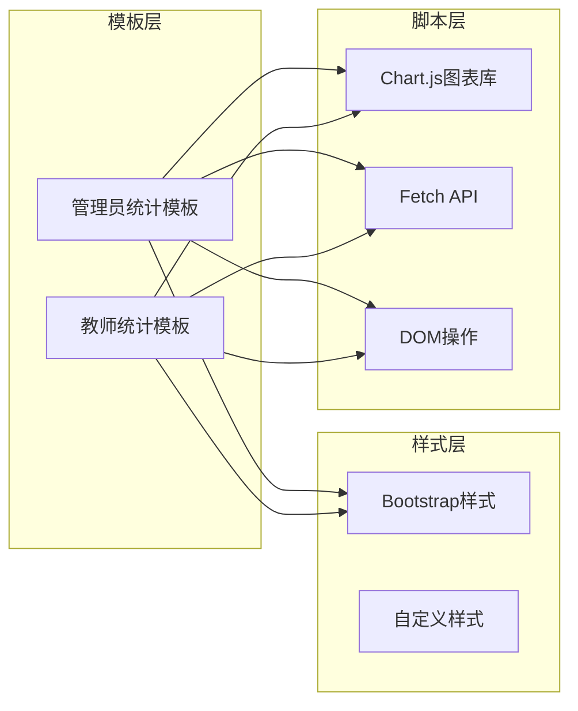

# 成绩分布统计

<cite>
**本文档引用的文件**
- [routes.py](file://app/admin/routes.py)
- [routes.py](file://app/teacher/routes.py)
- [grade_stats.html](file://app/templates/teacher/grade_stats.html)
- [statistics.html](file://app/templates/admin/statistics.html)
- [04_views.sql](file://sql/04_views.sql)
- [03_procedures.sql](file://sql/03_procedures.sql)
- [db.py](file://app/db.py)
- [helpers.py](file://app/helpers.py)
- [01_schema.sql](file://sql/01_schema.sql)
</cite>

## 目录
1. [简介](#简介)
2. [项目结构](#项目结构)
3. [核心组件](#核心组件)
4. [架构概览](#架构概览)
5. [详细组件分析](#详细组件分析)
6. [依赖分析](#依赖分析)
7. [性能考虑](#性能考虑)
8. [故障排除指南](#故障排除指南)
9. [结论](#结论)

## 简介

本功能实现了基于MySQL数据库的学生成绩分布统计系统，涵盖管理员端和教师端两个层面的统计分析需求。系统采用Flask Web框架构建，通过存储过程和视图实现高效的数据处理，结合前端图表库提供直观的可视化展示。

## 项目结构



**图表来源**
- [routes.py:1-692](file://app/admin/routes.py#L1-L692)
- [routes.py:1-333](file://app/teacher/routes.py#L1-L333)
- [01_schema.sql:176-198](file://sql/01_schema.sql#L176-L198)

## 核心组件

### 数据库设计

系统采用关系型数据库设计，核心表包括：

- **users**: 用户账户表，支持学生、教师、管理员三种角色
- **grades**: 成绩表，包含平时成绩、期末成绩、总评成绩和GPA绩点
- **enrollments**: 选课记录表，维护学生与课程的关联关系
- **course_offerings**: 开课申请表，记录课程开设信息

### 成绩等级划分机制

系统实现了五级成绩等级划分，基于CASE WHEN条件判断逻辑：

```mermaid
flowchart TD
Start([开始统计]) --> CheckGrade{检查成绩是否存在}
CheckGrade --> |是| CheckRange{判断成绩范围}
CheckGrade --> |否| Skip[跳过统计]
CheckRange --> Grade90{"成绩 ≥ 90?"}
Grade90 --> |是| LevelA[优秀: 90-100分]
Grade90 --> |否| Grade80{"成绩 ≥ 80?"}
Grade80 --> |是| LevelB[良好: 80-89分]
Grade80 --> |否| Grade70{"成绩 ≥ 70?"}
Grade70 --> |是| LevelC[中等: 70-79分]
Grade70 --> |否| Grade60{"成绩 ≥ 60?"}
Grade60 --> |是| LevelD[及格: 60-69分]
Grade60 --> |否| LevelF[不及格: <60分]
LevelA --> GroupBy[分组统计]
LevelB --> GroupBy
LevelC --> GroupBy
LevelD --> GroupBy
LevelF --> GroupBy
GroupBy --> Count[COUNT(*)计数]
Count --> End([结束])
Skip --> End
```

**图表来源**
- [routes.py:302-318](file://app/teacher/routes.py#L302-L318)
- [routes.py:620-627](file://app/admin/routes.py#L620-L627)

### SQL实现细节

#### 管理员端统计查询

管理员端使用了更详细的CASE WHEN逻辑，包含中文等级标签：

```sql
SELECT CASE
    WHEN g.total_grade>=90 THEN '90-100(优秀)'
    WHEN g.total_grade>=80 THEN '80-89(良好)'
    WHEN g.total_grade>=70 THEN '70-79(中等)'
    WHEN g.total_grade>=60 THEN '60-69(及格)'
    ELSE '60以下(不及格)' END AS grade_range, 
    COUNT(*) AS count
    FROM grades g WHERE g.total_grade IS NOT NULL
    GROUP BY grade_range ORDER BY grade_range DESC
```

#### 教师端统计查询

教师端针对特定课程提供统计，使用简化的等级标签：

```sql
SELECT
    CASE
      WHEN g.total_grade >= 90 THEN '90-100'
      WHEN g.total_grade >= 80 THEN '80-89'
      WHEN g.total_grade >= 70 THEN '70-79'
      WHEN g.total_grade >= 60 THEN '60-69'
      ELSE '<60'
    END AS grade_range,
    COUNT(*) AS count
  FROM grades g
  JOIN enrollments e ON g.enrollment_id = e.id
  WHERE e.course_offering_id = %s AND g.total_grade IS NOT NULL
  GROUP BY grade_range
  ORDER BY grade_range DESC
```

**章节来源**
- [routes.py:620-627](file://app/admin/routes.py#L620-L627)
- [routes.py:302-318](file://app/teacher/routes.py#L302-L318)

## 架构概览



**图表来源**
- [routes.py:299-332](file://app/teacher/routes.py#L299-L332)
- [db.py:43-80](file://app/db.py#L43-L80)

## 详细组件分析

### 管理员统计功能

管理员端提供了全局性的成绩分布统计，通过单一查询实现完整的统计分析。

#### 核心统计查询

管理员端的统计查询包含了五种统计维度：

1. **成绩分布统计**: 使用CASE WHEN进行等级划分
2. **选课统计**: 基于视图的选课人数统计  
3. **教师工作量**: 统计教师的教学负担
4. **学业预警**: 基于复杂业务规则的预警分析

#### 数据处理流程



**图表来源**
- [routes.py:611-638](file://app/admin/routes.py#L611-L638)
- [db.py:43-80](file://app/db.py#L43-L80)

**章节来源**
- [routes.py:611-638](file://app/admin/routes.py#L611-L638)

### 教师统计功能

教师端提供了按课程维度的成绩分布统计，支持按学期筛选。

#### 实时数据获取

教师端采用异步数据加载模式，通过AJAX请求获取实时统计数据：



**图表来源**
- [routes.py:299-332](file://app/teacher/routes.py#L299-L332)
- [grade_stats.html:28-47](file://app/templates/teacher/grade_stats.html#L28-L47)

#### 前端渲染实现

教师端使用Chart.js库实现交互式图表展示：



**图表来源**
- [grade_stats.html:30-45](file://app/templates/teacher/grade_stats.html#L30-L45)

**章节来源**
- [routes.py:299-332](file://app/teacher/routes.py#L299-L332)
- [grade_stats.html:1-50](file://app/templates/teacher/grade_stats.html#L1-L50)

### 数据模型设计



**图表来源**
- [01_schema.sql:15-198](file://sql/01_schema.sql#L15-L198)

**章节来源**
- [01_schema.sql:176-198](file://sql/01_schema.sql#L176-L198)

## 依赖分析

### 后端依赖关系



**图表来源**
- [routes.py:1-692](file://app/admin/routes.py#L1-L692)
- [routes.py:1-333](file://app/teacher/routes.py#L1-L333)
- [db.py:1-121](file://app/db.py#L1-L121)

### 前端依赖关系



**图表来源**
- [statistics.html:52-64](file://app/templates/admin/statistics.html#L52-L64)
- [grade_stats.html:25-49](file://app/templates/teacher/grade_stats.html#L25-L49)

**章节来源**
- [db.py:1-121](file://app/db.py#L1-L121)
- [helpers.py:1-80](file://app/helpers.py#L1-L80)

## 性能考虑

### 数据库优化策略

1. **索引优化**: 在关键查询字段上建立适当索引
2. **查询优化**: 使用视图和存储过程减少重复计算
3. **连接优化**: 通过合理的JOIN顺序提高查询效率
4. **缓存策略**: 利用数据库连接池减少连接开销

### 前端性能优化

1. **异步加载**: 采用AJAX异步加载统计数据
2. **图表优化**: 使用Canvas API进行高效的图形渲染
3. **数据压缩**: 减少不必要的数据传输
4. **懒加载**: 按需加载图表和统计数据

## 故障排除指南

### 常见问题及解决方案

#### 数据为空问题

**问题描述**: 统计结果显示为空数据
**可能原因**:
- 课程尚未发布或审核
- 学生成绩尚未录入
- 查询条件过滤过多

**解决方案**:
1. 检查课程状态是否为'published'
2. 验证是否有学生成绩记录
3. 调整查询参数和过滤条件

#### 性能问题

**问题描述**: 统计查询响应缓慢
**可能原因**:
- 数据量过大
- 缺少必要的索引
- 查询语句效率低下

**解决方案**:
1. 为常用查询字段添加索引
2. 优化复杂的CASE WHEN语句
3. 考虑分页处理大量数据

#### 图表显示异常

**问题描述**: 图表无法正常显示或数据不正确
**可能原因**:
- AJAX请求失败
- 数据格式不匹配
- JavaScript错误

**解决方案**:
1. 检查网络请求状态码
2. 验证JSON数据格式
3. 查看浏览器控制台错误信息

**章节来源**
- [routes.py:611-638](file://app/admin/routes.py#L611-L638)
- [routes.py:299-332](file://app/teacher/routes.py#L299-L332)

## 结论

本成绩分布统计功能通过精心设计的数据库架构和高效的查询逻辑，实现了管理员和教师两个层面的统计分析需求。系统采用模块化设计，具有良好的扩展性和维护性。通过CASE WHEN条件判断实现精确的成绩等级划分，结合前端图表库提供直观的数据可视化展示，为教学管理和决策支持提供了有力的技术支撑。