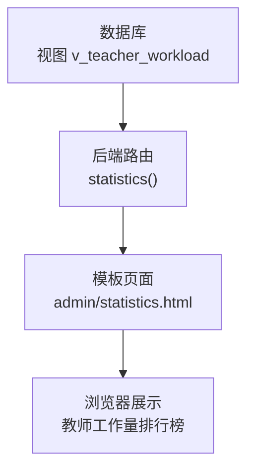
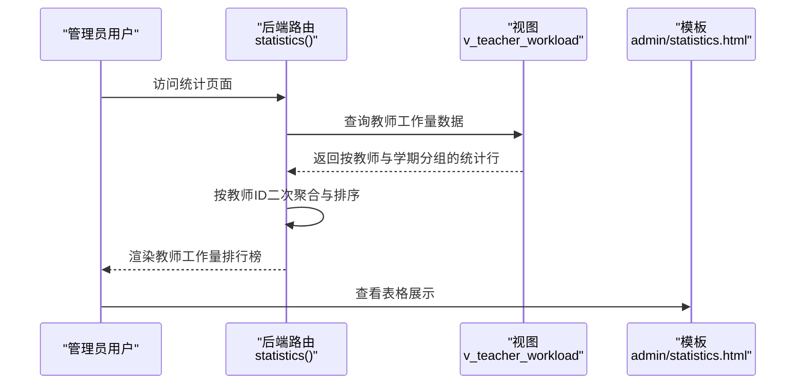
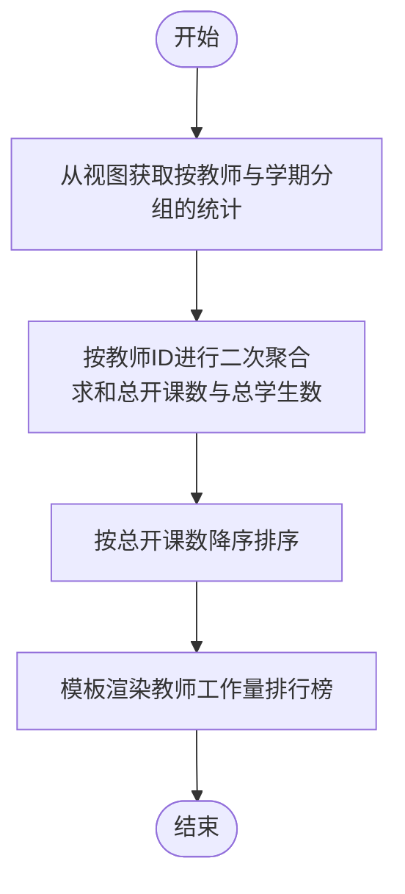
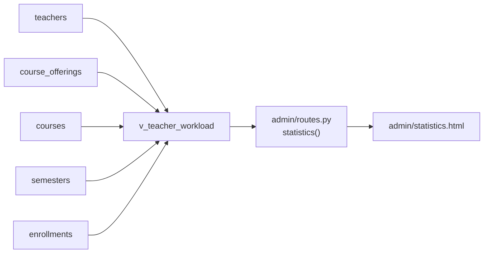

# 教师工作量统计

<cite>
**本文引用的文件**
- [sql/04_views.sql](file://sql/04_views.sql)
- [app/admin/routes.py](file://app/admin/routes.py)
- [app/templates/admin/statistics.html](file://app/templates/admin/statistics.html)
</cite>

## 目录
1. [引言](#引言)
2. [项目结构](#项目结构)
3. [核心组件](#核心组件)
4. [架构概览](#架构概览)
5. [详细组件分析](#详细组件分析)
6. [依赖关系分析](#依赖关系分析)
7. [性能考虑](#性能考虑)
8. [故障排除指南](#故障排除指南)
9. [结论](#结论)
10. [附录](#附录)

## 引言
本文件面向教师工作量统计功能，系统性解析 v_teacher_workload 视图的统计逻辑与前端展示流程。重点覆盖：
- 视图统计字段：total_offerings（总开课数）与 total_students（总学生数）的计算方法
- 教师工作量评估指标：开课数量权重、学生人数权重与综合评分算法
- 数据聚合与分组排序：按教师ID分组与按工作量降序排列
- 教师工作量排行榜生成流程：数据获取、计算公式与展示效果
- 完整 SQL 查询分析与前端表格渲染示例

## 项目结构
该功能涉及三层协作：
- 数据层：通过 SQL 视图 v_teacher_workload 聚合教师工作量基础指标
- 业务层：管理员路由接口汇总并排序教师工作量
- 表现层：模板页面渲染教师工作量排行榜

图表来源
- [sql/04_views.sql:96-112](file://sql/04_views.sql#L96-L112)
- [app/admin/routes.py:613-638](file://app/admin/routes.py#L613-L638)
- [app/templates/admin/statistics.html:37-46](file://app/templates/admin/statistics.html#L37-L46)

章节来源
- [sql/04_views.sql:96-112](file://sql/04_views.sql#L96-L112)
- [app/admin/routes.py:613-638](file://app/admin/routes.py#L613-L638)
- [app/templates/admin/statistics.html:37-46](file://app/templates/admin/statistics.html#L37-L46)

## 核心组件
- 视图 v_teacher_workload：提供按教师与学期分组的总开课数、总学生数与总学分
- 管理员统计路由：对视图结果进行二次聚合与排序，生成教师工作量排行榜
- 统计页面模板：渲染排行榜表格，展示教师姓名、职称、开课数与学生总数

章节来源
- [sql/04_views.sql:96-112](file://sql/04_views.sql#L96-L112)
- [app/admin/routes.py:613-638](file://app/admin/routes.py#L613-L638)
- [app/templates/admin/statistics.html:37-46](file://app/templates/admin/statistics.html#L37-L46)

## 架构概览
教师工作量统计从数据库视图出发，经由后端聚合处理，最终在前端以表格形式呈现。

图表来源
- [app/admin/routes.py:613-638](file://app/admin/routes.py#L613-L638)
- [sql/04_views.sql:96-112](file://sql/04_views.sql#L96-L112)
- [app/templates/admin/statistics.html:37-46](file://app/templates/admin/statistics.html#L37-L46)

## 详细组件分析

### 视图 v_teacher_workload 的统计逻辑
- 统计字段
  - total_offerings：按教师与学期分组，统计不同开课记录的数量
  - total_students：按教师与学期分组，统计已选课学生的总人数
  - total_credits：按教师与学期分组，统计课程学分总和（用于扩展评估）
- 关键实现要点
  - 使用左连接确保即使某教师无开课或选课，也能保留其记录
  - 使用分组聚合函数对开课数与学生数进行统计
  - 使用 COALESCE 处理空值，避免统计结果出现 NULL

章节来源
- [sql/04_views.sql:96-112](file://sql/04_views.sql#L96-L112)

### 后端聚合与排序
- 聚合策略
  - 在路由层按教师ID进行二次聚合，将同一教师在多个学期的数据合并为一行
  - 对 total_offerings 与 total_students 进行求和，得到教师的总开课数与总学生数
- 排序策略
  - 按总开课数降序排列，形成直观的工作量排行榜

章节来源
- [app/admin/routes.py:629-634](file://app/admin/routes.py#L629-L634)

### 前端表格渲染
- 表头字段
  - 教师：显示教师姓名
  - 职称：显示教师职称
  - 开课数：显示教师总开课数
  - 学生总数：显示教师总学生数
- 展示效果
  - 使用 Bootstrap 表格样式，清晰展示教师工作量排行

章节来源
- [app/templates/admin/statistics.html:37-46](file://app/templates/admin/statistics.html#L37-L46)

### 教师工作量评估指标与算法
- 指标定义
  - 开课数量权重：用于衡量教师承担的教学任务数量
  - 学生人数权重：用于衡量教师所带班级规模
  - 综合工作量评分：可采用加权求和模型，例如
    - 综合评分 = α × 总开课数 + β × 总学生数
    - 其中 α、β 为权重系数，需根据实际管理需求设定
- 实施建议
  - 将综合评分作为排序依据，替换现有仅按开课数排序的逻辑
  - 在模板中新增“综合评分”列，提升评估维度

章节来源
- [app/admin/routes.py:629-634](file://app/admin/routes.py#L629-L634)

### 数据聚合与分组排序机制
- 分组维度
  - 按教师ID与教师姓名、职称进行分组，保证每名教师一条记录
- 聚合函数
  - SUM：对总开课数与总学生数进行求和
- 排序规则
  - 按总开课数降序排列，便于快速识别高工作量教师

章节来源
- [app/admin/routes.py:629-634](file://app/admin/routes.py#L629-L634)

### 教师工作量排行榜生成流程
- 数据获取
  - 通过视图 v_teacher_workload 获取按教师与学期分组的基础统计
- 数据处理
  - 在后端按教师ID进行二次聚合，汇总总开课数与总学生数
- 结果排序
  - 按总开课数降序排列，生成排行榜
- 展示效果
  - 模板页面渲染表格，直观呈现教师工作量排行

图表来源
- [app/admin/routes.py:629-634](file://app/admin/routes.py#L629-L634)
- [app/templates/admin/statistics.html:37-46](file://app/templates/admin/statistics.html#L37-L46)

## 依赖关系分析
- 视图依赖
  - v_teacher_workload 依赖 teachers、course_offerings、courses、semesters、enrollments 等表
- 路由依赖
  - statistics() 路由依赖数据库查询工具与模板渲染引擎
- 模板依赖
  - admin/statistics.html 依赖 teacher_workload 上下文变量与前端样式库

图表来源
- [sql/04_views.sql:96-112](file://sql/04_views.sql#L96-L112)
- [app/admin/routes.py:613-638](file://app/admin/routes.py#L613-L638)
- [app/templates/admin/statistics.html:37-46](file://app/templates/admin/statistics.html#L37-L46)

章节来源
- [sql/04_views.sql:96-112](file://sql/04_views.sql#L96-L112)
- [app/admin/routes.py:613-638](file://app/admin/routes.py#L613-L638)
- [app/templates/admin/statistics.html:37-46](file://app/templates/admin/statistics.html#L37-L46)

## 性能考虑
- 视图优化
  - 在 course_offerings、enrollments 等大表上建立索引，加速连接与分组操作
- 聚合优化
  - 后端二次聚合时尽量减少不必要的字段选择，仅保留必要列
- 缓存策略
  - 对排行榜结果进行短期缓存，降低重复查询压力
- 分页与限制
  - 若数据量较大，可在模板侧增加分页或限制展示条数，提升交互体验

## 故障排除指南
- 视图未返回预期数据
  - 检查 teachers 与 course_offerings 的关联条件是否正确
  - 确认 enrollments 与 course_offerings 的连接是否完整
- 排行榜为空或不准确
  - 核对后端聚合逻辑是否按教师ID进行分组
  - 验证排序字段是否为总开课数
- 页面渲染异常
  - 确认模板中 teacher_workload 变量是否传入
  - 检查表格列名与数据字段是否一致

章节来源
- [app/admin/routes.py:629-634](file://app/admin/routes.py#L629-L634)
- [app/templates/admin/statistics.html:37-46](file://app/templates/admin/statistics.html#L37-L46)

## 结论
v_teacher_workload 视图为教师工作量统计提供了可靠的数据基础；后端通过二次聚合与排序生成直观的排行榜；前端模板则以表格形式清晰展示结果。若需进一步完善评估体系，可引入综合评分算法，并在模板中扩展展示维度。

## 附录
- SQL 查询分析要点
  - 视图层面：COUNT(DISTINCT co.id) 与 SUM(CASE WHEN e.status='enrolled' THEN 1 ELSE 0 END) 的组合确保开课数与学生数统计的准确性
  - 路由层面：GROUP BY teacher_id, teacher_name, title 与 ORDER BY offering_count DESC 的组合实现稳定的排行榜
- 前端表格渲染示例
  - 表头包含“教师”“职称”“开课数”“学生总数”，通过循环遍历 teacher_workload 渲染行内容

章节来源
- [sql/04_views.sql:96-112](file://sql/04_views.sql#L96-L112)
- [app/admin/routes.py:629-634](file://app/admin/routes.py#L629-L634)
- [app/templates/admin/statistics.html:37-46](file://app/templates/admin/statistics.html#L37-L46)