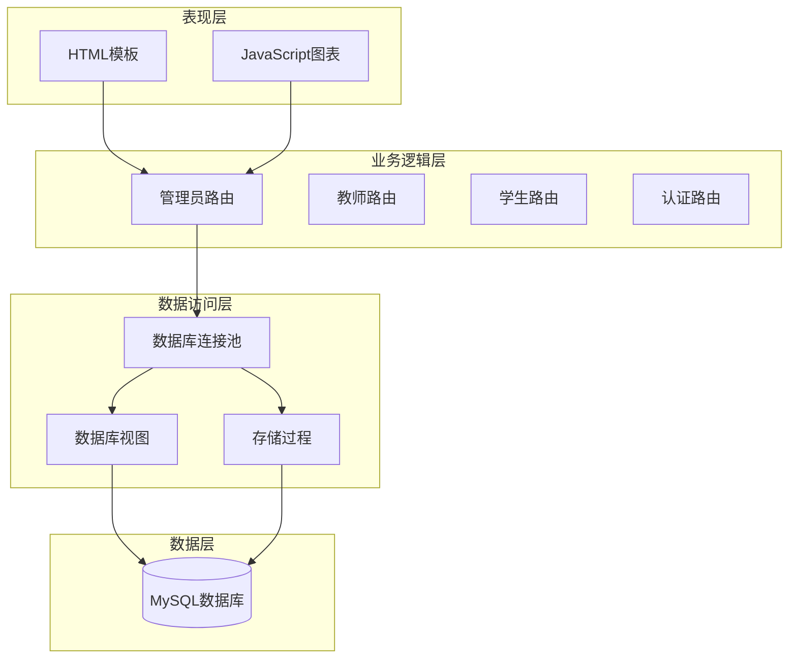
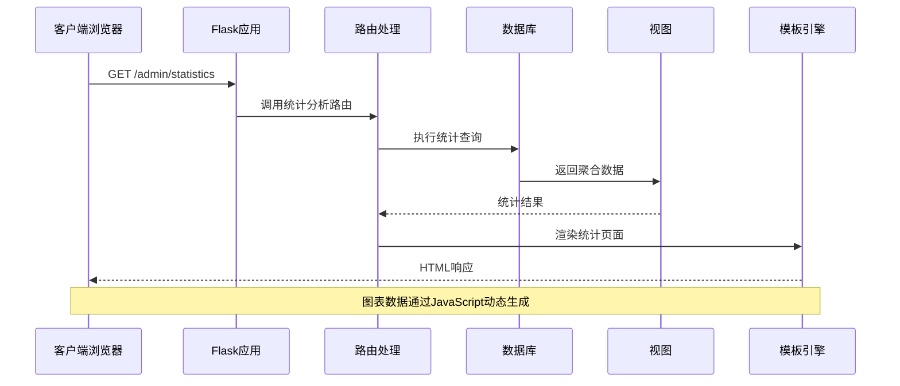
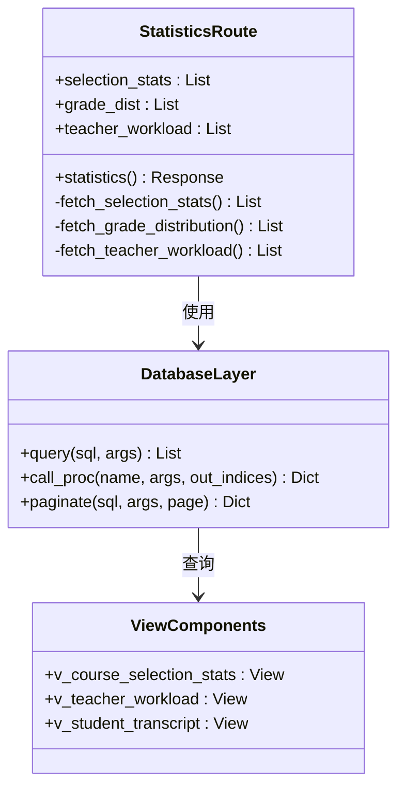
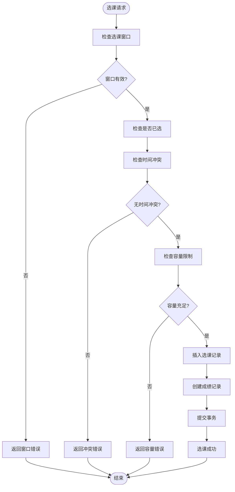
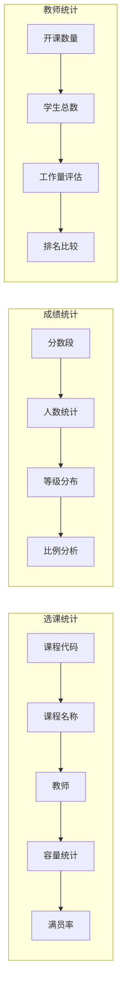
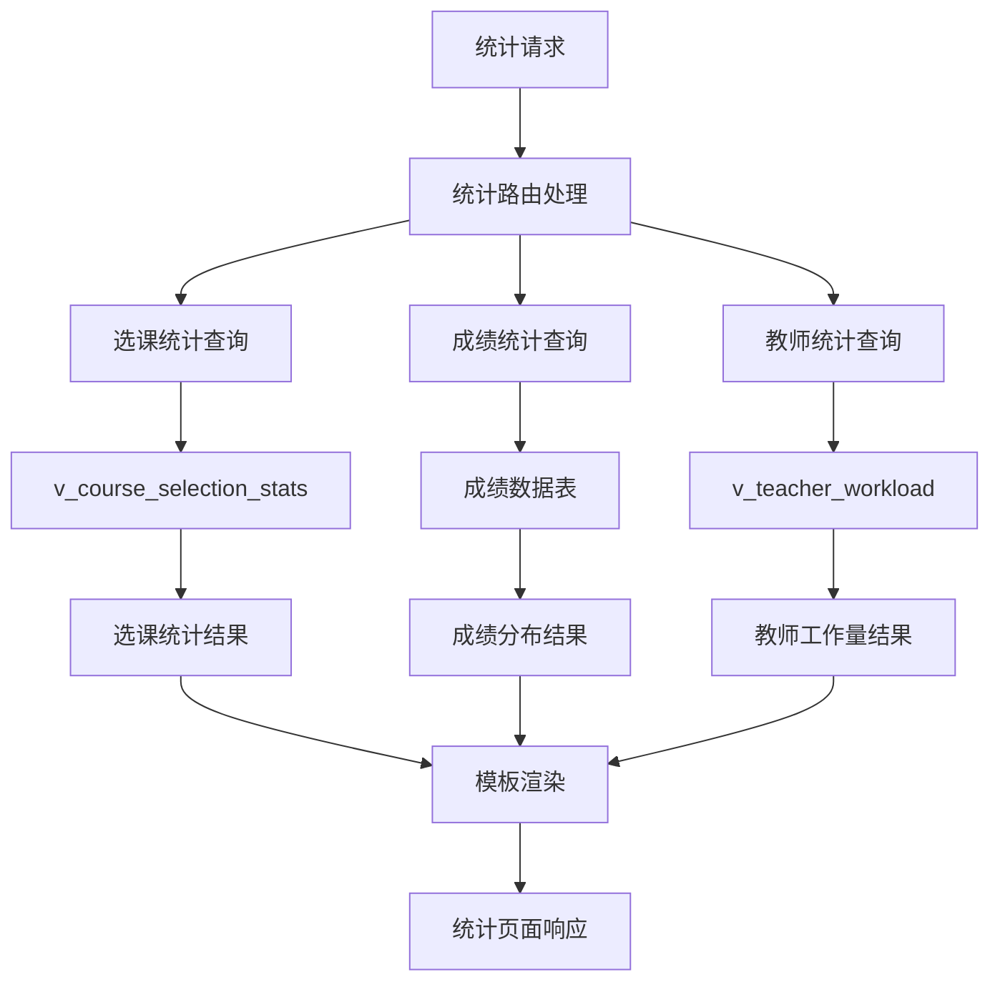

# 系统统计分析

<cite>
**本文档引用的文件**
- [app/admin/routes.py](file://app/admin/routes.py)
- [app/templates/admin/statistics.html](file://app/templates/admin/statistics.html)
- [sql/03_procedures.sql](file://sql/03_procedures.sql)
- [sql/04_views.sql](file://sql/04_views.sql)
- [app/db.py](file://app/db.py)
- [sql/01_schema.sql](file://sql/01_schema.sql)
- [config.py](file://config.py)
- [app/helpers.py](file://app/helpers.py)
- [app/__init__.py](file://app/__init__.py)
- [app.py](file://app.py)
</cite>

## 目录
1. [简介](#简介)
2. [项目结构](#项目结构)
3. [核心组件](#核心组件)
4. [架构概览](#架构概览)
5. [详细组件分析](#详细组件分析)
6. [统计分析功能详解](#统计分析功能详解)
7. [数据流分析](#数据流分析)
8. [性能考虑](#性能考虑)
9. [故障排除指南](#故障排除指南)
10. [结论](#结论)

## 简介

本系统是一个基于Flask框架开发的校园教务管理系统，专注于选课统计分析、成绩分布统计和教师工作量统计功能。系统采用MySQL作为数据存储，通过视图和存储过程实现复杂的数据统计分析，为管理员提供全面的教学数据分析支持。

系统的核心目标是：
- 提供实时的课程选课统计分析
- 展示成绩分布和等级统计
- 评估教师工作量和教学负担
- 生成可视化的统计报表

## 项目结构

系统采用典型的三层架构设计，主要分为以下几个层次：



**图表来源**
- [app/admin/routes.py:1-692](file://app/admin/routes.py#L1-L692)
- [app/db.py:1-121](file://app/db.py#L1-L121)
- [sql/04_views.sql:1-113](file://sql/04_views.sql#L1-L113)

**章节来源**
- [app/admin/routes.py:1-692](file://app/admin/routes.py#L1-L692)
- [app/__init__.py:1-93](file://app/__init__.py#L1-L93)

## 核心组件

系统的核心组件包括：

### 数据库视图层
- **v_course_selection_stats**: 选课统计视图，提供课程选课人数、容量使用率等统计信息
- **v_teacher_workload**: 教师工作量统计视图，汇总教师开课数量和学生人数
- **v_student_schedule**: 学生课表视图，用于课程安排和时间冲突检测
- **v_student_transcript**: 学生成绩单视图，提供完整的成绩记录

### 存储过程层
- **sp_enroll_course**: 选课处理存储过程，包含选课窗口检查、时间冲突检测、容量检查
- **sp_drop_course**: 退课处理存储过程，支持退课窗口检查和成绩状态验证
- **sp_calculate_total_grade**: 总评成绩计算存储过程，实现平时成绩30%+期末成绩70%的计算规则
- **sp_approve_course_offering**: 开课申请审核存储过程

### 业务逻辑层
- **统计分析路由**: 提供选课统计、成绩分布、教师工作量等统计功能
- **数据库连接管理**: 实现连接池管理和事务处理
- **权限控制**: 基于角色的访问控制（admin、teacher、student）

**章节来源**
- [sql/04_views.sql:70-113](file://sql/04_views.sql#L70-L113)
- [sql/03_procedures.sql:9-381](file://sql/03_procedures.sql#L9-L381)
- [app/admin/routes.py:611-639](file://app/admin/routes.py#L611-L639)

## 架构概览

系统采用MVC架构模式，结合现代Web开发的最佳实践：



**图表来源**
- [app/admin/routes.py:611-639](file://app/admin/routes.py#L611-L639)
- [app/templates/admin/statistics.html:1-65](file://app/templates/admin/statistics.html#L1-L65)

**章节来源**
- [app/admin/routes.py:611-639](file://app/admin/routes.py#L611-L639)
- [app/templates/admin/statistics.html:1-65](file://app/templates/admin/statistics.html#L1-L65)

## 详细组件分析

### 统计分析路由组件

统计分析功能位于管理员路由模块中，提供了三个核心统计维度：

#### 选课统计组件
负责统计课程的选课情况，包括课程代码、课程名称、教师姓名、最大容量、实际选课人数和满员率。

#### 成绩分布统计组件  
提供成绩等级分布统计，将成绩划分为优秀(90-100)、良好(80-89)、中等(70-79)、及格(60-69)、不及格(60以下)五个等级。

#### 教师工作量统计组件
统计每位教师的开课数量和所带学生总数，支持按开课数量进行排序。



**图表来源**
- [app/admin/routes.py:611-639](file://app/admin/routes.py#L611-L639)
- [app/db.py:43-80](file://app/db.py#L43-L80)

**章节来源**
- [app/admin/routes.py:611-639](file://app/admin/routes.py#L611-L639)

### 数据库视图组件

系统通过视图实现复杂的数据聚合和统计分析：

#### 选课统计视图 (v_course_selection_stats)
```sql
SELECT co.id AS offering_id,
       c.code AS course_code,
       c.name AS course_name,
       c.course_type,
       t.name AS teacher_name,
       sem.name AS semester_name,
       co.max_students,
       COUNT(CASE WHEN e.status = 'enrolled' THEN 1 END) AS enrolled_count,
       ROUND(COUNT(CASE WHEN e.status = 'enrolled' THEN 1 END) * 100.0 / co.max_students, 1) AS fill_rate,
       co.status AS offering_status
FROM course_offerings co
JOIN courses c ON co.course_id = c.id
JOIN teachers t ON co.teacher_id = t.id
JOIN semesters sem ON co.semester_id = sem.id
LEFT JOIN enrollments e ON co.id = e.course_offering_id
GROUP BY co.id, c.code, c.name, c.course_type, t.name, sem.name, co.max_students, co.status;
```

#### 教师工作量视图 (v_teacher_workload)
```sql
SELECT t.id AS teacher_id,
       t.teacher_no,
       t.name AS teacher_name,
       t.title,
       sem.name AS semester_name,
       COUNT(DISTINCT co.id) AS total_offerings,
       COALESCE(SUM(CASE WHEN e.status = 'enrolled' THEN 1 ELSE 0 END), 0) AS total_students,
       COALESCE(SUM(c.credit), 0) AS total_credits
FROM teachers t
LEFT JOIN course_offerings co ON t.id = co.teacher_id
LEFT JOIN courses c ON co.course_id = c.id
LEFT JOIN semesters sem ON co.semester_id = sem.id
LEFT JOIN enrollments e ON co.id = e.course_offering_id
GROUP BY t.id, t.teacher_no, t.name, t.title, sem.id, sem.name;
```

**章节来源**
- [sql/04_views.sql:70-113](file://sql/04_views.sql#L70-L113)

### 存储过程组件

系统通过存储过程实现复杂的业务逻辑和数据处理：

#### 选课存储过程 (sp_enroll_course)
实现了完整的选课流程控制，包括：
- 选课窗口检查
- 时间冲突检测
- 容量检查
- 事务控制和并发安全

#### 成绩计算存储过程 (sp_calculate_total_grade)
实现了平时成绩30%+期末成绩70%的加权计算，并自动计算对应的GPA绩点。



**图表来源**
- [sql/03_procedures.sql:14-113](file://sql/03_procedures.sql#L14-L113)

**章节来源**
- [sql/03_procedures.sql:14-113](file://sql/03_procedures.sql#L14-L113)

## 统计分析功能详解

### 选课统计功能

选课统计功能提供了全面的课程选课情况分析：

#### 统计指标
- **课程代码**: 唯一标识每门课程
- **课程名称**: 课程的正式名称
- **教师**: 授课教师姓名
- **最大容量**: 课程的最大选课人数
- **已选人数**: 当前实际选课人数
- **满员率**: 已选人数占最大容量的百分比

#### 热门课程排行
系统按照已选人数降序排列，自动识别热门课程。满员率超过80%的课程会被标记为高需求课程。

#### 可视化展示
- 进度条显示满员率，不同颜色表示不同的饱和度
- 数字显示精确的百分比值

### 成绩分布统计功能

成绩分布统计提供了多层次的成绩分析：

#### 成绩等级划分
- **优秀**: 90-100分 (A等级)
- **良好**: 80-89分 (B等级)  
- **中等**: 70-79分 (C等级)
- **及格**: 60-69分 (D等级)
- **不及格**: 60分以下 (F等级)

#### 统计分析维度
- **总体分布**: 显示各分数段的人数分布
- **比例分析**: 计算各等级占总人数的比例
- **质量评估**: 基于等级分布评估教学效果

#### 可视化图表
使用柱状图展示成绩分布，每个分数段对应一个柱子，高度表示人数。

### 教师工作量统计功能

教师工作量统计从多个维度评估教师的教学负担：

#### 统计指标
- **开课数量**: 教师承担的课程数量
- **学生总数**: 教师所带学生的总人数
- **平均班级规模**: 学生总数除以开课数量
- **学分总量**: 所带课程学分的总和

#### 工作量评估机制
- **开课数量权重**: 1.0 (直接影响工作量)
- **学生人数权重**: 0.8 (反映教学负担)
- **学分权重**: 0.6 (反映课程难度)

#### 排名和比较
系统支持按开课数量进行排序，便于管理者了解教师的工作负荷分布。



**图表来源**
- [app/admin/routes.py:611-639](file://app/admin/routes.py#L611-L639)
- [app/templates/admin/statistics.html:6-46](file://app/templates/admin/statistics.html#L6-L46)

**章节来源**
- [app/admin/routes.py:611-639](file://app/admin/routes.py#L611-L639)
- [app/templates/admin/statistics.html:6-46](file://app/templates/admin/statistics.html#L6-L46)

## 数据流分析

系统统计分析的数据流遵循清晰的处理流程：



**图表来源**
- [app/admin/routes.py:611-639](file://app/admin/routes.py#L611-L639)
- [sql/04_views.sql:70-113](file://sql/04_views.sql#L70-L113)

### 数据处理流程

1. **请求接收**: 管理员访问统计页面
2. **数据查询**: 路由函数执行相应的SQL查询
3. **数据聚合**: 数据库视图自动完成数据聚合
4. **结果处理**: Python代码处理查询结果
5. **模板渲染**: 使用Jinja2模板引擎渲染HTML
6. **图表生成**: JavaScript使用Chart.js生成可视化图表

**章节来源**
- [app/admin/routes.py:611-639](file://app/admin/routes.py#L611-L639)
- [app/templates/admin/statistics.html:49-64](file://app/templates/admin/statistics.html#L49-L64)

## 性能考虑

系统在设计时充分考虑了性能优化：

### 数据库优化
- **视图预计算**: 通过视图预先计算常用统计数据
- **索引优化**: 在关键字段上建立适当的索引
- **连接池**: 使用连接池减少数据库连接开销

### 查询优化
- **聚合查询**: 使用GROUP BY和COUNT函数减少数据传输
- **分页处理**: 对大数据集实施分页查询
- **缓存策略**: 合理使用数据库缓存机制

### 前端优化
- **异步加载**: 图表数据通过AJAX异步加载
- **懒加载**: 非关键内容延迟加载
- **压缩资源**: 静态资源压缩和缓存

## 故障排除指南

### 常见问题及解决方案

#### 统计数据不准确
**问题**: 统计结果显示异常数据
**可能原因**: 
- 数据库视图未正确更新
- 缓存数据过期
- 权限不足导致数据过滤

**解决方法**:
1. 检查数据库视图定义
2. 刷新浏览器缓存
3. 验证用户权限设置

#### 图表显示异常
**问题**: 成绩分布图表无法正常显示
**可能原因**:
- Chart.js库加载失败
- JavaScript错误
- 数据格式不正确

**解决方法**:
1. 检查网络连接和CDN访问
2. 查看浏览器控制台错误
3. 验证数据格式和标签

#### 性能问题
**问题**: 统计页面加载缓慢
**可能原因**:
- 数据库查询过于复杂
- 网络延迟
- 浏览器性能问题

**解决方法**:
1. 优化SQL查询语句
2. 实施分页和缓存策略
3. 建议使用现代浏览器

**章节来源**
- [app/admin/routes.py:611-639](file://app/admin/routes.py#L611-L639)
- [app/db.py:92-121](file://app/db.py#L92-L121)

## 结论

本系统统计分析功能通过精心设计的数据库视图、存储过程和Web界面，为教育管理者提供了全面的教学数据分析能力。系统的主要优势包括：

### 技术优势
- **模块化设计**: 清晰的组件分离和职责划分
- **性能优化**: 通过视图和索引优化查询性能
- **扩展性**: 易于添加新的统计维度和分析指标
- **安全性**: 完善的权限控制和数据验证

### 功能特色
- **实时统计**: 基于视图的实时数据聚合
- **可视化展示**: 直观的图表和表格展示
- **多维度分析**: 支持选课、成绩、工作量等多方面统计
- **移动端适配**: 响应式设计支持多种设备访问

### 应用价值
系统能够帮助教育管理者：
- 识别热门课程和冷门课程
- 评估教学质量和学生学习效果
- 合理分配教师资源和教学任务
- 制定科学的教学管理和决策依据

通过持续的优化和扩展，该系统可以进一步提升统计分析的深度和广度，为现代教育管理提供更强大的数据支持。