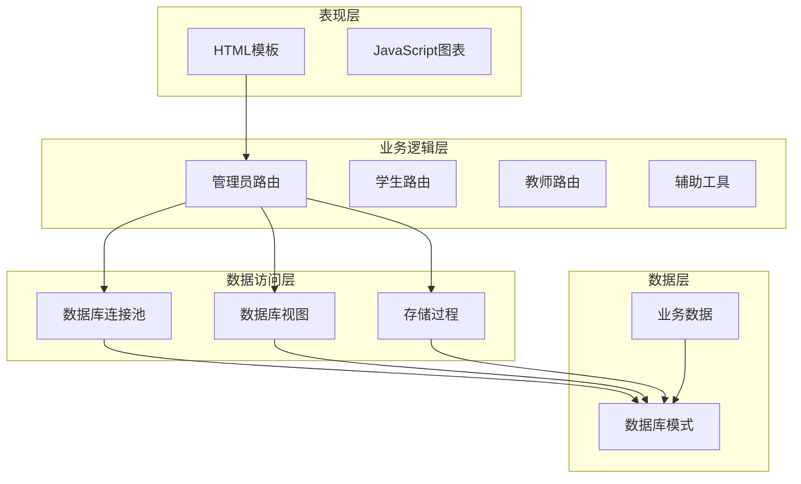
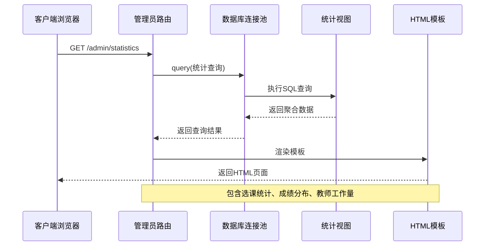
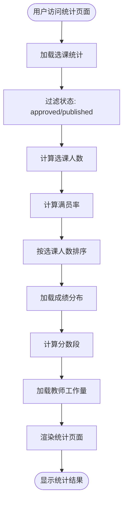
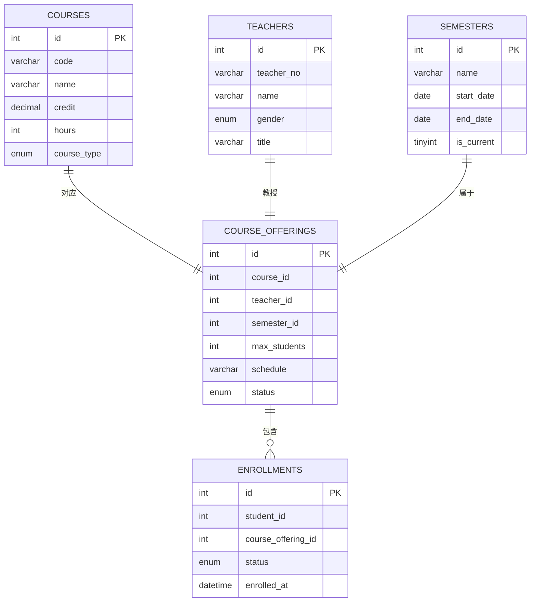
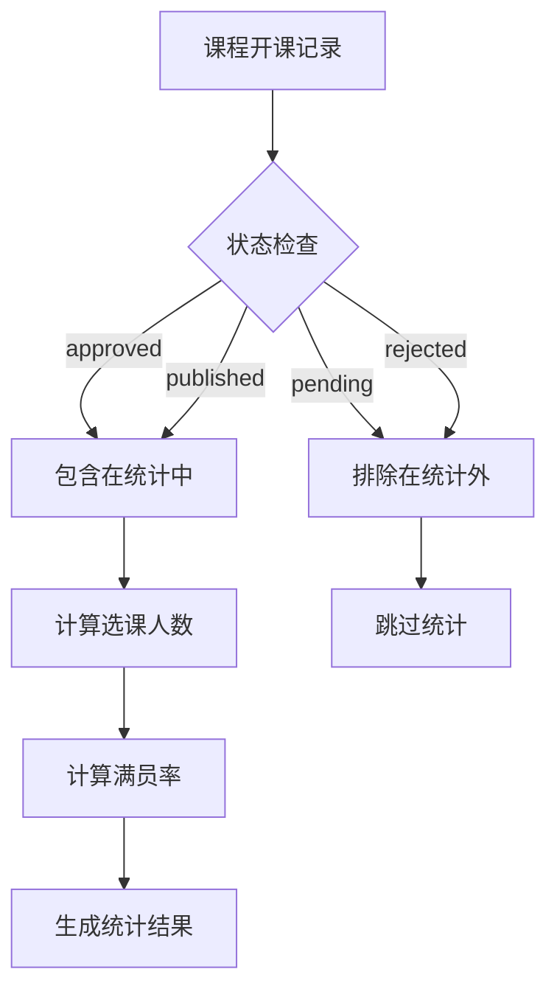
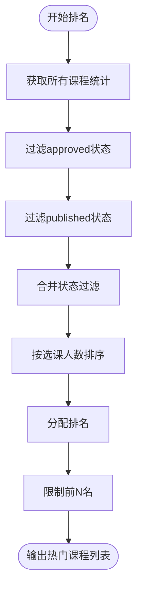
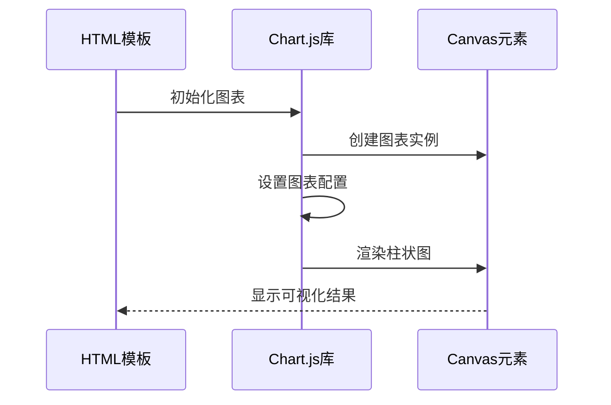
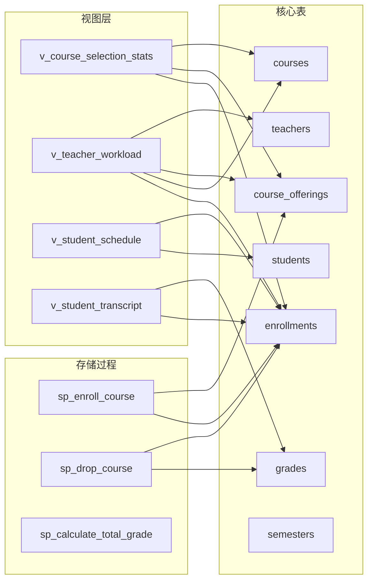
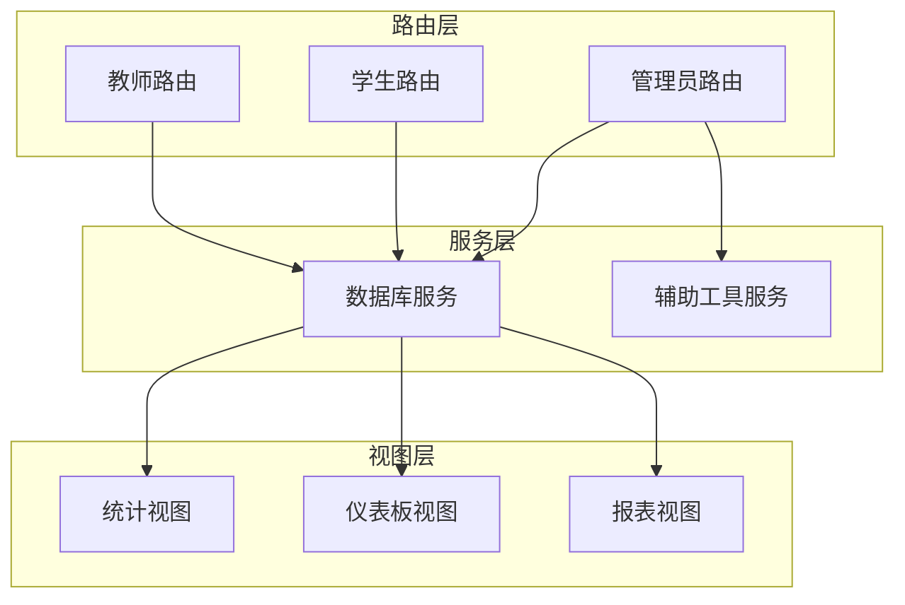

# 选课统计分析

<cite>
**本文档引用的文件**
- [app/admin/routes.py](file://app/admin/routes.py)
- [sql/04_views.sql](file://sql/04_views.sql)
- [app/templates/admin/statistics.html](file://app/templates/admin/statistics.html)
- [app/db.py](file://app/db.py)
- [config.py](file://config.py)
- [app/helpers.py](file://app/helpers.py)
- [sql/01_schema.sql](file://sql/01_schema.sql)
- [sql/03_procedures.sql](file://sql/03_procedures.sql)
</cite>

## 目录
1. [简介](#简介)
2. [项目结构](#项目结构)
3. [核心组件](#核心组件)
4. [架构概览](#架构概览)
5. [详细组件分析](#详细组件分析)
6. [依赖关系分析](#依赖关系分析)
7. [性能考虑](#性能考虑)
8. [故障排除指南](#故障排除指南)
9. [结论](#结论)

## 简介

本系统是一个校园教务选课与成绩管理系统，其中选课统计分析功能是核心业务模块之一。该功能通过视图层实现对课程选课情况的实时统计分析，包括选课人数统计、课程容量对比分析、热门课程排行等功能。

系统采用Flask框架构建，使用MySQL作为数据库后端，通过视图和存储过程实现复杂的数据聚合和统计分析功能。选课统计分析功能主要服务于管理员用户，提供直观的统计数据展示和可视化图表。

## 项目结构

系统采用典型的三层架构设计，主要包含以下层次：

**图表来源**
- [app/admin/routes.py:611-639](file://app/admin/routes.py#L611-L639)
- [app/db.py:1-121](file://app/db.py#L1-L121)

**章节来源**
- [app/admin/routes.py:1-692](file://app/admin/routes.py#L1-L692)
- [config.py:1-36](file://config.py#L1-L36)

## 核心组件

### 1. 选课统计视图 (v_course_selection_stats)

选课统计功能的核心是`v_course_selection_stats`视图，该视图实现了以下关键功能：

- **选课人数统计**: 使用`COUNT(CASE WHEN e.status = 'enrolled' THEN 1 END)`计算每个课程的实际选课人数
- **容量对比分析**: 直接从`course_offerings`表获取最大容量限制
- **满员率计算**: 通过`ROUND(COUNT(...) * 100.0 / co.max_students, 1)`计算精确的满员率
- **状态过滤**: 只统计approved和published状态的课程

### 2. 热门课程排行算法

系统实现了基于选课人数的热门课程排行算法：

- **排序依据**: `ORDER BY enrolled_count DESC`按选课人数降序排列
- **数据来源**: 来自`v_course_selection_stats`视图的聚合数据
- **过滤机制**: 自动过滤掉非approved和non-published状态的课程

### 3. 成绩分布统计

除了选课统计，系统还提供成绩分布统计功能：

- **分数段划分**: 90-100(优秀)、80-89(良好)、70-79(中等)、60-69(及格)、60以下(不及格)
- **数据聚合**: 使用`CASE WHEN`条件表达式进行分组统计
- **可视化展示**: 通过Chart.js实现柱状图展示

**章节来源**
- [sql/04_views.sql:70-91](file://sql/04_views.sql#L70-L91)
- [app/admin/routes.py:611-639](file://app/admin/routes.py#L611-L639)

## 架构概览

系统采用分层架构设计，各层职责明确：

**图表来源**
- [app/admin/routes.py:611-639](file://app/admin/routes.py#L611-L639)
- [app/db.py:43-51](file://app/db.py#L43-L51)

### 数据流分析

**图表来源**
- [app/admin/routes.py:614-618](file://app/admin/routes.py#L614-L618)
- [app/admin/routes.py:620-627](file://app/admin/routes.py#L620-L627)

## 详细组件分析

### 选课统计视图实现

#### 视图结构分析

**图表来源**
- [sql/01_schema.sql:128-174](file://sql/01_schema.sql#L128-L174)

#### SQL查询逻辑

选课统计功能的核心查询包含以下关键要素：

1. **主表关联**: `course_offerings`与`courses`、`teachers`、`semesters`的内连接
2. **左连接处理**: 与`enrollments`使用左连接确保即使没有选课记录也显示课程信息
3. **条件聚合**: 使用`COUNT(CASE WHEN e.status = 'enrolled' THEN 1 END)`精确统计有效选课
4. **状态过滤**: 在应用层过滤`offering_status IN ('approved', 'published')`

#### 选课状态过滤机制

**图表来源**
- [app/admin/routes.py:614-618](file://app/admin/routes.py#L614-L618)

### 热门课程排行算法

#### 排序规则实现

热门课程排行算法遵循以下规则：

1. **数据源**: 来自`v_course_selection_stats`视图的聚合数据
2. **排序字段**: `enrolled_count`（选课人数）
3. **排序方向**: 降序排列（DESC）
4. **过滤条件**: 仅包含approved和published状态的课程

#### 算法复杂度分析

- **时间复杂度**: O(n log n)，主要由排序操作决定
- **空间复杂度**: O(n)，需要存储所有课程的统计结果
- **数据库负载**: 单次查询完成所有统计和排序

#### 排名计算逻辑

**图表来源**
- [app/admin/routes.py:614-618](file://app/admin/routes.py#L614-L618)

### 前端展示组件

#### HTML模板结构

统计页面采用响应式设计，包含三个主要统计区域：

1. **选课情况统计表**: 展示课程代码、名称、教师、容量、已选人数、满员率
2. **成绩分布统计**: 提供柱状图和表格两种展示方式
3. **教师工作量统计**: 展示教师的开课数量和指导学生总数

#### 进度条可视化

系统使用Bootstrap进度条组件实现满员率的可视化展示：

- **绿色**: 满员率 < 80%
- **黄色**: 80% ≤ 满员率 < 100%
- **红色**: 满员率 = 100%

#### JavaScript图表集成

**图表来源**
- [app/templates/admin/statistics.html:49-64](file://app/templates/admin/statistics.html#L49-L64)

**章节来源**
- [app/templates/admin/statistics.html:1-65](file://app/templates/admin/statistics.html#L1-L65)

## 依赖关系分析

### 数据库依赖关系

**图表来源**
- [sql/04_views.sql:70-113](file://sql/04_views.sql#L70-L113)
- [sql/03_procedures.sql:14-113](file://sql/03_procedures.sql#L14-L113)

### 应用层依赖关系

**图表来源**
- [app/admin/routes.py:1-692](file://app/admin/routes.py#L1-L692)
- [app/db.py:1-121](file://app/db.py#L1-L121)

**章节来源**
- [app/db.py:1-121](file://app/db.py#L1-L121)
- [app/helpers.py:1-80](file://app/helpers.py#L1-L80)

## 性能考虑

### 数据库优化策略

1. **索引优化**
   - `course_offerings`表的`status`索引支持快速状态过滤
   - `enrollments`表的`course_offering_id`索引加速选课统计
   - `enrollments`表的`status`索引支持状态条件查询

2. **查询优化**
   - 使用视图避免重复的复杂查询逻辑
   - 左连接确保统计完整性，即使没有选课记录也显示课程信息
   - 分组聚合减少数据传输量

3. **缓存策略**
   - 视图查询结果在数据库层面缓存
   - Flask应用层可以实现适当的HTTP缓存

### 应用层优化

1. **连接池管理**
   - 使用PooledDB实现数据库连接复用
   - 合理配置连接池大小避免资源浪费

2. **分页处理**
   - 对于大量数据的查询实现分页
   - 控制单次查询的数据量

3. **模板渲染优化**
   - 避免在模板中执行复杂的计算逻辑
   - 将数据预处理在Python层完成

## 故障排除指南

### 常见问题诊断

#### 1. 统计数据显示异常

**症状**: 选课人数统计不准确或显示为NULL

**可能原因**:
- `enrollments`表中的`status`字段值不符合预期
- `course_offerings`表缺少对应的开课记录
- 数据库权限问题导致查询失败

**解决方案**:
- 检查`enrollments`表的`status`枚举值
- 验证`course_offerings`表的外键完整性
- 确认数据库用户的查询权限

#### 2. 页面加载缓慢

**症状**: 统计页面响应时间过长

**可能原因**:
- 数据库查询未使用适当索引
- 连接池配置不当
- 视图查询过于复杂

**解决方案**:
- 添加必要的数据库索引
- 调整连接池参数
- 优化视图查询逻辑

#### 3. 图表显示问题

**症状**: 成绩分布图表无法正常显示

**可能原因**:
- Chart.js库加载失败
- JavaScript变量作用域问题
- 数据格式不正确

**解决方案**:
- 检查网络连接和CDN访问
- 验证JavaScript变量定义
- 确认数据格式符合Chart.js要求

**章节来源**
- [app/db.py:43-80](file://app/db.py#L43-L80)
- [app/helpers.py:9-21](file://app/helpers.py#L9-L21)

## 结论

选课统计分析功能通过精心设计的视图层和业务逻辑层实现了高效、准确的统计分析能力。系统的主要优势包括：

1. **数据准确性**: 通过视图层实现精确的选课人数统计和状态过滤
2. **性能优化**: 合理的索引设计和查询优化确保了良好的响应性能
3. **用户体验**: 直观的可视化展示和清晰的统计结果呈现
4. **扩展性**: 模块化的架构设计便于功能扩展和维护

该功能为教务管理人员提供了重要的决策支持，通过实时的选课数据分析帮助优化教学资源配置，提高教学质量。未来可以在现有基础上进一步增强预测分析能力和移动端适配功能。