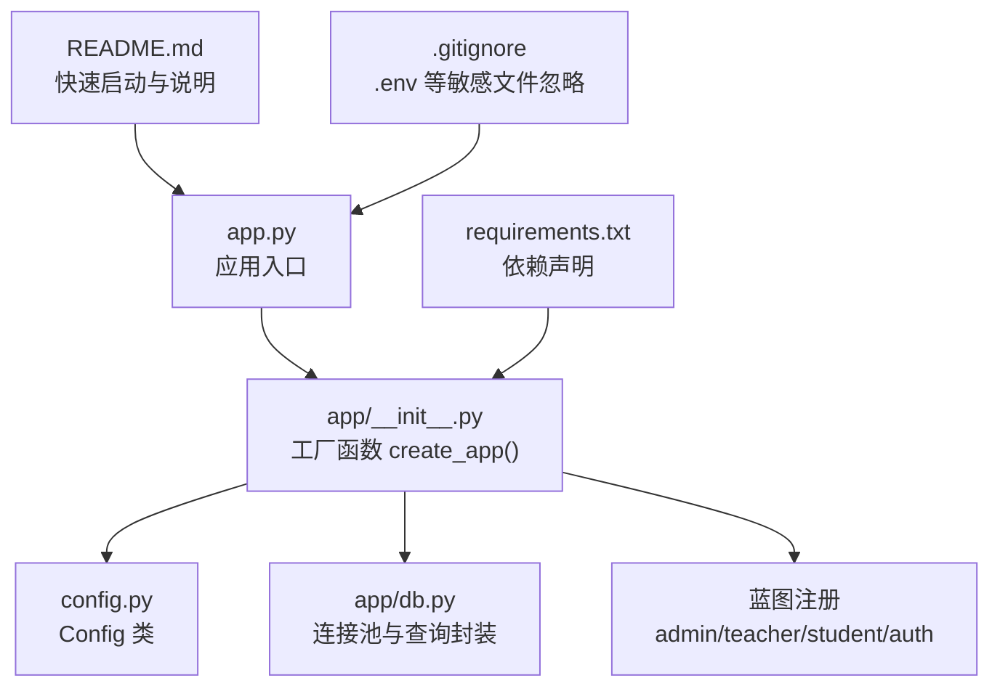
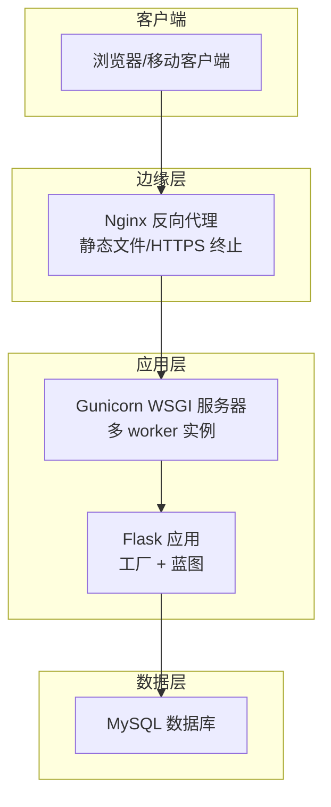
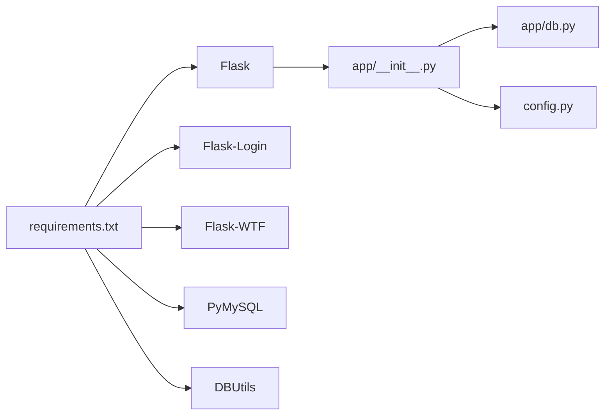

# 应用服务器配置

<cite>
**本文引用的文件**
- [app.py](file://app.py)
- [app/__init__.py](file://app/__init__.py)
- [config.py](file://config.py)
- [app/db.py](file://app/db.py)
- [requirements.txt](file://requirements.txt)
- [README.md](file://README.md)
- [.gitignore](file://.gitignore)
- [app/admin/routes.py](file://app/admin/routes.py)
- [app/auth/routes.py](file://app/auth/routes.py)
</cite>

## 目录
1. [简介](#简介)
2. [项目结构](#项目结构)
3. [核心组件](#核心组件)
4. [架构总览](#架构总览)
5. [详细组件分析](#详细组件分析)
6. [依赖分析](#依赖分析)
7. [性能考虑](#性能考虑)
8. [故障排查指南](#故障排查指南)
9. [结论](#结论)
10. [附录](#附录)

## 简介
本指南面向部署学生信息管理系统（MIS）应用服务器，围绕以下目标展开：
- Gunicorn WSGI 服务器安装与配置：进程数量、worker 类型、内存限制
- Nginx 反向代理配置：虚拟主机、静态文件服务、负载均衡
- SSL 证书配置：证书申请、安装与自动续期
- 应用启动脚本：systemd 服务、进程监控与自动重启
- 环境变量：生产专用配置与敏感信息保护
- 性能调优：缓存、静态资源优化与压缩

本指南严格基于仓库现有代码与配置进行说明，不引入外部假设。

## 项目结构
应用采用 Flask 3.x + PyMySQL + DBUtils 连接池的典型三层结构：
- 入口与工厂：app.py、app/__init__.py
- 配置：config.py
- 数据层：app/db.py（连接池、查询封装）
- 路由与蓝图：app/admin/routes.py、app/auth/routes.py
- 依赖：requirements.txt
- 文档与忽略项：README.md、.gitignore

图表来源
- [app.py:1-13](file://app.py#L1-L13)
- [app/__init__.py:29-92](file://app/__init__.py#L29-L92)
- [config.py:6-36](file://config.py#L6-L36)
- [app/db.py:10-41](file://app/db.py#L10-L41)
- [requirements.txt:1-8](file://requirements.txt#L1-L8)
- [README.md:12-36](file://README.md#L12-L36)
- [.gitignore:1-13](file://.gitignore#L1-L13)

章节来源
- [app.py:1-13](file://app.py#L1-L13)
- [app/__init__.py:29-92](file://app/__init__.py#L29-L92)
- [config.py:6-36](file://config.py#L6-L36)
- [app/db.py:10-41](file://app/db.py#L10-L41)
- [requirements.txt:1-8](file://requirements.txt#L1-L8)
- [README.md:12-36](file://README.md#L12-L36)
- [.gitignore:1-13](file://.gitignore#L1-L13)

## 核心组件
- 应用工厂与蓝图注册：在工厂函数中完成配置注入、CSRF 保护、数据库连接池初始化、Flask-Login 注册以及各模块蓝图注册。
- 数据库连接池：使用 DBUtils 的 PooledDB 提供连接池，支持最小缓存、最大缓存与最大连接数配置。
- 配置类：集中管理密钥、调试模式、数据库连接参数与连接池参数、分页参数等。
- 入口脚本：本地开发时直接运行 app.run()，生产环境建议使用 WSGI 服务器（如 Gunicorn）与反向代理（如 Nginx）。

章节来源
- [app/__init__.py:29-92](file://app/__init__.py#L29-L92)
- [app/db.py:10-41](file://app/db.py#L10-L41)
- [config.py:6-36](file://config.py#L6-L36)
- [app.py:1-13](file://app.py#L1-L13)

## 架构总览
应用在生产环境推荐的部署形态如下：
- 反向代理（Nginx）负责静态资源与 TLS 终止
- 多个 Gunicorn worker 实例承载 WSGI 应用
- 应用通过 DBUtils 连接池访问 MySQL

图表来源
- [app.py:1-13](file://app.py#L1-L13)
- [app/__init__.py:29-92](file://app/__init__.py#L29-L92)
- [app/db.py:10-41](file://app/db.py#L10-L41)

## 详细组件分析

### Gunicorn WSGI 服务器配置
- 进程与 worker 类型
  - 推荐使用同步 worker（sync），适合 I/O 密集型场景（如数据库访问）
  - worker 数量通常设置为 CPU 核数 × 2 + 1，结合实际并发与内存占用微调
- 内存限制
  - 使用 worker 级别的内存限制（如 OOM 检测）避免单个 worker 占用过多内存
  - 结合应用日志与监控观察内存增长趋势，必要时降低并发或拆分实例
- 进程与线程
  - 默认使用同步 worker；若需高并发 I/O，可评估 gevent 或 tornado worker，但需确保应用与依赖兼容
- 日志与健康检查
  - 生产环境建议启用访问日志与错误日志，便于问题定位
  - 结合 systemd 或进程监控工具实现自动重启

章节来源
- [app/__init__.py:29-92](file://app/__init__.py#L29-L92)
- [app/db.py:10-41](file://app/db.py#L10-L41)
- [config.py:19-22](file://config.py#L19-L22)

### Nginx 反向代理配置
- 虚拟主机与站点
  - 监听 80/443，80 自动重定向至 443
  - 443 使用 SSL 证书与安全套件
- 静态文件服务
  - 将 static 目录交由 Nginx 直接提供，减少应用压力
- 反向代理到 Gunicorn
  - 将动态请求转发至本地 Unix Socket 或 TCP 端口
  - 设置合理的超时与缓冲区参数，避免慢客户端拖垮后端
- 负载均衡
  - 若部署多实例，可在上游组中加入多个 Gunicorn 实例
  - 注意会话粘性与共享状态（本应用以数据库为中心，无需粘性）

章节来源
- [README.md:12-36](file://README.md#L12-L36)
- [app/static/css/style.css](file://app/static/css/style.css)
- [app/static/js/main.js](file://app/static/js/main.js)

### SSL 证书配置
- 证书申请
  - 推荐使用 Let’s Encrypt（acme-tiny、certbot 或 acme.sh）自动化申请
- 安装与部署
  - 将证书与私钥放置受保护目录，权限仅允许 Nginx 读取
  - 在 Nginx 中配置 ssl_certificate 与 ssl_certificate_key
- 自动续期
  - 编写定时任务（crontab 或 systemd timer）执行续期命令
  - 续期成功后自动重载 Nginx

章节来源
- [README.md:12-36](file://README.md#L12-L36)

### 应用启动脚本与 systemd 服务
- systemd 服务单元
  - 以非 root 用户运行，设置 WorkingDirectory、Environment、ExecStart/Stop 等
  - 使用 Restart=always 与 RestartSec 控制自动重启策略
- 进程监控
  - 结合进程存活检测与日志轮转，确保异常时及时恢复
- 启动顺序
  - 确保数据库可用后再启动应用；可使用 systemd 的 After/BindsTo 语义

章节来源
- [app.py:1-13](file://app.py#L1-13)
- [config.py:9](file://config.py#L9)

### 环境变量与敏感信息保护
- 关键环境变量
  - SECRET_KEY：用于签名 Cookie 与 CSRF
  - FLASK_DEBUG：控制调试模式
  - FLASK_HOST/FLASK_PORT：本地开发监听地址与端口
  - DB_*：数据库连接参数（主机、端口、用户、密码、库名）
- .env 忽略策略
  - .gitignore 已包含 .env，避免误提交
- 生产建议
  - 不在代码中硬编码敏感值，统一通过环境变量注入
  - 使用只读权限的系统用户运行服务

章节来源
- [config.py:7-17](file://config.py#L7-L17)
- [config.py:9](file://config.py#L9)
- [.gitignore:5](file://.gitignore#L5)

### 性能调优
- 缓存配置
  - 利用 DBUtils 连接池（最小缓存、最大缓存、最大连接数）平衡并发与资源占用
  - 对热点查询结果可考虑应用层缓存（如 Redis），但需注意一致性
- 静态资源优化
  - Nginx 提供静态文件，开启 gzip/HTTP/2 与合适的缓存头
  - 前端资源建议启用长期缓存与版本化
- 压缩设置
  - Nginx 启用 gzip 压缩，合理设置压缩级别与阈值
- 数据库层面
  - 合理设置连接池上限，避免数据库连接耗尽
  - 对高频查询建立索引，避免全表扫描

章节来源
- [app/db.py:10-41](file://app/db.py#L10-L41)
- [config.py:19-22](file://config.py#L19-L22)
- [README.md:12-36](file://README.md#L12-L36)

## 依赖分析
- 应用依赖
  - Flask 3.x、Flask-Login、Flask-WTF、PyMySQL、DBUtils、Werkzeug、WTForms
- 运行时耦合
  - 应用通过工厂函数注入配置，蓝图注册解耦模块
  - 数据库访问通过连接池封装，降低耦合度

图表来源
- [requirements.txt:1-8](file://requirements.txt#L1-L8)
- [app/__init__.py:29-92](file://app/__init__.py#L29-L92)
- [app/db.py:10-41](file://app/db.py#L10-L41)
- [config.py:6-36](file://config.py#L6-L36)

章节来源
- [requirements.txt:1-8](file://requirements.txt#L1-L8)
- [app/__init__.py:29-92](file://app/__init__.py#L29-L92)
- [app/db.py:10-41](file://app/db.py#L10-L41)
- [config.py:6-36](file://config.py#L6-L36)

## 性能考虑
- 连接池参数
  - DB_POOL_MIN_CACHED、DB_POOL_MAX_CACHED、DB_POOL_MAX_CONNECTIONS 需结合并发与数据库性能调优
- Worker 数量
  - 基于 CPU 核心数与内存预算设定，避免过度并发导致上下文切换开销
- 静态资源与压缩
  - Nginx 提供静态文件与压缩，减轻应用负担
- 监控与日志
  - 建议集成应用日志与指标采集，持续观察响应时间与错误率

章节来源
- [config.py:19-22](file://config.py#L19-L22)
- [app/db.py:10-41](file://app/db.py#L10-L41)
- [README.md:12-36](file://README.md#L12-L36)

## 故障排查指南
- 404/500 错误处理
  - 应用内置错误处理器，渲染对应模板
- 数据库连接问题
  - 检查 DB_* 环境变量与连接池参数是否合理
  - 查看连接池上限与当前活跃连接数
- 启动失败
  - 确认 SECRET_KEY、数据库凭据、端口占用情况
  - systemd 日志与应用日志双通道排查

章节来源
- [app/__init__.py:76-90](file://app/__init__.py#L76-L90)
- [config.py:11-17](file://config.py#L11-L17)
- [app/db.py:10-41](file://app/db.py#L10-L41)
- [app.py:1-13](file://app.py#L1-13)

## 结论
本指南基于仓库现有代码与配置，给出了 Gunicorn 与 Nginx 的生产部署要点、SSL 证书流程、systemd 服务与环境变量最佳实践，以及性能调优建议。建议在上线前完成端到端测试与压测，确保在目标硬件与流量模型下的稳定性与性能达标。

## 附录
- 快速启动参考
  - 依赖安装与数据库初始化见 README 的“快速启动”部分
- 配置示例路径
  - 应用工厂与蓝图注册：[app/__init__.py:29-92](file://app/__init__.py#L29-L92)
  - 配置类与连接池参数：[config.py:6-36](file://config.py#L6-L36)
  - 数据库连接池初始化：[app/db.py:10-41](file://app/db.py#L10-L41)
  - 入口脚本与开发运行：[app.py:1-13](file://app.py#L1-13)
  - 依赖声明：[requirements.txt:1-8](file://requirements.txt#L1-L8)
  - 快速启动与数据库初始化：[README.md:12-36](file://README.md#L12-L36)
  - .env 忽略策略：[.gitignore:5](file://.gitignore#L5)