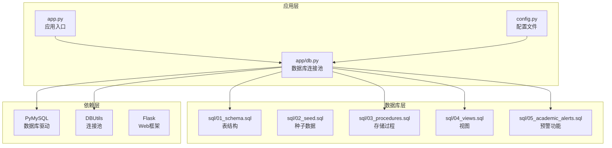
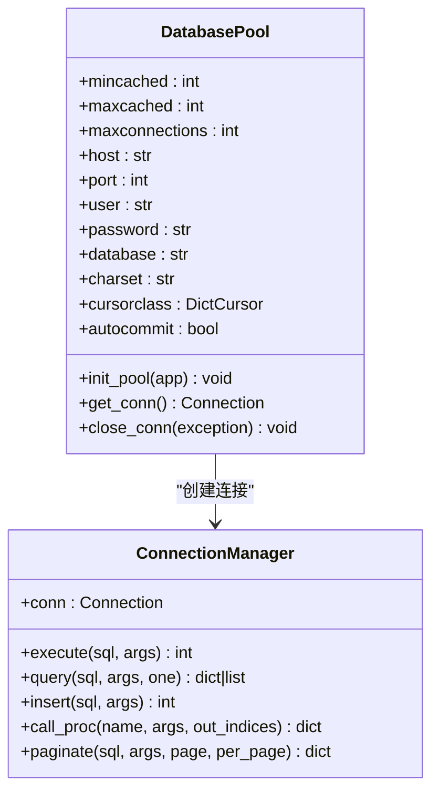
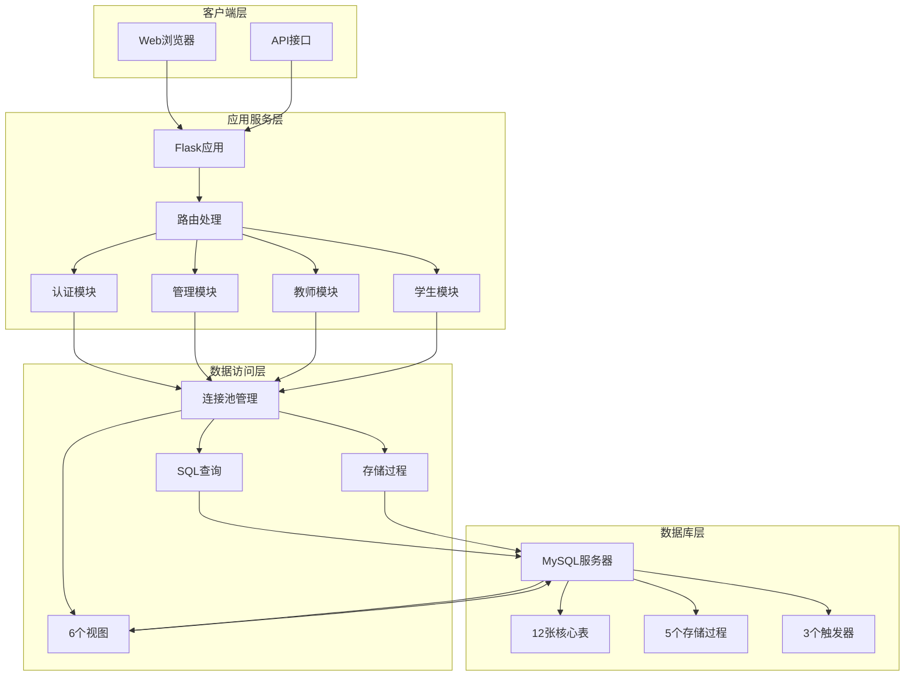
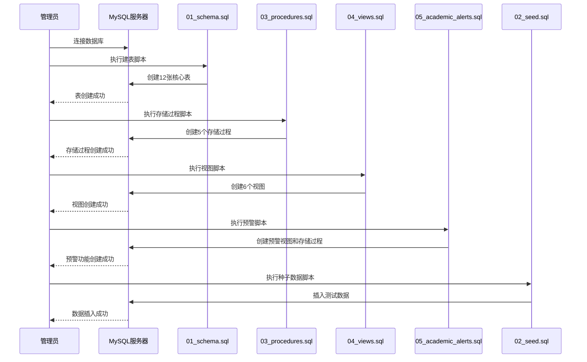
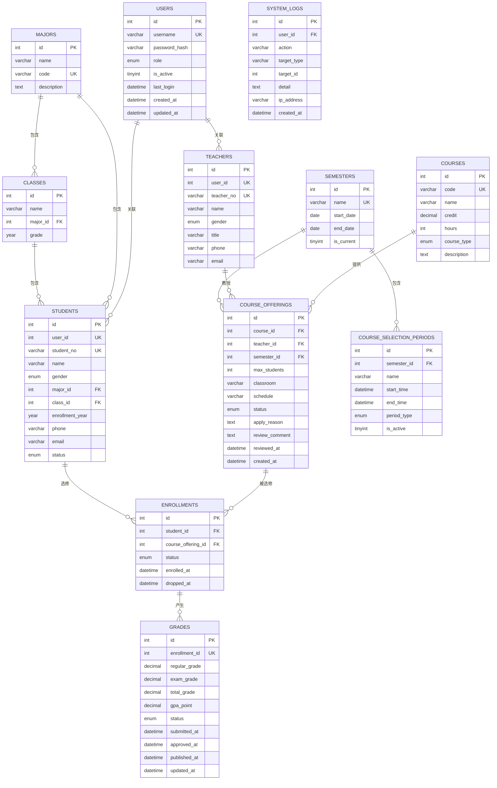
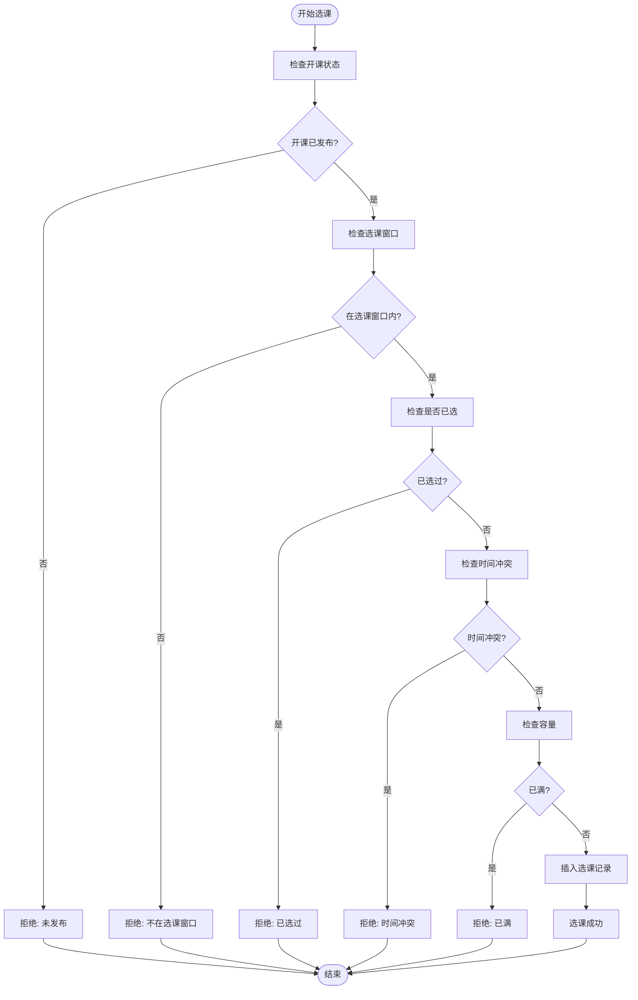
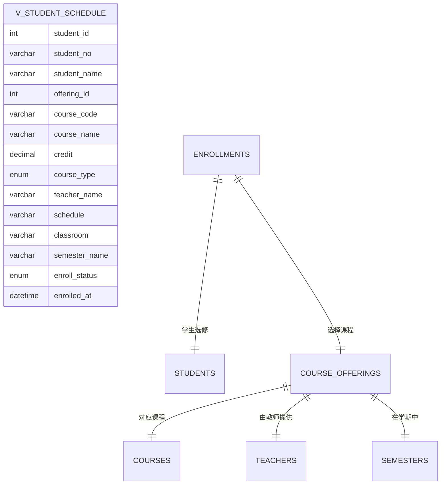
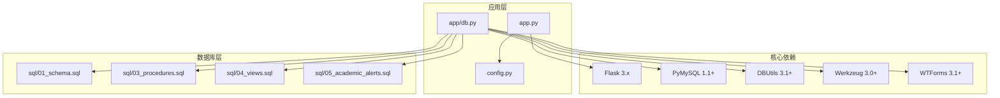
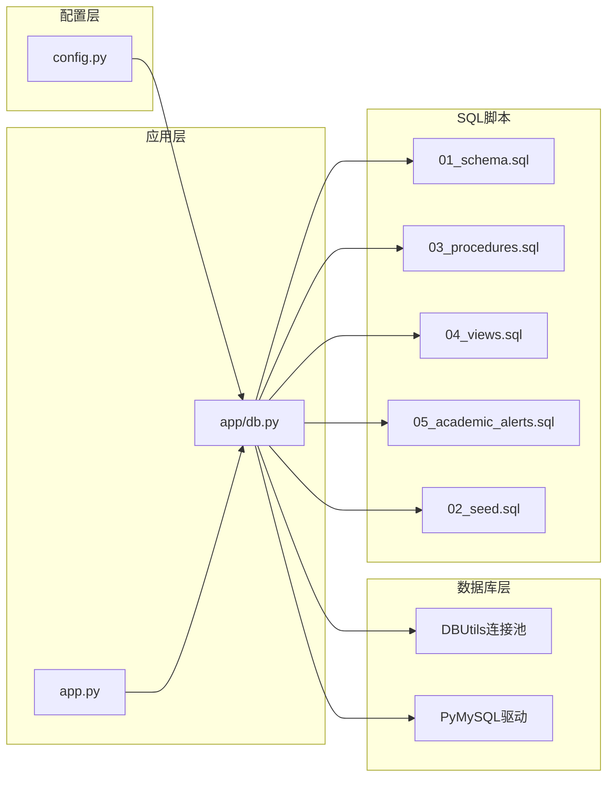

# 数据库部署

<cite>
**本文档引用的文件**
- [app/db.py](file://app/db.py)
- [config.py](file://config.py)
- [sql/01_schema.sql](file://sql/01_schema.sql)
- [sql/02_seed.sql](file://sql/02_seed.sql)
- [sql/03_procedures.sql](file://sql/03_procedures.sql)
- [sql/04_views.sql](file://sql/04_views.sql)
- [sql/05_academic_alerts.sql](file://sql/05_academic_alerts.sql)
- [app.py](file://app.py)
- [requirements.txt](file://requirements.txt)
- [README.md](file://README.md)
</cite>

## 目录
1. [简介](#简介)
2. [项目结构](#项目结构)
3. [核心组件](#核心组件)
4. [架构概览](#架构概览)
5. [详细组件分析](#详细组件分析)
6. [依赖关系分析](#依赖关系分析)
7. [性能考虑](#性能考虑)
8. [故障排除指南](#故障排除指南)
9. [结论](#结论)

## 简介

学生信息管理系统是一个基于Python Flask框架开发的校园教务选课与成绩管理系统。该系统采用MySQL作为主要数据库，使用PyMySQL和DBUtils连接池技术，实现了完整的数据库部署和管理功能。系统包含12张核心表、5个存储过程、3个触发器和6个视图，支持复杂的教务业务流程。

## 项目结构

该项目采用模块化设计，数据库相关的核心文件分布如下：

**图表来源**
- [app.py:1-13](file://app.py#L1-L13)
- [app/db.py:1-121](file://app/db.py#L1-L121)
- [config.py:1-36](file://config.py#L1-L36)

**章节来源**
- [README.md:46-69](file://README.md#L46-L69)
- [requirements.txt:1-8](file://requirements.txt#L1-L8)

## 核心组件

### 数据库连接池配置

系统使用DBUtils库实现高效的数据库连接池管理，支持连接复用和并发控制：

**图表来源**
- [app/db.py:10-41](file://app/db.py#L10-L41)
- [config.py:19-25](file://config.py#L19-L25)

### 数据库配置参数

系统支持通过环境变量和配置文件两种方式设置数据库参数：

| 配置项 | 默认值 | 环境变量 | 说明 |
|--------|--------|----------|------|
| DB_HOST | localhost | DB_HOST | 数据库主机地址 |
| DB_PORT | 3306 | DB_PORT | 数据库端口号 |
| DB_USER | root | DB_USER | 数据库用户名 |
| DB_PASSWORD | 123456 | DB_PASSWORD | 数据库密码 |
| DB_NAME | mis_system | DB_NAME | 数据库名称 |
| DB_CHARSET | utf8mb4 | - | 字符集设置 |
| DB_POOL_MIN_CACHED | 2 | - | 最小缓存连接数 |
| DB_POOL_MAX_CACHED | 10 | - | 最大缓存连接数 |
| DB_POOL_MAX_CONNECTIONS | 20 | - | 最大连接数 |

**章节来源**
- [config.py:11-25](file://config.py#L11-L25)
- [app/db.py:13-26](file://app/db.py#L13-L26)

## 架构概览

系统采用分层架构设计，数据库层负责数据持久化，应用层通过连接池管理数据库连接：

**图表来源**
- [app.py:1-13](file://app.py#L1-L13)
- [app/db.py:1-121](file://app/db.py#L1-L121)
- [README.md:71-77](file://README.md#L71-L77)

## 详细组件分析

### 数据库初始化流程

系统提供了完整的数据库初始化流程，需要按照特定顺序执行SQL脚本：

**图表来源**
- [README.md:19-27](file://README.md#L19-L27)
- [sql/01_schema.sql:1-235](file://sql/01_schema.sql#L1-L235)
- [sql/02_seed.sql:1-49](file://sql/02_seed.sql#L1-L49)

### 表结构设计

系统采用12张核心表，遵循第三范式设计原则，确保数据一致性和完整性：

**图表来源**
- [sql/01_schema.sql:13-234](file://sql/01_schema.sql#L13-L234)

### 存储过程实现

系统包含5个核心存储过程，处理主要的业务逻辑：

#### 选课存储过程 (sp_enroll_course)

**图表来源**
- [sql/03_procedures.sql:14-113](file://sql/03_procedures.sql#L14-L113)

#### GPA计算存储过程 (sp_calculate_gpa)

该存储过程计算指定学生在指定学期的GPA，支持加权平均计算：

**章节来源**
- [sql/03_procedures.sql:242-274](file://sql/03_procedures.sql#L242-L274)

### 视图设计

系统提供6个视图，简化复杂查询操作：

#### 学生课表视图 (v_student_schedule)

**图表来源**
- [sql/04_views.sql:10-32](file://sql/04_views.sql#L10-L32)

**章节来源**
- [sql/04_views.sql:7-113](file://sql/04_views.sql#L7-L113)

## 依赖关系分析

### 外部依赖

系统依赖以下外部组件：

**图表来源**
- [requirements.txt:1-8](file://requirements.txt#L1-L8)
- [app.py:1-13](file://app.py#L1-L13)

### 内部依赖关系

**图表来源**
- [app/db.py:1-121](file://app/db.py#L1-L121)
- [config.py:1-36](file://config.py#L1-L36)

**章节来源**
- [requirements.txt:1-8](file://requirements.txt#L1-L8)
- [README.md:71-77](file://README.md#L71-L77)

## 性能考虑

### 连接池配置优化

系统默认配置适用于开发环境，生产环境建议调整以下参数：

| 参数 | 开发环境 | 生产环境 | 说明 |
|------|----------|----------|------|
| DB_POOL_MIN_CACHED | 2 | 5-10 | 最小缓存连接数 |
| DB_POOL_MAX_CACHED | 10 | 20-50 | 最大缓存连接数 |
| DB_POOL_MAX_CONNECTIONS | 20 | 50-100 | 最大连接数 |
| DB_CHARSET | utf8mb4 | utf8mb4 | 字符集设置 |

### 数据库性能优化建议

1. **索引优化**
   - 为常用查询字段建立适当索引
   - 定期分析慢查询日志
   - 使用EXPLAIN分析查询计划

2. **存储过程优化**
   - 使用事务减少锁竞争
   - 合理使用FOR UPDATE避免死锁
   - 优化复杂查询的执行计划

3. **连接池优化**
   - 根据并发用户数调整连接池大小
   - 设置合理的连接超时时间
   - 监控连接池使用率

## 故障排除指南

### 常见问题及解决方案

#### 数据库连接问题

**症状**: 应用启动时报数据库连接错误
**原因**: 数据库配置不正确或MySQL服务未启动
**解决方案**:
1. 检查数据库连接参数配置
2. 验证MySQL服务状态
3. 确认防火墙设置允许连接

#### SQL执行错误

**症状**: 执行SQL脚本时报错
**原因**: SQL语法错误或依赖关系问题
**解决方案**:
1. 按照正确的执行顺序执行脚本
2. 检查MySQL版本兼容性
3. 确认数据库权限足够

#### 存储过程调用失败

**症状**: 调用存储过程时报错
**原因**: 存储过程参数不匹配或权限不足
**解决方案**:
1. 检查存储过程参数类型和数量
2. 确认用户具有执行权限
3. 验证事务处理逻辑

**章节来源**
- [app/db.py:62-80](file://app/db.py#L62-L80)
- [sql/03_procedures.sql:14-113](file://sql/03_procedures.sql#L14-L113)

## 结论

学生信息管理系统提供了完整的数据库部署解决方案，包括：

1. **完善的数据库设计**: 12张核心表支持完整的教务业务流程
2. **高效的连接池管理**: DBUtils连接池提供高性能的数据访问
3. **丰富的存储过程**: 5个存储过程处理核心业务逻辑
4. **灵活的视图设计**: 6个视图简化复杂查询操作
5. **可扩展的架构**: 支持学业预警等扩展功能

系统采用模块化设计，易于维护和扩展。通过合理的配置和优化，可以满足中等规模校园教务系统的需求。建议在生产环境中根据实际负载情况调整连接池参数，并建立完善的监控和备份机制。