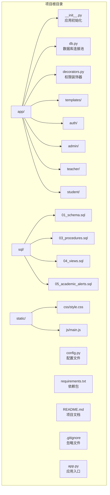
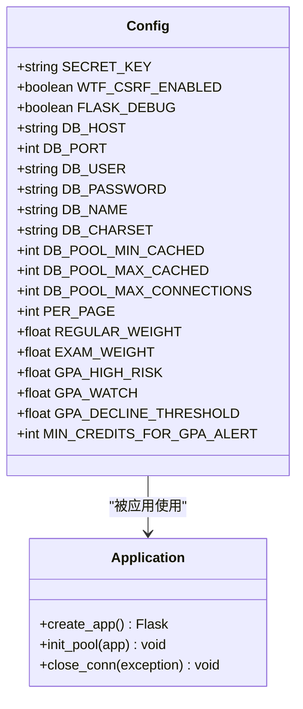
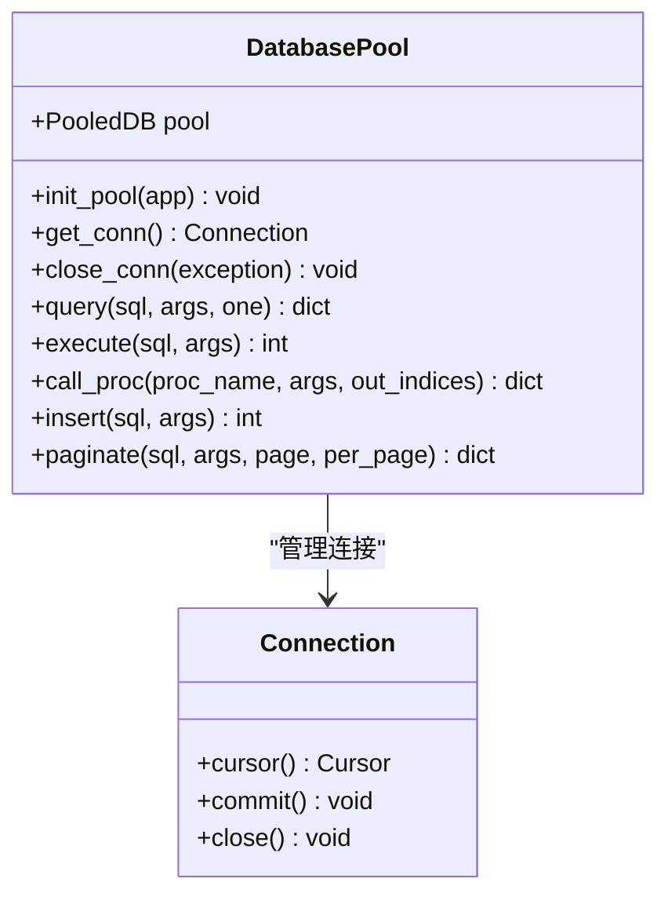
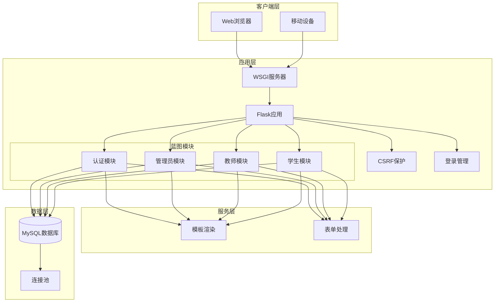
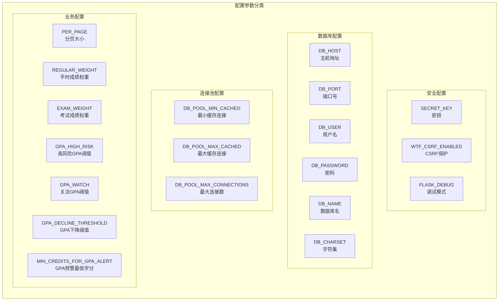
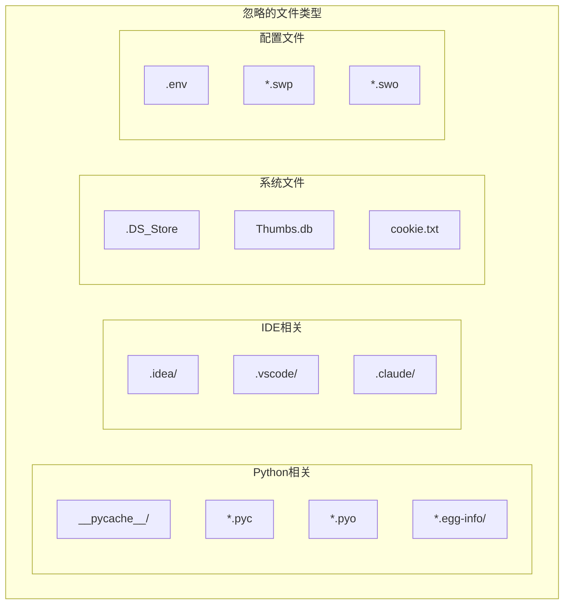
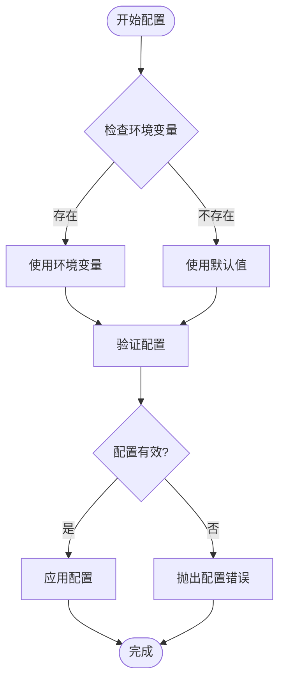
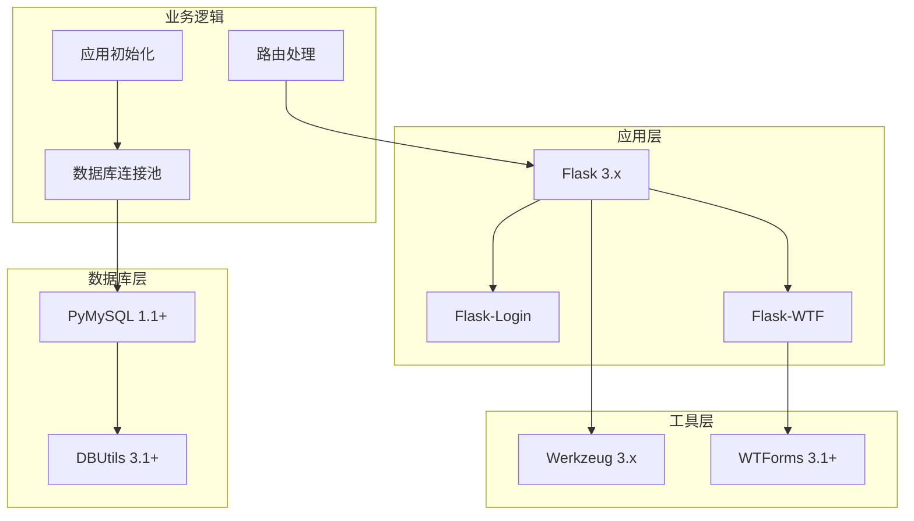
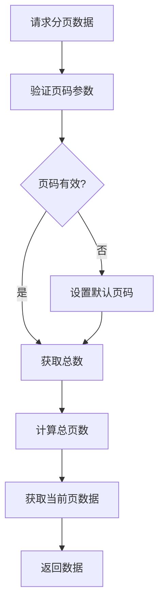

# 环境配置

<cite>
**本文档引用的文件**
- [config.py](file://config.py)
- [requirements.txt](file://requirements.txt)
- [README.md](file://README.md)
- [.gitignore](file://.gitignore)
- [app.py](file://app.py)
- [app/__init__.py](file://app/__init__.py)
- [app/db.py](file://app/db.py)
- [app/auth/routes.py](file://app/auth/routes.py)
- [app/admin/routes.py](file://app/admin/routes.py)
</cite>

## 目录
1. [简介](#简介)
2. [项目结构](#项目结构)
3. [核心组件](#核心组件)
4. [架构概览](#架构概览)
5. [详细组件分析](#详细组件分析)
6. [依赖分析](#依赖分析)
7. [性能考虑](#性能考虑)
8. [故障排除指南](#故障排除指南)
9. [结论](#结论)
10. [附录](#附录)

## 简介

学生信息管理系统是一个基于Python Flask框架开发的校园教务选课与成绩管理系统。该项目采用MySQL数据库，使用PyMySQL作为数据库驱动程序和DBUtils连接池技术，实现了完整的教务管理功能，包括学生选课、成绩管理、教师教学管理和管理员后台管理等功能模块。

本指南将详细介绍开发和生产环境的配置要求，包括系统要求、依赖包安装、配置文件管理、环境变量设置以及开发工具链配置等方面的内容。

## 项目结构

该项目采用标准的Flask应用结构，主要包含以下目录和文件：



**图表来源**
- [app/__init__.py:1-93](file://app/__init__.py#L1-L93)
- [config.py:1-36](file://config.py#L1-L36)
- [requirements.txt:1-8](file://requirements.txt#L1-L8)

**章节来源**
- [README.md:46-69](file://README.md#L46-L69)
- [app/__init__.py:1-93](file://app/__init__.py#L1-L93)

## 核心组件

### 配置管理组件

系统使用Config类集中管理所有配置参数，支持环境变量覆盖和默认值设置：



**图表来源**
- [config.py:6-36](file://config.py#L6-L36)
- [app/__init__.py:29-93](file://app/__init__.py#L29-L93)

### 数据库连接池组件

系统使用DBUtils连接池技术实现高效的数据库连接管理：



**图表来源**
- [app/db.py:10-121](file://app/db.py#L10-L121)

**章节来源**
- [config.py:6-36](file://config.py#L6-L36)
- [app/db.py:10-121](file://app/db.py#L10-L121)

## 架构概览

系统采用经典的MVC架构模式，结合Flask框架的蓝图机制实现模块化管理：



**图表来源**
- [app/__init__.py:29-93](file://app/__init__.py#L29-L93)
- [app/auth/routes.py:29-167](file://app/auth/routes.py#L29-L167)
- [app/admin/routes.py:10-615](file://app/admin/routes.py#L10-L615)

## 详细组件分析

### 环境配置组件

#### Python版本要求

系统基于Flask 3.x开发，需要Python 3.7及以上版本：

- **最低要求**: Python 3.7
- **推荐版本**: Python 3.8+
- **兼容性**: 支持Python 3.7-3.11

#### 操作系统兼容性

- **Windows**: 完全支持，推荐Windows 10/11
- **macOS**: 完全支持，推荐macOS 10.15+
- **Linux**: 完全支持，推荐Ubuntu 18.04+/CentOS 7+

#### 硬件配置需求

**开发环境**:
- CPU: Intel i5-10代或AMD Ryzen 5以上
- 内存: 8GB RAM（推荐16GB）
- 存储: 5GB可用空间
- 网络: 稳定的互联网连接

**生产环境**:
- CPU: Intel i7-11代或AMD Ryzen 7以上
- 内存: 16GB RAM（推荐32GB）
- 存储: 10GB可用空间
- 网络: 千兆网络连接

### 依赖包安装流程

#### 基础环境准备

1. **安装Python**:
   ```bash
   # 检查Python版本
   python --version
   
   # 或者使用python3命令
   python3 --version
   ```

2. **创建虚拟环境**:
   ```bash
   # Windows
   python -m venv mis_env
   
   # macOS/Linux
   python3 -m venv mis_env
   
   # 激活虚拟环境
   # Windows
   mis_env\Scripts\activate
   
   # macOS/Linux
   source mis_env/bin/activate
   ```

3. **升级pip**:
   ```bash
   pip install --upgrade pip
   ```

#### 安装依赖包

1. **安装核心依赖**:
   ```bash
   pip install -r requirements.txt
   ```

2. **验证安装**:
   ```bash
   pip list | grep -E "(flask|pymysql|dbutils)"
   ```

#### 依赖包详细说明

| 包名称 | 版本要求 | 功能描述 |
|--------|----------|----------|
| Flask | >=3.0 | Web框架核心 |
| Flask-Login | >=0.6 | 用户会话管理 |
| Flask-WTF | >=1.2 | 表单处理和CSRF保护 |
| PyMySQL | >=1.1 | MySQL数据库驱动 |
| DBUtils | >=3.1 | 连接池管理 |
| Werkzeug | >=3.0 | WSGI工具包 |
| WTForms | >=3.1 | 表单验证 |

**章节来源**
- [requirements.txt:1-8](file://requirements.txt#L1-L8)
- [README.md:14-17](file://README.md#L14-L17)

### 配置文件结构详解

#### config.py配置参数

系统配置采用Config类集中管理，支持环境变量覆盖：



**图表来源**
- [config.py:6-36](file://config.py#L6-L36)

#### 环境变量设置

系统支持通过环境变量覆盖配置参数：

| 环境变量 | 默认值 | 用途 |
|----------|--------|------|
| SECRET_KEY | mis-secret-key-change-in-production | Flask密钥 |
| FLASK_DEBUG | 0 | 调试模式开关 |
| FLASK_HOST | 0.0.0.0 | 服务器绑定地址 |
| FLASK_PORT | 5000 | 服务器端口 |
| DB_HOST | localhost | MySQL主机 |
| DB_PORT | 3306 | MySQL端口 |
| DB_USER | root | MySQL用户名 |
| DB_PASSWORD | 123456 | MySQL密码 |
| DB_NAME | mis_system | 数据库名 |

#### 默认值说明

所有配置参数都有合理的默认值，确保系统可以快速运行：

- **安全相关**: 使用强默认密钥，生产环境必须修改
- **数据库连接**: 本地MySQL连接，默认凭据需调整
- **连接池**: 适中的连接池大小，可根据负载调整
- **业务参数**: 基于教育场景的合理权重和阈值

**章节来源**
- [config.py:6-36](file://config.py#L6-L36)
- [app.py:8-12](file://app.py#L8-L12)

### .gitignore文件作用

.gitignore文件用于控制Git版本控制系统忽略的文件和目录：



**图表来源**
- [.gitignore:1-14](file://.gitignore#L1-L14)

**章节来源**
- [.gitignore:1-14](file://.gitignore#L1-L14)

### 环境变量管理最佳实践

#### 敏感信息保护

1. **使用环境变量存储敏感信息**:
   - 数据库密码
   - Flask密钥
   - 第三方服务凭证

2. **配置文件分离**:
   - 开发环境配置
   - 生产环境配置
   - 测试环境配置

3. **环境特定配置**:
   ```bash
   # 开发环境
   export FLASK_ENV=development
   export DEBUG=true
   
   # 生产环境
   export FLASK_ENV=production
   export DEBUG=false
   ```

#### 多环境配置策略



**图表来源**
- [config.py:7-9](file://config.py#L7-L9)

**章节来源**
- [config.py:7-9](file://config.py#L7-L9)

### 开发工具链配置

#### IDE设置建议

**Visual Studio Code配置**:

1. **Python扩展**:
   - Python (by Microsoft)
   - Pylance
   - Python Docstring Generator

2. **推荐设置**:
   ```json
   {
       "python.defaultInterpreterPath": "./mis_env/bin/python",
       "python.linting.enabled": true,
       "python.linting.pylintEnabled": false,
       "python.linting.flake8Enabled": true,
       "editor.formatOnSave": true,
       "editor.codeActionsOnSave": {
           "source.organizeImports": true
       }
   }
   ```

**PyCharm配置**:

1. **项目解释器**:
   - 选择虚拟环境路径
   - 配置Python 3.8+

2. **代码风格**:
   - PEP 8规范
   - 4空格缩进
   - 行宽120字符

#### 调试配置

**VS Code调试配置** (`launch.json`):
```json
{
    "version": "0.2",
    "configurations": [
        {
            "name": "Python: Flask",
            "type": "python",
            "request": "launch",
            "program": "${workspaceFolder}/app.py",
            "console": "integratedTerminal",
            "env": {
                "FLASK_APP": "app.py",
                "FLASK_ENV": "development"
            },
            "args": []
        }
    ]
}
```

#### 代码格式化规则

**Black格式化**:
```bash
# 安装
pip install black

# 格式化代码
black .
```

**Flake8检查**:
```bash
# 安装
pip install flake8

# 检查代码
flake8 .
```

**章节来源**
- [README.md:12-36](file://README.md#L12-L36)

## 依赖分析

系统依赖关系清晰，采用分层架构设计：



**图表来源**
- [requirements.txt:1-8](file://requirements.txt#L1-L8)
- [app/__init__.py:29-93](file://app/__init__.py#L29-L93)
- [app/db.py:10-121](file://app/db.py#L10-L121)

**章节来源**
- [requirements.txt:1-8](file://requirements.txt#L1-L8)

## 性能考虑

### 连接池优化

系统使用DBUtils连接池技术，通过以下参数优化性能：

- **DB_POOL_MIN_CACHED**: 2 - 最小缓存连接数
- **DB_POOL_MAX_CACHED**: 10 - 最大缓存连接数  
- **DB_POOL_MAX_CONNECTIONS**: 20 - 最大连接数

### 分页查询优化



**图表来源**
- [app/db.py:92-121](file://app/db.py#L92-L121)

### 缓存策略

- **连接缓存**: 使用连接池减少连接建立开销
- **模板缓存**: Flask内置模板缓存
- **静态资源**: CDN加速静态文件

## 故障排除指南

### 常见配置问题

#### 数据库连接失败

**症状**: 应用启动时报数据库连接错误

**解决方案**:
1. 检查MySQL服务是否启动
2. 验证数据库凭据
3. 确认防火墙设置
4. 检查网络连接

#### 端口占用问题

**症状**: 应用无法绑定到指定端口

**解决方案**:
```bash
# 检查端口占用
netstat -ano | findstr :5000

# 修改端口配置
export FLASK_PORT=5001
```

#### 权限问题

**症状**: 文件写入或数据库操作失败

**解决方案**:
1. 检查文件权限
2. 确认数据库用户权限
3. 验证目录可写性

**章节来源**
- [app/db.py:10-26](file://app/db.py#L10-L26)
- [app.py:8-12](file://app.py#L8-L12)

### 调试技巧

#### 启用详细日志

```bash
# 设置调试级别
export FLASK_DEBUG=1
export FLASK_ENV=development

# 启用详细错误报告
export FLASK_DEBUG=1
```

#### 数据库连接调试

```python
# 在app/db.py中添加调试信息
import logging
logging.basicConfig(level=logging.DEBUG)
```

## 结论

学生信息管理系统提供了完整的环境配置方案，具有以下特点：

1. **标准化配置**: 使用Config类统一管理配置参数
2. **环境隔离**: 支持多环境配置和环境变量覆盖
3. **安全性**: 默认安全配置，生产环境可定制
4. **可维护性**: 清晰的依赖关系和模块化设计
5. **可扩展性**: 支持连接池优化和性能调优

通过遵循本指南的配置要求，开发者可以快速搭建稳定可靠的开发和生产环境，确保系统的正常运行和高效性能。

## 附录

### 快速部署清单

- [ ] Python 3.7+ 已安装
- [ ] 虚拟环境已创建
- [ ] 依赖包已安装
- [ ] MySQL数据库已配置
- [ ] 环境变量已设置
- [ ] 应用已启动测试

### 参考文档

- Flask官方文档
- PyMySQL文档
- DBUtils文档
- MySQL官方文档