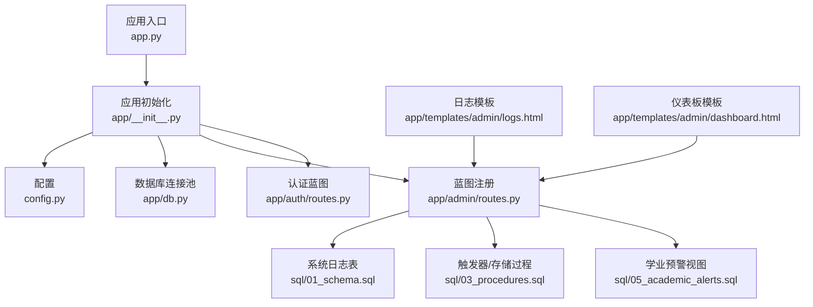
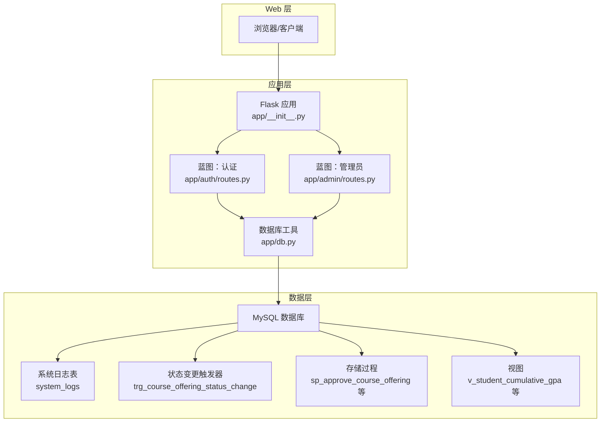
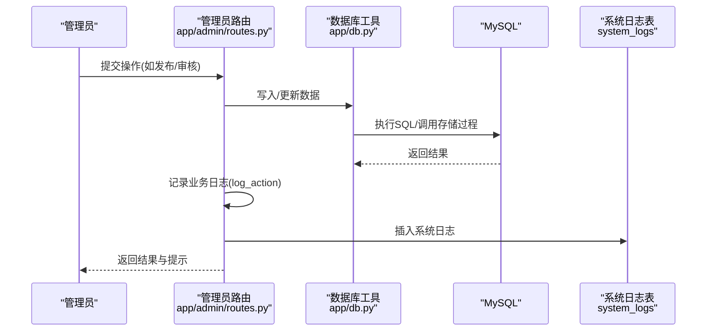
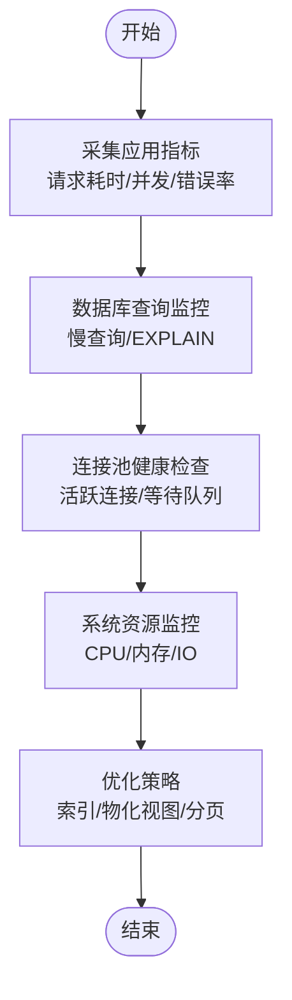
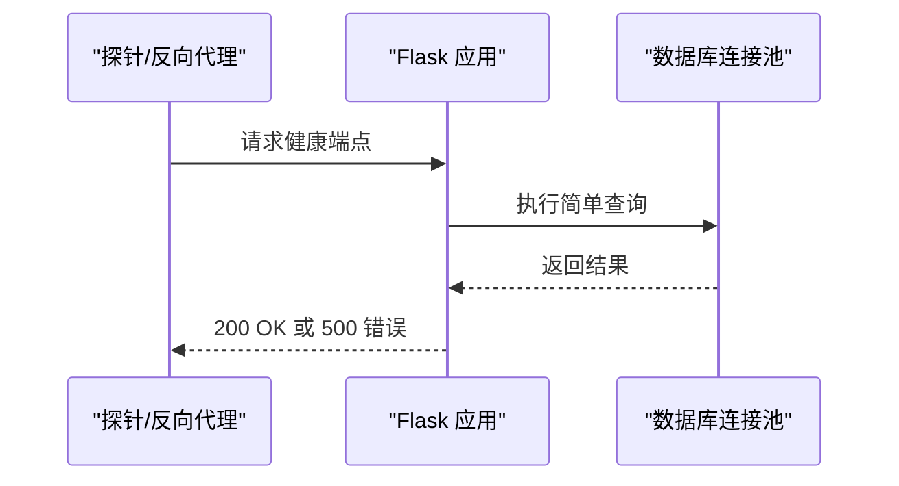
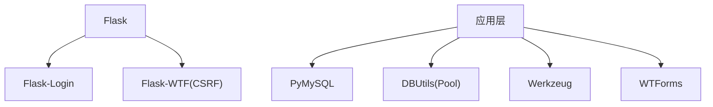
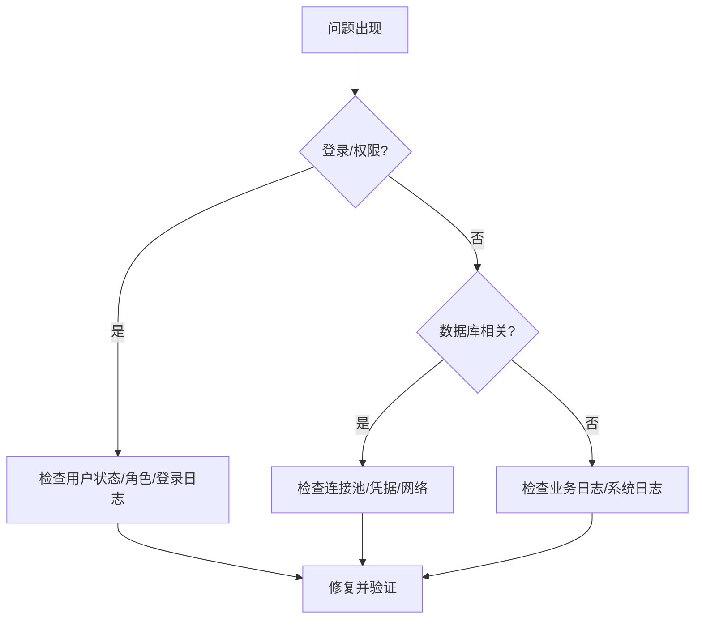

# 监控与维护

<cite>
**本文引用的文件**
- [app.py](file://app.py)
- [config.py](file://config.py)
- [app/__init__.py](file://app/__init__.py)
- [app/db.py](file://app/db.py)
- [app/admin/routes.py](file://app/admin/routes.py)
- [app/auth/routes.py](file://app/auth/routes.py)
- [app/decorators.py](file://app/decorators.py)
- [app/helpers.py](file://app/helpers.py)
- [app/templates/admin/logs.html](file://app/templates/admin/logs.html)
- [app/templates/admin/dashboard.html](file://app/templates/admin/dashboard.html)
- [sql/01_schema.sql](file://sql/01_schema.sql)
- [sql/03_procedures.sql](file://sql/03_procedures.sql)
- [sql/05_academic_alerts.sql](file://sql/05_academic_alerts.sql)
- [requirements.txt](file://requirements.txt)
- [README.md](file://README.md)
</cite>

## 目录
1. [简介](#简介)
2. [项目结构](#项目结构)
3. [核心组件](#核心组件)
4. [架构总览](#架构总览)
5. [详细组件分析](#详细组件分析)
6. [依赖分析](#依赖分析)
7. [性能考虑](#性能考虑)
8. [故障排查指南](#故障排查指南)
9. [结论](#结论)
10. [附录](#附录)

## 简介
本指南面向“学生信息管理系统”的运维与开发团队，围绕监控与维护主题，系统化地给出日志管理、性能监控、健康检查、备份恢复、安全监控以及维护任务自动化等实践建议。文档基于现有代码库进行分析，结合数据库层、应用层与模板层的实现，提出可落地的运维策略。

## 项目结构
系统采用 Flask 应用与 MySQL 数据库的典型分层架构：
- 应用入口与配置：应用入口负责启动服务；配置类集中管理数据库连接、分页、权重与阈值等参数。
- 应用初始化：注册蓝图、初始化数据库连接池、Flask-Login、CSRF 保护与错误处理。
- 数据库层：封装连接池、查询、分页、存储过程调用等通用能力。
- 控制器层：按角色划分蓝图（认证、管理员、教师、学生），承载业务逻辑与日志记录。
- 日志与模板：系统日志表与前端日志展示页面，便于审计与问题定位。
- SQL 脚本：包含建表、存储过程、触发器、视图与学业预警相关定义。

**图表来源**
- [app.py:1-13](file://app.py#L1-L13)
- [app/__init__.py:29-93](file://app/__init__.py#L29-L93)
- [config.py:6-36](file://config.py#L6-L36)
- [app/db.py:10-26](file://app/db.py#L10-L26)
- [app/admin/routes.py:14-18](file://app/admin/routes.py#L14-L18)
- [app/auth/routes.py:33-57](file://app/auth/routes.py#L33-L57)
- [sql/01_schema.sql:218-234](file://sql/01_schema.sql#L218-L234)
- [sql/03_procedures.sql:363-378](file://sql/03_procedures.sql#L363-L378)
- [sql/05_academic_alerts.sql:11-36](file://sql/05_academic_alerts.sql#L11-L36)
- [app/templates/admin/logs.html:1-23](file://app/templates/admin/logs.html#L1-L23)
- [app/templates/admin/dashboard.html:11-29](file://app/templates/admin/dashboard.html#L11-L29)

**章节来源**
- [app.py:1-13](file://app.py#L1-L13)
- [app/__init__.py:29-93](file://app/__init__.py#L29-L93)
- [config.py:6-36](file://config.py#L6-L36)
- [README.md:12-36](file://README.md#L12-L36)

## 核心组件
- 应用入口与运行参数：从配置加载调试模式、主机与端口，支持环境变量覆盖。
- 应用初始化：注册蓝图、初始化数据库连接池并在请求结束时关闭连接、设置登录管理器与错误处理。
- 数据库连接池：使用 DBUtils 连接池，统一配置最小/最大缓存与最大连接数，提供查询、写入、分页与存储过程调用工具。
- 日志记录：通过 helpers.log_action 在业务关键点记录系统日志，模板层提供日志列表与筛选。
- 角色权限：装饰器与蓝图前置检查确保访问控制。
- 学业预警与统计：通过视图与存储过程提供预警列表与统计分析。

**章节来源**
- [app.py:7-12](file://app.py#L7-L12)
- [app/__init__.py:35-51](file://app/__init__.py#L35-L51)
- [app/db.py:10-26](file://app/db.py#L10-L26)
- [app/admin/routes.py:585-609](file://app/admin/routes.py#L585-L609)
- [app/helpers.py](file://app/helpers.py)
- [app/decorators.py:7-25](file://app/decorators.py#L7-L25)
- [sql/05_academic_alerts.sql:11-36](file://sql/05_academic_alerts.sql#L11-L36)

## 架构总览
系统采用“Web 层 + 应用层 + 数据层”三层结构，配合 MySQL 的触发器与存储过程实现部分业务规则与审计日志的自动落盘。

**图表来源**
- [app/__init__.py:54-64](file://app/__init__.py#L54-L64)
- [app/auth/routes.py:33-57](file://app/auth/routes.py#L33-L57)
- [app/admin/routes.py:414-431](file://app/admin/routes.py#L414-L431)
- [app/db.py:43-80](file://app/db.py#L43-L80)
- [sql/01_schema.sql:218-234](file://sql/01_schema.sql#L218-L234)
- [sql/03_procedures.sql:363-378](file://sql/03_procedures.sql#L363-L378)
- [sql/05_academic_alerts.sql:11-36](file://sql/05_academic_alerts.sql#L11-L36)

## 详细组件分析

### 日志管理策略
- 系统日志表：包含用户、操作类型、目标类型/ID、详情与时间戳，支持按用户、操作类型、时间筛选。
- 触发器审计：课程开课状态变更时自动写入系统日志，避免遗漏。
- 业务日志：管理员路由在关键操作（新增/编辑/删除/发布/审核）前后记录日志。
- 访问日志：当前应用未内置 Web 服务器访问日志记录，建议通过反向代理或 WSGI 中间件补充。
- 错误日志：应用错误处理器返回对应页面，建议结合日志系统统一采集与告警。
- 日志轮转：建议使用操作系统日志轮转工具对应用与数据库日志进行定期轮转与归档。

**图表来源**
- [app/admin/routes.py:414-431](file://app/admin/routes.py#L414-L431)
- [app/admin/routes.py:585-609](file://app/admin/routes.py#L585-L609)
- [app/db.py:43-80](file://app/db.py#L43-L80)
- [sql/01_schema.sql:218-234](file://sql/01_schema.sql#L218-L234)

**章节来源**
- [sql/01_schema.sql:218-234](file://sql/01_schema.sql#L218-L234)
- [sql/03_procedures.sql:363-378](file://sql/03_procedures.sql#L363-L378)
- [app/admin/routes.py:585-609](file://app/admin/routes.py#L585-L609)
- [app/auth/routes.py:33-57](file://app/auth/routes.py#L33-L57)

### 性能监控方法
- 应用性能指标：建议集成 WSGI/应用服务器指标采集（如进程数、请求耗时、并发数），并结合业务关键路径埋点（如存储过程调用耗时）。
- 数据库查询监控：利用慢查询日志、性能模式与 EXPLAIN 分析热点 SQL；对分页查询与聚合视图进行压测。
- 系统资源监控：监控 CPU、内存、磁盘 IO 与连接池使用率，结合数据库连接池参数（最小缓存、最大缓存、最大连接）评估容量。
- 分页与统计：系统已提供分页工具与统计视图，建议对高频查询建立索引与物化视图以降低负载。

**图表来源**
- [app/db.py:92-120](file://app/db.py#L92-L120)
- [sql/05_academic_alerts.sql:11-36](file://sql/05_academic_alerts.sql#L11-L36)

**章节来源**
- [app/db.py:92-120](file://app/db.py#L92-L120)
- [config.py:19-25](file://config.py#L19-L25)

### 健康检查机制
- 服务可用性检查：通过 GET 根路径或专门的健康端点返回 200/500，结合反向代理心跳探测。
- 数据库连接检查：在应用启动时尝试连接并执行简单查询（如 SELECT 1），失败则记录错误并阻断启动。
- 关键功能测试：对登录、分页、统计视图与存储过程调用进行回归测试，确保核心链路正常。

**图表来源**
- [app/__init__.py:67-74](file://app/__init__.py#L67-L74)
- [app/db.py:43-50](file://app/db.py#L43-L50)

**章节来源**
- [app/__init__.py:67-74](file://app/__init__.py#L67-L74)
- [app/db.py:43-50](file://app/db.py#L43-L50)

### 备份恢复方案
- 数据库备份策略：采用全量+增量备份，结合二进制日志（binlog）实现时间点恢复；定期校验备份完整性。
- 文件备份：对配置文件、日志目录与静态资源进行版本化备份。
- 灾难恢复流程：制定恢复步骤清单（停机窗口、回滚计划、数据一致性校验与业务验证）。

[本节为通用运维实践，不直接分析具体文件，故无“章节来源”]

### 安全监控
- 访问审计：系统日志记录用户操作，建议结合 IP 字段与会话追踪，识别异常登录与高危操作。
- 异常行为检测：基于日志统计异常频率（如短时间内大量失败登录、批量删除操作）触发告警。
- 安全事件响应：建立事件分级与处置流程，包括隔离、溯源、修复与复盘。

**章节来源**
- [sql/01_schema.sql:227-228](file://sql/01_schema.sql#L227-L228)
- [app/auth/routes.py:33-57](file://app/auth/routes.py#L33-L57)

### 维护任务自动化
- 日志清理：定期清理过期系统日志（按时间阈值），保留审计周期内的完整记录。
- 缓存清理：若引入外部缓存（Redis/Memcached），需制定过期与淘汰策略。
- 数据库维护：定期执行 ANALYZE/TABLE OPTIMIZE、重建索引与统计信息更新，监控碎片率与锁等待。

**章节来源**
- [app/admin/routes.py:585-609](file://app/admin/routes.py#L585-L609)
- [sql/01_schema.sql:218-234](file://sql/01_schema.sql#L218-L234)

## 依赖分析
- 外部依赖：Flask、Flask-Login、Flask-WTF、PyMySQL、DBUtils、Werkzeug、WTForms。
- 数据库驱动：PyMySQL + DBUtils 连接池。
- 前端技术：Bootstrap 5 + Jinja2 + Chart.js。

**图表来源**
- [requirements.txt:1-8](file://requirements.txt#L1-L8)

**章节来源**
- [requirements.txt:1-8](file://requirements.txt#L1-L8)
- [README.md:5-10](file://README.md#L5-L10)

## 性能考虑
- 连接池参数：根据峰值并发与平均事务时长调整最小缓存、最大缓存与最大连接数，避免连接不足或过度占用。
- 查询优化：对高频分页与聚合查询建立合适索引；对复杂视图进行物化或预计算。
- 存储过程：将计算密集型逻辑下沉到数据库，减少网络往返与应用侧处理。
- 分页策略：合理设置每页大小与总数估算，避免大偏移导致的性能问题。

**章节来源**
- [config.py:19-25](file://config.py#L19-L25)
- [app/db.py:92-120](file://app/db.py#L92-L120)

## 故障排查指南
- 登录失败：检查用户状态、密码哈希与最后登录时间更新；查看系统日志中的登录记录。
- 权限拒绝：确认用户角色与蓝图前置检查是否生效。
- 数据库连接异常：检查连接池初始化、主机/端口/凭据与网络连通性。
- 日志缺失：确认业务日志记录调用与系统日志表写入是否成功；检查触发器是否正确创建。

**图表来源**
- [app/auth/routes.py:33-57](file://app/auth/routes.py#L33-L57)
- [app/admin/routes.py:585-609](file://app/admin/routes.py#L585-L609)
- [app/db.py:10-26](file://app/db.py#L10-L26)

**章节来源**
- [app/auth/routes.py:33-57](file://app/auth/routes.py#L33-L57)
- [app/admin/routes.py:585-609](file://app/admin/routes.py#L585-L609)
- [app/db.py:10-26](file://app/db.py#L10-L26)

## 结论
本指南基于现有代码结构，提出了系统化的监控与维护实践：完善访问日志采集、强化数据库与应用性能观测、建立健康检查与备份恢复流程、加强安全审计与异常检测，并通过自动化手段提升运维效率。建议在生产环境中逐步落地上述策略，持续迭代优化。

## 附录
- 快速启动与数据库初始化参考 README 的安装与初始化步骤。
- 配置项参考 config.py 中的数据库连接、连接池与业务阈值参数。

**章节来源**
- [README.md:12-36](file://README.md#L12-L36)
- [config.py:6-36](file://config.py#L6-L36)